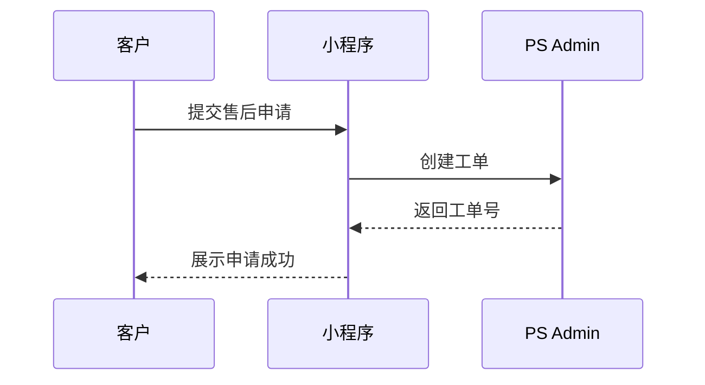
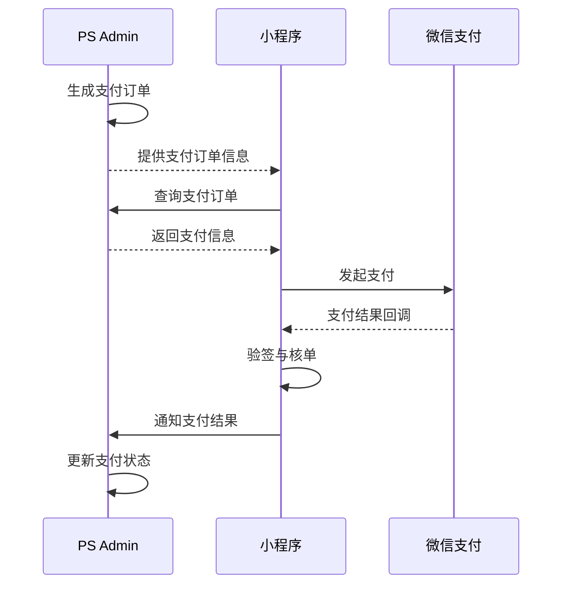
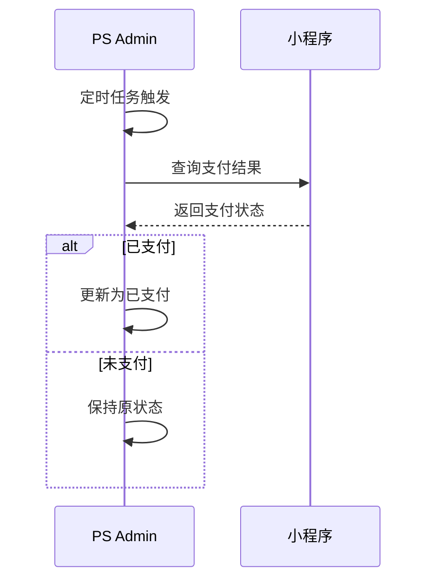
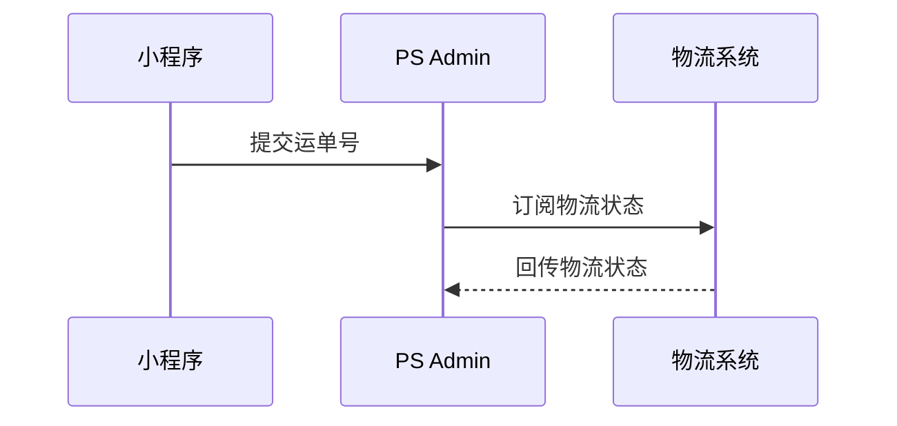
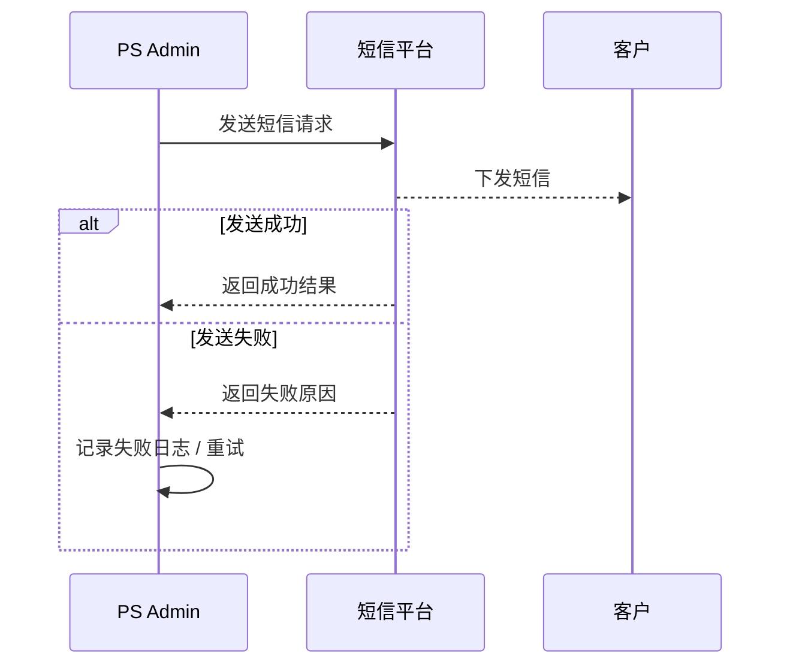
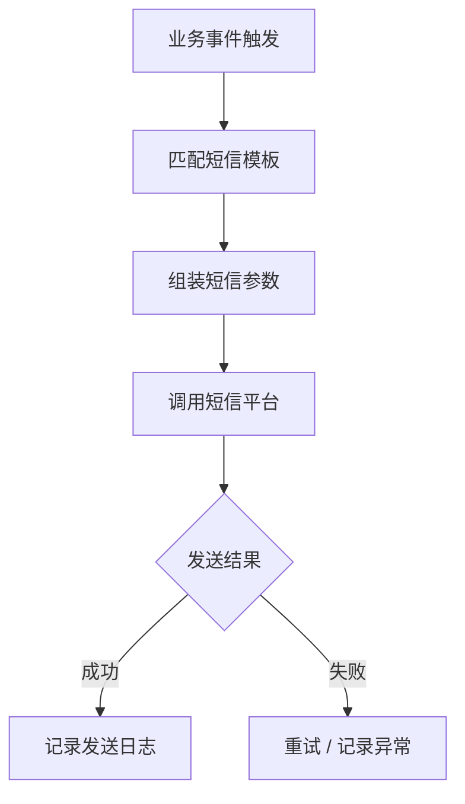
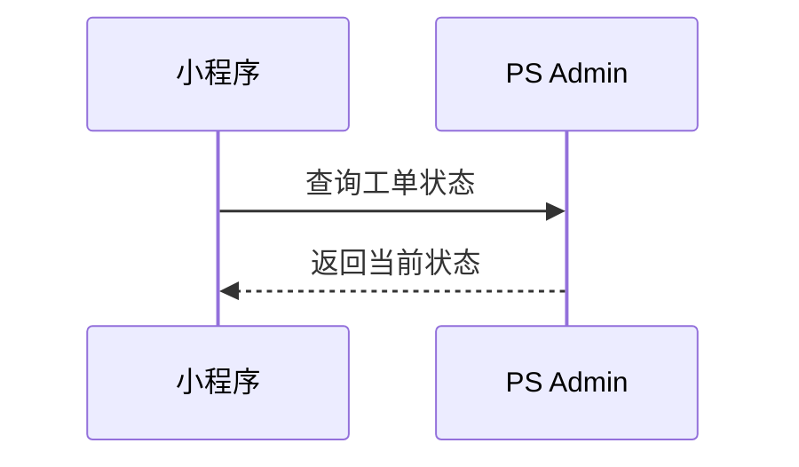
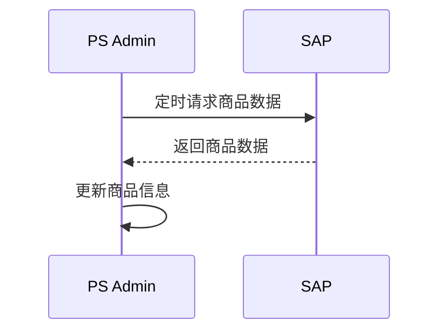

# 1 范围说明

本系统涉及以下系统间协同：

- 小程序（用户入口 / 支付发起）
    
- PS Admin（核心系统）
    
- SAP（库存 / 出库 / 财务）
    
- 物流系统（顺丰等）
    
- 微信支付
    

协同方式包括：

- 同步接口调用
    
- 异步回调 / 通知
    
- 状态查询与结果回写
    
- 定时任务补偿
    

# 2 售后申请与工单同步




## 2.1 创建售后工单接口

**接口地址：** `/api/admin/tickets`  
**请求方式：** POST  
**提供方：** PS Admin  
**调用方：** 小程序

#### 请求参数

|字段名|类型|必填|说明|
|---|---|---|---|
|customerName|string|是|客户姓名|
|mobile|string|是|手机号|
|productId|string|是|产品ID|
|problemDesc|string|是|问题描述|

#### 返回参数

|字段名|类型|说明|
|---|---|---|
|code|string|返回码|
|ticketNo|string|工单号|


# 3 支付协同



**PS Admin 负责**

1. **生成待支付订单**  
    当工单判定为需要支付时，由 PS Admin 生成待支付订单，记录订单号、关联工单、应付金额及支付状态。
    
2. **提供待支付订单查询接口**  
    提供接口供微信小程序/支付侧查询待支付订单信息，包括订单号、金额、支付状态、业务单号等。
    
3. **提供支付结果回写接口**  
    提供支付结果回写接口，供小程序支付侧在支付完成并完成验签核单后，将最终支付结果同步至 PS Admin。
    
4. **根据支付结果更新工单状态**  
    在收到支付结果后，更新支付单状态，并根据业务规则同步更新工单状态、支付时间、支付流水号等信息。
    
5. **提供异常补偿处理能力**  
    当支付结果回写失败或状态不一致时，支持通过补偿机制重新获取支付结果并修正业务状态。
    

**微信小程序 / 支付侧负责**

1. **查询待支付订单**  
    通过调用 PS Admin 提供的查询接口，获取当前工单对应的待支付订单信息。
    
2. **调起微信支付**  
    基于待支付订单信息，由支付侧生成支付参数，并在微信小程序中发起支付。
    
3. **接收微信支付回调**  
    接收微信支付返回的异步支付通知，作为支付结果确认的来源。
    
4. **验签、核单**  
    对微信支付回调结果进行验签、金额校验、订单校验，确认支付结果真实有效。
    
5. **通知 PS Admin 最终支付结果**  
    在确认支付成功或失败后，通过支付结果回写接口，将最终支付结果同步给 PS Admin。
    
6. **提供支付结果查询接口**  
    提供支付结果查询接口，供 PS Admin 在支付结果回写失败或状态异常时，通过定时任务主动查询支付状态，进行补单和状态修正。

**支付状态同步原则**

1. **支付最终结果以支付侧验签核单后的结果为准**  
    小程序前端展示结果不能作为最终支付确认依据，必须以支付侧接收到微信支付异步通知并完成验签核单后的结果为准。
    
2. **PS Admin 以支付结果回写作为主同步方式**  
    正常情况下，由支付侧主动将支付结果回写至 PS Admin，作为主链路。
    
3. **PS Admin 以主动查询作为补偿机制**  
    当支付结果回写失败、超时或双方状态不一致时，由 PS Admin 通过定时任务调用支付侧查询接口，获取实际支付状态并完成补单与状态修正。
    
4. **双方均需支持幂等处理**  
    无论是支付结果回写还是补偿查询，同一支付订单多次通知时，系统都应保证重复处理不会造成状态错误或数据重复更新。


## 3.1 查询待支付订单

**接口地址：** `/api/admin/payment-orders/{ticketNo}`  
**请求方式：** GET  
**提供方：** PS Admin  
**调用方：** 小程序

#### 返回参数

|字段名|类型|说明|
|---|---|---|
|paymentNo|string|支付单号|
|amount|decimal|金额|
|status|string|支付状态|


## 3.2 支付结果回写

**接口地址：** `/api/admin/payment-orders/notify`  
**请求方式：** POST  
**提供方：** PS Admin  
**调用方：** 小程序

#### 请求参数

|字段名|类型|必填|说明|
|---|---|---|---|
|paymentNo|string|是|支付单号|
|status|string|是|SUCCESS / FAIL|
|paidTime|datetime|否|支付时间|
|transactionId|string|否|支付流水号|


## 3.3 支付结果查询（补单）

**接口地址：** `/api/miniapp/payment-orders/{paymentNo}`  
**请求方式：** GET  
**提供方：** 小程序  
**调用方：** PS Admin


## 3.4 补偿机制时序图




# 4 物流协同




## 4.1 提交运单号接口

**接口地址：** `/api/admin/logistics`  
**请求方式：** POST  
**提供方：** PS Admin  
**调用方：** 小程序

#### 请求参数

|字段名|类型|必填|说明|
|---|---|---|---|
|ticketNo|string|是|工单号|
|trackingNo|string|是|运单号|

**物流订阅**

```text
考虑到用户寄件可能选择不同的物流公司，他们的消息订阅方式都不一样，需要确认
```


# 5 SAP协同

```text
需要确认SAP接口
```


# 6 短信协同



## 6.1 短信发送接口（sendSms）

**接口地址：** `等待提供接口`  
**请求方式：** POST  
**提供方：** 短信平台  
**调用方：** PS Admin

#### 请求参数

|字段名|类型|必填|说明|
|---|---|---|---|
|mobile|string|是|手机号|
|templateCode|string|是|短信模板编码|
|params|object|否|模板变量参数|

## 6.2 短信发送触发规则

```text
需要确认短信接口
```


## 6.3 短信发送机制



## 6.4 设计约束

- 短信发送需支持模板化配置
    
- 所有发送记录需落库（成功/失败）
    
- 失败需支持重试机制
    
- 同一事件需支持幂等控制（避免重复发送）
    

# 7 工单状态同步



## 7.1 查询工单状态接口

**接口地址：** `/api/admin/tickets/{ticketNo}/status`  
**请求方式：** GET  
**提供方：** PS Admin  
**调用方：** 小程序


# 8 SAP商品同步



```text
需要确认SAP接口
```


# 9 问卷结果回写接口

## 9.1 提交问卷结果接口
小程序端完成问卷生成、展示及填写后，将问卷结果提交至 PS Admin。  
PS Admin 仅负责接收并存储问卷数据，不参与问卷生成、展示及管理。

**接口地址：** `/api/admin/submitSurveyResult`  
**请求方式：** POST  
**提供方：** PS Admin  
**调用方：** 小程序

### 请求参数

|字段名|类型|必填|说明|示例|
|---|---|---|---|---|
|ticket_no|string|是|工单编号|ST20260320001|
|survey_title|string|是|问卷题目|售后服务满意度调查|
|deadline_at|datetime|否|问卷截止日期|2026-03-30 23:59:59|
|repair_content|string|否|维修内容|更换镜腿|
|content|string|否|问卷填写内容|服务很好|
|score|int|否|评分（1-5）|5|

### 返回参数

|字段名|类型|说明|
|---|---|---|
|success|boolean|是否成功|
|message|string|返回信息|


