# 售后系统需求说明（客户评审版）

---

# 1. 项目背景与目标

为支撑中国区售后业务发展，需要建设一套统一的售后管理系统，实现售后服务全流程的标准化管理与多系统协同。

系统建设目标：

- 建立统一的售后流程与状态管理体系
- 提升售后工单处理效率
- 打通小程序、SAP、物流及支付系统
- 提供清晰的服务进度与客户交互能力
- 支撑售后数据统计与运营分析

---

# 2. 业务范围与系统边界

## 2.1 业务范围

系统覆盖售后服务完整流程：

申请 → 受理 → 收货 → 检测 → 判定 → 处理 → 出库 → 履约 → 完成

支持以下业务场景：

- 维修（有偿 / 无偿）
- 产品更换（同品 / 他品）
- 合作厂家 / 3PL 处理
- 无法修理 / 假货处理
- 异常处理（支付 / 库存 / 物流等）
- 服务完成后的问卷与回访

---

## 2.2 系统边界

|业务环节|责任系统|说明|
|---|---|---|
|申请|小程序 / 门店|用户或门店发起|
|流程控制|PS Admin|核心系统|
|支付|小程序 + 支付系统|完成支付|
|库存|SAP|库存与出入库|
|物流|物流系统|配送与签收|

说明：

- PS Admin 负责流程驱动与状态管理
- 外部系统负责具体业务执行
- 各系统通过接口进行数据协同

---

# 3. 售后整体流程

## 3.1 主流程总览

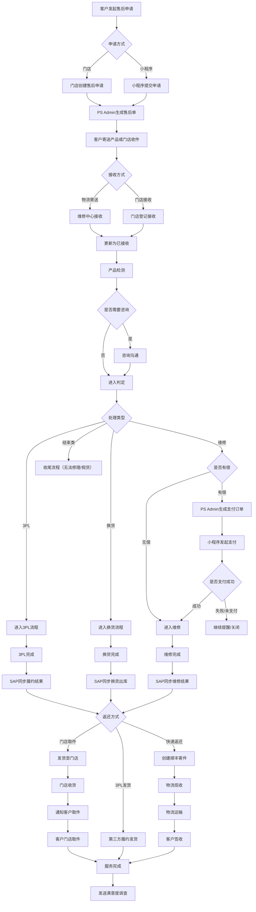

---

## 3.2 流程说明

客户通过小程序或门店发起售后申请，PS Admin 生成工单并完成收件与检测。

根据检测结果，工单进入维修（有偿需先支付）、换货、3PL处理或直接结束。

处理完成后同步 SAP，并通过快递或门店完成交付。

客户签收后流程结束，系统发送满意度调查。

---

## 3.3 关键分支流程

### 3.3.1 申请流程

用户提交售后申请后生成工单，寄件并被维修中心签收入库后进入检测阶段。  
售后申请支持两种入口：

- 小程序申请
    
- 门店申请
    

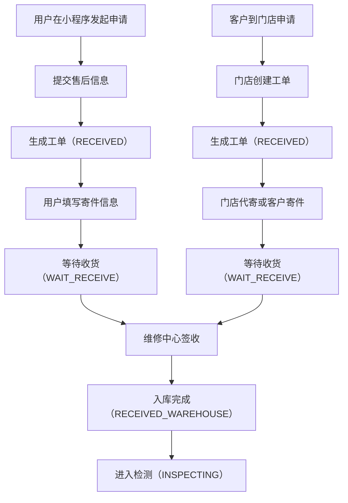

说明：

- 小程序与门店为两个申请入口，但统一由 PS Admin 生成工单
    
- 进入检测前必须完成签收与入库
    
- 申请流程结束后，工单进入检测主流程
    

### 3.3.2 产品接收流程

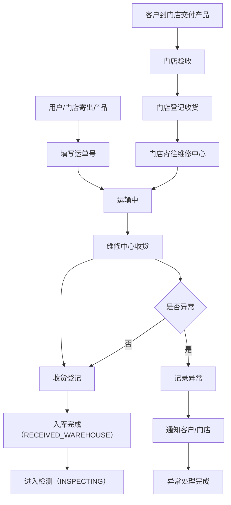

说明：

- 快递寄送与门店直收两种收货方式最终汇合为维修中心收货
    
- 产品收货异常需单独记录，并通知相关方
    
- 收货完成后进入检测状态
    

### 3.3.3 检测与判定流程

检测完成后进入判定，根据不同结果流转到不同处理路径。

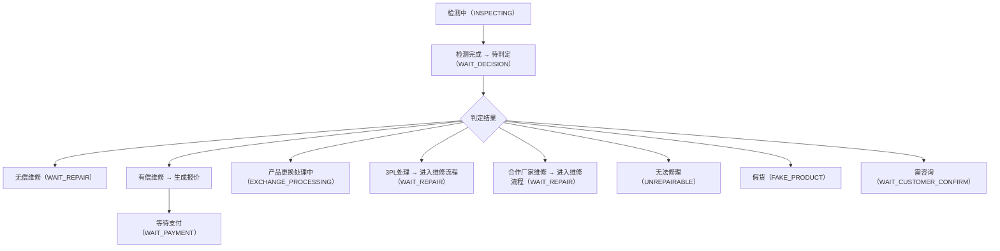

说明：

- 检测完成后统一进入待判定状态
    
- 判定结果决定是否进入支付、维修、换货、关闭等不同路径
    
- 咨询为判定前后的可插入子流程
    

### 3.3.4 咨询流程

咨询状态默认值为“咨询待机”；当“咨询完成”后，状态自动返回判定节点。

在以下场景需发起咨询：

- 维修方案需客户确认
    
- 费用变更
    
- 他品交换
    
- 合作厂家延迟
    

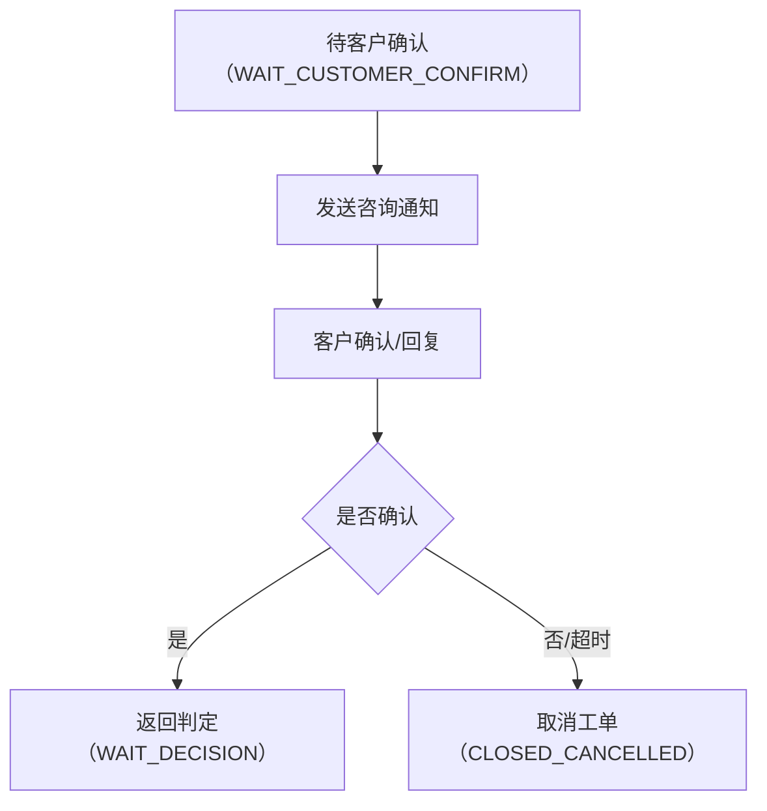

说明：

- 咨询流程本质上是判定流程中的补充确认子流程
    
- 客户确认后返回待判定状态
    
- 若拒绝或超时，可进入取消关闭
    

### 3.3.5 支付流程

当工单判定为有偿维修场景时，系统进入支付流程。

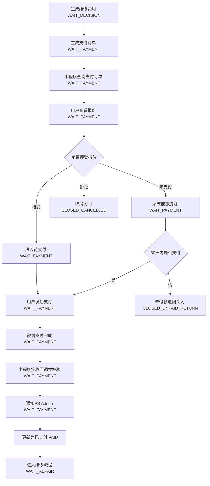

说明：

- 支付流程是有偿场景的独立子流程
    
- 支付成功后并不直接进入维修中，而是先进入待维修状态
    
- 未支付和拒绝报价对应不同关闭路径
    

### 3.3.6 维修执行流程

若为 “无偿”：判定完成 +D3 后状态自动变更为 “维修进行中”；
若为 “有偿”：付款完成 +D3 后状态自动变更为 “维修进行中”；
若为 “3PL”：付款完成 +D1 后状态自动变更为 “维修进行中”。

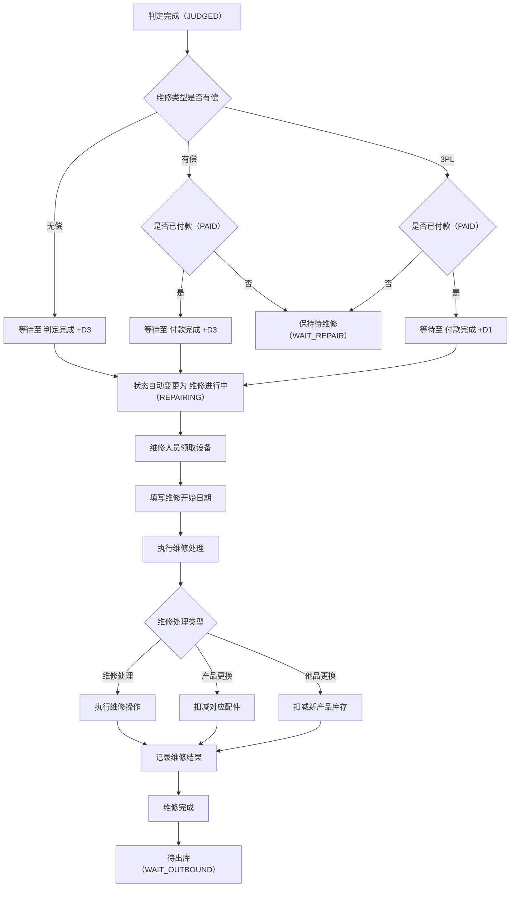

说明：

- 待维修状态用于承接支付完成或无偿判定完成后的统一入口
    
- 满足时间规则后进入维修中
    
- 维修完成后进入待出库，而不是直接出库
    

### 3.3.7 配件与库存处理流程

在维修处理过程中，若涉及配件更换，系统需执行配件选择、库存校验及配件消耗记录等操作。  
该流程作为维修流程中的子流程执行。

1. 配件选择规则  
    维修人员可对系统默认配件进行确认、修改、新增或删除。
    
2. 库存校验规则  
    系统在维修完成前校验配件库存是否满足消耗需求。
    
3. 库存扣减时机  
    配件库存在“维修完成提交时”统一扣减，避免在维修过程中产生库存不一致问题。
    
4. 库存不足处理  
    当库存不足时，系统应支持：
    
    - 触发配件申请流程
        
    - 或生成库存预警
        
5. 数据记录  
    系统需记录：
    
    - 配件消耗明细
        
    - 库存变动记录
        
    - 操作人及时间
        

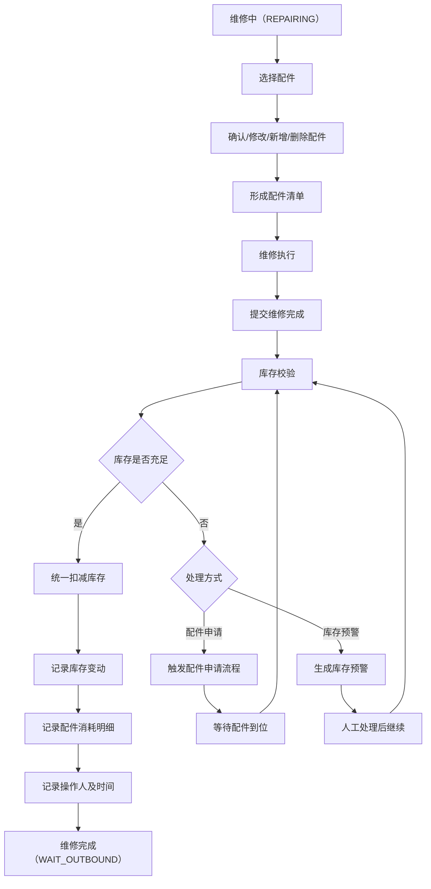

说明：

- 配件与库存流程为维修执行子流程，不单独形成主状态链
    
- 库存扣减统一发生在维修完成提交时
    
- 库存不足时需阻断维修完成提交
    

### 3.3.8 合作厂家 / 3PL 流程

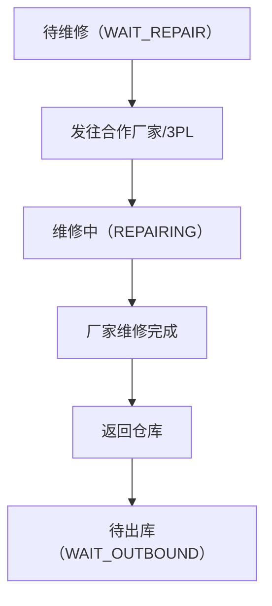

说明：

- 合作厂家 / 3PL 流程在业务上是外部执行，在系统状态上仍纳入维修主链
    
- 处理完成后统一返回待出库状态
    
- 若涉及费用，仍需先经过支付流程
    

### 3.3.9 无法修理 / 假货流程

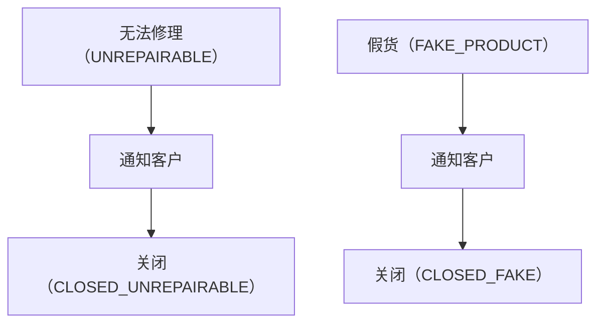

说明：

- 无法修理与假货均为终止类处理路径
    
- 需先通知客户，再进入对应关闭状态
    
- 不再进入维修、出库和完成流程
    

### 3.3.10 出库与履约流程

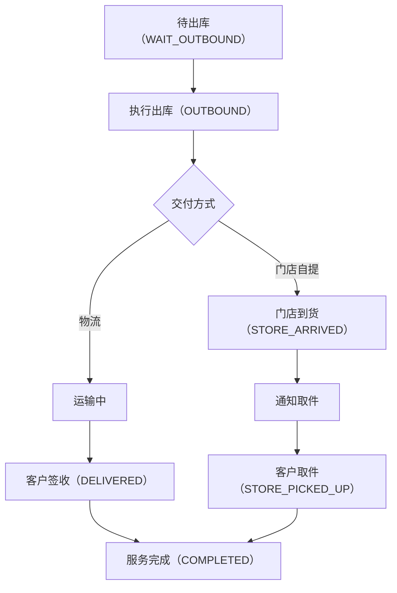

说明：

- 出库后按履约方式区分快递与门店自提
    
- 快递签收与门店取件后均进入已完成
    
- 已完成代表服务业务流程结束
    

### 3.3.11 问卷流程

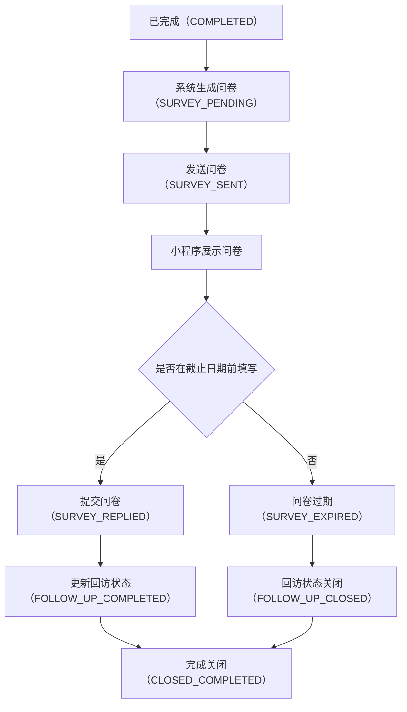

说明：

- 服务完成后，系统自动生成问卷并设置截止日期
    
- 问卷由小程序端展示，客户可在截止日期前填写
    
- 客户提交后，问卷状态变更为 **SURVEY_REPLIED**
    
- 系统需同步更新回访状态为 **已回访（FOLLOW_UP_COMPLETED）**
    
- 若客户在截止日期前未填写，问卷自动变更为 **SURVEY_EXPIRED**
    
- 超时情况下，回访状态自动关闭（FOLLOW_UP_CLOSED）
    
- 问卷流程不影响工单主状态“已完成”，但作为服务质量数据进行记录

### 3.3.12 异常处理流程

系统需支持关键异常处理：

|异常类型|处理方式|
|---|---|
|支付失败|重新发起或关闭|
|支付超时|自动关闭工单|
|库存不足|阻断流程或触发申请|
|物流异常|人工介入处理|
|数据异常|系统校验与修复|
|咨询超时|取消关闭或人工跟进|

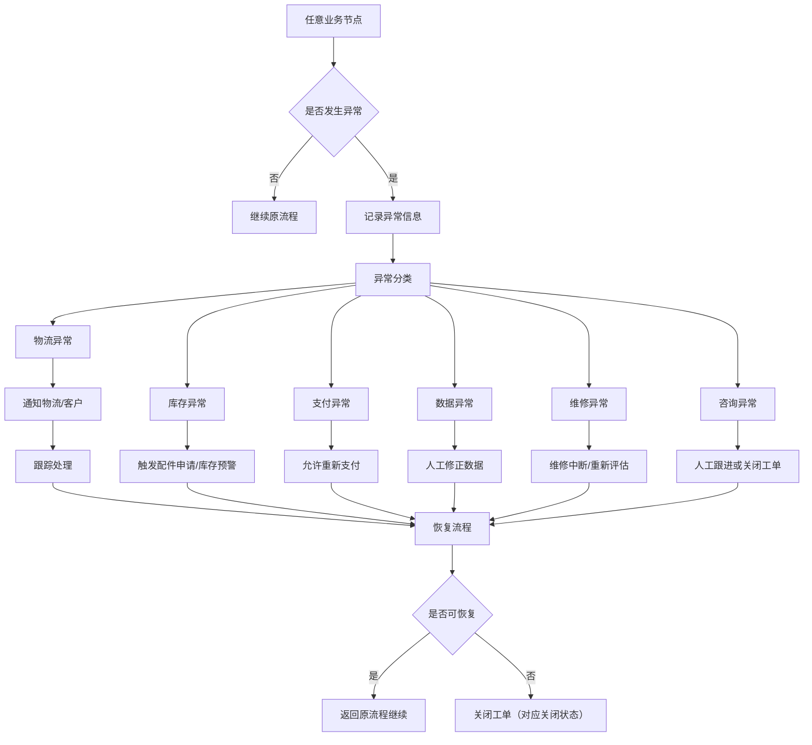

说明：

- 异常处理流程覆盖主流程各节点
    
- 异常是否可恢复，由具体异常类型和业务规则决定
    
- 无法恢复时需落到明确关闭状态，不允许悬空
    

---

# 4. 外部系统协同说明

## 4.1 小程序

主要职责：

- 用户提交售后申请
- 发起支付
- 查询工单状态
- 填写问卷

### 4.1.1 创建工单

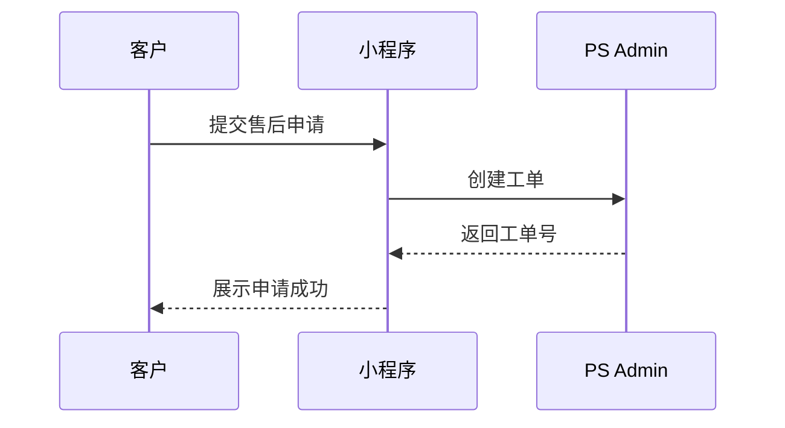

### 4.1.2 发起支付

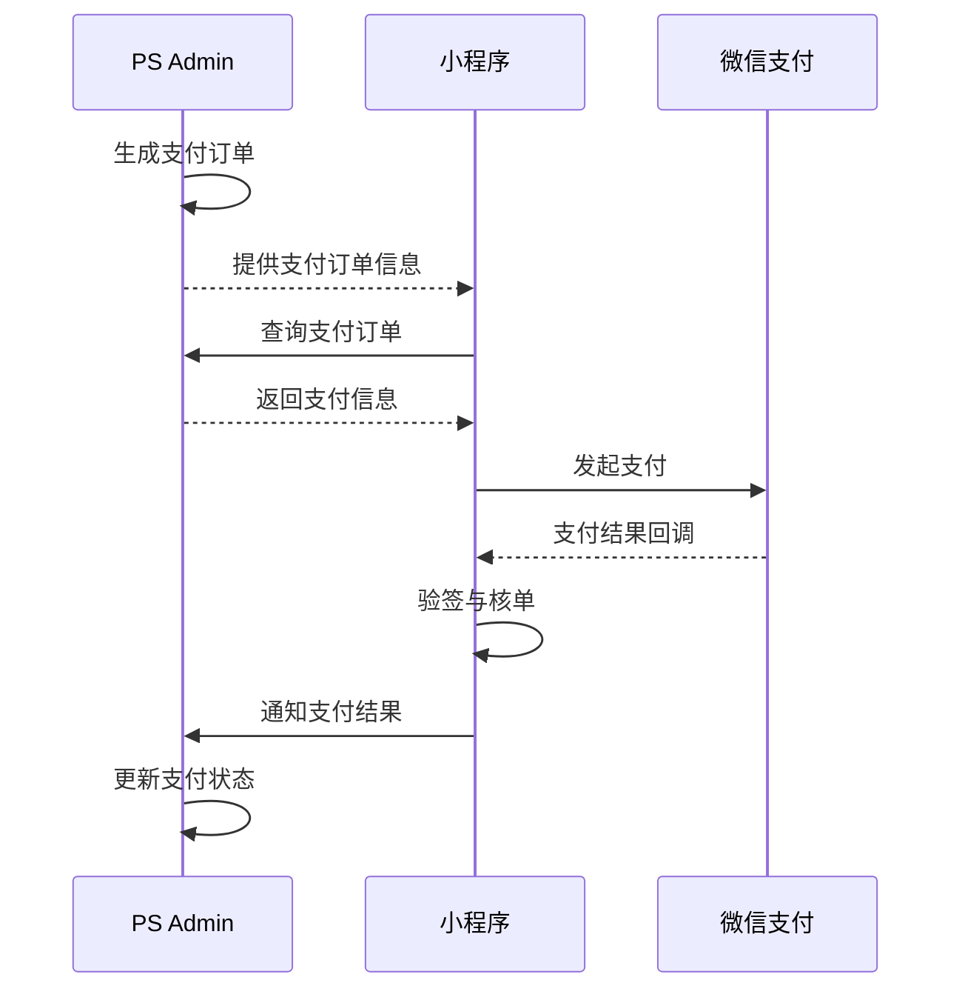

### 4.1.3 查询工单状态

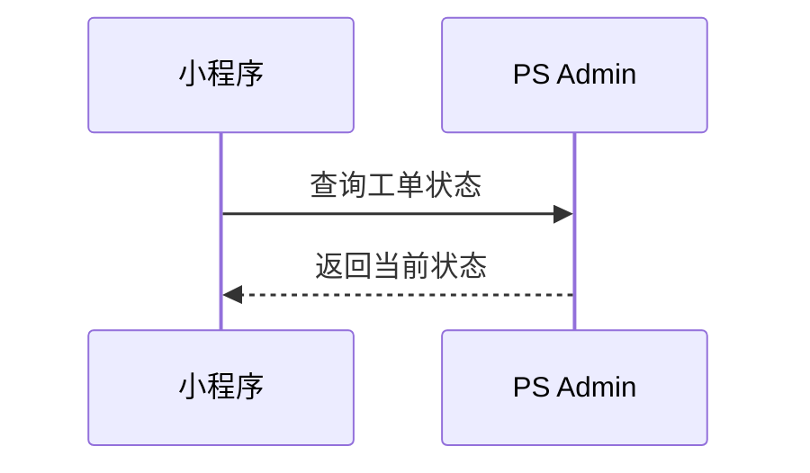

### 4.1.4 问卷调查

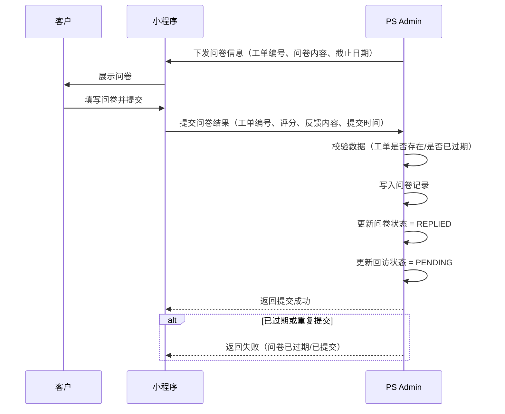
---

## 4.2 SAP

主要职责：

- 管理产品与库存主数据
- 执行库存出入库
- 提供库存数量同步
- 提供商品数据同步

---

## 4.3 物流系统

主要职责：

- 执行揽收、运输、派送
- 提供物流状态
- 提供签收结果

## 4.4 短信通知  
  
主要职责：  
  
- 向客户发送关键业务节点短信通知  
- 返回短信发送结果  
- 支持短信模板配置与变量替换  
- 支持失败重试与发送记录留痕

# 5. 功能模块设计

说明：本章按业务模块划分功能，字段用于客户评审确认，不代表最终数据库字段设计。

---

## 5.1 售后工单管理

本模块用于在系统中创建和管理售后工单，记录客户信息、产品信息、受理信息、咨询信息、维修信息、配件信息、支付信息及物流信息，并驱动售后业务流程。

### 5.1.1 工单列表

|字段名称|说明|是否必填|备注|
|---|---|---|---|
|工单编号|售后服务唯一标识|是|系统生成|
|接收日期|工单受理时间|是||
|当前状态|工单所处流程状态|是||
|本社入库日期|产品入库时间|否||
|预计出库日期|预计完成时间|否||
|受理渠道|来源（门店 / 邮寄 / 小程序）|是||
|客户姓名|客户名称|是||
|联系电话|客户联系方式|是||
|邮箱|客户邮箱|否||
|产品名称|维修产品名称|是||
|维修执行方|维修主体（总部 / 合作方 / 3PL）|是||
|维修内容|维修项目|否||
|运单号|物流编号|否||
|付款日期|支付完成时间|否||
|出库方式|配送方式|是|快递 / 门店|
|出库完成日期|实际出库时间|否||
|SO文件编号|关联 SAP 单据|否||

**系统支持**

1. 所有字段可进行搜索。
2. 在条码搜索栏扫描后跳转到详情页面。
3. 点击「+」按钮可新建工单。
4. 点击「Edit」按钮可批量修改数据（状态、服务工程师）。
5.  Excel 导出。
6. 删除工单
7. 发票打印
---

### 5.1.3 工单详情

#### （1）顶部信息

|字段名称|说明|是否必填|备注|
|---|---|---|---|
|工单编号|售后服务工单唯一编号|是||
|SO文件编号|关联 SAP SO 文件编号|否|SO 文件编号需与SAP系统对接。|
|当前状态|工单当前流程状态|是||
|原工单编号|原始 / 关联工单编号|否||
|消息通知模板|通知消息模板|否||
|电子邮件模板|邮件模板|否||
|历史记录入口|查看工单操作历史|否|页面操作入口|
|判定负责人|当前判定负责人|否||
|判定负责人ID|判定负责人标识|否||

---

#### （2）客户信息

|字段名称|说明|是否必填|备注|
|---|---|---|---|
|客户姓名|客户名称|是||
|电话号码|联系方式|是||
|国家|客户国家|否||
|邮箱|邮箱地址|否||
|收货类型|门店 / 快递|是||
|收货地址|收货地址|否||

备注：
当收货类型为“门店”且收货信息为门店时，应同时显示门店地址地图。
进行 3PL 出库并传输至 SAP、WMS 系统时，地址信息应为门店地址。

---

#### （3）受理信息

|字段名称|说明|是否必填|备注|
|---|---|---|---|
|接收日期|受理时间|是|接收日期为客户实际提交日期|
|受理渠道类型|门店 / 邮寄|是||
|受理渠道|具体受理来源|否||
|受理门店|受理门店名称|否||
|是否再维修|是否重复维修|否||
|是否紧急维修|是否加急|否|当“是否再维修”为 Y 或维修内容为“产品更换”时，“是否紧急维修”自动更新为 Y。|
|是否有购买凭证|是否提供购买凭证|否||
|是否附保修卡|是否提供保修卡|否||
|购买日期|产品购买日期|否||
|购买渠道|购买来源渠道|否||
|客户请求事项|客户诉求说明|否||

---

#### （4）受理附件信息

|字段名称|说明|是否必填|备注|
|---|---|---|---|
|文件名称|附件文件名称|否||
|标题|附件标题|否||
|文件类型|附件类型|否||
|文件大小|附件大小|否||
|上传时间|附件上传时间|否||
|上传人|附件上传人员|否||
|修改时间|最近修改时间|否||
|修改人|最近修改人员|否||

---

#### （5）产品信息

|字段名称|说明|是否必填|备注|
|---|---|---|---|
|产品名称|产品名称|是||
|产品ID|产品唯一标识|是||
|类别|产品分类|否||
|库存状态|库存状态|否||
|上市日期|产品上市日期|否||
|生产工厂|生产工厂|否||

---

#### （6）咨询信息

|字段名称|说明|是否必填|备注|
|---|---|---|---|
|是否需要咨询|是否触发咨询流程|是||
|咨询单号|咨询记录编号|否||
|外呼类型|咨询 / 外呼分类|否||
|咨询负责人|处理负责人|否||
|咨询状态|待确认 / 已完成|是||
|咨询日期|发起时间|否||
|异常分类|咨询相关异常分类|否||

**系统支持：**

1. 条码打印
2. 库存申请
3. 工单复制时，客户、受理、咨询、产品信息需一并复制。
4. 复制工单中“原工单”字段需显示原工单编号。
5. 在消息（通知短信）中选择自动或手动模板（具备模板搜索功能），点击发送后，消息会自动推送至客户。
6. 附件信息支持图片上传联动及图片生成/删除按钮
7. 咨询信息选择OUTBOUND类型时，“是否希望咨询”自动更新为 Y，并在咨询界面生成咨询工单。

---

#### （7）维修信息

1. SAP 拉取价格时自动标记为“有偿”；
    
2. 未拉取价格直接保存时默认“免费”；
    
3. 原为“有偿”后改为“免费”时，维修费用自动为 0，并取消价格判定。

4. 输入“问题现象”时，“是否产品问题”自动更新为 Y。

| 字段名称    | 说明         | 是否必填 | 备注  |
| ------- | ---------- | ---- | --- |
| 入库日期    | 产品入库时间     | 是    |     |
| 预计出库日期  | 预计完成时间     | 否    |     |
| 现象描述    | 产品现象描述     | 否    |     |
| 问题描述    | 产品问题说明     | 是    |     |
| 客户请求    | 客户需求       | 否    |     |
| 镜片类型    | 镜片类型       | 否    |     |
| 维修中心    | 维修执行地点     | 是    |     |
| 维修工程师   | 维修人员       | 否    |     |
| 维修内容    | 维修操作说明     | 是    |     |
| 维修进度日期  | 维修进度更新时间   | 否    |     |
| 合作方出库日期 | 合作方出库时间    | 否    |     |
| 合作方入库日期 | 合作方入库时间    | 否    |     |
| 再维修原因   | 重复维修原因     | 否    |     |
| 是否产品问题  | 是否属于产品质量问题 | 否    |     |
| 维修费用类型  | 有偿 / 无偿    | 是    |     |
| 维修费用    | 百分比        | 否    |     |
| 维修备注    | 补充说明       | 否    |     |

---

#### （8）配件信息

|字段名称|说明|是否必填|备注|
|---|---|---|---|
|配件名称|使用配件名称|是||
|配件类型|配件分类|是||
|数量|使用数量|是||
|单位|数量单位|否||
|标准单价|标准价格|否||
|实际单价|实际价格|否||
|总价|配件合计金额|否||
|是否收费|是否向客户收费|是||
|是否更换|是否执行更换|是||
|备注|补充说明|否||

---

#### （9）支付信息

|字段名称|说明|是否必填|备注|
|---|---|---|---|
|支付状态|待支付 / 已支付|是||
|支付日期|支付时间|否||
|支付方式|微信等支付方式|否||
|支付授权号|支付授权编号|否||
|支付流水号|支付凭证编号|否||
|最终支付请求|最终支付请求标识|否||
|支付截止日期|支付时限|否||
|支付链接|支付入口链接|否||
|是否取消支付|是否取消支付|否||

---

#### （10）物流信息

|字段名称|说明|是否必填|备注|
|---|---|---|---|
|是否出库完成|是否已发货|是||
|出库完成日期|发货时间|否||
|配送方式|快递 / 门店|是||
|配送完成情况|配送完成状态|否||
|配送日期|配送时间|否||
|物流单号|物流单号|否||
|门店提货状态|门店提货状态|否||
|门店提货日期|门店提货时间|否||

---

## 5.2 产品管理

本模块用于管理产品基础信息、库存信息及库存变动记录，作为库存管理与售后业务的基础数据来源。

### 5.2.1 数据来源说明

- 产品基础信息由 SAP 系统同步
- 库存数量由 SAP / 仓库系统同步
- 库存存放位置由 PS Admin 维护
- 系统支持定时同步与手动更新

---

### 5.2.2 产品列表

|字段名称|说明|是否必填|备注|
|---|---|---|---|
|产品ID|产品唯一标识|是||
|产品名称|产品名称|是||
|产品类别|产品分类|是||
|生产工厂1|生产来源|否||
|生产工厂2|生产来源|否||
|生产工厂3|生产来源|否||
|上市日期|产品上市时间|否||
|零件保有期限|维修配件保有周期|否||
|库存存放位置|库存位置|是|PS 维护|
|安全库存状态|库存是否低于阈值|是|自动计算|
|PS库存数量|系统库存数量|是||
|3PL库存数量|第三方库存数量|是||

系统支持：

- 产品信息查询与筛选
- 条码 / 88码识别产品
- 多产品批量出库
- Excel 导入与导出
- 库存状态查看
- 库存历史记录查询
- 工厂缺省时可手动选择工厂 + 工厂列表来源
---

### 5.2.3 库存变动记录

|字段名称|说明|是否必填|备注|
|---|---|---|---|
|交易编号|库存交易唯一编号|是||
|交易时间|发生时间|是||
|操作类型|入库 / 出库 / 调拨|是||
|产品ID|关联产品|是||
|产品名称|产品名称|是||
|数量变动|增加 / 减少数量|是||
|变动前库存|操作前库存|是||
|变动后库存|操作后库存|是||
|操作人|执行人|是||
|业务来源|来源模块|是|工单 / 库存申请等|
|备注|补充说明|否||

---

## 5.3 库存申请管理

本模块用于管理产品库存申请、调拨申请及审批流程，确保库存流转规范与可追溯。

### 5.3.1 适用场景

- 门店申请产品库存
- 维修中心申请产品
- 产品库存调拨
- 仓库补货申请

---

### 5.3.2 库存申请列表

|字段名称|说明|是否必填|备注|
|---|---|---|---|
|申请编号|库存申请唯一编号|是|系统生成|
|申请时间|提交时间|是||
|申请主体|申请来源|是|门店 / 维修中心 / 仓库|
|申请人|负责人|是||
|门店名称|申请门店|否||
|产品名称|申请产品|是||
|产品ID|产品标识|是||
|存放位置|库存位置|是||
|申请数量|申请数量|是||
|申请原因|原因说明|是|补货 / 调拨等|
|状态|申请状态|是|见状态说明|
|处理人|处理负责人|否||
|处理时间|处理时间|否||

---

### 5.3.3 库存申请详情

#### （1）基础信息

|字段名称|说明|是否必填|备注|
|---|---|---|---|
|申请编号|唯一编号|是||
|申请主体|来源|是||
|申请人|负责人|是||
|门店名称|门店|否||
|申请时间|时间|是||

---

#### （2）产品信息

|字段名称|说明|是否必填|备注|
|---|---|---|---|
|产品ID|产品标识|是||
|产品名称|名称|是||
|存放位置|库存位置|是||
|申请数量|数量|是||
|申请原因|原因|是||

---

#### （3）处理信息

|字段名称|说明|是否必填|备注|
|---|---|---|---|
|状态|当前状态|是||
|处理人|负责人|否||
|处理时间|时间|否||
|审批意见|说明|否||

---

### 5.3.4 状态流转规则

待审批 → 已通过 → 已出库 → 完成  
　　　　↘ 已拒绝

---

### 5.3.5 业务规则

1. 申请必须生成唯一编号  
2. 库存不足时需提示或限制申请  
3. 审批通过后方可执行出库  
4. 出库完成后自动记录库存变动  
5. 不同申请主体可配置不同审批流程

---

### 5.3.6 与库存联动

库存申请需与库存系统联动：

- 出库成功后自动扣减库存
- 生成库存交易记录
- 支持库存预警机制
- 支持库存审计与追溯

---

### 5.3.7 权限控制

|申请主体|是否允许|说明|
|---|---|---|
|门店|允许|需审批|
|维修中心|允许|可配置|
|仓库|允许|用于调拨|
|3PL|按配置|仅维修型允许|

---

### 5.3.8 补充说明

本模块用于统一规范产品库存申请流程，实现：

- 库存流转标准化
- 操作可追溯
- 多角色协同
- 库存与业务一致

## 5.4 小零件管理  
  
本模块用于管理维修过程中使用的小零件基础资料、数量配置及展示信息，作为小零件申请、维修配件使用及库存管理的基础数据来源。  
  
### 5.4.1 数据来源说明  
  
- 小零件基础信息由系统维护  
- 小零件库存位置由 PS Admin 维护  
- 小零件数量规则由系统配置维护  
  
---  
  
### 5.4.2 小零件列表  
  
|字段名称|说明|是否必填|备注|  
|---|---|---|---|  
|配件ID|小零件唯一标识|是||  
|配件名称|小零件名称|是||  
|配件类型|小零件分类|是||  
|数量类型|数量配置类型|否|用于不同场景数量展示|  
|数量值|默认数量值|否||  
|颜色|小零件颜色|否||  
|规格|小零件规格|否||  
|配件存放位置|库存存放位置|是||  
|状态|启用 / 停用状态|是||  
|创建时间|创建时间|否||  
|更新时间|最后更新时间|否||  
  
---  
  
### 5.4.3 小零件详情  
  
#### （1）基础信息  
  
|字段名称|说明|是否必填|备注|  
|---|---|---|---|  
|配件ID|小零件唯一标识|是||  
|配件名称|小零件名称|是||  
|配件类型|分类|是||  
|规格|规格信息|否||  
|颜色|颜色信息|否||  
|配件存放位置|库存位置|是||  
|状态|启用 / 停用|是||  
|创建时间|创建时间|否||  
|更新时间|最后更新时间|否||  
  
---  
  
#### （2）数量配置信息  
  
|字段名称|说明|是否必填|备注|  
|---|---|---|---|  
|数量类型|数量配置类型|是|如门店、维修、3PL等场景|  
|数量名称|数量配置名称|否||  
|默认数量|默认申请或使用数量|否||  
|状态|配置状态|是||  
|排序|显示顺序|否||  
  
---  
  
### 5.4.4 业务能力  
  
系统支持：  
  
- 小零件信息维护  
- 小零件分类管理  
- 小零件库存位置维护  
- 小零件数量规则配置  
- 小零件状态管理  
- 小零件信息查询与筛选  
  
---  
  
### 5.4.5 补充说明  
  
本模块主要用于维护小零件基础资料，不直接处理申请审批流程。  
小零件的申请、审批及出库处理在“5.5 小零件申请管理”中统一说明。  
  
---  
  
## 5.5 小零件申请管理  
  
本模块用于管理门店、维修中心、3PL 等场景下的小零件申请、审批及出库处理，统一规范配件申请流程及库存消耗记录。  
  
### 5.5.1 适用场景  
  
小零件申请适用于以下业务场景：  
  
- 门店补件申请  
- 维修中心维修配件消耗申请  
- 3PL 维修 / 履约配件申请（仅限具备维修能力的 3PL）  
- 仓库安全库存补货申请  
- 临时手工申请  
  
说明：  
  
当 3PL 仅承担物流职责时，不允许发起小零件申请。  
  
---

## 5.4 小零件申请管理

本模块用于管理门店、维修中心、3PL 等场景下的小零件申请、审批及出库处理，统一规范配件申请流程及库存消耗记录。

### 5.4.1 适用场景

小零件申请适用于以下业务场景：

- 门店补件申请
- 维修中心维修配件消耗申请
- 3PL 维修 / 履约配件申请（仅限具备维修能力的 3PL）
- 仓库安全库存补货申请
- 临时手工申请

说明：

当 3PL 仅承担物流职责时，不允许发起小零件申请。

---

### 5.4.2 小零件申请列表

|字段名称|说明|是否必填|备注|
|---|---|---|---|
|申请单号|小零件申请唯一编号|是|系统自动生成|
|请求时间|申请提交时间|是||
|申请主体|申请来源|是|门店 / 维修中心 / 3PL / 仓库|
|请求负责人|申请人|是||
|门店类型|门店分类|否|仅门店场景|
|门店名称|申请门店|否||
|产品名称|关联产品|否|特定配件必填|
|配件名称|申请小零件|是||
|配件类型|配件分类|是||
|配件存放位置|库存位置|是|系统自动带出|
|颜色|配件颜色|否||
|数量|申请数量|是|单位：组 / 个|
|申请原因|申请原因说明|是|维修 / 补货等|
|状态|申请处理状态|是|见状态说明|
|处理人|处理负责人|否||
|处理时间|处理时间|否||

---

### 5.4.3 小零件申请详情

#### （1）基础信息

|字段名称|说明|是否必填|备注|
|---|---|---|---|
|申请单号|唯一编号|是||
|申请主体|来源部门|是||
|请求负责人|申请人|是||
|门店类型|门店分类|否||
|门店名称|门店名称|否||
|来源工单ID|关联工单|否|维修场景必填|

---

#### （2）配件明细信息

|字段名称|说明|是否必填|备注|
|---|---|---|---|
|产品名称|关联产品|否|特定配件必填|
|配件ID|配件标识|是||
|配件名称|名称|是||
|配件类型|分类|是||
|颜色|颜色|否||
|配件存放位置|库存位置|是|自动带出|
|数量|申请数量|是||
|申请原因|申请原因|是||
|备注|补充说明|否||

---

#### （3）处理信息

|字段名称|说明|是否必填|备注|
|---|---|---|---|
|状态|当前状态|是||
|处理人|处理负责人|否||
|处理时间|处理时间|否||
|审批意见|审批说明|否||

---

### 5.4.4 状态流转规则

小零件申请流程采用标准状态流转：

待审批 → 已通过 → 已出库 → 完成  
　　　　↘ 已拒绝

说明：

- 待审批：申请已提交，等待处理
- 已通过：审批通过，允许出库
- 已出库：库存已扣减，完成发放
- 完成：流程结束
- 已拒绝：审批未通过

---

### 5.4.5 业务规则

1. 申请单必须生成唯一编号  
2. 配件存放位置必须由系统自动带出，不允许手工修改  
3. 当配件类型为“螺钉类”等特殊类型时，产品名称为必填  
4. 数量必须符合数量规则配置  
5. 不同申请主体可配置不同审批策略

---

### 5.4.6 权限与控制

系统支持按申请主体进行权限控制：

|申请主体|是否允许申请|说明|
|---|---|---|
|门店|允许|需审批|
|维修中心|允许|可配置自动通过|
|3PL|允许|需审批|
|仓库|允许|用于补货|

---

### 5.4.7 与库存联动

小零件申请与库存系统需联动：

- 审批通过后方可执行出库
- 出库完成后自动扣减库存
- 所有库存变动需记录库存日志
- 库存不足时需提示或阻断申请

---

### 5.4.8 补充说明

本模块用于统一规范小零件申请流程及库存消耗管理，确保：

- 配件使用可追溯
- 库存变动可管理
- 成本数据可统计
- 多角色协同清晰

---

## 5.5 问卷与回访管理

本模块用于在服务完成后生成客户满意度问卷，并由小程序端完成问卷展示、填写及回传。

### 5.5.1 问卷列表

|字段名称|说明|是否必填|备注|
|---|---|---|---|
|工单编号|关联工单|是||
|问卷截止日期|问卷截止时间|否||
|问卷标题|问卷名称|是||
|维修内容|关联维修内容|否||
|回访状态|是否已回访|是||
|内容摘要|反馈摘要|否||

---

### 5.5.2 问卷详情

|字段名称|说明|是否必填|备注|
|---|---|---|---|
|工单编号|关联工单|是||
|问卷标题|问卷名称|是||
|问卷内容|问题内容|是||
|评分|客户评分|否||
|客户反馈|意见内容|否||
|问卷状态|是否完成|是||
|回访状态|是否回访|是||
|发送时间|问卷发送时间|否||
|截止日期|问卷期限|否||
|回复时间|客户提交时间|否||
|回访人|回访负责人|否||
|回访时间|回访处理时间|否||
|备注|补充说明|否||

---

## 5.6 用户权限

### 5.6.1 用户列表

|字段名称|说明|是否必填|备注|
|---|---|---|---|
|用户ID|唯一标识|是||
|用户名|姓名|是||
|职位|岗位信息|否||
|部门|所属部门|否||
|角色|权限角色|是||
|编号|员工编号|否||

---

### 5.6.2 用户详情

|字段名称|说明|是否必填|备注|
|---|---|---|---|
|用户ID|唯一标识|是||
|用户名|姓名|是||
|角色|权限角色|是||
|部门|所属部门|否||
|生效日期|开始时间|否||
|失效日期|结束时间|否||

---

# 6. 关键规则与约束

- 所有业务以工单为核心
- 流程由状态驱动推进
- 不允许跳过流程执行
- 系统间职责明确分离
- 所有关键操作需可追踪
- 支持异常处理与流程闭环