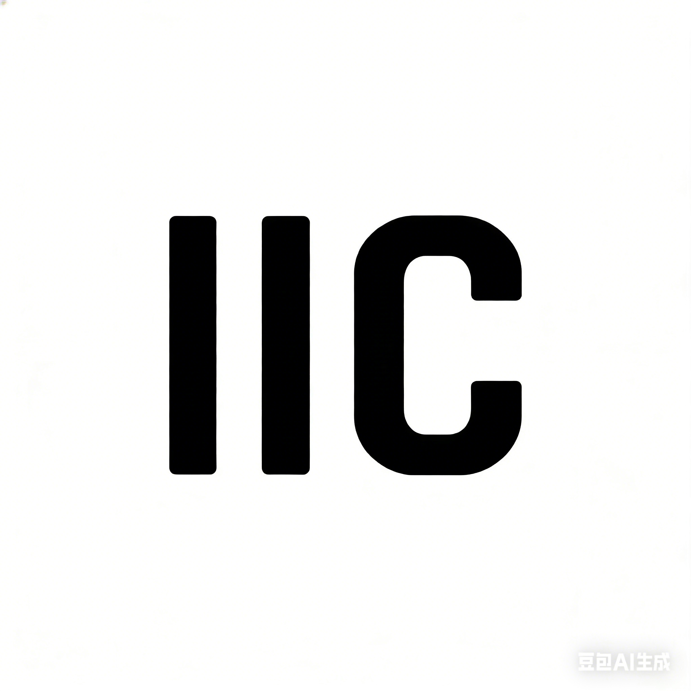

# UI 风格统一规范指南

## 📋 概述

本文档记录了 v2 目录所有页面的图标和样式统一规范，确保各页面保持一致的视觉风格和用户体验。

## 🎨 技术栈

### 图标库
- **主要图标**: Heroicons Outline v2.1.3 (SVG 内联)
- **条形码图标**: Bootstrap Icons `bi-upc-scan` (SVG 内联)
- **引入方式**: SVG 直接嵌入 HTML，无需外部 CSS/JS 依赖

### CSS 框架
- **Tailwind CSS** v3.x (通过 CDN)
- **Google Fonts**: Manrope + Inter

## 📐 统一规范

### 1. 顶部导航栏 (Top Navigation Bar)

#### Logo 区域
```html
<div class="flex items-center gap-2">
    
    <span class="text-lg font-bold text-[#6e7891] tracking-tight font-headline">PRODUCT SERVICE</span>
</div>
```

#### 搜索框 (Search Bar)
```html
<!-- Search Bar -->
<div class="relative hidden md:block">
    <svg class="absolute left-3 top-1/2 -translate-y-1/2 text-slate-400" xmlns="http://www.w3.org/2000/svg" width="16" height="16" fill="currentColor" viewBox="0 0 16 16">
        <path d="M1.5 1a.5.5 0 0 0-.5.5v3a.5.5 0 0 1-1 0v-3A1.5 1.5 0 0 1 1.5 0h3a.5.5 0 0 1 0 1zM11 .5a.5.5 0 0 1 .5-.5h3A1.5 1.5 0 0 1 16 1.5v3a.5.5 0 0 1-1 0v-3a.5.5 0 0 0-.5-.5h-3a.5.5 0 0 1-.5-.5M.5 11a.5.5 0 0 1 .5.5v3a.5.5 0 0 0 .5.5h3a.5.5 0 0 1 0 1h-3A1.5 1.5 0 0 1 0 14.5v-3a.5.5 0 0 1 .5-.5m15 0a.5.5 0 0 1 .5.5v3a1.5 1.5 0 0 1-1.5 1.5h-3a.5.5 0 0 1 0-1h3a.5.5 0 0 0 .5-.5v-3a.5.5 0 0 1 .5-.5M3 4.5a.5.5 0 0 1 1 0v7a.5.5 0 0 1-1 0zm2 0a.5.5 0 0 1 1 0v7a.5.5 0 0 1-1 0zm2 0a.5.5 0 0 1 1 0v7a.5.5 0 0 1-1 0zm2 0a.5.5 0 0 1 .5-.5h1a.5.5 0 0 1 .5.5v7a.5.5 0 0 1-.5.5h-1a.5.5 0 0 1-.5-.5zm3 0a.5.5 0 0 1 1 0v7a.5.5 0 0 1-1 0z"></path>
    </svg>
    <input class="pl-10 pr-4 py-2 border border-slate-200 rounded-lg text-sm focus:outline-none focus:ring-2 focus:ring-primary transition-all" 
           style="background-color: #f5f7fa; width: 364px;" 
           type="text" 
           placeholder="Scan barcode"/>
</div>
```

**规范要点**:
- 条形码图标使用 Bootstrap Icons SVG
- 图标定位：`absolute left-3 top-1/2 -translate-y-1/2`
- 图标颜色：`text-slate-400`
- 图标尺寸：`width="16" height="16"`
- 输入框边框：`border border-slate-200`
- 输入框高度：`py-2` (约 32px)

#### 右侧操作按钮
```html
<!-- Right Actions -->
<div class="flex items-center gap-4">
    <!-- Language Button -->
    <button class="p-2 hover:bg-slate-50 rounded-full text-slate-500 transition-colors flex items-center justify-center" title="Language">
        <svg class="heroicon w-5 h-5" xmlns="http://www.w3.org/2000/svg" fill="none" viewBox="0 0 24 24" stroke-width="1.5" stroke="currentColor">
            <path stroke-linecap="round" stroke-linejoin="round" d="M12 21a9.004 9.004 0 008.716-6.747M12 21a9.004 9.004 0 01-8.716-6.747M12 21c2.485 0 4.5-4.03 4.5-9S14.485 3 12 3m0 18c-2.485 0-4.5-4.03-4.5-9S9.515 3 12 3m0 0a8.997 8.997 0 017.843 4.582M12 3a8.997 8.997 0 00-7.843 4.582m15.686 0A11.953 11.953 0 0112 10.5c-2.998 0-5.74-1.1-7.843-2.918m15.686 0A8.959 8.959 0 0121 12c0 .778-.099 1.533-.284 2.253m0 0A17.919 17.919 0 0112 16.5c-3.162 0-6.133-.815-8.716-2.247m0 0A9.015 9.015 0 013 12c0-1.605.42-3.113 1.157-4.418" />
        </svg>
    </button>
    
    <!-- User Avatar -->
    <div class="flex items-center gap-3 pl-4 border-l border-slate-200">
        <div class="w-10 h-10 rounded-full flex items-center justify-center bg-[#e3e7ed]">
            <svg class="heroicon w-6 h-6 text-slate-700" xmlns="http://www.w3.org/2000/svg" fill="none" viewBox="0 0 24 24" stroke-width="1.5" stroke="currentColor">
                <path stroke-linecap="round" stroke-linejoin="round" d="M15.75 6a3.75 3.75 0 11-7.5 0 3.75 3.75 0 017.5 0zM4.501 20.118a7.5 7.5 0 0114.998 0A17.933 17.933 0 0112 21.75c-2.676 0-5.216-.584-7.499-1.632z" />
            </svg>
        </div>
    </div>
</div>
```

**规范要点**:
- 语言按钮：`p-2`, 图标 `w-5 h-5`, 颜色 `text-slate-500`
- 用户头像容器：`w-10 h-10 rounded-full bg-[#e3e7ed]`
- 用户图标：`w-6 h-6 text-slate-700`
- 分隔线：`pl-4 border-l border-slate-200`

### 2. 侧边栏菜单 (Sidebar Navigation)

#### 菜单项结构
```html
<a class="flex items-center px-6 py-3 text-slate-600 hover:bg-slate-50 hover:text-primary transition-all" href="#">
    <svg class="heroicon w-5 h-5 mr-3" xmlns="http://www.w3.org/2000/svg" fill="none" viewBox="0 0 24 24" stroke-width="1.5" stroke="currentColor">
        <!-- Icon path here -->
    </svg>
    <span>Menu Item</span>
</a>
```

#### 可折叠菜单组
```html
<div class="menu-group">
    <button class="menu-toggle w-full flex items-center justify-between px-6 py-3 text-slate-600 hover:bg-slate-50 hover:text-primary transition-all group" onclick="toggleMenu(this)">
        <div class="flex items-center">
            <svg class="heroicon w-5 h-5 mr-3" xmlns="http://www.w3.org/2000/svg" fill="none" viewBox="0 0 24 24" stroke-width="1.5" stroke="currentColor">
                <!-- Icon path here -->
            </svg>
            <span>Menu Group</span>
        </div>
        <svg class="heroicon w-5 h-5" xmlns="http://www.w3.org/2000/svg" fill="none" viewBox="0 0 24 24" stroke-width="1.5" stroke="currentColor">
            <path stroke-linecap="round" stroke-linejoin="round" d="m19.5 8.25-7.5 7.5-7.5-7.5" />
        </svg>
    </button>
    <div class="menu-content hidden py-1">
        <a class="block pl-14 py-2 text-[13px] text-slate-500 hover:text-primary transition-colors" href="#">Sub Item</a>
    </div>
</div>
```

**规范要点**:
- 菜单图标：`w-5 h-5 mr-3` (与文字间距 12px)
- 字体大小：`text-[13px]` (子菜单)
- 展开箭头：Heroicons chevron-down, `w-5 h-5`

### 3. 筛选区域 (Filter Section)

#### 日期选择器
```html
<div class="relative">
    <input class="w-full h-[38px] px-4 bg-[#f5f7fa] border-none rounded-lg text-sm focus:ring-2 focus:ring-primary focus:bg-white transition-all" 
           type="text" 
           placeholder="Select date range"/>
    <svg class="absolute right-3 top-1/2 -translate-y-1/2 text-slate-400 w-4 h-4" xmlns="http://www.w3.org/2000/svg" fill="none" viewBox="0 0 24 24" stroke-width="1.5" stroke="currentColor">
        <path stroke-linecap="round" stroke-linejoin="round" d="M6.75 3v2.25M17.25 3v2.25M3 18.75V7.5a2.25 2.25 0 012.25-2.25h13.5A2.25 2.25 0 0121 7.5v11.25m-18 0A2.25 2.25 0 005.25 21h13.5A2.25 2.25 0 0021 18.75m-18 0v-7.5A2.25 2.25 0 015.25 9h13.5A2.25 2.25 0 0121 11.25v7.5" />
    </svg>
</div>
```

**规范要点**:
- 日历图标：绝对定位 `right-3`, 尺寸 `w-4 h-4`, 颜色 `text-slate-400`

#### 操作按钮
```html
<button class="w-[38px] h-[38px] bg-primary text-white rounded-lg flex items-center justify-center hover:opacity-90 transition-opacity shadow-sm shadow-primary/20" title="Search">
    <svg class="w-4 h-4" xmlns="http://www.w3.org/2000/svg" fill="none" viewBox="0 0 24 24" stroke-width="2" stroke="currentColor">
        <path stroke-linecap="round" stroke-linejoin="round" d="m21 21-5.197-5.197m0 0A7.5 7.5 0 105.196 5.196a7.5 7.5 0 0010.607 10.607Z" />
    </svg>
</button>
```

**规范要点**:
- 按钮尺寸：`w-[38px] h-[38px]`
- 图标尺寸：`w-4 h-4` (16px)
- 描边宽度：`stroke-width="2"` (增强可见性)

## 📁 已更新文件

| 文件 | 状态 | 说明 |
|------|------|------|
| [ticket_list.html](file://c:\Users\guoha\Workspace\gm-ps\UIUX\UI\v2\ticket_list.html) | ✅ 完成 | 参考标准页面 |
| [ticket_details.html](file://c:\Users\guoha\Workspace\gm-ps\UIUX\UI\v2\ticket_details.html) | ✅ 完成 | 已统一图标和样式 |
| [dashboard.html](file://c:\Users\guoha\Workspace\gm-ps\UIUX\UI\v2\dashboard.html) | ✅ 完成 | 已统一图标和样式 |
| [user_list.html](file://c:\Users\guoha\Workspace\gm-ps\UIUX\UI\v2\user_list.html) | ✅ 完成 | 从 Octicons 迁移到 Heroicons |
| [login.html](file://c:\Users\guoha\Workspace\gm-ps\UIUX\UI\v2\login.html) | ⚠️ 待检查 | 登录页，保持独立样式 |

## 🎯 关键变更点

### 图标替换规则
1. **条形码图标**: 统一使用 Bootstrap Icons `bi-upc-scan` SVG
2. **功能图标**: 统一使用 Heroicons Outline SVG
3. **菜单展开箭头**: 从 Font Awesome / Bootstrap Icons 改为 Heroicons chevron-down
4. **用户头像**: 统一使用 Heroicons user-circle SVG

### CSS 样式类
```css
.heroicon {
    vertical-align: middle;
}
```

### 颜色规范
- 占位符图标：`text-slate-400`
- 按钮图标：`text-slate-500`
- 用户头像：`text-slate-700`
- 激活状态：`text-primary` (#005bc0)

## 🔧 最佳实践

1. **SVG 内联**: 直接使用 SVG 代码，避免外部依赖
2. **尺寸统一**: 使用 Tailwind 的 `w-* h-*` 类
3. **颜色一致**: 使用 Tailwind 的颜色系统
4. **定位准确**: 使用 `absolute` + `top-1/2 -translate-y-1/2` 垂直居中
5. **响应式**: 保持适当的间距和尺寸

## 📝 维护说明

- 新增页面时，请参照本规范使用统一的图标和样式
- 修改现有页面时，保持与 ticket_list.html 一致的视觉风格
- 如需添加新图标，请从 Heroicons Outline 系列中选择

---

**最后更新**: 2026 年 3 月 27 日  
**维护者**: UI/UX Team
