# GM 小程序协同接口需求文档

## 1 文档说明

本文档用于说明小程序与 PS Admin 之间的接口范围、调用方式及交互口径。

在本项目中：

- PS Admin 负责工单创建、申请预审、状态管理、客户确认事项管理、待支付信息管理、物流结果管理、问卷任务管理、业务结果接收及消息事件发布
- 小程序负责客户侧申请提交、状态展示、支付发起、客户确认处理、问卷填写及消息接收

工单状态、客户展示状态、可操作项及服务进展信息均由 PS Admin 统一管理并返回，小程序负责查询、接收并展示结果。小程序可维护工单状态与详情的本地记录，用于页面展示与消息承接，但不独立维护状态逻辑，也不单独计算客户可操作能力。

具体协同方式如下：

- **统一通知**：PS Admin 在业务事件触发时主动回调小程序统一通知接口，小程序收到通知后按工单编号调用查询工单详情接口获取最新数据，并更新本地记录
- **聚合详情**：支付、客户确认、问卷摘要、物流摘要、可操作项、服务进展轨迹等客户侧所需核心信息，统一由查询工单详情接口返回
- **结果展示**：客户进入工单页面时，小程序应向 PS Admin 查询最新工单详情，确保前端展示与后台处理结果一致
- **权威口径**：工单状态、客户展示状态、可操作项、服务进展及待处理事项等均以 PS Admin 返回结果为准

本文档中所有接口均为双方统一约定的普通接口：接口路径、消息类型、回调地址、鉴权方式（签名算法、密钥）等由小程序与 PS Admin 在联调前手工配置，双方各自完成认证、授权等配置后即可使用，不再通过专门的订阅登记接口进行运行时登记。

按调用方向可分为两类：

- **小程序 → PS Admin**：由小程序主动发起的请求类接口（如创建工单、查询工单详情、提交寄件信息、回写支付结果、回写确认结果、提交问卷结果等）
- **PS Admin → 小程序**：由 PS Admin 在业务事件触发时主动发起的统一通知类接口

统一通知接口仅用于事件通知和触发数据同步，不直接承载完整业务详情；小程序收到通知后，根据业务需要调用查询工单详情接口或问卷信息查询接口获取完整详情，并更新本地记录。

### 1.1 接口设计说明

|项目|说明|
|---|---|
|客户标识|客户侧接口统一使用客户手机号作为客户标识|
|时间格式|统一采用 ISO 8601 或 `yyyy-MM-dd HH:mm:ss`|
|状态枚举|由 PS Admin 统一维护并返回，小程序按返回结果展示|
|幂等控制|创建工单、支付结果回写、统一通知接收等接口必须支持幂等|
|权限校验|所有小程序查询与提交接口都应校验客户手机号与工单归属关系|
|鉴权机制|小程序消息接收接口统一采用时间戳、随机串、签名等方式校验|
|失败重试|PS Admin 对通知失败场景应支持自动重试、人工补推及失败留痕|
|重复接收处理|小程序应按 `messageId` 做幂等接收，避免重复通知客户|
|数据同步|小程序可维护工单状态与详情的本地记录，收到统一通知后调用查询接口获取最新数据并更新本地；客户侧状态展示、可操作项判断及服务进展展示均以 PS Admin 返回结果为准|

### 1.2 协作流程

#### 1.2.1 协作流程时序图

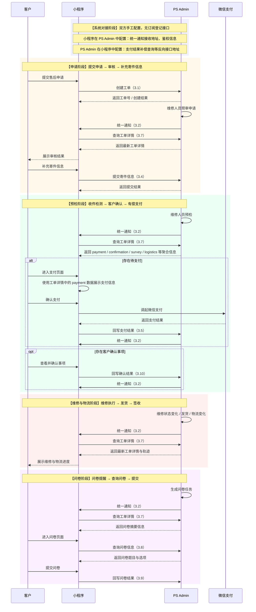

#### 1.2.2 协作流程说明

##### 系统对接阶段

业务流程启动前的系统初始化阶段。小程序与 PS Admin 之间的通知接收地址及反向接口地址由双方手工配置：

- 小程序侧：在 PS Admin 中配置统一通知接收地址、鉴权信息（签名方式 / 密钥）
- PS Admin 侧：在小程序中配置支付结果补偿查询等反向接口地址及鉴权信息

双方手工配置完成后，业务通知通道即就绪。该阶段独立于业务流程，仅在系统接入或配置变更时执行。

**数据同步机制**：小程序维护工单状态与详情的本地记录。PS Admin 在审核结果、支付状态、客户确认、物流变化、问卷生成等业务事件发生时，通过统一通知接口通知小程序；小程序收到通知后调用查询工单详情接口获取完整聚合信息并更新本地记录。客户进入工单页面或页面需要刷新时，小程序应再次向 PS Admin 查询最新工单详情。工单状态、客户展示状态、可操作项、服务进展及待处理客户确认事项等，均以 PS Admin 返回结果为准。

##### 申请阶段

涉及接口：3.1 创建工单、3.2 统一业务通知回调、3.3 查询客户工单列表、3.4 提交寄件信息、3.7 查询工单详情

1. 客户在小程序中提交售后申请，小程序调用创建工单接口将申请信息同步至 PS Admin，PS Admin 生成工单编号并初始化为「待审核」状态
2. PS Admin 中由维修人员对申请进行预审
3. 审核完成后，PS Admin 通过统一通知接口通知小程序；小程序收到通知后调用查询工单详情接口获取最新信息并更新本地记录，向客户展示审核结果
4. 审核通过后，客户在小程序中查询本人相关工单，选择对应工单后填写寄件公司、运单号等信息并提交
5. PS Admin 写入寄件记录，等待收件

##### 预检阶段

涉及接口：3.2 统一业务通知回调、3.5 支付结果接收、3.6 支付结果补偿查询、3.7 查询工单详情、3.10 客户确认事项结果接收、3.11 取消订单

1. 维修人员收件并进行预检
2. 预检过程中如存在客户确认事项、待支付事项或其他客户侧需感知的业务节点，PS Admin 通过统一通知接口通知小程序
3. 小程序统一调用查询工单详情接口获取 payment、confirmation、survey、logistics 等聚合信息，并更新本地记录
4. 如工单进入有偿场景，小程序直接使用工单详情中的支付信息展示支付页面，并在完成支付后回写支付结果；如支付异常，PS Admin 主动查询小程序支付结果做补偿
5. 如工单存在待确认事项，小程序根据工单详情中的 confirmation 信息展示客户确认页面，客户处理后回写事项结果。一个工单可存在多次客户确认事项，客户确认可按业务需要重复发起
6. 客户可在允许的状态下通过小程序发起取消申请；PS Admin 同步校验当前状态并返回取消结果

##### 维修与物流阶段

涉及接口：3.2 统一业务通知回调、3.7 查询工单详情、3.10 客户确认事项结果接收

1. 维修人员开始维修、更新状态、发货、回传物流节点时，PS Admin 统一通过通知接口通知小程序
2. 小程序收到通知后调用查询工单详情接口获取最新状态、物流摘要、服务进展及维修轨迹，并更新本地记录
3. 维修阶段，客户在小程序侧主要进行工单信息查询、维修进度查看及客户确认事项处理，不承接其他复杂操作
4. 维修过程中如需客户再次确认产品状态、维修说明或其他事项，PS Admin 可再次发起客户确认事项，由小程序承接客户确认操作
5. 后台在维修过程中如对客户可见的重要信息进行了修改，除关键状态节点变化外，也应支持同步至小程序，确保客户侧展示与后台处理结果一致
6. 客户查看工单进度时，小程序展示 PS Admin 返回的当前状态、物流摘要、服务进展及轨迹信息

##### 问卷阶段

涉及接口：3.2 统一业务通知回调、3.7 查询工单详情、3.8 问卷信息查询、3.9 问卷结果接收

1. 服务完成后，PS Admin 生成问卷任务并通过统一通知接口通知小程序
2. 小程序收到通知后先调用查询工单详情接口获取问卷摘要信息
3. 客户进入问卷页面后，小程序再调用问卷信息查询接口获取完整问卷内容
4. 客户填写问卷并提交，小程序回写问卷结果至 PS Admin

##### 小程序展示口径

工单状态由 PS Admin 统一管理，小程序负责查询、接收并展示相关结果。PS Admin 除返回工单当前状态外，还应同步当前状态下客户可执行的操作项及按时间顺序展示的服务进展信息，供小程序统一展示工单处理轨迹。

同时，PS Admin 还应返回维修判定结果、维修内容、维修费用、支付状态、支付链接、预计出库日期、收货地址、收货方式、产品状态确认图片及文字说明等客户侧展示所需信息。客户前端展示状态与后台业务状态之间的映射关系由 PS Admin 统一维护并返回。

是否允许支付、是否允许取消、是否允许修改地址、是否存在待处理客户确认事项等客户可操作能力，均由 PS Admin 按工单当前状态统一计算并返回，小程序按返回结果进行展示、禁用或隐藏。

## 2 接口总览

### 2.1 统一通知接口设计说明

统一通知接口用于替代原审核结果回调、支付通知回调、工单状态变化回调、问卷提醒回调、客户确认事项回调、物流状态回调等多类业务回调接口，统一遵循以下设计原则：

1. **仅用于事件通知**：通知接口仅告诉小程序“哪个工单发生了什么事件”，不直接承载完整业务详情
2. **查询补全**：小程序收到通知后，统一调用查询工单详情接口获取最新聚合信息；如为问卷内容展示场景，再进一步调用问卷信息查询接口获取完整问卷内容
3. **幂等接收**：小程序统一按 `messageId` 做幂等处理，避免重复通知客户
4. **失败重试**：PS Admin 统一记录通知日志，对失败场景支持自动重试、人工补推及失败留痕
5. **字段统一**：统一通知接口保持一致的公共字段结构，如 `messageId`、`eventCode`、`eventName`、`ticketNo`、`summary`、`eventTime`、`timestamp`、`nonce`、`sign`
6. **事件扩展**：后续新增客户侧通知场景时，优先通过新增事件编码扩展，不再新增独立回调接口

### 2.2 接口总览

| 接口名称         | 调用方向           | 说明                                 |
| ------------ | -------------- | ---------------------------------- |
| 创建工单接口       | 小程序 → PS Admin | 客户提交申请后创建工单（初始状态：待审核）              |
| 统一业务通知回调接口   | PS Admin → 小程序 | 审核、支付、客户确认、状态变化、物流、问卷等统一事件通知       |
| 查询工单详情接口     | 小程序 → PS Admin | 查询工单聚合详情，统一返回当前状态、客户展示状态、可操作项、服务进展、支付、确认、问卷摘要、物流摘要及客户侧展示所需业务信息 |
| 查询客户工单列表接口   | 小程序 → PS Admin | 按客户手机号查询本人相关工单，并返回场景化可操作标识         |
| 提交寄件信息接口     | 小程序 → PS Admin | 客户补充寄件公司、运单号等信息                    |
| 支付结果接收接口     | 小程序 → PS Admin | 小程序回写支付结果                          |
| 支付结果补偿查询接口   | PS Admin → 小程序 | 支付异常补偿查询                           |
| 问卷信息查询接口     | 小程序 → PS Admin | 查询问卷标题、题目、选项及截止时间                  |
| 问卷结果接收接口     | 小程序 → PS Admin | 回写问卷结果                             |
| 客户确认事项结果接收接口 | 小程序 → PS Admin | 回写客户确认事项处理结果                       |
| 取消订单接口       | 小程序 → PS Admin | 客户发起取消申请，同步返回取消结果                  |

## 3 接口明细

## 3.1 创建工单接口

客户在小程序中提交售后申请后，由小程序直接调用 PS Admin 创建工单接口将申请信息同步至 PS Admin。PS Admin 统一生成工单编号并初始化为「待审核」状态，由 PS Admin 中的维修人员完成预审；如重复提交，按 `requestNo` 做幂等控制；创建成功后，小程序展示申请已提交结果，后续审核结果通过统一业务通知回调接口异步通知。

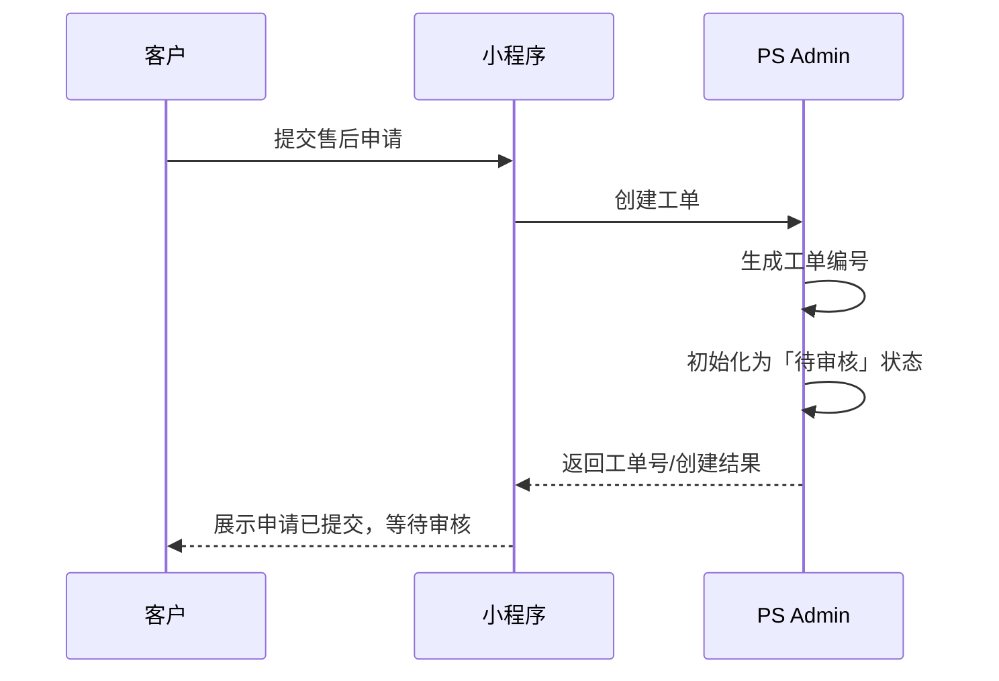

### 接口定义

| 项目   | 内容                     |
| ---- | ---------------------- |
| 接口路径 | `/api/miniapp/tickets` |
| 请求方式 | POST                   |
| 调用方向 | 小程序 → PS Admin         |
| 鉴权方式 | 小程序用户身份令牌 / 签名         |
| 幂等要求 | 支持                     |

### 请求参数

|字段名称|字段Key|数据类型|必填|默认值|说明|
|---|---|---|---|---|---|
|来源请求号|requestNo|String|是|-|小程序侧申请唯一请求号，用于幂等控制|
|客户姓名|customerName|String|是|-|申请人姓名|
|客户手机号|mobile|String|是|-|客户手机号，作为客户标识|
|邮箱|email|String|否|空|客户邮箱|
|申请渠道|channel|String|是|-|`MINIAPP`|
|产品编码|productCode|String|否|空|产品唯一编码|
|产品名称|productName|String|是|-|产品名称|
|购买日期|purchaseDate|Date|否|空|`yyyy-MM-dd`|
|问题描述|issueDescription|String|是|-|客户填写的问题说明|
|附件列表|attachments|Array|否|`[]`|图片或附件信息|

### 返回参数

|字段名称|字段Key|数据类型|说明|
|---|---|---|---|
|返回码|code|Integer|接口处理结果码，成功返回 `200`|
|返回说明|message|String|接口处理结果说明|
|返回数据|data|Object|具体返回数据|
|工单编号|data.ticketNo|String|系统生成的工单编号|
|工单ID|data.ticketId|String|内部主键或唯一标识|
|初始状态|data.status|String|工单初始状态|
|状态说明|data.statusDesc|String|面向前端展示的状态说明|

## 3.2 统一业务通知回调接口

当工单发生审核结果、待支付、支付完成、待客户确认、状态变化、物流变化、问卷生成等客户侧需感知的业务事件时，PS Admin 按订阅关系主动回调小程序统一通知接口。该接口仅传递事件标识及基础说明，不承载完整业务详情；小程序收到通知后，统一按工单编号调用查询工单详情接口获取最新聚合数据，并更新本地记录。若事件属于问卷展示场景，小程序在获取工单详情中的问卷摘要后，再调用问卷信息查询接口获取完整问卷内容。

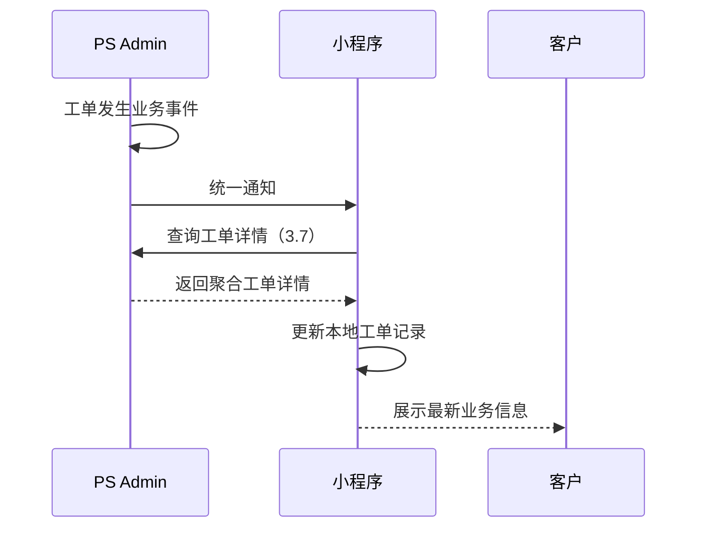

### 接口定义

|项目|内容|
|---|---|
|接口路径|由小程序侧提供|
|请求方式|POST|
|调用方向|PS Admin → 小程序|

### 请求参数

| 字段名称   | 字段Key     | 数据类型     | 必填  | 默认值 | 说明                  |
| ------ | --------- | -------- | --- | --- | ------------------- |
| 消息唯一标识 | messageId | String   | 是   | -   | 消息幂等标识              |
| 事件编码   | eventCode | String   | 是   | -   | 统一事件编码              |
| 事件名称   | eventName | String   | 是   | -   | 统一事件名称              |
| 工单编号   | ticketNo  | String   | 是   | -   | 售后工单编号              |
| 通知摘要   | summary   | String   | 否   | 空   | 简要提示内容              |
| 事件时间   | eventTime | Datetime | 是   | -   | 事件发生时间              |
| 扩展数据   | ext       | Object   | 否   | 空   | 保留扩展字段，用于传递少量辅助标识信息 |
| 时间戳    | timestamp | String   | 是   | -   | 签名时间戳               |
| 随机串    | nonce     | String   | 是   | -   | 防重放字段               |
| 签名     | sign      | String   | 是   | -   | 签名值                 |

### 事件编码建议

| 事件编码                     | 事件名称   | 说明               |
| ------------------------ | ------ | ---------------- |
| `AUDIT_APPROVED`         | 审核通过   | 申请审核通过，客户可继续后续流程 |
| `AUDIT_REJECTED`         | 审核拒绝   | 申请审核未通过          |
| `PENDING_CONFIRMATION`   | 待客户确认  | 工单存在待处理客户确认事项    |
| `PENDING_PAYMENT`        | 待支付    | 工单存在待支付事项        |
| `PAYMENT_SUCCESS`        | 支付成功   | 工单支付已完成          |
| `PAYMENT_TIMEOUT`        | 支付超时   | 工单支付超时           |
| `STATUS_CHANGED`         | 状态变化   | 工单主状态发生变化        |
| `LOGISTICS_UPDATED`      | 物流更新   | 物流状态或物流节点发生变化    |
| `SURVEY_CREATED`         | 问卷生成   | 工单已生成待填写问卷       |
| `SURVEY_DEADLINE_REMIND` | 问卷截止提醒 | 问卷临近截止时间         |

### 返回参数

|字段名称|字段Key|数据类型|说明|
|---|---|---|---|
|返回码|code|Integer|接口处理结果码，成功返回 `200`|
|返回说明|message|String|接口处理结果说明|
|返回数据|data|Object|具体返回数据|
|接收结果|data.result|String|`SUCCESS` / `FAIL`|

## 3.3 查询工单详情接口

工单状态的权威口径以 PS Admin 为准。小程序在收到统一业务通知后，应调用本接口获取最新工单详情，并更新本地记录。客户进入工单页面或页面需要刷新时，小程序应再次调用本接口获取最新数据，确保前端展示与后台处理结果一致。

本接口用于返回客户侧工单详情页所需的聚合信息。除基础状态信息外，统一承载客户展示状态、服务进展、可操作项、支付信息、客户确认信息、问卷摘要信息、物流摘要信息及维修进展轨迹，减少小程序针对不同业务场景分别调用多个接口的复杂度。问卷题目与选项等完整内容仍通过问卷信息查询接口获取。

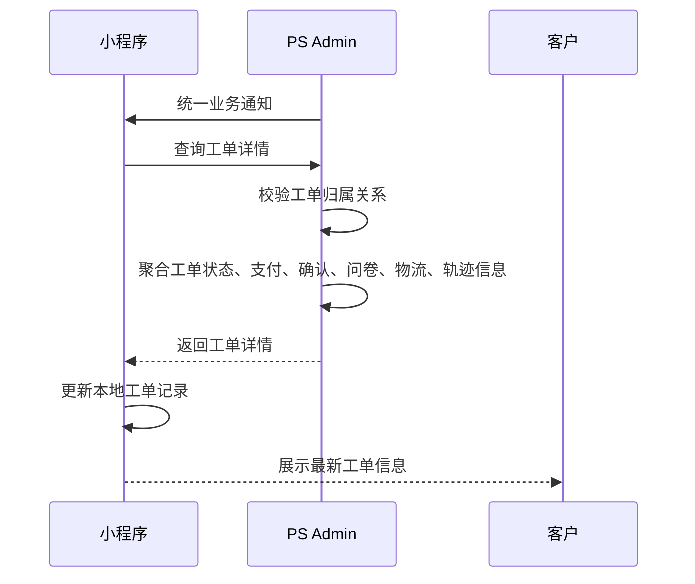

### 接口定义

|项目|内容|
|---|---|
|接口路径|`/api/miniapp/tickets/{ticketNo}/detail`|
|请求方式|GET|
|调用方向|小程序 → PS Admin|
|鉴权方式|小程序用户身份令牌 / 签名|

### 请求参数

|字段名称|字段Key|数据类型|必填|默认值|说明|
|---|---|---|---|---|---|
|工单编号|ticketNo|String|是|-|售后工单编号|
|客户手机号|mobile|String|是|-|客户手机号，作为客户身份校验条件|
|语言|language|String|否|`zh-CN`|`zh-CN` / `en` / `ko`|

### 返回参数

| 字段名称       | 字段Key                       | 数据类型    | 说明                    |
| ---------- | --------------------------- | ------- | --------------------- |
| 返回码        | code                        | Integer | 接口处理结果码，成功返回 `200`    |
| 返回说明       | message                     | String  | 接口处理结果说明              |
| 返回数据       | data                        | Object  | 具体返回数据                |
| 工单编号       | data.ticketNo               | String  | 工单编号                  |
| 当前状态           | data.status                   | String  | 工单当前状态 |
| 客户展示状态        | data.displayStatus            | String  | 客户侧展示状态 |
| 状态说明           | data.statusDesc               | String  | 前端显示文案 |
| 主进度节点          | data.progressStage            | String  | 当前阶段 |
| 服务进展信息        | data.serviceProgress          | Array   | 按时间顺序展示的服务进展节点 |
| 关键时间节点         | data.timeNodes                | Array   | 如申请时间、审核时间、支付时间、发货时间等 |
| 产品名称           | data.productName              | String  | 产品名称 |
| 问题描述           | data.issueDescription         | String  | 客户问题描述 |
| 维修判定结果         | data.judgementResult          | String  | 当前维修判定结果 |
| 维修内容           | data.repairContent            | String  | 当前维修内容摘要 |
| 预计出库日期         | data.expectedOutboundDate     | Date    | 预计出库日期 |
| 寄回方式           | data.returnMode               | String  | `HOME` / `STORE` |
| 寄回地址摘要         | data.returnAddressText        | String  | 寄回地址展示文案 |
| 是否允许修改寄回方式     | data.canModifyReturnMode      | Boolean | 是否允许修改寄回方式 |
| 是否允许修改寄回地址     | data.canModifyReturnAddress   | Boolean | 是否允许修改寄回地址 |
| 是否允许取消         | data.canCancel                | Boolean | 当前是否允许取消 |
| 可操作项           | data.actions                  | Array   | 当前状态下可展示的按钮或入口 |
| 支付信息           | data.payment                  | Object  | 当前工单支付相关聚合信息 |
| 客户确认信息         | data.confirmation             | Object  | 当前工单客户确认相关聚合信息 |
| 问卷摘要信息         | data.survey                   | Object  | 当前工单问卷摘要信息 |
| 物流摘要信息         | data.logistics                | Object  | 当前工单物流摘要信息 |
| 维修进展轨迹         | data.progressRecords          | Array   | 维修进展轨迹列表 |

### 支付信息 payment

| 字段名称    | 字段Key                          | 数据类型     | 说明                           |
| ------- | ------------------------------ | -------- | ---------------------------- |
| 是否存在待支付 | data.payment.hasPendingPayment | Boolean  | 是否存在待支付事项                    |
| 是否允许支付  | data.payment.canPay            | Boolean  | 当前是否允许发起支付                   |
| 支付单号    | data.payment.paymentNo         | String   | 待支付单号                        |
| 支付状态    | data.payment.paymentStatus     | String   | `UNPAID` / `PAID` / `CLOSED` |
| 支付金额    | data.payment.amount            | Decimal  | 待支付金额                        |
| 币种      | data.payment.currency          | String   | 币种                           |
| 费用说明    | data.payment.feeDescription    | String   | 费用说明                         |
| 支付截止时间  | data.payment.paymentDeadline   | Datetime | 截止支付时间                       |
| 支付时间    | data.payment.paymentTime       | Datetime | 实际支付时间                       |

### 客户确认信息 confirmation

|字段名称|字段Key|数据类型|说明|
|---|---|---|---|
|是否存在待确认事项|data.confirmation.hasPendingConfirmation|Boolean|是否存在待处理客户确认事项|  
|待处理事项数量|data.confirmation.pendingCount|Integer|当前待处理客户确认事项数量|  
|当前待处理事项编号|data.confirmation.currentTaskNo|String|当前优先展示的客户确认事项编号|  
|当前待处理事项状态|data.confirmation.currentTaskStatus|String|`PENDING` / `CONFIRMED` / `CLOSED`|  
|当前待处理事项标题|data.confirmation.currentTaskTitle|String|事项标题|  
|当前待处理事项正文|data.confirmation.currentTaskContent|String|客户查看的详细说明正文|  
|当前待处理事项图片列表|data.confirmation.currentImages|Array|事项相关图片信息|  
|当前待处理事项发起时间|data.confirmation.currentCreatedTime|Datetime|事项发起时间|  
|当前待处理事项处理时间|data.confirmation.currentHandledTime|Datetime|客户处理时间|  
|确认事项记录列表|data.confirmation.records|Array|工单下客户确认事项记录列表|

### 问卷摘要信息 survey

|字段名称|字段Key|数据类型|说明|
|---|---|---|---|
|是否存在待填写问卷|data.survey.hasPendingSurvey|Boolean|是否存在待填写问卷|
|是否允许查看问卷|data.survey.canViewSurvey|Boolean|当前是否允许查看问卷|
|是否允许提交问卷|data.survey.canSubmit|Boolean|当前是否允许提交问卷|
|问卷编号|data.survey.surveyNo|String|问卷任务编号|
|问卷标题|data.survey.surveyTitle|String|问卷标题|
|问卷状态|data.survey.surveyStatus|String|`PENDING` / `SUBMITTED` / `EXPIRED` / `INVALID`|
|截止时间|data.survey.deadlineTime|Datetime|问卷填写截止时间|

### 物流摘要信息 logistics

|字段名称|字段Key|数据类型|说明|
|---|---|---|---|
|是否存在物流信息|data.logistics.hasLogistics|Boolean|当前是否已有物流信息|
|承运商|data.logistics.carrier|String|物流公司|
|运单号|data.logistics.trackingNo|String|真实运单号|
|物流状态|data.logistics.logisticsStatus|String|`SHIPPED` / `IN_TRANSIT` / `DELIVERED` / `STORE_ARRIVED` / `READY_FOR_PICKUP`|
|发货时间|data.logistics.shippedTime|Datetime|发货时间|
|签收时间|data.logistics.deliveredTime|Datetime|签收时间|
|门店到货时间|data.logistics.storeArrivedTime|Datetime|门店到货时间|
|是否完整物流信息|data.logistics.hasFullTracking|Boolean|是否已返回完整物流详情|

### 维修进展轨迹 progressRecords

|字段名称|字段Key|数据类型|说明|
|---|---|---|---|
|轨迹编号|data.progressRecords[].recordNo|String|轨迹唯一编号|
|轨迹类型|data.progressRecords[].recordType|String|`AUDIT` / `PAYMENT` / `REPAIR` / `LOGISTICS` / `SURVEY` / `TASK`|
|轨迹标题|data.progressRecords[].title|String|轨迹标题|
|轨迹内容|data.progressRecords[].content|String|轨迹内容|
|发生时间|data.progressRecords[].eventTime|Datetime|发生时间|

## 3.4 查询客户工单列表接口

当客户在小程序中查看维修单列表、选择需补充寄件信息的工单、查看待支付工单或查看历史工单时，由小程序调用 PS Admin 查询客户工单列表接口，按客户手机号查询本人相关工单列表，并获取对应工单编号及场景化可操作标识。

接口返回工单基础信息、当前状态及当前可执行操作，用于支撑小程序侧维修单列表展示、寄件信息补充入口识别、待支付工单识别及历史工单查询等场景。小程序可根据请求场景传入对应筛选条件，按需展示客户当前可处理或可查看的工单记录。

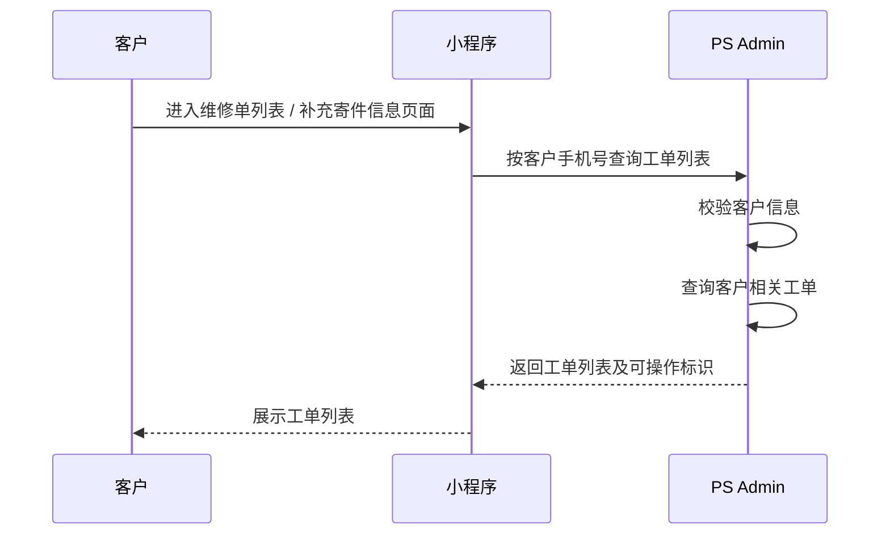

### 接口定义

|项目|内容|
|---|---|
|接口路径|`/api/miniapp/tickets/list`|
|请求方式|GET|
|调用方向|小程序 → PS Admin|
|鉴权方式|小程序用户身份令牌 / 签名|

### 请求参数

| 字段名称  | 字段Key    | 数据类型    | 必填  | 默认值   | 说明                                                                      |
| ----- | -------- | ------- | --- | ----- | ----------------------------------------------------------------------- |
| 客户手机号 | mobile   | String  | 是   | -     | 客户手机号，作为查询条件                                                            |
| 场景类型  | scene    | String  | 否   | `ALL` | `ALL` / `PENDING_SHIPPING` / `PENDING_PAY` / `PROCESSING` / `COMPLETED` |
| 当前页码  | pageNo   | Integer | 否   | 1     | 当前页码                                                                    |
| 每页条数  | pageSize | Integer | 否   | 10    | 每页条数                                                                    |

### 返回参数

| 字段名称       | 字段Key                             | 数据类型     | 说明                      |
| ---------- | --------------------------------- | -------- | ----------------------- |
| 返回码        | code                              | Integer  | 接口处理结果码，成功返回 `200`      |
| 返回说明       | message                           | String   | 接口处理结果说明                |
| 返回数据       | data                              | Object   | 具体返回数据                  |
| 当前页码       | data.pageNo                       | Integer  | 当前页码                    |
| 每页条数       | data.pageSize                     | Integer  | 每页条数                    |
| 总记录数       | data.total                        | Integer  | 符合条件的工单总数               |
| 工单列表       | data.records                      | Array    | 客户工单列表                  |
| 工单编号       | data.records[].ticketNo           | String   | 售后工单编号                  |
| 产品名称       | data.records[].productName        | String   | 产品名称                    |
| 申请时间       | data.records[].applyTime          | Datetime | 工单创建时间                  |
| 当前状态       | data.records[].status             | String   | 工单当前状态                  |
| 状态说明       | data.records[].statusDesc         | String   | 前端展示文案                  |
| 是否允许补充寄件信息 | data.records[].canSubmitShipping  | Boolean  | 当前是否允许提交寄件信息            |
| 是否允许支付     | data.records[].canPay             | Boolean  | 当前是否允许支付                |
| 是否允许取消     | data.records[].canCancel          | Boolean  | 当前是否允许取消                |
| 是否允许查看问卷   | data.records[].canViewSurvey      | Boolean  | 当前是否允许查看问卷              |
| 寄件信息提交状态   | data.records[].shippingInfoStatus | String   | `PENDING` / `SUBMITTED` |

## 3.5 提交寄件信息接口

当客户完成工单选择后，由小程序调用 PS Admin 提交寄件信息接口，提交寄件公司、运单号及寄件时间等信息。PS Admin 接收后写入工单寄件记录，并更新相关物流跟踪信息，供后续接收、查询及通知使用。

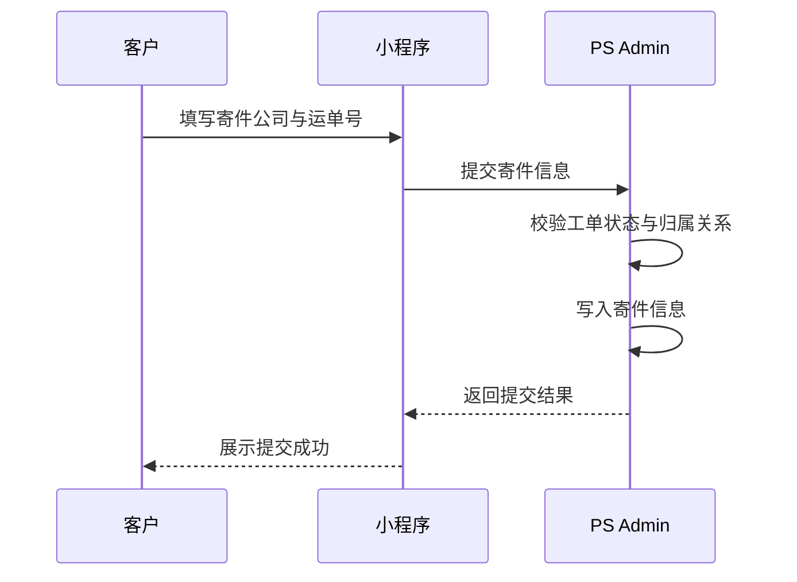

### 接口定义

|项目|内容|
|---|---|
|接口路径|`/api/miniapp/tickets/shipping-info`|
|请求方式|POST|
|调用方向|小程序 → PS Admin|
|鉴权方式|小程序用户身份令牌 / 签名|
|幂等要求|支持|

### 请求参数

|字段名称|字段Key|数据类型|必填|默认值|说明|
|---|---|---|---|---|---|
|工单编号|ticketNo|String|是|-|售后工单编号|
|客户手机号|mobile|String|是|-|客户手机号，作为客户身份校验条件|
|寄件公司|carrier|String|是|-|客户寄件使用的物流公司|
|运单号|trackingNo|String|是|-|客户寄件运单号|
|寄件时间|shippedTime|Datetime|否|空|客户实际寄件时间|
|寄件备注|remark|String|否|空|补充说明|

### 返回参数

|字段名称|字段Key|数据类型|说明|
|---|---|---|---|
|返回码|code|Integer|接口处理结果码，成功返回 `200`|
|返回说明|message|String|接口处理结果说明|
|返回数据|data|Object|具体返回数据|
|工单编号|data.ticketNo|String|售后工单编号|
|寄件信息状态|data.shippingInfoStatus|String|`SUBMITTED` / `REPEAT` / `FAIL`|

## 3.6 支付结果接收接口

客户完成支付后，小程序将支付结果回写至 PS Admin。小程序应在完成验签或核单后再提交；PS Admin 接收后更新支付状态和工单状态；本接口必须支持幂等，若回写失败，后续可通过支付结果补偿查询接口做补偿，最终支付结果以 PS Admin 落账结果为准。

小程序支付页面所需的支付单号、支付金额、支付状态、费用说明、支付截止时间等信息统一从查询工单详情接口中的 `payment` 对象获取，不再单独提供查询待支付信息接口。

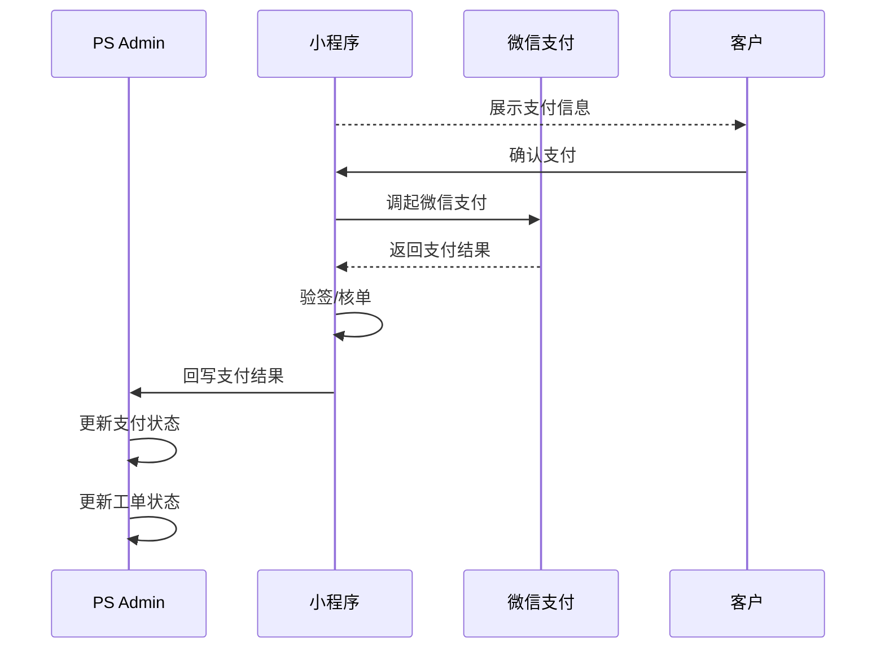

### 接口定义

|项目|内容|
|---|---|
|接口路径|`/api/miniapp/payments/result`|
|请求方式|POST|
|调用方向|小程序 → PS Admin|
|幂等要求|必须支持|

### 请求参数

|字段名称|字段Key|数据类型|必填|默认值|说明|
|---|---|---|---|---|---|
|工单编号|ticketNo|String|是|-|售后工单编号|
|支付单号|paymentNo|String|是|-|待支付单号|
|支付结果|paymentResult|String|是|-|`SUCCESS` / `FAIL` / `CANCEL`|
|支付状态|paymentStatus|String|是|-|`PAID` / `UNPAID` / `CLOSED`|
|支付时间|paymentTime|Datetime|否|空|成功支付时间|
|支付方式|paymentMethod|String|否|空|`WECHAT` 等|
|支付流水号|transactionNo|String|否|空|支付平台流水号|
|支付授权号|authNo|String|否|空|授权号|
|验签结果|signVerified|Boolean|否|`false`|小程序侧验签或核单结果|
|原始报文|rawPayload|String|否|空|原始返回数据，便于追溯|

### 返回参数

|字段名称|字段Key|数据类型|说明|
|---|---|---|---|
|返回码|code|Integer|接口处理结果码，成功返回 `200`|
|返回说明|message|String|接口处理结果说明|
|返回数据|data|Object|具体返回数据|
|处理结果|data.result|String|`SUCCESS` / `RETRY` / `FAIL`|
|当前支付状态|data.currentPaymentStatus|String|PS Admin 最终记录的支付状态|

## 3.7 支付结果补偿查询接口

当支付结果回写异常、超时或双方状态不一致时，PS Admin 主动向小程序查询支付最终状态，用于异常补偿和状态修正。查询结果返回后，PS Admin 修正支付状态及工单状态；如小程序也无法确认最终结果，则保留异常状态并支持人工处理。

本接口并非客户侧常规查询接口，而是系统间异常补偿能力。

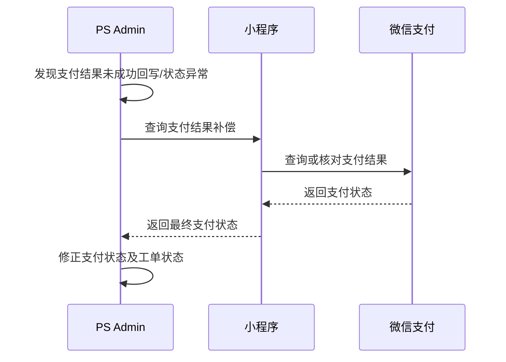

### 接口定义

|项目|内容|
|---|---|
|接口路径|由小程序侧提供|
|请求方式|GET / POST|
|调用方向|PS Admin → 小程序|

### 请求参数

|字段名称|字段Key|数据类型|必填|默认值|说明|
|---|---|---|---|---|---|
|工单编号|ticketNo|String|是|-|售后工单编号|
|支付单号|paymentNo|String|是|-|待支付单号|
|查询时间|queryTime|Datetime|否|当前时间|当前查询时间|
|查询来源|querySource|String|否|`COMPENSATION`|`COMPENSATION` / `MANUAL`|

### 返回参数

|字段名称|字段Key|数据类型|说明|
|---|---|---|---|
|返回码|code|Integer|接口处理结果码，成功返回 `200`|
|返回说明|message|String|接口处理结果说明|
|返回数据|data|Object|具体返回数据|
|支付状态|data.paymentStatus|String|`PAID` / `UNPAID` / `CLOSED` / `UNKNOWN`|
|支付结果|data.paymentResult|String|`SUCCESS` / `FAIL` / `CANCEL`|
|支付时间|data.paymentTime|Datetime|实际支付时间|
|支付方式|data.paymentMethod|String|支付方式|
|交易流水号|data.transactionNo|String|支付平台流水号|

## 3.8 问卷信息查询接口

当客户进入问卷页面时，由小程序调用 PS Admin 问卷信息查询接口，获取当前工单对应的问卷标题、说明、题目、选项、截止时间及填写状态等信息。小程序根据返回结果展示问卷页面，问卷最终状态以 PS Admin 返回结果为准。

工单是否存在待填写问卷、问卷编号、问卷标题、问卷状态、截止时间等摘要信息统一从查询工单详情接口中的 `survey` 对象获取；本接口仅用于获取完整问卷内容。

问卷题型应支持纯文本题、单选题、多选题、评分题，以及选择题与文本补充相结合的组合题。评分题作为问卷中的独立结果项保存并回写至 PS Admin，用于后续按评分区间进行检索和统计。

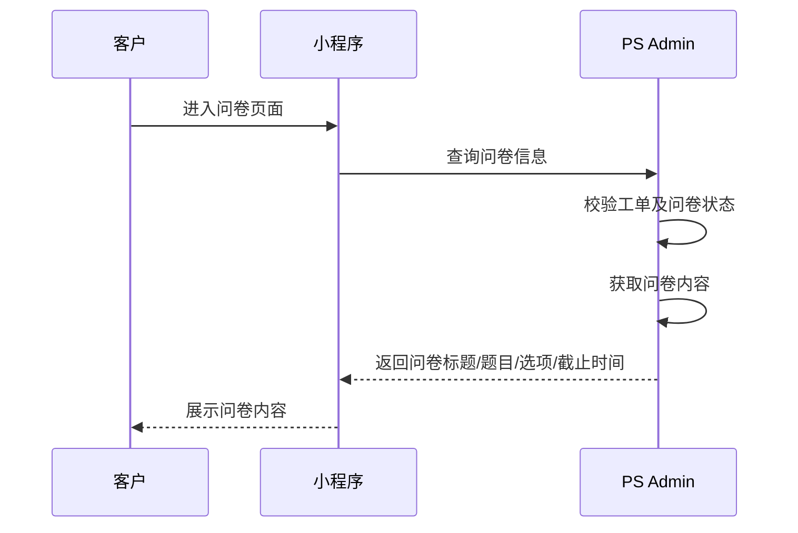

### 接口定义

|项目|内容|
|---|---|
|接口路径|`/api/miniapp/surveys`|
|请求方式|GET|
|调用方向|小程序 → PS Admin|
|鉴权方式|小程序用户身份令牌 / 签名|

### 请求参数

| 字段名称  | 字段Key    | 数据类型   | 必填  | 默认值     | 说明                     |
| ----- | -------- | ------ | --- | ------- | ---------------------- |
| 工单编号  | ticketNo | String | 是   | -       | 售后工单编号                 |
| 客户手机号 | mobile   | String | 是   | -       | 客户手机号，作为客户身份校验条件       |
| 问卷编号  | surveyNo | String | 否   | 空       | 问卷任务编号；不传时返回当前工单最新有效问卷 |
| 语言    | language | String | 否   | `zh-CN` | `zh-CN` / `en` / `ko`  |

### 返回参数

|字段名称|字段Key|数据类型|说明|
|---|---|---|---|
|返回码|code|Integer|接口处理结果码，成功返回 `200`|
|返回说明|message|String|接口处理结果说明|
|返回数据|data|Object|具体返回数据|
|工单编号|data.ticketNo|String|售后工单编号|
|问卷编号|data.surveyNo|String|问卷任务编号|
|问卷标题|data.surveyTitle|String|问卷标题|
|问卷说明|data.surveyDesc|String|问卷说明|
|问卷状态|data.surveyStatus|String|`PENDING` / `SUBMITTED` / `EXPIRED` / `INVALID`|
|截止时间|data.deadlineTime|Datetime|问卷填写截止时间|
|是否允许提交|data.canSubmit|Boolean|当前是否允许提交问卷|
|题目列表|data.questions|Array|问卷题目及选项|
|题目编号|data.questions[].questionNo|String|题目唯一编号|
|题目标题|data.questions[].questionTitle|String|题目内容|
|题目类型|data.questions[].questionType|String|`SINGLE` / `MULTIPLE` / `TEXT` / `SCORE`|
|是否必答|data.questions[].required|Boolean|是否必填|
|排序号|data.questions[].sortNo|Integer|展示顺序|
|选项列表|data.questions[].options|Array|题目选项列表|
|选项编号|data.questions[].options[].optionNo|String|选项唯一编号|
|选项内容|data.questions[].options[].optionText|String|选项显示内容|
|选项排序号|data.questions[].options[].sortNo|Integer|展示顺序|

## 3.9 问卷结果接收接口

服务完成后，问卷内容由 PS Admin 提供，小程序负责展示问卷并收集客户填写结果。客户提交后，小程序将问卷结果回写至 PS Admin，由 PS Admin 负责校验问卷有效性、写入问卷记录，并更新问卷状态及回访状态。

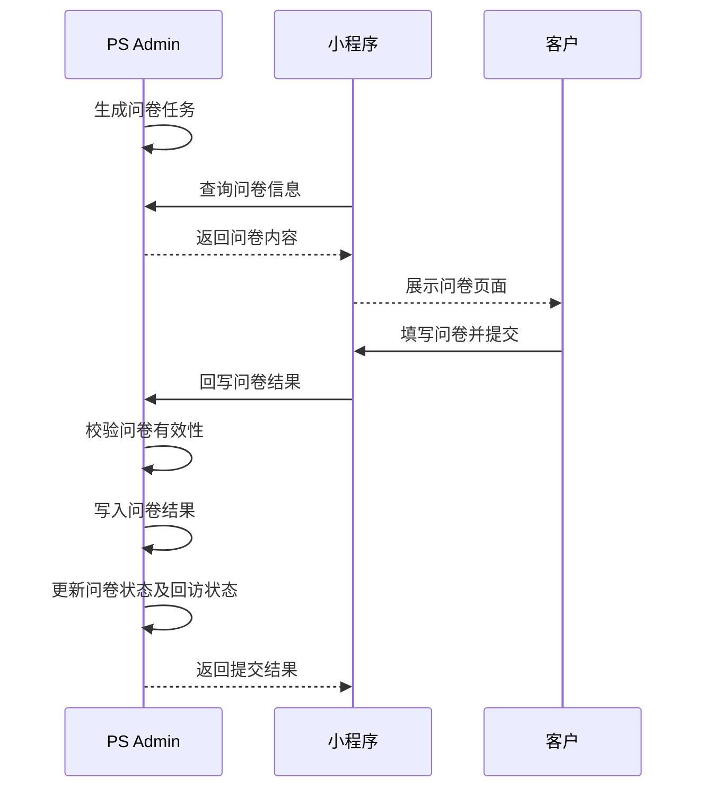

### 接口定义

|项目|内容|
|---|---|
|接口路径|`/api/miniapp/surveys/result`|
|请求方式|POST|
|调用方向|小程序 → PS Admin|

### 请求参数

|字段名称|字段Key|数据类型|必填|默认值|说明|
|---|---|---|---|---|---|
|工单编号|ticketNo|String|是|-|售后工单编号|
|问卷编号|surveyNo|String|是|-|问卷任务编号|
|评分|score|Integer|否|空|整体满意度评分|
|答案列表|answers|Array|是|-|问卷题目答案|
|反馈内容|feedback|String|否|空|主观评价|
|提交时间|submitTime|Datetime|是|-|提交时间|
|客户手机号|mobile|String|是|-|客户手机号，作为客户身份校验条件|

### 返回参数

|字段名称|字段Key|数据类型|说明|
|---|---|---|---|
|返回码|code|Integer|接口处理结果码，成功返回 `200`|
|返回说明|message|String|接口处理结果说明|
|返回数据|data|Object|具体返回数据|
|问卷状态|data.surveyStatus|String|`SUBMITTED` / `EXPIRED` / `INVALID`|
|回访状态|data.followUpStatus|String|回访状态|

## 3.10 客户确认事项结果接收接口

客户在小程序中查看工单详情后，可根据 `confirmation` 对象中的事项内容提交确认或拒绝结果；小程序将结果回写至 PS Admin，由 PS Admin 记录处理内容、更新时间及事项状态。电话、线下等非小程序场景可由后台人工补录，事项结果默认不直接阻塞主状态流转。

一个工单可存在多次客户确认事项。小程序按事项编号回写对应确认结果，PS Admin 记录处理结果并更新事项状态。客户确认事项是否影响后续主流程推进，按最终业务规则执行。

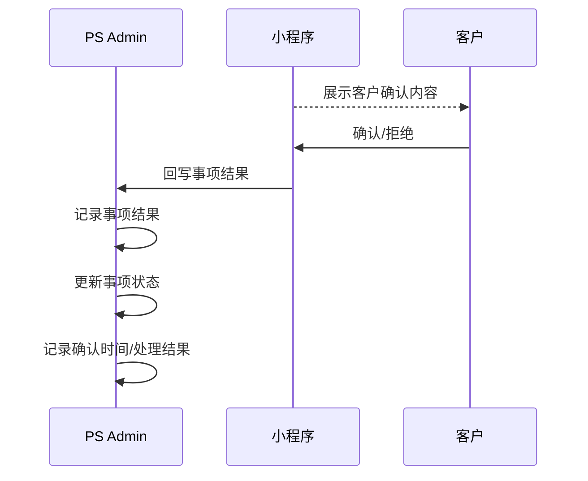

### 接口定义

|项目|内容|
|---|---|
|接口路径|`/api/miniapp/tasks/result`|
|请求方式|POST|
|调用方向|小程序 → PS Admin|

### 请求参数

|字段名称|字段Key|数据类型|必填|默认值|说明|
|---|---|---|---|---|---|
|工单编号|ticketNo|String|是|-|售后工单编号|
|事项编号|taskNo|String|是|-|事项编号|
|事项类型|taskType|String|是|-|固定为 `CONFIRM`|
|确认结论|result|String|是|-|`CONFIRMED` / `REJECTED`|
|处理时间|handledTime|Datetime|是|-|处理时间|
|客户手机号|mobile|String|是|-|客户手机号，作为客户身份校验条件|

### 返回参数

|字段名称|字段Key|数据类型|说明|
|---|---|---|---|
|返回码|code|Integer|接口处理结果码，成功返回 `200`|
|返回说明|message|String|接口处理结果说明|
|返回数据|data|Object|具体返回数据|
|当前事项状态|data.taskStatus|String|`UPDATED` / `DONE` / `PENDING`|

## 3.11 取消订单接口

客户可在进入正式维修前通过小程序发起取消申请；进入“维修进行中”及之后状态后，小程序不再提供取消入口，如需取消仅允许后台人工处理。PS Admin 接收申请后同步校验当前状态、执行取消处理，并在同一次请求中直接返回取消处理结果（成功 / 失败 / 拒绝）；失败或拒绝时返回具体原因说明，不再另行异步回调。

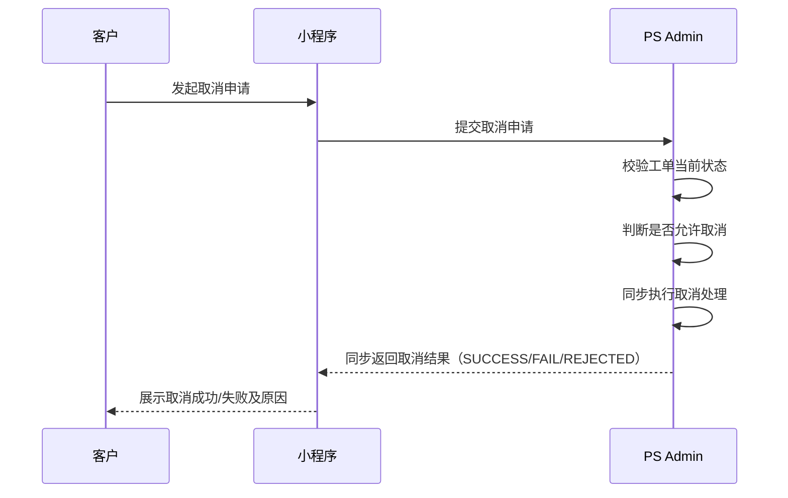

### 接口定义

|项目|内容|
|---|---|
|接口路径|`/api/miniapp/tickets/cancel`|
|请求方式|POST|
|调用方向|小程序 → PS Admin|

### 请求参数

|字段名称|字段Key|数据类型|必填|默认值|说明|
|---|---|---|---|---|---|
|工单编号|ticketNo|String|是|-|售后工单编号|
|取消原因|cancelReason|String|是|-|客户选择的取消原因|
|取消说明|cancelRemark|String|否|空|客户补充说明|
|取消来源|cancelSource|String|是|`CUSTOMER`|取消来源|
|申请时间|applyTime|Datetime|是|-|提交时间|
|客户手机号|mobile|String|是|-|客户手机号，作为客户身份校验条件|

### 返回参数

|字段名称|字段Key|数据类型|说明|
|---|---|---|---|
|返回码|code|Integer|接口处理结果码，成功返回 `200`|
|返回说明|message|String|接口处理结果说明|
|返回数据|data|Object|具体返回数据|
|工单编号|data.ticketNo|String|工单编号|
|取消结果|data.cancelResult|String|`SUCCESS` / `FAIL` / `REJECTED`|
|取消时间|data.cancelTime|Datetime|取消完成时间（成功时返回）|
|原因说明|data.reason|String|失败或拒绝时返回的原因说明|
|工单最新状态|data.currentStatus|String|取消处理后的工单最新状态|

