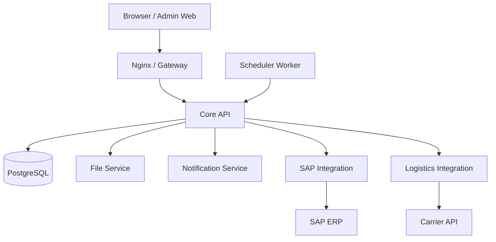

# System Architecture Overview

This document describes the high-level architecture of the PS system.

## Component Diagram

## Directory Responsibilities

- **apps/**: User-facing applications (Frontend & Main Backend).
- **services/**: Domain-specific microservices for external integrations.
- **packages/**: Reusable code shared across apps and services.
- **infra/**: Configuration for deployment and environment management.
- **docs/**: Project-level documentation and design specifications.
