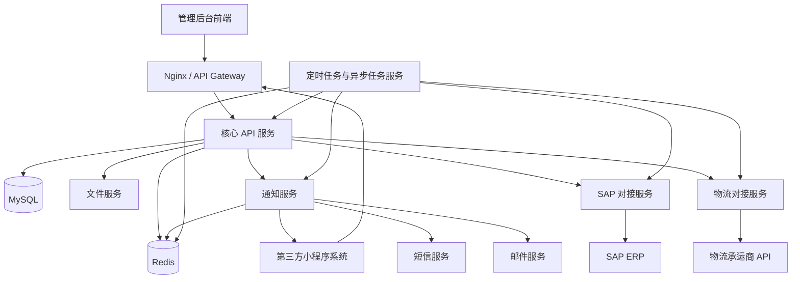

# 系统架构总览

本文档用于说明 PS 系统的架构设计，明确系统主要组成、服务职责、外部系统关系及基础设施支撑方式。

PS 系统以核心 API 服务为业务中心，管理后台通过统一网关访问后端能力；第三方小程序系统通过接口获取工单、支付、确认、问卷及物流等业务数据，并接收 PS 系统推送的事件通知。系统通过独立服务对接 SAP、物流、通知、文件及定时任务能力，正式业务数据以 MySQL 为准，Redis 作为缓存、幂等、任务锁及异步任务辅助组件。

## 组件关系图

## 目录职责说明

- **apps/**  
  承载系统核心应用，包括管理后台前端及核心 API，负责业务处理、接口提供与系统入口。

- **services/**  
  按领域拆分的独立服务，负责外部系统对接及专项能力，如 SAP、物流、通知、文件处理及定时任务。

- **packages/**  
  公共代码模块，提供跨应用与服务复用的类型定义、工具方法、常量及服务调用封装。

- **infra/**  
  基础设施与部署相关内容，包括网关配置、容器化配置、脚本及数据库初始化脚本。

- **docs/**  
  项目文档，包括需求说明、接口文档、数据库设计及架构设计等。
