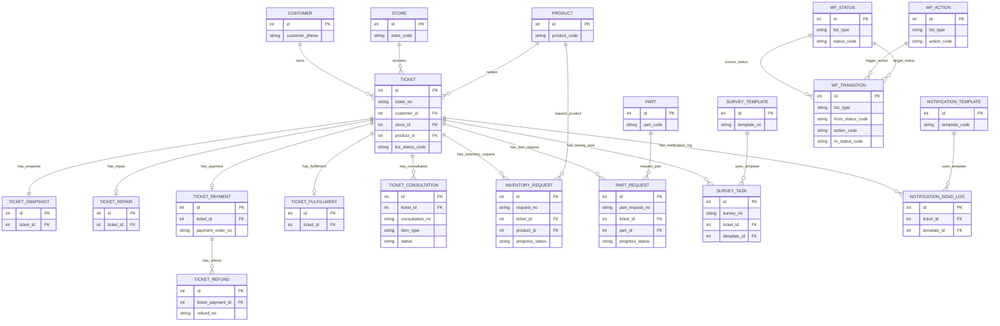
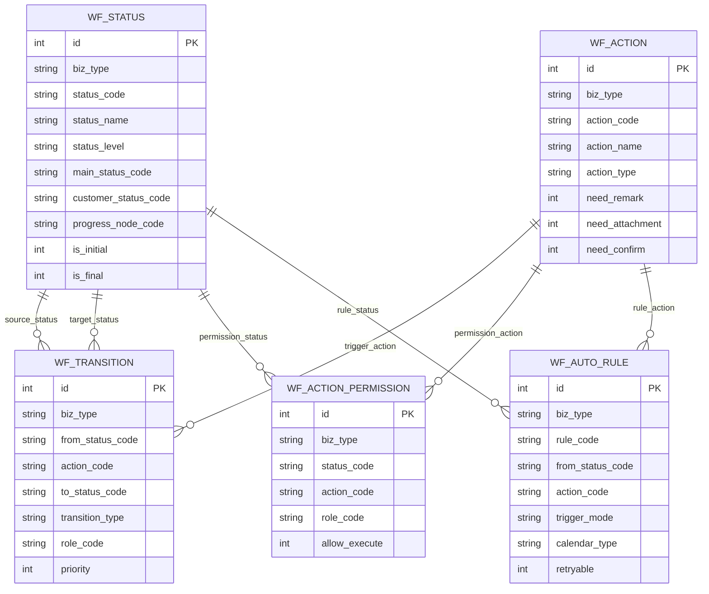
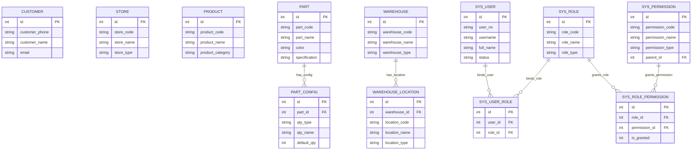
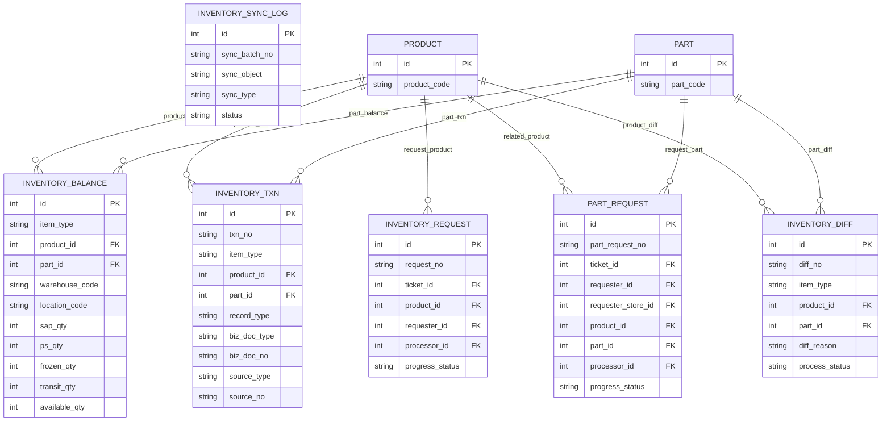
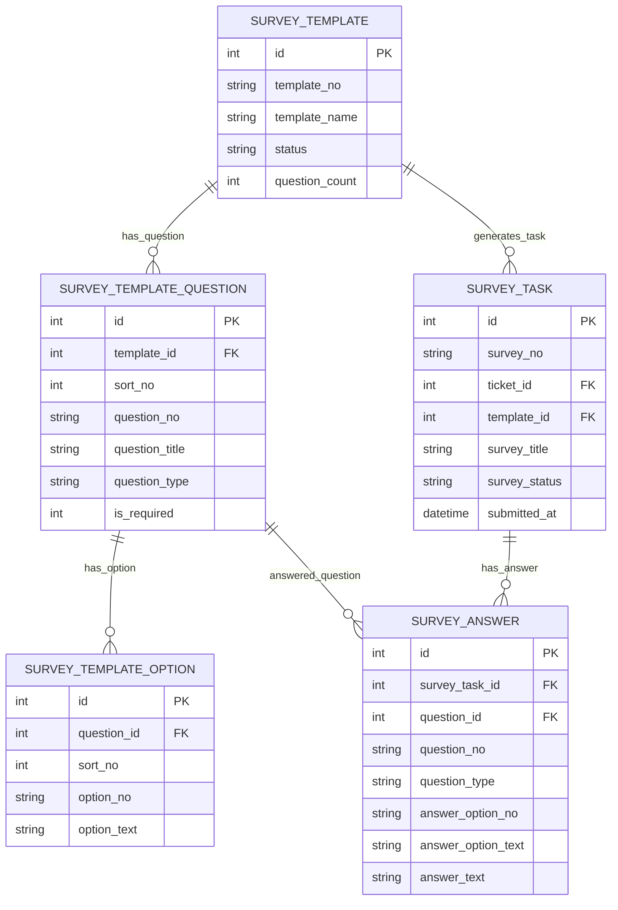
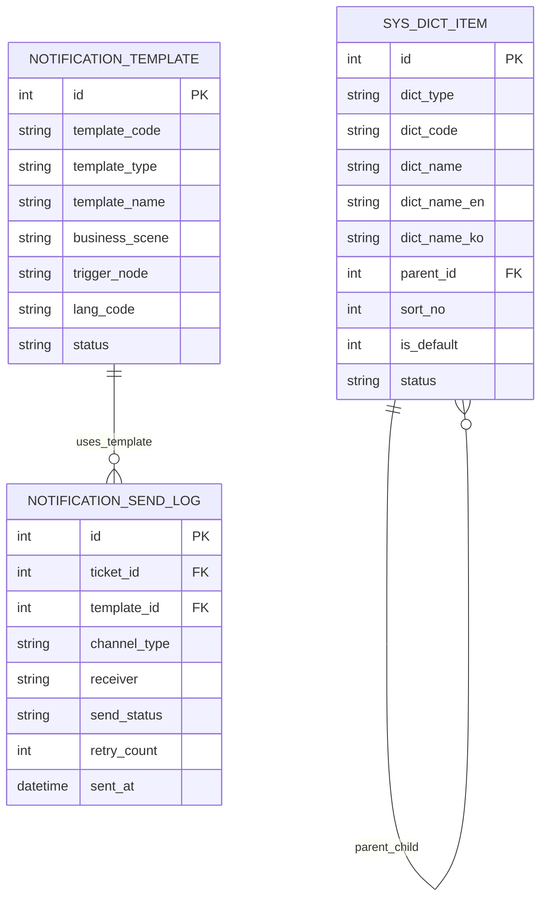

# Gentle Monster 中国区售后系统数据库设计文档

## 1. 文档说明

本文档用于定义 Gentle Monster 中国区售后系统数据库物理设计方案，覆盖售后工单主流程、状态机、维修、支付、退款、履约、咨询、库存、问卷、通知、字典、主数据及权限等核心数据对象。

本文档面向数据库设计、后端开发、接口设计、联调测试、初始化数据准备及后续运维扩展使用。

本文档基于 MySQL 8 设计，采用“业务主线表 + 阶段结果表 + 过程留痕表 + 主数据表 + 配置表 + 初始化数据规则”的方式建模，作为当前项目数据库设计、建表实施、字段解释、约束落地和初始化配置的统一依据。

## 2. 设计目标

本数据库设计围绕售后工单全流程展开，重点解决以下问题：

1. 支撑工单从申请、受理、接收、判定、支付、处理、履约到完成的全过程数据落地
    
2. 支撑状态、动作、下一状态、权限、自动推进规则的状态机建模
    
3. 支撑支付、退款、维修、物流、咨询、库存、问卷等子域独立扩展
    
4. 保证历史过程可追踪、状态变化可审计、库存变化可留痕
    
5. 保证当前运行结果、历史过程数据、基础主数据职责分离
    
6. 保证库存结果与库存流水分离，避免多口径库存结果并存
    
7. 保证前端展示状态、后台业务状态、主状态之间口径统一
    
8. 支撑后续接口联调、初始化数据导入、业务规则补充和系统扩展
    

## 3. 设计原则

### 3.1 工单主表承接当前运行态

`ticket` 作为工单主表，保存工单当前主状态、当前后台业务状态、当前客户展示状态、当前支付状态、当前维修状态、当前履约状态、当前责任人及最近一次动作等摘要结果。

工单主表不承接全部业务过程明细。

### 3.2 快照与主数据分离

客户、产品、门店等主数据会变化，历史工单不可被主数据覆盖，因此通过 `ticket_snapshot` 保存工单发生时的业务快照。

### 3.3 状态变化必须通过动作驱动

工单状态不可直接人工修改。所有状态变化统一通过动作执行完成，再由状态流转规则确定下一状态。

### 3.4 阶段结果与过程留痕分离

维修、支付、退款、履约等属于阶段结果，单独建表承接。附件、进展、咨询、日志、异常、库存流水、问卷答案等属于过程留痕，单独建表承接。

### 3.5 库存采用余额表 + 流水表 + 产品申请表 + 小零件申请表 + 差异表模型

库存当前结果由 `inventory_balance` 承接，库存变动过程由 `inventory_txn` 承接，产品库存申请由 `inventory_request` 承接，小零件申请由 `part_request` 承接，库存差异闭环由 `inventory_diff` 承接。

其中：

- `inventory_request` 仅承接与工单相关的**产品库存申请**
- `part_request` 仅承接维修中心、门店或相关业务场景下的**小零件申请**

库存结果不直接保存在产品主数据表中。

### 3.6 主数据只承接稳定基础信息

主数据表只保存相对稳定的基础对象信息，不保存库存结果、流程结果、阶段结果、业务日志等动态数据。

### 3.7 状态机是状态唯一来源

系统中存在状态流转关系的业务对象，其状态编码、状态名称、多语言名称、状态归类、前端展示口径、初始状态、结束状态、流转关系、动作定义、权限控制及自动规则，统一由状态机相关表维护。

当前状态机配置适用于以下业务对象：

- `TICKET`
- `INVENTORY_REQUEST`
- `PART_REQUEST`
- `CONSULTATION`
- `SURVEY`

对于仅需维护状态值但暂不涉及复杂动作、权限或自动规则的业务对象，可先使用统一状态表维护状态定义及流转关系，并按实际需要逐步补充动作、权限和自动规则配置。

### 3.8 高并发表以逻辑关联 + 索引为主

对于库存流水、状态日志、动作日志、通知日志等高频写入表，以逻辑关联和索引约束为主；对于工单阶段表、从属表、关系表等强归属对象，以物理外键为主。

### 3.9 历史结果必须可回放

报价、支付、退款、问卷答案、客户确认、库存差异处理等关键业务场景，必须保存当次业务结果，不依赖后续主数据或配置变化进行反推。

## 4. 技术范围与版本约束

### 4.1 数据库版本

- MySQL 8.x
    

### 4.2 字符集与排序规则

- 字符集：`utf8mb4`
    
- 排序规则：`utf8mb4_0900_ai_ci`
    

### 4.3 时区规则

- 所有时间字段按系统统一时区写入
    
- 接口层、服务层、数据库层统一使用同一时区口径
    
- 若后续涉及多时区展示，由应用层转换，不在数据库表结构中拆分多时区字段
    

### 4.4 引擎要求

- 业务表、主数据表、配置表统一使用 `InnoDB`
    

## 5. 命名规范

### 5.1 表命名

- 全部使用小写英文
    
- 单词之间使用下划线
    
- 状态机表统一使用 `wf_` 前缀
    
- 系统配置类表统一使用 `sys_` 前缀
    

### 5.2 主键规范

- 所有主键统一使用 `BIGINT`
    
- 主键字段名统一为 `id`
    
- 主键采用自增或分布式 ID 均可，数据库字段类型统一为 `BIGINT`
    

### 5.3 时间字段规范

- 创建时间统一为 `created_at`
    
- 更新时间统一为 `updated_at`
    
- 业务发生时间按业务语义命名，如 `paid_at`、`repair_completed_at`、`submitted_at`
    

### 5.4 状态字段规范

- 所有状态、动作、类型枚举字段统一使用 `VARCHAR`
    
- 不使用 MySQL `ENUM`
    
- 具体枚举值统一由字典表或状态机初始化数据维护
    

### 5.5 审计字段规范

- 主业务表、阶段结果表、配置表建议包含 `created_at`、`updated_at`
    
- 需要记录操作归属的表，增加 `created_by`、`updated_by`
    
- 日志表优先使用 `operator_id` 或业务语义字段记录操作人
    
- 日志表原则上只追加，不物理更新历史记录
    

### 5.6 删除策略规范

- 主数据表、配置表、主业务表采用逻辑删除或状态停用策略
    
- 日志表、流水表、答案表、状态日志表不做逻辑删除，原则上只追加
    
- 关系表如需停用，优先通过状态字段或删除关系记录处理
    

### 5.7 编号字段规范

系统中涉及以下业务编号：

- 工单编号：`ticket_no`
- 咨询事项编号：`consultation_no`
- 支付单号：`payment_order_no`
- 退款单号：`refund_no`
- 产品库存申请单号：`request_no`
- 小零件申请单号：`part_request_no`
- 库存交易号：`txn_no`
- 差异单号：`diff_no`
- 问卷任务编号：`survey_no`
- 同步批次号：`sync_batch_no`
- 通知模板编码：`template_code`
- 状态编码：`status_code`
- 动作编码：`action_code`

所有业务编号必须设置唯一约束，编号生成规则由统一编号服务或统一业务规则模块维护。


## 6. 数据类型与默认值实施规范

### 6.1 字符串字段

- 编号类字段优先使用 `VARCHAR(64)`
    
- 名称类字段优先使用 `VARCHAR(100)` 或 `VARCHAR(200)`
    
- URL 类字段优先使用 `VARCHAR(500)`
    
- 长文本说明类字段优先使用 `TEXT` 或 `LONGTEXT`
    

### 6.2 金额字段

- 所有金额统一使用 `DECIMAL(10,2)`
    
- 币种字段统一使用 `VARCHAR(16)`
    

### 6.3 数量字段

- 库存、申请数量、差异数量统一使用 `INT`
    
- 比例类字段统一使用 `DECIMAL(10,2)`
    

### 6.4 布尔语义字段

- 布尔语义字段统一使用 `TINYINT`
    
- 0 表示否，1 表示是
    

### 6.5 JSON字段使用规则

以下场景允许使用 JSON：

- 结构不固定但需要整体保存的快照字段
    
- 需要保留原始请求载荷的日志字段
    
- 多选值集合字段
    

本项目使用 JSON 的字段包括但不限于：

- `ticket_snapshot.accessory_types_json`
    
- `ticket_action_log.request_payload`
    

### 6.6 默认值规则

- 状态类字段原则上不在数据库层给业务默认值，由业务层显式写入
    
- 计数类字段默认 `0`
    
- 布尔类字段默认 `0`
    
- 创建时间默认 `CURRENT_TIMESTAMP`
    
- 更新时间默认 `CURRENT_TIMESTAMP` 并自动刷新
    

## 7. 数据库表设计

本章用于说明 Gentle Monster 中国区售后系统核心业务数据的表结构设计方案。数据库表设计按业务域拆分为工单主线、状态机、主数据与权限、库存、问卷、通知与字典配置等模块，分别承接当前运行结果、阶段结果、过程留痕、基础主数据及系统配置数据。

整体设计遵循“主表承接当前态、子表承接阶段结果、日志表承接过程留痕、配置表承接规则与初始化口径”的原则，确保各业务对象职责清晰、关系明确、可追踪、可扩展，并支撑后续建表实施、初始化数据导入、接口联调及系统运行维护。

下图为本系统数据库核心业务总览 ER 图，用于从整体层面展示工单主线、状态机、主数据、库存申请、小零件申请、问卷及通知等核心业务对象之间的主要关系。



## 7.1 工单主线设计

工单主线是本系统的核心业务主线，用于承接售后申请从受理、接收、判定、支付、处理、履约到完成的全过程数据。

数据库设计中，工单主线不按页面展示块拆表，而是按照“主表承接当前运行结果、阶段表承接当前阶段结果、明细表承接过程留痕”的方式建模。

```mermaid
erDiagram
    TICKET {
        int id PK
        string ticket_no
        string source_request_no
        string apply_channel
        string original_ticket_no
        string barcode_no
        string so_no
        int customer_id FK
        int store_id FK
        int product_id FK
        string main_status_code
        string biz_status_code
        string customer_status_code
        string current_payment_status
        string current_repair_status
        string current_fulfillment_status
    }

    TICKET_SNAPSHOT {
        int id PK
        int ticket_id FK
        string customer_name
        string customer_phone
        string product_code
        string product_name
    }

    TICKET_REPAIR {
        int id PK
        int ticket_id FK
        string repair_type
        string repair_content
        decimal repair_fee_amount
        datetime repair_started_at
        datetime repair_completed_at
    }

    TICKET_PAYMENT {
        int id PK
        int ticket_id FK
        string payment_order_no
        string payment_status
        decimal payment_amount
        datetime paid_at
    }

    TICKET_PAYMENT_EVENT_LOG {
        int id PK
        int ticket_payment_id FK
        int ticket_id FK
        string event_type
        string event_result
    }

    TICKET_REFUND {
        int id PK
        int ticket_id FK
        int ticket_payment_id FK
        string refund_no
        string refund_status
        decimal refund_amount
    }

    TICKET_FULFILLMENT {
        int id PK
        int ticket_id FK
        string delivery_method
        string delivery_status
        string carrier_name
        string tracking_no
    }

    TICKET_INBOUND_LOGISTICS {
        int id PK
        int ticket_id FK
        string carrier_name
        string tracking_no
        string shipping_info_status
    }

    TICKET_CONSULTATION {
        int id PK
        int ticket_id FK
        string consultation_no
        string item_type
        string status
        string customer_confirm_result
    }

    TICKET_CANCEL_LOG {
        int id PK
        int ticket_id FK
        string cancel_source
        string cancel_result
    }

    TICKET_CONSULTATION_ATTACHMENT {
        int id PK
        int consultation_id FK
        string attachment_type
        string file_name
    }

    TICKET_ATTACHMENT {
        int id PK
        int ticket_id FK
        string file_name
        string file_url
    }

    TICKET_PROGRESS {
        int id PK
        int ticket_id FK
        string progress_type
        string progress_content
        datetime progress_time
    }

    TICKET_STATUS_LOG {
        int id PK
        int ticket_id FK
        string from_status_code
        string action_code
        string to_status_code
        datetime created_at
    }

    TICKET_ACTION_LOG {
        int id PK
        int ticket_id FK
        string action_code
        string action_name
        string execute_result
        datetime executed_at
    }

    TICKET_EXCEPTION {
        int id PK
        int ticket_id FK
        string exception_type
        string exception_status
        datetime occurred_at
    }

    TICKET_AVAILABLE_ACTION {
        int id PK
        int ticket_id FK
        string action_code
        string action_name
        string source_status_code
    }

    TICKET ||--|| TICKET_SNAPSHOT : has_snapshot
    TICKET ||--o| TICKET_REPAIR : has_repair
    TICKET ||--o| TICKET_PAYMENT : has_payment
    TICKET_PAYMENT ||--o{ TICKET_PAYMENT_EVENT_LOG : has_event_log
    TICKET_PAYMENT ||--o{ TICKET_REFUND : has_refund
    TICKET ||--o| TICKET_FULFILLMENT : has_fulfillment
    TICKET ||--o| TICKET_INBOUND_LOGISTICS : has_inbound_logistics
    TICKET ||--o{ TICKET_CONSULTATION : has_consultation
    TICKET ||--o{ TICKET_CANCEL_LOG : has_cancel_log
    TICKET_CONSULTATION ||--o{ TICKET_CONSULTATION_ATTACHMENT : has_attachment
    TICKET ||--o{ TICKET_ATTACHMENT : has_attachment
    TICKET ||--o{ TICKET_PROGRESS : has_progress
    TICKET ||--o{ TICKET_STATUS_LOG : has_status_log
    TICKET ||--o{ TICKET_ACTION_LOG : has_action_log
    TICKET ||--o{ TICKET_EXCEPTION : has_exception
    TICKET ||--o{ TICKET_AVAILABLE_ACTION : has_available_action
```



### 7.1.1 设计目标

1. 统一承接工单从创建到完成的完整业务过程
    
2. 清晰区分当前结果、阶段结果和历史过程数据
    
3. 支撑状态机驱动下的工单流程推进
    
4. 支撑维修、支付、退款、履约、咨询等业务子域独立扩展
    
5. 保证工单过程中的附件、日志、进展、异常等信息可追踪、可审计
    

### 7.1.2 设计原则

#### （1）以工单主表作为运行中心

`ticket` 是工单主线的核心表，用于保存工单当前运行态信息，包括：

- 当前主状态
    
- 当前后台业务状态
    
- 当前客户展示状态
    
- 当前支付、维修、履约摘要状态
    
- 当前责任人
    
- 最近一次动作
    
- 当前版本号
    

#### （2）主数据与工单快照分离

客户、产品、门店等主数据在业务运行过程中可能发生变化，工单历史数据必须保持当时业务场景的原始信息。因此 `ticket_snapshot` 用于保存工单发生时的客户信息、产品信息、受理信息、地址信息、工厂选择结果等业务快照。

#### （3）阶段结果按业务域拆分

维修、支付、退款、履约等阶段结果不堆叠在 `ticket` 主表中，而是拆分为独立子表：

- `ticket_repair`
    
- `ticket_payment`
    
- `ticket_refund`
    
- `ticket_fulfillment`
    

#### （4）过程留痕单独建表

附件、进展、咨询事项、状态日志、动作日志、异常记录、当前可执行动作等信息均属于天然一对多或动态生成数据，单独建表承接。

### 7.1.3 工单主线总体结构

#### 1. 当前运行结果层

- `ticket`
    

#### 2. 当前阶段结果层

- `ticket_snapshot`
- `ticket_repair`
- `ticket_payment`
- `ticket_refund`
- `ticket_fulfillment`
- `ticket_inbound_logistics`
#### 3. 过程留痕层

- `ticket_payment_event_log`
- `ticket_consultation`
- `ticket_cancel_log`
- `ticket_consultation_attachment`
- `ticket_attachment`
- `ticket_progress`
- `ticket_status_log`
- `ticket_action_log`
- `ticket_exception`
- `ticket_available_action`
    

### 7.1.4 各表职责说明

#### 7.1.4.1 ticket

工单主表，保存工单主身份、当前状态、当前阶段摘要结果及当前责任人信息，是工单列表、详情页、状态驱动与流程推进的核心表。

|字段名称|字段Key|数据类型|必填|默认值|逻辑规则|说明|
|---|---|---|---|---|---|---|
|主键ID|id|BIGINT|是|无|主键|工单主键|
|工单编号|ticket_no|VARCHAR(64)|是|无|唯一，不可重复|售后工单唯一编号|
|来源请求号|source_request_no|VARCHAR(64)|否|NULL|小程序创建工单时写入；同一请求号仅允许生成一张工单|用于承接小程序 `requestNo` 幂等口径|
|申请来源渠道|apply_channel|VARCHAR(32)|否|NULL|创建工单时写入|`MINIAPP` / `STORE` / `PS_ADMIN`|
|原工单编号|original_ticket_no|VARCHAR(64)|否|NULL|复制工单时记录来源|原始或关联工单编号|
|条码编号|barcode_no|VARCHAR(64)|否|NULL|唯一；绑定包裹后生成|条码编号|
|SO文件编号|so_no|VARCHAR(64)|否|NULL|SAP返回后写入|服务完成后的SO编号|
|客户ID|customer_id|BIGINT|否|NULL|关联 customer.id|客户主数据ID|
|门店ID|store_id|BIGINT|否|NULL|关联 store.id|门店主数据ID|
|产品ID|product_id|BIGINT|否|NULL|关联 product.id|主产品ID|
|主状态编码|main_status_code|VARCHAR(64)|是|无|来自状态机|流程主归类状态|
|后台业务状态编码|biz_status_code|VARCHAR(64)|是|无|来自状态机|当前实际运行状态|
|客户展示状态编码|customer_status_code|VARCHAR(64)|否|NULL|由状态映射得出|客户展示状态|
|当前支付状态|current_payment_status|VARCHAR(64)|否|NULL|支付阶段同步摘要|待支付、已支付等|
|当前维修状态|current_repair_status|VARCHAR(64)|否|NULL|维修阶段同步摘要|维修中、待配件等|
|当前履约状态|current_fulfillment_status|VARCHAR(64)|否|NULL|履约阶段同步摘要|待发货、已送达等|
|判定负责人ID|judge_owner_id|BIGINT|否|NULL|关联 sys_user.id|当前判定负责人|
|服务工程师ID|service_engineer_id|BIGINT|否|NULL|关联 sys_user.id|当前维修责任人|
|最近动作编码|last_action_code|VARCHAR(64)|否|NULL|动作执行后更新|最近一次动作|
|最近动作时间|last_action_at|DATETIME|否|NULL|动作执行后更新|最近一次动作时间|
|最近动作人ID|last_action_by|BIGINT|否|NULL|关联 sys_user.id|最近操作人|
|服务完成时间|service_completed_at|DATETIME|否|NULL|服务完成时写入|服务结束时间|
|关闭时间|closed_at|DATETIME|否|NULL|取消/关闭时写入|终态关闭时间|
|版本号|version_no|INT|是|1|每次状态变化 +1|乐观锁版本号|
|创建人ID|created_by|BIGINT|否|NULL|关联 sys_user.id|创建人|
|更新人ID|updated_by|BIGINT|否|NULL|关联 sys_user.id|更新人|
|创建时间|created_at|DATETIME|是|CURRENT_TIMESTAMP|创建时写入|创建时间|
|更新时间|updated_at|DATETIME|是|CURRENT_TIMESTAMP|更新时自动刷新|更新时间|
|删除标记|is_deleted|TINYINT|是|0|0否1是|逻辑删除标记|

**唯一约束**

- `ticket_no`
- `barcode_no`
- `source_request_no`

**索引建议**

- `main_status_code, biz_status_code, created_at`
- `customer_id, created_at`
- `judge_owner_id, biz_status_code`
- `service_engineer_id, biz_status_code`
- `source_request_no`

#### 7.1.4.2 ticket_snapshot

保存工单发生时的客户、产品、受理、地址、工厂选择结果等业务快照，避免主数据后续变化影响历史工单。

|字段名称|字段Key|数据类型|必填|默认值|逻辑规则|说明|
|---|---|---|---|---|---|---|
|主键ID|id|BIGINT|是|无|主键|快照主键|
|工单ID|ticket_id|BIGINT|是|无|关联 ticket.id，唯一一条|所属工单|
|客户姓名|customer_name|VARCHAR(100)|是|无|创建工单时写入|客户姓名快照|
|客户手机号|customer_phone|VARCHAR(32)|是|无|创建工单时写入|客户手机号快照|
|客户邮箱|customer_email|VARCHAR(100)|否|NULL|创建工单时写入|客户邮箱快照|
|国家编码|country_code|VARCHAR(50)|否|NULL|创建工单时写入|国家/区域|
|收货类型|receive_type|VARCHAR(32)|否|NULL|门店/快递|收货方式|
|收货地址|receive_address|VARCHAR(255)|否|NULL|创建或修改时快照更新|收货地址|
|受理渠道类型|receive_channel_type|VARCHAR(64)|否|NULL|门店/邮寄/小程序|受理渠道类型|
|受理渠道|receive_channel|VARCHAR(100)|否|NULL|原始申请值|受理渠道名称|
|受理门店编码|receive_store_code|VARCHAR(64)|否|NULL|按门店快照写入|门店编码快照|
|受理门店名称|receive_store_name|VARCHAR(100)|否|NULL|按门店快照写入|门店名称快照|
|购买日期|purchase_date|DATE|否|NULL|原始申请值|购买日期|
|购买渠道|purchase_channel|VARCHAR(100)|否|NULL|原始申请值|购买来源|
|客户请求事项|customer_request|TEXT|否|NULL|原始申请值|客户请求描述|
|产品编码|product_code|VARCHAR(64)|否|NULL|创建工单时写入|产品编码快照|
|产品名称|product_name|VARCHAR(200)|否|NULL|创建工单时写入|产品名称快照|
|产品类别|product_category|VARCHAR(64)|否|NULL|创建工单时写入|产品类别快照|
|选定工厂编码|selected_factory_code|VARCHAR(64)|否|NULL|判定或维修时写入|工厂编码快照|
|选定工厂名称|selected_factory_name|VARCHAR(100)|否|NULL|判定或维修时写入|工厂名称快照|
|配件编码|part_code|VARCHAR(64)|否|NULL|涉及配件时写入|配件编码快照|
|配件名称|part_name|VARCHAR(200)|否|NULL|涉及配件时写入|配件名称快照|
|配件位置|part_location|VARCHAR(100)|否|NULL|涉及配件时写入|配件存放位置|
|有购买凭证|has_purchase_proof|TINYINT|是|0|0否1是|是否提供购买凭证|
|有随附物品|has_accessories|TINYINT|是|0|0否1是|是否有随附物品|
|有保修卡|has_warranty_card|TINYINT|是|0|0否1是|是否附保修卡|
|随附物品列表|accessory_types_json|JSON|否|NULL|存储多选项|随附物品分类集合|
|创建时间|created_at|DATETIME|是|CURRENT_TIMESTAMP|创建时写入|创建时间|
|更新时间|updated_at|DATETIME|是|CURRENT_TIMESTAMP|更新时自动刷新|更新时间|

**唯一约束**

- `ticket_id`
    

#### 7.1.4.3 ticket_repair

承接工单维修阶段的结果信息、时间信息、维修判断信息、工厂选择结果及费用计算结果。

|字段名称|字段Key|数据类型|必填|默认值|逻辑规则|说明|
|---|---|---|---|---|---|---|
|主键ID|id|BIGINT|是|无|主键|维修主键|
|工单ID|ticket_id|BIGINT|是|无|关联 ticket.id，建议唯一|所属工单|
|总部入库日期|hq_inbound_date|DATETIME|否|NULL|收件完成后写入|产品入库时间|
|预计出库日期|expected_outbound_date|DATE|否|NULL|按规则自动生成，可人工调整|预计寄出日期|
|预计完成日期|expected_completion_date|DATE|否|NULL|按规则自动生成，可人工调整|预计完成日期|
|移交总部日期|transfer_hq_date|DATE|否|NULL|总部场景写入|移交总部时间|
|总部返还签收日期|hq_return_signed_date|DATE|否|NULL|总部返还后写入|返还签收时间|
|现象|phenomenon|VARCHAR(100)|否|NULL|原始/预检信息|现象描述|
|问题现象|issue_phenomenon|VARCHAR(100)|否|NULL|维修阶段填写|问题现象|
|镜片类型|lens_type|VARCHAR(64)|否|NULL|镜片场景使用|镜片类型|
|维修地点|repair_location|VARCHAR(100)|否|NULL|维修执行位置|维修处|
|维修类型|repair_type|VARCHAR(64)|否|NULL|无偿/有偿/合作厂家/3PL 等|维修类型|
|维修内容|repair_content|VARCHAR(64)|否|NULL|业务字典维护|维修内容|
|选定工厂编码|selected_factory_code|VARCHAR(64)|否|NULL|维修或判定时写入|工厂编码|
|选定工厂名称|selected_factory_name|VARCHAR(100)|否|NULL|维修或判定时写入|工厂名称|
|更换产品编码|replacement_product_code|VARCHAR(64)|否|NULL|更换其他产品时填写|更换产品编码|
|更换产品名称|replacement_product_name|VARCHAR(200)|否|NULL|更换其他产品时填写|更换产品名称|
|再维修原因|repair_again_reason|VARCHAR(100)|否|NULL|再维修场景填写|重复维修原因|
|是否产品问题|is_product_issue|TINYINT|是|0|0否1是|是否属于产品问题|
|维修费用类型|repair_fee_type|VARCHAR(32)|否|NULL|有偿/无偿|维修费用类型|
|维修费用比例|repair_fee_percent|DECIMAL(10,2)|否|NULL|基于 SAP 价格比例|维修费用比例|
|价格基准金额|base_price_amount|DECIMAL(10,2)|否|NULL|取自当次报价基准|报价基准金额|
|维修费用金额|repair_fee_amount|DECIMAL(10,2)|否|NULL|按规则计算后的最终金额|最终维修费用|
|币种|currency_code|VARCHAR(16)|否|NULL|默认 CNY|币种|
|维修参考事项|repair_reference_note|TEXT|否|NULL|补充说明|维修参考说明|
|维修开始时间|repair_started_at|DATETIME|否|NULL|进入维修进行中写入|维修开始时间|
|维修完成时间|repair_completed_at|DATETIME|否|NULL|提交维修完成写入|维修完成时间|
|创建时间|created_at|DATETIME|是|CURRENT_TIMESTAMP|创建时写入|创建时间|
|更新时间|updated_at|DATETIME|是|CURRENT_TIMESTAMP|更新时自动刷新|更新时间|

**唯一约束**

- `ticket_id`
    

#### 7.1.4.4 ticket_payment

承接工单支付阶段的支付订单主结果信息，包括支付订单、支付状态、支付金额、支付方式、支付流水、支付授权号、支付截止时间、支付完成时间及最近一次支付回写摘要结果。支付回写原始报文、补偿查询明细及多次回写过程，不直接堆叠在本表中，改由支付事件日志表承接。

|字段名称|字段Key|数据类型|必填|默认值|逻辑规则|说明|
|---|---|---|---|---|---|---|
|主键ID|id|BIGINT|是|无|主键|支付主键|
|工单ID|ticket_id|BIGINT|是|无|关联 ticket.id|所属工单|
|支付订单号|payment_order_no|VARCHAR(64)|是|无|唯一|支付订单编号|
|支付状态|payment_status|VARCHAR(64)|是|无|状态机/支付结果回写|当前支付状态|
|支付金额|payment_amount|DECIMAL(10,2)|否|NULL|报价后写入|支付金额|
|支付方式|payment_method|VARCHAR(50)|否|NULL|如微信支付|支付方式|
|支付授权号|payment_auth_no|VARCHAR(100)|否|NULL|支付成功后回写|支付授权号|
|支付流水号|payment_txn_no|VARCHAR(100)|否|NULL|支付成功后回写|支付流水号|
|最终支付请求号|final_payment_request_no|VARCHAR(100)|否|NULL|支付补偿查询使用|最终支付请求标识|
|验签结果|sign_verified|TINYINT|是|0|支付结果回写时写入|小程序侧验签或核单结果|
|最近回写时间|last_callback_at|DATETIME|否|NULL|收到支付结果回写时更新|最近一次支付回写时间|
|最近补偿查询时间|last_compensation_at|DATETIME|否|NULL|支付补偿查询完成后更新|最近一次补偿查询时间|
|最近补偿结果|last_compensation_result|VARCHAR(32)|否|NULL|补偿查询后更新|`SUCCESS` / `FAIL` / `UNKNOWN`|
|报价时间|quoted_at|DATETIME|否|NULL|生成报价后写入|报价时间|
|付款待机开始时间|payable_start_at|DATETIME|否|NULL|进入付款待机时写入|支付起算时间|
|支付截止日期|payment_deadline|DATE|否|NULL|付款待机开始 + 29 天|支付截止日期|
|支付完成时间|paid_at|DATETIME|否|NULL|支付成功时写入|支付时间|
|支付链接|payment_link|VARCHAR(500)|否|NULL|生成支付订单时写入|支付入口链接|
|是否取消支付|is_payment_cancelled|TINYINT|是|0|0否1是|是否取消支付|
|创建时间|created_at|DATETIME|是|CURRENT_TIMESTAMP|创建时写入|创建时间|
|更新时间|updated_at|DATETIME|是|CURRENT_TIMESTAMP|更新时自动刷新|更新时间|

**唯一约束**

- `payment_order_no`

**索引建议**

- `ticket_id, payment_status`
- `payment_status, payment_deadline`
- `payment_txn_no`


#### 7.1.4.4A ticket_payment_event_log

承接支付结果回写、支付补偿查询、人工修正等支付相关过程事件，用于支付幂等、异常补偿、报文追溯及问题排查。

|字段名称|字段Key|数据类型|必填|默认值|逻辑规则|说明|
|---|---|---|---|---|---|---|
|主键ID|id|BIGINT|是|无|主键|支付事件日志主键|
|支付表ID|ticket_payment_id|BIGINT|是|无|关联 `ticket_payment.id`|所属支付记录|
|工单ID|ticket_id|BIGINT|是|无|关联 `ticket.id`|所属工单|
|事件类型|event_type|VARCHAR(32)|是|无|支付相关事件分类|`CALLBACK` / `COMPENSATION_QUERY` / `MANUAL_ADJUST`|
|事件来源|event_source|VARCHAR(32)|否|NULL|来源系统|`MINI_PROGRAM` / `PS_ADMIN`|
|处理结果|event_result|VARCHAR(32)|否|NULL|事件处理结果|`SUCCESS` / `FAIL` / `RETRY` / `UNKNOWN`|
|支付结果|payment_result|VARCHAR(32)|否|NULL|支付侧结果|`SUCCESS` / `FAIL` / `CANCEL`|
|支付状态|payment_status|VARCHAR(64)|否|NULL|本次事件对应状态|支付状态快照|
|请求载荷|request_payload|LONGTEXT|否|NULL|请求原文|原始请求报文|
|响应载荷|response_payload|LONGTEXT|否|NULL|响应原文|原始响应报文|
|原始报文|raw_payload|LONGTEXT|否|NULL|支付平台原始返回|追溯使用|
|发生时间|event_time|DATETIME|否|NULL|事件实际时间|业务发生时间|
|创建时间|created_at|DATETIME|是|CURRENT_TIMESTAMP|创建时写入|创建时间|

**索引建议**

- `ticket_payment_id, event_time`
- `ticket_id, event_type, event_time`


#### 7.1.4.5 ticket_refund

承接支付后取消维修或人工取消场景下的退款处理信息。一笔支付记录可对应多条退款记录。

|字段名称|字段Key|数据类型|必填|默认值|逻辑规则|说明|
|---|---|---|---|---|---|---|
|主键ID|id|BIGINT|是|无|主键|退款主键|
|工单ID|ticket_id|BIGINT|是|无|关联 ticket.id|所属工单|
|支付表ID|ticket_payment_id|BIGINT|是|无|关联 ticket_payment.id|所属支付记录|
|退款单号|refund_no|VARCHAR(64)|是|无|唯一|退款编号|
|退款状态|refund_status|VARCHAR(64)|是|无|退款处理中/退款完成/退款失败等|退款状态|
|退款金额|refund_amount|DECIMAL(10,2)|否|NULL|退款发起时写入|退款金额|
|退款时间|refund_time|DATETIME|否|NULL|退款成功时写入|退款时间|
|退款结果|refund_result|VARCHAR(100)|否|NULL|支付侧回写/人工填写|退款结果|
|退款原因|refund_reason|TEXT|否|NULL|退款发起时填写|退款原因|
|操作人ID|operator_id|BIGINT|否|NULL|关联 sys_user.id|退款处理人|
|备注|remark|TEXT|否|NULL|补充说明|备注|
|创建时间|created_at|DATETIME|是|CURRENT_TIMESTAMP|创建时写入|创建时间|
|更新时间|updated_at|DATETIME|是|CURRENT_TIMESTAMP|更新时自动刷新|更新时间|

**唯一约束**

- `refund_no`
    

#### 7.1.4.6 ticket_fulfillment

承接工单出库、发货、物流跟踪、门店交付等履约阶段结果。

|字段名称|字段Key|数据类型|必填|默认值|逻辑规则|说明|
|---|---|---|---|---|---|---|
|主键ID|id|BIGINT|是|无|主键|履约主键|
|工单ID|ticket_id|BIGINT|是|无|关联 ticket.id，建议唯一|所属工单|
|配送方式|delivery_method|VARCHAR(32)|否|NULL|快递/门店/3PL|配送方式|
|配送状态|delivery_status|VARCHAR(64)|否|NULL|来自状态机|当前履约状态|
|承运商名称|carrier_name|VARCHAR(100)|否|NULL|物流/3PL回写|承运商|
|运单号|tracking_no|VARCHAR(100)|否|NULL|物流场景写入|运单号|
|出库准备完成时间|outbound_ready_at|DATETIME|否|NULL|进入出库准备完成写入|出库准备时间|
|出库完成时间|outbound_completed_at|DATETIME|否|NULL|发货完成时写入|出库完成时间|
|配送开始时间|delivery_started_at|DATETIME|否|NULL|配送开始写入|配送开始时间|
|送达时间|delivered_at|DATETIME|否|NULL|送达客户或门店时写入|送达时间|
|签收时间|signed_at|DATETIME|否|NULL|客户签收时写入|签收时间|
|门店到货时间|store_arrived_at|DATETIME|否|NULL|门店到货场景写入|门店到货时间|
|门店收货时间|store_received_at|DATETIME|否|NULL|门店确认收货时写入|门店收货时间|
|客户取件时间|customer_picked_at|DATETIME|否|NULL|门店客户取件时写入|客户取件时间|
|3PL客户可见备注|visible_remark_3pl|TEXT|否|NULL|3PL场景客户可见|3PL备注|
|备注|remark|TEXT|否|NULL|补充说明|履约备注|
|创建时间|created_at|DATETIME|是|CURRENT_TIMESTAMP|创建时写入|创建时间|
|更新时间|updated_at|DATETIME|是|CURRENT_TIMESTAMP|更新时自动刷新|更新时间|

**唯一约束**

- `ticket_id`


#### 7.1.4.6A ticket_inbound_logistics

承接客户或门店向维修中心寄送产品时的寄件信息，用于小程序提交寄件信息、后台补录寄件信息、寄件状态判断及收件前查询。

`shipping_info_status` 仅表示工单当前寄件信息业务状态，不承接单次接口提交处理结果。

业务状态口径统一如下：
- `PENDING`：尚未提交有效寄件信息
- `SUBMITTED`：已提交有效寄件信息

提交寄件信息接口返回的 `REPEAT`、`FAIL` 属于接口处理结果，仅用于本次请求结果返回与日志留痕，不写入 `shipping_info_status`。

|字段名称|字段Key|数据类型|必填|默认值|逻辑规则|说明|
|---|---|---|---|---|---|---|
|主键ID|id|BIGINT|是|无|主键|寄件记录主键|
|工单ID|ticket_id|BIGINT|是|无|关联 `ticket.id`，建议唯一|所属工单|
|客户手机号快照|customer_phone|VARCHAR(32)|否|NULL|提交寄件信息时写入|用于接口归属校验留痕|
|寄件公司|carrier_name|VARCHAR(100)|否|NULL|小程序或后台录入|客户寄件物流公司|
|运单号|tracking_no|VARCHAR(100)|否|NULL|小程序或后台录入|客户寄件运单号|
|客户寄件时间|shipped_at|DATETIME|否|NULL|小程序提交时写入|客户实际寄件时间|
|寄件备注|remark|TEXT|否|NULL|提交时写入|寄件补充说明|
|提交来源|submit_source|VARCHAR(32)|否|NULL|小程序/后台补录|`MINI_PROGRAM` / `BACKEND` / `STORE`|
|寄件信息状态|shipping_info_status|VARCHAR(32)|是|`PENDING`|写入后更新|`PENDING` / `SUBMITTED` / `REPEAT` / `FAIL`|
|提交时间|submitted_at|DATETIME|否|NULL|提交寄件信息时写入|寄件信息提交时间|
|创建时间|created_at|DATETIME|是|CURRENT_TIMESTAMP|创建时写入|创建时间|
|更新时间|updated_at|DATETIME|是|CURRENT_TIMESTAMP|更新时自动刷新|更新时间|

**唯一约束**

- `ticket_id`

**索引建议**

- `tracking_no`
- `customer_phone, submitted_at`


#### 7.1.4.7 ticket_consultation

承接一般咨询事项与客户确认事项，一张工单可关联多条事项记录。

客户确认事项作为咨询事项的一种类型管理，`consultation_no` 对应小程序接口中的 `taskNo`。事项结果默认不直接阻塞工单主状态流转；如后续业务口径变更，再按配置启用阻塞能力。

|字段名称|字段Key|数据类型|必填|默认值|逻辑规则|说明|
|---|---|---|---|---|---|---|
|主键ID|id|BIGINT|是|无|主键|事项主键|
|工单ID|ticket_id|BIGINT|是|无|关联 ticket.id|所属工单|
|事项编号|consultation_no|VARCHAR(64)|是|无|唯一|事项唯一编号|
|事项类型|item_type|VARCHAR(32)|是|无|一般咨询/客户确认|事项类型|
|外呼类型|outbound_type|VARCHAR(64)|否|NULL|字典维护|事项触达方式|
|咨询渠道|consultation_channel|VARCHAR(64)|否|NULL|字典维护|沟通渠道|
|咨询分类|consultation_category|VARCHAR(64)|否|NULL|字典维护|咨询分类|
|咨询需求分类|consultation_demand_category|VARCHAR(64)|否|NULL|字典维护|维修费用/调整沟通/配件停产等|
|事项标题|subject|VARCHAR(200)|否|NULL|发起事项时填写|事项标题|
|事项正文|content|TEXT|否|NULL|发起事项时填写|事项内容|
|事项状态|status|VARCHAR(64)|是|无|状态机维护|待处理/待客户确认/已完成/已关闭|
|是否需要客户确认|need_customer_confirm|TINYINT|是|0|0否1是|是否需客户在小程序处理|
|客户确认结果|customer_confirm_result|VARCHAR(64)|否|NULL|客户回写后更新|待确认/已确认/已拒绝|
|确认来源|confirm_source|VARCHAR(32)|否|NULL|客户确认完成时写入|`MINI_PROGRAM` / `BACKEND` / `PHONE` / `OFFLINE`|
|发起时间|launched_at|DATETIME|否|NULL|发起事项时写入|事项发起时间|
|确认截止时间|confirm_deadline|DATETIME|否|NULL|按规则或人工填写|客户确认截止时间|
|确认时间|confirmed_at|DATETIME|否|NULL|客户处理后写入|客户处理时间|
|负责人ID|owner_id|BIGINT|否|NULL|关联 sys_user.id|事项负责人|
|确认载荷|confirm_payload_json|TEXT|否|NULL|保存确认说明、图片等|客户确认内容快照|
|确认提醒次数|confirm_notice_count|INT|是|0|提醒后累加|提醒次数|
|处理结果|process_result|TEXT|否|NULL|处理完成时写入|处理结果说明|
|是否阻塞主流程|is_blocking_main_flow|TINYINT|是|0|当前版本默认固定为 0；如后续业务启用强阻塞，再按配置控制|是否阻塞工单推进|
|创建时间|created_at|DATETIME|是|CURRENT_TIMESTAMP|创建时写入|创建时间|
|更新时间|updated_at|DATETIME|是|CURRENT_TIMESTAMP|更新时自动刷新|更新时间|

**唯一约束**

- `consultation_no`

**索引建议**

- `ticket_id, status`
- `owner_id, status, launched_at`

#### 7.1.4.7A ticket_cancel_log

承接客户线上取消、后台人工取消及取消处理结果信息，用于取消申请留痕、退款联动及后续追溯。

|字段名称|字段Key|数据类型|必填|默认值|逻辑规则|说明|
|---|---|---|---|---|---|---|
|主键ID|id|BIGINT|是|无|主键|取消记录主键|
|工单ID|ticket_id|BIGINT|是|无|关联 `ticket.id`|所属工单|
|取消来源|cancel_source|VARCHAR(32)|是|无|提交取消时写入|`CUSTOMER` / `BACKEND`|
|取消原因|cancel_reason|VARCHAR(200)|否|NULL|提交时写入|取消原因|
|取消说明|cancel_remark|TEXT|否|NULL|提交时写入|取消备注|
|申请时间|apply_time|DATETIME|否|NULL|客户或后台发起时写入|取消申请时间|
|处理结果|cancel_result|VARCHAR(32)|是|无|处理完成时写入|`SUCCESS` / `FAIL` / `REJECTED`|
|结果说明|result_reason|TEXT|否|NULL|失败或拒绝时写入|结果说明|
|处理时间|processed_at|DATETIME|否|NULL|处理完成时写入|取消处理时间|
|处理人ID|processed_by|BIGINT|否|NULL|关联 `sys_user.id`|处理人|
|创建时间|created_at|DATETIME|是|CURRENT_TIMESTAMP|创建时间|创建时间|

**索引建议**

- `ticket_id, created_at`
- `cancel_source, apply_time`


#### 7.1.4.8 ticket_consultation_attachment

承接咨询事项或客户确认事项相关图片、附件、确认图文材料。

|字段名称|字段Key|数据类型|必填|默认值|逻辑规则|说明|
|---|---|---|---|---|---|---|
|主键ID|id|BIGINT|是|无|主键|附件主键|
|事项ID|consultation_id|BIGINT|是|无|关联 ticket_consultation.id|所属事项|
|附件类型|attachment_type|VARCHAR(32)|是|无|图片/文件/确认图|附件类型|
|文件名称|file_name|VARCHAR(255)|否|NULL|上传时写入|文件名|
|文件地址|file_url|VARCHAR(500)|是|无|上传后返回|文件地址|
|排序号|sort_no|INT|是|0|同一事项内排序|排序|
|创建时间|created_at|DATETIME|是|CURRENT_TIMESTAMP|创建时写入|创建时间|

#### 7.1.4.9 ticket_attachment

承接工单级附件，如受理附件、产品图片、物流证明等。

|字段名称|字段Key|数据类型|必填|默认值|逻辑规则|说明|
|---|---|---|---|---|---|---|
|主键ID|id|BIGINT|是|无|主键|附件主键|
|工单ID|ticket_id|BIGINT|是|无|关联 ticket.id|所属工单|
|文件名称|file_name|VARCHAR(255)|是|无|上传时写入|文件名|
|标题|title|VARCHAR(200)|否|NULL|可人工维护|附件标题|
|文件类型|file_type|VARCHAR(50)|否|NULL|图片/PDF等|文件类型|
|文件大小|file_size|BIGINT|否|NULL|字节数|文件大小|
|文件地址|file_url|VARCHAR(500)|是|无|上传后返回|文件地址|
|上传人ID|uploaded_by|BIGINT|否|NULL|关联 sys_user.id|上传人|
|上传时间|uploaded_at|DATETIME|是|CURRENT_TIMESTAMP|上传时写入|上传时间|
|更新人ID|updated_by|BIGINT|否|NULL|关联 sys_user.id|更新人|
|更新时间|updated_at|DATETIME|是|CURRENT_TIMESTAMP|更新时自动刷新|更新时间|

#### 7.1.4.10 ticket_progress

承接客户可见服务进展时间轴，用于工单详情页及小程序进展展示。

本表同时作为小程序工单详情中 `progressRecords` 的数据来源，字段映射关系如下：
- `id` → `recordNo`
- `progress_type` → `recordType`
- `progress_title` → `title`
- `progress_content` → `content`
- `progress_time` → `eventTime`

|字段名称|字段Key|数据类型|必填|默认值|逻辑规则|说明|
|---|---|---|---|---|---|---|
|主键ID|id|BIGINT|是|无|主键；对外映射 `recordNo`|进展主键|
|工单ID|ticket_id|BIGINT|是|无|关联 ticket.id|所属工单|
|进展时间|progress_time|DATETIME|是|无|业务节点发生时写入；对外映射 `eventTime`|进展时间|
|进展类型|progress_type|VARCHAR(64)|是|无|按客户侧轨迹类型统一写入|对外映射 `recordType`|
|进展标题|progress_title|VARCHAR(200)|否|NULL|面向客户展示的短标题|对外映射 `title`|
|进展内容|progress_content|TEXT|否|NULL|面向客户可读描述|对外映射 `content`|
|来源类型|source_type|VARCHAR(32)|是|无|SYSTEM/MANUAL/API|来源方式|
|是否客户可见|is_customer_visible|TINYINT|是|1|0否1是|客户是否可见|
|创建人ID|created_by|BIGINT|否|NULL|关联 sys_user.id|创建人|
|创建时间|created_at|DATETIME|是|CURRENT_TIMESTAMP|创建时写入|创建时间|

#### 7.1.4.11 ticket_status_log

承接工单状态流转审计日志，凡发生状态变化必须写入该表。

|字段名称|字段Key|数据类型|必填|默认值|逻辑规则|说明|
|---|---|---|---|---|---|---|
|主键ID|id|BIGINT|是|无|主键|状态日志主键|
|工单ID|ticket_id|BIGINT|是|无|关联 ticket.id|所属工单|
|来源状态编码|from_status_code|VARCHAR(64)|否|NULL|状态变化前记录|原状态|
|动作编码|action_code|VARCHAR(64)|是|无|来自 wf_action|触发动作|
|目标状态编码|to_status_code|VARCHAR(64)|是|无|来自 wf_transition|新状态|
|触发类型|trigger_type|VARCHAR(32)|是|无|MANUAL/AUTO/API/JOB|触发方式|
|操作人ID|operator_id|BIGINT|否|NULL|关联 sys_user.id|操作人|
|操作角色编码|operator_role_code|VARCHAR(64)|否|NULL|记录执行角色|角色编码|
|触发来源|trigger_source|VARCHAR(100)|否|NULL|页面/API/任务名|触发来源|
|备注|remark|TEXT|否|NULL|补充说明|备注|
|创建时间|created_at|DATETIME|是|CURRENT_TIMESTAMP|写日志时生成|创建时间|

#### 7.1.4.12 ticket_action_log

承接动作执行日志，记录动作请求、执行结果、失败原因及入参快照。

|字段名称|字段Key|数据类型|必填|默认值|逻辑规则|说明|
|---|---|---|---|---|---|---|
|主键ID|id|BIGINT|是|无|主键|动作日志主键|
|工单ID|ticket_id|BIGINT|是|无|关联 ticket.id|所属工单|
|动作编码|action_code|VARCHAR(64)|是|无|来自 wf_action|执行动作|
|动作名称|action_name|VARCHAR(100)|否|NULL|冗余保存|动作名称|
|执行结果|execute_result|VARCHAR(32)|是|无|SUCCESS/FAIL|执行结果|
|失败原因|fail_reason|TEXT|否|NULL|失败时写入|失败原因|
|请求载荷|request_payload|JSON|否|NULL|执行入参快照|请求参数|
|操作人ID|operator_id|BIGINT|否|NULL|关联 sys_user.id|操作人|
|执行时间|executed_at|DATETIME|是|CURRENT_TIMESTAMP|执行时写入|执行时间|

#### 7.1.4.13 ticket_exception

承接支付、库存、物流、接口、通知等异常记录，支持人工跟进与异常闭环。

|字段名称|字段Key|数据类型|必填|默认值|逻辑规则|说明|
|---|---|---|---|---|---|---|
|主键ID|id|BIGINT|是|无|主键|异常主键|
|工单ID|ticket_id|BIGINT|是|无|关联 ticket.id|所属工单|
|异常类型|exception_type|VARCHAR(64)|是|无|支付异常/库存异常/物流异常等|异常类型|
|异常编码|exception_code|VARCHAR(64)|否|NULL|可配置|异常编码|
|异常状态|exception_status|VARCHAR(32)|是|无|待处理/处理中/已解决/已关闭|异常状态|
|异常内容|exception_content|TEXT|否|NULL|异常说明|异常描述|
|责任人ID|owner_id|BIGINT|否|NULL|关联 sys_user.id|跟进人|
|处理结果|process_result|TEXT|否|NULL|处理完成后填写|处理结果|
|发生时间|occurred_at|DATETIME|是|CURRENT_TIMESTAMP|异常发生时写入|发生时间|
|解决时间|resolved_at|DATETIME|否|NULL|解决时写入|解决时间|
|创建时间|created_at|DATETIME|是|CURRENT_TIMESTAMP|创建时写入|创建时间|
|更新时间|updated_at|DATETIME|是|CURRENT_TIMESTAMP|更新时自动刷新|更新时间|

#### 7.1.4.14 ticket_available_action

承接工单当前可执行动作清单，供后台页面和小程序动态展示可操作项。

|字段名称|字段Key|数据类型|必填|默认值|逻辑规则|说明|
|---|---|---|---|---|---|---|
|主键ID|id|BIGINT|是|无|主键|可用动作主键|
|工单ID|ticket_id|BIGINT|是|无|关联 ticket.id|所属工单|
|动作编码|action_code|VARCHAR(64)|是|无|来自 wf_action|动作编码|
|动作名称|action_name|VARCHAR(100)|否|NULL|冗余保存|动作名称|
|来源状态编码|source_status_code|VARCHAR(64)|是|无|当前状态|来源状态|
|是否可执行|is_enabled|TINYINT|是|1|0否1是|是否可执行|
|禁用原因|disabled_reason|VARCHAR(255)|否|NULL|不可执行时写入|禁用提示|
|生成时间|generated_at|DATETIME|是|CURRENT_TIMESTAMP|状态计算时刷新|生成时间|

### 7.1.5 表间关系说明

#### 1. 一对一关系

- `ticket` 与 `ticket_snapshot`
    
- `ticket` 与 `ticket_repair`
    
- `ticket` 与 `ticket_payment`
    
- `ticket` 与 `ticket_fulfillment`
    

#### 2. 一对多关系

- `ticket_payment` 与 `ticket_refund`
    
- `ticket` 与 `ticket_consultation`
    
- `ticket` 与 `ticket_attachment`
    
- `ticket` 与 `ticket_progress`
    
- `ticket` 与 `ticket_status_log`
    
- `ticket` 与 `ticket_action_log`
    
- `ticket` 与 `ticket_exception`
    
- `ticket` 与 `ticket_available_action`
    

#### 3. 从属明细关系

- `ticket_consultation` 与 `ticket_consultation_attachment`
    

### 7.1.6 与状态机的关系

- `ticket` 保存工单当前运行状态
    
- 状态机表负责定义状态、动作、流转规则、权限和自动规则
    
- `ticket_status_log` 保存状态变化结果
    
- `ticket_action_log` 保存动作执行结果
    
- `ticket_available_action` 保存当前状态下的可执行动作清单
    

### 7.1.7 与前端展示的关系

页面中的“客户信息”“支付信息”“维修信息”“出库信息”等分块，可能分别来自：

- `ticket`
    
- `ticket_snapshot`
    
- `ticket_repair`
    
- `ticket_payment`
    
- `ticket_fulfillment`
    
- `ticket_progress`
    
- `ticket_attachment`
    

## 7.2 状态机设计

本系统采用统一状态机机制管理存在状态流转关系的业务对象。状态机用于统一控制各业务对象在不同环节中的状态流转、动作执行、权限判断、自动推进及过程留痕，是系统流程控制的重要基础。

当前统一状态机支持的业务对象包括：

- 工单：`TICKET`
- 产品库存申请：`INVENTORY_REQUEST`
- 小零件申请：`PART_REQUEST`
- 咨询事项：`CONSULTATION`
- 问卷任务：`SURVEY`

其中，工单主流程使用完整状态机能力；其他业务对象可根据实际复杂度选择使用状态定义、流转关系、动作定义、权限配置及自动规则中的全部或部分能力。



### 7.2.1 设计目的

1. 定义各业务对象在系统中的标准状态集合
    
2. 定义各状态下允许执行的业务动作
    
3. 定义动作执行后的目标状态
    
4. 定义不同角色在不同状态下的可执行权限
    
5. 定义自动推进规则及系统触发条件
    
6. 保证状态变化全过程可追踪、可审计、可回放
    

### 7.2.2 设计原则

#### （1）状态不可直接修改

业务对象状态字段不作为普通业务字段直接更新。所有状态变化必须通过动作执行触发，由系统根据状态机规则计算并更新目标状态。

#### （2）状态、动作、流转分离建模

状态机采用以下拆分方式：

- 状态定义表：`wf_status`
    
- 动作定义表：`wf_action`
    
- 流转规则表：`wf_transition`
    
- 权限表：`wf_action_permission`
    
- 自动规则表：`wf_auto_rule`
    

#### （3）当前状态与历史过程分离

- 业务主表保存当前运行状态
    
- 状态日志表保存状态变化历史
    
- 动作日志表保存动作执行历史
    

#### （4）前台展示状态与后台业务状态分离

工单在数据库中至少区分：

- 主状态
    
- 后台业务状态
    
- 客户展示状态
    

其中 `biz_status_code` 作为工单状态机流转判断的唯一依据。

### 7.2.3 各表职责说明

#### 7.2.3.1 wf_status

|字段名称|字段Key|数据类型|必填|默认值|说明|
|---|---|---|---|---|---|
|主键ID|id|BIGINT|是|无|状态主键|
|业务类型|biz_type|VARCHAR(32)|是|无|业务对象类型，如 `TICKET`、`INVENTORY_REQUEST`、`PART_REQUEST`、`CONSULTATION`、`SURVEY`|
|状态编码|status_code|VARCHAR(64)|是|无|状态唯一编码|
|状态名称|status_name|VARCHAR(100)|是|无|中文名称|
|英文名称|status_name_en|VARCHAR(100)|否|NULL|多语言|
|韩文名称|status_name_ko|VARCHAR(100)|否|NULL|多语言|
|状态层级|status_level|VARCHAR(32)|是|无|MAIN/BIZ/CUSTOMER|
|主状态编码|main_status_code|VARCHAR(64)|否|NULL|BIZ状态归属主状态|
|客户展示状态编码|customer_status_code|VARCHAR(64)|否|NULL|BIZ状态映射客户状态|
|进展节点编码|progress_node_code|VARCHAR(64)|否|NULL|服务进展映射|
|是否初始状态|is_initial|TINYINT|是|0|0否1是|
|是否结束状态|is_final|TINYINT|是|0|0否1是|
|是否仅系统使用|is_system_only|TINYINT|是|0|0否1是|
|是否允许人工设置|allow_manual_set|TINYINT|是|0|0否1是|
|排序号|sort_no|INT|是|0|排序|
|启用状态|status|VARCHAR(32)|是|ENABLED|ENABLED/DISABLED|
|创建时间|created_at|DATETIME|是|CURRENT_TIMESTAMP|创建时间|
|更新时间|updated_at|DATETIME|是|CURRENT_TIMESTAMP|更新时间|

**唯一约束**

- `(biz_type, status_code)`
    

#### 7.2.3.2 wf_action

|字段名称|字段Key|数据类型|必填|默认值|说明|
|---|---|---|---|---|---|
|主键ID|id|BIGINT|是|无|动作主键|
|业务类型|biz_type|VARCHAR(32)|是|无|业务对象类型，如 `TICKET`、`INVENTORY_REQUEST`、`PART_REQUEST`、`CONSULTATION`、`SURVEY`|
|动作编码|action_code|VARCHAR(64)|是|无|动作唯一编码|
|动作名称|action_name|VARCHAR(100)|是|无|动作名称|
|动作类型|action_type|VARCHAR(32)|是|无|MANUAL/AUTO/API/JOB|
|是否需要备注|need_remark|TINYINT|是|0|0否1是|
|是否需要附件|need_attachment|TINYINT|是|0|0否1是|
|是否需要确认|need_confirm|TINYINT|是|0|0否1是|
|是否需要操作人|need_operator|TINYINT|是|1|0否1是|
|启用状态|status|VARCHAR(32)|是|ENABLED|ENABLED/DISABLED|
|创建时间|created_at|DATETIME|是|CURRENT_TIMESTAMP|创建时间|
|更新时间|updated_at|DATETIME|是|CURRENT_TIMESTAMP|更新时间|

**唯一约束**

- `(biz_type, action_code)`
    

#### 7.2.3.3 wf_transition

|字段名称|字段Key|数据类型|必填|默认值|说明|
|---|---|---|---|---|---|
|主键ID|id|BIGINT|是|无|流转主键|
|业务类型|biz_type|VARCHAR(32)|是|无|业务对象类型，如 `TICKET`、`INVENTORY_REQUEST`、`PART_REQUEST`、`CONSULTATION`、`SURVEY`|
|来源状态编码|from_status_code|VARCHAR(64)|是|无|当前状态|
|动作编码|action_code|VARCHAR(64)|是|无|触发动作|
|目标状态编码|to_status_code|VARCHAR(64)|是|无|下一状态|
|流转类型|transition_type|VARCHAR(32)|是|无|MANUAL/AUTO/API/JOB|
|角色编码|role_code|VARCHAR(64)|否|NULL|人工动作时限制角色|
|是否仅系统执行|is_system_only|TINYINT|是|0|0否1是|
|条件表达式|condition_expr|TEXT|否|NULL|执行条件|
|条件说明|condition_desc|VARCHAR(255)|否|NULL|条件说明|
|优先级|priority|INT|是|0|优先级|
|启用状态|status|VARCHAR(32)|是|ENABLED|ENABLED/DISABLED|
|创建时间|created_at|DATETIME|是|CURRENT_TIMESTAMP|创建时间|
|更新时间|updated_at|DATETIME|是|CURRENT_TIMESTAMP|更新时间|

**唯一约束**

- `(biz_type, from_status_code, action_code, to_status_code)`
    

#### 7.2.3.4 wf_action_permission

|字段名称|字段Key|数据类型|必填|默认值|说明|
|---|---|---|---|---|---|
|主键ID|id|BIGINT|是|无|权限主键|
|业务类型|biz_type|VARCHAR(32)|是|无|业务对象类型，如 `TICKET`、`INVENTORY_REQUEST`、`PART_REQUEST`、`CONSULTATION`、`SURVEY`|
|状态编码|status_code|VARCHAR(64)|是|无|适用状态|
|动作编码|action_code|VARCHAR(64)|是|无|适用动作|
|角色编码|role_code|VARCHAR(64)|是|无|适用角色|
|是否允许执行|allow_execute|TINYINT|是|1|0否1是|
|启用状态|status|VARCHAR(32)|是|ENABLED|ENABLED/DISABLED|
|创建时间|created_at|DATETIME|是|CURRENT_TIMESTAMP|创建时间|
|更新时间|updated_at|DATETIME|是|CURRENT_TIMESTAMP|更新时间|

**唯一约束**

- `(biz_type, status_code, action_code, role_code)`
    

#### 7.2.3.5 wf_auto_rule

|字段名称|字段Key|数据类型|必填|默认值|说明|
|---|---|---|---|---|---|
|主键ID|id|BIGINT|是|无|规则主键|
|业务类型|biz_type|VARCHAR(32)|是|无|业务对象类型，如 `TICKET`、`INVENTORY_REQUEST`、`PART_REQUEST`、`CONSULTATION`、`SURVEY`|
|规则编码|rule_code|VARCHAR(64)|是|无|规则唯一编码|
|来源状态编码|from_status_code|VARCHAR(64)|是|无|规则作用状态|
|动作编码|action_code|VARCHAR(64)|是|无|命中规则后执行动作|
|触发模式|trigger_mode|VARCHAR(32)|是|无|TIME/EVENT/API|
|触发表达式|trigger_expr|TEXT|否|NULL|如 +D3 / 15:00|
|日历类型|calendar_type|VARCHAR(32)|否|NULL|自然日/工作日|
|是否排除节假日|is_holiday_excluded|TINYINT|是|0|0否1是|
|是否允许重试|retryable|TINYINT|是|1|0否1是|
|启用状态|status|VARCHAR(32)|是|ENABLED|ENABLED/DISABLED|
|创建时间|created_at|DATETIME|是|CURRENT_TIMESTAMP|创建时间|
|更新时间|updated_at|DATETIME|是|CURRENT_TIMESTAMP|更新时间|

**唯一约束**

- `(biz_type, rule_code)`
    

### 7.2.4 状态机执行机制

动作执行顺序如下：

1. 读取工单当前后台业务状态
    
2. 校验动作定义是否存在且启用
    
3. 校验当前状态下是否存在对应流转规则
    
4. 校验当前角色是否具备动作权限
    
5. 校验前置条件是否满足
    
6. 写入相关业务子表
    
7. 更新 `ticket` 当前状态字段
    
8. 写入 `ticket_status_log`
    
9. 写入 `ticket_action_log`
    
10. 刷新 `ticket_available_action`
    
11. 触发通知、同步、问卷、库存等后置处理
    

### 7.2.5 并发控制要求

采用乐观锁机制。`ticket.version_no` 用于状态更新版本控制，状态更新时必须带版本号条件更新。

### 7.2.6 状态日志写入要求

1. 凡发生状态变化，必须写入 `ticket_status_log`
    
2. 凡执行动作请求，无论成功失败，均应写入 `ticket_action_log`
    
3. 状态更新与状态日志写入必须保持事务一致
    
4. 不允许出现状态已变更但日志缺失的情况
    

### 7.2.7 状态机初始化数据实施规则

#### 1. 状态初始化原则

- `wf_status` 初始化数据必须在系统上线前完成
    
- 各业务对象按 `biz_type` 独立维护状态集合
    
- 已被业务使用的状态不得直接删除
    
- 新增状态必须同步补齐对应业务对象的状态定义、流转关系及相关配置
    

#### 2. 动作初始化原则

- 对于存在明确业务动作的对象，所有影响状态推进的业务操作必须先定义到 `wf_action`
    
- 外部接口回写、定时任务推进也可定义为动作
    
- 对于仅需简单状态切换的对象，可按实施需要简化动作配置
    

#### 3. 流转初始化原则

- 每个业务对象的状态流转关系独立维护
    
- 没有配置的流转关系，不允许执行
    
- 同一业务对象下的状态流转，不与其他业务对象混用
    

#### 4. 权限初始化原则

- 角色权限按业务对象和动作配置
    
- 当前状态可执行动作权限统一由 `wf_action_permission` 决定
    
- 对于不涉及角色动作控制的业务对象，可暂不启用动作权限配置
    

#### 5. 自动规则初始化原则

- 工单主流程中的 D+规则、提醒规则、自动关闭规则、自动完成规则统一写入 `wf_auto_rule`
    
- 其他业务对象如存在定时关闭、自动过期、自动完成等规则，也应纳入统一自动规则配置
    
- 无自动规则需求的业务对象可暂不配置自动规则
    

### 7.2.8 初始状态及关键终态建议

#### 初始状态建议

- `WAIT_APPLY_REVIEW`
    
- `WAIT_RECEIVE`
    

具体以业务初始化数据为准，但必须确保仅有一个初始业务入口状态用于自动创建工单后的主流程推进。

#### 关键终态建议

- `COMPLETED`
    
- `CLOSED_REJECTED`
    
- `CLOSED_UNPAID_RETURN`
    
- `CLOSED_CANCELED`
    

### 7.2.9 自动推进规则建议

以下规则建议初始化：

1. 无偿场景：判定完成后按 D+3 自动推进到维修进行中
    
2. 有偿场景：支付完成后按 D+3 自动推进到维修进行中
    
3. 有偿 3PL 场景：支付完成后按 D+1 自动推进到维修进行中
    
4. 付款待机超时：付款待机开始 +29 天发送最终提醒，+30 天自动关闭
    
5. 物流签收完成后，按工作日 D+1 自动推进到服务完成
    
6. 门店取件完成后，按工作日 D+1 自动推进到服务完成
    

## 7.3 主数据与权限设计

主数据是本系统各业务模块共享使用的基础数据。其职责不是承接工单过程或业务流水，而是为工单主线、库存、权限、配置等模块提供相对稳定的基础信息来源。



### 7.3.1 设计目标

1. 为工单、库存、问卷、通知、权限等模块提供统一基础数据来源
    
2. 保证客户、门店、产品、小零件、仓库、用户、角色、权限等信息有统一口径
    
3. 支撑业务数据与基础数据解耦
    
4. 支撑后续主数据同步、维护、扩展和权限控制
    
5. 为工单快照、库存对象识别、角色权限分配提供基础关联依据
    

### 7.3.2 各表职责说明

#### 7.3.2.1 customer

|字段名称|字段Key|数据类型|必填|默认值|说明|
|---|---|---|---|---|---|
|主键ID|id|BIGINT|是|无|客户主键|
|客户手机号|customer_phone|VARCHAR(32)|是|无|唯一，优先标识|
|客户姓名|customer_name|VARCHAR(100)|是|无|客户姓名|
|邮箱|email|VARCHAR(100)|否|NULL|邮箱|
|国家编码|country_code|VARCHAR(50)|否|NULL|国家/区域|
|默认地址|default_address|VARCHAR(255)|否|NULL|默认地址|
|营销同意|marketing_agree|TINYINT|是|0|0否1是|
|隐私同意|privacy_agree|TINYINT|是|0|0否1是|
|创建时间|created_at|DATETIME|是|CURRENT_TIMESTAMP|创建时间|
|更新时间|updated_at|DATETIME|是|CURRENT_TIMESTAMP|更新时间|

#### 7.3.2.2 store

|字段名称|字段Key|数据类型|必填|默认值|说明|
|---|---|---|---|---|---|
|主键ID|id|BIGINT|是|无|门店主键|
|门店编码|store_code|VARCHAR(64)|是|无|唯一|
|门店名称|store_name|VARCHAR(100)|是|无|门店名称|
|门店类型|store_type|VARCHAR(64)|否|NULL|门店/办公室/法人等|
|门店地址|store_address|VARCHAR(255)|否|NULL|完整地址|
|纬度|latitude|DECIMAL(10,6)|否|NULL|纬度|
|经度|longitude|DECIMAL(10,6)|否|NULL|经度|
|创建时间|created_at|DATETIME|是|CURRENT_TIMESTAMP|创建时间|
|更新时间|updated_at|DATETIME|是|CURRENT_TIMESTAMP|更新时间|

#### 7.3.2.3 product

用于保存产品主数据，不直接保存库存结果摘要。

|字段名称|字段Key|数据类型|必填|默认值|说明|
|---|---|---|---|---|---|
|主键ID|id|BIGINT|是|无|产品主键|
|产品编码|product_code|VARCHAR(64)|是|无|唯一|
|产品名称|product_name|VARCHAR(200)|是|无|产品名称|
|产品类别|product_category|VARCHAR(64)|否|NULL|产品分类|
|上市日期|market_date|DATE|否|NULL|上市日期|
|零件保有期限|part_keep_until|DATE|否|NULL|配件保有期限|
|默认库存位置|stock_location|VARCHAR(100)|否|NULL|默认库存位置|
|默认小零件存放位置|part_stock_location|VARCHAR(100)|否|NULL|默认小零件位置|
|安全库存阈值|safe_stock_threshold|INT|否|NULL|安全库存阈值|
|创建时间|created_at|DATETIME|是|CURRENT_TIMESTAMP|创建时间|
|更新时间|updated_at|DATETIME|是|CURRENT_TIMESTAMP|更新时间|

#### 7.3.2.4 part

|字段名称|字段Key|数据类型|必填|默认值|说明|
|---|---|---|---|---|---|
|主键ID|id|BIGINT|是|无|小零件主键|
|小零件编码|part_code|VARCHAR(64)|是|无|唯一|
|小零件名称|part_name|VARCHAR(200)|是|无|小零件名称|
|颜色|color|VARCHAR(50)|否|NULL|颜色|
|规格|specification|VARCHAR(100)|否|NULL|规格|
|库存位置|stock_location|VARCHAR(100)|否|NULL|库存位置|
|默认数量|default_qty|INT|是|0|默认申请数量|
|创建时间|created_at|DATETIME|是|CURRENT_TIMESTAMP|创建时间|
|更新时间|updated_at|DATETIME|是|CURRENT_TIMESTAMP|更新时间|

#### 7.3.2.5 part_config

|字段名称|字段Key|数据类型|必填|默认值|说明|
|---|---|---|---|---|---|
|主键ID|id|BIGINT|是|无|配置主键|
|小零件ID|part_id|BIGINT|是|无|所属小零件|
|数量类型|qty_type|VARCHAR(64)|是|无|门店/维修/3PL 等|
|数量名称|qty_name|VARCHAR(100)|是|无|显示名称|
|默认数量|default_qty|INT|是|0|默认数量|
|排序号|sort_no|INT|是|0|排序|
|创建时间|created_at|DATETIME|是|CURRENT_TIMESTAMP|创建时间|
|更新时间|updated_at|DATETIME|是|CURRENT_TIMESTAMP|更新时间|

#### 7.3.2.6 warehouse

|字段名称|字段Key|数据类型|必填|默认值|说明|
|---|---|---|---|---|---|
|主键ID|id|BIGINT|是|无|仓库主键|
|仓库编码|warehouse_code|VARCHAR(64)|是|无|唯一|
|仓库名称|warehouse_name|VARCHAR(100)|是|无|仓库名称|
|仓库类型|warehouse_type|VARCHAR(64)|否|NULL|大仓/PS仓/门店仓/中转仓等|
|状态|status|VARCHAR(32)|是|ENABLED|ENABLED/DISABLED|
|创建时间|created_at|DATETIME|是|CURRENT_TIMESTAMP|创建时间|
|更新时间|updated_at|DATETIME|是|CURRENT_TIMESTAMP|更新时间|

#### 7.3.2.7 warehouse_location

|字段名称|字段Key|数据类型|必填|默认值|说明|
|---|---|---|---|---|---|
|主键ID|id|BIGINT|是|无|库位主键|
|仓库ID|warehouse_id|BIGINT|是|无|所属仓库|
|库位编码|location_code|VARCHAR(64)|是|无|仓库内唯一|
|库位名称|location_name|VARCHAR(100)|是|无|库位名称|
|库位类型|location_type|VARCHAR(32)|否|NULL|待上架区/正常货位/冻结区等|
|状态|status|VARCHAR(32)|是|ENABLED|ENABLED/DISABLED|
|创建时间|created_at|DATETIME|是|CURRENT_TIMESTAMP|创建时间|
|更新时间|updated_at|DATETIME|是|CURRENT_TIMESTAMP|更新时间|

#### 7.3.2.8 sys_user

|字段名称|字段Key|数据类型|必填|默认值|说明|
|---|---|---|---|---|---|
|主键ID|id|BIGINT|是|无|用户主键|
|用户编码|user_no|VARCHAR(64)|是|无|唯一|
|登录名|username|VARCHAR(100)|是|无|登录账号|
|姓名|full_name|VARCHAR(100)|是|无|显示名称|
|岗位|job_title|VARCHAR(100)|否|NULL|岗位|
|部门|department|VARCHAR(100)|否|NULL|部门|
|联系电话|phone|VARCHAR(100)|否|NULL|电话|
|邮箱|email|VARCHAR(100)|否|NULL|邮箱|
|国家编码|country_code|VARCHAR(50)|否|NULL|国家/区域|
|办公地址|office_address|VARCHAR(255)|否|NULL|办公地址|
|生效日期|effective_date|DATE|否|NULL|生效日期|
|到期日期|expire_date|DATE|否|NULL|到期日期|
|IP匹配方式|ip_match_mode|VARCHAR(10)|否|NULL|N/Y/L 等|
|允许IP|allowed_ip|VARCHAR(255)|否|NULL|允许IP|
|状态|status|VARCHAR(32)|是|ENABLED|ENABLED/DISABLED|
|创建时间|created_at|DATETIME|是|CURRENT_TIMESTAMP|创建时间|
|更新时间|updated_at|DATETIME|是|CURRENT_TIMESTAMP|更新时间|

#### 7.3.2.9 sys_role

|字段名称|字段Key|数据类型|必填|默认值|说明|
|---|---|---|---|---|---|
|主键ID|id|BIGINT|是|无|角色主键|
|角色编码|role_code|VARCHAR(64)|是|无|唯一|
|角色名称|role_name|VARCHAR(100)|是|无|角色名称|
|角色类型|role_type|VARCHAR(64)|否|NULL|系统角色/业务角色|
|角色说明|role_desc|TEXT|否|NULL|说明|
|状态|status|VARCHAR(32)|是|ENABLED|ENABLED/DISABLED|
|创建时间|created_at|DATETIME|是|CURRENT_TIMESTAMP|创建时间|
|更新时间|updated_at|DATETIME|是|CURRENT_TIMESTAMP|更新时间|

#### 7.3.2.10 sys_permission

|字段名称|字段Key|数据类型|必填|默认值|说明|
|---|---|---|---|---|---|
|主键ID|id|BIGINT|是|无|权限主键|
|权限编码|permission_code|VARCHAR(64)|是|无|唯一|
|权限名称|permission_name|VARCHAR(100)|是|无|权限名称|
|权限类型|permission_type|VARCHAR(32)|是|无|菜单/按钮/接口|
|父级权限ID|parent_id|BIGINT|否|NULL|上级权限|
|权限路径|permission_path|VARCHAR(255)|否|NULL|菜单或接口路径|
|组件路径|component_path|VARCHAR(255)|否|NULL|前端组件路径|
|排序号|sort_no|INT|是|0|排序|
|是否可见|is_visible|TINYINT|是|1|0否1是|
|状态|status|VARCHAR(32)|是|ENABLED|ENABLED/DISABLED|
|权限说明|permission_desc|TEXT|否|NULL|说明|
|创建时间|created_at|DATETIME|是|CURRENT_TIMESTAMP|创建时间|
|更新时间|updated_at|DATETIME|是|CURRENT_TIMESTAMP|更新时间|

#### 7.3.2.11 sys_user_role

|字段名称|字段Key|数据类型|必填|默认值|说明|
|---|---|---|---|---|---|
|主键ID|id|BIGINT|是|无|关系主键|
|用户ID|user_id|BIGINT|是|无|用户ID|
|角色ID|role_id|BIGINT|是|无|角色ID|
|创建时间|created_at|DATETIME|是|CURRENT_TIMESTAMP|创建时间|

#### 7.3.2.12 sys_role_permission

|字段名称|字段Key|数据类型|必填|默认值|说明|
|---|---|---|---|---|---|
|主键ID|id|BIGINT|是|无|关系主键|
|角色ID|role_id|BIGINT|是|无|角色ID|
|权限ID|permission_id|BIGINT|是|无|权限ID|
|是否授权|is_granted|TINYINT|是|1|0否1是|
|备注|remark|TEXT|否|NULL|备注|
|创建时间|created_at|DATETIME|是|CURRENT_TIMESTAMP|创建时间|
|更新时间|updated_at|DATETIME|是|CURRENT_TIMESTAMP|更新时间|

### 7.3.3 表间关系说明

#### 1. 主从关系

- `part` 与 `part_config`
    
- `warehouse` 与 `warehouse_location`
    

#### 2. 多对多关系

- `sys_user` 与 `sys_role` 通过 `sys_user_role` 建立关系
    
- `sys_role` 与 `sys_permission` 通过 `sys_role_permission` 建立关系
    

#### 3. 被业务表引用关系

- `ticket.customer_id` 关联 `customer`
    
- `ticket.store_id` 关联 `store`
    
- `ticket.product_id` 关联 `product`
    
- 库存表中的 `product_id`、`part_id`、`warehouse_code`、`location_code` 依赖主数据口径
    
- 各类操作人、负责人、责任人字段关联 `sys_user`
    

### 7.3.4 与工单主线的关系

- `customer` 为工单提供客户来源
    
- `store` 为工单提供门店来源
    
- `product` 为工单提供产品来源
    
- `part` 为工单提供小零件来源
    
- `sys_user` 为工单提供负责人、操作人、责任人来源
    

需要特别说明：

- 工单详情中展示的历史客户、产品、受理信息以 `ticket_snapshot` 为准
    
- 工厂信息不作为产品主数据固定字段使用，如工单处理过程中涉及工厂选择，通过 `ticket_snapshot` 或 `ticket_repair` 保存当次业务结果
    

## 7.4 库存设计

库存设计用于承接产品与小零件在系统中的库存结果、库存变动、产品库存申请、小零件申请、差异处理及同步日志等数据，是工单处理、维修补件、库存校准及与 SAP 协同的重要基础模块。

其中：

- 产品库存申请与工单主线强关联，主要承接工单处理中因产品库存不足产生的申请需求
- 小零件申请为独立业务对象，主要承接维修中心、门店或相关业务场景下的小零件申请、审批及出库处理



### 7.4.1 设计目标

1. 承接产品与小零件在仓库、库位维度上的当前库存结果
2. 承接入库、出库、冻结、释放、调整、补录等库存变动过程留痕
3. 承接工单处理过程中触发的**产品库存申请**与处理闭环
4. 承接维修中心、门店及相关业务场景下的**小零件申请**、审批及出库处理
5. 承接 SAP 同步、盘点、人工发现等场景下的差异识别与修正
6. 承接库存同步过程中的执行日志、失败明细及结果追踪
7. 为工单、维修、小零件申请、差异处理等业务提供统一库存口径

### 7.4.2 各表职责说明

#### 7.4.2.1 inventory_balance

用于保存某一库存对象在仓库、库位维度上的当前库存结果。

|字段名称|字段Key|数据类型|必填|默认值|说明|
|---|---|---|---|---|---|
|主键ID|id|BIGINT|是|无|余额主键|
|对象类型|item_type|VARCHAR(32)|是|无|PRODUCT/PART|
|产品ID|product_id|BIGINT|否|NULL|item_type=PRODUCT 时使用|
|小零件ID|part_id|BIGINT|否|NULL|item_type=PART 时使用|
|仓库编码|warehouse_code|VARCHAR(64)|是|无|仓库编码|
|库位编码|location_code|VARCHAR(64)|是|无|库位编码|
|SAP数量|sap_qty|INT|是|0|SAP账面库存|
|PS数量|ps_qty|INT|是|0|PS库存|
|冻结数量|frozen_qty|INT|是|0|冻结库存|
|调拨中数量|transit_qty|INT|是|0|在途库存|
|可用数量|available_qty|INT|是|0|可用库存|
|更新时间|updated_at|DATETIME|是|CURRENT_TIMESTAMP|更新时间|

#### 7.4.2.2 inventory_txn

用于保存库存变动流水，是库存模块中最核心的过程留痕表之一。

|字段名称|字段Key|数据类型|必填|默认值|说明|
|---|---|---|---|---|---|
|主键ID|id|BIGINT|是|无|流水主键|
|交易编号|txn_no|VARCHAR(64)|是|无|唯一|
|对象类型|item_type|VARCHAR(32)|是|无|PRODUCT/PART|
|产品ID|product_id|BIGINT|否|NULL|产品ID|
|小零件ID|part_id|BIGINT|否|NULL|小零件ID|
|记录类型|record_type|VARCHAR(64)|是|无|入库/出库/冻结/释放/调整等|
|业务单据类型|biz_doc_type|VARCHAR(64)|否|NULL|产品申请单/小零件申请单/差异单等|
|业务单据编号|biz_doc_no|VARCHAR(64)|否|NULL|来源业务单号|
|关联交易号|related_txn_no|VARCHAR(64)|否|NULL|关联前后流水|
|仓库编码|warehouse_code|VARCHAR(64)|是|无|仓库编码|
|库位编码|location_code|VARCHAR(64)|是|无|库位编码|
|变动前数量|qty_before|INT|是|0|变更前数量|
|变动数量|change_qty|INT|是|0|变动数量|
|变动后数量|qty_after|INT|是|0|变动后数量|
|变动方向|change_direction|VARCHAR(32)|是|无|增加/减少/冻结/释放|
|来源类型|source_type|VARCHAR(64)|否|NULL|工单/产品申请/小零件申请/差异/同步等|
|来源单号|source_no|VARCHAR(64)|否|NULL|来源业务编号|
|操作人ID|operated_by|BIGINT|否|NULL|操作人|
|操作时间|operated_at|DATETIME|是|CURRENT_TIMESTAMP|操作时间|
|备注|remark|TEXT|否|NULL|备注|
|创建时间|created_at|DATETIME|是|CURRENT_TIMESTAMP|创建时间|

#### 7.4.2.3 inventory_request

用于保存**与工单关联的产品库存申请**及其处理进度，承接产品库存补充场景，不再承接小零件申请。

|字段名称|字段Key|数据类型|必填|默认值|说明|
|---|---|---|---|---|---|
|主键ID|id|BIGINT|是|无|申请主键|
|申请单号|request_no|VARCHAR(64)|是|无|唯一|
|工单ID|ticket_id|BIGINT|否|NULL|关联工单|
|产品ID|product_id|BIGINT|是|无|申请产品ID|
|申请类型|request_type|VARCHAR(64)|否|NULL|换货申请/库存协调/补货申请等|
|申请时间|request_time|DATETIME|是|CURRENT_TIMESTAMP|申请时间|
|申请人ID|requester_id|BIGINT|否|NULL|申请人|
|申请数量|request_qty|INT|是|1|申请数量|
|申请原因|request_reason|TEXT|否|NULL|申请原因|
|备注|remark|TEXT|否|NULL|备注|
|进度状态|progress_status|VARCHAR(32)|是|无|待处理/处理中/已完成/已关闭|
|处理时间|process_time|DATETIME|否|NULL|处理时间|
|处理人ID|processor_id|BIGINT|否|NULL|处理人|
|创建时间|created_at|DATETIME|是|CURRENT_TIMESTAMP|创建时间|
|更新时间|updated_at|DATETIME|是|CURRENT_TIMESTAMP|更新时间|

**说明**

1. `inventory_request` 仅承接产品库存申请
    
2. 不再使用 `item_type`、`part_id` 混合承接小零件申请
    
3. 与工单详情页顶部“库存申请”按钮对应
    
4. 处理结果如需落库存变化，统一通过 `inventory_txn` 承接
    

#### 7.4.2.4 part_request

用于保存**小零件申请**及其处理进度，承接维修中心、门店或相关业务场景下的小零件申请、审批及出库处理。

| 字段名称     | 字段Key                  | 数据类型         | 必填  | 默认值               | 说明              |
| -------- | ---------------------- | ------------ | --- | ----------------- | --------------- |
| 主键ID     | id                     | BIGINT       | 是   | 无                 | 小零件申请主键         |
| 小零件申请单号  | part_request_no        | VARCHAR(64)  | 是   | 无                 | 唯一              |
| 工单ID     | ticket_id              | BIGINT       | 否   | NULL              | 关联工单，可为空        |
| 申请人ID    | requester_id           | BIGINT       | 是   | 无                 | 申请人             |
| 申请门店ID   | requester_store_id     | BIGINT       | 否   | NULL              | 所属门店/办公室/法人     |
| 申请门店类型快照 | requester_store_type   | VARCHAR(64)  | 否   | NULL              | 门店类型快照          |
| 申请门店名称快照 | requester_store_name   | VARCHAR(100) | 否   | NULL              | 门店名称快照          |
| 关联产品ID   | product_id             | BIGINT       | 否   | NULL              | 关联产品，可为空        |
| 小零件ID    | part_id                | BIGINT       | 是   | 无                 | 申请的小零件          |
| 颜色编码     | color_code             | VARCHAR(50)  | 否   | NULL              | 小零件颜色           |
| 数量单位     | qty_unit               | VARCHAR(32)  | 是   | PAIR              | 组/个等            |
| 申请数量     | request_qty            | INT          | 是   | 1                 | 申请数量            |
| 附加需求事项   | additional_requirement | TEXT         | 否   | NULL              | 补充说明            |
| 进度状态     | progress_status        | VARCHAR(32)  | 是   | 无                 | 待出库/已出库/已完成/已关闭 |
| 申请时间     | request_time           | DATETIME     | 是   | CURRENT_TIMESTAMP | 申请时间            |
| 处理时间     | process_time           | DATETIME     | 否   | NULL              | 处理时间            |
| 处理人ID    | processor_id           | BIGINT       | 否   | NULL              | 处理人             |
| 处理备注     | process_remark         | TEXT         | 否   | NULL              | 处理说明            |
| 创建时间     | created_at             | DATETIME     | 是   | CURRENT_TIMESTAMP | 创建时间            |
| 更新时间     | updated_at             | DATETIME     | 是   | CURRENT_TIMESTAMP | 更新时间            |

**说明**

1. `part_request` 为独立业务对象，对应需求说明 5.5 小零件申请管理模块。
    
2. 小零件申请允许无工单发起，因此 `ticket_id` 可为空。
    
3. 门店类型、门店名称采用申请时快照，避免后续主数据变化影响历史记录。
    
4. 小零件申请的出库或库存扣减结果，统一通过 `inventory_txn` 留痕。
    
5. 当前模型按“一张申请单一条申请记录”设计；如后续需要一单多明细，再扩展 `part_request_item`。
    

#### 7.4.2.5 inventory_diff

用于保存库存差异识别与处理记录，承接库存校准闭环。

|字段名称|字段Key|数据类型|必填|默认值|说明|
|---|---|---|---|---|---|
|主键ID|id|BIGINT|是|无|差异主键|
|差异单号|diff_no|VARCHAR(64)|是|无|唯一|
|差异来源|diff_source|VARCHAR(64)|是|无|SAP同步/盘点/人工等|
|对象类型|item_type|VARCHAR(32)|是|无|PRODUCT/PART|
|产品ID|product_id|BIGINT|否|NULL|产品ID|
|小零件ID|part_id|BIGINT|否|NULL|小零件ID|
|仓库编码|warehouse_code|VARCHAR(64)|是|无|仓库编码|
|库位编码|location_code|VARCHAR(64)|是|无|库位编码|
|SAP数量|sap_qty|INT|是|0|SAP数量|
|PS数量|ps_qty|INT|是|0|PS数量|
|差异数量|diff_qty|INT|是|0|差异数量|
|差异原因|diff_reason|VARCHAR(64)|否|NULL|少记入库/少记出库等|
|处理方式|process_method|VARCHAR(64)|否|NULL|补录入库/库存调整等|
|修正数量|fix_qty|INT|否|NULL|修正数量|
|结果单号|result_no|VARCHAR(64)|否|NULL|结果业务单号|
|处理状态|process_status|VARCHAR(32)|是|无|待处理/处理中/已完成/已关闭|
|处理人ID|processor_id|BIGINT|否|NULL|处理人|
|发现时间|found_at|DATETIME|是|CURRENT_TIMESTAMP|发现时间|
|处理时间|process_time|DATETIME|否|NULL|处理时间|
|处理说明|process_desc|TEXT|否|NULL|处理说明|
|更新时间|updated_at|DATETIME|是|CURRENT_TIMESTAMP|更新时间|

#### 7.4.2.6 inventory_sync_log

用于保存库存同步执行日志。

|字段名称|字段Key|数据类型|必填|默认值|说明|
|---|---|---|---|---|---|
|主键ID|id|BIGINT|是|无|同步日志主键|
|同步批次号|sync_batch_no|VARCHAR(64)|是|无|唯一|
|同步对象|sync_object|VARCHAR(64)|是|无|产品库存/价格主数据等|
|同步类型|sync_type|VARCHAR(64)|是|无|全量/增量/补偿|
|触发方式|trigger_type|VARCHAR(32)|是|无|定时/手工/补偿任务|
|执行状态|status|VARCHAR(32)|是|无|执行中/成功/失败/部分成功|
|成功数量|success_count|INT|是|0|成功数量|
|失败数量|fail_count|INT|是|0|失败数量|
|差异数量|diff_count|INT|是|0|差异数量|
|来源系统|source_system|VARCHAR(64)|是|SAP|来源系统|
|目标系统|target_system|VARCHAR(64)|是|PS_ADMIN|目标系统|
|任务名称|job_name|VARCHAR(100)|否|NULL|任务名称|
|执行人|executor_name|VARCHAR(100)|否|NULL|执行人|
|开始时间|started_at|DATETIME|否|NULL|开始时间|
|结束时间|ended_at|DATETIME|否|NULL|结束时间|
|异常摘要|error_summary|TEXT|否|NULL|异常摘要|
|失败明细|fail_detail|LONGTEXT|否|NULL|失败明细|
|处理结果|process_result|TEXT|否|NULL|处理结果|
|备注|remark|TEXT|否|NULL|备注|
|更新时间|updated_at|DATETIME|是|CURRENT_TIMESTAMP|更新时间|

---


### 7.4.3 一致性实施规则

#### 1. 余额表与流水表一致性

- 库存变更时，必须先形成业务动作，再写库存流水，再更新库存余额
    
- 单次库存处理应在同一事务内同时完成：
    
    - `inventory_txn` 写入
        
    - `inventory_balance` 更新
        
- 不允许出现余额已更新但无流水，或已有流水但余额未更新
    

#### 2. 产品申请与小零件申请职责分离

- `inventory_request` 仅承接产品库存申请
    
- `part_request` 仅承接小零件申请
    
- 两类申请不得通过同一字段模型混合承接
    
- 产品申请与小零件申请的库存结果，统一通过 `inventory_txn` 落库存留痕
    

#### 3. 冻结与释放规则

- 冻结和释放必须有明确业务来源
    
- 释放动作建议通过 `related_txn_no` 关联原冻结流水
    
- 不允许释放超出冻结数量
    

#### 4. 可用库存计算规则

`available_qty = ps_qty - frozen_qty - transit_qty`

若业务后续增加更多占用口径，应统一调整该计算规则，不允许前后端自行推导不同公式。

#### 5. 差异修正规则

- 差异处理不能直接修改余额
    
- 差异处理必须通过形成结果单据或库存流水完成修正
    

#### 6. 小零件申请出库规则

- 小零件申请审批或出库完成后，如产生库存变化，必须生成对应 `inventory_txn`
    
- `part_request` 保存申请与处理结果，不直接承接库存汇总修改
    
- 小零件申请关闭、取消或未实际出库时，不得直接扣减库存
    

#### 7. 同步执行规则

- SAP同步时，先写同步日志，再执行库存更新或差异识别
    
- 同步失败必须保留失败摘要与失败明细
    
- 同步成功但产生差异时，状态可为成功或部分成功，但必须同步生成差异记录
    

### 7.4.4 初始化字典建议

库存模块及小零件申请模块建议初始化以下字典类型：

- `INVENTORY_REQUEST_TYPE`
    
- `INVENTORY_PROGRESS_STATUS`
    
- `PART_REQUEST_PROGRESS_STATUS`
    
- `PART_QTY_UNIT`
    
- `PART_COLOR`
    
- `INVENTORY_ITEM_TYPE`
    
- `INVENTORY_RECORD_TYPE`
    
- `INVENTORY_DIFF_SOURCE`
    
- `INVENTORY_DIFF_REASON`
    
- `INVENTORY_PROCESS_METHOD`
    
- `WAREHOUSE_TYPE`
    
- `WAREHOUSE_LOCATION_TYPE`


## 7.5 问卷设计

问卷设计用于承接工单服务完成后的满意度调查、问卷模板维护、问卷任务生成及客户答案回收。



### 7.5.1 设计目标

1. 承接可复用的问卷模板定义及维护
    
2. 承接模板下题目与选项的结构化配置
    
3. 承接面向具体工单生成的问卷任务实例
    
4. 承接客户提交的问卷答案及提交时间
    
5. 支撑问卷模板复用、问卷任务追踪、问卷结果回收与统计分析
    

### 7.5.2 设计原则

#### （1）模板定义与问卷任务分离

- `survey_template` 及其从属表负责模板定义
    
- `survey_task` 负责具体任务实例
    

#### （2）模板结构与答题结果分离

- `survey_template_question`
    
- `survey_template_option`
    

用于定义问卷结构；

- `survey_answer`
    

用于保存实际作答结果。

#### （3）问卷任务依附于工单

问卷不是独立业务主线，而是依附于工单服务完成后的后续动作。通过 `survey_task.ticket_id` 与工单建立关联。

#### （4）答案提交保留题目与选项快照

问卷答案提交时，冗余保存题目编号、题目标题、题型、选项编号、选项内容或分值结果，避免模板后续调整影响历史结果展示与统计。

### 7.5.3 关键题型字典建议

- `SINGLE`
    
- `MULTIPLE`
    
- `TEXT`
    
- `SCORE`
    

### 7.5.4 问卷状态字典建议

- `PENDING`
    
- `SUBMITTED`
    
- `EXPIRED`
    
- `INVALID`
    

## 7.6 通知与字典配置设计

通知与字典配置设计用于承接系统中的通知模板、通知发送日志及通用字典项，是工单流程、消息发送、多语言配置及前后端统一口径的重要支撑模块。

状态相关配置以状态机表为唯一来源，不再单独维护独立状态展示配置表。



### 7.6.1 设计目标

1. 承接不同业务场景下的通知模板定义与多语言内容管理
    
2. 承接通知发送过程的执行留痕与失败排查依据
    
3. 承接系统中的通用字典项配置，统一下拉项、分类项及展示口径
    
4. 支撑工单、问卷、库存申请等模块在通知与字典上的统一配置能力
    

### 7.6.2 设计原则

#### （1）通知定义与通知发送分离

- `notification_template` 承接通知模板定义
    
- `notification_send_log` 承接发送过程留痕
    

#### （2）通用配置与业务数据分离

字典项属于系统支撑配置，不与工单、库存、问卷等业务运行数据混合保存。

#### （3）配置口径统一，多语言扩展预留

通知模板、字典项均预留多语言名称、语言编码等字段。

#### （4）状态机为状态唯一来源

状态编码、状态名称、多语言名称、主状态归类、客户展示状态映射、进展节点、初始状态、结束状态等统一由 `wf_status` 维护。通知与配置模块不再重复维护另一套状态配置。

### 7.6.3 各表职责说明

#### 7.6.3.1 notification_template

|字段名称|字段Key|数据类型|必填|默认值|说明|
|---|---|---|---|---|---|
|主键ID|id|BIGINT|是|无|模板主键|
|模板编码|template_code|VARCHAR(64)|是|无|唯一|
|模板类型|template_type|VARCHAR(64)|是|无|短信/邮件/小程序等|
|模板名称|template_name|VARCHAR(200)|是|无|模板名称|
|模板标题|template_title|VARCHAR(200)|否|NULL|标题|
|模板内容|template_content|LONGTEXT|否|NULL|正文|
|适用场景|business_scene|VARCHAR(100)|否|NULL|受理/支付/发货等|
|触发节点|trigger_node|VARCHAR(100)|否|NULL|业务节点或动作节点|
|语言编码|lang_code|VARCHAR(20)|否|NULL|zh_CN/en_US/ko_KR|
|变量说明|variable_desc|TEXT|否|NULL|变量说明|
|是否默认模板|is_default|TINYINT|是|0|0否1是|
|状态|status|VARCHAR(32)|是|ENABLED|ENABLED/DISABLED|
|备注|remark|TEXT|否|NULL|备注|
|创建时间|created_at|DATETIME|是|CURRENT_TIMESTAMP|创建时间|
|更新时间|updated_at|DATETIME|是|CURRENT_TIMESTAMP|更新时间|

#### 7.6.3.2 notification_send_log

用于保存统一通知、短信、邮件等消息发送过程记录。对于小程序统一通知，除通道发送结果外，还需记录消息幂等标识、事件编码、事件名称、业务编号、摘要信息及请求响应报文，以支撑统一通知重试、人工补推及问题排查。

|字段名称|字段Key|数据类型|必填|默认值|说明|
|---|---|---|---|---|---|
|主键ID|id|BIGINT|是|无|发送日志主键|
|工单ID|ticket_id|BIGINT|否|NULL|所属工单|
|模板ID|template_id|BIGINT|否|NULL|使用模板|
|消息ID|message_id|VARCHAR(64)|否|NULL|统一通知幂等标识，对应小程序 `messageId`|
|事件编码|event_code|VARCHAR(64)|否|NULL|通知事件编码|
|事件名称|event_name|VARCHAR(100)|否|NULL|通知事件名称|
|业务编号|biz_no|VARCHAR(64)|否|NULL|工单号、问卷号等业务编号|
|渠道类型|channel_type|VARCHAR(32)|是|无|短信/邮件/小程序|
|模板名称|template_name|VARCHAR(200)|否|NULL|模板名称快照|
|接收人|receiver|VARCHAR(255)|否|NULL|手机号/邮箱/openid 等|
|接收人类型|receiver_type|VARCHAR(32)|否|NULL|CUSTOMER/STORE/USER 等|
|摘要信息|summary|VARCHAR(500)|否|NULL|通知摘要说明|
|事件时间|event_time|DATETIME|否|NULL|事件实际发生时间|
|发送时间|sent_at|DATETIME|否|NULL|发送时间|
|发送状态|send_status|VARCHAR(32)|是|无|成功/失败/待发送|
|重试次数|retry_count|INT|是|0|重试次数|
|失败原因|fail_reason|TEXT|否|NULL|失败原因|
|回调地址|callback_url|VARCHAR(500)|否|NULL|实际通知目标地址|
|请求载荷|request_payload|TEXT|否|NULL|发送请求快照|
|响应载荷|response_payload|TEXT|否|NULL|发送响应快照|
|创建人ID|created_by|BIGINT|否|NULL|创建人|
|创建时间|created_at|DATETIME|是|CURRENT_TIMESTAMP|创建时间|

**唯一约束建议**

- `message_id`

#### 7.6.3.3 external_interface_config

用于维护 PS Admin 与外部系统之间的接口地址、鉴权方式及启停状态，当前主要承接小程序统一通知与支付补偿查询相关配置。

|字段名称|字段Key|数据类型|必填|默认值|说明|
|---|---|---|---|---|---|
|主键ID|id|BIGINT|是|无|配置主键|
|系统编码|system_code|VARCHAR(64)|是|无|如 `MINI_PROGRAM`|
|接口类型|interface_type|VARCHAR(64)|是|无|`UNIFIED_NOTIFY` / `PAYMENT_COMPENSATION`|
|接口名称|interface_name|VARCHAR(100)|否|NULL|接口名称|
|接口地址|endpoint_url|VARCHAR(500)|是|无|目标地址|
|请求方式|http_method|VARCHAR(16)|否|NULL|GET / POST|
|签名算法|sign_algorithm|VARCHAR(64)|否|NULL|签名方式|
|签名密钥|sign_secret|VARCHAR(255)|否|NULL|签名密钥或引用标识|
|请求超时毫秒|timeout_ms|INT|是|5000|超时设置|
|启用状态|status|VARCHAR(32)|是|ENABLED|`ENABLED` / `DISABLED`|
|备注|remark|TEXT|否|NULL|补充说明|
|创建时间|created_at|DATETIME|是|CURRENT_TIMESTAMP|创建时间|
|更新时间|updated_at|DATETIME|是|CURRENT_TIMESTAMP|更新时间|


### 7.6.4 字典初始化建议

系统建议初始化以下核心字典类型：

- `CONSULTATION_ITEM_TYPE`
    
- `OUTBOUND_TYPE`
    
- `CONSULTATION_CHANNEL`
    
- `CONSULTATION_CATEGORY`
    
- `CONSULTATION_DEMAND_CATEGORY`
    
- `REPAIR_TYPE`
    
- `REPAIR_CONTENT`
    
- `PAYMENT_METHOD`
    
- `DELIVERY_METHOD`
    
- `DELIVERY_STATUS`
    
- `NOTIFICATION_TEMPLATE_TYPE`
    
- `NOTIFICATION_CHANNEL_TYPE`
    
- `NOTIFICATION_SEND_STATUS`
    

## 8. 核心状态机实施规则

### 8.1 状态变更原则

1. 工单状态不可直接通过普通更新语句修改
    
2. 所有状态变化必须通过动作执行引擎触发
    
3. 所有状态变化必须写入 `ticket_status_log`
    
4. 所有动作执行必须写入 `ticket_action_log`
    
5. 自动任务、接口回写、人工操作统一映射为动作
    
6. `ticket.version_no` 用于状态并发控制
    

### 8.2 当前状态判断来源

工单当前状态统一以 `ticket.biz_status_code` 为准。主状态、客户展示状态、当前支付状态、当前维修状态、当前履约状态为运行态冗余字段。

### 8.3 动作执行顺序

1. 读取当前工单状态
    
2. 校验动作定义是否存在
    
3. 校验当前状态是否允许该动作
    
4. 校验操作者角色权限
    
5. 校验前置条件
    
6. 更新业务子表
    
7. 更新 `ticket` 当前状态
    
8. 写状态日志、动作日志
    
9. 刷新可执行动作清单
    
10. 触发后续通知、同步或自动任务
    

### 8.4 幂等控制要求

以下场景必须具备幂等控制：

- 支付结果回写
    
- 退款结果回写
    
- 物流状态回写
    
- 客户确认结果回写
    
- 问卷结果回写
    
- SAP 同步回写
    

### 8.5 审计留痕要求

1. 关键状态变化必须有状态日志
    
2. 关键动作执行必须有动作日志
    
3. 关键库存变化必须有库存流水
    
4. 关键通知发送必须有发送日志
    
5. 关键异常场景必须有异常记录
    

## 9. 编号规则实施说明

### 9.1 编号设计原则

1. 所有业务编号全局唯一或业务域内唯一
    
2. 编号一旦生成不允许修改
    
3. 编号规则由服务层统一生成，不允许前端拼接
    
4. 复制工单必须生成新的工单编号，并保留与原工单的关联关系。复制生成的新工单编号按原工单编号追加复制序号生成，如 `原工单编号-1`、`原工单编号-2`，依次递增。
    

### 9.2 建议编号前缀

- 工单：`TK`
    
- 咨询事项：`CS`
    
- 支付：`PY`
    
- 退款：`RF`
    
- 库存申请：`IR`
    
- 库存流水：`IT`
    
- 差异单：`ID`
    
- 问卷任务：`SV`
    
- 同步批次：`SB`
    
- 模板：`NT`
    

### 9.3 工单编号规则建议

#### 9.3.1 常规工单编号格式

`TK + YYYYMMDD + 6位流水`

示例：

`TK20260419000001`

#### 9.3.2 复制工单编号格式

复制工单场景下，新工单编号按原工单编号追加复制序号生成。

格式建议：

`原工单编号 + "-" + 复制序号`

示例：

- 原工单：`TK20260418000025`
- 第一次复制：`TK20260418000025-1`
- 第二次复制：`TK20260418000025-2`

#### 9.3.3 使用规则

1. 常规新建工单按标准工单编号规则生成
2. 复制工单不再重新走当日流水号规则
3. 复制工单编号必须基于原工单编号追加复制序号生成
4. 同一原工单下的复制序号按 `1、2、3...` 依次递增
5. 数据库中必须保证复制后的工单编号全局唯一

### 9.4 条码编号规则建议

条码编号可按业务规则使用：

`YYMMDD + 当天序号 + 手机后四位`

数据库中只承接结果，不在数据库层实现生成规则。

#### 9.4.1 复制工单条码规则

如复制工单需同步生成条码，则复制工单的条码编号按原条码编号追加复制序号生成。

示例：

- 原条码：`2604190010055`
- 第一次复制条码：`2604190010055-1`
- 第二次复制条码：`2604190010055-2`

#### 9.4.2 使用规则

1. 原工单已有条码时，复制工单如需生成条码，应按原条码追加复制序号生成
2. 复制条码编号必须保持唯一
3. 条码复制规则应与复制工单编号规则保持一致口径

### 9.5 复制工单规则

#### 9.5.1 适用字段

- 新工单：`ticket.ticket_no`
- 来源工单：`ticket.original_ticket_no`

#### 9.5.2 规则

1. 复制工单时必须生成新的正式工单编号
2. 新工单编号按原工单编号追加复制序号的方式生成
3. 第一次复制追加 `-1`，第二次复制追加 `-2`，依次递增
4. 原工单编号写入 `original_ticket_no`
5. 复制工单后，客户、受理、咨询、产品信息可按业务规则复制，但支付单、退款单、库存申请单等业务编号不得复用原编号

#### 9.5.3 示例

原工单：

- `TK20260418000025`

复制后新工单：

- `TK20260418000025-1`

再次复制：

- `TK20260418000025-2`

同时：

- `original_ticket_no = TK20260418000025`
    

## 10. 外键、索引与一致性约束说明

### 10.1 建议使用物理外键的关系

- `ticket.customer_id` → `customer.id`
    
- `ticket.store_id` → `store.id`
    
- `ticket.product_id` → `product.id`
    
- `ticket_snapshot.ticket_id` → `ticket.id`
    
- `ticket_repair.ticket_id` → `ticket.id`
    
- `ticket_payment.ticket_id` → `ticket.id`
    
- `ticket_refund.ticket_payment_id` → `ticket_payment.id`
    
- `ticket_fulfillment.ticket_id` → `ticket.id`
    
- `ticket_consultation.ticket_id` → `ticket.id`
    
- `ticket_consultation_attachment.consultation_id` → `ticket_consultation.id`
    
- `ticket_attachment.ticket_id` → `ticket.id`
    
- `ticket_progress.ticket_id` → `ticket.id`
    
- `inventory_request.ticket_id` → `ticket.id`
    
- `inventory_request.product_id` → `product.id`
    
- `part_request.ticket_id` → `ticket.id`
    
- `part_request.requester_id` → `sys_user.id`
    
- `part_request.requester_store_id` → `store.id`
    
- `part_request.product_id` → `product.id`
    
- `part_request.part_id` → `part.id`
    
- `part_config.part_id` → `part.id`
    
- `warehouse_location.warehouse_id` → `warehouse.id`
    
- `survey_task.ticket_id` → `ticket.id`
    
- `survey_task.template_id` → `survey_template.id`
    
- `survey_answer.survey_task_id` → `survey_task.id`
    
- `survey_answer.question_id` → `survey_template_question.id`
    
- `notification_send_log.template_id` → `notification_template.id`
    
- `sys_user_role.user_id` → `sys_user.id`
    
- `sys_user_role.role_id` → `sys_role.id`
    
- `sys_role_permission.role_id` → `sys_role.id`
    
- `sys_role_permission.permission_id` → `sys_permission.id`
    

### 10.2 建议使用逻辑关联 + 索引的关系

- `inventory_balance.product_id` / `part_id`
    
- `inventory_txn.product_id` / `part_id`
    
- `inventory_diff.product_id` / `part_id`
    
- `inventory_balance.warehouse_code` / `location_code`
    
- `inventory_txn.warehouse_code` / `location_code`
    
- `inventory_diff.warehouse_code` / `location_code`
    
- `inventory_txn.biz_doc_type` / `biz_doc_no`
    
- `ticket_status_log.ticket_id`
    
- `ticket_action_log.ticket_id`
    
- `notification_send_log.ticket_id`
    
- 高频日志表中的 `operator_id`、`owner_id`
    

### 10.3 编码口径一致性约束

- `ticket.main_status_code` ↔ `wf_status.status_code`
    
- `ticket.biz_status_code` ↔ `wf_status.status_code`
    
- `ticket.customer_status_code` ↔ `wf_status.status_code`
    
- `ticket.last_action_code` ↔ `wf_action.action_code`
    
- `ticket_status_log.from_status_code` ↔ `wf_status.status_code`
    
- `ticket_status_log.action_code` ↔ `wf_action.action_code`
    
- `ticket_status_log.to_status_code` ↔ `wf_status.status_code`
    
- `ticket_action_log.action_code` ↔ `wf_action.action_code`
    
- `ticket_available_action.action_code` ↔ `wf_action.action_code`
    
- `wf_action_permission.role_code` ↔ `sys_role.role_code`
    

## 11. 初始化数据清单建议

## 11.1 状态机初始化数据

必须初始化：

- `wf_status`
    
- `wf_action`
    
- `wf_transition`
    
- `wf_action_permission`
    
- `wf_auto_rule`
    
其中，当前至少应完成以下业务对象的初始化数据准备：

- `TICKET`
- `INVENTORY_REQUEST`
- `PART_REQUEST`
- `CONSULTATION`
- `SURVEY`

如某业务对象当前仅使用状态定义及流转关系，可按实际需要简化动作、权限及自动规则初始化范围。

## 11.2 主数据初始化

建议初始化：

- 基础门店数据
    
- 仓库数据
    
- 库位数据
    
- 系统用户
    
- 系统角色
    
- 菜单权限
    
- 产品管理菜单权限
    
- 小零件管理菜单权限
    
- 用户/角色/权限菜单权限
    
- 常用产品主数据
    
- 常用小零件主数据
    

### 11.3 字典初始化

必须初始化：

- 维修类型
    
- 维修内容
    
- 咨询事项类型
    
- 外呼类型
    
- 咨询渠道
    
- 支付方式
    
- 配送方式
    
- 差异原因
    
- 差异处理方式
    
- 仓库类型
    
- 库位类型
    
- 通知类型
    
- 通知发送状态
    
- 问卷题型
    
- 产品申请进度状态
    
- 小零件申请进度状态
    
- 小零件数量单位
    
- 小零件颜色
    

### 11.4 通知模板初始化

建议初始化以下场景模板：

- 受理成功通知
    
- 收件完成通知
    
- 判定结果通知
    
- 待支付通知
    
- 支付成功通知
    
- 发货通知
    
- 服务完成通知
    
- 问卷提醒通知
    
- 客户确认事项通知
    
- 小零件申请处理结果通知（如后续业务需要）
    

## 12. 建议实施顺序

### 第一阶段

- `ticket`
    
- `ticket_snapshot`
    
- `wf_status`
    
- `wf_action`
    
- `wf_transition`
    
- `wf_action_permission`
    
- `wf_auto_rule`
    
- `ticket_status_log`
    
- `ticket_action_log`
    

### 第二阶段

- `ticket_repair`
    
- `ticket_payment`
    
- `ticket_refund`
    
- `ticket_fulfillment`
    
- `ticket_consultation`
    
- `ticket_progress`
    
- `ticket_attachment`
    
- `ticket_consultation_attachment`
    
- `ticket_available_action`
    
- `ticket_exception`
    

### 第三阶段

- `customer`
    
- `store`
    
- `product`
    
- `part`
    
- `part_config`
    
- `warehouse`
    
- `warehouse_location`
    
- `sys_user`
    
- `sys_role`
    
- `sys_permission`
    
- `sys_user_role`
    
- `sys_role_permission`
    

### 第四阶段

- `inventory_balance`
    
- `inventory_txn`
    
- `inventory_request`
    
- `inventory_diff`
    
- `inventory_sync_log`
    

### 第五阶段

- `survey_template`
    
- `survey_template_question`
    
- `survey_template_option`
    
- `survey_task`
    
- `survey_answer`
    
- `notification_template`
    
- `notification_send_log`
    
- `sys_dict_item`
    

### 第六阶段

- 状态机初始化数据
    
- 字典初始化数据
    
- 通知模板初始化数据
    
- 仓库、库位、角色权限初始化数据
    

## 13. 结论

本方案采用“工单主表 + 状态机配置 + 阶段结果表 + 过程留痕表 + 主数据表 + 库存表 + 问卷表 + 通知配置表 + 初始化规则”的数据库设计方式，能够支撑：

- 工单全流程运行
    
- 状态不可随意修改
    
- 动作驱动下一状态
    
- 自动化规则推进
    
- 多角色权限控制
    
- 过程留痕与审计
    
- 支付、退款、履约、咨询、问卷、库存等子域扩展
    
- 主数据、库存结果、业务过程之间职责清晰分离
    
- 建表实施、初始化数据导入、后续联调与运维扩展


## 附录A 初始化数据与编码口径

本附录用于统一承接系统上线前所需的初始化配置与基础口径，包含状态机初始化数据、字典初始化数据及编号规则清单。

附录A包括以下内容：

- A.1 状态机初始化数据清单
- A.2 字典初始化数据清单
- A.3 编号规则清单


### A.1 状态机初始化数据清单

本附录当前适用于以下业务类型：

- `TICKET`
- `INVENTORY_REQUEST`
- `PART_REQUEST`
- `CONSULTATION`
- `SURVEY`

各业务类型的状态集合、流转规则、动作定义、权限规则及自动规则按业务对象独立维护，不混用同一套状态数据。

#### A.1.1 初始化原则

##### A.1.1.1 状态初始化原则

1. 所有工单运行状态必须先定义到 `wf_status`
    
2. `ticket.biz_status_code` 只能写入已初始化的业务状态编码
    
3. 主状态、客户展示状态、进展节点均通过状态初始化数据统一映射
    
4. 不允许业务运行后删除已使用状态
    
5. 如需新增状态，必须同步补齐动作、流转、权限、自动规则
    

##### A.1.1.2 动作初始化原则

1. 所有影响工单推进的人工操作、接口回写、自动任务，均必须定义到 `wf_action`
    
2. 前端、小程序、外部系统均只提交动作，不直接提交目标状态
    
3. 没有动作定义的数据不能进入流转配置
    

##### A.1.1.3 流转初始化原则

1. 每条流转必须明确：
    
    - 来源状态
        
    - 动作
        
    - 目标状态
        
2. 未配置的流转一律不允许执行
    
3. 同一来源状态 + 动作，如存在多条流转，必须通过优先级或条件表达式区分
    

##### A.1.1.4 权限初始化原则

1. 动作权限由 `wf_action_permission` 统一定义
    
2. 前端仅根据后台返回的可执行动作展示按钮
    
3. 角色权限不由前端硬编码判断
    

##### A.1.1.5 自动规则初始化原则

1. D+规则、提醒规则、自动关闭规则、自动服务完成规则统一配置到 `wf_auto_rule`
    
2. 自动推进逻辑不写死在前端
    
3. 自动规则调整后，应保证与状态流转规则同步一致

##### A.1.1.6 其他业务对象初始化原则

1. 除工单主流程外，产品库存申请、小零件申请、咨询事项及问卷任务等业务对象，也纳入统一状态配置范围
    
2. 各业务对象使用独立 `biz_type` 维护状态集合
    
3. 不同业务对象之间的状态编码可相同或不同，但必须在 `(biz_type, status_code)` 范围内唯一
    
4. 对于流程较简单的业务对象，可仅初始化状态定义与流转关系
    
5. 对于存在明确动作、权限控制或自动关闭规则的业务对象，应同步初始化动作、权限及自动规则
    

#### A.1.2 工单状态清单（wf_status）

#### A.3.1 主状态清单

|业务类型|状态编码|状态名称|英文名称|韩文名称|状态层级|主状态编码|客户展示状态编码|进展节点编码|是否初始状态|是否结束状态|是否仅系统使用|是否允许人工设置|排序号|启用状态|
|---|---|---|---|---|---|---|---|---|---|---|---|---|---|---|
|TICKET|MAIN_APPLY|受理|Apply|접수|MAIN|NULL|NULL|NULL|0|0|0|0|10|ENABLED|
|TICKET|MAIN_RECEIVE|接收|Receive|접수확인|MAIN|NULL|NULL|NULL|0|0|0|0|20|ENABLED|
|TICKET|MAIN_JUDGE|判定|Judge|판정|MAIN|NULL|NULL|NULL|0|0|0|0|30|ENABLED|
|TICKET|MAIN_PAYMENT|支付|Payment|결제|MAIN|NULL|NULL|NULL|0|0|0|0|40|ENABLED|
|TICKET|MAIN_PROCESS|处理|Process|처리|MAIN|NULL|NULL|NULL|0|0|0|0|50|ENABLED|
|TICKET|MAIN_FULFILLMENT|履约|Fulfillment|출고/배송|MAIN|NULL|NULL|NULL|0|0|0|0|60|ENABLED|
|TICKET|MAIN_COMPLETED|完成|Completed|완료|MAIN|NULL|NULL|NULL|0|0|0|0|70|ENABLED|
|TICKET|MAIN_CLOSED|关闭|Closed|종결|MAIN|NULL|NULL|NULL|0|0|0|0|80|ENABLED|

#### A.3.2 客户展示状态清单

|业务类型|状态编码|状态名称|英文名称|韩文名称|状态层级|主状态编码|客户展示状态编码|进展节点编码|是否初始状态|是否结束状态|是否仅系统使用|是否允许人工设置|排序号|启用状态|
|---|---|---|---|---|---|---|---|---|---|---|---|---|---|---|
|TICKET|CUSTOMER_APPLYING|申请处理中|Applying|신청 처리중|CUSTOMER|MAIN_APPLY|NULL|NODE_APPLY|0|0|0|0|10|ENABLED|
|TICKET|CUSTOMER_WAIT_RECEIVE|待接收|Waiting Receive|접수 대기|CUSTOMER|MAIN_RECEIVE|NULL|NODE_RECEIVE|0|0|0|0|20|ENABLED|
|TICKET|CUSTOMER_INSPECTING|检测中|Inspecting|검수중|CUSTOMER|MAIN_JUDGE|NULL|NODE_INSPECT|0|0|0|0|30|ENABLED|
|TICKET|CUSTOMER_WAIT_PAYMENT|待支付|Waiting Payment|결제 대기|CUSTOMER|MAIN_PAYMENT|NULL|NODE_PAYMENT|0|0|0|0|40|ENABLED|
|TICKET|CUSTOMER_PROCESSING|处理中|Processing|처리중|CUSTOMER|MAIN_PROCESS|NULL|NODE_PROCESS|0|0|0|0|50|ENABLED|
|TICKET|CUSTOMER_DELIVERING|返还中|Delivering|배송중|CUSTOMER|MAIN_FULFILLMENT|NULL|NODE_DELIVERY|0|0|0|0|60|ENABLED|
|TICKET|CUSTOMER_COMPLETED|已完成|Completed|완료|CUSTOMER|MAIN_COMPLETED|NULL|NODE_COMPLETED|0|1|0|0|70|ENABLED|
|TICKET|CUSTOMER_CLOSED|已关闭|Closed|종결|CUSTOMER|MAIN_CLOSED|NULL|NODE_CLOSED|0|1|0|0|80|ENABLED|

#### A.3.3 后台业务状态清单

|业务类型|状态编码|状态名称|英文名称|韩文名称|状态层级|主状态编码|客户展示状态编码|进展节点编码|是否初始状态|是否结束状态|是否仅系统使用|是否允许人工设置|排序号|启用状态|
|---|---|---|---|---|---|---|---|---|---|---|---|---|---|---|
|TICKET|WAIT_APPLY_REVIEW|待申请审核|Wait Apply Review|신청 검토 대기|BIZ|MAIN_APPLY|CUSTOMER_APPLYING|NODE_APPLY|1|0|0|0|10|ENABLED|
|TICKET|APPLY_REJECTED|申请审核驳回|Apply Rejected|신청 반려|BIZ|MAIN_CLOSED|CUSTOMER_CLOSED|NODE_CLOSED|0|1|0|0|20|ENABLED|
|TICKET|WAIT_RECEIVE|待接收|Wait Receive|접수 대기|BIZ|MAIN_RECEIVE|CUSTOMER_WAIT_RECEIVE|NODE_RECEIVE|0|0|0|0|30|ENABLED|
|TICKET|RECEIVED|已接收待检测|Received|접수 완료|BIZ|MAIN_JUDGE|CUSTOMER_INSPECTING|NODE_RECEIVE|0|0|0|0|40|ENABLED|
|TICKET|WAIT_JUDGE|待判定|Wait Judge|판정 대기|BIZ|MAIN_JUDGE|CUSTOMER_INSPECTING|NODE_INSPECT|0|0|0|0|50|ENABLED|
|TICKET|JUDGED_COMPLETED|服务判定完成|Judged Completed|서비스 판정 완료|BIZ|MAIN_JUDGE|CUSTOMER_INSPECTING|NODE_INSPECT|0|0|1|0|65|ENABLED|
|TICKET|JUDGED_FREE|判定无偿|Judged Free|무상 판정|BIZ|MAIN_PROCESS|CUSTOMER_PROCESSING|NODE_INSPECT|0|0|1|0|70|ENABLED|
|TICKET|JUDGED_PAID|判定有偿|Judged Paid|유상 판정|BIZ|MAIN_PAYMENT|CUSTOMER_WAIT_PAYMENT|NODE_PAYMENT|0|0|1|0|80|ENABLED|
|TICKET|WAIT_PAYMENT|付款待机|Wait Payment|결제 대기|BIZ|MAIN_PAYMENT|CUSTOMER_WAIT_PAYMENT|NODE_PAYMENT|0|0|0|0|90|ENABLED|
|TICKET|PAYMENT_OVERDUE|支付逾期|Payment Overdue|결제 기한 초과|BIZ|MAIN_PAYMENT|CUSTOMER_WAIT_PAYMENT|NODE_PAYMENT|0|0|1|0|95|ENABLED|
|TICKET|PAYMENT_COMPLETED|支付完成|Payment Completed|결제 완료|BIZ|MAIN_PROCESS|CUSTOMER_PROCESSING|NODE_PAYMENT|0|0|1|0|100|ENABLED|
|TICKET|WAIT_REPAIR|待处理|Wait Repair|처리 대기|BIZ|MAIN_PROCESS|CUSTOMER_PROCESSING|NODE_PROCESS|0|0|0|0|110|ENABLED|
|TICKET|REPAIRING|处理中|Repairing|처리중|BIZ|MAIN_PROCESS|CUSTOMER_PROCESSING|NODE_PROCESS|0|0|0|0|120|ENABLED|
|TICKET|WAIT_PARTS|等待配件|Wait Parts|부품 대기|BIZ|MAIN_PROCESS|CUSTOMER_PROCESSING|NODE_PROCESS|0|0|0|0|125|ENABLED|
|TICKET|WAIT_OUTBOUND|待出库|Wait Outbound|출고 대기|BIZ|MAIN_FULFILLMENT|CUSTOMER_PROCESSING|NODE_PROCESS|0|0|0|0|130|ENABLED|
|TICKET|OUTBOUNDED|已出库|Outbounded|출고 완료|BIZ|MAIN_FULFILLMENT|CUSTOMER_DELIVERING|NODE_DELIVERY|0|0|0|0|140|ENABLED|
|TICKET|DELIVERING|配送中|Delivering|배송중|BIZ|MAIN_FULFILLMENT|CUSTOMER_DELIVERING|NODE_DELIVERY|0|0|0|0|150|ENABLED|
|TICKET|STORE_ARRIVED|门店到货|Store Arrived|매장 도착|BIZ|MAIN_FULFILLMENT|CUSTOMER_DELIVERING|NODE_DELIVERY|0|0|0|0|160|ENABLED|
|TICKET|STORE_RECEIVED|门店收货完成|Store Received|매장 수령 완료|BIZ|MAIN_FULFILLMENT|CUSTOMER_DELIVERING|NODE_DELIVERY|0|0|0|0|170|ENABLED|
|TICKET|STORE_READY_PICKUP|门店可取|Store Ready Pickup|매장 픽업 가능|BIZ|MAIN_FULFILLMENT|CUSTOMER_DELIVERING|NODE_DELIVERY|0|0|0|0|175|ENABLED|
|TICKET|CUSTOMER_SIGNED|客户签收完成|Customer Signed|고객 수령 완료|BIZ|MAIN_COMPLETED|CUSTOMER_COMPLETED|NODE_COMPLETED|0|0|0|0|180|ENABLED|
|TICKET|CUSTOMER_PICKED|客户取件完成|Customer Picked|고객 픽업 완료|BIZ|MAIN_COMPLETED|CUSTOMER_COMPLETED|NODE_COMPLETED|0|0|0|0|190|ENABLED|
|TICKET|COMPLETED|服务完成|Completed|서비스 완료|BIZ|MAIN_COMPLETED|CUSTOMER_COMPLETED|NODE_COMPLETED|0|1|0|0|200|ENABLED|
|TICKET|REFUND_PROCESSING|退款处理中|Refund Processing|환불 처리중|BIZ|MAIN_CLOSED|CUSTOMER_CLOSED|NODE_CLOSED|0|0|1|0|205|ENABLED|
|TICKET|REFUND_COMPLETED|退款完成|Refund Completed|환불 완료|BIZ|MAIN_CLOSED|CUSTOMER_CLOSED|NODE_CLOSED|0|1|1|0|206|ENABLED|
|TICKET|CLOSED_UNPAID_RETURN|未付款退回关闭|Closed Unpaid Return|미결제 반송 종료|BIZ|MAIN_CLOSED|CUSTOMER_CLOSED|NODE_CLOSED|0|1|0|0|210|ENABLED|
|TICKET|CLOSED_CANCELED|取消关闭|Closed Canceled|취소 종료|BIZ|MAIN_CLOSED|CUSTOMER_CLOSED|NODE_CLOSED|0|1|0|0|220|ENABLED|


#### A.1.3 产品库存申请状态清单（wf_status）

|业务类型|状态编码|状态名称|英文名称|韩文名称|状态层级|主状态编码|客户展示状态编码|进展节点编码|是否初始状态|是否结束状态|是否仅系统使用|是否允许人工设置|排序号|启用状态|
|---|---|---|---|---|---|---|---|---|---|---|---|---|---|---|
|INVENTORY_REQUEST|PENDING|待处理|Pending|대기|BIZ|NULL|NULL|NULL|1|0|0|0|10|ENABLED|
|INVENTORY_REQUEST|PROCESSING|处理中|Processing|처리중|BIZ|NULL|NULL|NULL|0|0|0|0|20|ENABLED|
|INVENTORY_REQUEST|COMPLETED|已完成|Completed|완료|BIZ|NULL|NULL|NULL|0|1|0|0|30|ENABLED|
|INVENTORY_REQUEST|CLOSED|已关闭|Closed|종결|BIZ|NULL|NULL|NULL|0|1|0|0|40|ENABLED|

#### A.1.4 小零件申请状态清单（wf_status）

|业务类型|状态编码|状态名称|英文名称|韩文名称|状态层级|主状态编码|客户展示状态编码|进展节点编码|是否初始状态|是否结束状态|是否仅系统使用|是否允许人工设置|排序号|启用状态|
|---|---|---|---|---|---|---|---|---|---|---|---|---|---|---|
|PART_REQUEST|WAIT_OUTBOUND|待出库|Wait Outbound|출고 대기|BIZ|NULL|NULL|NULL|1|0|0|0|10|ENABLED|
|PART_REQUEST|OUTBOUNDED|已出库|Outbounded|출고 완료|BIZ|NULL|NULL|NULL|0|0|0|0|20|ENABLED|
|PART_REQUEST|COMPLETED|已完成|Completed|완료|BIZ|NULL|NULL|NULL|0|1|0|0|30|ENABLED|
|PART_REQUEST|CLOSED|已关闭|Closed|종결|BIZ|NULL|NULL|NULL|0|1|0|0|40|ENABLED|

#### A.1.5 咨询事项状态清单（wf_status）

|业务类型|状态编码|状态名称|英文名称|韩文名称|状态层级|主状态编码|客户展示状态编码|进展节点编码|是否初始状态|是否结束状态|是否仅系统使用|是否允许人工设置|排序号|启用状态|
|---|---|---|---|---|---|---|---|---|---|---|---|---|---|---|
|CONSULTATION|PENDING|待处理|Pending|대기|BIZ|NULL|NULL|NULL|1|0|0|0|10|ENABLED|
|CONSULTATION|PROCESSING|处理中|Processing|처리중|BIZ|NULL|NULL|NULL|0|0|0|0|20|ENABLED|
|CONSULTATION|WAIT_CONFIRM|待客户确认|Wait Confirm|고객 확인 대기|BIZ|NULL|NULL|NULL|0|0|0|0|25|ENABLED|
|CONSULTATION|COMPLETED|已完成|Completed|완료|BIZ|NULL|NULL|NULL|0|1|0|0|30|ENABLED|
|CONSULTATION|CLOSED|已关闭|Closed|종결|BIZ|NULL|NULL|NULL|0|1|0|0|40|ENABLED|

#### A.1.6 问卷任务状态清单（wf_status）

|业务类型|状态编码|状态名称|英文名称|韩文名称|状态层级|主状态编码|客户展示状态编码|进展节点编码|是否初始状态|是否结束状态|是否仅系统使用|是否允许人工设置|排序号|启用状态|
|---|---|---|---|---|---|---|---|---|---|---|---|---|---|---|
|SURVEY|PENDING|待填写|Pending|대기|BIZ|NULL|NULL|NULL|1|0|0|0|10|ENABLED|
|SURVEY|SUBMITTED|已提交|Submitted|제출 완료|BIZ|NULL|NULL|NULL|0|1|0|0|20|ENABLED|
|SURVEY|EXPIRED|已过期|Expired|만료|BIZ|NULL|NULL|NULL|0|1|1|0|30|ENABLED|
|SURVEY|INVALID|已失效|Invalid|무효|BIZ|NULL|NULL|NULL|0|1|1|0|40|ENABLED|

#### A.1.7 动作清单（wf_action）

|业务类型|动作编码|动作名称|动作类型|是否需要备注|是否需要附件|是否需要确认|是否需要操作人|启用状态|
|---|---|---|---|---|---|---|---|---|
|TICKET|APPLY_APPROVE|审核通过|MANUAL|0|0|1|1|ENABLED|
|TICKET|APPLY_REJECT|审核驳回|MANUAL|1|0|1|1|ENABLED|
|TICKET|CONFIRM_RECEIVE|确认接收|MANUAL|0|0|0|1|ENABLED|
|TICKET|SUBMIT_JUDGE_FREE|提交无偿判定|MANUAL|1|0|1|1|ENABLED|
|TICKET|SUBMIT_JUDGE_PAID|提交有偿判定|MANUAL|1|0|1|1|ENABLED|
|TICKET|CREATE_PAYMENT_ORDER|生成支付单|MANUAL|0|0|1|1|ENABLED|
|TICKET|PAY_SUCCESS|支付成功|API|0|0|0|0|ENABLED|
|TICKET|MARK_PAYMENT_OVERDUE|标记支付逾期|JOB|0|0|0|0|ENABLED|
|TICKET|PAY_TIMEOUT_CLOSE|支付超时关闭|JOB|1|0|0|0|ENABLED|
|TICKET|START_REPAIR|开始处理|MANUAL|0|0|0|1|ENABLED|
|TICKET|AUTO_START_REPAIR|自动开始处理|JOB|0|0|0|0|ENABLED|
|TICKET|MARK_WAIT_PARTS|标记等待配件|MANUAL|1|0|1|1|ENABLED|
|TICKET|PARTS_ARRIVED|配件到齐继续处理|MANUAL|1|0|1|1|ENABLED|
|TICKET|SUBMIT_REPAIR_DONE|提交处理完成|MANUAL|1|0|1|1|ENABLED|
|TICKET|PREPARE_OUTBOUND|出库准备完成|MANUAL|0|0|0|1|ENABLED|
|TICKET|SUBMIT_OUTBOUND|提交出库|MANUAL|0|1|1|1|ENABLED|
|TICKET|SYNC_LOGISTICS|物流状态回写|API|0|0|0|0|ENABLED|
|TICKET|CONFIRM_STORE_RECEIVE|确认门店收货|MANUAL|0|0|0|1|ENABLED|
|TICKET|MARK_STORE_READY_PICKUP|标记门店可取|MANUAL|0|0|0|1|ENABLED|
|TICKET|CONFIRM_CUSTOMER_PICKUP|确认客户取件|MANUAL|0|0|0|1|ENABLED|
|TICKET|AUTO_COMPLETE|自动服务完成|JOB|0|0|0|0|ENABLED|
|TICKET|CANCEL_TICKET|取消工单|MANUAL|1|0|1|1|ENABLED|


#### A.1.8 其他业务对象动作清单（wf_action）

|业务类型|动作编码|动作名称|动作类型|是否需要备注|是否需要附件|是否需要确认|是否需要操作人|启用状态|
|---|---|---|---|---|---|---|---|---|
|INVENTORY_REQUEST|SUBMIT_PROCESS|提交处理|MANUAL|1|0|1|1|ENABLED|
|INVENTORY_REQUEST|COMPLETE_REQUEST|处理完成|MANUAL|1|0|1|1|ENABLED|
|INVENTORY_REQUEST|CLOSE_REQUEST|关闭申请|MANUAL|1|0|1|1|ENABLED|
|PART_REQUEST|SUBMIT_OUTBOUND|提交出库|MANUAL|1|0|1|1|ENABLED|
|PART_REQUEST|COMPLETE_REQUEST|处理完成|MANUAL|1|0|1|1|ENABLED|
|PART_REQUEST|CLOSE_REQUEST|关闭申请|MANUAL|1|0|1|1|ENABLED|
|CONSULTATION|START_PROCESS|开始处理|MANUAL|1|0|1|1|ENABLED|
|CONSULTATION|COMPLETE_ITEM|处理完成|MANUAL|1|0|1|1|ENABLED|
|CONSULTATION|CLOSE_ITEM|关闭事项|MANUAL|1|0|1|1|ENABLED|
|CONSULTATION|CUSTOMER_CONFIRM_PASS|客户确认通过|API|0|0|0|0|ENABLED|
|CONSULTATION|CUSTOMER_CONFIRM_REJECT|客户确认拒绝|API|1|0|0|0|ENABLED|
|SURVEY|SUBMIT_SURVEY|提交问卷|API|0|0|0|0|ENABLED|
|SURVEY|EXPIRE_SURVEY|问卷过期|JOB|0|0|0|0|ENABLED|
|SURVEY|INVALIDATE_SURVEY|作废问卷|MANUAL|1|0|1|1|ENABLED|

#### A.1.9 流转清单（wf_transition）

|业务类型|来源状态编码|动作编码|目标状态编码|流转类型|角色编码|是否仅系统执行|条件表达式|条件说明|优先级|启用状态|
|---|---|---|---|---|---|---|---|---|---|---|
|TICKET|WAIT_APPLY_REVIEW|APPLY_APPROVE|WAIT_RECEIVE|MANUAL|CS_MANAGER|0|NULL|申请审核通过|10|ENABLED|
|TICKET|WAIT_APPLY_REVIEW|APPLY_REJECT|APPLY_REJECTED|MANUAL|CS_MANAGER|0|NULL|申请审核驳回|10|ENABLED|
|TICKET|WAIT_RECEIVE|CONFIRM_RECEIVE|RECEIVED|MANUAL|RECEIVE_OPERATOR|0|NULL|确认收到产品|10|ENABLED|
|TICKET|RECEIVED|SUBMIT_JUDGE_FREE|JUDGED_FREE|MANUAL|JUDGE_OPERATOR|0|NULL|判定为无偿|10|ENABLED|
|TICKET|RECEIVED|SUBMIT_JUDGE_PAID|JUDGED_PAID|MANUAL|JUDGE_OPERATOR|0|NULL|判定为有偿|10|ENABLED|
|TICKET|JUDGED_PAID|CREATE_PAYMENT_ORDER|WAIT_PAYMENT|MANUAL|JUDGE_OPERATOR|0|NULL|生成支付单后进入付款待机|10|ENABLED|
|TICKET|WAIT_PAYMENT|PAY_SUCCESS|PAYMENT_COMPLETED|API|NULL|1|NULL|支付成功|10|ENABLED|
|TICKET|WAIT_PAYMENT|MARK_PAYMENT_OVERDUE|PAYMENT_OVERDUE|JOB|NULL|1|NULL|付款待机到期进入支付逾期|15|ENABLED|
|TICKET|PAYMENT_OVERDUE|PAY_TIMEOUT_CLOSE|CLOSED_UNPAID_RETURN|JOB|NULL|1|NULL|支付逾期后自动关闭|20|ENABLED|
|TICKET|JUDGED_FREE|AUTO_START_REPAIR|REPAIRING|JOB|NULL|1|NULL|无偿自动开始处理|10|ENABLED|
|TICKET|PAYMENT_COMPLETED|AUTO_START_REPAIR|REPAIRING|JOB|NULL|1|NULL|支付完成后自动开始处理|10|ENABLED|
|TICKET|PAYMENT_COMPLETED|START_REPAIR|REPAIRING|MANUAL|SERVICE_ENGINEER|0|NULL|人工开始处理|20|ENABLED|
|TICKET|JUDGED_FREE|START_REPAIR|REPAIRING|MANUAL|SERVICE_ENGINEER|0|NULL|人工开始处理|20|ENABLED|
|TICKET|REPAIRING|MARK_WAIT_PARTS|WAIT_PARTS|MANUAL|SERVICE_ENGINEER|0|NULL|处理中转等待配件|10|ENABLED|
|TICKET|WAIT_PARTS|PARTS_ARRIVED|REPAIRING|MANUAL|SERVICE_ENGINEER|0|NULL|配件到齐后继续处理|20|ENABLED|
|TICKET|REPAIRING|SUBMIT_REPAIR_DONE|WAIT_OUTBOUND|MANUAL|SERVICE_ENGINEER|0|NULL|处理完成待出库|30|ENABLED|
|TICKET|WAIT_OUTBOUND|PREPARE_OUTBOUND|WAIT_OUTBOUND|MANUAL|FULFILLMENT_OPERATOR|0|NULL|更新出库准备信息|10|ENABLED|
|TICKET|WAIT_OUTBOUND|SUBMIT_OUTBOUND|OUTBOUNDED|MANUAL|FULFILLMENT_OPERATOR|0|NULL|提交出库|20|ENABLED|
|TICKET|OUTBOUNDED|SYNC_LOGISTICS|DELIVERING|API|NULL|1|status=IN_TRANSIT|物流配送中|10|ENABLED|
|TICKET|OUTBOUNDED|SYNC_LOGISTICS|CUSTOMER_SIGNED|API|NULL|1|status=SIGNED|客户签收完成|20|ENABLED|
|TICKET|OUTBOUNDED|SYNC_LOGISTICS|STORE_ARRIVED|API|NULL|1|status=STORE_ARRIVED|门店到货|30|ENABLED|
|TICKET|STORE_ARRIVED|CONFIRM_STORE_RECEIVE|STORE_RECEIVED|MANUAL|STORE_OPERATOR|0|NULL|门店确认收货|10|ENABLED|
|TICKET|STORE_RECEIVED|MARK_STORE_READY_PICKUP|STORE_READY_PICKUP|MANUAL|STORE_OPERATOR|0|NULL|门店已到可取状态|20|ENABLED|
|TICKET|STORE_READY_PICKUP|CONFIRM_CUSTOMER_PICKUP|CUSTOMER_PICKED|MANUAL|STORE_OPERATOR|0|NULL|客户取件完成|30|ENABLED|
|TICKET|CUSTOMER_SIGNED|AUTO_COMPLETE|COMPLETED|JOB|NULL|1|NULL|签收后自动完成|10|ENABLED|
|TICKET|CUSTOMER_PICKED|AUTO_COMPLETE|COMPLETED|JOB|NULL|1|NULL|取件后自动完成|10|ENABLED|
|TICKET|WAIT_RECEIVE|CANCEL_TICKET|CLOSED_CANCELED|MANUAL|CS_MANAGER|0|NULL|接收前取消|10|ENABLED|
|TICKET|RECEIVED|CANCEL_TICKET|CLOSED_CANCELED|MANUAL|CS_MANAGER|0|NULL|接收后取消|20|ENABLED|


#### A.1.10 其他业务对象流转清单（wf_transition）

|业务类型|来源状态编码|动作编码|目标状态编码|流转类型|角色编码|是否仅系统执行|条件表达式|条件说明|优先级|启用状态|
|---|---|---|---|---|---|---|---|---|---|---|
|INVENTORY_REQUEST|PENDING|SUBMIT_PROCESS|PROCESSING|MANUAL|SYSTEM_ADMIN|0|NULL|库存申请开始处理|10|ENABLED|
|INVENTORY_REQUEST|PROCESSING|COMPLETE_REQUEST|COMPLETED|MANUAL|SYSTEM_ADMIN|0|NULL|库存申请处理完成|20|ENABLED|
|INVENTORY_REQUEST|PENDING|CLOSE_REQUEST|CLOSED|MANUAL|SYSTEM_ADMIN|0|NULL|库存申请关闭|30|ENABLED|
|INVENTORY_REQUEST|PROCESSING|CLOSE_REQUEST|CLOSED|MANUAL|SYSTEM_ADMIN|0|NULL|库存申请处理中关闭|40|ENABLED|
|PART_REQUEST|WAIT_OUTBOUND|SUBMIT_OUTBOUND|OUTBOUNDED|MANUAL|SYSTEM_ADMIN|0|NULL|小零件申请出库|10|ENABLED|
|PART_REQUEST|OUTBOUNDED|COMPLETE_REQUEST|COMPLETED|MANUAL|SYSTEM_ADMIN|0|NULL|小零件申请完成|20|ENABLED|
|PART_REQUEST|WAIT_OUTBOUND|CLOSE_REQUEST|CLOSED|MANUAL|SYSTEM_ADMIN|0|NULL|小零件申请关闭|30|ENABLED|
|CONSULTATION|PENDING|START_PROCESS|PROCESSING|MANUAL|SYSTEM_ADMIN|0|NULL|咨询事项开始处理|10|ENABLED|
|CONSULTATION|PROCESSING|COMPLETE_ITEM|COMPLETED|MANUAL|SYSTEM_ADMIN|0|NULL|咨询事项完成|20|ENABLED|
|CONSULTATION|PENDING|CLOSE_ITEM|CLOSED|MANUAL|SYSTEM_ADMIN|0|NULL|咨询事项关闭|30|ENABLED|
|CONSULTATION|PROCESSING|CLOSE_ITEM|CLOSED|MANUAL|SYSTEM_ADMIN|0|NULL|咨询事项处理中关闭|40|ENABLED|
|CONSULTATION|WAIT_CONFIRM|CUSTOMER_CONFIRM_PASS|PROCESSING|API|NULL|1|NULL|客户确认通过后返回事项处理中|50|ENABLED|
|CONSULTATION|WAIT_CONFIRM|CUSTOMER_CONFIRM_REJECT|PROCESSING|API|NULL|1|NULL|客户确认拒绝后返回事项处理中|60|ENABLED|
|SURVEY|PENDING|SUBMIT_SURVEY|SUBMITTED|API|NULL|1|NULL|问卷提交完成|10|ENABLED|
|SURVEY|PENDING|EXPIRE_SURVEY|EXPIRED|JOB|NULL|1|NULL|问卷超时过期|20|ENABLED|
|SURVEY|PENDING|INVALIDATE_SURVEY|INVALID|MANUAL|SYSTEM_ADMIN|0|NULL|问卷作废|30|ENABLED|

#### A.1.11 动作权限清单（wf_action_permission）

|业务类型|状态编码|动作编码|角色编码|是否允许执行|启用状态|
|---|---|---|---|---|---|
|TICKET|WAIT_APPLY_REVIEW|APPLY_APPROVE|CS_MANAGER|1|ENABLED|
|TICKET|WAIT_APPLY_REVIEW|APPLY_REJECT|CS_MANAGER|1|ENABLED|
|TICKET|WAIT_RECEIVE|CONFIRM_RECEIVE|RECEIVE_OPERATOR|1|ENABLED|
|TICKET|WAIT_RECEIVE|CANCEL_TICKET|CS_MANAGER|1|ENABLED|
|TICKET|RECEIVED|SUBMIT_JUDGE_FREE|JUDGE_OPERATOR|1|ENABLED|
|TICKET|RECEIVED|SUBMIT_JUDGE_PAID|JUDGE_OPERATOR|1|ENABLED|
|TICKET|RECEIVED|CANCEL_TICKET|CS_MANAGER|1|ENABLED|
|TICKET|JUDGED_PAID|CREATE_PAYMENT_ORDER|JUDGE_OPERATOR|1|ENABLED|
|TICKET|JUDGED_FREE|START_REPAIR|SERVICE_ENGINEER|1|ENABLED|
|TICKET|PAYMENT_COMPLETED|START_REPAIR|SERVICE_ENGINEER|1|ENABLED|
|TICKET|REPAIRING|MARK_WAIT_PARTS|SERVICE_ENGINEER|1|ENABLED|
|TICKET|WAIT_PARTS|PARTS_ARRIVED|SERVICE_ENGINEER|1|ENABLED|
|TICKET|REPAIRING|SUBMIT_REPAIR_DONE|SERVICE_ENGINEER|1|ENABLED|
|TICKET|WAIT_OUTBOUND|PREPARE_OUTBOUND|FULFILLMENT_OPERATOR|1|ENABLED|
|TICKET|WAIT_OUTBOUND|SUBMIT_OUTBOUND|FULFILLMENT_OPERATOR|1|ENABLED|
|TICKET|STORE_ARRIVED|CONFIRM_STORE_RECEIVE|STORE_OPERATOR|1|ENABLED|
|TICKET|STORE_RECEIVED|MARK_STORE_READY_PICKUP|STORE_OPERATOR|1|ENABLED|
|TICKET|STORE_READY_PICKUP|CONFIRM_CUSTOMER_PICKUP|STORE_OPERATOR|1|ENABLED|


#### A.1.12 其他业务对象动作权限清单（wf_action_permission）

|业务类型|状态编码|动作编码|角色编码|是否允许执行|启用状态|
|---|---|---|---|---|---|
|INVENTORY_REQUEST|PENDING|SUBMIT_PROCESS|SYSTEM_ADMIN|1|ENABLED|
|INVENTORY_REQUEST|PROCESSING|COMPLETE_REQUEST|SYSTEM_ADMIN|1|ENABLED|
|INVENTORY_REQUEST|PENDING|CLOSE_REQUEST|SYSTEM_ADMIN|1|ENABLED|
|INVENTORY_REQUEST|PROCESSING|CLOSE_REQUEST|SYSTEM_ADMIN|1|ENABLED|
|PART_REQUEST|WAIT_OUTBOUND|SUBMIT_OUTBOUND|SYSTEM_ADMIN|1|ENABLED|
|PART_REQUEST|OUTBOUNDED|COMPLETE_REQUEST|SYSTEM_ADMIN|1|ENABLED|
|PART_REQUEST|WAIT_OUTBOUND|CLOSE_REQUEST|SYSTEM_ADMIN|1|ENABLED|
|CONSULTATION|PENDING|START_PROCESS|SYSTEM_ADMIN|1|ENABLED|
|CONSULTATION|PROCESSING|COMPLETE_ITEM|SYSTEM_ADMIN|1|ENABLED|
|CONSULTATION|PENDING|CLOSE_ITEM|SYSTEM_ADMIN|1|ENABLED|
|CONSULTATION|PROCESSING|CLOSE_ITEM|SYSTEM_ADMIN|1|ENABLED|
|CONSULTATION|WAIT_CONFIRM|CUSTOMER_CONFIRM_PASS|SYSTEM|1|ENABLED|
|CONSULTATION|WAIT_CONFIRM|CUSTOMER_CONFIRM_REJECT|SYSTEM|1|ENABLED|
|SURVEY|PENDING|INVALIDATE_SURVEY|SYSTEM_ADMIN|1|ENABLED|

#### A.1.13 自动规则清单（wf_auto_rule）

|业务类型|规则编码|来源状态编码|动作编码|触发模式|触发表达式|日历类型|是否排除节假日|是否允许重试|启用状态|
|---|---|---|---|---|---|---|---|---|---|
|TICKET|RULE_FREE_AUTO_START_REPAIR|JUDGED_FREE|AUTO_START_REPAIR|TIME|+D3|WORKDAY|1|1|ENABLED|
|TICKET|RULE_PAID_AUTO_START_REPAIR|PAYMENT_COMPLETED|AUTO_START_REPAIR|TIME|+D3|WORKDAY|1|1|ENABLED|
|TICKET|RULE_MARK_PAYMENT_OVERDUE|WAIT_PAYMENT|MARK_PAYMENT_OVERDUE|TIME|+D29|NATURAL_DAY|0|1|ENABLED|
|TICKET|RULE_PAY_TIMEOUT_CLOSE|PAYMENT_OVERDUE|PAY_TIMEOUT_CLOSE|TIME|+D1|NATURAL_DAY|0|1|ENABLED|
|TICKET|RULE_SIGNED_AUTO_COMPLETE|CUSTOMER_SIGNED|AUTO_COMPLETE|TIME|+D1|WORKDAY|1|1|ENABLED|
|TICKET|RULE_PICKED_AUTO_COMPLETE|CUSTOMER_PICKED|AUTO_COMPLETE|TIME|+D1|WORKDAY|1|1|ENABLED|

问卷业务需补充自动过期规则：当问卷处于 `PENDING` 状态且达到截止时间后，系统自动触发 `EXPIRE_SURVEY` 动作，将问卷状态更新为 `EXPIRED`。


#### A.1.14 其他业务对象自动规则说明

当前版本除工单主流程外，`INVENTORY_REQUEST`、`PART_REQUEST`、`CONSULTATION` 暂不强制初始化自动规则。

`SURVEY` 需按已确认业务规则初始化自动规则。当前至少应覆盖以下内容：
- 服务完成后生成问卷任务后的截止时间控制
- 问卷截止后未提交自动过期

如后续确认问卷截止前提醒的具体提前量，再继续补充问卷提醒类自动规则到 `wf_auto_rule`。

上述业务对象如后续出现自动过期、自动关闭、自动完成或超时提醒需求，再单独补充到 `wf_auto_rule`。

#### A.1.15 角色编码说明

本附录中涉及的角色编码建议初始化如下：

|角色编码|角色名称|说明|
|---|---|---|
|CS_MANAGER|客服主管|受理审核、关闭等操作|
|RECEIVE_OPERATOR|接收专员|确认接收|
|JUDGE_OPERATOR|判定专员|提交判定、发起客户确认、生成支付单|
|SERVICE_ENGINEER|服务工程师|开始处理、提交处理完成|
|FULFILLMENT_OPERATOR|履约专员|出库准备、提交出库|
|STORE_OPERATOR|门店操作员|确认门店收货、确认客户取件|

#### A.1.16 进展节点编码建议

建议初始化以下进展节点编码，用于 `wf_status.progress_node_code` 映射：

|进展节点编码|节点名称|说明|
|---|---|---|
|NODE_APPLY|申请|申请受理阶段|
|NODE_RECEIVE|接收|产品接收阶段|
|NODE_INSPECT|检测/判定|检测与判定阶段|
|NODE_PAYMENT|支付|待支付与支付完成阶段|
|NODE_PROCESS|处理|维修、交换、合作厂家等处理阶段|
|NODE_DELIVERY|返还/配送|出库、配送、门店到货阶段|
|NODE_COMPLETED|完成|客户签收、取件、服务完成|
|NODE_CLOSED|关闭|关闭终态|

#### A.1.17 实施要求

1. 本附录中的初始化数据应先导入 `wf_status`、`wf_action`、`wf_transition`、`wf_action_permission`、`wf_auto_rule`
    
2. 工单业务正式联调前，状态机初始化数据必须先完成并验证
    
3. 后续新增状态、动作或自动规则时，必须同步更新本附录
    
4. 本附录作为状态机初始化数据正式口径，不再由前端、后端各自维护独立状态映射表


### A.2 字典初始化数据清单

本附录用于定义 Gentle Monster 中国区售后系统 `sys_dict_item` 表的初始化数据清单，作为系统上线前字典配置导入、接口值域统一、前后端下拉项展示及业务规则判断的统一依据。

本附录与主文档中的 `sys_dict_item` 表对应，适用于工单主线、咨询、维修、支付、履约、库存、通知、问卷等相关模块。

#### A.2.1 适用范围

本附录适用于以下场景：

- 工单详情页下拉项
    
- 工单处理动作表单下拉项
    
- 咨询/客户确认相关下拉项
    
- 维修、支付、履约相关下拉项
    
- 库存申请、差异处理相关下拉项
    
- 仓库与库位类型配置
    
- 通知模板与通知日志相关枚举
    
- 问卷相关枚举
    

#### A.2.2 初始化原则

#### B.2.1 字典初始化原则

1. 所有业务下拉项、枚举项、分类项应优先由 `sys_dict_item` 统一维护
    
2. 未进入字典初始化清单的值，不应在前后端自行硬编码长期使用
    
3. 字典编码 `dict_code` 全局唯一
    
4. 同一字典类型下，展示顺序由 `sort_no` 控制
    
5. 停用字典值通过 `status=DISABLED` 处理，不直接物理删除
    

#### B.2.2 多语言原则

1. 中文名称写入 `dict_name`
    
2. 英文名称写入 `dict_name_en`
    
3. 韩文名称写入 `dict_name_ko`
    
4. 如当前阶段无明确英文或韩文，可先以中文占位，后续统一补齐
    

#### B.2.3 层级字典原则

如需父子级关系，使用：

- `parent_id`
    

当前附录中大多数字典为平铺字典；如后续出现级联场景，再追加父子级字典定义。

#### A.2.3 字典类型总览

| 字典类型                       | 说明       |
| -------------------------- | -------- |
| CONSULTATION_ITEM_TYPE     | 咨询事项类型   |
| OUTBOUND_TYPE              | 外呼类型     |
| CONSULTATION_CHANNEL       | 咨询渠道     |
| CONSULTATION_CATEGORY      | 咨询分类     |
| CONSULTATION_DEMAND_CATEGORY | 咨询需求分类   |
| REPAIR_TYPE                | 维修类型     |
| REPAIR_CONTENT             | 维修内容     |
| PAYMENT_METHOD             | 支付方式     |
| DELIVERY_METHOD            | 配送方式     |
| DELIVERY_STATUS            | 配送状态     |
| NOTIFICATION_TEMPLATE_TYPE | 通知模板类型   |
| NOTIFICATION_CHANNEL_TYPE  | 通知发送渠道   |
| NOTIFICATION_SEND_STATUS   | 通知发送状态   |
| INVENTORY_ITEM_TYPE        | 库存对象类型   |
| INVENTORY_RECORD_TYPE      | 库存流水类型   |
| INVENTORY_REQUEST_TYPE     | 库存申请类型   |
| INVENTORY_DIFF_SOURCE      | 库存差异来源   |
| INVENTORY_DIFF_REASON      | 库存差异原因   |
| INVENTORY_PROCESS_METHOD   | 库存差异处理方式 |
| WAREHOUSE_TYPE             | 仓库类型     |
| WAREHOUSE_LOCATION_TYPE    | 库位类型     |
| SURVEY_QUESTION_TYPE       | 问卷题目类型   |
| SURVEY_STATUS              | 问卷状态     |

#### A.2.4 字典初始化清单

##### A.2.4.1 CONSULTATION_ITEM_TYPE（咨询事项类型）

| 字典类型                   | 字典编码                 | 中文名称 | 英文名称                 | 韩文名称  | 父级ID | 排序号 | 是否默认值 | 状态      | 扩展值1 | 扩展值2 | 备注     |
| ---------------------- | -------------------- | ---- | -------------------- | ----- | ---- | --- | ----- | ------- | ---- | ---- | ------ |
| CONSULTATION_ITEM_TYPE | GENERAL_CONSULTATION | 一般咨询 | General Consultation | 일반 상담 | NULL | 10  | 1     | ENABLED | NULL | NULL | 普通咨询事项 |
|                        |                      |      |                      |       |      |     |       |         |      |      |        |
##### A.2.4.2 OUTBOUND_TYPE（外呼类型）

| 字典类型          | 字典编码     | 中文名称 | 英文名称     | 韩文名称  | 父级ID | 排序号 | 是否默认值 | 状态      | 扩展值1 | 扩展值2 | 备注          |
| ------------- | -------- | ---- | -------- | ----- | ---- | --- | ----- | ------- | ---- | ---- | ----------- |
| OUTBOUND_TYPE | INBOUND  | 呼入   | Inbound  | 인바운드  | NULL | 10  | 1     | ENABLED | NULL | NULL | 客户主动来电/发起咨询 |
| OUTBOUND_TYPE | OUTBOUND | 外呼   | Outbound | 아웃바운드 | NULL | 20  | 0     | ENABLED | NULL | NULL | 客服或门店主动联系客户 |

##### A.2.4.3 CONSULTATION_CHANNEL（咨询渠道）

|字典类型|字典编码|中文名称|英文名称|韩文名称|父级ID|排序号|是否默认值|状态|扩展值1|扩展值2|备注|
|---|---|---|---|---|---|---|---|---|---|---|---|
|CONSULTATION_CHANNEL|PHONE|电话|Phone|전화|NULL|10|1|ENABLED|NULL|NULL|电话沟通|
|CONSULTATION_CHANNEL|OFFLINE|线下|Offline|오프라인|NULL|20|0|ENABLED|NULL|NULL|门店/办公室线下沟通|
|CONSULTATION_CHANNEL|EMAIL|邮件|Email|이메일|NULL|30|0|ENABLED|NULL|NULL|邮件沟通|
|CONSULTATION_CHANNEL|MINI_PROGRAM|小程序|Mini Program|미니프로그램|NULL|40|0|ENABLED|NULL|NULL|小程序内发起或查看|

##### A.2.4.4 CONSULTATION_CATEGORY（咨询分类）

|字典类型|字典编码|中文名称|英文名称|韩文名称|父级ID|排序号|是否默认值|状态|扩展值1|扩展值2|备注|
|---|---|---|---|---|---|---|---|---|---|---|---|
|CONSULTATION_CATEGORY|PRODUCT_STATUS|产品状态确认|Product Status Confirmation|제품 상태 확인|NULL|10|0|ENABLED|NULL|NULL|确认产品当前状态|
|CONSULTATION_CATEGORY|REPAIR_PLAN|维修方案确认|Repair Plan Confirmation|수리 방안 확인|NULL|20|0|ENABLED|NULL|NULL|确认维修方案|
|CONSULTATION_CATEGORY|FEE_CONFIRM|费用确认|Fee Confirmation|비용 확인|NULL|30|0|ENABLED|NULL|NULL|确认费用或报价|
|CONSULTATION_CATEGORY|SUPPLEMENT_INFO|补充信息|Supplement Information|추가 정보|NULL|40|0|ENABLED|NULL|NULL|补充寄件、说明、资料等|
|CONSULTATION_CATEGORY|GENERAL_PROGRESS|进度咨询|Progress Inquiry|진행 문의|NULL|50|1|ENABLED|NULL|NULL|一般进度咨询|
|CONSULTATION_CATEGORY|OTHER|其他|Other|기타|NULL|60|0|ENABLED|NULL|NULL|其他事项|

##### A.2.4.5 CONSULTATION_DEMAND_CATEGORY（咨询需求分类）

|字典类型|字典编码|中文名称|英文名称|韩文名称|父级ID|排序号|是否默认值|状态|扩展值1|扩展值2|备注|
|---|---|---|---|---|---|---|---|---|---|---|---|
|CONSULTATION_DEMAND_CATEGORY|REPAIR_FEE|维修费用|Repair Fee|수리 비용|NULL|10|0|ENABLED|NULL|NULL|维修费用相关沟通|
|CONSULTATION_DEMAND_CATEGORY|ADJUSTMENT_COMMUNICATION|调整沟通|Adjustment Communication|조정 커뮤니케이션|NULL|20|0|ENABLED|NULL|NULL|维修方案、金额或处理口径调整沟通|
|CONSULTATION_DEMAND_CATEGORY|PART_DISCONTINUED|配件停产|Part Discontinued|부품 단종|NULL|30|0|ENABLED|NULL|NULL|配件停产或无法继续供应|
|CONSULTATION_DEMAND_CATEGORY|DELIVERY_CYCLE|配送周期|Delivery Cycle|배송 주기|NULL|40|0|ENABLED|NULL|NULL|配送时效、周期说明与确认|
|CONSULTATION_DEMAND_CATEGORY|SAME_PRODUCT_REPLACEMENT|同款产品更换|Same Product Replacement|동일 제품 교환|NULL|50|0|ENABLED|NULL|NULL|同款产品更换沟通|
|CONSULTATION_DEMAND_CATEGORY|OTHER_PRODUCT_REPLACEMENT|更换其他产品|Other Product Replacement|타 제품 교환|NULL|60|0|ENABLED|NULL|NULL|更换其他产品沟通|
|CONSULTATION_DEMAND_CATEGORY|LENS_COMPENSATION|镜片补偿|Lens Compensation|렌즈 보상|NULL|70|0|ENABLED|NULL|NULL|镜片补偿相关沟通|
|CONSULTATION_DEMAND_CATEGORY|PRODUCT_REFUND|产品退款|Product Refund|제품 환불|NULL|80|0|ENABLED|NULL|NULL|产品退款相关沟通|
|CONSULTATION_DEMAND_CATEGORY|OTHER|其他|Other|기타|NULL|90|1|ENABLED|NULL|NULL|其他咨询需求|

##### A.2.4.6 REPAIR_TYPE（维修类型）

|字典类型|字典编码|中文名称|英文名称|韩文名称|父级ID|排序号|是否默认值|状态|扩展值1|扩展值2|备注|
|---|---|---|---|---|---|---|---|---|---|---|---|
|REPAIR_TYPE|FREE|无偿|Free|무상|NULL|10|0|ENABLED|NULL|NULL|无偿维修/处理|
|REPAIR_TYPE|PAID|有偿|Paid|유상|NULL|20|0|ENABLED|NULL|NULL|有偿维修/处理|
|REPAIR_TYPE|COOPERATE_VENDOR|合作厂家|Cooperative Vendor|협력 업체|NULL|30|0|ENABLED|NULL|NULL|合作厂家处理|
|REPAIR_TYPE|THREE_PL|3PL|3PL|3PL|NULL|40|0|ENABLED|NULL|NULL|3PL发货/处理相关|
|REPAIR_TYPE|EXCHANGE|产品交换|Exchange|교환|NULL|50|0|ENABLED|NULL|NULL|更换产品场景|
|REPAIR_TYPE|UNREPAIRABLE|无法修理|Unrepairable|수리 불가|NULL|60|1|ENABLED|NULL|NULL|无法修理结论|

##### A.2.4.7 REPAIR_CONTENT（维修内容）

|字典类型|字典编码|中文名称|英文名称|韩文名称|父级ID|排序号|是否默认值|状态|扩展值1|扩展值2|备注|
|---|---|---|---|---|---|---|---|---|---|---|---|
|REPAIR_CONTENT|POLISH|抛光|Polish|폴리싱|NULL|10|0|ENABLED|NULL|NULL|抛光处理|
|REPAIR_CONTENT|SCREW_REPLACE|螺丝更换|Screw Replacement|나사 교체|NULL|20|0|ENABLED|NULL|NULL|螺丝类处理|
|REPAIR_CONTENT|NOSEPAD_REPLACE|鼻托更换|Nose Pad Replacement|노즈패드 교체|NULL|30|0|ENABLED|NULL|NULL|鼻托更换|
|REPAIR_CONTENT|PART_REPLACE|零件更换|Part Replacement|부품 교체|NULL|40|0|ENABLED|NULL|NULL|零件更换|
|REPAIR_CONTENT|FRAME_ADJUST|镜框调整|Frame Adjustment|프레임 조정|NULL|50|0|ENABLED|NULL|NULL|镜框调整|
|REPAIR_CONTENT|LENS_PROCESS|镜片处理|Lens Process|렌즈 처리|NULL|60|0|ENABLED|NULL|NULL|镜片类处理|
|REPAIR_CONTENT|CLEANING|清洁保养|Cleaning|클리닝|NULL|70|0|ENABLED|NULL|NULL|清洁保养|
|REPAIR_CONTENT|OTHER_REPAIR|其他处理|Other Repair|기타 처리|NULL|80|1|ENABLED|NULL|NULL|其他维修内容|

##### A.2.4.8 PAYMENT_METHOD（支付方式）

|字典类型|字典编码|中文名称|英文名称|韩文名称|父级ID|排序号|是否默认值|状态|扩展值1|扩展值2|备注|
|---|---|---|---|---|---|---|---|---|---|---|---|
|PAYMENT_METHOD|WECHAT_PAY|微信支付|WeChat Pay|위챗페이|NULL|10|1|ENABLED|NULL|NULL|小程序支付主方式|
|PAYMENT_METHOD|OFFLINE_PAY|线下支付|Offline Payment|오프라인 결제|NULL|20|0|ENABLED|NULL|NULL|预留|
|PAYMENT_METHOD|OTHER_PAY|其他支付|Other Payment|기타 결제|NULL|30|0|ENABLED|NULL|NULL|预留|

##### A.2.4.9 DELIVERY_METHOD（配送方式）

|字典类型|字典编码|中文名称|英文名称|韩文名称|父级ID|排序号|是否默认值|状态|扩展值1|扩展值2|备注|
|---|---|---|---|---|---|---|---|---|---|---|---|
|DELIVERY_METHOD|EXPRESS|快递|Express|택배|NULL|10|1|ENABLED|NULL|NULL|快递返还客户|
|DELIVERY_METHOD|STORE_PICKUP|门店取件|Store Pickup|매장 픽업|NULL|20|0|ENABLED|NULL|NULL|返还到门店后客户取件|
|DELIVERY_METHOD|THREE_PL|3PL发货|3PL Delivery|3PL 배송|NULL|30|0|ENABLED|NULL|NULL|3PL出库/配送|

##### A.2.4.10 DELIVERY_STATUS（配送状态）

|字典类型|字典编码|中文名称|英文名称|韩文名称|父级ID|排序号|是否默认值|状态|扩展值1|扩展值2|备注|
|---|---|---|---|---|---|---|---|---|---|---|---|
|DELIVERY_STATUS|WAIT_OUTBOUND|待出库|Wait Outbound|출고 대기|NULL|10|0|ENABLED|NULL|NULL|等待出库|
|DELIVERY_STATUS|OUTBOUNDED|已出库|Outbounded|출고 완료|NULL|20|0|ENABLED|NULL|NULL|已完成出库|
|DELIVERY_STATUS|DELIVERING|配送中|Delivering|배송중|NULL|30|0|ENABLED|NULL|NULL|物流配送中|
|DELIVERY_STATUS|STORE_ARRIVED|门店到货|Store Arrived|매장 도착|NULL|40|0|ENABLED|NULL|NULL|门店已到货|
|DELIVERY_STATUS|STORE_RECEIVED|门店收货完成|Store Received|매장 수령 완료|NULL|50|0|ENABLED|NULL|NULL|门店确认收货|
|DELIVERY_STATUS|SIGNED|已签收|Signed|수령 완료|NULL|60|1|ENABLED|NULL|NULL|客户签收完成|

##### A.2.4.11 NOTIFICATION_TEMPLATE_TYPE（通知模板类型）

|字典类型|字典编码|中文名称|英文名称|韩文名称|父级ID|排序号|是否默认值|状态|扩展值1|扩展值2|备注|
|---|---|---|---|---|---|---|---|---|---|---|---|
|NOTIFICATION_TEMPLATE_TYPE|SMS|短信|SMS|문자|NULL|10|0|ENABLED|NULL|NULL|短信模板|
|NOTIFICATION_TEMPLATE_TYPE|EMAIL|邮件|Email|이메일|NULL|20|0|ENABLED|NULL|NULL|邮件模板|
|NOTIFICATION_TEMPLATE_TYPE|MINI_PROGRAM|小程序通知|Mini Program Notification|미니프로그램 알림|NULL|30|1|ENABLED|NULL|NULL|小程序通知模板|
|NOTIFICATION_TEMPLATE_TYPE|KAKAO_ALIMTALK|Kakao通知|Kakao Alimtalk|카카오 알림톡|NULL|40|0|ENABLED|NULL|NULL|预留场景|

##### A.2.4.12 NOTIFICATION_CHANNEL_TYPE（通知发送渠道）

|字典类型|字典编码|中文名称|英文名称|韩文名称|父级ID|排序号|是否默认值|状态|扩展值1|扩展值2|备注|
|---|---|---|---|---|---|---|---|---|---|---|---|
|NOTIFICATION_CHANNEL_TYPE|SMS|短信|SMS|문자|NULL|10|0|ENABLED|NULL|NULL|短信发送|
|NOTIFICATION_CHANNEL_TYPE|EMAIL|邮件|Email|이메일|NULL|20|0|ENABLED|NULL|NULL|邮件发送|
|NOTIFICATION_CHANNEL_TYPE|MINI_PROGRAM|小程序|Mini Program|미니프로그램|NULL|30|1|ENABLED|NULL|NULL|小程序发送|
|NOTIFICATION_CHANNEL_TYPE|MANUAL|人工通知|Manual Notification|수동 알림|NULL|40|0|ENABLED|NULL|NULL|人工发送记录|

##### A.2.4.13 NOTIFICATION_SEND_STATUS（通知发送状态）

|字典类型|字典编码|中文名称|英文名称|韩文名称|父级ID|排序号|是否默认值|状态|扩展值1|扩展值2|备注|
|---|---|---|---|---|---|---|---|---|---|---|---|
|NOTIFICATION_SEND_STATUS|PENDING|待发送|Pending|발송 대기|NULL|10|0|ENABLED|NULL|NULL|待发送|
|NOTIFICATION_SEND_STATUS|SUCCESS|发送成功|Success|발송 성공|NULL|20|1|ENABLED|NULL|NULL|发送成功|
|NOTIFICATION_SEND_STATUS|FAIL|发送失败|Fail|발송 실패|NULL|30|0|ENABLED|NULL|NULL|发送失败|

##### A.2.4.14 INVENTORY_ITEM_TYPE（库存对象类型）

|字典类型|字典编码|中文名称|英文名称|韩文名称|父级ID|排序号|是否默认值|状态|扩展值1|扩展值2|备注|
|---|---|---|---|---|---|---|---|---|---|---|---|
|INVENTORY_ITEM_TYPE|PRODUCT|产品|Product|제품|NULL|10|1|ENABLED|NULL|NULL|产品库存对象|
|INVENTORY_ITEM_TYPE|PART|小零件|Part|부품|NULL|20|0|ENABLED|NULL|NULL|小零件库存对象|

##### A.2.4.15 INVENTORY_RECORD_TYPE（库存流水类型）

|字典类型|字典编码|中文名称|英文名称|韩文名称|父级ID|排序号|是否默认值|状态|扩展值1|扩展值2|备注|
|---|---|---|---|---|---|---|---|---|---|---|---|
|INVENTORY_RECORD_TYPE|INBOUND|入库|Inbound|입고|NULL|10|0|ENABLED|NULL|NULL|入库流水|
|INVENTORY_RECORD_TYPE|OUTBOUND|出库|Outbound|출고|NULL|20|0|ENABLED|NULL|NULL|出库流水|
|INVENTORY_RECORD_TYPE|FREEZE|冻结|Freeze|동결|NULL|30|0|ENABLED|NULL|NULL|冻结流水|
|INVENTORY_RECORD_TYPE|RELEASE|释放|Release|해제|NULL|40|0|ENABLED|NULL|NULL|释放流水|
|INVENTORY_RECORD_TYPE|ADJUST|调整|Adjust|조정|NULL|50|0|ENABLED|NULL|NULL|库存调整|
|INVENTORY_RECORD_TYPE|TRANSFER_OUT|调拨出|Transfer Out|이동 출고|NULL|60|0|ENABLED|NULL|NULL|调拨出库|
|INVENTORY_RECORD_TYPE|TRANSFER_IN|调拨入|Transfer In|이동 입고|NULL|70|0|ENABLED|NULL|NULL|调拨入库|
|INVENTORY_RECORD_TYPE|DIFF_FIX|差异修正|Difference Fix|차이 수정|NULL|80|1|ENABLED|NULL|NULL|差异修正流水|

##### A.2.4.16 INVENTORY_REQUEST_TYPE（库存申请类型）

|字典类型|字典编码|中文名称|英文名称|韩文名称|父级ID|排序号|是否默认值|状态|扩展值1|扩展值2|备注|
|---|---|---|---|---|---|---|---|---|---|---|---|
|INVENTORY_REQUEST_TYPE|REPAIR_PART|维修补件申请|Repair Part Request|수리 부품 요청|NULL|10|1|ENABLED|NULL|NULL|维修处理补件|
|INVENTORY_REQUEST_TYPE|EXCHANGE_PRODUCT|换货申请|Exchange Product Request|교환 요청|NULL|20|0|ENABLED|NULL|NULL|换货场景|
|INVENTORY_REQUEST_TYPE|STOCK_COORDINATION|库存协调|Stock Coordination|재고 조정 요청|NULL|30|0|ENABLED|NULL|NULL|库存协调|
|INVENTORY_REQUEST_TYPE|OTHER_REQUEST|其他申请|Other Request|기타 요청|NULL|40|0|ENABLED|NULL|NULL|其他库存申请|

##### A.2.4.17 INVENTORY_DIFF_SOURCE（库存差异来源）

|字典类型|字典编码|中文名称|英文名称|韩文名称|父级ID|排序号|是否默认值|状态|扩展值1|扩展值2|备注|
|---|---|---|---|---|---|---|---|---|---|---|---|
|INVENTORY_DIFF_SOURCE|SAP_SYNC|SAP同步|SAP Sync|SAP 동기화|NULL|10|1|ENABLED|NULL|NULL|SAP同步发现差异|
|INVENTORY_DIFF_SOURCE|STOCKTAKE|盘点|Stocktake|실사|NULL|20|0|ENABLED|NULL|NULL|盘点发现差异|
|INVENTORY_DIFF_SOURCE|OUTBOUND_REVIEW|出库复核|Outbound Review|출고 검토|NULL|30|0|ENABLED|NULL|NULL|出库复核发现差异|
|INVENTORY_DIFF_SOURCE|INBOUND_REVIEW|入库复核|Inbound Review|입고 검토|NULL|40|0|ENABLED|NULL|NULL|入库复核发现差异|
|INVENTORY_DIFF_SOURCE|FREEZE_CHECK|冻结校验|Freeze Check|동결 점검|NULL|50|0|ENABLED|NULL|NULL|冻结校验发现差异|
|INVENTORY_DIFF_SOURCE|MANUAL_FOUND|人工发现|Manual Found|수동 발견|NULL|60|0|ENABLED|NULL|NULL|人工发现差异|

##### A.2.4.18 INVENTORY_DIFF_REASON（库存差异原因）

|字典类型|字典编码|中文名称|英文名称|韩文名称|父级ID|排序号|是否默认值|状态|扩展值1|扩展值2|备注|
|---|---|---|---|---|---|---|---|---|---|---|---|
|INVENTORY_DIFF_REASON|MISS_INBOUND|少记入库|Missing Inbound|입고 누락|NULL|10|0|ENABLED|NULL|NULL|少记入库|
|INVENTORY_DIFF_REASON|MISS_OUTBOUND|少记出库|Missing Outbound|출고 누락|NULL|20|0|ENABLED|NULL|NULL|少记出库|
|INVENTORY_DIFF_REASON|FREEZE_NOT_RELEASED|冻结未释放|Freeze Not Released|동결 미해제|NULL|30|0|ENABLED|NULL|NULL|冻结未释放|
|INVENTORY_DIFF_REASON|STOCKTAKE_DIFF|盘点差异|Stocktake Difference|실사 차이|NULL|40|1|ENABLED|NULL|NULL|盘点差异|
|INVENTORY_DIFF_REASON|OTHER_DIFF|其他差异|Other Difference|기타 차이|NULL|50|0|ENABLED|NULL|NULL|其他差异|

##### A.2.4.19 INVENTORY_PROCESS_METHOD（库存差异处理方式）

|字典类型|字典编码|中文名称|英文名称|韩文名称|父级ID|排序号|是否默认值|状态|扩展值1|扩展值2|备注|
|---|---|---|---|---|---|---|---|---|---|---|---|
|INVENTORY_PROCESS_METHOD|MAKE_INBOUND|补录入库记录|Create Inbound Record|입고 보정|NULL|10|0|ENABLED|NULL|NULL|补录入库|
|INVENTORY_PROCESS_METHOD|MAKE_OUTBOUND|补录出库记录|Create Outbound Record|출고 보정|NULL|20|0|ENABLED|NULL|NULL|补录出库|
|INVENTORY_PROCESS_METHOD|MAKE_RELEASE|补录释放记录|Create Release Record|해제 보정|NULL|30|0|ENABLED|NULL|NULL|补录释放|
|INVENTORY_PROCESS_METHOD|FREEZE_ADJUST|冻结调整|Freeze Adjustment|동결 조정|NULL|40|0|ENABLED|NULL|NULL|冻结调整|
|INVENTORY_PROCESS_METHOD|STOCK_ADJUST|库存调整|Stock Adjustment|재고 조정|NULL|50|1|ENABLED|NULL|NULL|库存调整|
|INVENTORY_PROCESS_METHOD|MANUAL_CONFIRM|人工确认无差异|Manual Confirm No Difference|수동 확인|NULL|60|0|ENABLED|NULL|NULL|人工确认关闭|

##### A.2.4.20 WAREHOUSE_TYPE（仓库类型）

|字典类型|字典编码|中文名称|英文名称|韩文名称|父级ID|排序号|是否默认值|状态|扩展值1|扩展值2|备注|
|---|---|---|---|---|---|---|---|---|---|---|---|
|WAREHOUSE_TYPE|MAIN_WAREHOUSE|大仓|Main Warehouse|대창고|NULL|10|0|ENABLED|NULL|NULL|中心仓/大仓|
|WAREHOUSE_TYPE|PS_WAREHOUSE|PS仓|PS Warehouse|PS 창고|NULL|20|1|ENABLED|NULL|NULL|售后处理仓|
|WAREHOUSE_TYPE|STORE_WAREHOUSE|门店仓|Store Warehouse|매장 창고|NULL|30|0|ENABLED|NULL|NULL|门店仓|
|WAREHOUSE_TYPE|TRANSIT_WAREHOUSE|中转仓|Transit Warehouse|중계 창고|NULL|40|0|ENABLED|NULL|NULL|中转仓|
|WAREHOUSE_TYPE|SPARE_PART_WAREHOUSE|备件仓|Spare Parts Warehouse|부품 창고|NULL|50|0|ENABLED|NULL|NULL|备件仓|

##### A.2.4.21 WAREHOUSE_LOCATION_TYPE（库位类型）

|字典类型|字典编码|中文名称|英文名称|韩文名称|父级ID|排序号|是否默认值|状态|扩展值1|扩展值2|备注|
|---|---|---|---|---|---|---|---|---|---|---|---|
|WAREHOUSE_LOCATION_TYPE|WAIT_PUTAWAY|待上架区|Waiting Putaway|적치 대기|NULL|10|0|ENABLED|NULL|NULL|待上架区域|
|WAREHOUSE_LOCATION_TYPE|NORMAL|正常货位|Normal Location|정상 위치|NULL|20|1|ENABLED|NULL|NULL|正常存放区|
|WAREHOUSE_LOCATION_TYPE|FROZEN|冻结区|Frozen Location|동결 구역|NULL|30|0|ENABLED|NULL|NULL|冻结区|
|WAREHOUSE_LOCATION_TYPE|TRANSIT|在途区|Transit Location|이동 구역|NULL|40|0|ENABLED|NULL|NULL|调拨/在途区|
|WAREHOUSE_LOCATION_TYPE|DEFECTIVE|不良品区|Defective Location|불량 구역|NULL|50|0|ENABLED|NULL|NULL|不良品区|

##### A.2.4.22 SURVEY_QUESTION_TYPE（问卷题目类型）

|字典类型|字典编码|中文名称|英文名称|韩文名称|父级ID|排序号|是否默认值|状态|扩展值1|扩展值2|备注|
|---|---|---|---|---|---|---|---|---|---|---|---|
|SURVEY_QUESTION_TYPE|SINGLE|单选题|Single Choice|단일 선택|NULL|10|0|ENABLED|NULL|NULL|单选题|
|SURVEY_QUESTION_TYPE|MULTIPLE|多选题|Multiple Choice|복수 선택|NULL|20|0|ENABLED|NULL|NULL|多选题|
|SURVEY_QUESTION_TYPE|TEXT|文本题|Text|서술형|NULL|30|1|ENABLED|NULL|NULL|文本填写|
|SURVEY_QUESTION_TYPE|SCORE|评分题|Score|평가|NULL|40|0|ENABLED|NULL|NULL|评分题|

##### A.2.4.23 SURVEY_STATUS（问卷状态）

|字典类型|字典编码|中文名称|英文名称|韩文名称|父级ID|排序号|是否默认值|状态|扩展值1|扩展值2|备注|
|---|---|---|---|---|---|---|---|---|---|---|---|
|SURVEY_STATUS|PENDING|待填写|Pending|대기|NULL|10|1|ENABLED|NULL|NULL|待填写|
|SURVEY_STATUS|SUBMITTED|已提交|Submitted|제출 완료|NULL|20|0|ENABLED|NULL|NULL|已提交|
|SURVEY_STATUS|EXPIRED|已过期|Expired|만료|NULL|30|0|ENABLED|NULL|NULL|已过期|
|SURVEY_STATUS|INVALID|已失效|Invalid|무효|NULL|40|0|ENABLED|NULL|NULL|已失效|

##### A.2.4.24 INVENTORY_PROGRESS_STATUS（产品库存申请进度状态）

|字典类型|字典编码|中文名称|英文名称|韩文名称|父级ID|排序号|是否默认值|状态|扩展值1|扩展值2|备注|
|---|---|---|---|---|---|---|---|---|---|---|---|
|INVENTORY_PROGRESS_STATUS|PENDING|待处理|Pending|대기|NULL|10|1|ENABLED|NULL|NULL|产品库存申请待处理|
|INVENTORY_PROGRESS_STATUS|PROCESSING|处理中|Processing|처리중|NULL|20|0|ENABLED|NULL|NULL|产品库存申请处理中|
|INVENTORY_PROGRESS_STATUS|COMPLETED|已完成|Completed|완료|NULL|30|0|ENABLED|NULL|NULL|产品库存申请完成|
|INVENTORY_PROGRESS_STATUS|CLOSED|已关闭|Closed|종결|NULL|40|0|ENABLED|NULL|NULL|产品库存申请关闭|

##### A.2.4.25 PART_REQUEST_PROGRESS_STATUS（小零件申请进度状态）

|字典类型|字典编码|中文名称|英文名称|韩文名称|父级ID|排序号|是否默认值|状态|扩展值1|扩展值2|备注|
|---|---|---|---|---|---|---|---|---|---|---|---|
|PART_REQUEST_PROGRESS_STATUS|WAIT_OUTBOUND|待出库|Wait Outbound|출고 대기|NULL|10|1|ENABLED|NULL|NULL|小零件申请默认初始状态|
|PART_REQUEST_PROGRESS_STATUS|OUTBOUNDED|已出库|Outbounded|출고 완료|NULL|20|0|ENABLED|NULL|NULL|已完成出库|
|PART_REQUEST_PROGRESS_STATUS|COMPLETED|已完成|Completed|완료|NULL|30|0|ENABLED|NULL|NULL|申请处理完成|
|PART_REQUEST_PROGRESS_STATUS|CLOSED|已关闭|Closed|종결|NULL|40|0|ENABLED|NULL|NULL|申请关闭|

##### A.2.4.26 PART_QTY_UNIT（小零件数量单位）

|字典类型|字典编码|中文名称|英文名称|韩文名称|父级ID|排序号|是否默认值|状态|扩展值1|扩展值2|备注|
|---|---|---|---|---|---|---|---|---|---|---|---|
|PART_QTY_UNIT|PAIR|对|Pair|쌍|NULL|10|1|ENABLED|NULL|NULL|默认单位|
|PART_QTY_UNIT|PCS|个|Piece|개|NULL|20|0|ENABLED|NULL|NULL|按个计数|

##### A.2.4.27 PART_COLOR（小零件颜色）

|字典类型|字典编码|中文名称|英文名称|韩文名称|父级ID|排序号|是否默认值|状态|扩展值1|扩展值2|备注|
|---|---|---|---|---|---|---|---|---|---|---|---|
|PART_COLOR|GOLD|金色|Gold|골드|NULL|10|0|ENABLED|NULL|NULL|小零件颜色|
|PART_COLOR|ROSE_GOLD|玫瑰金|Rose Gold|로즈골드|NULL|20|0|ENABLED|NULL|NULL|小零件颜色|
|PART_COLOR|BLACK|黑色|Black|블랙|NULL|30|0|ENABLED|NULL|NULL|小零件颜色|
|PART_COLOR|SILVER|银色|Silver|실버|NULL|40|0|ENABLED|NULL|NULL|小零件颜色|
|PART_COLOR|WHITE|白色|White|화이트|NULL|50|0|ENABLED|NULL|NULL|小零件颜色|

#### A.2.5 实施要求

1. 本附录中的字典初始化数据应先于业务联调导入 `sys_dict_item`
    
2. 前端下拉项、接口枚举值、后端业务判断应统一引用本附录口径
    
3. 后续如新增字典值，必须同步更新本附录
    
4. 已被业务使用的字典值不直接删除，统一通过 `status=DISABLED` 停用
    
5. 本附录作为系统字典初始化正式口径，不再允许前后端长期维护独立枚举清单


### A.3 编号规则清单

本附录用于定义 Gentle Monster 中国区售后系统各业务编号的生成规则、字段口径、唯一性要求、复制规则及使用约束，作为系统编号服务、数据库字段落地、接口返回及前后端展示的统一依据。

本附录适用于以下业务编号：

- 工单编号 `ticket_no`
    
- 条码编号 `barcode_no`
    
- 咨询事项编号 `consultation_no`
    
- 支付单号 `payment_order_no`
    
- 退款单号 `refund_no`
    
- 库存申请单号 `request_no`
    
- 库存交易号 `txn_no`
    
- 差异单号 `diff_no`
    
- 问卷任务编号 `survey_no`
    
- 同步批次号 `sync_batch_no`
    
- 通知模板编码 `template_code`
    

#### A.3.1 编号设计原则

##### A.3.1.1 唯一性原则

1. 所有业务编号必须具备唯一性
    
2. 编号一旦生成不得修改
    
3. 编号不得复用
    
4. 已关闭、已完成、已失效业务单据的编号仍保留，不回收
    

##### A.3.1.2 可识别性原则

1. 编号应具备基础业务可识别性
    
2. 建议通过前缀区分业务类型
    
3. 编号中可包含日期段，便于人工识别和问题排查
    
4. 编号不承载复杂业务含义，复杂业务判断仍以字段和状态为准
    

##### A.3.1.3 生成责任原则

1. 所有编号统一由后端服务生成
    
2. 前端、小程序、外部系统不得自行拼接正式业务编号
    
3. 编号生成逻辑应收口到统一编号服务或统一工具模块
    
4. 同一业务对象的编号生成规则只能有一套正式口径
    

##### A.3.1.4 展示与存储原则

1. 数据库存储编号原值，不做二次格式化
    
2. 前端展示时不得对编号进行业务含义重组
    
3. 编号大小写统一按本附录定义执行，不允许同一业务出现大小写混用
    

##### A.3.1.5 并发与幂等原则

1. 编号生成必须支持高并发场景
    
2. 同一业务创建请求在幂等控制下不得生成多个正式编号
    
3. 支付、退款、同步批次等外部接口关联编号应保证幂等回写
    

#### A.3.2 编号格式总览

|业务对象|字段名|建议前缀|格式说明|是否唯一|是否允许人工录入|
|---|---|---|---|---|---|
|工单|ticket_no|TK|`TK + YYYYMMDD + 6位流水`|是|否|
|条码|barcode_no|无固定字母前缀|`YYMMDD + 3位序号 + 手机后四位`|是|否|
|咨询事项|consultation_no|CS|`CS + YYYYMMDD + 6位流水`|是|否|
|支付单|payment_order_no|PY|`PY + YYYYMMDD + 6位流水`|是|否|
|退款单|refund_no|RF|`RF + YYYYMMDD + 6位流水`|是|否|
|产品库存申请单|request_no|IR|`IR + YYYYMMDD + 6位流水`|是|否|
|小零件申请单|part_request_no|PR|`PR + YYYYMMDD + 6位流水`|是|否|
|库存交易|txn_no|IT|`IT + YYYYMMDD + 8位流水`|是|否|
|差异单|diff_no|ID|`ID + YYYYMMDD + 6位流水`|是|否|
|问卷任务|survey_no|SV|`SV + YYYYMMDD + 6位流水`|是|否|
|同步批次|sync_batch_no|SB|`SB + YYYYMMDDHHMMSS + 4位流水`|是|否|
|通知模板|template_code|NT或业务前缀|按模板命名规则|是|是|

#### A.3.3 工单编号规则

##### A.3.3.1 字段

- `ticket.ticket_no`
    

##### A.3.3.2 格式

`TK + YYYYMMDD + 6位流水`

##### A.3.3.3 示例

- `TK20260419000001`
    
- `TK20260419000002`
    

##### A.3.3.4 生成规则

1. 工单创建成功时生成正式工单编号
    
2. 日期段使用工单创建日期
    
3. 同一天内流水号从 `000001` 开始递增
    
4. 流水号位数固定为 6 位，不足左补零
    

##### A.3.3.5 使用规则

1. 工单编号为系统主业务编号
    
2. 工单详情、工单列表、搜索、日志、通知、问卷、库存申请等场景均可引用该编号
    
3. 工单编号不得因状态变化、复制、退款、换货等操作而修改
    

#### A.3.4 条码编号规则

##### A.3.4.1 字段

- `ticket.barcode_no`
    

##### A.3.4.2 格式

`YYMMDD + 3位序号 + 手机后四位`

##### A.3.4.3 示例

如 2026 年 4 月 19 日，当天第 1 个生成条码的工单，客户手机号后四位为 `0055`，则条码可为：

- `2604190010055`
    

##### A.3.4.4 生成规则

1. 条码在满足业务条件后生成，如包裹绑定完成后
    
2. 日期段使用条码生成日期
    
3. 当天序号为 3 位，不足左补零
    
4. 手机后四位优先取工单快照手机号末四位
    
5. 如手机号不可用，应由系统使用备用规则生成替代尾段，但最终仍须保证唯一
    

##### A.3.4.5 使用规则

1. 条码编号为扫描与仓内识别编号
    
2. 条码编号与工单编号并存，不相互替代
    
3. 条码编号必须设置唯一约束
    
4. 同一工单仅保留一个正式条码编号

##### A.3.4.6 复制工单条码规则

1. 原工单存在正式条码编号时，复制工单如需同步生成条码，应按原条码编号追加复制序号生成
2. 复制条码格式为：`原条码编号-复制序号`
3. 同一原条码下复制序号依次递增
4. 复制条码编号必须设置唯一约束并保证全局唯一

示例：

- 原条码：`2604190010055`
- 第一次复制：`2604190010055-1`
- 第二次复制：`2604190010055-2`
    

#### A.3.5 复制工单编号规则

##### A.3.5.1 适用字段

- 新工单：`ticket.ticket_no`
    
- 来源工单：`ticket.original_ticket_no`
    

##### A.3.5.2 规则

1. 复制工单时必须生成新的正式工单编号
2. 新工单编号按原工单编号追加复制序号生成
3. 原工单编号写入 `original_ticket_no`
4. 复制工单编号格式为：`原工单编号-复制序号`
5. 同一原工单下复制序号依次递增
6. 不复用原支付单、原退款单、原库存申请单等业务编号
    

##### A.3.5.3 示例

原工单：

- `TK20260418000025`
    

复制后新工单：

- `TK20260418000025-1`

再次复制：

- `TK20260418000025-2`
    
同时：

- `original_ticket_no = TK20260418000025`
    
#### A.3.6 咨询事项编号规则

##### A.3.6.1 字段

- `ticket_consultation.consultation_no`
    

##### A.3.6.2 格式

`CS + YYYYMMDD + 6位流水`

##### A.3.6.3 示例

- `CS20260419000001`
    

##### A.3.6.4 生成规则

1. 每创建一条咨询事项或客户确认事项时生成
    
2. 同一天内按咨询事项独立流水递增
    
3. 咨询事项编号不与工单编号共用流水
    

##### A.3.6.5 使用规则

1. 一张工单可关联多条咨询事项编号
    
2. 咨询事项编号用于事项详情、附件、日志、回写、消息记录引用
    
3. 一般咨询和客户确认共用一套咨询事项编号规则
    

#### A.3.7 支付单号规则

##### A.3.7.1 字段

- `ticket_payment.payment_order_no`
    

##### A.3.7.2 格式

`PY + YYYYMMDD + 6位流水`

##### A.3.7.3 示例

- `PY20260419000001`
    

##### A.3.7.4 生成规则

1. 生成支付订单时由系统生成
    
2. 同一天内支付单独立流水递增
    
3. 一张工单通常对应一个当前有效支付单；如业务后续允许重建支付单，仍生成新支付单号
    

##### A.3.7.5 使用规则

1. 支付单号作为支付主标识
    
2. 支付回写、补偿查询、对账均使用支付单号
    
3. 支付单号不得与外部支付流水号混用
    

#### A.3.8 退款单号规则

##### A.3.8.1 字段

- `ticket_refund.refund_no`
    

##### A.3.8.2 格式

`RF + YYYYMMDD + 6位流水`

##### A.3.8.3 示例

- `RF20260419000001`
    

##### A.3.8.4 生成规则

1. 发起退款时生成退款单号
    
2. 一笔支付可对应多笔退款，每笔退款生成独立退款单号
    
3. 同一天内退款流水独立递增
    

##### A.3.8.5 使用规则

1. 退款单号作为退款业务主标识
    
2. 不得直接复用支付单号作为退款单号
    
3. 对账、查询、日志、异常处理均使用退款单号
    

#### A.3.9 库存申请单号规则

##### A.3.9.1 字段

- `inventory_request.request_no`
    

##### A.3.9.2 格式

`IR + YYYYMMDD + 6位流水`

##### A.3.9.3 示例

- `IR20260419000001`
    

##### A.3.9.4 生成规则

1. 每创建一条正式库存申请记录时生成
    
2. 同一天内库存申请流水独立递增
    
3. 不与工单、差异、库存流水共用流水序列
    

##### A.3.9.5 使用规则

1. 库存申请单号作为库存申请业务主标识
    
2. 工单关联库存申请时，应通过 `ticket_id` 关联，不通过编号反推关系
    
3. 库存申请处理结果形成其他业务单据时，应写入 `result_no`
    

#### A.3.9A 小零件申请单号规则

##### A.3.9A.1 字段

- `part_request.part_request_no`
    

##### A.3.9A.2 格式

`PR + YYYYMMDD + 6位流水`

##### A.3.9A.3 示例

- `PR20260419000001`
    

##### A.3.9A.4 生成规则

1. 每创建一条正式小零件申请记录时生成
    
2. 同一天内小零件申请流水独立递增
    
3. 不与产品库存申请、工单、差异、库存流水共用流水序列
    

##### A.3.9A.5 使用规则

1. 小零件申请单号作为小零件申请业务主标识
    
2. 小零件申请可关联工单，也可独立存在
    
3. 小零件申请处理结果如产生库存出库或扣减，应通过库存流水结果留痕


#### A.3.10 库存交易号规则

##### A.3.10.1 字段

- `inventory_txn.txn_no`
    

##### A.3.10.2 格式

`IT + YYYYMMDD + 8位流水`

##### A.3.10.3 示例

- `IT2026041900000001`
    

##### A.3.10.4 生成规则

1. 每形成一条正式库存流水时生成
    
2. 库存流水写入频率高于一般业务单据，因此流水位数固定为 8 位
    
3. 同一天内库存流水独立递增
    

##### A.3.10.5 使用规则

1. 作为库存流水主标识
    
2. 用于库存追溯、差异修正、冻结释放关联
    
3. 若需要前后关联，通过 `related_txn_no` 关联其他库存交易号
    

#### A.3.11 差异单号规则

##### A.3.11.1 字段

- `inventory_diff.diff_no`
    

##### A.3.11.2 格式

`ID + YYYYMMDD + 6位流水`

##### A.3.11.3 示例

- `ID20260419000001`
    

##### A.3.11.4 生成规则

1. 每创建一条库存差异记录时生成
    
2. 同一天内差异流水独立递增
    
3. 差异单号与库存交易号不共用规则
    

##### A.3.11.5 使用规则

1. 差异单号用于库存差异处理主标识
    
2. 差异处理结果如生成库存流水、调整单或其他业务单号，应记录到 `result_no`
    

#### A.3.12 问卷任务编号规则

##### A.3.12.1 字段

- `survey_task.survey_no`
    

##### A.3.12.2 格式

`SV + YYYYMMDD + 6位流水`

##### A.3.12.3 示例

- `SV20260419000001`
    

##### A.3.12.4 生成规则

1. 生成问卷任务时生成正式问卷任务编号
    
2. 同一天内问卷任务流水独立递增
    

##### A.3.12.5 使用规则

1. 问卷任务编号用于客户填写入口、后台查询、结果统计引用
    
2. 问卷模板编号与问卷任务编号分开维护，不得混用
    

#### A.3.13 同步批次号规则

##### A.3.13.1 字段

- `inventory_sync_log.sync_batch_no`
    

##### A.3.13.2 格式

`SB + YYYYMMDDHHMMSS + 4位流水`

##### A.3.13.3 示例

- `SB202604191530250001`
    

##### A.3.13.4 生成规则

1. 每次同步任务启动时生成
    
2. 时间精确到秒
    
3. 如同秒内存在多个批次，再追加 4 位流水区分
    

##### A.3.13.5 使用规则

1. 同步批次号用于同步日志、补偿任务、问题追踪
    
2. 同步批次号为运行日志标识，不作为业务单据编号展示给客户
    

#### A.3.14 通知模板编码规则

##### A.3.14.1 字段

- `notification_template.template_code`
    

##### A.3.14.2 格式建议

`业务域 + 场景 + 渠道`

##### A.3.14.3 示例

- `TICKET_RECEIVE_MINI_PROGRAM`
    
- `TICKET_PAYMENT_SMS`
    
- `TICKET_COMPLETE_EMAIL`
    
- `SURVEY_REMIND_MINI_PROGRAM`
    

##### A.3.14.4 生成规则

1. 通知模板编码允许人工配置
    
2. 一经创建后不建议修改
    
3. 模板编码必须全局唯一
    
4. 编码统一使用大写英文与下划线
    

##### A.3.14.5 使用规则

1. 模板编码用于业务触发识别、接口调用、模板匹配
    
2. 模板名称用于展示，模板编码用于系统识别
    
3. 不允许只靠模板名称做业务匹配
    

### A.3.15 编号唯一约束清单

|表名|字段名|
|---|---|
|ticket|ticket_no|
|ticket|barcode_no|
|ticket|source_request_no|
|ticket_consultation|consultation_no|
|ticket_payment|payment_order_no|
|ticket_refund|refund_no|
|inventory_request|request_no|
|part_request|part_request_no|
|inventory_txn|txn_no|
|inventory_diff|diff_no|
|survey_task|survey_no|
|inventory_sync_log|sync_batch_no|
|notification_template|template_code|
|notification_send_log|message_id|


#### A.3.16 编号服务实施要求

1. 编号生成服务必须支持并发安全
    
2. 编号生成失败时，业务单据不得落库半成品编号
    
3. 编号生成与主业务写入应在同一业务事务中完成或具备补偿能力
    
4. 编号规则调整时，不影响历史编号
    
5. 不允许因规则调整而批量重写已存在编号
    

#### A.3.17 编号展示要求

1. 前端列表与详情页展示正式业务编号原值
    
2. 不对正式编号加空格、破折号、前后缀说明等再加工展示
    
3. 搜索时支持按完整编号搜索
    
4. 如业务需要模糊搜索，可由后端额外支持前缀或包含搜索，但不改变正式编号结构
    

#### A.3.18 实施要求

1. 本附录作为系统编号规则正式口径
    
2. 后端实现、数据库唯一约束、接口返回、前端展示应统一遵循本附录
    
3. 后续如新增业务编号类型，必须同步补充本附录
    
4. 不允许前后端长期维护独立编号规则

## 附录B 数据库实施清单

本附录用于统一承接数据库实施落地所需的核心材料，包含核心表 DDL 与初始化 SQL。

附录B包括以下内容：

- B.1 核心表 DDL 清单
- B.2 核心表初始化 SQL 清单

### B.1 核心表 DDL 清单

本附录用于提供 Gentle Monster 中国区售后系统核心表的 MySQL 8 建表 SQL，作为数据库实施、开发建库、联调环境初始化及后续版本管理的直接依据。


本附录基于主文档中的数据库设计结构整理，统一采用以下约定：

- 数据库版本：MySQL 8.x
    
- 存储引擎：`InnoDB`
    
- 字符集：`utf8mb4`
    
- 排序规则：`utf8mb4_0900_ai_ci`
    
- 所有主键字段统一使用 `BIGINT`
    
- 时间字段统一使用 `DATETIME`
    
- 业务状态、类型、动作统一使用 `VARCHAR`
    
- 布尔语义统一使用 `TINYINT`
    
- 金额统一使用 `DECIMAL(10,2)`
    

#### B.1.1 建表顺序建议

建议按以下顺序建表，避免外键依赖冲突：

1. 主数据基础表
    
    - `customer`
        
    - `store`
        
    - `product`
        
    - `part`
        
    - `warehouse`
        
    - `sys_user`
        
    - `sys_role`
        
    - `sys_permission`
        
2. 主数据关系表
    
    - `part_config`
        
    - `warehouse_location`
        
    - `sys_user_role`
        
    - `sys_role_permission`
        
3. 状态机配置表
    
    - `wf_status`
        
    - `wf_action`
        
    - `wf_transition`
        
    - `wf_action_permission`
        
    - `wf_auto_rule`
        
4. 工单主线表
    
    - `ticket`
        
    - `ticket_snapshot`
        
    - `ticket_repair`
        
    - `ticket_payment`
        
    - `ticket_payment_event_log`
        
    - `ticket_refund`
        
    - `ticket_fulfillment`
        
    - `ticket_inbound_logistics`
        
    - `ticket_consultation`
        
    - `ticket_cancel_log`
        
    - `ticket_consultation_attachment`
        
    - `ticket_attachment`
        
    - `ticket_progress`
        
    - `ticket_status_log`
        
    - `ticket_action_log`
        
    - `ticket_exception`
        
    - `ticket_available_action`
        
5. 库存与申请表
    
    - `inventory_balance`
        
    - `inventory_txn`
        
    - `inventory_request`
        
    - `part_request`
        
    - `inventory_diff`
        
    - `inventory_sync_log`
        
6. 问卷与通知配置表
    
    - `survey_template`
        
    - `survey_template_question`
        
    - `survey_template_option`
        
    - `survey_task`
        
    - `survey_answer`
        
    - `notification_template`
        
    - `notification_send_log`
        
    - `sys_dict_item`
        
    - `external_interface_config`

#### B.1.2 主数据基础表 DDL

##### B.1.2.1 customer

```sql
CREATE TABLE customer (
  id BIGINT NOT NULL,
  customer_phone VARCHAR(32) NOT NULL,
  customer_name VARCHAR(100) NOT NULL,
  email VARCHAR(100) NULL,
  country_code VARCHAR(50) NULL,
  default_address VARCHAR(255) NULL,
  marketing_agree TINYINT NOT NULL DEFAULT 0,
  privacy_agree TINYINT NOT NULL DEFAULT 0,
  created_at DATETIME NOT NULL DEFAULT CURRENT_TIMESTAMP,
  updated_at DATETIME NOT NULL DEFAULT CURRENT_TIMESTAMP ON UPDATE CURRENT_TIMESTAMP,
  PRIMARY KEY (id),
  UNIQUE KEY uk_customer_phone (customer_phone)
) ENGINE=InnoDB DEFAULT CHARSET=utf8mb4 COLLATE=utf8mb4_0900_ai_ci;
```

##### B.1.2.2 store

```sql
CREATE TABLE store (
  id BIGINT NOT NULL,
  store_code VARCHAR(64) NOT NULL,
  store_name VARCHAR(100) NOT NULL,
  store_type VARCHAR(64) NULL,
  store_address VARCHAR(255) NULL,
  latitude DECIMAL(10,6) NULL,
  longitude DECIMAL(10,6) NULL,
  created_at DATETIME NOT NULL DEFAULT CURRENT_TIMESTAMP,
  updated_at DATETIME NOT NULL DEFAULT CURRENT_TIMESTAMP ON UPDATE CURRENT_TIMESTAMP,
  PRIMARY KEY (id),
  UNIQUE KEY uk_store_code (store_code)
) ENGINE=InnoDB DEFAULT CHARSET=utf8mb4 COLLATE=utf8mb4_0900_ai_ci;
```

##### B.1.2.3 product

```sql
CREATE TABLE product (
  id BIGINT NOT NULL,
  product_code VARCHAR(64) NOT NULL,
  product_name VARCHAR(200) NOT NULL,
  product_category VARCHAR(64) NULL,
  market_date DATE NULL,
  part_keep_until DATE NULL,
  stock_location VARCHAR(100) NULL,
  part_stock_location VARCHAR(100) NULL,
  safe_stock_threshold INT NULL,
  created_at DATETIME NOT NULL DEFAULT CURRENT_TIMESTAMP,
  updated_at DATETIME NOT NULL DEFAULT CURRENT_TIMESTAMP ON UPDATE CURRENT_TIMESTAMP,
  PRIMARY KEY (id),
  UNIQUE KEY uk_product_code (product_code)
) ENGINE=InnoDB DEFAULT CHARSET=utf8mb4 COLLATE=utf8mb4_0900_ai_ci;
```

##### B.1.2.4 part

```sql
CREATE TABLE part (
  id BIGINT NOT NULL,
  part_code VARCHAR(64) NOT NULL,
  part_name VARCHAR(200) NOT NULL,
  color VARCHAR(50) NULL,
  specification VARCHAR(100) NULL,
  stock_location VARCHAR(100) NULL,
  default_qty INT NOT NULL DEFAULT 0,
  created_at DATETIME NOT NULL DEFAULT CURRENT_TIMESTAMP,
  updated_at DATETIME NOT NULL DEFAULT CURRENT_TIMESTAMP ON UPDATE CURRENT_TIMESTAMP,
  PRIMARY KEY (id),
  UNIQUE KEY uk_part_code (part_code)
) ENGINE=InnoDB DEFAULT CHARSET=utf8mb4 COLLATE=utf8mb4_0900_ai_ci;
```

##### B.1.2.5 warehouse

```sql
CREATE TABLE warehouse (
  id BIGINT NOT NULL,
  warehouse_code VARCHAR(64) NOT NULL,
  warehouse_name VARCHAR(100) NOT NULL,
  warehouse_type VARCHAR(64) NULL,
  status VARCHAR(32) NOT NULL DEFAULT 'ENABLED',
  created_at DATETIME NOT NULL DEFAULT CURRENT_TIMESTAMP,
  updated_at DATETIME NOT NULL DEFAULT CURRENT_TIMESTAMP ON UPDATE CURRENT_TIMESTAMP,
  PRIMARY KEY (id),
  UNIQUE KEY uk_warehouse_code (warehouse_code)
) ENGINE=InnoDB DEFAULT CHARSET=utf8mb4 COLLATE=utf8mb4_0900_ai_ci;
```

##### B.1.2.6 sys_user

```sql
CREATE TABLE sys_user (
  id BIGINT NOT NULL,
  user_no VARCHAR(64) NOT NULL,
  username VARCHAR(100) NOT NULL,
  full_name VARCHAR(100) NOT NULL,
  job_title VARCHAR(100) NULL,
  department VARCHAR(100) NULL,
  phone VARCHAR(100) NULL,
  email VARCHAR(100) NULL,
  country_code VARCHAR(50) NULL,
  office_address VARCHAR(255) NULL,
  effective_date DATE NULL,
  expire_date DATE NULL,
  ip_match_mode VARCHAR(10) NULL,
  allowed_ip VARCHAR(255) NULL,
  status VARCHAR(32) NOT NULL DEFAULT 'ENABLED',
  created_at DATETIME NOT NULL DEFAULT CURRENT_TIMESTAMP,
  updated_at DATETIME NOT NULL DEFAULT CURRENT_TIMESTAMP ON UPDATE CURRENT_TIMESTAMP,
  PRIMARY KEY (id),
  UNIQUE KEY uk_sys_user_user_no (user_no)
) ENGINE=InnoDB DEFAULT CHARSET=utf8mb4 COLLATE=utf8mb4_0900_ai_ci;
```

##### B.1.2.7 sys_role

```sql
CREATE TABLE sys_role (
  id BIGINT NOT NULL,
  role_code VARCHAR(64) NOT NULL,
  role_name VARCHAR(100) NOT NULL,
  role_type VARCHAR(64) NULL,
  role_desc TEXT NULL,
  status VARCHAR(32) NOT NULL DEFAULT 'ENABLED',
  created_at DATETIME NOT NULL DEFAULT CURRENT_TIMESTAMP,
  updated_at DATETIME NOT NULL DEFAULT CURRENT_TIMESTAMP ON UPDATE CURRENT_TIMESTAMP,
  PRIMARY KEY (id),
  UNIQUE KEY uk_sys_role_role_code (role_code)
) ENGINE=InnoDB DEFAULT CHARSET=utf8mb4 COLLATE=utf8mb4_0900_ai_ci;
```

##### B.1.2.8 sys_permission

```sql
CREATE TABLE sys_permission (
  id BIGINT NOT NULL,
  permission_code VARCHAR(64) NOT NULL,
  permission_name VARCHAR(100) NOT NULL,
  permission_type VARCHAR(32) NOT NULL,
  parent_id BIGINT NULL,
  permission_path VARCHAR(255) NULL,
  component_path VARCHAR(255) NULL,
  sort_no INT NOT NULL DEFAULT 0,
  is_visible TINYINT NOT NULL DEFAULT 1,
  status VARCHAR(32) NOT NULL DEFAULT 'ENABLED',
  permission_desc TEXT NULL,
  created_at DATETIME NOT NULL DEFAULT CURRENT_TIMESTAMP,
  updated_at DATETIME NOT NULL DEFAULT CURRENT_TIMESTAMP ON UPDATE CURRENT_TIMESTAMP,
  PRIMARY KEY (id),
  UNIQUE KEY uk_sys_permission_permission_code (permission_code),
  KEY idx_sys_permission_parent_id (parent_id),
  CONSTRAINT fk_sys_permission_parent_id FOREIGN KEY (parent_id) REFERENCES sys_permission(id)
) ENGINE=InnoDB DEFAULT CHARSET=utf8mb4 COLLATE=utf8mb4_0900_ai_ci;
```

#### B.1.3 主数据关系表 DDL

##### B.1.3.1 part_config

```sql
CREATE TABLE part_config (
  id BIGINT NOT NULL,
  part_id BIGINT NOT NULL,
  qty_type VARCHAR(64) NOT NULL,
  qty_name VARCHAR(100) NOT NULL,
  default_qty INT NOT NULL DEFAULT 0,
  sort_no INT NOT NULL DEFAULT 0,
  created_at DATETIME NOT NULL DEFAULT CURRENT_TIMESTAMP,
  updated_at DATETIME NOT NULL DEFAULT CURRENT_TIMESTAMP ON UPDATE CURRENT_TIMESTAMP,
  PRIMARY KEY (id),
  KEY idx_part_config_part_id (part_id),
  CONSTRAINT fk_part_config_part_id FOREIGN KEY (part_id) REFERENCES part(id)
) ENGINE=InnoDB DEFAULT CHARSET=utf8mb4 COLLATE=utf8mb4_0900_ai_ci;
```

##### B.1.3.2 warehouse_location

```sql
CREATE TABLE warehouse_location (
  id BIGINT NOT NULL,
  warehouse_id BIGINT NOT NULL,
  location_code VARCHAR(64) NOT NULL,
  location_name VARCHAR(100) NOT NULL,
  location_type VARCHAR(32) NULL,
  status VARCHAR(32) NOT NULL DEFAULT 'ENABLED',
  created_at DATETIME NOT NULL DEFAULT CURRENT_TIMESTAMP,
  updated_at DATETIME NOT NULL DEFAULT CURRENT_TIMESTAMP ON UPDATE CURRENT_TIMESTAMP,
  PRIMARY KEY (id),
  UNIQUE KEY uk_warehouse_location_warehouse_code (warehouse_id, location_code),
  KEY idx_warehouse_location_warehouse_id (warehouse_id),
  CONSTRAINT fk_warehouse_location_warehouse_id FOREIGN KEY (warehouse_id) REFERENCES warehouse(id)
) ENGINE=InnoDB DEFAULT CHARSET=utf8mb4 COLLATE=utf8mb4_0900_ai_ci;
```

##### B.1.3.3 sys_user_role

```sql
CREATE TABLE sys_user_role (
  id BIGINT NOT NULL,
  user_id BIGINT NOT NULL,
  role_id BIGINT NOT NULL,
  created_at DATETIME NOT NULL DEFAULT CURRENT_TIMESTAMP,
  PRIMARY KEY (id),
  UNIQUE KEY uk_sys_user_role_user_role (user_id, role_id),
  KEY idx_sys_user_role_role_id (role_id),
  CONSTRAINT fk_sys_user_role_user_id FOREIGN KEY (user_id) REFERENCES sys_user(id),
  CONSTRAINT fk_sys_user_role_role_id FOREIGN KEY (role_id) REFERENCES sys_role(id)
) ENGINE=InnoDB DEFAULT CHARSET=utf8mb4 COLLATE=utf8mb4_0900_ai_ci;
```

##### B.1.3.4 sys_role_permission

```sql
CREATE TABLE sys_role_permission (
  id BIGINT NOT NULL,
  role_id BIGINT NOT NULL,
  permission_id BIGINT NOT NULL,
  is_granted TINYINT NOT NULL DEFAULT 1,
  remark TEXT NULL,
  created_at DATETIME NOT NULL DEFAULT CURRENT_TIMESTAMP,
  updated_at DATETIME NOT NULL DEFAULT CURRENT_TIMESTAMP ON UPDATE CURRENT_TIMESTAMP,
  PRIMARY KEY (id),
  UNIQUE KEY uk_sys_role_permission_role_permission (role_id, permission_id),
  KEY idx_sys_role_permission_permission_id (permission_id),
  CONSTRAINT fk_sys_role_permission_role_id FOREIGN KEY (role_id) REFERENCES sys_role(id),
  CONSTRAINT fk_sys_role_permission_permission_id FOREIGN KEY (permission_id) REFERENCES sys_permission(id)
) ENGINE=InnoDB DEFAULT CHARSET=utf8mb4 COLLATE=utf8mb4_0900_ai_ci;
```

#### B.1.4 状态机配置表 DDL

##### B.1.4.1 wf_status

```sql
CREATE TABLE wf_status (
  id BIGINT NOT NULL,
  biz_type VARCHAR(32) NOT NULL,
  status_code VARCHAR(64) NOT NULL,
  status_name VARCHAR(100) NOT NULL,
  status_name_en VARCHAR(100) NULL,
  status_name_ko VARCHAR(100) NULL,
  status_level VARCHAR(32) NOT NULL,
  main_status_code VARCHAR(64) NULL,
  customer_status_code VARCHAR(64) NULL,
  progress_node_code VARCHAR(64) NULL,
  is_initial TINYINT NOT NULL DEFAULT 0,
  is_final TINYINT NOT NULL DEFAULT 0,
  is_system_only TINYINT NOT NULL DEFAULT 0,
  allow_manual_set TINYINT NOT NULL DEFAULT 0,
  sort_no INT NOT NULL DEFAULT 0,
  status VARCHAR(32) NOT NULL DEFAULT 'ENABLED',
  created_at DATETIME NOT NULL DEFAULT CURRENT_TIMESTAMP,
  updated_at DATETIME NOT NULL DEFAULT CURRENT_TIMESTAMP ON UPDATE CURRENT_TIMESTAMP,
  PRIMARY KEY (id),
  UNIQUE KEY uk_wf_status_biz_type_status_code (biz_type, status_code),
  KEY idx_wf_status_level_sort (biz_type, status_level, sort_no)
) ENGINE=InnoDB DEFAULT CHARSET=utf8mb4 COLLATE=utf8mb4_0900_ai_ci;
```

##### B.1.4.2 wf_action

```sql
CREATE TABLE wf_action (
  id BIGINT NOT NULL,
  biz_type VARCHAR(32) NOT NULL,
  action_code VARCHAR(64) NOT NULL,
  action_name VARCHAR(100) NOT NULL,
  action_type VARCHAR(32) NOT NULL,
  need_remark TINYINT NOT NULL DEFAULT 0,
  need_attachment TINYINT NOT NULL DEFAULT 0,
  need_confirm TINYINT NOT NULL DEFAULT 0,
  need_operator TINYINT NOT NULL DEFAULT 1,
  status VARCHAR(32) NOT NULL DEFAULT 'ENABLED',
  created_at DATETIME NOT NULL DEFAULT CURRENT_TIMESTAMP,
  updated_at DATETIME NOT NULL DEFAULT CURRENT_TIMESTAMP ON UPDATE CURRENT_TIMESTAMP,
  PRIMARY KEY (id),
  UNIQUE KEY uk_wf_action_biz_type_action_code (biz_type, action_code)
) ENGINE=InnoDB DEFAULT CHARSET=utf8mb4 COLLATE=utf8mb4_0900_ai_ci;
```

##### B.1.4.3 wf_transition

```sql
CREATE TABLE wf_transition (
  id BIGINT NOT NULL,
  biz_type VARCHAR(32) NOT NULL,
  from_status_code VARCHAR(64) NOT NULL,
  action_code VARCHAR(64) NOT NULL,
  to_status_code VARCHAR(64) NOT NULL,
  transition_type VARCHAR(32) NOT NULL,
  role_code VARCHAR(64) NULL,
  is_system_only TINYINT NOT NULL DEFAULT 0,
  condition_expr TEXT NULL,
  condition_desc VARCHAR(255) NULL,
  priority INT NOT NULL DEFAULT 0,
  status VARCHAR(32) NOT NULL DEFAULT 'ENABLED',
  created_at DATETIME NOT NULL DEFAULT CURRENT_TIMESTAMP,
  updated_at DATETIME NOT NULL DEFAULT CURRENT_TIMESTAMP ON UPDATE CURRENT_TIMESTAMP,
  PRIMARY KEY (id),
  UNIQUE KEY uk_wf_transition_core (biz_type, from_status_code, action_code, to_status_code),
  KEY idx_wf_transition_from_action_priority (biz_type, from_status_code, action_code, priority)
) ENGINE=InnoDB DEFAULT CHARSET=utf8mb4 COLLATE=utf8mb4_0900_ai_ci;
```

##### B.1.4.4 wf_action_permission

```sql
CREATE TABLE wf_action_permission (
  id BIGINT NOT NULL,
  biz_type VARCHAR(32) NOT NULL,
  status_code VARCHAR(64) NOT NULL,
  action_code VARCHAR(64) NOT NULL,
  role_code VARCHAR(64) NOT NULL,
  allow_execute TINYINT NOT NULL DEFAULT 1,
  status VARCHAR(32) NOT NULL DEFAULT 'ENABLED',
  created_at DATETIME NOT NULL DEFAULT CURRENT_TIMESTAMP,
  updated_at DATETIME NOT NULL DEFAULT CURRENT_TIMESTAMP ON UPDATE CURRENT_TIMESTAMP,
  PRIMARY KEY (id),
  UNIQUE KEY uk_wf_action_permission_core (biz_type, status_code, action_code, role_code)
) ENGINE=InnoDB DEFAULT CHARSET=utf8mb4 COLLATE=utf8mb4_0900_ai_ci;
```

##### B.1.4.5 wf_auto_rule

```sql
CREATE TABLE wf_auto_rule (
  id BIGINT NOT NULL,
  biz_type VARCHAR(32) NOT NULL,
  rule_code VARCHAR(64) NOT NULL,
  from_status_code VARCHAR(64) NOT NULL,
  action_code VARCHAR(64) NOT NULL,
  trigger_mode VARCHAR(32) NOT NULL,
  trigger_expr TEXT NULL,
  calendar_type VARCHAR(32) NULL,
  is_holiday_excluded TINYINT NOT NULL DEFAULT 0,
  retryable TINYINT NOT NULL DEFAULT 1,
  status VARCHAR(32) NOT NULL DEFAULT 'ENABLED',
  created_at DATETIME NOT NULL DEFAULT CURRENT_TIMESTAMP,
  updated_at DATETIME NOT NULL DEFAULT CURRENT_TIMESTAMP ON UPDATE CURRENT_TIMESTAMP,
  PRIMARY KEY (id),
  UNIQUE KEY uk_wf_auto_rule_biz_type_rule_code (biz_type, rule_code),
  KEY idx_wf_auto_rule_from_status_mode (biz_type, from_status_code, trigger_mode)
) ENGINE=InnoDB DEFAULT CHARSET=utf8mb4 COLLATE=utf8mb4_0900_ai_ci;
```

#### B.1.5 工单主线表 DDL

##### B.1.5.1 ticket

```sql
CREATE TABLE ticket (
  id BIGINT NOT NULL,
  ticket_no VARCHAR(64) NOT NULL,
  source_request_no VARCHAR(64) NULL,
  apply_channel VARCHAR(32) NULL,
  original_ticket_no VARCHAR(64) NULL,
  barcode_no VARCHAR(64) NULL,
  so_no VARCHAR(64) NULL,
  customer_id BIGINT NULL,
  store_id BIGINT NULL,
  product_id BIGINT NULL,
  main_status_code VARCHAR(64) NOT NULL,
  biz_status_code VARCHAR(64) NOT NULL,
  customer_status_code VARCHAR(64) NULL,
  current_payment_status VARCHAR(64) NULL,
  current_repair_status VARCHAR(64) NULL,
  current_fulfillment_status VARCHAR(64) NULL,
  judge_owner_id BIGINT NULL,
  service_engineer_id BIGINT NULL,
  last_action_code VARCHAR(64) NULL,
  last_action_at DATETIME NULL,
  last_action_by BIGINT NULL,
  service_completed_at DATETIME NULL,
  closed_at DATETIME NULL,
  version_no INT NOT NULL DEFAULT 1,
  created_by BIGINT NULL,
  updated_by BIGINT NULL,
  created_at DATETIME NOT NULL DEFAULT CURRENT_TIMESTAMP,
  updated_at DATETIME NOT NULL DEFAULT CURRENT_TIMESTAMP ON UPDATE CURRENT_TIMESTAMP,
  is_deleted TINYINT NOT NULL DEFAULT 0,
  PRIMARY KEY (id),
  UNIQUE KEY uk_ticket_no (ticket_no),
  UNIQUE KEY uk_barcode_no (barcode_no),
  UNIQUE KEY uk_ticket_source_request_no (source_request_no),
  KEY idx_ticket_status_created (main_status_code, biz_status_code, created_at),
  KEY idx_ticket_customer_created (customer_id, created_at),
  KEY idx_ticket_judge_status (judge_owner_id, biz_status_code),
  KEY idx_ticket_engineer_status (service_engineer_id, biz_status_code),
  KEY idx_ticket_source_request_no (source_request_no),
  CONSTRAINT fk_ticket_customer_id FOREIGN KEY (customer_id) REFERENCES customer(id),
  CONSTRAINT fk_ticket_store_id FOREIGN KEY (store_id) REFERENCES store(id),
  CONSTRAINT fk_ticket_product_id FOREIGN KEY (product_id) REFERENCES product(id),
  CONSTRAINT fk_ticket_judge_owner_id FOREIGN KEY (judge_owner_id) REFERENCES sys_user(id),
  CONSTRAINT fk_ticket_service_engineer_id FOREIGN KEY (service_engineer_id) REFERENCES sys_user(id),
  CONSTRAINT fk_ticket_last_action_by FOREIGN KEY (last_action_by) REFERENCES sys_user(id),
  CONSTRAINT fk_ticket_created_by FOREIGN KEY (created_by) REFERENCES sys_user(id),
  CONSTRAINT fk_ticket_updated_by FOREIGN KEY (updated_by) REFERENCES sys_user(id)
) ENGINE=InnoDB DEFAULT CHARSET=utf8mb4 COLLATE=utf8mb4_0900_ai_ci;
```

##### B.1.5.2 ticket_snapshot

```sql
CREATE TABLE ticket_snapshot (
  id BIGINT NOT NULL,
  ticket_id BIGINT NOT NULL,
  customer_name VARCHAR(100) NOT NULL,
  customer_phone VARCHAR(32) NOT NULL,
  customer_email VARCHAR(100) NULL,
  country_code VARCHAR(50) NULL,
  receive_type VARCHAR(32) NULL,
  receive_address VARCHAR(255) NULL,
  receive_channel_type VARCHAR(64) NULL,
  receive_channel VARCHAR(100) NULL,
  receive_store_code VARCHAR(64) NULL,
  receive_store_name VARCHAR(100) NULL,
  purchase_date DATE NULL,
  purchase_channel VARCHAR(100) NULL,
  customer_request TEXT NULL,
  product_code VARCHAR(64) NULL,
  product_name VARCHAR(200) NULL,
  product_category VARCHAR(64) NULL,
  selected_factory_code VARCHAR(64) NULL,
  selected_factory_name VARCHAR(100) NULL,
  part_code VARCHAR(64) NULL,
  part_name VARCHAR(200) NULL,
  part_location VARCHAR(100) NULL,
  has_purchase_proof TINYINT NOT NULL DEFAULT 0,
  has_accessories TINYINT NOT NULL DEFAULT 0,
  has_warranty_card TINYINT NOT NULL DEFAULT 0,
  accessory_types_json JSON NULL,
  created_at DATETIME NOT NULL DEFAULT CURRENT_TIMESTAMP,
  updated_at DATETIME NOT NULL DEFAULT CURRENT_TIMESTAMP ON UPDATE CURRENT_TIMESTAMP,
  PRIMARY KEY (id),
  UNIQUE KEY uk_ticket_snapshot_ticket_id (ticket_id),
  CONSTRAINT fk_ticket_snapshot_ticket_id FOREIGN KEY (ticket_id) REFERENCES ticket(id)
) ENGINE=InnoDB DEFAULT CHARSET=utf8mb4 COLLATE=utf8mb4_0900_ai_ci;
```

##### B.1.5.3 ticket_repair

```sql
CREATE TABLE ticket_repair (
  id BIGINT NOT NULL,
  ticket_id BIGINT NOT NULL,
  hq_inbound_date DATETIME NULL,
  expected_outbound_date DATE NULL,
  expected_completion_date DATE NULL,
  transfer_hq_date DATE NULL,
  hq_return_signed_date DATE NULL,
  phenomenon VARCHAR(100) NULL,
  issue_phenomenon VARCHAR(100) NULL,
  lens_type VARCHAR(64) NULL,
  repair_location VARCHAR(100) NULL,
  repair_type VARCHAR(64) NULL,
  repair_content VARCHAR(64) NULL,
  selected_factory_code VARCHAR(64) NULL,
  selected_factory_name VARCHAR(100) NULL,
  replacement_product_code VARCHAR(64) NULL,
  replacement_product_name VARCHAR(200) NULL,
  repair_again_reason VARCHAR(100) NULL,
  is_product_issue TINYINT NOT NULL DEFAULT 0,
  repair_fee_type VARCHAR(32) NULL,
  repair_fee_percent DECIMAL(10,2) NULL,
  base_price_amount DECIMAL(10,2) NULL,
  repair_fee_amount DECIMAL(10,2) NULL,
  currency_code VARCHAR(16) NULL,
  repair_reference_note TEXT NULL,
  repair_started_at DATETIME NULL,
  repair_completed_at DATETIME NULL,
  created_at DATETIME NOT NULL DEFAULT CURRENT_TIMESTAMP,
  updated_at DATETIME NOT NULL DEFAULT CURRENT_TIMESTAMP ON UPDATE CURRENT_TIMESTAMP,
  PRIMARY KEY (id),
  UNIQUE KEY uk_ticket_repair_ticket_id (ticket_id),
  CONSTRAINT fk_ticket_repair_ticket_id FOREIGN KEY (ticket_id) REFERENCES ticket(id)
) ENGINE=InnoDB DEFAULT CHARSET=utf8mb4 COLLATE=utf8mb4_0900_ai_ci;
```

##### B.1.5.4 ticket_payment

```sql
CREATE TABLE ticket_payment (
  id BIGINT NOT NULL,
  ticket_id BIGINT NOT NULL,
  payment_order_no VARCHAR(64) NOT NULL,
  payment_status VARCHAR(64) NOT NULL,
  payment_amount DECIMAL(10,2) NULL,
  payment_method VARCHAR(50) NULL,
  payment_auth_no VARCHAR(100) NULL,
  payment_txn_no VARCHAR(100) NULL,
  final_payment_request_no VARCHAR(100) NULL,
  sign_verified TINYINT NOT NULL DEFAULT 0,
  last_callback_at DATETIME NULL,
  last_compensation_at DATETIME NULL,
  last_compensation_result VARCHAR(32) NULL,
  quoted_at DATETIME NULL,
  payable_start_at DATETIME NULL,
  payment_deadline DATE NULL,
  paid_at DATETIME NULL,
  payment_link VARCHAR(500) NULL,
  is_payment_cancelled TINYINT NOT NULL DEFAULT 0,
  created_at DATETIME NOT NULL DEFAULT CURRENT_TIMESTAMP,
  updated_at DATETIME NOT NULL DEFAULT CURRENT_TIMESTAMP ON UPDATE CURRENT_TIMESTAMP,
  PRIMARY KEY (id),
  UNIQUE KEY uk_ticket_payment_payment_order_no (payment_order_no),
  KEY idx_ticket_payment_ticket_status (ticket_id, payment_status),
  KEY idx_ticket_payment_status_deadline (payment_status, payment_deadline),
  KEY idx_ticket_payment_txn_no (payment_txn_no),
  CONSTRAINT fk_ticket_payment_ticket_id FOREIGN KEY (ticket_id) REFERENCES ticket(id)
) ENGINE=InnoDB DEFAULT CHARSET=utf8mb4 COLLATE=utf8mb4_0900_ai_ci;
```

##### B.1.5.4A ticket_payment_event_log

```sql
CREATE TABLE ticket_payment_event_log (
  id BIGINT NOT NULL,
  ticket_payment_id BIGINT NOT NULL,
  ticket_id BIGINT NOT NULL,
  event_type VARCHAR(32) NOT NULL,
  event_source VARCHAR(32) NULL,
  event_result VARCHAR(32) NULL,
  payment_result VARCHAR(32) NULL,
  payment_status VARCHAR(64) NULL,
  request_payload LONGTEXT NULL,
  response_payload LONGTEXT NULL,
  raw_payload LONGTEXT NULL,
  event_time DATETIME NULL,
  created_at DATETIME NOT NULL DEFAULT CURRENT_TIMESTAMP,
  PRIMARY KEY (id),
  KEY idx_ticket_payment_event_log_payment_time (ticket_payment_id, event_time),
  KEY idx_ticket_payment_event_log_ticket_type_time (ticket_id, event_type, event_time),
  CONSTRAINT fk_ticket_payment_event_log_payment_id FOREIGN KEY (ticket_payment_id) REFERENCES ticket_payment(id),
  CONSTRAINT fk_ticket_payment_event_log_ticket_id FOREIGN KEY (ticket_id) REFERENCES ticket(id)
) ENGINE=InnoDB DEFAULT CHARSET=utf8mb4 COLLATE=utf8mb4_0900_ai_ci;
```


##### B.1.5.5 ticket_refund

```sql
CREATE TABLE ticket_refund (
  id BIGINT NOT NULL,
  ticket_id BIGINT NOT NULL,
  ticket_payment_id BIGINT NOT NULL,
  refund_no VARCHAR(64) NOT NULL,
  refund_status VARCHAR(64) NOT NULL,
  refund_amount DECIMAL(10,2) NULL,
  refund_time DATETIME NULL,
  refund_result VARCHAR(100) NULL,
  refund_reason TEXT NULL,
  operator_id BIGINT NULL,
  remark TEXT NULL,
  created_at DATETIME NOT NULL DEFAULT CURRENT_TIMESTAMP,
  updated_at DATETIME NOT NULL DEFAULT CURRENT_TIMESTAMP ON UPDATE CURRENT_TIMESTAMP,
  PRIMARY KEY (id),
  UNIQUE KEY uk_ticket_refund_refund_no (refund_no),
  KEY idx_ticket_refund_ticket_id (ticket_id),
  KEY idx_ticket_refund_ticket_payment_id (ticket_payment_id),
  KEY idx_ticket_refund_status (refund_status),
  CONSTRAINT fk_ticket_refund_ticket_id FOREIGN KEY (ticket_id) REFERENCES ticket(id),
  CONSTRAINT fk_ticket_refund_ticket_payment_id FOREIGN KEY (ticket_payment_id) REFERENCES ticket_payment(id),
  CONSTRAINT fk_ticket_refund_operator_id FOREIGN KEY (operator_id) REFERENCES sys_user(id)
) ENGINE=InnoDB DEFAULT CHARSET=utf8mb4 COLLATE=utf8mb4_0900_ai_ci;
```

##### B.1.5.6 ticket_fulfillment

```sql
CREATE TABLE ticket_fulfillment (
  id BIGINT NOT NULL,
  ticket_id BIGINT NOT NULL,
  delivery_method VARCHAR(32) NULL,
  delivery_status VARCHAR(64) NULL,
  carrier_name VARCHAR(100) NULL,
  tracking_no VARCHAR(100) NULL,
  outbound_ready_at DATETIME NULL,
  outbound_completed_at DATETIME NULL,
  delivery_started_at DATETIME NULL,
  delivered_at DATETIME NULL,
  signed_at DATETIME NULL,
  store_arrived_at DATETIME NULL,
  store_received_at DATETIME NULL,
  customer_picked_at DATETIME NULL,
  visible_remark_3pl TEXT NULL,
  remark TEXT NULL,
  created_at DATETIME NOT NULL DEFAULT CURRENT_TIMESTAMP,
  updated_at DATETIME NOT NULL DEFAULT CURRENT_TIMESTAMP ON UPDATE CURRENT_TIMESTAMP,
  PRIMARY KEY (id),
  UNIQUE KEY uk_ticket_fulfillment_ticket_id (ticket_id),
  KEY idx_ticket_fulfillment_status_tracking (delivery_status, tracking_no),
  CONSTRAINT fk_ticket_fulfillment_ticket_id FOREIGN KEY (ticket_id) REFERENCES ticket(id)
) ENGINE=InnoDB DEFAULT CHARSET=utf8mb4 COLLATE=utf8mb4_0900_ai_ci;
```

##### B.1.5.6A ticket_inbound_logistics

```sql
CREATE TABLE ticket_inbound_logistics (
  id BIGINT NOT NULL,
  ticket_id BIGINT NOT NULL,
  customer_phone VARCHAR(32) NULL,
  carrier_name VARCHAR(100) NULL,
  tracking_no VARCHAR(100) NULL,
  shipped_at DATETIME NULL,
  remark TEXT NULL,
  submit_source VARCHAR(32) NULL,
  shipping_info_status VARCHAR(32) NOT NULL DEFAULT 'PENDING',
  submitted_at DATETIME NULL,
  created_at DATETIME NOT NULL DEFAULT CURRENT_TIMESTAMP,
  updated_at DATETIME NOT NULL DEFAULT CURRENT_TIMESTAMP ON UPDATE CURRENT_TIMESTAMP,
  PRIMARY KEY (id),
  UNIQUE KEY uk_ticket_inbound_logistics_ticket_id (ticket_id),
  KEY idx_ticket_inbound_logistics_tracking_no (tracking_no),
  KEY idx_ticket_inbound_logistics_phone_submitted (customer_phone, submitted_at),
  CONSTRAINT fk_ticket_inbound_logistics_ticket_id FOREIGN KEY (ticket_id) REFERENCES ticket(id)
) ENGINE=InnoDB DEFAULT CHARSET=utf8mb4 COLLATE=utf8mb4_0900_ai_ci;
```

##### B.1.5.7 ticket_consultation

```sql
CREATE TABLE ticket_consultation (
  id BIGINT NOT NULL,
  ticket_id BIGINT NOT NULL,
  consultation_no VARCHAR(64) NOT NULL,
  item_type VARCHAR(32) NOT NULL,
  outbound_type VARCHAR(64) NULL,
  consultation_channel VARCHAR(64) NULL,
  consultation_category VARCHAR(64) NULL,
  consultation_demand_category VARCHAR(64) NULL,
  subject VARCHAR(200) NULL,
  content TEXT NULL,
  status VARCHAR(64) NOT NULL,
  need_customer_confirm TINYINT NOT NULL DEFAULT 0,
  customer_confirm_result VARCHAR(64) NULL,
  confirm_source VARCHAR(32) NULL,
  launched_at DATETIME NULL,
  confirm_deadline DATETIME NULL,
  confirmed_at DATETIME NULL,
  owner_id BIGINT NULL,
  confirm_payload_json TEXT NULL,
  confirm_notice_count INT NOT NULL DEFAULT 0,
  last_contact_record TEXT NULL,
  need_manual_follow_up TINYINT NOT NULL DEFAULT 0,
  follow_up_result TEXT NULL,
  is_timeout TINYINT NOT NULL DEFAULT 0,
  timeout_at DATETIME NULL,
  process_result TEXT NULL,
  is_blocking_main_flow TINYINT NOT NULL DEFAULT 0,
  created_at DATETIME NOT NULL DEFAULT CURRENT_TIMESTAMP,
  updated_at DATETIME NOT NULL DEFAULT CURRENT_TIMESTAMP ON UPDATE CURRENT_TIMESTAMP,
  PRIMARY KEY (id),
  UNIQUE KEY uk_ticket_consultation_consultation_no (consultation_no),
  KEY idx_ticket_consultation_ticket_status (ticket_id, status),
  KEY idx_ticket_consultation_owner_status (owner_id, status, launched_at),
  CONSTRAINT fk_ticket_consultation_ticket_id FOREIGN KEY (ticket_id) REFERENCES ticket(id),
  CONSTRAINT fk_ticket_consultation_owner_id FOREIGN KEY (owner_id) REFERENCES sys_user(id)
) ENGINE=InnoDB DEFAULT CHARSET=utf8mb4 COLLATE=utf8mb4_0900_ai_ci;
```

##### B.1.5.7A ticket_cancel_log

```sql
CREATE TABLE ticket_cancel_log (
  id BIGINT NOT NULL,
  ticket_id BIGINT NOT NULL,
  cancel_source VARCHAR(32) NOT NULL,
  cancel_reason VARCHAR(200) NULL,
  cancel_remark TEXT NULL,
  apply_time DATETIME NULL,
  cancel_result VARCHAR(32) NOT NULL,
  result_reason TEXT NULL,
  processed_at DATETIME NULL,
  processed_by BIGINT NULL,
  created_at DATETIME NOT NULL DEFAULT CURRENT_TIMESTAMP,
  PRIMARY KEY (id),
  KEY idx_ticket_cancel_log_ticket_created (ticket_id, created_at),
  KEY idx_ticket_cancel_log_source_apply (cancel_source, apply_time),
  CONSTRAINT fk_ticket_cancel_log_ticket_id FOREIGN KEY (ticket_id) REFERENCES ticket(id),
  CONSTRAINT fk_ticket_cancel_log_processed_by FOREIGN KEY (processed_by) REFERENCES sys_user(id)
) ENGINE=InnoDB DEFAULT CHARSET=utf8mb4 COLLATE=utf8mb4_0900_ai_ci;
```

##### B.1.5.8 ticket_consultation_attachment

```sql
CREATE TABLE ticket_consultation_attachment (
  id BIGINT NOT NULL,
  consultation_id BIGINT NOT NULL,
  attachment_type VARCHAR(32) NOT NULL,
  file_name VARCHAR(255) NULL,
  file_url VARCHAR(500) NOT NULL,
  sort_no INT NOT NULL DEFAULT 0,
  created_at DATETIME NOT NULL DEFAULT CURRENT_TIMESTAMP,
  PRIMARY KEY (id),
  KEY idx_ticket_consultation_attachment_consultation_id (consultation_id),
  CONSTRAINT fk_ticket_consultation_attachment_consultation_id FOREIGN KEY (consultation_id) REFERENCES ticket_consultation(id)
) ENGINE=InnoDB DEFAULT CHARSET=utf8mb4 COLLATE=utf8mb4_0900_ai_ci;
```

##### B.1.5.9 ticket_attachment

```sql
CREATE TABLE ticket_attachment (
  id BIGINT NOT NULL,
  ticket_id BIGINT NOT NULL,
  file_name VARCHAR(255) NOT NULL,
  title VARCHAR(200) NULL,
  file_type VARCHAR(50) NULL,
  file_size BIGINT NULL,
  file_url VARCHAR(500) NOT NULL,
  uploaded_by BIGINT NULL,
  uploaded_at DATETIME NOT NULL DEFAULT CURRENT_TIMESTAMP,
  updated_by BIGINT NULL,
  updated_at DATETIME NOT NULL DEFAULT CURRENT_TIMESTAMP ON UPDATE CURRENT_TIMESTAMP,
  PRIMARY KEY (id),
  KEY idx_ticket_attachment_ticket_id_uploaded_at (ticket_id, uploaded_at),
  CONSTRAINT fk_ticket_attachment_ticket_id FOREIGN KEY (ticket_id) REFERENCES ticket(id),
  CONSTRAINT fk_ticket_attachment_uploaded_by FOREIGN KEY (uploaded_by) REFERENCES sys_user(id),
  CONSTRAINT fk_ticket_attachment_updated_by FOREIGN KEY (updated_by) REFERENCES sys_user(id)
) ENGINE=InnoDB DEFAULT CHARSET=utf8mb4 COLLATE=utf8mb4_0900_ai_ci;
```

##### B.1.5.10 ticket_progress

```sql
CREATE TABLE ticket_progress (
  id BIGINT NOT NULL,
  ticket_id BIGINT NOT NULL,
  progress_time DATETIME NOT NULL,
  progress_type VARCHAR(64) NOT NULL,
  progress_title VARCHAR(200) NULL,
  progress_content TEXT NULL,
  source_type VARCHAR(32) NOT NULL,
  is_customer_visible TINYINT NOT NULL DEFAULT 1,
  created_by BIGINT NULL,
  created_at DATETIME NOT NULL DEFAULT CURRENT_TIMESTAMP,
  PRIMARY KEY (id),
  KEY idx_ticket_progress_ticket_time (ticket_id, progress_time),
  KEY idx_ticket_progress_ticket_visible (ticket_id, is_customer_visible),
  CONSTRAINT fk_ticket_progress_ticket_id FOREIGN KEY (ticket_id) REFERENCES ticket(id),
  CONSTRAINT fk_ticket_progress_created_by FOREIGN KEY (created_by) REFERENCES sys_user(id)
) ENGINE=InnoDB DEFAULT CHARSET=utf8mb4 COLLATE=utf8mb4_0900_ai_ci;
```

##### B.1.5.11 ticket_status_log

```sql
CREATE TABLE ticket_status_log (
  id BIGINT NOT NULL,
  ticket_id BIGINT NOT NULL,
  from_status_code VARCHAR(64) NULL,
  action_code VARCHAR(64) NOT NULL,
  to_status_code VARCHAR(64) NOT NULL,
  trigger_type VARCHAR(32) NOT NULL,
  operator_id BIGINT NULL,
  operator_role_code VARCHAR(64) NULL,
  trigger_source VARCHAR(100) NULL,
  remark TEXT NULL,
  created_at DATETIME NOT NULL DEFAULT CURRENT_TIMESTAMP,
  PRIMARY KEY (id),
  KEY idx_ticket_status_log_ticket_created (ticket_id, created_at),
  KEY idx_ticket_status_log_action_created (action_code, created_at),
  CONSTRAINT fk_ticket_status_log_ticket_id FOREIGN KEY (ticket_id) REFERENCES ticket(id),
  CONSTRAINT fk_ticket_status_log_operator_id FOREIGN KEY (operator_id) REFERENCES sys_user(id)
) ENGINE=InnoDB DEFAULT CHARSET=utf8mb4 COLLATE=utf8mb4_0900_ai_ci;
```

##### B.1.5.12 ticket_action_log

```sql
CREATE TABLE ticket_action_log (
  id BIGINT NOT NULL,
  ticket_id BIGINT NOT NULL,
  action_code VARCHAR(64) NOT NULL,
  action_name VARCHAR(100) NULL,
  execute_result VARCHAR(32) NOT NULL,
  fail_reason TEXT NULL,
  request_payload JSON NULL,
  operator_id BIGINT NULL,
  executed_at DATETIME NOT NULL DEFAULT CURRENT_TIMESTAMP,
  PRIMARY KEY (id),
  KEY idx_ticket_action_log_ticket_executed (ticket_id, executed_at),
  KEY idx_ticket_action_log_action_result (action_code, execute_result),
  CONSTRAINT fk_ticket_action_log_ticket_id FOREIGN KEY (ticket_id) REFERENCES ticket(id),
  CONSTRAINT fk_ticket_action_log_operator_id FOREIGN KEY (operator_id) REFERENCES sys_user(id)
) ENGINE=InnoDB DEFAULT CHARSET=utf8mb4 COLLATE=utf8mb4_0900_ai_ci;
```

##### B.1.5.13 ticket_exception

```sql
CREATE TABLE ticket_exception (
  id BIGINT NOT NULL,
  ticket_id BIGINT NOT NULL,
  exception_type VARCHAR(64) NOT NULL,
  exception_code VARCHAR(64) NULL,
  exception_status VARCHAR(32) NOT NULL,
  exception_content TEXT NULL,
  owner_id BIGINT NULL,
  process_result TEXT NULL,
  occurred_at DATETIME NOT NULL DEFAULT CURRENT_TIMESTAMP,
  resolved_at DATETIME NULL,
  created_at DATETIME NOT NULL DEFAULT CURRENT_TIMESTAMP,
  updated_at DATETIME NOT NULL DEFAULT CURRENT_TIMESTAMP ON UPDATE CURRENT_TIMESTAMP,
  PRIMARY KEY (id),
  KEY idx_ticket_exception_ticket_occurred (ticket_id, occurred_at),
  KEY idx_ticket_exception_status_owner (exception_status, owner_id),
  CONSTRAINT fk_ticket_exception_ticket_id FOREIGN KEY (ticket_id) REFERENCES ticket(id),
  CONSTRAINT fk_ticket_exception_owner_id FOREIGN KEY (owner_id) REFERENCES sys_user(id)
) ENGINE=InnoDB DEFAULT CHARSET=utf8mb4 COLLATE=utf8mb4_0900_ai_ci;
```

##### B.1.5.14 ticket_available_action

```sql
CREATE TABLE ticket_available_action (
  id BIGINT NOT NULL,
  ticket_id BIGINT NOT NULL,
  action_code VARCHAR(64) NOT NULL,
  action_name VARCHAR(100) NULL,
  source_status_code VARCHAR(64) NOT NULL,
  is_enabled TINYINT NOT NULL DEFAULT 1,
  disabled_reason VARCHAR(255) NULL,
  generated_at DATETIME NOT NULL DEFAULT CURRENT_TIMESTAMP,
  PRIMARY KEY (id),
  UNIQUE KEY uk_ticket_available_action_ticket_action (ticket_id, action_code),
  KEY idx_ticket_available_action_ticket_enabled (ticket_id, is_enabled),
  CONSTRAINT fk_ticket_available_action_ticket_id FOREIGN KEY (ticket_id) REFERENCES ticket(id)
) ENGINE=InnoDB DEFAULT CHARSET=utf8mb4 COLLATE=utf8mb4_0900_ai_ci;
```

#### B.1.6 库存表 DDL

##### B.1.6.1 inventory_balance

```sql
CREATE TABLE inventory_balance (
  id BIGINT NOT NULL,
  item_type VARCHAR(32) NOT NULL,
  product_id BIGINT NULL,
  part_id BIGINT NULL,
  warehouse_code VARCHAR(64) NOT NULL,
  location_code VARCHAR(64) NOT NULL,
  sap_qty INT NOT NULL DEFAULT 0,
  ps_qty INT NOT NULL DEFAULT 0,
  frozen_qty INT NOT NULL DEFAULT 0,
  transit_qty INT NOT NULL DEFAULT 0,
  available_qty INT NOT NULL DEFAULT 0,
  updated_at DATETIME NOT NULL DEFAULT CURRENT_TIMESTAMP ON UPDATE CURRENT_TIMESTAMP,
  PRIMARY KEY (id),
  UNIQUE KEY uk_inventory_balance_core (item_type, product_id, part_id, warehouse_code, location_code)
) ENGINE=InnoDB DEFAULT CHARSET=utf8mb4 COLLATE=utf8mb4_0900_ai_ci;
```

##### B.1.6.2 inventory_txn

```sql
CREATE TABLE inventory_txn (
  id BIGINT NOT NULL,
  txn_no VARCHAR(64) NOT NULL,
  item_type VARCHAR(32) NOT NULL,
  product_id BIGINT NULL,
  part_id BIGINT NULL,
  record_type VARCHAR(64) NOT NULL,
  biz_doc_type VARCHAR(64) NULL,
  biz_doc_no VARCHAR(64) NULL,
  related_txn_no VARCHAR(64) NULL,
  warehouse_code VARCHAR(64) NOT NULL,
  location_code VARCHAR(64) NOT NULL,
  qty_before INT NOT NULL DEFAULT 0,
  change_qty INT NOT NULL DEFAULT 0,
  qty_after INT NOT NULL DEFAULT 0,
  change_direction VARCHAR(32) NOT NULL,
  source_type VARCHAR(64) NULL,
  source_no VARCHAR(64) NULL,
  operated_by BIGINT NULL,
  operated_at DATETIME NOT NULL DEFAULT CURRENT_TIMESTAMP,
  remark TEXT NULL,
  created_at DATETIME NOT NULL DEFAULT CURRENT_TIMESTAMP,
  PRIMARY KEY (id),
  UNIQUE KEY uk_inventory_txn_txn_no (txn_no),
  KEY idx_inventory_txn_item (item_type, product_id, part_id),
  KEY idx_inventory_txn_source (source_type, source_no),
  KEY idx_inventory_txn_biz_doc (biz_doc_type, biz_doc_no),
  KEY idx_inventory_txn_operated_at (operated_at),
  CONSTRAINT fk_inventory_txn_operated_by FOREIGN KEY (operated_by) REFERENCES sys_user(id)
) ENGINE=InnoDB DEFAULT CHARSET=utf8mb4 COLLATE=utf8mb4_0900_ai_ci;
```


##### B.1.6.3 inventory_request

```sql
CREATE TABLE inventory_request (
  id BIGINT NOT NULL,
  request_no VARCHAR(64) NOT NULL,
  ticket_id BIGINT NULL,
  product_id BIGINT NOT NULL,
  request_type VARCHAR(64) NULL,
  request_time DATETIME NOT NULL DEFAULT CURRENT_TIMESTAMP,
  requester_id BIGINT NULL,
  request_qty INT NOT NULL DEFAULT 1,
  request_reason TEXT NULL,
  remark TEXT NULL,
  progress_status VARCHAR(32) NOT NULL,
  process_time DATETIME NULL,
  processor_id BIGINT NULL,
  created_at DATETIME NOT NULL DEFAULT CURRENT_TIMESTAMP,
  updated_at DATETIME NOT NULL DEFAULT CURRENT_TIMESTAMP ON UPDATE CURRENT_TIMESTAMP,
  PRIMARY KEY (id),
  UNIQUE KEY uk_inventory_request_request_no (request_no),
  KEY idx_inventory_request_ticket_status (ticket_id, progress_status),
  KEY idx_inventory_request_product_status (product_id, progress_status),
  KEY idx_inventory_request_requester_time (requester_id, request_time),
  CONSTRAINT fk_inventory_request_ticket_id FOREIGN KEY (ticket_id) REFERENCES ticket(id),
  CONSTRAINT fk_inventory_request_product_id FOREIGN KEY (product_id) REFERENCES product(id),
  CONSTRAINT fk_inventory_request_requester_id FOREIGN KEY (requester_id) REFERENCES sys_user(id),
  CONSTRAINT fk_inventory_request_processor_id FOREIGN KEY (processor_id) REFERENCES sys_user(id)
) ENGINE=InnoDB DEFAULT CHARSET=utf8mb4 COLLATE=utf8mb4_0900_ai_ci;
```

##### B.1.6.4 part_request

```sql
CREATE TABLE part_request (
  id BIGINT NOT NULL,
  part_request_no VARCHAR(64) NOT NULL,
  ticket_id BIGINT NULL,
  requester_id BIGINT NOT NULL,
  requester_store_id BIGINT NULL,
  requester_store_type VARCHAR(64) NULL,
  requester_store_name VARCHAR(100) NULL,
  product_id BIGINT NULL,
  part_id BIGINT NOT NULL,
  color_code VARCHAR(50) NULL,
  qty_unit VARCHAR(32) NOT NULL DEFAULT 'PAIR',
  request_qty INT NOT NULL DEFAULT 1,
  additional_requirement TEXT NULL,
  progress_status VARCHAR(32) NOT NULL,
  request_time DATETIME NOT NULL DEFAULT CURRENT_TIMESTAMP,
  process_time DATETIME NULL,
  processor_id BIGINT NULL,
  process_remark TEXT NULL,
  created_at DATETIME NOT NULL DEFAULT CURRENT_TIMESTAMP,
  updated_at DATETIME NOT NULL DEFAULT CURRENT_TIMESTAMP ON UPDATE CURRENT_TIMESTAMP,
  PRIMARY KEY (id),
  UNIQUE KEY uk_part_request_no (part_request_no),
  KEY idx_part_request_ticket_status (ticket_id, progress_status),
  KEY idx_part_request_part_status (part_id, progress_status),
  KEY idx_part_request_requester_time (requester_id, request_time),
  KEY idx_part_request_store_status (requester_store_id, progress_status),
  CONSTRAINT fk_part_request_ticket_id FOREIGN KEY (ticket_id) REFERENCES ticket(id),
  CONSTRAINT fk_part_request_requester_id FOREIGN KEY (requester_id) REFERENCES sys_user(id),
  CONSTRAINT fk_part_request_requester_store_id FOREIGN KEY (requester_store_id) REFERENCES store(id),
  CONSTRAINT fk_part_request_product_id FOREIGN KEY (product_id) REFERENCES product(id),
  CONSTRAINT fk_part_request_part_id FOREIGN KEY (part_id) REFERENCES part(id),
  CONSTRAINT fk_part_request_processor_id FOREIGN KEY (processor_id) REFERENCES sys_user(id)
) ENGINE=InnoDB DEFAULT CHARSET=utf8mb4 COLLATE=utf8mb4_0900_ai_ci;
```


##### B.1.6.5 inventory_diff

```sql
CREATE TABLE inventory_diff (
  id BIGINT NOT NULL,
  diff_no VARCHAR(64) NOT NULL,
  diff_source VARCHAR(64) NOT NULL,
  item_type VARCHAR(32) NOT NULL,
  product_id BIGINT NULL,
  part_id BIGINT NULL,
  warehouse_code VARCHAR(64) NOT NULL,
  location_code VARCHAR(64) NOT NULL,
  sap_qty INT NOT NULL DEFAULT 0,
  ps_qty INT NOT NULL DEFAULT 0,
  diff_qty INT NOT NULL DEFAULT 0,
  diff_reason VARCHAR(64) NULL,
  process_method VARCHAR(64) NULL,
  fix_qty INT NULL,
  result_no VARCHAR(64) NULL,
  process_status VARCHAR(32) NOT NULL,
  processor_id BIGINT NULL,
  found_at DATETIME NOT NULL DEFAULT CURRENT_TIMESTAMP,
  process_time DATETIME NULL,
  process_desc TEXT NULL,
  updated_at DATETIME NOT NULL DEFAULT CURRENT_TIMESTAMP ON UPDATE CURRENT_TIMESTAMP,
  PRIMARY KEY (id),
  UNIQUE KEY uk_inventory_diff_diff_no (diff_no),
  KEY idx_inventory_diff_status_found (process_status, found_at),
  KEY idx_inventory_diff_item (item_type, product_id, part_id),
  KEY idx_inventory_diff_warehouse_location (warehouse_code, location_code),
  CONSTRAINT fk_inventory_diff_processor_id FOREIGN KEY (processor_id) REFERENCES sys_user(id)
) ENGINE=InnoDB DEFAULT CHARSET=utf8mb4 COLLATE=utf8mb4_0900_ai_ci;
```

##### B.1.6.6 inventory_sync_log

```sql
CREATE TABLE inventory_sync_log (
  id BIGINT NOT NULL,
  sync_batch_no VARCHAR(64) NOT NULL,
  sync_object VARCHAR(64) NOT NULL,
  sync_type VARCHAR(64) NOT NULL,
  trigger_type VARCHAR(32) NOT NULL,
  status VARCHAR(32) NOT NULL,
  success_count INT NOT NULL DEFAULT 0,
  fail_count INT NOT NULL DEFAULT 0,
  diff_count INT NOT NULL DEFAULT 0,
  source_system VARCHAR(64) NOT NULL DEFAULT 'SAP',
  target_system VARCHAR(64) NOT NULL DEFAULT 'PS_ADMIN',
  job_name VARCHAR(100) NULL,
  executor_name VARCHAR(100) NULL,
  started_at DATETIME NULL,
  ended_at DATETIME NULL,
  error_summary TEXT NULL,
  fail_detail LONGTEXT NULL,
  process_result TEXT NULL,
  remark TEXT NULL,
  updated_at DATETIME NOT NULL DEFAULT CURRENT_TIMESTAMP ON UPDATE CURRENT_TIMESTAMP,
  PRIMARY KEY (id),
  UNIQUE KEY uk_inventory_sync_log_sync_batch_no (sync_batch_no),
  KEY idx_inventory_sync_log_object_status_started (sync_object, status, started_at)
) ENGINE=InnoDB DEFAULT CHARSET=utf8mb4 COLLATE=utf8mb4_0900_ai_ci;
```

#### B.1.7 问卷与通知配置表 DDL

##### B.1.7.1 survey_template

```sql
CREATE TABLE survey_template (
  id BIGINT NOT NULL,
  template_no VARCHAR(64) NOT NULL,
  template_name VARCHAR(200) NOT NULL,
  template_desc TEXT NULL,
  status VARCHAR(32) NOT NULL DEFAULT 'ENABLED',
  question_count INT NOT NULL DEFAULT 0,
  created_at DATETIME NOT NULL DEFAULT CURRENT_TIMESTAMP,
  updated_at DATETIME NOT NULL DEFAULT CURRENT_TIMESTAMP ON UPDATE CURRENT_TIMESTAMP,
  PRIMARY KEY (id),
  UNIQUE KEY uk_survey_template_template_no (template_no)
) ENGINE=InnoDB DEFAULT CHARSET=utf8mb4 COLLATE=utf8mb4_0900_ai_ci;
```

##### B.1.7.2 survey_template_question

```sql
CREATE TABLE survey_template_question (
  id BIGINT NOT NULL,
  template_id BIGINT NOT NULL,
  sort_no INT NOT NULL DEFAULT 0,
  question_no VARCHAR(64) NOT NULL,
  question_title VARCHAR(200) NOT NULL,
  question_type VARCHAR(32) NOT NULL,
  is_required TINYINT NOT NULL DEFAULT 1,
  created_at DATETIME NOT NULL DEFAULT CURRENT_TIMESTAMP,
  updated_at DATETIME NOT NULL DEFAULT CURRENT_TIMESTAMP ON UPDATE CURRENT_TIMESTAMP,
  PRIMARY KEY (id),
  UNIQUE KEY uk_survey_template_question_template_question_no (template_id, question_no),
  KEY idx_survey_template_question_template_sort (template_id, sort_no),
  CONSTRAINT fk_survey_template_question_template_id FOREIGN KEY (template_id) REFERENCES survey_template(id)
) ENGINE=InnoDB DEFAULT CHARSET=utf8mb4 COLLATE=utf8mb4_0900_ai_ci;
```

##### B.1.7.3 survey_template_option

```sql
CREATE TABLE survey_template_option (
  id BIGINT NOT NULL,
  question_id BIGINT NOT NULL,
  sort_no INT NOT NULL DEFAULT 0,
  option_no VARCHAR(64) NOT NULL,
  option_text VARCHAR(200) NOT NULL,
  created_at DATETIME NOT NULL DEFAULT CURRENT_TIMESTAMP,
  updated_at DATETIME NOT NULL DEFAULT CURRENT_TIMESTAMP ON UPDATE CURRENT_TIMESTAMP,
  PRIMARY KEY (id),
  UNIQUE KEY uk_survey_template_option_question_option_no (question_id, option_no),
  KEY idx_survey_template_option_question_sort (question_id, sort_no),
  CONSTRAINT fk_survey_template_option_question_id FOREIGN KEY (question_id) REFERENCES survey_template_question(id)
) ENGINE=InnoDB DEFAULT CHARSET=utf8mb4 COLLATE=utf8mb4_0900_ai_ci;
```

##### B.1.7.4 survey_task

```sql
CREATE TABLE survey_task (
  id BIGINT NOT NULL,
  survey_no VARCHAR(64) NOT NULL,
  ticket_id BIGINT NOT NULL,
  template_id BIGINT NULL,
  survey_title VARCHAR(200) NULL,
  survey_desc TEXT NULL,
  survey_status VARCHAR(32) NOT NULL,
  deadline_at DATETIME NULL,
  allow_submit TINYINT NOT NULL DEFAULT 1,
  question_count INT NOT NULL DEFAULT 0,
  submitted_at DATETIME NULL,
  created_at DATETIME NOT NULL DEFAULT CURRENT_TIMESTAMP,
  updated_at DATETIME NOT NULL DEFAULT CURRENT_TIMESTAMP ON UPDATE CURRENT_TIMESTAMP,
  PRIMARY KEY (id),
  UNIQUE KEY uk_survey_task_survey_no (survey_no),
  KEY idx_survey_task_ticket_status (ticket_id, survey_status),
  CONSTRAINT fk_survey_task_ticket_id FOREIGN KEY (ticket_id) REFERENCES ticket(id),
  CONSTRAINT fk_survey_task_template_id FOREIGN KEY (template_id) REFERENCES survey_template(id)
) ENGINE=InnoDB DEFAULT CHARSET=utf8mb4 COLLATE=utf8mb4_0900_ai_ci;
```

##### B.1.7.5 survey_answer

```sql
CREATE TABLE survey_answer (
  id BIGINT NOT NULL,
  survey_task_id BIGINT NOT NULL,
  question_id BIGINT NOT NULL,
  question_no VARCHAR(64) NOT NULL,
  question_title VARCHAR(200) NOT NULL,
  question_type VARCHAR(32) NOT NULL,
  answer_option_no VARCHAR(64) NULL,
  answer_option_text VARCHAR(200) NULL,
  answer_score DECIMAL(10,2) NULL,
  answer_text TEXT NULL,
  submitted_at DATETIME NOT NULL DEFAULT CURRENT_TIMESTAMP,
  created_at DATETIME NOT NULL DEFAULT CURRENT_TIMESTAMP,
  PRIMARY KEY (id),
  KEY idx_survey_answer_task_id (survey_task_id),
  KEY idx_survey_answer_question_id (question_id),
  CONSTRAINT fk_survey_answer_survey_task_id FOREIGN KEY (survey_task_id) REFERENCES survey_task(id),
  CONSTRAINT fk_survey_answer_question_id FOREIGN KEY (question_id) REFERENCES survey_template_question(id)
) ENGINE=InnoDB DEFAULT CHARSET=utf8mb4 COLLATE=utf8mb4_0900_ai_ci;
```

##### B.1.7.6 notification_template

```sql
CREATE TABLE notification_template (
  id BIGINT NOT NULL,
  template_code VARCHAR(64) NOT NULL,
  template_type VARCHAR(64) NOT NULL,
  template_name VARCHAR(200) NOT NULL,
  template_title VARCHAR(200) NULL,
  template_content LONGTEXT NULL,
  business_scene VARCHAR(100) NULL,
  trigger_node VARCHAR(100) NULL,
  lang_code VARCHAR(20) NULL,
  variable_desc TEXT NULL,
  is_default TINYINT NOT NULL DEFAULT 0,
  status VARCHAR(32) NOT NULL DEFAULT 'ENABLED',
  remark TEXT NULL,
  created_at DATETIME NOT NULL DEFAULT CURRENT_TIMESTAMP,
  updated_at DATETIME NOT NULL DEFAULT CURRENT_TIMESTAMP ON UPDATE CURRENT_TIMESTAMP,
  PRIMARY KEY (id),
  UNIQUE KEY uk_notification_template_template_code (template_code)
) ENGINE=InnoDB DEFAULT CHARSET=utf8mb4 COLLATE=utf8mb4_0900_ai_ci;
```

##### B.1.7.7 notification_send_log

```sql
CREATE TABLE notification_send_log (
  id BIGINT NOT NULL,
  ticket_id BIGINT NULL,
  template_id BIGINT NULL,
  message_id VARCHAR(64) NULL,
  event_code VARCHAR(64) NULL,
  event_name VARCHAR(100) NULL,
  biz_no VARCHAR(64) NULL,
  channel_type VARCHAR(32) NOT NULL,
  template_name VARCHAR(200) NULL,
  receiver VARCHAR(255) NULL,
  receiver_type VARCHAR(32) NULL,
  summary VARCHAR(500) NULL,
  event_time DATETIME NULL,
  sent_at DATETIME NULL,
  send_status VARCHAR(32) NOT NULL,
  retry_count INT NOT NULL DEFAULT 0,
  fail_reason TEXT NULL,
  callback_url VARCHAR(500) NULL,
  request_payload TEXT NULL,
  response_payload TEXT NULL,
  created_by BIGINT NULL,
  created_at DATETIME NOT NULL DEFAULT CURRENT_TIMESTAMP,
  PRIMARY KEY (id),
  UNIQUE KEY uk_notification_send_log_message_id (message_id),
  KEY idx_notification_send_log_ticket_sent_at (ticket_id, sent_at),
  KEY idx_notification_send_log_event_code_time (event_code, event_time),
  CONSTRAINT fk_notification_send_log_ticket_id FOREIGN KEY (ticket_id) REFERENCES ticket(id),
  CONSTRAINT fk_notification_send_log_template_id FOREIGN KEY (template_id) REFERENCES notification_template(id),
  CONSTRAINT fk_notification_send_log_created_by FOREIGN KEY (created_by) REFERENCES sys_user(id)
) ENGINE=InnoDB DEFAULT CHARSET=utf8mb4 COLLATE=utf8mb4_0900_ai_ci;
```

##### B.1.7.8 sys_dict_item

```sql
CREATE TABLE sys_dict_item (
  id BIGINT NOT NULL,
  dict_type VARCHAR(64) NOT NULL,
  dict_code VARCHAR(64) NOT NULL,
  dict_name VARCHAR(100) NOT NULL,
  dict_name_en VARCHAR(100) NULL,
  dict_name_ko VARCHAR(100) NULL,
  parent_id BIGINT NULL,
  sort_no INT NOT NULL DEFAULT 0,
  is_default TINYINT NOT NULL DEFAULT 0,
  status VARCHAR(32) NOT NULL DEFAULT 'ENABLED',
  ext_value_1 VARCHAR(255) NULL,
  ext_value_2 VARCHAR(255) NULL,
  remark TEXT NULL,
  updated_by BIGINT NULL,
  updated_at DATETIME NOT NULL DEFAULT CURRENT_TIMESTAMP ON UPDATE CURRENT_TIMESTAMP,
  PRIMARY KEY (id),
  UNIQUE KEY uk_sys_dict_item_dict_code (dict_code),
  KEY idx_sys_dict_item_type_sort (dict_type, sort_no),
  KEY idx_sys_dict_item_parent_id (parent_id),
  CONSTRAINT fk_sys_dict_item_parent_id FOREIGN KEY (parent_id) REFERENCES sys_dict_item(id),
  CONSTRAINT fk_sys_dict_item_updated_by FOREIGN KEY (updated_by) REFERENCES sys_user(id)
) ENGINE=InnoDB DEFAULT CHARSET=utf8mb4 COLLATE=utf8mb4_0900_ai_ci;
```

##### B.1.7.9 external_interface_config

```sql
CREATE TABLE external_interface_config (
  id BIGINT NOT NULL,
  system_code VARCHAR(64) NOT NULL,
  interface_type VARCHAR(64) NOT NULL,
  interface_name VARCHAR(100) NULL,
  endpoint_url VARCHAR(500) NOT NULL,
  http_method VARCHAR(16) NULL,
  sign_algorithm VARCHAR(64) NULL,
  sign_secret VARCHAR(255) NULL,
  timeout_ms INT NOT NULL DEFAULT 5000,
  status VARCHAR(32) NOT NULL DEFAULT 'ENABLED',
  remark TEXT NULL,
  created_at DATETIME NOT NULL DEFAULT CURRENT_TIMESTAMP,
  updated_at DATETIME NOT NULL DEFAULT CURRENT_TIMESTAMP ON UPDATE CURRENT_TIMESTAMP,
  PRIMARY KEY (id),
  UNIQUE KEY uk_external_interface_config_system_type (system_code, interface_type)
) ENGINE=InnoDB DEFAULT CHARSET=utf8mb4 COLLATE=utf8mb4_0900_ai_ci;
```

#### B.1.8 外键删除与更新策略建议

本项目建议统一使用以下策略：

##### B.1.8.1 核心业务主从表

- `ON DELETE RESTRICT`
    
- `ON UPDATE RESTRICT`
    

适用：

- `ticket_snapshot`
    
- `ticket_repair`
    
- `ticket_payment`
    
- `ticket_refund`
    
- `ticket_fulfillment`
    
- `ticket_consultation`
    
- `survey_task`
    
- `survey_answer`
    

##### B.1.8.2 关系表

- `ON DELETE RESTRICT`
    
- `ON UPDATE RESTRICT`
    

适用：

- `sys_user_role`
    
- `sys_role_permission`
    
- `part_config`
    
- `warehouse_location`
    

##### B.1.8.3 自关联表

- `ON DELETE RESTRICT`
    
- `ON UPDATE RESTRICT`
    

适用：

- `sys_permission.parent_id`
    
- `sys_dict_item.parent_id`
    

#### B.1.9 实施说明

1. 本附录作为核心表建表 SQL 正式口径
    
2. 实际建库时，ID 生成方式可根据项目技术方案选择：
    
    - 自增
        
    - 雪花算法
        
    - 统一 ID 服务
        
3. 若采用非数据库自增方式，应由应用层写入 `id`
    
4. 高频日志类表在大数据量场景下，可后续考虑：
    
    - 分表
        
    - 分区
        
    - 历史归档
        
5. 本附录中的字段、约束、索引如后续调整，必须同步更新主文档与附录


### B.2 核心表初始化 SQL 清单

本附录用于提供 Gentle Monster 中国区售后系统核心初始化数据的 SQL 清单，作为数据库建表完成后的首批基础数据导入依据。

本附录重点覆盖以下内容：

- 状态机初始化 SQL
    
- 角色初始化 SQL
    
- 权限初始化 SQL
    
- 字典初始化 SQL
    
- 通知模板初始化 SQL
    

本文 SQL 以 MySQL 8 为基准，默认前提如下：

1. 相关表结构已按附录B完成建表
    
2. 主键 `id` 采用手工写入方式示例
    
3. 若实际项目采用雪花ID或统一ID服务，可保留业务字段值不变，仅替换 `id`
    
4. 如同一环境重复导入，建议先清空测试数据或改为 upsert 方案
    

#### B.2.1 状态机初始化 SQL

##### B.2.1.1 wf_status 初始化 SQL

```sql
INSERT INTO wf_status (
  id, biz_type, status_code, status_name, status_name_en, status_name_ko,
  status_level, main_status_code, customer_status_code, progress_node_code,
  is_initial, is_final, is_system_only, allow_manual_set, sort_no, status,
  created_at, updated_at
) VALUES
(1001, 'TICKET', 'MAIN_APPLY', '受理', 'Apply', '접수', 'MAIN', NULL, NULL, NULL, 0, 0, 0, 0, 10, 'ENABLED', NOW(), NOW()),
(1002, 'TICKET', 'MAIN_RECEIVE', '接收', 'Receive', '접수확인', 'MAIN', NULL, NULL, NULL, 0, 0, 0, 0, 20, 'ENABLED', NOW(), NOW()),
(1003, 'TICKET', 'MAIN_JUDGE', '判定', 'Judge', '판정', 'MAIN', NULL, NULL, NULL, 0, 0, 0, 0, 30, 'ENABLED', NOW(), NOW()),
(1004, 'TICKET', 'MAIN_PAYMENT', '支付', 'Payment', '결제', 'MAIN', NULL, NULL, NULL, 0, 0, 0, 0, 40, 'ENABLED', NOW(), NOW()),
(1005, 'TICKET', 'MAIN_PROCESS', '处理', 'Process', '처리', 'MAIN', NULL, NULL, NULL, 0, 0, 0, 0, 50, 'ENABLED', NOW(), NOW()),
(1006, 'TICKET', 'MAIN_FULFILLMENT', '履约', 'Fulfillment', '출고/배송', 'MAIN', NULL, NULL, NULL, 0, 0, 0, 0, 60, 'ENABLED', NOW(), NOW()),
(1007, 'TICKET', 'MAIN_COMPLETED', '完成', 'Completed', '완료', 'MAIN', NULL, NULL, NULL, 0, 0, 0, 0, 70, 'ENABLED', NOW(), NOW()),
(1008, 'TICKET', 'MAIN_CLOSED', '关闭', 'Closed', '종결', 'MAIN', NULL, NULL, NULL, 0, 0, 0, 0, 80, 'ENABLED', NOW(), NOW()),

(1101, 'TICKET', 'CUSTOMER_APPLYING', '申请处理中', 'Applying', '신청 처리중', 'CUSTOMER', 'MAIN_APPLY', NULL, 'NODE_APPLY', 0, 0, 0, 0, 10, 'ENABLED', NOW(), NOW()),
(1102, 'TICKET', 'CUSTOMER_WAIT_RECEIVE', '待接收', 'Waiting Receive', '접수 대기', 'CUSTOMER', 'MAIN_RECEIVE', NULL, 'NODE_RECEIVE', 0, 0, 0, 0, 20, 'ENABLED', NOW(), NOW()),
(1103, 'TICKET', 'CUSTOMER_INSPECTING', '检测中', 'Inspecting', '검수중', 'CUSTOMER', 'MAIN_JUDGE', NULL, 'NODE_INSPECT', 0, 0, 0, 0, 30, 'ENABLED', NOW(), NOW()),
(1104, 'TICKET', 'CUSTOMER_WAIT_PAYMENT', '待支付', 'Waiting Payment', '결제 대기', 'CUSTOMER', 'MAIN_PAYMENT', NULL, 'NODE_PAYMENT', 0, 0, 0, 0, 40, 'ENABLED', NOW(), NOW()),
(1105, 'TICKET', 'CUSTOMER_PROCESSING', '处理中', 'Processing', '처리중', 'CUSTOMER', 'MAIN_PROCESS', NULL, 'NODE_PROCESS', 0, 0, 0, 0, 50, 'ENABLED', NOW(), NOW()),
(1106, 'TICKET', 'CUSTOMER_DELIVERING', '返还中', 'Delivering', '배송중', 'CUSTOMER', 'MAIN_FULFILLMENT', NULL, 'NODE_DELIVERY', 0, 0, 0, 0, 60, 'ENABLED', NOW(), NOW()),
(1107, 'TICKET', 'CUSTOMER_COMPLETED', '已完成', 'Completed', '완료', 'CUSTOMER', 'MAIN_COMPLETED', NULL, 'NODE_COMPLETED', 0, 1, 0, 0, 70, 'ENABLED', NOW(), NOW()),
(1108, 'TICKET', 'CUSTOMER_CLOSED', '已关闭', 'Closed', '종결', 'CUSTOMER', 'MAIN_CLOSED', NULL, 'NODE_CLOSED', 0, 1, 0, 0, 80, 'ENABLED', NOW(), NOW()),

(1201, 'TICKET', 'WAIT_APPLY_REVIEW', '待申请审核', 'Wait Apply Review', '신청 검토 대기', 'BIZ', 'MAIN_APPLY', 'CUSTOMER_APPLYING', 'NODE_APPLY', 1, 0, 0, 0, 10, 'ENABLED', NOW(), NOW()),
(1202, 'TICKET', 'APPLY_REJECTED', '申请审核驳回', 'Apply Rejected', '신청 반려', 'BIZ', 'MAIN_CLOSED', 'CUSTOMER_CLOSED', 'NODE_CLOSED', 0, 1, 0, 0, 20, 'ENABLED', NOW(), NOW()),
(1203, 'TICKET', 'WAIT_RECEIVE', '待接收', 'Wait Receive', '접수 대기', 'BIZ', 'MAIN_RECEIVE', 'CUSTOMER_WAIT_RECEIVE', 'NODE_RECEIVE', 0, 0, 0, 0, 30, 'ENABLED', NOW(), NOW()),
(1204, 'TICKET', 'RECEIVED', '已接收待检测', 'Received', '접수 완료', 'BIZ', 'MAIN_JUDGE', 'CUSTOMER_INSPECTING', 'NODE_RECEIVE', 0, 0, 0, 0, 40, 'ENABLED', NOW(), NOW()),
(1205, 'TICKET', 'WAIT_JUDGE', '待判定', 'Wait Judge', '판정 대기', 'BIZ', 'MAIN_JUDGE', 'CUSTOMER_INSPECTING', 'NODE_INSPECT', 0, 0, 0, 0, 50, 'ENABLED', NOW(), NOW()),
(1223, 'TICKET', 'JUDGED_COMPLETED', '服务判定完成', 'Judged Completed', '서비스 판정 완료', 'BIZ', 'MAIN_JUDGE', 'CUSTOMER_INSPECTING', 'NODE_INSPECT', 0, 0, 1, 0, 65, 'ENABLED', NOW(), NOW()),
(1207, 'TICKET', 'JUDGED_FREE', '判定无偿', 'Judged Free', '무상 판정', 'BIZ', 'MAIN_PROCESS', 'CUSTOMER_PROCESSING', 'NODE_INSPECT', 0, 0, 1, 0, 70, 'ENABLED', NOW(), NOW()),
(1208, 'TICKET', 'JUDGED_PAID', '判定有偿', 'Judged Paid', '유상 판정', 'BIZ', 'MAIN_PAYMENT', 'CUSTOMER_WAIT_PAYMENT', 'NODE_PAYMENT', 0, 0, 1, 0, 80, 'ENABLED', NOW(), NOW()),
(1209, 'TICKET', 'WAIT_PAYMENT', '付款待机', 'Wait Payment', '결제 대기', 'BIZ', 'MAIN_PAYMENT', 'CUSTOMER_WAIT_PAYMENT', 'NODE_PAYMENT', 0, 0, 0, 0, 90, 'ENABLED', NOW(), NOW()),
(1224, 'TICKET', 'PAYMENT_OVERDUE', '支付逾期', 'Payment Overdue', '결제 기한 초과', 'BIZ', 'MAIN_PAYMENT', 'CUSTOMER_WAIT_PAYMENT', 'NODE_PAYMENT', 0, 0, 1, 0, 95, 'ENABLED', NOW(), NOW()),
(1210, 'TICKET', 'PAYMENT_COMPLETED', '支付完成', 'Payment Completed', '결제 완료', 'BIZ', 'MAIN_PROCESS', 'CUSTOMER_PROCESSING', 'NODE_PAYMENT', 0, 0, 1, 0, 100, 'ENABLED', NOW(), NOW()),
(1211, 'TICKET', 'WAIT_REPAIR', '待处理', 'Wait Repair', '처리 대기', 'BIZ', 'MAIN_PROCESS', 'CUSTOMER_PROCESSING', 'NODE_PROCESS', 0, 0, 0, 0, 110, 'ENABLED', NOW(), NOW()),
(1212, 'TICKET', 'REPAIRING', '处理中', 'Repairing', '처리중', 'BIZ', 'MAIN_PROCESS', 'CUSTOMER_PROCESSING', 'NODE_PROCESS', 0, 0, 0, 0, 120, 'ENABLED', NOW(), NOW()),
(1225, 'TICKET', 'WAIT_PARTS', '等待配件', 'Wait Parts', '부품 대기', 'BIZ', 'MAIN_PROCESS', 'CUSTOMER_PROCESSING', 'NODE_PROCESS', 0, 0, 0, 0, 125, 'ENABLED', NOW(), NOW()),
(1213, 'TICKET', 'WAIT_OUTBOUND', '待出库', 'Wait Outbound', '출고 대기', 'BIZ', 'MAIN_FULFILLMENT', 'CUSTOMER_PROCESSING', 'NODE_PROCESS', 0, 0, 0, 0, 130, 'ENABLED', NOW(), NOW()),
(1214, 'TICKET', 'OUTBOUNDED', '已出库', 'Outbounded', '출고 완료', 'BIZ', 'MAIN_FULFILLMENT', 'CUSTOMER_DELIVERING', 'NODE_DELIVERY', 0, 0, 0, 0, 140, 'ENABLED', NOW(), NOW()),
(1215, 'TICKET', 'DELIVERING', '配送中', 'Delivering', '배송중', 'BIZ', 'MAIN_FULFILLMENT', 'CUSTOMER_DELIVERING', 'NODE_DELIVERY', 0, 0, 0, 0, 150, 'ENABLED', NOW(), NOW()),
(1216, 'TICKET', 'STORE_ARRIVED', '门店到货', 'Store Arrived', '매장 도착', 'BIZ', 'MAIN_FULFILLMENT', 'CUSTOMER_DELIVERING', 'NODE_DELIVERY', 0, 0, 0, 0, 160, 'ENABLED', NOW(), NOW()),
(1217, 'TICKET', 'STORE_RECEIVED', '门店收货完成', 'Store Received', '매장 수령 완료', 'BIZ', 'MAIN_FULFILLMENT', 'CUSTOMER_DELIVERING', 'NODE_DELIVERY', 0, 0, 0, 0, 170, 'ENABLED', NOW(), NOW()),
(1226, 'TICKET', 'STORE_READY_PICKUP', '门店可取', 'Store Ready Pickup', '매장 픽업 가능', 'BIZ', 'MAIN_FULFILLMENT', 'CUSTOMER_DELIVERING', 'NODE_DELIVERY', 0, 0, 0, 0, 175, 'ENABLED', NOW(), NOW()),
(1218, 'TICKET', 'CUSTOMER_SIGNED', '客户签收完成', 'Customer Signed', '고객 수령 완료', 'BIZ', 'MAIN_COMPLETED', 'CUSTOMER_COMPLETED', 'NODE_COMPLETED', 0, 0, 0, 0, 180, 'ENABLED', NOW(), NOW()),
(1219, 'TICKET', 'CUSTOMER_PICKED', '客户取件完成', 'Customer Picked', '고객 픽업 완료', 'BIZ', 'MAIN_COMPLETED', 'CUSTOMER_COMPLETED', 'NODE_COMPLETED', 0, 0, 0, 0, 190, 'ENABLED', NOW(), NOW()),
(1220, 'TICKET', 'COMPLETED', '服务完成', 'Completed', '서비스 완료', 'BIZ', 'MAIN_COMPLETED', 'CUSTOMER_COMPLETED', 'NODE_COMPLETED', 0, 1, 0, 0, 200, 'ENABLED', NOW(), NOW()),
(1227, 'TICKET', 'REFUND_PROCESSING', '退款处理中', 'Refund Processing', '환불 처리중', 'BIZ', 'MAIN_CLOSED', 'CUSTOMER_CLOSED', 'NODE_CLOSED', 0, 0, 1, 0, 205, 'ENABLED', NOW(), NOW()),
(1228, 'TICKET', 'REFUND_COMPLETED', '退款完成', 'Refund Completed', '환불 완료', 'BIZ', 'MAIN_CLOSED', 'CUSTOMER_CLOSED', 'NODE_CLOSED', 0, 1, 1, 0, 206, 'ENABLED', NOW(), NOW()),
(1221, 'TICKET', 'CLOSED_UNPAID_RETURN', '未付款退回关闭', 'Closed Unpaid Return', '미결제 반송 종료', 'BIZ', 'MAIN_CLOSED', 'CUSTOMER_CLOSED', 'NODE_CLOSED', 0, 1, 0, 0, 210, 'ENABLED', NOW(), NOW()),
(1222, 'TICKET', 'CLOSED_CANCELED', '取消关闭', 'Closed Canceled', '취소 종료', 'BIZ', 'MAIN_CLOSED', 'CUSTOMER_CLOSED', 'NODE_CLOSED', 0, 1, 0, 0, 220, 'ENABLED', NOW(), NOW()),

(1301, 'INVENTORY_REQUEST', 'PENDING', '待处理', 'Pending', '대기', 'BIZ', NULL, NULL, NULL, 1, 0, 0, 0, 10, 'ENABLED', NOW(), NOW()),
(1302, 'INVENTORY_REQUEST', 'PROCESSING', '处理中', 'Processing', '처리중', 'BIZ', NULL, NULL, NULL, 0, 0, 0, 0, 20, 'ENABLED', NOW(), NOW()),
(1303, 'INVENTORY_REQUEST', 'COMPLETED', '已完成', 'Completed', '완료', 'BIZ', NULL, NULL, NULL, 0, 1, 0, 0, 30, 'ENABLED', NOW(), NOW()),
(1304, 'INVENTORY_REQUEST', 'CLOSED', '已关闭', 'Closed', '종결', 'BIZ', NULL, NULL, NULL, 0, 1, 0, 0, 40, 'ENABLED', NOW(), NOW()),

(1311, 'PART_REQUEST', 'WAIT_OUTBOUND', '待出库', 'Wait Outbound', '출고 대기', 'BIZ', NULL, NULL, NULL, 1, 0, 0, 0, 10, 'ENABLED', NOW(), NOW()),
(1312, 'PART_REQUEST', 'OUTBOUNDED', '已出库', 'Outbounded', '출고 완료', 'BIZ', NULL, NULL, NULL, 0, 0, 0, 0, 20, 'ENABLED', NOW(), NOW()),
(1313, 'PART_REQUEST', 'COMPLETED', '已完成', 'Completed', '완료', 'BIZ', NULL, NULL, NULL, 0, 1, 0, 0, 30, 'ENABLED', NOW(), NOW()),
(1314, 'PART_REQUEST', 'CLOSED', '已关闭', 'Closed', '종결', 'BIZ', NULL, NULL, NULL, 0, 1, 0, 0, 40, 'ENABLED', NOW(), NOW()),

(1321, 'CONSULTATION', 'PENDING', '待处理', 'Pending', '대기', 'BIZ', NULL, NULL, NULL, 1, 0, 0, 0, 10, 'ENABLED', NOW(), NOW()),
(1322, 'CONSULTATION', 'PROCESSING', '处理中', 'Processing', '처리중', 'BIZ', NULL, NULL, NULL, 0, 0, 0, 0, 20, 'ENABLED', NOW(), NOW()),
(13225, 'CONSULTATION', 'WAIT_CONFIRM', '待客户确认', 'Wait Confirm', '고객 확인 대기', 'BIZ', NULL, NULL, NULL, 0, 0, 0, 0, 25, 'ENABLED', NOW(), NOW()),
(1323, 'CONSULTATION', 'COMPLETED', '已完成', 'Completed', '완료', 'BIZ', NULL, NULL, NULL, 0, 1, 0, 0, 30, 'ENABLED', NOW(), NOW()),
(1324, 'CONSULTATION', 'CLOSED', '已关闭', 'Closed', '종결', 'BIZ', NULL, NULL, NULL, 0, 1, 0, 0, 40, 'ENABLED', NOW(), NOW()),


(1341, 'SURVEY', 'PENDING', '待填写', 'Pending', '대기', 'BIZ', NULL, NULL, NULL, 1, 0, 0, 0, 10, 'ENABLED', NOW(), NOW()),
(1342, 'SURVEY', 'SUBMITTED', '已提交', 'Submitted', '제출 완료', 'BIZ', NULL, NULL, NULL, 0, 1, 0, 0, 20, 'ENABLED', NOW(), NOW()),
(1343, 'SURVEY', 'EXPIRED', '已过期', 'Expired', '만료', 'BIZ', NULL, NULL, NULL, 0, 1, 1, 0, 30, 'ENABLED', NOW(), NOW()),
(1344, 'SURVEY', 'INVALID', '已失效', 'Invalid', '무효', 'BIZ', NULL, NULL, NULL, 0, 1, 1, 0, 40, 'ENABLED', NOW(), NOW());
```

##### B.2.1.2 wf_action 初始化 SQL

```sql
INSERT INTO wf_action (
  id, biz_type, action_code, action_name, action_type,
  need_remark, need_attachment, need_confirm, need_operator,
  status, created_at, updated_at
) VALUES
(2001, 'TICKET', 'APPLY_APPROVE', '审核通过', 'MANUAL', 0, 0, 1, 1, 'ENABLED', NOW(), NOW()),
(2002, 'TICKET', 'APPLY_REJECT', '审核驳回', 'MANUAL', 1, 0, 1, 1, 'ENABLED', NOW(), NOW()),
(2003, 'TICKET', 'CONFIRM_RECEIVE', '确认接收', 'MANUAL', 0, 0, 0, 1, 'ENABLED', NOW(), NOW()),
(2004, 'TICKET', 'SUBMIT_JUDGE_FREE', '提交无偿判定', 'MANUAL', 1, 0, 1, 1, 'ENABLED', NOW(), NOW()),
(2005, 'TICKET', 'SUBMIT_JUDGE_PAID', '提交有偿判定', 'MANUAL', 1, 0, 1, 1, 'ENABLED', NOW(), NOW()),
(2009, 'TICKET', 'CREATE_PAYMENT_ORDER', '生成支付单', 'MANUAL', 0, 0, 1, 1, 'ENABLED', NOW(), NOW()),
(2010, 'TICKET', 'PAY_SUCCESS', '支付成功', 'API', 0, 0, 0, 0, 'ENABLED', NOW(), NOW()),
(2022, 'TICKET', 'MARK_PAYMENT_OVERDUE', '标记支付逾期', 'JOB', 0, 0, 0, 0, 'ENABLED', NOW(), NOW()),
(2011, 'TICKET', 'PAY_TIMEOUT_CLOSE', '支付超时关闭', 'JOB', 1, 0, 0, 0, 'ENABLED', NOW(), NOW()),
(2012, 'TICKET', 'START_REPAIR', '开始处理', 'MANUAL', 0, 0, 0, 1, 'ENABLED', NOW(), NOW()),
(2013, 'TICKET', 'AUTO_START_REPAIR', '自动开始处理', 'JOB', 0, 0, 0, 0, 'ENABLED', NOW(), NOW()),
(2023, 'TICKET', 'MARK_WAIT_PARTS', '标记等待配件', 'MANUAL', 1, 0, 1, 1, 'ENABLED', NOW(), NOW()),
(2024, 'TICKET', 'PARTS_ARRIVED', '配件到齐继续处理', 'MANUAL', 1, 0, 1, 1, 'ENABLED', NOW(), NOW()),
(2014, 'TICKET', 'SUBMIT_REPAIR_DONE', '提交处理完成', 'MANUAL', 1, 0, 1, 1, 'ENABLED', NOW(), NOW()),
(2015, 'TICKET', 'PREPARE_OUTBOUND', '出库准备完成', 'MANUAL', 0, 0, 0, 1, 'ENABLED', NOW(), NOW()),
(2016, 'TICKET', 'SUBMIT_OUTBOUND', '提交出库', 'MANUAL', 0, 1, 1, 1, 'ENABLED', NOW(), NOW()),
(2017, 'TICKET', 'SYNC_LOGISTICS', '物流状态回写', 'API', 0, 0, 0, 0, 'ENABLED', NOW(), NOW()),
(2018, 'TICKET', 'CONFIRM_STORE_RECEIVE', '确认门店收货', 'MANUAL', 0, 0, 0, 1, 'ENABLED', NOW(), NOW()),
(2025, 'TICKET', 'MARK_STORE_READY_PICKUP', '标记门店可取', 'MANUAL', 0, 0, 0, 1, 'ENABLED', NOW(), NOW()),
(2019, 'TICKET', 'CONFIRM_CUSTOMER_PICKUP', '确认客户取件', 'MANUAL', 0, 0, 0, 1, 'ENABLED', NOW(), NOW()),
(2020, 'TICKET', 'AUTO_COMPLETE', '自动服务完成', 'JOB', 0, 0, 0, 0, 'ENABLED', NOW(), NOW()),
(2021, 'TICKET', 'CANCEL_TICKET', '取消工单', 'MANUAL', 1, 0, 1, 1, 'ENABLED', NOW(), NOW());
```

##### B.2.1.3 wf_transition 初始化 SQL

```sql
INSERT INTO wf_transition (
  id, biz_type, from_status_code, action_code, to_status_code, transition_type,
  role_code, is_system_only, condition_expr, condition_desc, priority, status,
  created_at, updated_at
) VALUES
(3001, 'TICKET', 'WAIT_APPLY_REVIEW', 'APPLY_APPROVE', 'WAIT_RECEIVE', 'MANUAL', 'CS_MANAGER', 0, NULL, '申请审核通过', 10, 'ENABLED', NOW(), NOW()),
(3002, 'TICKET', 'WAIT_APPLY_REVIEW', 'APPLY_REJECT', 'APPLY_REJECTED', 'MANUAL', 'CS_MANAGER', 0, NULL, '申请审核驳回', 10, 'ENABLED', NOW(), NOW()),
(3003, 'TICKET', 'WAIT_RECEIVE', 'CONFIRM_RECEIVE', 'RECEIVED', 'MANUAL', 'RECEIVE_OPERATOR', 0, NULL, '确认收到产品', 10, 'ENABLED', NOW(), NOW()),
(3004, 'TICKET', 'RECEIVED', 'SUBMIT_JUDGE_FREE', 'JUDGED_FREE', 'MANUAL', 'JUDGE_OPERATOR', 0, NULL, '判定为无偿', 10, 'ENABLED', NOW(), NOW()),
(3005, 'TICKET', 'RECEIVED', 'SUBMIT_JUDGE_PAID', 'JUDGED_PAID', 'MANUAL', 'JUDGE_OPERATOR', 0, NULL, '判定为有偿', 10, 'ENABLED', NOW(), NOW()),
(3009, 'TICKET', 'JUDGED_PAID', 'CREATE_PAYMENT_ORDER', 'WAIT_PAYMENT', 'MANUAL', 'JUDGE_OPERATOR', 0, NULL, '生成支付单后进入付款待机', 10, 'ENABLED', NOW(), NOW()),
(3010, 'TICKET', 'WAIT_PAYMENT', 'PAY_SUCCESS', 'PAYMENT_COMPLETED', 'API', NULL, 1, NULL, '支付成功', 10, 'ENABLED', NOW(), NOW()),
(3028, 'TICKET', 'WAIT_PAYMENT', 'MARK_PAYMENT_OVERDUE', 'PAYMENT_OVERDUE', 'JOB', NULL, 1, NULL, '付款待机到期进入支付逾期', 15, 'ENABLED', NOW(), NOW()),
(3011, 'TICKET', 'PAYMENT_OVERDUE', 'PAY_TIMEOUT_CLOSE', 'CLOSED_UNPAID_RETURN', 'JOB', NULL, 1, NULL, '支付逾期后自动关闭', 20, 'ENABLED', NOW(), NOW()),
(3012, 'TICKET', 'JUDGED_FREE', 'AUTO_START_REPAIR', 'REPAIRING', 'JOB', NULL, 1, NULL, '无偿自动开始处理', 10, 'ENABLED', NOW(), NOW()),
(3013, 'TICKET', 'PAYMENT_COMPLETED', 'AUTO_START_REPAIR', 'REPAIRING', 'JOB', NULL, 1, NULL, '支付完成后自动开始处理', 10, 'ENABLED', NOW(), NOW()),
(3014, 'TICKET', 'PAYMENT_COMPLETED', 'START_REPAIR', 'REPAIRING', 'MANUAL', 'SERVICE_ENGINEER', 0, NULL, '人工开始处理', 20, 'ENABLED', NOW(), NOW()),
(3015, 'TICKET', 'JUDGED_FREE', 'START_REPAIR', 'REPAIRING', 'MANUAL', 'SERVICE_ENGINEER', 0, NULL, '人工开始处理', 20, 'ENABLED', NOW(), NOW()),
(3029, 'TICKET', 'REPAIRING', 'MARK_WAIT_PARTS', 'WAIT_PARTS', 'MANUAL', 'SERVICE_ENGINEER', 0, NULL, '处理中转等待配件', 10, 'ENABLED', NOW(), NOW()),
(3030, 'TICKET', 'WAIT_PARTS', 'PARTS_ARRIVED', 'REPAIRING', 'MANUAL', 'SERVICE_ENGINEER', 0, NULL, '配件到齐后继续处理', 20, 'ENABLED', NOW(), NOW()),
(3016, 'TICKET', 'REPAIRING', 'SUBMIT_REPAIR_DONE', 'WAIT_OUTBOUND', 'MANUAL', 'SERVICE_ENGINEER', 0, NULL, '处理完成待出库', 30, 'ENABLED', NOW(), NOW()),
(3017, 'TICKET', 'WAIT_OUTBOUND', 'PREPARE_OUTBOUND', 'WAIT_OUTBOUND', 'MANUAL', 'FULFILLMENT_OPERATOR', 0, NULL, '更新出库准备信息', 10, 'ENABLED', NOW(), NOW()),
(3018, 'TICKET', 'WAIT_OUTBOUND', 'SUBMIT_OUTBOUND', 'OUTBOUNDED', 'MANUAL', 'FULFILLMENT_OPERATOR', 0, NULL, '提交出库', 20, 'ENABLED', NOW(), NOW()),
(3019, 'TICKET', 'OUTBOUNDED', 'SYNC_LOGISTICS', 'DELIVERING', 'API', NULL, 1, 'status=IN_TRANSIT', '物流配送中', 10, 'ENABLED', NOW(), NOW()),
(3020, 'TICKET', 'OUTBOUNDED', 'SYNC_LOGISTICS', 'CUSTOMER_SIGNED', 'API', NULL, 1, 'status=SIGNED', '客户签收完成', 20, 'ENABLED', NOW(), NOW()),
(3021, 'TICKET', 'OUTBOUNDED', 'SYNC_LOGISTICS', 'STORE_ARRIVED', 'API', NULL, 1, 'status=STORE_ARRIVED', '门店到货', 30, 'ENABLED', NOW(), NOW()),
(3022, 'TICKET', 'STORE_ARRIVED', 'CONFIRM_STORE_RECEIVE', 'STORE_RECEIVED', 'MANUAL', 'STORE_OPERATOR', 0, NULL, '门店确认收货', 10, 'ENABLED', NOW(), NOW()),
(3031, 'TICKET', 'STORE_RECEIVED', 'MARK_STORE_READY_PICKUP', 'STORE_READY_PICKUP', 'MANUAL', 'STORE_OPERATOR', 0, NULL, '门店已到可取状态', 20, 'ENABLED', NOW(), NOW()),
(3023, 'TICKET', 'STORE_READY_PICKUP', 'CONFIRM_CUSTOMER_PICKUP', 'CUSTOMER_PICKED', 'MANUAL', 'STORE_OPERATOR', 0, NULL, '客户取件完成', 30, 'ENABLED', NOW(), NOW()),
(3024, 'TICKET', 'CUSTOMER_SIGNED', 'AUTO_COMPLETE', 'COMPLETED', 'JOB', NULL, 1, NULL, '签收后自动完成', 10, 'ENABLED', NOW(), NOW()),
(3025, 'TICKET', 'CUSTOMER_PICKED', 'AUTO_COMPLETE', 'COMPLETED', 'JOB', NULL, 1, NULL, '取件后自动完成', 10, 'ENABLED', NOW(), NOW()),
(3026, 'TICKET', 'WAIT_RECEIVE', 'CANCEL_TICKET', 'CLOSED_CANCELED', 'MANUAL', 'CS_MANAGER', 0, NULL, '接收前取消', 10, 'ENABLED', NOW(), NOW()),
(3027, 'TICKET', 'RECEIVED', 'CANCEL_TICKET', 'CLOSED_CANCELED', 'MANUAL', 'CS_MANAGER', 0, NULL, '接收后取消', 20, 'ENABLED', NOW(), NOW());
```

##### B.2.1.4 wf_action_permission 初始化 SQL

```sql
INSERT INTO wf_action_permission (
  id, biz_type, status_code, action_code, role_code, allow_execute, status, created_at, updated_at
) VALUES
(4001, 'TICKET', 'WAIT_APPLY_REVIEW', 'APPLY_APPROVE', 'CS_MANAGER', 1, 'ENABLED', NOW(), NOW()),
(4002, 'TICKET', 'WAIT_APPLY_REVIEW', 'APPLY_REJECT', 'CS_MANAGER', 1, 'ENABLED', NOW(), NOW()),
(4003, 'TICKET', 'WAIT_RECEIVE', 'CONFIRM_RECEIVE', 'RECEIVE_OPERATOR', 1, 'ENABLED', NOW(), NOW()),
(4004, 'TICKET', 'WAIT_RECEIVE', 'CANCEL_TICKET', 'CS_MANAGER', 1, 'ENABLED', NOW(), NOW()),
(4005, 'TICKET', 'RECEIVED', 'SUBMIT_JUDGE_FREE', 'JUDGE_OPERATOR', 1, 'ENABLED', NOW(), NOW()),
(4006, 'TICKET', 'RECEIVED', 'SUBMIT_JUDGE_PAID', 'JUDGE_OPERATOR', 1, 'ENABLED', NOW(), NOW()),
(4008, 'TICKET', 'RECEIVED', 'CANCEL_TICKET', 'CS_MANAGER', 1, 'ENABLED', NOW(), NOW()),
(4009, 'TICKET', 'JUDGED_PAID', 'CREATE_PAYMENT_ORDER', 'JUDGE_OPERATOR', 1, 'ENABLED', NOW(), NOW()),
(4010, 'TICKET', 'JUDGED_FREE', 'START_REPAIR', 'SERVICE_ENGINEER', 1, 'ENABLED', NOW(), NOW()),
(4011, 'TICKET', 'PAYMENT_COMPLETED', 'START_REPAIR', 'SERVICE_ENGINEER', 1, 'ENABLED', NOW(), NOW()),
(4017, 'TICKET', 'REPAIRING', 'MARK_WAIT_PARTS', 'SERVICE_ENGINEER', 1, 'ENABLED', NOW(), NOW()),
(4018, 'TICKET', 'WAIT_PARTS', 'PARTS_ARRIVED', 'SERVICE_ENGINEER', 1, 'ENABLED', NOW(), NOW()),
(4012, 'TICKET', 'REPAIRING', 'SUBMIT_REPAIR_DONE', 'SERVICE_ENGINEER', 1, 'ENABLED', NOW(), NOW()),
(4013, 'TICKET', 'WAIT_OUTBOUND', 'PREPARE_OUTBOUND', 'FULFILLMENT_OPERATOR', 1, 'ENABLED', NOW(), NOW()),
(4014, 'TICKET', 'WAIT_OUTBOUND', 'SUBMIT_OUTBOUND', 'FULFILLMENT_OPERATOR', 1, 'ENABLED', NOW(), NOW()),
(4015, 'TICKET', 'STORE_ARRIVED', 'CONFIRM_STORE_RECEIVE', 'STORE_OPERATOR', 1, 'ENABLED', NOW(), NOW()),
(4019, 'TICKET', 'STORE_RECEIVED', 'MARK_STORE_READY_PICKUP', 'STORE_OPERATOR', 1, 'ENABLED', NOW(), NOW()),
(4016, 'TICKET', 'STORE_READY_PICKUP', 'CONFIRM_CUSTOMER_PICKUP', 'STORE_OPERATOR', 1, 'ENABLED', NOW(), NOW());
```

##### B.2.1.5 wf_auto_rule 初始化 SQL

```sql
INSERT INTO wf_auto_rule (
  id, biz_type, rule_code, from_status_code, action_code, trigger_mode,
  trigger_expr, calendar_type, is_holiday_excluded, retryable, status,
  created_at, updated_at
) VALUES
(5001, 'TICKET', 'RULE_FREE_AUTO_START_REPAIR', 'JUDGED_FREE', 'AUTO_START_REPAIR', 'TIME', '+D3', 'WORKDAY', 1, 1, 'ENABLED', NOW(), NOW()),
(5002, 'TICKET', 'RULE_PAID_AUTO_START_REPAIR', 'PAYMENT_COMPLETED', 'AUTO_START_REPAIR', 'TIME', '+D3', 'WORKDAY', 1, 1, 'ENABLED', NOW(), NOW()),
(5006, 'TICKET', 'RULE_MARK_PAYMENT_OVERDUE', 'WAIT_PAYMENT', 'MARK_PAYMENT_OVERDUE', 'TIME', '+D29', 'NATURAL_DAY', 0, 1, 'ENABLED', NOW(), NOW()),
(5003, 'TICKET', 'RULE_PAY_TIMEOUT_CLOSE', 'PAYMENT_OVERDUE', 'PAY_TIMEOUT_CLOSE', 'TIME', '+D1', 'NATURAL_DAY', 0, 1, 'ENABLED', NOW(), NOW()),
(5004, 'TICKET', 'RULE_SIGNED_AUTO_COMPLETE', 'CUSTOMER_SIGNED', 'AUTO_COMPLETE', 'TIME', '+D1', 'WORKDAY', 1, 1, 'ENABLED', NOW(), NOW()),
(5005, 'TICKET', 'RULE_PICKED_AUTO_COMPLETE', 'CUSTOMER_PICKED', 'AUTO_COMPLETE', 'TIME', '+D1', 'WORKDAY', 1, 1, 'ENABLED', NOW(), NOW());
```

#### B.2.2 角色初始化 SQL

##### B.2.2.1 sys_role 初始化 SQL

```sql
INSERT INTO sys_role (
  id, role_code, role_name, role_type, role_desc, status, created_at, updated_at
) VALUES
(6001, 'CS_MANAGER', '客服主管', 'BUSINESS_ROLE', '负责申请审核、工单关闭等操作', 'ENABLED', NOW(), NOW()),
(6002, 'RECEIVE_OPERATOR', '接收专员', 'BUSINESS_ROLE', '负责确认接收产品', 'ENABLED', NOW(), NOW()),
(6003, 'JUDGE_OPERATOR', '判定专员', 'BUSINESS_ROLE', '负责提交判定、发起客户确认、生成支付单', 'ENABLED', NOW(), NOW()),
(6004, 'SERVICE_ENGINEER', '服务工程师', 'BUSINESS_ROLE', '负责开始处理、提交处理完成', 'ENABLED', NOW(), NOW()),
(6005, 'FULFILLMENT_OPERATOR', '履约专员', 'BUSINESS_ROLE', '负责出库准备、提交出库', 'ENABLED', NOW(), NOW()),
(6006, 'STORE_OPERATOR', '门店操作员', 'BUSINESS_ROLE', '负责门店收货、客户取件确认', 'ENABLED', NOW(), NOW()),
(6007, 'SYSTEM_ADMIN', '系统管理员', 'SYSTEM_ROLE', '负责用户、角色、权限、配置维护', 'ENABLED', NOW(), NOW());
```

#### B.2.3 权限初始化 SQL

##### B.2.3.1 sys_permission 初始化 SQL

```sql
INSERT INTO sys_permission (
  id, permission_code, permission_name, permission_type, parent_id,
  permission_path, component_path, sort_no, is_visible, status,
  permission_desc, created_at, updated_at
) VALUES
(7001, 'MENU_TICKET', '工单管理', 'MENU', NULL, '/ticket', '/ticket/index', 10, 1, 'ENABLED', '工单管理菜单', NOW(), NOW()),
(7002, 'MENU_INVENTORY', '库存管理', 'MENU', NULL, '/inventory', '/inventory/index', 20, 1, 'ENABLED', '库存管理菜单', NOW(), NOW()),
(7003, 'MENU_SURVEY', '问卷管理', 'MENU', NULL, '/survey', '/survey/index', 30, 1, 'ENABLED', '问卷管理菜单', NOW(), NOW()),
(7004, 'MENU_SETTING', '系统配置', 'MENU', NULL, '/setting', '/setting/index', 40, 1, 'ENABLED', '系统配置菜单', NOW(), NOW()),
(7005, 'MENU_CONSULTATION', '咨询管理', 'MENU', NULL, '/consultation', '/consultation/index', 35, 1, 'ENABLED', '咨询管理菜单', NOW(), NOW()),
(7006, 'MENU_INVENTORY_REQUEST', '库存申请管理', 'MENU', 7002, '/inventory/request', '/inventory/request/index', 10, 1, 'ENABLED', '库存申请菜单', NOW(), NOW()),
(7007, 'MENU_PART_REQUEST', '小零件申请管理', 'MENU', 7002, '/inventory/part-request', '/inventory/part-request/index', 20, 1, 'ENABLED', '小零件申请菜单', NOW(), NOW()),
(7008, 'MENU_PRODUCT', '产品管理', 'MENU', NULL, '/product', '/product/index', 25, 1, 'ENABLED', '产品管理菜单', NOW(), NOW()),
(7009, 'MENU_PART', '小零件管理', 'MENU', NULL, '/part', '/part/index', 26, 1, 'ENABLED', '小零件管理菜单', NOW(), NOW()),
(7010, 'MENU_USER_PERMISSION', '用户权限', 'MENU', 7004, '/setting/user-permission', '/setting/user-permission/index', 50, 1, 'ENABLED', '用户/角色/权限菜单', NOW(), NOW()),

(7101, 'BTN_TICKET_APPROVE', '工单审核通过', 'BUTTON', 7001, NULL, NULL, 10, 1, 'ENABLED', '审核通过按钮权限', NOW(), NOW()),
(7102, 'BTN_TICKET_REJECT', '工单审核驳回', 'BUTTON', 7001, NULL, NULL, 20, 1, 'ENABLED', '审核驳回按钮权限', NOW(), NOW()),
(7103, 'BTN_TICKET_RECEIVE', '确认接收', 'BUTTON', 7001, NULL, NULL, 30, 1, 'ENABLED', '确认接收按钮权限', NOW(), NOW()),
(7104, 'BTN_TICKET_JUDGE_FREE', '提交无偿判定', 'BUTTON', 7001, NULL, NULL, 40, 1, 'ENABLED', '提交无偿判定按钮权限', NOW(), NOW()),
(7105, 'BTN_TICKET_JUDGE_PAID', '提交有偿判定', 'BUTTON', 7001, NULL, NULL, 50, 1, 'ENABLED', '提交有偿判定按钮权限', NOW(), NOW()),
(7106, 'BTN_TICKET_CONFIRM', '发起客户确认', 'BUTTON', 7001, NULL, NULL, 60, 1, 'ENABLED', '发起客户确认按钮权限', NOW(), NOW()),
(7107, 'BTN_TICKET_PAYMENT', '生成支付单', 'BUTTON', 7001, NULL, NULL, 70, 1, 'ENABLED', '生成支付单按钮权限', NOW(), NOW()),
(7108, 'BTN_TICKET_START_REPAIR', '开始处理', 'BUTTON', 7001, NULL, NULL, 80, 1, 'ENABLED', '开始处理按钮权限', NOW(), NOW()),
(7109, 'BTN_TICKET_REPAIR_DONE', '提交处理完成', 'BUTTON', 7001, NULL, NULL, 90, 1, 'ENABLED', '提交处理完成按钮权限', NOW(), NOW()),
(7110, 'BTN_TICKET_OUTBOUND', '提交出库', 'BUTTON', 7001, NULL, NULL, 100, 1, 'ENABLED', '提交出库按钮权限', NOW(), NOW()),
(7111, 'BTN_TICKET_STORE_RECEIVE', '确认门店收货', 'BUTTON', 7001, NULL, NULL, 110, 1, 'ENABLED', '确认门店收货按钮权限', NOW(), NOW()),
(7112, 'BTN_TICKET_CUSTOMER_PICKUP', '确认客户取件', 'BUTTON', 7001, NULL, NULL, 120, 1, 'ENABLED', '确认客户取件按钮权限', NOW(), NOW()),
(7113, 'BTN_TICKET_CANCEL', '取消工单', 'BUTTON', 7001, NULL, NULL, 130, 1, 'ENABLED', '取消工单按钮权限', NOW(), NOW()),

(7201, 'BTN_DICT_MANAGE', '字典维护', 'BUTTON', 7004, NULL, NULL, 10, 1, 'ENABLED', '字典维护权限', NOW(), NOW()),
(7202, 'BTN_TEMPLATE_MANAGE', '通知模板维护', 'BUTTON', 7004, NULL, NULL, 20, 1, 'ENABLED', '通知模板维护权限', NOW(), NOW()),
(7203, 'BTN_ROLE_MANAGE', '角色维护', 'BUTTON', 7004, NULL, NULL, 30, 1, 'ENABLED', '角色维护权限', NOW(), NOW()),
(7204, 'BTN_PERMISSION_MANAGE', '权限维护', 'BUTTON', 7004, NULL, NULL, 40, 1, 'ENABLED', '权限维护权限', NOW(), NOW());
```

##### B.2.3.2 sys_role_permission 初始化 SQL

```sql
INSERT INTO sys_role_permission (
  id, role_id, permission_id, is_granted, remark, created_at, updated_at
) VALUES
(8001, 6001, 7001, 1, '客服主管可访问工单管理', NOW(), NOW()),
(8002, 6001, 7101, 1, '客服主管可审核通过', NOW(), NOW()),
(8003, 6001, 7102, 1, '客服主管可审核驳回', NOW(), NOW()),
(8004, 6001, 7113, 1, '客服主管可取消工单', NOW(), NOW()),

(8005, 6002, 7001, 1, '接收专员可访问工单管理', NOW(), NOW()),
(8006, 6002, 7103, 1, '接收专员可确认接收', NOW(), NOW()),

(8007, 6003, 7001, 1, '判定专员可访问工单管理', NOW(), NOW()),
(8008, 6003, 7104, 1, '判定专员可提交无偿判定', NOW(), NOW()),
(8009, 6003, 7105, 1, '判定专员可提交有偿判定', NOW(), NOW()),
(8010, 6003, 7106, 1, '判定专员可发起客户确认', NOW(), NOW()),
(8011, 6003, 7107, 1, '判定专员可生成支付单', NOW(), NOW()),

(8012, 6004, 7001, 1, '服务工程师可访问工单管理', NOW(), NOW()),
(8013, 6004, 7108, 1, '服务工程师可开始处理', NOW(), NOW()),
(8014, 6004, 7109, 1, '服务工程师可提交处理完成', NOW(), NOW()),

(8015, 6005, 7001, 1, '履约专员可访问工单管理', NOW(), NOW()),
(8016, 6005, 7110, 1, '履约专员可提交出库', NOW(), NOW()),

(8017, 6006, 7001, 1, '门店操作员可访问工单管理', NOW(), NOW()),
(8018, 6006, 7111, 1, '门店操作员可确认门店收货', NOW(), NOW()),
(8019, 6006, 7112, 1, '门店操作员可确认客户取件', NOW(), NOW()),

(8020, 6007, 7001, 1, '系统管理员可访问工单管理', NOW(), NOW()),
(8021, 6007, 7002, 1, '系统管理员可访问库存管理', NOW(), NOW()),
(8022, 6007, 7003, 1, '系统管理员可访问问卷管理', NOW(), NOW()),
(8023, 6007, 7004, 1, '系统管理员可访问系统配置', NOW(), NOW()),
(8028, 6007, 7005, 1, '系统管理员可访问咨询管理', NOW(), NOW()),
(8029, 6007, 7006, 1, '系统管理员可访问库存申请管理', NOW(), NOW()),
(8030, 6007, 7007, 1, '系统管理员可访问小零件申请管理', NOW(), NOW()),
(8031, 6007, 7008, 1, '系统管理员可访问产品管理', NOW(), NOW()),
(8032, 6007, 7009, 1, '系统管理员可访问小零件管理', NOW(), NOW()),
(8033, 6007, 7010, 1, '系统管理员可访问用户权限', NOW(), NOW()),
(8024, 6007, 7201, 1, '系统管理员可维护字典', NOW(), NOW()),
(8025, 6007, 7202, 1, '系统管理员可维护通知模板', NOW(), NOW()),
(8026, 6007, 7203, 1, '系统管理员可维护角色', NOW(), NOW()),
(8027, 6007, 7204, 1, '系统管理员可维护权限', NOW(), NOW());
```

#### B.2.4 字典初始化 SQL

以下 SQL 为附录A中核心字典的首批初始化示例，覆盖最常用字段值。

##### B.2.4.1 sys_dict_item 初始化 SQL

```sql
INSERT INTO sys_dict_item (
  id, dict_type, dict_code, dict_name, dict_name_en, dict_name_ko,
  parent_id, sort_no, is_default, status, ext_value_1, ext_value_2, remark,
  updated_by, updated_at
) VALUES
(9001, 'CONSULTATION_ITEM_TYPE', 'GENERAL_CONSULTATION', '一般咨询', 'General Consultation', '일반 상담', NULL, 10, 1, 'ENABLED', NULL, NULL, '普通咨询事项', NULL, NOW()),
(9002, 'CONSULTATION_ITEM_TYPE', 'CUSTOMER_CONFIRM', '客户确认', 'Customer Confirmation', '고객 확인', NULL, 20, 0, 'ENABLED', NULL, NULL, '客户确认事项', NULL, NOW()),

(9010, 'OUTBOUND_TYPE', 'INBOUND', '呼入', 'Inbound', '인바운드', NULL, 10, 1, 'ENABLED', NULL, NULL, '客户主动来电/发起咨询', NULL, NOW()),
(9011, 'OUTBOUND_TYPE', 'OUTBOUND', '外呼', 'Outbound', '아웃바운드', NULL, 20, 0, 'ENABLED', NULL, NULL, '客服主动联系客户', NULL, NOW()),

(9020, 'CONSULTATION_CHANNEL', 'PHONE', '电话', 'Phone', '전화', NULL, 10, 1, 'ENABLED', NULL, NULL, '电话沟通', NULL, NOW()),
(9021, 'CONSULTATION_CHANNEL', 'OFFLINE', '线下', 'Offline', '오프라인', NULL, 20, 0, 'ENABLED', NULL, NULL, '门店/办公室线下沟通', NULL, NOW()),
(9022, 'CONSULTATION_CHANNEL', 'EMAIL', '邮件', 'Email', '이메일', NULL, 30, 0, 'ENABLED', NULL, NULL, '邮件沟通', NULL, NOW()),
(9023, 'CONSULTATION_CHANNEL', 'MINI_PROGRAM', '小程序', 'Mini Program', '미니프로그램', NULL, 40, 0, 'ENABLED', NULL, NULL, '小程序沟通', NULL, NOW()),

(9030, 'REPAIR_TYPE', 'FREE', '无偿', 'Free', '무상', NULL, 10, 0, 'ENABLED', NULL, NULL, '无偿维修', NULL, NOW()),
(9031, 'REPAIR_TYPE', 'PAID', '有偿', 'Paid', '유상', NULL, 20, 0, 'ENABLED', NULL, NULL, '有偿维修', NULL, NOW()),
(9032, 'REPAIR_TYPE', 'COOPERATE_VENDOR', '合作厂家', 'Cooperative Vendor', '협력 업체', NULL, 30, 0, 'ENABLED', NULL, NULL, '合作厂家处理', NULL, NOW()),
(9033, 'REPAIR_TYPE', 'THREE_PL', '3PL', '3PL', '3PL', NULL, 40, 0, 'ENABLED', NULL, NULL, '3PL处理', NULL, NOW()),
(9034, 'REPAIR_TYPE', 'EXCHANGE', '产品交换', 'Exchange', '교환', NULL, 50, 0, 'ENABLED', NULL, NULL, '产品交换', NULL, NOW()),
(9035, 'REPAIR_TYPE', 'UNREPAIRABLE', '无法修理', 'Unrepairable', '수리 불가', NULL, 60, 1, 'ENABLED', NULL, NULL, '无法修理', NULL, NOW()),

(9040, 'PAYMENT_METHOD', 'WECHAT_PAY', '微信支付', 'WeChat Pay', '위챗페이', NULL, 10, 1, 'ENABLED', NULL, NULL, '小程序支付方式', NULL, NOW()),
(9041, 'PAYMENT_METHOD', 'OFFLINE_PAY', '线下支付', 'Offline Payment', '오프라인 결제', NULL, 20, 0, 'ENABLED', NULL, NULL, '预留', NULL, NOW()),

(9050, 'DELIVERY_METHOD', 'EXPRESS', '快递', 'Express', '택배', NULL, 10, 1, 'ENABLED', NULL, NULL, '快递返还', NULL, NOW()),
(9051, 'DELIVERY_METHOD', 'STORE_PICKUP', '门店取件', 'Store Pickup', '매장 픽업', NULL, 20, 0, 'ENABLED', NULL, NULL, '门店取件', NULL, NOW()),
(9052, 'DELIVERY_METHOD', 'THREE_PL', '3PL发货', '3PL Delivery', '3PL 배송', NULL, 30, 0, 'ENABLED', NULL, NULL, '3PL发货', NULL, NOW()),

(9060, 'INVENTORY_ITEM_TYPE', 'PRODUCT', '产品', 'Product', '제품', NULL, 10, 1, 'ENABLED', NULL, NULL, '产品库存对象', NULL, NOW()),
(9061, 'INVENTORY_ITEM_TYPE', 'PART', '小零件', 'Part', '부품', NULL, 20, 0, 'ENABLED', NULL, NULL, '小零件库存对象', NULL, NOW()),

(9070, 'INVENTORY_RECORD_TYPE', 'INBOUND', '入库', 'Inbound', '입고', NULL, 10, 0, 'ENABLED', NULL, NULL, '入库流水', NULL, NOW()),
(9071, 'INVENTORY_RECORD_TYPE', 'OUTBOUND', '出库', 'Outbound', '출고', NULL, 20, 0, 'ENABLED', NULL, NULL, '出库流水', NULL, NOW()),
(9072, 'INVENTORY_RECORD_TYPE', 'FREEZE', '冻结', 'Freeze', '동결', NULL, 30, 0, 'ENABLED', NULL, NULL, '冻结流水', NULL, NOW()),
(9073, 'INVENTORY_RECORD_TYPE', 'RELEASE', '释放', 'Release', '해제', NULL, 40, 0, 'ENABLED', NULL, NULL, '释放流水', NULL, NOW()),
(9074, 'INVENTORY_RECORD_TYPE', 'ADJUST', '调整', 'Adjust', '조정', NULL, 50, 0, 'ENABLED', NULL, NULL, '库存调整', NULL, NOW()),
(9075, 'INVENTORY_RECORD_TYPE', 'DIFF_FIX', '差异修正', 'Difference Fix', '차이 수정', NULL, 80, 1, 'ENABLED', NULL, NULL, '差异修正流水', NULL, NOW()),

(9080, 'WAREHOUSE_TYPE', 'MAIN_WAREHOUSE', '大仓', 'Main Warehouse', '대창고', NULL, 10, 0, 'ENABLED', NULL, NULL, '中心仓', NULL, NOW()),
(9081, 'WAREHOUSE_TYPE', 'PS_WAREHOUSE', 'PS仓', 'PS Warehouse', 'PS 창고', NULL, 20, 1, 'ENABLED', NULL, NULL, '售后处理仓', NULL, NOW()),
(9082, 'WAREHOUSE_TYPE', 'STORE_WAREHOUSE', '门店仓', 'Store Warehouse', '매장 창고', NULL, 30, 0, 'ENABLED', NULL, NULL, '门店仓', NULL, NOW()),

(9090, 'WAREHOUSE_LOCATION_TYPE', 'WAIT_PUTAWAY', '待上架区', 'Waiting Putaway', '적치 대기', NULL, 10, 0, 'ENABLED', NULL, NULL, '待上架区', NULL, NOW()),
(9091, 'WAREHOUSE_LOCATION_TYPE', 'NORMAL', '正常货位', 'Normal Location', '정상 위치', NULL, 20, 1, 'ENABLED', NULL, NULL, '正常货位', NULL, NOW()),
(9092, 'WAREHOUSE_LOCATION_TYPE', 'FROZEN', '冻结区', 'Frozen Location', '동결 구역', NULL, 30, 0, 'ENABLED', NULL, NULL, '冻结区', NULL, NOW()),

(9100, 'SURVEY_QUESTION_TYPE', 'SINGLE', '单选题', 'Single Choice', '단일 선택', NULL, 10, 0, 'ENABLED', NULL, NULL, '单选题', NULL, NOW()),
(9101, 'SURVEY_QUESTION_TYPE', 'MULTIPLE', '多选题', 'Multiple Choice', '복수 선택', NULL, 20, 0, 'ENABLED', NULL, NULL, '多选题', NULL, NOW()),
(9102, 'SURVEY_QUESTION_TYPE', 'TEXT', '文本题', 'Text', '서술형', NULL, 30, 1, 'ENABLED', NULL, NULL, '文本填写', NULL, NOW()),
(9103, 'SURVEY_QUESTION_TYPE', 'SCORE', '评分题', 'Score', '평가', NULL, 40, 0, 'ENABLED', NULL, NULL, '评分题', NULL, NOW()),

(9110, 'NOTIFICATION_CHANNEL_TYPE', 'SMS', '短信', 'SMS', '문자', NULL, 10, 0, 'ENABLED', NULL, NULL, '短信发送', NULL, NOW()),
(9111, 'NOTIFICATION_CHANNEL_TYPE', 'EMAIL', '邮件', 'Email', '이메일', NULL, 20, 0, 'ENABLED', NULL, NULL, '邮件发送', NULL, NOW()),
(9112, 'NOTIFICATION_CHANNEL_TYPE', 'MINI_PROGRAM', '小程序', 'Mini Program', '미니프로그램', NULL, 30, 1, 'ENABLED', NULL, NULL, '小程序发送', NULL, NOW()),

(9120, 'NOTIFICATION_SEND_STATUS', 'PENDING', '待发送', 'Pending', '발송 대기', NULL, 10, 0, 'ENABLED', NULL, NULL, '待发送', NULL, NOW()),
(9121, 'NOTIFICATION_SEND_STATUS', 'SUCCESS', '发送成功', 'Success', '발송 성공', NULL, 20, 1, 'ENABLED', NULL, NULL, '发送成功', NULL, NOW()),
(9122, 'NOTIFICATION_SEND_STATUS', 'FAIL', '发送失败', 'Fail', '발송 실패', NULL, 30, 0, 'ENABLED', NULL, NULL, '发送失败', NULL, NOW());
```

#### B.2.5 通知模板初始化 SQL

##### B.2.5.1 notification_template 初始化 SQL

```sql
INSERT INTO notification_template (
  id, template_code, template_type, template_name, template_title,
  template_content, business_scene, trigger_node, lang_code,
  variable_desc, is_default, status, remark, created_at, updated_at
) VALUES
(10001, 'TICKET_RECEIVE_MINI_PROGRAM', 'MINI_PROGRAM', '收件完成通知', '收件完成通知',
'您的售后工单已完成接收，工单编号：${ticket_no}。', 'TICKET', 'CONFIRM_RECEIVE', 'zh_CN',
'变量：ticket_no', 1, 'ENABLED', '工单收件完成后发送', NOW(), NOW()),

(10002, 'TICKET_PAYMENT_MINI_PROGRAM', 'MINI_PROGRAM', '待支付通知', '待支付通知',
'您的售后工单已完成判定，请尽快完成支付。工单编号：${ticket_no}，支付金额：${payment_amount}。', 'TICKET', 'CREATE_PAYMENT_ORDER', 'zh_CN',
'变量：ticket_no,payment_amount', 1, 'ENABLED', '生成支付单后发送', NOW(), NOW()),

(10003, 'TICKET_PAYMENT_SUCCESS_MINI_PROGRAM', 'MINI_PROGRAM', '支付成功通知', '支付成功通知',
'您的售后工单已支付成功，工单编号：${ticket_no}。', 'TICKET', 'PAY_SUCCESS', 'zh_CN',
'变量：ticket_no', 1, 'ENABLED', '支付成功后发送', NOW(), NOW()),

(10004, 'TICKET_OUTBOUND_MINI_PROGRAM', 'MINI_PROGRAM', '发货通知', '发货通知',
'您的售后工单已发出，工单编号：${ticket_no}，运单号：${tracking_no}。', 'TICKET', 'SUBMIT_OUTBOUND', 'zh_CN',
'变量：ticket_no,tracking_no', 1, 'ENABLED', '提交出库后发送', NOW(), NOW()),

(10005, 'TICKET_COMPLETED_MINI_PROGRAM', 'MINI_PROGRAM', '服务完成通知', '服务完成通知',
'您的售后工单已完成，工单编号：${ticket_no}。感谢您的耐心等待。', 'TICKET', 'AUTO_COMPLETE', 'zh_CN',
'变量：ticket_no', 1, 'ENABLED', '服务完成后发送', NOW(), NOW()),

(10006, 'SURVEY_REMIND_MINI_PROGRAM', 'MINI_PROGRAM', '问卷提醒通知', '问卷提醒通知',
'您的售后服务已完成，欢迎填写满意度问卷。问卷编号：${survey_no}。', 'SURVEY', 'SURVEY_CREATE', 'zh_CN',
'变量：survey_no', 1, 'ENABLED', '问卷创建后发送', NOW(), NOW()),

(10007, 'TICKET_CUSTOMER_CONFIRM_MINI_PROGRAM', 'MINI_PROGRAM', '客户确认事项通知', '客户确认事项通知',
'您的售后工单有待确认事项，请尽快查看并处理。工单编号：${ticket_no}。', 'CONSULTATION', 'WAIT_CONFIRM', 'zh_CN',
'变量：ticket_no', 1, 'ENABLED', '事项进入待客户确认后发送', NOW(), NOW());
```

#### B.2.6 建议补充 SQL

以下内容建议在后续实施中继续补充为正式 SQL：

1. `sys_user` 初始化 SQL  
    用于导入首批系统用户
    
2. `sys_user_role` 初始化 SQL  
    用于完成用户与角色绑定
    
3. `warehouse` 与 `warehouse_location` 初始化 SQL  
    用于导入正式仓库、库位
    
4. `survey_template` 初始化 SQL  
    用于导入首批问卷模板、题目、选项
    

#### B.2.7 导入顺序建议

建议按以下顺序执行：

1. `sys_role`
    
2. `sys_permission`
    
3. `sys_role_permission`
    
4. `wf_status`
    
5. `wf_action`
    
6. `wf_transition`
    
7. `wf_action_permission`
    
8. `wf_auto_rule`
    
9. `sys_dict_item`
    
10. `notification_template`
    

#### B.2.8 实施要求

1. 本附录中的 SQL 作为核心初始化 SQL 示例口径
    
2. 正式环境导入前，应先在测试环境验证唯一约束、外键依赖及重复导入影响
    
3. 若项目使用统一 ID 服务，需替换本附录中的示例 `id`
    
4. 若存在多环境部署，建议将本附录拆分为独立 SQL 文件按顺序执行
    
5. 后续新增状态、字典、角色、模板时，应同步更新本附录


## 附录C 字段值域与数据口径

本附录用于统一 Gentle Monster 中国区售后系统核心字段的值域口径，作为前端展示、后端判断、接口返回、初始化数据、测试造数的统一依据。

本附录重点解决以下问题：

1. 同一字段的可选值口径统一
    
2. 状态字段、类型字段、结果字段不再由前后端各自维护
    
3. 明确每个字段的值来源是状态机、字典、系统生成还是业务计算
    
4. 为接口文档、测试用例、初始化数据提供统一字段值域参考
    

### C.1 适用范围

本附录适用于以下范围：

- 工单主线表
    
- 状态机表
    
- 库存表
    
- 问卷表
    
- 通知表
    
- 主数据与权限表
    
- 前后端接口返回字段
    
- 测试造数场景
    

### C.2 值域来源分类说明

| 来源类型      | 说明                            |
| --------- | ----------------------------- |
| WF_STATUS | 来源于 `wf_status.status_code`   |
| WF_ACTION | 来源于 `wf_action.action_code`   |
| SYS_DICT  | 来源于 `sys_dict_item.dict_code` |
| SYSTEM    | 系统自动生成或系统内部约定值                |
| BOOLEAN   | 布尔语义，`0/1`                    |
| FREE_TEXT | 自由文本，不限制固定值                   |
| AMOUNT    | 金额字段，无固定枚举                    |
| DATE_TIME | 日期/时间字段，无固定枚举                 |

### C.3 工单主线字段值域口径

#### C.3.1 ticket 表

| 表名     | 字段名                        | 字段说明     | 值域来源      | 可选值/规则                                                                                                                                                                                                                                                                                                                                                                                                                                                 | 说明              |
| ------ | -------------------------- | -------- | --------- | ------------------------------------------------------------------------------------------------------------------------------------------------------------------------------------------------------------------------------------------------------------------------------------------------------------------------------------------------------------------------------------------------------------------------------------------------------ | --------------- |
| ticket | main_status_code           | 主状态编码    | WF_STATUS | `MAIN_APPLY` `MAIN_RECEIVE` `MAIN_JUDGE` `MAIN_PAYMENT` `MAIN_PROCESS` `MAIN_FULFILLMENT` `MAIN_COMPLETED` `MAIN_CLOSED`                                                                                                                                                                                                                                                                                                                               | 主流程大类状态         |
| ticket | biz_status_code            | 后台业务状态编码 | WF_STATUS | `WAIT_APPLY_REVIEW` `APPLY_REJECTED` `WAIT_RECEIVE` `RECEIVED` `WAIT_JUDGE` `JUDGED_COMPLETED` `JUDGED_FREE` `JUDGED_PAID` `WAIT_PAYMENT` `PAYMENT_OVERDUE` `PAYMENT_COMPLETED` `WAIT_REPAIR` `REPAIRING` `WAIT_PARTS` `WAIT_OUTBOUND` `OUTBOUNDED` `DELIVERING` `STORE_ARRIVED` `STORE_RECEIVED` `STORE_READY_PICKUP` `CUSTOMER_SIGNED` `CUSTOMER_PICKED` `COMPLETED` `REFUND_PROCESSING` `REFUND_COMPLETED` `CLOSED_UNPAID_RETURN` `CLOSED_CANCELED` | 工单当前真实运行状态      |
| ticket | customer_status_code       | 客户展示状态编码 | WF_STATUS | `CUSTOMER_APPLYING` `CUSTOMER_WAIT_RECEIVE` `CUSTOMER_INSPECTING` `CUSTOMER_WAIT_PAYMENT` `CUSTOMER_PROCESSING` `CUSTOMER_DELIVERING` `CUSTOMER_COMPLETED` `CUSTOMER_CLOSED`                                                                                                                                                                                                                                                                           | 面向客户展示的状态       |
| ticket | current_payment_status     | 当前支付状态   | SYSTEM    | 建议值：`UNPAID` `WAIT_PAYMENT` `PAYMENT_OVERDUE` `PAID` `REFUND_PROCESSING` `REFUND_COMPLETED` `PAY_FAILED`                                                                                                                                                                                                                                                                                                                                               | 运行态摘要字段         |
| ticket | current_repair_status      | 当前处理状态   | SYSTEM    | 建议值：`WAIT_REPAIR` `REPAIRING` `WAIT_PARTS` `REPAIR_DONE` `EXCHANGE_DONE` `UNREPAIRABLE`                                                                                                                                                                                                                                                                                                                                                                | 运行态摘要字段         |
| ticket | current_fulfillment_status | 当前履约状态   | SYSTEM    | 建议值：`WAIT_OUTBOUND` `OUTBOUNDED` `DELIVERING` `STORE_ARRIVED` `STORE_RECEIVED` `SIGNED` `PICKED`                                                                                                                                                                                                                                                                                                                                                       | 运行态摘要字段         |
| ticket | last_action_code           | 最近动作编码   | WF_ACTION | 见 `wf_action.action_code` 初始化清单                                                                                                                                                                                                                                                                                                                                                                                                                        | 最近一次成功动作        |
| ticket | version_no                 | 版本号      | SYSTEM    | 正整数                                                                                                                                                                                                                                                                                                                                                                                                                                                    | 乐观锁版本号          |
| ticket | is_deleted                 | 逻辑删除标记   | BOOLEAN   | `0` `1`                                                                                                                                                                                                                                                                                                                                                                                                                                                | `0`=未删除，`1`=已删除 |

#### C.3.2 ticket_snapshot 表

|表名|字段名|字段说明|值域来源|可选值/规则|说明|
|---|---|---|---|---|---|
|ticket_snapshot|receive_type|收货类型|SYSTEM|建议值：`EXPRESS` `STORE`|按受理场景使用|
|ticket_snapshot|receive_channel_type|受理渠道类型|SYSTEM|建议值：`STORE` `MAIL` `MINI_PROGRAM`|受理来源类型|
|ticket_snapshot|has_purchase_proof|有购买凭证|BOOLEAN|`0` `1`|是否提供购买凭证|
|ticket_snapshot|has_accessories|有随附物品|BOOLEAN|`0` `1`|是否有附件/配件|
|ticket_snapshot|has_warranty_card|有保修卡|BOOLEAN|`0` `1`|是否附保修卡|

#### C.3.3 ticket_repair 表

|表名|字段名|字段说明|值域来源|可选值/规则|说明|
|---|---|---|---|---|---|
|ticket_repair|lens_type|镜片类型|SYS_DICT|建议独立字典维护，如后续补充 `LENS_TYPE`|当前主文档未单独拆字典|
|ticket_repair|repair_type|维修类型|SYS_DICT|`FREE` `PAID` `COOPERATE_VENDOR` `THREE_PL` `EXCHANGE` `UNREPAIRABLE`|来源 `REPAIR_TYPE`|
|ticket_repair|repair_content|维修内容|SYS_DICT|`POLISH` `SCREW_REPLACE` `NOSEPAD_REPLACE` `PART_REPLACE` `FRAME_ADJUST` `LENS_PROCESS` `CLEANING` `OTHER_REPAIR`|来源 `REPAIR_CONTENT`|
|ticket_repair|is_product_issue|是否产品问题|BOOLEAN|`0` `1`|是否产品质量或产品问题|
|ticket_repair|repair_fee_type|维修费用类型|SYSTEM|建议值：`FREE` `PAID`|报价结果类型|
|ticket_repair|currency_code|币种|SYSTEM|建议值：`CNY`|当前项目默认人民币|

#### C.3.4 ticket_payment 表

|表名|字段名|字段说明|值域来源|可选值/规则|说明|
|---|---|---|---|---|---|
|ticket_payment|payment_status|支付状态|SYSTEM|建议值：`WAIT_PAYMENT` `PAYING` `PAID` `PAY_FAILED` `CANCELED` `REFUNDED`|支付运行状态|
|ticket_payment|payment_method|支付方式|SYS_DICT|`WECHAT_PAY` `OFFLINE_PAY`|来源 `PAYMENT_METHOD`|
|ticket_payment|is_payment_cancelled|是否取消支付|BOOLEAN|`0` `1`|是否取消支付|

#### C.3.5 ticket_refund 表

|表名|字段名|字段说明|值域来源|可选值/规则|说明|
|---|---|---|---|---|---|
|ticket_refund|refund_status|退款状态|SYSTEM|建议值：`REFUNDING` `REFUNDED` `REFUND_FAILED`|退款运行状态|

#### C.3.6 ticket_fulfillment 表

|表名|字段名|字段说明|值域来源|可选值/规则|说明|
|---|---|---|---|---|---|
|ticket_fulfillment|delivery_method|配送方式|SYS_DICT|`EXPRESS` `STORE_PICKUP` `THREE_PL`|来源 `DELIVERY_METHOD`|
|ticket_fulfillment|delivery_status|配送状态|SYS_DICT|`WAIT_OUTBOUND` `OUTBOUNDED` `DELIVERING` `STORE_ARRIVED` `STORE_RECEIVED` `SIGNED`|来源 `DELIVERY_STATUS`|

#### C.3.7 ticket_consultation 表

|表名|字段名|字段说明|值域来源|可选值/规则|说明|
|---|---|---|---|---|---|
|ticket_consultation|item_type|事项类型|SYS_DICT|`GENERAL_CONSULTATION` `CUSTOMER_CONFIRM`|来源 `CONSULTATION_ITEM_TYPE`|
|ticket_consultation|outbound_type|外呼类型|SYS_DICT|`INBOUND` `OUTBOUND`|来源 `OUTBOUND_TYPE`|
|ticket_consultation|consultation_channel|咨询渠道|SYS_DICT|`PHONE` `OFFLINE` `EMAIL` `MINI_PROGRAM`|来源 `CONSULTATION_CHANNEL`|
|ticket_consultation|consultation_category|咨询分类|SYS_DICT|`PRODUCT_STATUS` `REPAIR_PLAN` `FEE_CONFIRM` `SUPPLEMENT_INFO` `GENERAL_PROGRESS` `OTHER`|来源 `CONSULTATION_CATEGORY`|
|ticket_consultation|consultation_demand_category|咨询需求分类|SYS_DICT|`REPAIR_FEE` `ADJUSTMENT_COMMUNICATION` `PART_DISCONTINUED` `DELIVERY_CYCLE` `SAME_PRODUCT_REPLACEMENT` `OTHER_PRODUCT_REPLACEMENT` `LENS_COMPENSATION` `PRODUCT_REFUND` `OTHER`|来源 `CONSULTATION_DEMAND_CATEGORY`|
|ticket_consultation|status|事项状态|SYSTEM|建议值：`PENDING` `PROCESSING` `WAIT_CONFIRM` `COMPLETED` `CLOSED`|事项处理状态|
|ticket_consultation|need_customer_confirm|是否需要客户确认|BOOLEAN|`0` `1`|是否需要客户操作|
|ticket_consultation|customer_confirm_result|客户确认结果|SYSTEM|建议值：`CONFIRMED` `REJECTED` `TIMEOUT`|客户确认结果|
|ticket_consultation|need_manual_follow_up|是否需人工跟进|BOOLEAN|`0` `1`|用于人工跟进标记|
|ticket_consultation|is_timeout|是否超时|BOOLEAN|`0` `1`|用于超时未处理事项标记|
|ticket_consultation|is_blocking_main_flow|是否阻塞主流程|BOOLEAN|`0` `1`|是否阻塞工单推进|

#### C.3.8 ticket_consultation_attachment 表

|表名|字段名|字段说明|值域来源|可选值/规则|说明|
|---|---|---|---|---|---|
|ticket_consultation_attachment|attachment_type|附件类型|SYSTEM|建议值：`IMAGE` `FILE` `CONFIRM_IMAGE`|事项附件分类|

#### C.3.9 ticket_attachment 表

|表名|字段名|字段说明|值域来源|可选值/规则|说明|
|---|---|---|---|---|---|
|ticket_attachment|file_type|文件类型|SYSTEM|建议值：`IMAGE` `PDF` `DOC` `OTHER`|按上传文件识别|

#### C.3.10 ticket_progress 表

|表名|字段名|字段说明|值域来源|可选值/规则|说明|
|---|---|---|---|---|---|
|ticket_progress|progress_type|进展类型|SYSTEM|建议值：`APPLY` `RECEIVE` `INSPECT` `PAYMENT` `PROCESS` `OUTBOUND` `DELIVERY` `COMPLETE`|服务进展分类|
|ticket_progress|source_type|来源类型|SYSTEM|`SYSTEM` `MANUAL` `API`|进展写入来源|
|ticket_progress|is_customer_visible|是否客户可见|BOOLEAN|`0` `1`|客户是否可见|

#### C.3.11 ticket_status_log 表

|表名|字段名|字段说明|值域来源|可选值/规则|说明|
|---|---|---|---|---|---|
|ticket_status_log|from_status_code|来源状态编码|WF_STATUS|见 `wf_status.status_code`|原状态|
|ticket_status_log|action_code|动作编码|WF_ACTION|见 `wf_action.action_code`|触发动作|
|ticket_status_log|to_status_code|目标状态编码|WF_STATUS|见 `wf_status.status_code`|新状态|
|ticket_status_log|trigger_type|触发类型|SYSTEM|`MANUAL` `AUTO` `API` `JOB`|状态变更来源|

#### C.3.12 ticket_action_log 表

|表名|字段名|字段说明|值域来源|可选值/规则|说明|
|---|---|---|---|---|---|
|ticket_action_log|action_code|动作编码|WF_ACTION|见 `wf_action.action_code`|执行动作|
|ticket_action_log|execute_result|执行结果|SYSTEM|`SUCCESS` `FAIL`|动作执行结果|

#### C.3.13 ticket_exception 表

|表名|字段名|字段说明|值域来源|可选值/规则|说明|
|---|---|---|---|---|---|
|ticket_exception|exception_type|异常类型|SYS_DICT|建议单独维护异常类字典，不与咨询需求分类共用|异常主分类|
|ticket_exception|exception_status|异常状态|SYSTEM|建议值：`PENDING` `PROCESSING` `RESOLVED` `CLOSED`|异常闭环状态|

#### C.3.14 ticket_available_action 表

| 表名                      | 字段名                | 字段说明   | 值域来源      | 可选值/规则                    | 说明     |
| ----------------------- | ------------------ | ------ | --------- | ------------------------- | ------ |
| ticket_available_action | action_code        | 动作编码   | WF_ACTION | 见 `wf_action.action_code` | 可执行动作  |
| ticket_available_action | source_status_code | 来源状态编码 | WF_STATUS | 见 `wf_status.status_code` | 当前状态   |
| ticket_available_action | is_enabled         | 是否可执行  | BOOLEAN   | `0` `1`                   | 是否允许执行 |

### C.4 状态机字段值域口径

#### C.4.1 wf_status 表

|表名|字段名|字段说明|值域来源|可选值/规则|说明|
|---|---|---|---|---|---|
|wf_status|biz_type|业务类型|SYSTEM|当前固定：`TICKET`|后续可扩展|
|wf_status|status_level|状态层级|SYSTEM|`MAIN` `BIZ` `CUSTOMER`|主状态/业务状态/客户状态|
|wf_status|is_initial|是否初始状态|BOOLEAN|`0` `1`|是否初始|
|wf_status|is_final|是否结束状态|BOOLEAN|`0` `1`|是否终态|
|wf_status|is_system_only|是否仅系统使用|BOOLEAN|`0` `1`|是否仅系统内部使用|
|wf_status|allow_manual_set|是否允许人工设置|BOOLEAN|`0` `1`|是否允许人工直接设置|
|wf_status|status|启用状态|SYSTEM|`ENABLED` `DISABLED`|配置启用状态|

#### C.4.2 wf_action 表

|表名|字段名|字段说明|值域来源|可选值/规则|说明|
|---|---|---|---|---|---|
|wf_action|biz_type|业务类型|SYSTEM|当前固定：`TICKET`|后续可扩展|
|wf_action|action_type|动作类型|SYSTEM|`MANUAL` `AUTO` `API` `JOB`|人工/自动/接口/任务|
|wf_action|need_remark|是否需要备注|BOOLEAN|`0` `1`|是否强制备注|
|wf_action|need_attachment|是否需要附件|BOOLEAN|`0` `1`|是否要求附件|
|wf_action|need_confirm|是否需要确认|BOOLEAN|`0` `1`|是否二次确认|
|wf_action|need_operator|是否需要操作人|BOOLEAN|`0` `1`|是否必须记录操作人|
|wf_action|status|启用状态|SYSTEM|`ENABLED` `DISABLED`|动作配置状态|

#### C.4.3 wf_transition 表

|表名|字段名|字段说明|值域来源|可选值/规则|说明|
|---|---|---|---|---|---|
|wf_transition|biz_type|业务类型|SYSTEM|当前固定：`TICKET`|后续可扩展|
|wf_transition|from_status_code|来源状态编码|WF_STATUS|见 `wf_status.status_code`|来源状态|
|wf_transition|action_code|动作编码|WF_ACTION|见 `wf_action.action_code`|动作|
|wf_transition|to_status_code|目标状态编码|WF_STATUS|见 `wf_status.status_code`|目标状态|
|wf_transition|transition_type|流转类型|SYSTEM|`MANUAL` `AUTO` `API` `JOB`|流转方式|
|wf_transition|is_system_only|是否仅系统执行|BOOLEAN|`0` `1`|是否系统专用|
|wf_transition|status|启用状态|SYSTEM|`ENABLED` `DISABLED`|流转配置状态|

#### C.4.4 wf_action_permission 表

|表名|字段名|字段说明|值域来源|可选值/规则|说明|
|---|---|---|---|---|---|
|wf_action_permission|biz_type|业务类型|SYSTEM|当前固定：`TICKET`|后续可扩展|
|wf_action_permission|status_code|状态编码|WF_STATUS|见 `wf_status.status_code`|适用状态|
|wf_action_permission|action_code|动作编码|WF_ACTION|见 `wf_action.action_code`|适用动作|
|wf_action_permission|role_code|角色编码|SYSTEM/主数据|如 `CS_MANAGER` `RECEIVE_OPERATOR` `JUDGE_OPERATOR` `SERVICE_ENGINEER` `FULFILLMENT_OPERATOR` `STORE_OPERATOR` `SYSTEM_ADMIN`|必须与角色表一致|
|wf_action_permission|allow_execute|是否允许执行|BOOLEAN|`0` `1`|是否允许|
|wf_action_permission|status|启用状态|SYSTEM|`ENABLED` `DISABLED`|配置启用状态|

#### C.4.5 wf_auto_rule 表

|表名|字段名|字段说明|值域来源|可选值/规则|说明|
|---|---|---|---|---|---|
|wf_auto_rule|biz_type|业务类型|SYSTEM|当前固定：`TICKET`|后续可扩展|
|wf_auto_rule|from_status_code|来源状态编码|WF_STATUS|见 `wf_status.status_code`|规则作用状态|
|wf_auto_rule|action_code|动作编码|WF_ACTION|见 `wf_action.action_code`|触发动作|
|wf_auto_rule|trigger_mode|触发模式|SYSTEM|`TIME` `EVENT` `API`|触发方式|
|wf_auto_rule|calendar_type|日历类型|SYSTEM|`NATURAL_DAY` `WORKDAY`|自然日/工作日|
|wf_auto_rule|is_holiday_excluded|是否排除节假日|BOOLEAN|`0` `1`|是否排除节假日|
|wf_auto_rule|retryable|是否允许重试|BOOLEAN|`0` `1`|失败后是否重试|
|wf_auto_rule|status|启用状态|SYSTEM|`ENABLED` `DISABLED`|自动规则状态|

### C.5 主数据与权限字段值域口径

#### C.5.1 customer 表

|表名|字段名|字段说明|值域来源|可选值/规则|说明|
|---|---|---|---|---|---|
|customer|marketing_agree|营销同意|BOOLEAN|`0` `1`|是否同意营销|
|customer|privacy_agree|隐私同意|BOOLEAN|`0` `1`|是否同意隐私协议|

#### C.5.2 warehouse 表

|表名|字段名|字段说明|值域来源|可选值/规则|说明|
|---|---|---|---|---|---|
|warehouse|warehouse_type|仓库类型|SYS_DICT|`MAIN_WAREHOUSE` `PS_WAREHOUSE` `STORE_WAREHOUSE` `TRANSIT_WAREHOUSE` `SPARE_PART_WAREHOUSE`|来源 `WAREHOUSE_TYPE`|
|warehouse|status|状态|SYSTEM|`ENABLED` `DISABLED`|主数据启用状态|

#### C.5.3 warehouse_location 表

|表名|字段名|字段说明|值域来源|可选值/规则|说明|
|---|---|---|---|---|---|
|warehouse_location|location_type|库位类型|SYS_DICT|`WAIT_PUTAWAY` `NORMAL` `FROZEN` `TRANSIT` `DEFECTIVE`|来源 `WAREHOUSE_LOCATION_TYPE`|
|warehouse_location|status|状态|SYSTEM|`ENABLED` `DISABLED`|库位启用状态|

#### C.5.4 sys_user 表

|表名|字段名|字段说明|值域来源|可选值/规则|说明|
|---|---|---|---|---|---|
|sys_user|ip_match_mode|IP匹配方式|SYSTEM|建议值：`N` `Y` `L`|`N`=不校验，`Y`=严格校验，`L`=限制列表|
|sys_user|status|状态|SYSTEM|`ENABLED` `DISABLED`|用户状态|

#### C.5.5 sys_role 表

|表名|字段名|字段说明|值域来源|可选值/规则|说明|
|---|---|---|---|---|---|
|sys_role|role_type|角色类型|SYSTEM|建议值：`SYSTEM_ROLE` `BUSINESS_ROLE`|系统角色/业务角色|
|sys_role|status|状态|SYSTEM|`ENABLED` `DISABLED`|角色状态|

#### C.5.6 sys_permission 表

|表名|字段名|字段说明|值域来源|可选值/规则|说明|
|---|---|---|---|---|---|
|sys_permission|permission_type|权限类型|SYSTEM|`MENU` `BUTTON` `API`|菜单/按钮/接口|
|sys_permission|is_visible|是否可见|BOOLEAN|`0` `1`|菜单或权限是否可见|
|sys_permission|status|状态|SYSTEM|`ENABLED` `DISABLED`|权限状态|

#### C.5.7 sys_role_permission 表

|表名|字段名|字段说明|值域来源|可选值/规则|说明|
|---|---|---|---|---|---|
|sys_role_permission|is_granted|是否授权|BOOLEAN|`0` `1`|是否授权|

### C.6 库存字段值域口径

#### C.6.1 inventory_balance 表

|表名|字段名|字段说明|值域来源|可选值/规则|说明|
|---|---|---|---|---|---|
|inventory_balance|item_type|对象类型|SYS_DICT|`PRODUCT` `PART`|来源 `INVENTORY_ITEM_TYPE`|

#### C.6.2 inventory_txn 表

|表名|字段名|字段说明|值域来源|可选值/规则|说明|
|---|---|---|---|---|---|
|inventory_txn|item_type|对象类型|SYS_DICT|`PRODUCT` `PART`|来源 `INVENTORY_ITEM_TYPE`|
|inventory_txn|record_type|流水类型|SYS_DICT|`INBOUND` `OUTBOUND` `FREEZE` `RELEASE` `ADJUST` `TRANSFER_OUT` `TRANSFER_IN` `DIFF_FIX`|来源 `INVENTORY_RECORD_TYPE`|
|inventory_txn|change_direction|变动方向|SYSTEM|建议值：`INCREASE` `DECREASE` `FREEZE` `RELEASE`|方向字段|
|inventory_txn|source_type|来源类型|SYSTEM|建议值：`TICKET` `DIFF` `REQUEST` `SYNC` `MANUAL`|来源业务类型|

#### C.6.3 inventory_request 表

|表名|字段名|字段说明|值域来源|可选值/规则|说明|
|---|---|---|---|---|---|
|inventory_request|item_type|对象类型|SYS_DICT|`PRODUCT` `PART`|来源 `INVENTORY_ITEM_TYPE`|
|inventory_request|request_type|申请类型|SYS_DICT|`REPAIR_PART` `EXCHANGE_PRODUCT` `STOCK_COORDINATION` `OTHER_REQUEST`|来源 `INVENTORY_REQUEST_TYPE`|
|inventory_request|progress_status|进度状态|SYSTEM|建议值：`PENDING` `PROCESSING` `COMPLETED` `CLOSED`|申请处理状态|
|inventory_request|result_type|结果类型|SYSTEM|建议值：`INVENTORY_TXN` `TRANSFER_DOC` `CLOSED_NO_RESULT`|处理结果类型|

#### C.6.4 inventory_diff 表

|表名|字段名|字段说明|值域来源|可选值/规则|说明|
|---|---|---|---|---|---|
|inventory_diff|diff_source|差异来源|SYS_DICT|`SAP_SYNC` `STOCKTAKE` `OUTBOUND_REVIEW` `INBOUND_REVIEW` `FREEZE_CHECK` `MANUAL_FOUND`|来源 `INVENTORY_DIFF_SOURCE`|
|inventory_diff|item_type|对象类型|SYS_DICT|`PRODUCT` `PART`|来源 `INVENTORY_ITEM_TYPE`|
|inventory_diff|diff_reason|差异原因|SYS_DICT|`MISS_INBOUND` `MISS_OUTBOUND` `FREEZE_NOT_RELEASED` `STOCKTAKE_DIFF` `OTHER_DIFF`|来源 `INVENTORY_DIFF_REASON`|
|inventory_diff|process_method|处理方式|SYS_DICT|`MAKE_INBOUND` `MAKE_OUTBOUND` `MAKE_RELEASE` `FREEZE_ADJUST` `STOCK_ADJUST` `MANUAL_CONFIRM`|来源 `INVENTORY_PROCESS_METHOD`|
|inventory_diff|process_status|处理状态|SYSTEM|建议值：`PENDING` `PROCESSING` `COMPLETED` `CLOSED`|差异处理状态|

#### C.6.5 inventory_sync_log 表

|表名|字段名|字段说明|值域来源|可选值/规则|说明|
|---|---|---|---|---|---|
|inventory_sync_log|sync_type|同步类型|SYSTEM|建议值：`FULL` `INCREMENTAL` `COMPENSATE`|全量/增量/补偿|
|inventory_sync_log|trigger_type|触发方式|SYSTEM|建议值：`JOB` `MANUAL` `COMPENSATE_TASK`|触发方式|
|inventory_sync_log|status|执行状态|SYSTEM|建议值：`RUNNING` `SUCCESS` `FAIL` `PARTIAL_SUCCESS`|同步执行结果|
|inventory_sync_log|source_system|来源系统|SYSTEM|当前固定：`SAP`|来源系统|
|inventory_sync_log|target_system|目标系统|SYSTEM|当前固定：`PS_ADMIN`|目标系统|

### C.7 问卷字段值域口径

#### C.7.1 survey_template 表

|表名|字段名|字段说明|值域来源|可选值/规则|说明|
|---|---|---|---|---|---|
|survey_template|status|模板状态|SYSTEM|`ENABLED` `DISABLED`|模板启用状态|

#### C.7.2 survey_template_question 表

|表名|字段名|字段说明|值域来源|可选值/规则|说明|
|---|---|---|---|---|---|
|survey_template_question|question_type|题目类型|SYS_DICT|`SINGLE` `MULTIPLE` `TEXT` `SCORE`|来源 `SURVEY_QUESTION_TYPE`|
|survey_template_question|is_required|是否必答|BOOLEAN|`0` `1`|是否必答|

#### C.7.3 survey_task 表

|表名|字段名|字段说明|值域来源|可选值/规则|说明|
|---|---|---|---|---|---|
|survey_task|survey_status|问卷状态|SYS_DICT|`PENDING` `SUBMITTED` `EXPIRED` `INVALID`|来源 `SURVEY_STATUS`|
|survey_task|allow_submit|是否允许提交|BOOLEAN|`0` `1`|是否允许客户提交|

#### C.7.4 survey_answer 表

|表名|字段名|字段说明|值域来源|可选值/规则|说明|
|---|---|---|---|---|---|
|survey_answer|question_type|题目类型|SYS_DICT|`SINGLE` `MULTIPLE` `TEXT` `SCORE`|来源 `SURVEY_QUESTION_TYPE`|

### C.8 通知字段值域口径

#### C.8.1 notification_template 表

|表名|字段名|字段说明|值域来源|可选值/规则|说明|
|---|---|---|---|---|---|
|notification_template|template_type|模板类型|SYS_DICT|`SMS` `EMAIL` `MINI_PROGRAM` `KAKAO_ALIMTALK`|来源 `NOTIFICATION_TEMPLATE_TYPE`|
|notification_template|lang_code|语言编码|SYSTEM|建议值：`zh_CN` `en_US` `ko_KR`|语言标识|
|notification_template|is_default|是否默认模板|BOOLEAN|`0` `1`|是否默认|
|notification_template|status|状态|SYSTEM|`ENABLED` `DISABLED`|模板状态|

#### C.8.2 notification_send_log 表

|表名|字段名|字段说明|值域来源|可选值/规则|说明|
|---|---|---|---|---|---|
|notification_send_log|channel_type|渠道类型|SYS_DICT|`SMS` `EMAIL` `MINI_PROGRAM` `MANUAL`|来源 `NOTIFICATION_CHANNEL_TYPE`|
|notification_send_log|receiver_type|接收人类型|SYSTEM|建议值：`CUSTOMER` `STORE` `USER` `SYSTEM`|接收对象类型|
|notification_send_log|send_status|发送状态|SYS_DICT|`PENDING` `SUCCESS` `FAIL`|来源 `NOTIFICATION_SEND_STATUS`|

### C.9 通用布尔字段口径

以下字段统一按布尔语义处理：

|字段名|取值|说明|
|---|---|---|
|`is_deleted`|`0` `1`|0=否，1=是|
|`is_product_issue`|`0` `1`|0=否，1=是|
|`is_payment_cancelled`|`0` `1`|0=否，1=是|
|`need_customer_confirm`|`0` `1`|0=否，1=是|
|`is_blocking_main_flow`|`0` `1`|0=否，1=是|
|`is_customer_visible`|`0` `1`|0=否，1=是|
|`is_initial`|`0` `1`|0=否，1=是|
|`is_final`|`0` `1`|0=否，1=是|
|`is_system_only`|`0` `1`|0=否，1=是|
|`allow_manual_set`|`0` `1`|0=否，1=是|
|`need_remark`|`0` `1`|0=否，1=是|
|`need_attachment`|`0` `1`|0=否，1=是|
|`need_confirm`|`0` `1`|0=否，1=是|
|`need_operator`|`0` `1`|0=否，1=是|
|`allow_execute`|`0` `1`|0=否，1=是|
|`retryable`|`0` `1`|0=否，1=是|
|`marketing_agree`|`0` `1`|0=否，1=是|
|`privacy_agree`|`0` `1`|0=否，1=是|
|`is_visible`|`0` `1`|0=否，1=是|
|`is_granted`|`0` `1`|0=否，1=是|
|`has_purchase_proof`|`0` `1`|0=否，1=是|
|`has_accessories`|`0` `1`|0=否，1=是|
|`has_warranty_card`|`0` `1`|0=否，1=是|
|`is_enabled`|`0` `1`|0=否，1=是|
|`is_required`|`0` `1`|0=否，1=是|
|`allow_submit`|`0` `1`|0=否，1=是|
|`is_default`|`0` `1`|0=否，1=是|

### C.10 实施要求

1. 本附录作为系统核心字段值域的正式口径
    
2. 前端下拉项、后端校验、接口文档、测试用例应统一使用本附录
    
3. 来源为 `WF_STATUS`、`WF_ACTION`、`SYS_DICT` 的字段，不允许前后端自行新增长期固定值
    
4. 来源为 `SYSTEM` 的字段，如后续正式落字典或状态机，应同步更新本附录
    
5. 后续新增字段或新增值域时，必须同步补充本附录


## 附录D 关键事务与一致性规则

本附录用于定义 Gentle Monster 中国区售后系统关键业务场景下的事务边界、写入顺序、一致性要求、失败处理原则及补偿规则，作为后端开发、接口联调、异常排查和后续运维的统一依据。

本附录重点覆盖以下事务场景：

- 工单动作执行事务
    
- 支付成功回写事务
    
- 退款回写事务
    
- 库存流水与余额更新事务
    
- 库存差异处理事务
    
- 通知发送与失败补偿规则
    
- 问卷提交事务
    
- 客户确认回写事务
    

### D.1 事务设计目标

1. 保证关键业务数据写入的一致性
    
2. 保证状态变更、日志留痕、阶段结果更新之间不脱节
    
3. 保证外部接口回写具备幂等能力
    
4. 保证库存结果与库存流水一致
    
5. 保证失败场景下可补偿、可重试、可追踪
    

### D.2 通用事务原则

#### D.2.1 单事务原则

同一业务动作涉及的核心数据更新，应尽量在同一数据库事务内完成。  
尤其以下几类数据必须保持同事务一致：

- 状态更新
    
- 关键业务子表更新
    
- 状态日志写入
    
- 动作日志写入
    
- 当前可执行动作刷新
    

#### D.2.2 先业务、后日志原则

在事务内部，先完成核心业务判断与业务结果写入，再写状态日志、动作日志及可执行动作快照。

推荐顺序：

1. 校验当前状态与动作
    
2. 校验角色权限与前置条件
    
3. 写业务子表
    
4. 更新主表当前状态
    
5. 写状态日志
    
6. 写动作日志
    
7. 刷新可执行动作
    

#### D.2.3 强一致与弱一致分离原则

以下内容属于强一致数据，应与主业务同事务提交：

- `ticket`
    
- `ticket_snapshot`
    
- `ticket_repair`
    
- `ticket_payment`
    
- `ticket_refund`
    
- `ticket_fulfillment`
    
- `ticket_status_log`
    
- `ticket_action_log`
    
- `inventory_txn`
    
- `inventory_balance`
    
- `inventory_request`
    
- `inventory_diff`
    

以下内容允许弱一致或异步处理：

- `notification_send_log`
    
- 外部通知下发
    
- 问卷提醒发送
    
- 非关键统计汇总
    

#### D.2.4 幂等原则

以下外部或重复提交场景必须支持幂等：

- 支付成功回写
    
- 退款回写
    
- 物流状态回写
    
- 客户确认回写
    
- 同步批次补偿回写
    
- 问卷提交
    

#### D.2.5 乐观锁原则

工单主线关键状态变更依赖：

- `ticket.version_no`
    

更新 `ticket` 时应带版本号条件，防止并发覆盖。

#### D.2.6 补偿优先原则

对于无法纳入同一事务的外部调用，采用：

- 先提交本地核心事务
    
- 再执行外部动作
    
- 外部失败后进入重试或补偿流程
    

不采用“数据库事务长时间等待外部接口返回”的方式。

### D.3 工单动作执行事务

#### D.3.1 适用范围

适用于所有通过 `wf_action` 驱动的工单动作，包括：

- 审核通过
    
- 审核驳回
    
- 确认接收
    
- 提交判定
    
- 发起客户确认
    
- 生成支付单
    
- 开始处理
    
- 提交处理完成
    
- 提交出库
    
- 确认门店收货
    
- 确认客户取件
    
- 取消工单
    

#### D.3.2 事务边界

一个动作执行应在一个数据库事务内完成以下内容：

1. 校验当前状态
    
2. 校验动作合法性
    
3. 校验角色权限
    
4. 校验前置条件
    
5. 写业务阶段表
    
6. 更新 `ticket`
    
7. 写 `ticket_status_log`
    
8. 写 `ticket_action_log`
    
9. 刷新 `ticket_available_action`
    

#### D.3.3 标准处理顺序

##### 第一步：读取并锁定工单

读取当前工单：

- `ticket.id`
    
- `ticket.biz_status_code`
    
- `ticket.version_no`
    

按主键读取并加行级锁或通过版本号控制更新。

##### 第二步：校验动作合法性

校验以下内容：

- 动作是否存在且启用
    
- 当前状态是否允许该动作
    
- 当前角色是否具备执行权限
    
- 条件表达式是否满足
    

##### 第三步：写业务子表

根据动作类型写入对应业务表，例如：

- 判定动作写 `ticket_repair`
    
- 生成支付单写 `ticket_payment`
    
- 履约动作写 `ticket_fulfillment`
    
- 咨询动作写 `ticket_consultation`
    

##### 第四步：更新主工单

更新以下字段：

- `main_status_code`
    
- `biz_status_code`
    
- `customer_status_code`
    
- `current_payment_status`
    
- `current_repair_status`
    
- `current_fulfillment_status`
    
- `last_action_code`
    
- `last_action_at`
    
- `last_action_by`
    
- `updated_by`
    
- `version_no = version_no + 1`
    

##### 第五步：写状态日志

写入 `ticket_status_log`：

- 来源状态
    
- 动作编码
    
- 目标状态
    
- 触发类型
    
- 操作人
    
- 角色
    
- 触发来源
    
- 备注
    

##### 第六步：写动作日志

写入 `ticket_action_log`：

- 动作编码
    
- 动作名称
    
- 执行结果
    
- 请求载荷
    
- 操作人
    
- 执行时间
    

##### 第七步：刷新可执行动作

根据新状态重新计算 `ticket_available_action`。

建议方式：

1. 删除当前工单旧的可执行动作
    
2. 重新插入当前状态下的可执行动作清单
    

#### D.3.4 回滚规则

以下任一环节失败，应整体回滚：

- 状态校验失败
    
- 权限校验失败
    
- 子表写入失败
    
- 主表更新失败
    
- 状态日志写入失败
    
- 动作日志写入失败
    
- 可执行动作刷新失败
    

#### D.3.5 禁止事项

1. 不允许只更新 `ticket.biz_status_code` 而不写状态日志
    
2. 不允许只写子表结果不更新工单主状态
    
3. 不允许动作执行成功但不刷新可执行动作
    

### D.4 支付成功回写事务

#### D.4.1 适用范围

适用于支付平台或小程序向系统回写支付成功结果的场景。

#### D.4.2 幂等键建议

至少使用以下任一项做幂等判断：

- `payment_order_no`
    
- `payment_txn_no`
    
- `final_payment_request_no`
    

#### D.4.3 事务边界

支付成功回写应在一个事务内完成：

1. 查询支付单
    
2. 幂等判断
    
3. 更新 `ticket_payment`
    
4. 更新 `ticket`
    
5. 写 `ticket_status_log`
    
6. 写 `ticket_action_log`
    
7. 刷新 `ticket_available_action`
    

#### D.4.4 标准处理顺序

##### 第一步：校验支付单存在

根据 `payment_order_no` 或外部支付单号查找 `ticket_payment`。

##### 第二步：幂等判断

若满足以下任一条件，视为已成功处理，不重复推进状态：

- `ticket_payment.payment_status = PAID`
    
- 已存在同一支付流水号的成功回写记录
    
- 工单已进入支付完成后的后续状态
    

##### 第三步：更新支付表

更新 `ticket_payment`：

- `payment_status = PAID`
    
- `paid_at`
    
- `payment_auth_no`
    
- `payment_txn_no`
    
- `updated_at`
    

##### 第四步：更新工单主表

更新：

- `biz_status_code = PAYMENT_COMPLETED`
    
- `main_status_code = MAIN_PROCESS`
    
- `customer_status_code = CUSTOMER_PROCESSING`
    
- `current_payment_status = PAID`
    
- `last_action_code = PAY_SUCCESS`
    

##### 第五步：写状态日志与动作日志

- `ticket_status_log.action_code = PAY_SUCCESS`
    
- `ticket_action_log.execute_result = SUCCESS`
    

##### 第六步：刷新可执行动作

刷新进入支付完成后的动作清单。

#### D.4.5 外部通知处理

支付成功后的通知发送不纳入同一数据库事务。  
推荐本地事务提交后，通过消息队列、任务表或事件机制异步触发通知。

### D.5 退款回写事务

#### D.5.1 适用范围

适用于支付平台或人工退款完成后回写退款结果的场景。

#### D.5.2 事务边界

退款回写应在一个事务内完成：

1. 查询退款单
    
2. 幂等判断
    
3. 更新 `ticket_refund`
    
4. 必要时更新 `ticket_payment`
    
5. 必要时更新 `ticket.current_payment_status`
    
6. 写动作日志或异常日志
    

#### D.5.3 幂等规则

若 `ticket_refund.refund_status = REFUNDED`，则再次收到同一退款成功回写时应直接返回成功，不重复处理。

#### D.5.4 标准处理顺序

##### 退款成功

1. 更新 `ticket_refund.refund_status = REFUNDED`
    
2. 更新 `refund_time`
    
3. 更新 `refund_result`
    
4. 若该支付单已全额退款：
    
    - 更新 `ticket_payment.payment_status = REFUNDED`
        
    - 更新 `ticket.current_payment_status = REFUNDED`
        

##### 退款失败

1. 更新 `ticket_refund.refund_status = REFUND_FAILED`
    
2. 更新 `refund_result`
    
3. 保留原支付状态不变
    
4. 写异常日志或动作日志
    

#### D.5.5 注意事项

1. 退款结果一般不直接推动工单主线状态
    
2. 是否关闭工单、是否重新进入支付流程，应由独立业务动作决定，不由退款回写直接决定
    

### D.6 库存流水与余额更新事务

#### D.6.1 适用范围

适用于所有产生库存变化的业务场景：

- 入库
    
- 出库
    
- 冻结
    
- 释放
    
- 调整
    
- 调拨
    
- 差异修正
    

#### D.6.2 事务边界

库存变化必须在一个事务内完成以下内容：

1. 查询并锁定余额记录
    
2. 校验库存是否足够
    
3. 写入 `inventory_txn`
    
4. 更新 `inventory_balance`
    
5. 必要时更新来源业务单据状态
    

#### D.6.3 标准处理顺序

##### 第一步：读取余额并加锁

根据：

- `item_type`
    
- `product_id/part_id`
    
- `warehouse_code`
    
- `location_code`
    

查询 `inventory_balance` 并加锁。

##### 第二步：校验业务条件

例如：

- 出库前校验 `available_qty >= request_qty`
    
- 释放前校验 `frozen_qty >= release_qty`
    
- 调拨前校验来源仓库存足够
    

##### 第三步：计算前后数量

计算：

- `qty_before`
    
- `change_qty`
    
- `qty_after`
    

##### 第四步：写库存流水

写入 `inventory_txn`：

- `txn_no`
    
- `record_type`
    
- `qty_before`
    
- `change_qty`
    
- `qty_after`
    
- `source_type`
    
- `source_no`
    
- `biz_doc_type`
    
- `biz_doc_no`
    

##### 第五步：更新余额表

同步更新：

- `ps_qty`
    
- `frozen_qty`
    
- `transit_qty`
    
- `available_qty`
    

#### D.6.4 可用库存计算规则

统一按以下规则计算：

`available_qty = ps_qty - frozen_qty - transit_qty`

所有前后端、接口、报表统一采用此口径。

#### D.6.5 回滚规则

如库存流水写入成功但余额更新失败，应整体回滚。  
不允许出现：

- 有流水无余额更新
    
- 有余额更新无流水
    

#### D.6.6 并发控制建议

1. 余额行按库存对象维度加锁
    
2. 高并发场景不得先读后写无锁更新
    
3. 不允许多个并发出库同时基于同一旧库存计算
    

### D.7 库存差异处理事务

#### D.7.1 适用范围

适用于库存差异单处理场景。

#### D.7.2 事务边界

差异处理应在一个事务内完成：

1. 查询差异单
    
2. 校验差异状态
    
3. 按处理方式生成库存流水或结果单号
    
4. 更新 `inventory_diff`
    
5. 必要时更新 `inventory_balance`
    

#### D.7.3 标准处理顺序

##### 第一步：查询差异单

要求：

- `process_status = PENDING` 或 `PROCESSING`
    

##### 第二步：校验处理方式

根据 `process_method` 判断后续动作：

- `MAKE_INBOUND`
    
- `MAKE_OUTBOUND`
    
- `MAKE_RELEASE`
    
- `FREEZE_ADJUST`
    
- `STOCK_ADJUST`
    
- `MANUAL_CONFIRM`
    

##### 第三步：生成结果

若需要库存修正：

- 写 `inventory_txn`
    
- 更新 `inventory_balance`
    

若仅人工确认：

- 不写库存流水
    
- 直接关闭差异单
    

##### 第四步：更新差异单

更新：

- `process_status = COMPLETED` 或 `CLOSED`
    
- `fix_qty`
    
- `result_no`
    
- `processor_id`
    
- `process_time`
    
- `process_desc`
    

#### D.7.4 禁止事项

1. 不允许直接改 `inventory_balance` 而不写流水
    
2. 不允许差异已完成但没有结果单号或处理说明
    
3. 不允许重复处理同一差异单
    

### D.8 通知发送与失败补偿规则

#### D.8.1 适用范围

适用于：

- 工单节点通知
    
- 问卷提醒通知
    
- 客户确认通知
    
- 支付相关通知
    
- 履约发货通知
    

#### D.8.2 事务边界

通知发送不与主业务事务强绑定。  
推荐模式：

1. 主业务事务先提交
    
2. 写入待发送记录或事件
    
3. 异步发送通知
    
4. 更新 `notification_send_log`
    

#### D.8.3 推荐处理方式

##### 方式一：先写待发送日志，再异步执行

1. 主业务完成后，插入一条 `notification_send_log`
    
    - `send_status = PENDING`
        
2. 异步任务读取待发送记录
    
3. 发送成功后更新为 `SUCCESS`
    
4. 发送失败后更新为 `FAIL`
    

##### 方式二：事件驱动发送

1. 主业务完成后发送业务事件
    
2. 通知模块消费事件
    
3. 发送后落通知日志
    

#### D.8.4 重试规则

建议：

- 第一次失败后自动重试
    
- 最大重试次数由配置控制
    
- 重试次数记录到 `retry_count`
    

#### D.8.5 失败补偿规则

发送失败后：

1. 更新 `notification_send_log.send_status = FAIL`
    
2. 写入 `fail_reason`
    
3. 保留 `request_payload`、`response_payload`
    
4. 支持人工重发或任务补发
    

#### D.8.6 禁止事项

1. 不允许因为通知发送失败而回滚已成功提交的工单主业务事务
    
2. 不允许成功发送通知但没有发送日志留痕
    

### D.9 问卷提交事务

#### D.9.1 适用范围

适用于客户提交问卷答案的场景。

#### D.9.2 事务边界

问卷提交应在一个事务内完成：

1. 校验问卷任务状态
    
2. 写入 `survey_answer`
    
3. 更新 `survey_task`
    
4. 必要时写问卷提交日志
    

#### D.9.3 标准处理顺序

##### 第一步：校验问卷任务

要求：

- `survey_status = PENDING`
- `allow_submit = 1`
- 未超期或业务允许提交

##### 第二步：幂等判断

若 `survey_task.survey_status = SUBMITTED`，则视为已提交，不重复写入答案。

##### 第三步：写答案表

逐题写入 `survey_answer`：

- `question_id`
- `question_no`
- `question_title`
- `question_type`
- `answer_option_no`
- `answer_option_text`
- `answer_score`
- `answer_text`

##### 第四步：更新问卷任务

更新：

- `survey_status = SUBMITTED`
- `overall_score`
- `feedback_text`
- `follow_up_status`
- `submitted_at`
- `updated_at`

其中：
- `overall_score` 承接问卷顶层评分
- `feedback_text` 承接问卷顶层主观反馈内容
- `follow_up_status` 承接问卷提交后的回访状态结果

#### D.9.4 回滚规则

答案表写入失败或任务状态更新失败时，应整体回滚。


### D.10 客户确认回写事务

#### D.10.1 适用范围

适用于客户在小程序中对确认事项进行同意、拒绝、补充说明等操作后回写系统的场景。

#### D.10.2 事务边界

客户确认回写应在一个事务内完成：

1. 查询咨询事项
    
2. 幂等判断
    
3. 更新 `ticket_consultation`
    
4. 必要时触发工单动作执行
    
5. 写状态日志与动作日志
    

#### D.10.3 标准处理顺序

##### 第一步：查询咨询事项

要求：

- `need_customer_confirm = 1`
    
- `status = WAIT_CONFIRM` 或等效状态
    

##### 第二步：幂等判断

若已存在：

- `customer_confirm_result` 已写入
    
- `confirmed_at` 已写入
    

则同一请求不得重复推进状态。

##### 第三步：更新事项表

更新：

- `customer_confirm_result`
    
- `confirmed_at`
    
- `process_result`
    
- `updated_at`
    

##### 第四步：工单状态推进

按确认结果映射动作：

- 同意 → `CUSTOMER_CONFIRM_PASS`
    
- 拒绝 → `CUSTOMER_CONFIRM_REJECT`
    

进入标准工单动作执行事务。

#### D.10.4 注意事项

客户确认事项更新与工单推进应保证一致。  
不允许出现：

- 客户确认结果已写入，但工单未推进
    
- 工单已推进，但事项表未记录确认结果
    

### D.11 异常处理与人工补偿规则

#### D.11.1 异常记录要求

以下关键事务失败时，建议写入 `ticket_exception` 或系统运行异常日志：

- 支付回写失败
    
- 退款回写失败
    
- 物流回写失败
    
- 通知发送失败
    
- 库存修正失败
    
- 状态机推进失败
    

#### D.11.2 人工补偿原则

人工补偿时必须遵循以下原则：

1. 不直接手改主表状态
    
2. 必须通过补偿动作或补偿脚本执行
    
3. 补偿后必须补齐日志
    
4. 补偿动作必须有明确操作人和备注
    

#### D.11.3 补偿优先级建议

优先补偿顺序：

1. 状态与业务结果不一致
    
2. 库存余额与流水不一致
    
3. 支付状态与工单状态不一致
    
4. 通知未发送或重复发送
    
5. 问卷状态与答案不一致
    

### D.12 实施要求

1. 本附录作为关键事务处理的正式实施口径
    
2. 后端开发应按本附录明确事务边界、写入顺序和回滚规则
    
3. 所有外部回写接口必须实现幂等控制
    
4. 异步处理场景必须有失败补偿机制
    
5. 后续如新增关键业务事务，必须同步补充本附录