# 1 文档说明

本文档基于现有 4.2 SAP 协同、4.3 物流/WMS 协同相关需求整理，统一输出 PS Admin 与 SAP / WMS 之间的接口需求，明确各接口的**接口名称、接口描述、调用方向、调用时机**及对应**时序图**。  
其中，SAP 主要负责产品主数据、库存、价格基础数据、3PL 出库处理、交换出库、原品退回收货、服务完成后的 SO 单据处理；WMS 主要参与 3PL 发货执行及部分物流结果返回。

## 1.1 调用方向说明

|调用方向|说明|
|---|---|
|PS Admin → SAP|PS Admin 主动调用 SAP 接口获取数据或发起业务处理|
|SAP → PS Admin|SAP 主动回调或返回处理结果给 PS Admin|
|WMS → PS Admin|WMS / 3PL 直接向 PS Admin 返回结果，仅在确认采用直连模式时适用|
|PS Admin → WMS|PS Admin 主动查询 WMS 结果，仅在确认采用直连模式时适用|
|PS Admin ↔ SAP|双向协同，具体实现可能为接口调用 + 回传 / 回调 + 主动查询补偿|

## 1.2 回传实现说明

在本项目中，“回传”表示 SAP 或 WMS 在业务处理完成后，将处理结果返回至 PS Admin，以便 PS Admin 更新工单状态、单据状态及后续处理结果。  
回传不限定唯一实现方式，可采用以下模式：

1. **接口回调方式**：SAP / WMS 主动调用 PS Admin 提供的结果接收接口。
    
2. **主动查询方式**：PS Admin 在提交请求后，基于业务单号定时主动查询处理结果。
    
3. **回调 + 查询补偿方式**：优先回调，回调失败或超时后由 PS Admin 主动查询补偿。
    

无论采用哪种方式，返回结果时均应携带可关联业务的唯一标识，如：工单号、申请单号、DO 单号、SO 单号、原请求流水号等。

# 2 SAP 接口清单

## 2.1 产品主数据同步接口

|项目|内容|
|---|---|
|接口名称|产品主数据同步接口|
|接口描述|SAP 向 PS Admin 提供产品主数据，PS Admin 更新本地产品档案，保证产品资料口径统一|
|调用方向|SAP → PS Admin / 或 PS Admin 定时拉取 SAP|
|调用时机|定时同步|
|备注|产品信息以 SAP 为准|

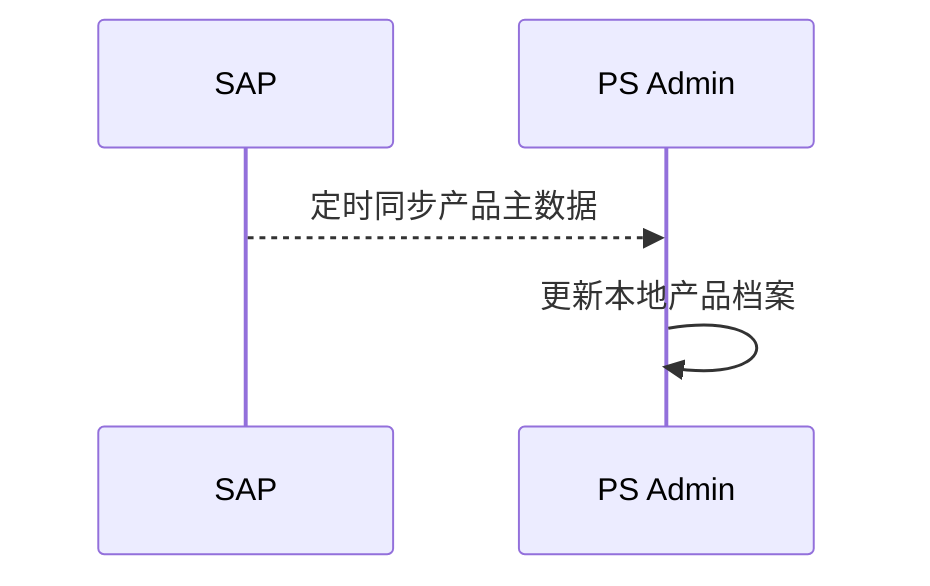
```mermaid
sequenceDiagram
    participant SAP as SAP
    participant PS as PS Admin

    SAP-->>PS: 定时同步产品主数据
    PS->>PS: 更新本地产品档案
```

## 2.2 产品库存查询 / 同步接口

|项目|内容|
|---|---|
|接口名称|产品库存查询 / 同步接口|
|接口描述|提供主商品库存、更换件库存、零部件库存、3PL 库存，供 PS Admin 做库存判断|
|调用方向|PS Admin → SAP / 或 SAP → PS Admin|
|调用时机|维修准备、维修执行、产品更换、他品交换、3PL 发货前|
|备注|库存口径以 SAP 为准|

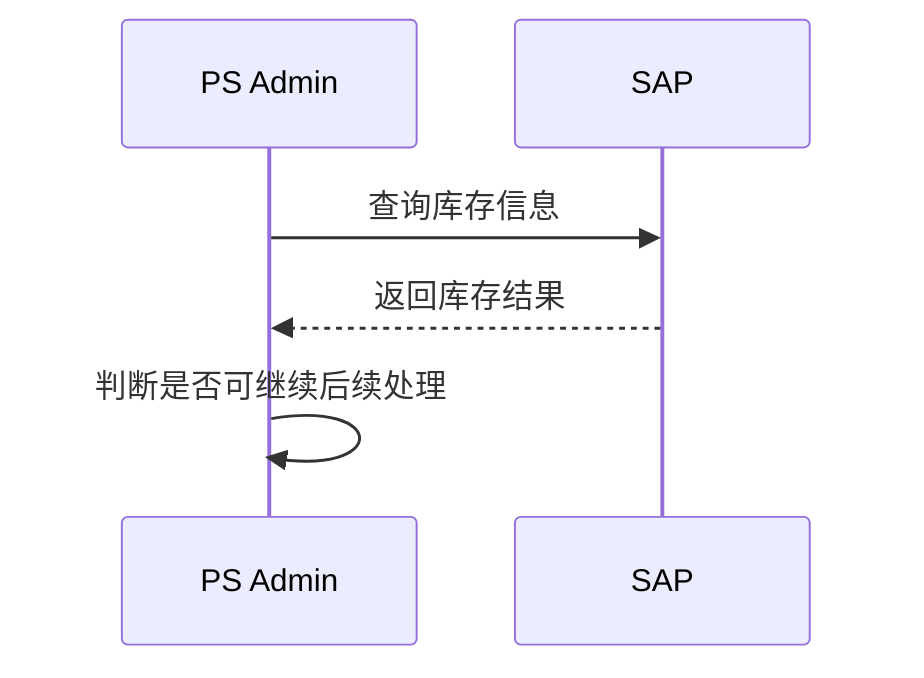
```mermaid
sequenceDiagram
    participant PS as PS Admin
    participant SAP as SAP

    PS->>SAP: 查询库存信息
    SAP-->>PS: 返回库存结果
    PS->>PS: 判断是否可继续后续处理
```

## 2.3 3PL 库存查询接口

|项目|内容|
|---|---|
|接口名称|3PL 库存查询接口|
|接口描述|在“有偿_3PL”支付完成后，查询 3PL 库存是否充足，以决定是否进入 3PL 发货流程|
|调用方向|PS Admin → SAP|
|调用时机|有偿_3PL 支付完成后|
|备注|库存不足时进入等待补货或人工协调|

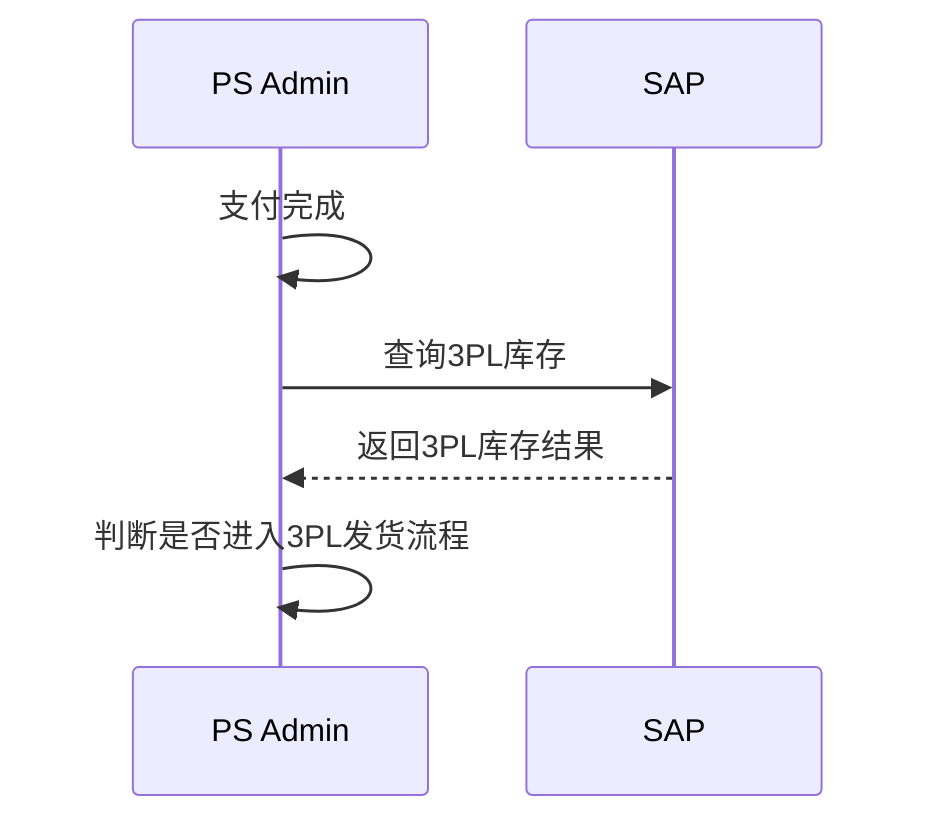
```mermaid
sequenceDiagram
    participant PS as PS Admin
    participant SAP as SAP

    PS->>PS: 支付完成
    PS->>SAP: 查询3PL库存
    SAP-->>PS: 返回3PL库存结果
    PS->>PS: 判断是否进入3PL发货流程
```

## 2.4 产品价格基础数据获取接口

|项目|内容|
|---|---|
|接口名称|产品价格基础数据获取接口|
|接口描述|SAP 提供产品价格基础值，PS Admin 基于价格基础值和业务规则生成最终维修费用|
|调用方向|PS Admin → SAP|
|调用时机|有偿维修 / 有偿_3PL / 合作厂家有偿 / 他品交换有偿判定后|
|备注|SAP 提供基础价格，最终报价由 PS Admin 生成|

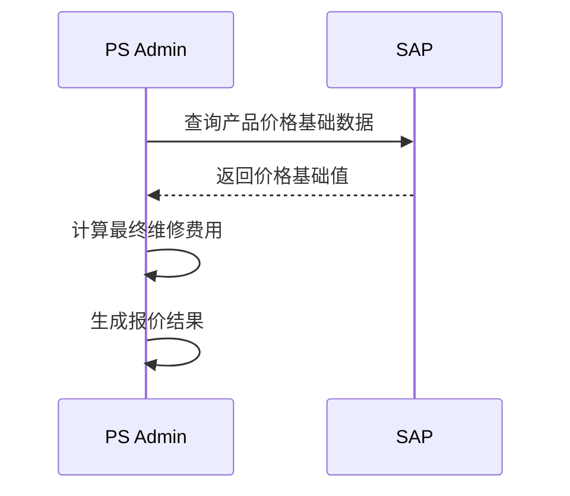
```mermaid
sequenceDiagram
    participant PS as PS Admin
    participant SAP as SAP

    PS->>SAP: 查询产品价格基础数据
    SAP-->>PS: 返回价格基础值
    PS->>PS: 计算最终维修费用
    PS->>PS: 生成报价结果
```

## 2.5 维修实际消耗同步接口

|项目|内容|
|---|---|
|接口名称|维修实际消耗同步接口|
|接口描述|PS Admin 将维修完成后的实际产品 / 配件消耗同步给 SAP，由 SAP 扣减库存|
|调用方向|PS Admin → SAP|
|调用时机|维修完成提交后|
|备注|配件/产品消耗统一在维修完成提交时处理|

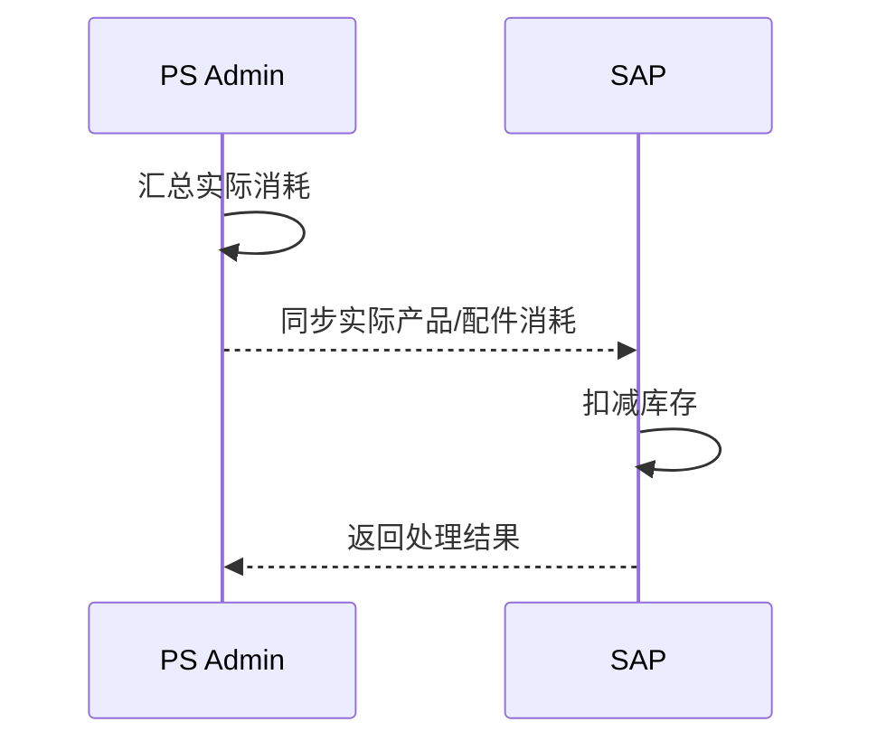
```mermaid
sequenceDiagram
    participant PS as PS Admin
    participant SAP as SAP

    PS->>PS: 汇总实际消耗
    PS-->>SAP: 同步实际产品/配件消耗
    SAP->>SAP: 扣减库存
    SAP-->>PS: 返回处理结果
```

## 2.6 产品消耗冲销接口

|项目|内容|
|---|---|
|接口名称|产品消耗冲销接口|
|接口描述|当维修完成后发生撤销、异常回退或取消时，对已同步到 SAP 的消耗记录执行冲销|
|调用方向|PS Admin → SAP|
|调用时机|撤销维修完成、取消工单、异常回退|
|备注|属于补充接口，用于异常恢复|

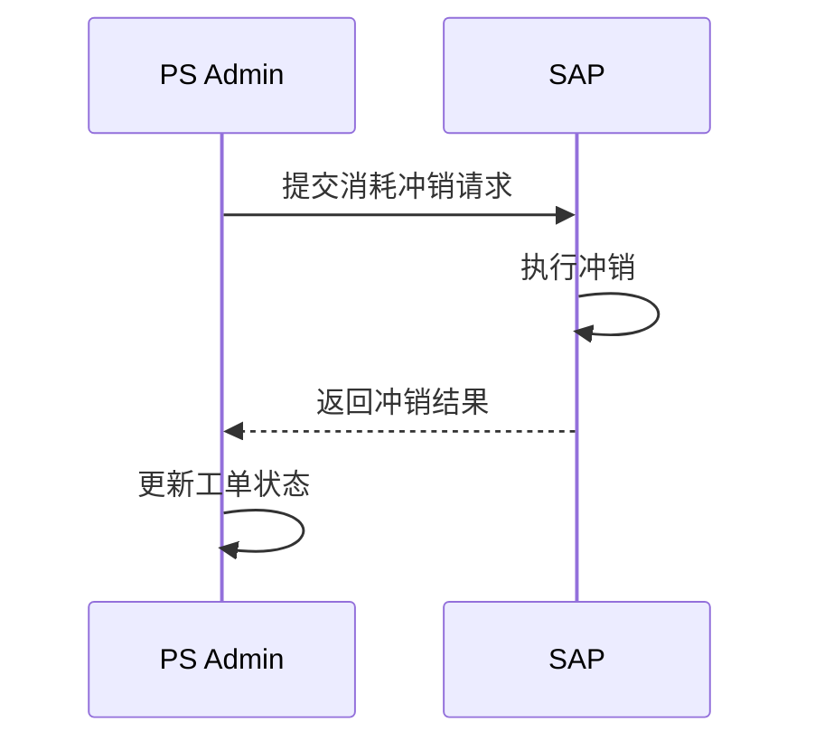
```mermaid
sequenceDiagram
    participant PS as PS Admin
    participant SAP as SAP

    PS->>SAP: 提交消耗冲销请求
    SAP->>SAP: 执行冲销
    SAP-->>PS: 返回冲销结果
    PS->>PS: 更新工单状态
```

## 2.7 产品申请创建接口

|项目|内容|
|---|---|
|接口名称|产品申请创建接口|
|接口描述|当库存不足时，PS Admin 发起更换件、替换用产品或其他维修相关物料申请|
|调用方向|PS Admin → SAP|
|调用时机|维修中发现库存不足时|
|备注|支撑等待库存流程|

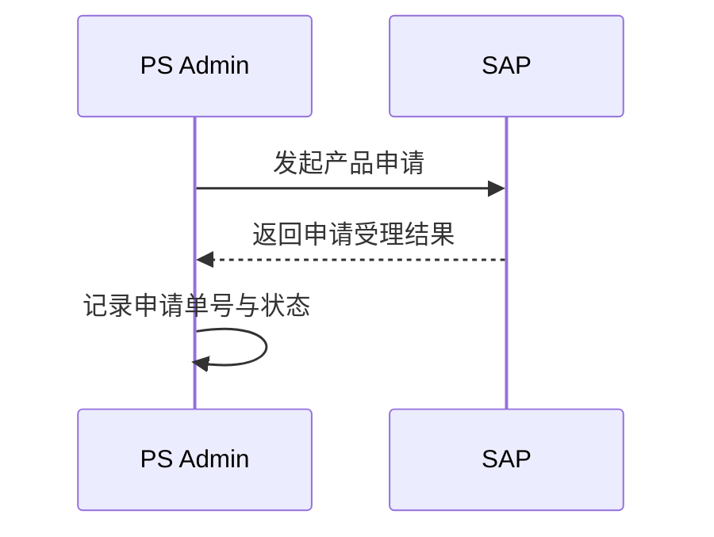
```mermaid
sequenceDiagram
    participant PS as PS Admin
    participant SAP as SAP

    PS->>SAP: 发起产品申请
    SAP-->>PS: 返回申请受理结果
    PS->>PS: 记录申请单号与状态
```

## 2.8 产品申请结果回传接口

|项目|内容|
|---|---|
|接口名称|产品申请结果回传接口|
|接口描述|SAP 返回产品申请处理结果，如已受理、处理中、完成、失败等|
|调用方向|SAP → PS Admin|
|调用时机|SAP 处理申请后|
|备注|可采用回调或查询补偿方式|

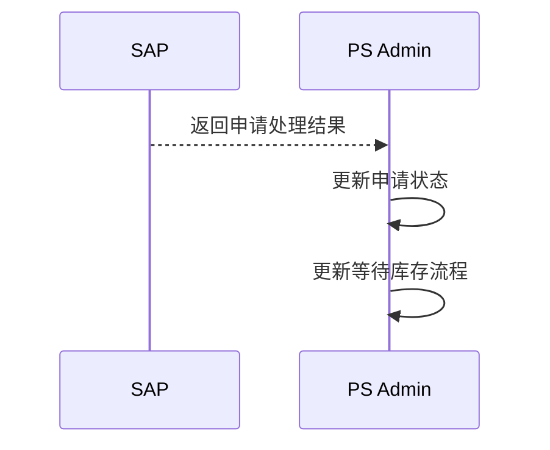
```mermaid
sequenceDiagram
    participant SAP as SAP
    participant PS as PS Admin

    SAP-->>PS: 返回申请处理结果
    PS->>PS: 更新申请状态
    PS->>PS: 更新等待库存流程
```

## 2.9 到货 / 入库结果回传接口

|项目|内容|
|---|---|
|接口名称|到货 / 入库结果回传接口|
|接口描述|产品到货或入库后，SAP 将结果返回给 PS Admin，PS Admin 恢复等待库存中的工单处理|
|调用方向|SAP → PS Admin|
|调用时机|申请物料到货 / 入库后|
|备注|用于恢复流程|

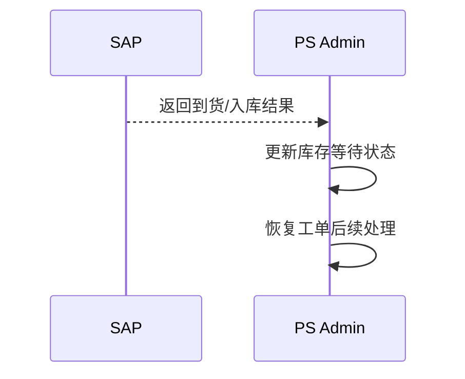
```mermaid
sequenceDiagram
    participant SAP as SAP
    participant PS as PS Admin

    SAP-->>PS: 返回到货/入库结果
    PS->>PS: 更新库存等待状态
    PS->>PS: 恢复工单后续处理
```

## 2.10 3PL 发货单据（DO）创建接口

|项目|内容|
|---|---|
|接口名称|3PL 发货单据（DO）创建接口|
|接口描述|工单满足 3PL 发货条件后，PS Admin 调用 SAP 创建 DO 单据，由 SAP 下发 WMS / 3PL 发货指令|
|调用方向|PS Admin → SAP|
|调用时机|3PL 发货条件满足后|
|备注|3PL 发货核心接口|

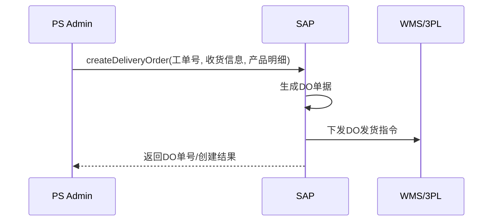
```mermaid
sequenceDiagram
    participant PS as PS Admin
    participant SAP as SAP
    participant WMS as WMS/3PL

    PS->>SAP: createDeliveryOrder(工单号, 收货信息, 产品明细)
    SAP->>SAP: 生成DO单据
    SAP->>WMS: 下发DO发货指令
    SAP-->>PS: 返回DO单号/创建结果
```

## 2.11 DO 状态查询接口

|项目|内容|
|---|---|
|接口名称|DO 状态查询接口|
|接口描述|当 SAP 未及时回传 DO 状态，或回调失败时，PS Admin 根据 DO 单号主动查询状态|
|调用方向|PS Admin → SAP|
|调用时机|未收到 DO 状态回传或需补偿查询时|
|备注|建议保留作为补偿接口|

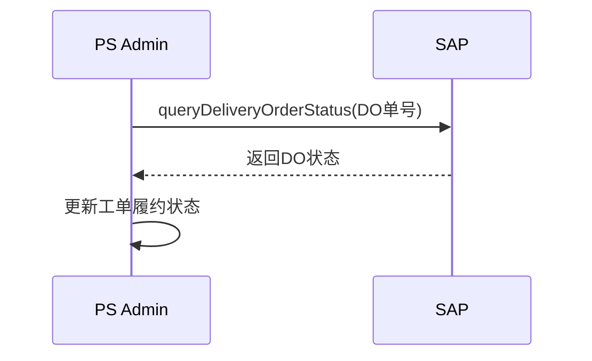
```mermaid
sequenceDiagram
    participant PS as PS Admin
    participant SAP as SAP

    PS->>SAP: queryDeliveryOrderStatus(DO单号)
    SAP-->>PS: 返回DO状态
    PS->>PS: 更新工单履约状态
```

## 2.12 出库结果回传接口

|项目|内容|
|---|---|
|接口名称|出库结果回传接口|
|接口描述|WMS / 3PL 发货后，出库结果先回 SAP，再由 SAP 同步给 PS Admin|
|调用方向|SAP → PS Admin|
|调用时机|WMS / 3PL 完成发货后|
|备注|默认通过 SAP 间接返回|

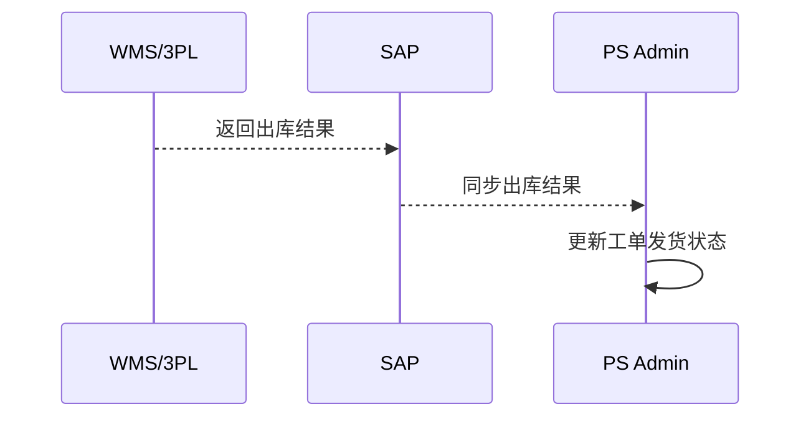
```mermaid
sequenceDiagram
    participant WMS as WMS/3PL
    participant SAP as SAP
    participant PS as PS Admin

    WMS-->>SAP: 返回出库结果
    SAP-->>PS: 同步出库结果
    PS->>PS: 更新工单发货状态
```

## 2.13 3PL 物流信息回传接口（经 SAP）

|项目|内容|
|---|---|
|接口名称|3PL 物流信息回传接口（经 SAP）|
|接口描述|WMS / 3PL 返回承运商、真实运单号、发货时间等物流信息给 SAP，再由 SAP 同步给 PS Admin|
|调用方向|SAP → PS Admin|
|调用时机|3PL 发货完成后|
|备注|当前为建议主路径之一|

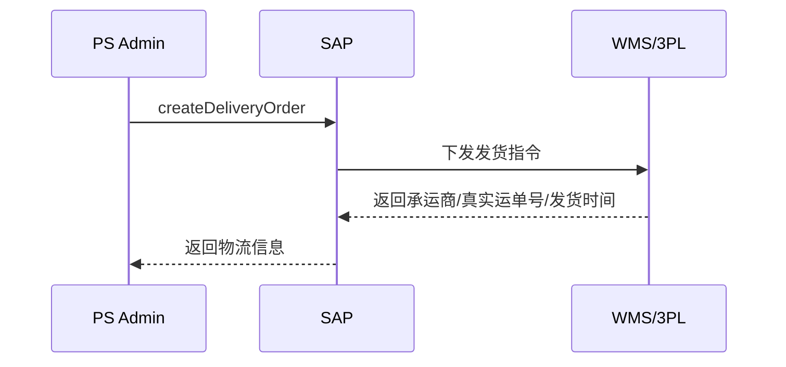
```mermaid
sequenceDiagram
    participant PS as PS Admin
    participant SAP as SAP
    participant WMS as WMS/3PL

    PS->>SAP: createDeliveryOrder
    SAP->>WMS: 下发发货指令
    WMS-->>SAP: 返回承运商/真实运单号/发货时间
    SAP-->>PS: 返回物流信息
```

## 2.14 交换出库处理接口

|项目|内容|
|---|---|
|接口名称|交换出库处理接口|
|接口描述|在产品交换或他品交换场景下，PS Admin 调用 SAP 发起交换类出库处理|
|调用方向|PS Admin → SAP|
|调用时机|产品交换 / 他品交换履约时|
|备注|SAP 返回出库单据结果|

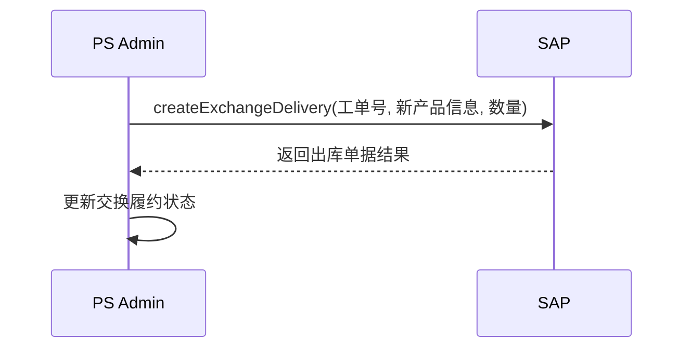
```mermaid
sequenceDiagram
    participant PS as PS Admin
    participant SAP as SAP

    PS->>SAP: createExchangeDelivery(工单号, 新产品信息, 数量)
    SAP-->>PS: 返回出库单据结果
    PS->>PS: 更新交换履约状态
```

## 2.15 原品退回收货接口

|项目|内容|
|---|---|
|接口名称|原品退回收货接口|
|接口描述|在产品交换、他品交换或取消返还等场景下，PS Admin 向 SAP 提交原品回收 / 退回收货信息|
|调用方向|PS Admin → SAP|
|调用时机|原品回收 / 退回收货时|
|备注|是否形成正式收货单据待确认|

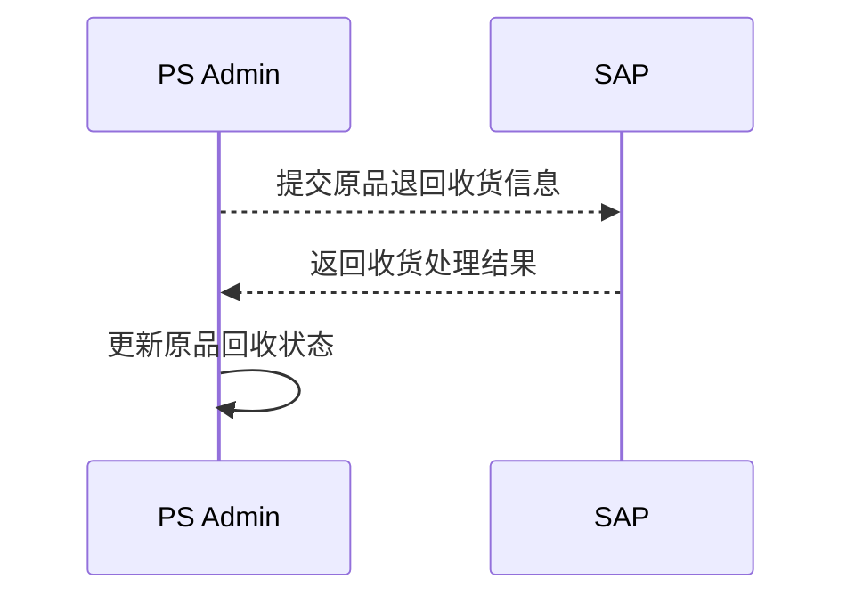
```mermaid
sequenceDiagram
    participant PS as PS Admin
    participant SAP as SAP

    PS-->>SAP: 提交原品退回收货信息
    SAP-->>PS: 返回收货处理结果
    PS->>PS: 更新原品回收状态
```

## 2.16 SO 单据编号回传接口

|项目|内容|
|---|---|
|接口名称|SO 单据编号回传接口|
|接口描述|服务完成后，SAP 生成 SO；当最后一个条件状态变更为“结束”时，将 SO 编号回传给 PS Admin|
|调用方向|SAP → PS Admin|
|调用时机|SO 最后一个条件状态变更为“结束”时|
|备注|用于工单闭环和后续查询|

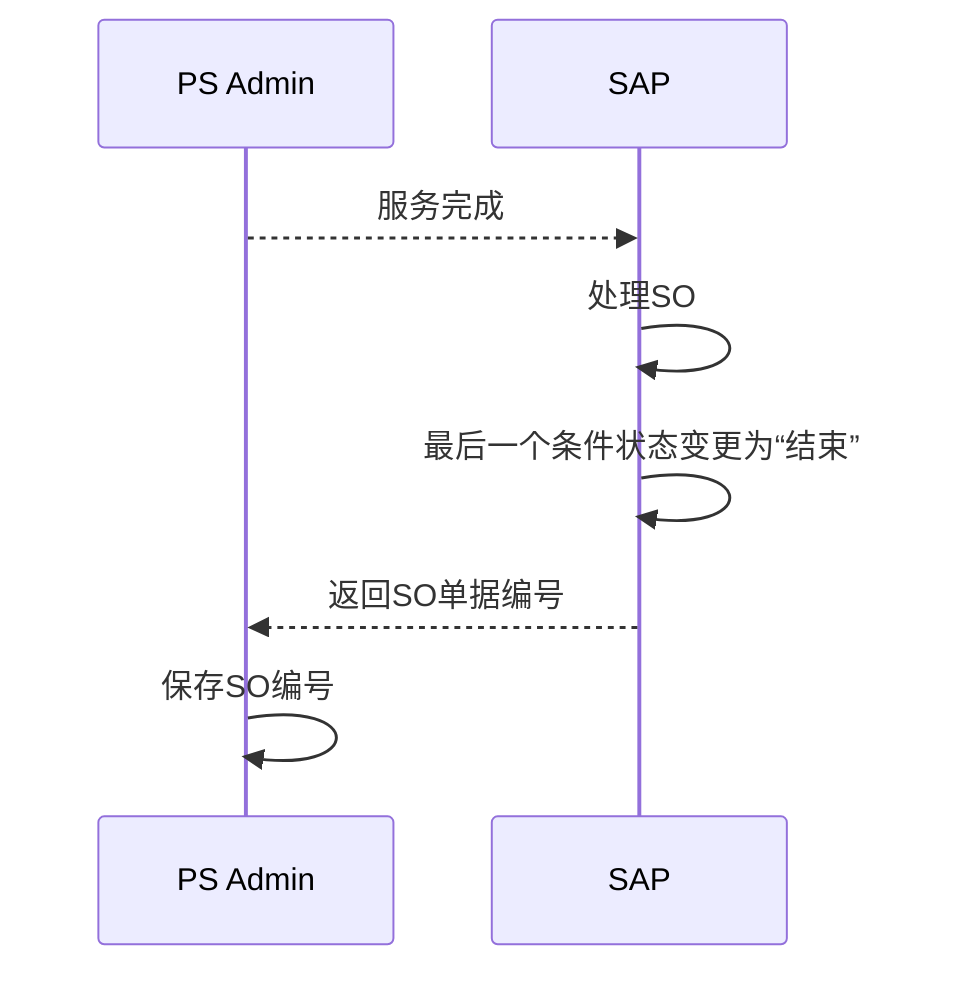
```mermaid
sequenceDiagram
    participant PS as PS Admin
    participant SAP as SAP

    PS-->>SAP: 服务完成
    SAP->>SAP: 处理SO
    SAP->>SAP: 最后一个条件状态变更为“结束”
    SAP-->>PS: 返回SO单据编号
    PS->>PS: 保存SO编号
```

## 2.17 支付结果同步接口

|项目|内容|
|---|---|
|接口名称|支付结果同步接口|
|接口描述|客户支付完成后，PS Admin 将最终支付结果同步给 SAP，用于后续财务处理与业务闭环|
|调用方向|PS Admin → SAP|
|调用时机|小程序 / 支付侧回写支付结果后|
|备注|适用于有偿维修、有偿_3PL、合作厂家有偿、他品交换有偿等场景|

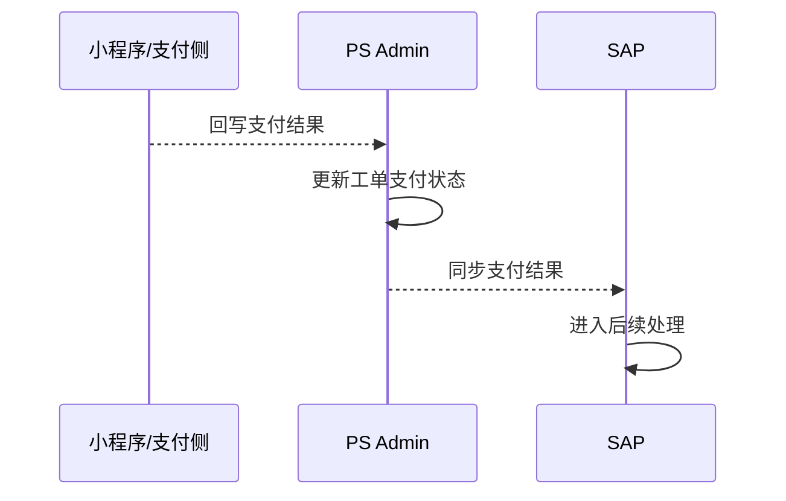
```mermaid
sequenceDiagram
    participant MP as 小程序/支付侧
    participant PS as PS Admin
    participant SAP as SAP

    MP-->>PS: 回写支付结果
    PS->>PS: 更新工单支付状态
    PS-->>SAP: 同步支付结果
    SAP->>SAP: 进入后续处理
```

## 2.18 支付结果补偿查询接口

|项目|内容|
|---|---|
|接口名称|支付结果补偿查询接口|
|接口描述|当支付结果已同步但 SAP 侧处理状态不明确时，PS Admin 主动查询 SAP 是否已接收并处理支付结果|
|调用方向|PS Admin → SAP|
|调用时机|支付结果同步超时、失败、状态不明确时|
|备注|建议补充保留|

```mermaid
sequenceDiagram
    participant PS as PS Admin
    participant SAP as SAP

    PS->>SAP: 查询支付结果处理状态
    SAP-->>PS: 返回支付处理结果
    PS->>PS: 更新支付闭环状态
```

## 2.19 取消 / 冲销处理接口

|项目|内容|
|---|---|
|接口名称|取消 / 冲销处理接口|
|接口描述|当发生取消、异常回退或业务终止时，PS Admin 向 SAP 提交取消或冲销需求|
|调用方向|PS Admin → SAP|
|调用时机|工单取消、异常回退、业务终止|
|备注|覆盖已扣减库存、已出库、已生成 SO 等场景|

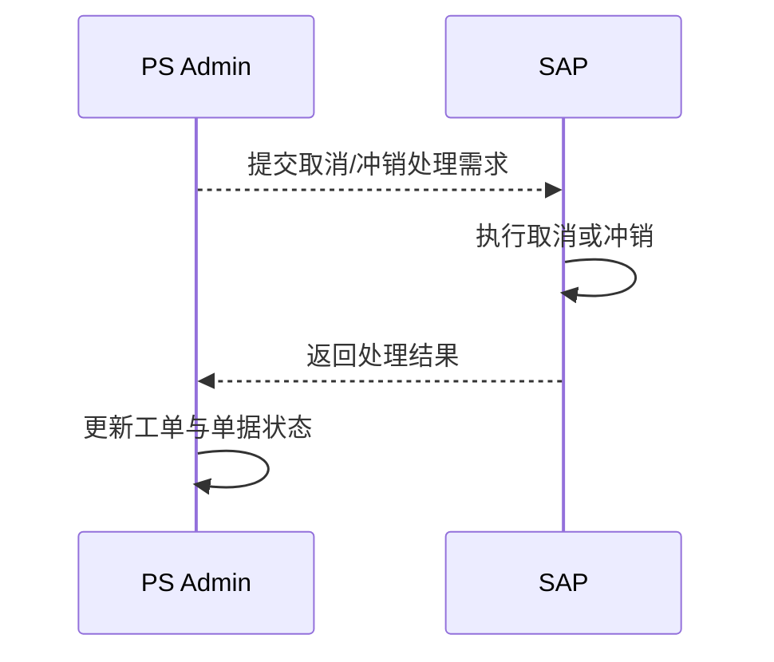
```mermaid
sequenceDiagram
    participant PS as PS Admin
    participant SAP as SAP

    PS-->>SAP: 提交取消/冲销处理需求
    SAP->>SAP: 执行取消或冲销
    SAP-->>PS: 返回处理结果
    PS->>PS: 更新工单与单据状态
```

## 2.20 通用单据状态查询接口

|项目|内容|
|---|---|
|接口名称|通用单据状态查询接口|
|接口描述|按单据类型 + 单据号查询 SAP 侧单据状态，覆盖 DO、交换出库、收货、SO、冲销等单据|
|调用方向|PS Admin → SAP|
|调用时机|回调缺失、状态异常、人工排查、补偿查询|
|备注|建议作为统一补偿能力保留|

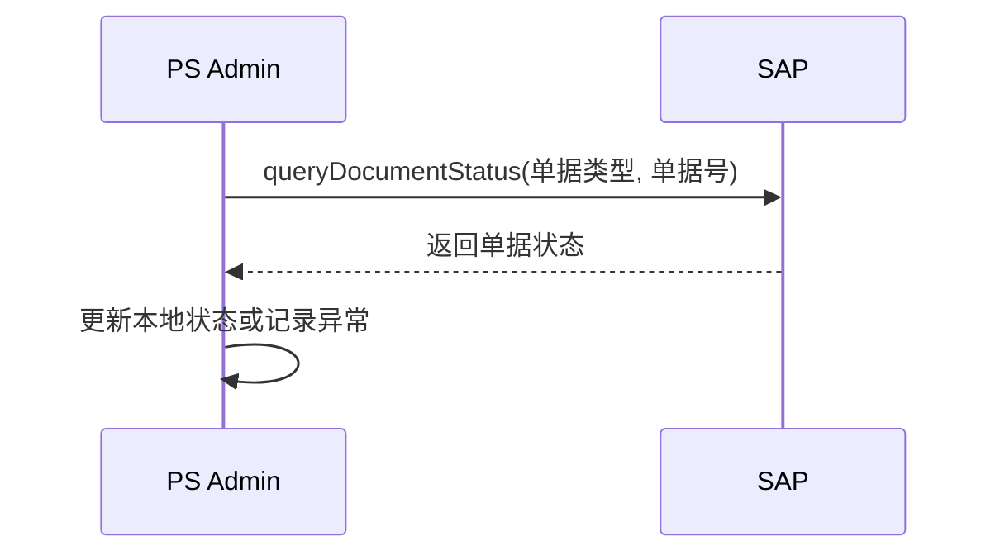
```mermaid
sequenceDiagram
    participant PS as PS Admin
    participant SAP as SAP

    PS->>SAP: queryDocumentStatus(单据类型, 单据号)
    SAP-->>PS: 返回单据状态
    PS->>PS: 更新本地状态或记录异常
```

## 2.21 协同异常结果回传接口

|项目|内容|
|---|---|
|接口名称|协同异常结果回传接口|
|接口描述|在库存、价格、出库、SO、支付、冲销等协同场景中，如处理失败、结果延迟或状态不一致，SAP 将异常结果返回给 PS Admin|
|调用方向|SAP → PS Admin|
|调用时机|异常发生时|
|备注|PS Admin 需记录异常并支持人工跟进|

```mermaid
sequenceDiagram
    participant SAP as SAP
    participant PS as PS Admin
    participant A as 管理员

    SAP-->>PS: 返回异常结果或延迟处理
    PS->>PS: 记录异常状态
    A->>PS: 人工跟进处理
    PS->>PS: 更新最终结果
```

# 3 WMS 补充接口需求

## 3.1 说明

当前默认协同路径为 **PS Admin → SAP → WMS**，即 PS Admin 原则上不直接对接 WMS。  
仅当最终确认 **WMS / 3PL 需要直接向 PS Admin 返回物流信息或发货结果** 时，才需要补充以下 WMS 直连接口。

## 3.2 发货结果回传接口（直连 WMS）

|项目|内容|
|---|---|
|接口名称|发货结果回传接口|
|接口描述|WMS / 3PL 直接向 PS Admin 返回已发货状态、内部单号、发货时间等结果|
|调用方向|WMS → PS Admin|
|调用时机|WMS 完成发货后|
|备注|仅在 WMS 直连模式下适用|

```mermaid
sequenceDiagram
    participant PS as PS Admin
    participant SAP as SAP
    participant WMS as WMS/3PL

    PS->>SAP: createDeliveryOrder
    SAP->>WMS: 下发发货指令
    WMS-->>PS: 返回发货结果
    PS->>PS: 更新工单发货状态
```

## 3.3 物流信息回传接口（直连 WMS）

|项目|内容|
|---|---|
|接口名称|物流信息回传接口|
|接口描述|WMS / 3PL 直接向 PS Admin 返回承运商、真实运单号、发货时间等物流信息|
|调用方向|WMS → PS Admin|
|调用时机|发货完成后|
|备注|当前属于待确认模式之一|

```mermaid
sequenceDiagram
    participant PS as PS Admin
    participant SAP as SAP
    participant WMS as WMS/3PL

    PS->>SAP: createDeliveryOrder
    SAP->>WMS: 下发发货指令
    WMS-->>PS: 返回承运商/真实运单号/发货时间
    PS->>PS: 更新物流展示信息
```

## 3.4 出库状态查询接口（直连 WMS）

|项目|内容|
|---|---|
|接口名称|出库状态查询接口|
|接口描述|当 WMS 直连回调失败或结果延迟时，PS Admin 主动查询 WMS 的出库状态|
|调用方向|PS Admin → WMS|
|调用时机|未收到回调、需补偿查询时|
|备注|仅在 WMS 直连模式下适用|

```mermaid
sequenceDiagram
    participant PS as PS Admin
    participant WMS as WMS/3PL

    PS->>WMS: 查询出库状态
    WMS-->>PS: 返回出库结果
    PS->>PS: 更新履约状态
```

## 3.5 WMS 异常结果回传接口

|项目|内容|
|---|---|
|接口名称|WMS 异常结果回传接口|
|接口描述|WMS / 3PL 返回拣货失败、库存不足、出库失败、取消失败等异常结果|
|调用方向|WMS → PS Admin|
|调用时机|异常发生时|
|备注|仅在 WMS 直连模式下适用|

```mermaid
sequenceDiagram
    participant WMS as WMS/3PL
    participant PS as PS Admin

    WMS-->>PS: 回传异常结果
    PS->>PS: 记录异常
    PS->>PS: 触发人工跟进
```

# 4 接口实现建议

## 4.1 建议保留的补偿机制

建议以下接口均保留“回调 + 主动查询补偿”机制：

- 产品申请结果回传接口
    
- 到货 / 入库结果回传接口
    
- DO 状态查询接口
    
- 出库结果回传接口
    
- SO 单据编号回传接口
    
- 支付结果补偿查询接口
    
- 通用单据状态查询接口
    
- 协同异常结果回传接口
    

## 4.2 建议统一返回字段

所有 SAP / WMS 回传或查询类接口，建议统一包含以下字段：

|字段|说明|
|---|---|
|requestNo|原请求流水号|
|ticketNo|工单号|
|businessType|业务类型|
|businessNo|业务单号，如申请单号、DO 单号、SO 单号|
|status|处理状态|
|resultCode|结果编码|
|resultMessage|结果说明|
|eventTime|结果发生时间|
|failReason|失败原因|
|extData|扩展信息|

## 4.3 幂等要求

PS Admin 在处理 SAP / WMS 回传时，应支持幂等处理，避免重复回调、重复推送或重复查询导致重复更新状态、重复生成记录或数据冲突。

# 5 待确认事项

1. **产品主数据、库存数据**的实现方式，最终采用 SAP 主动同步还是 PS Admin 定时拉取。
    
2. **3PL 运单号返回方式**，最终采用 WMS 直接回传、先回 SAP 再给 PS Admin，还是仅返回发货状态。
    
3. **原品退回收货**是否需要在 SAP 中形成正式收货单据。
    
4. **库存预占能力**是否需要补充，以避免“查询时有库存、执行时无库存”的情况。
    
5. **SO 已进入处理后是否支持回退**，以及已出库后的取消 / 冲销边界。
    
6. **WMS 是否需要与 PS Admin 直接对接**；若不需要，则所有 WMS 结果统一由 SAP 中转。
    
