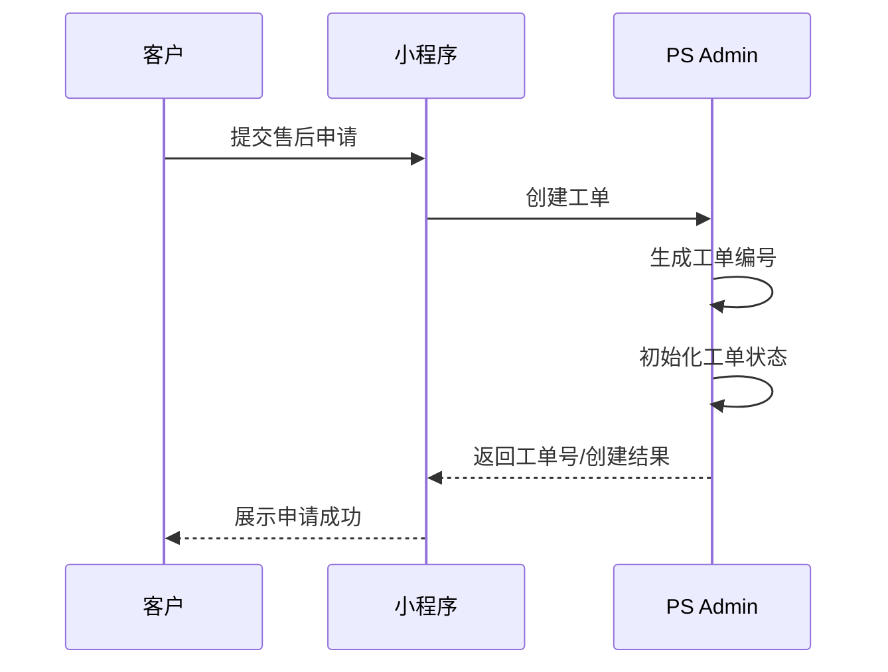
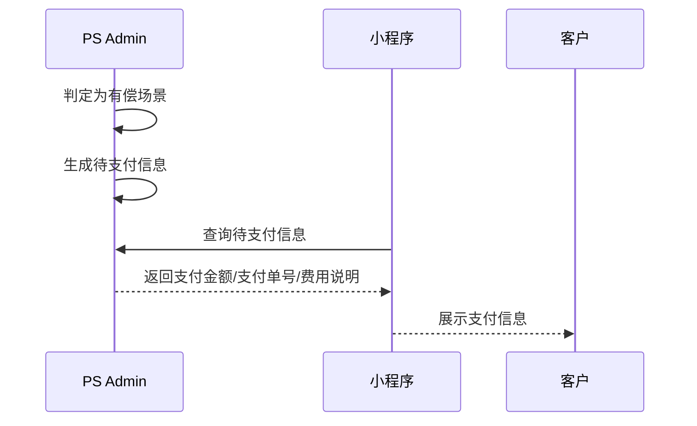
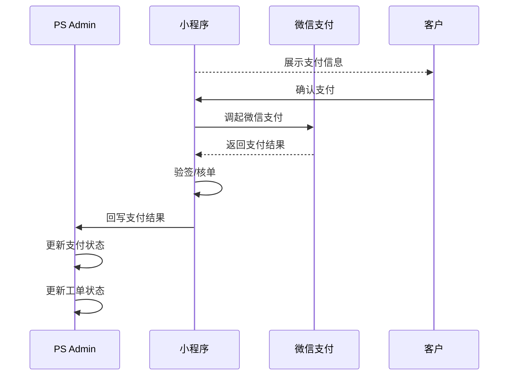
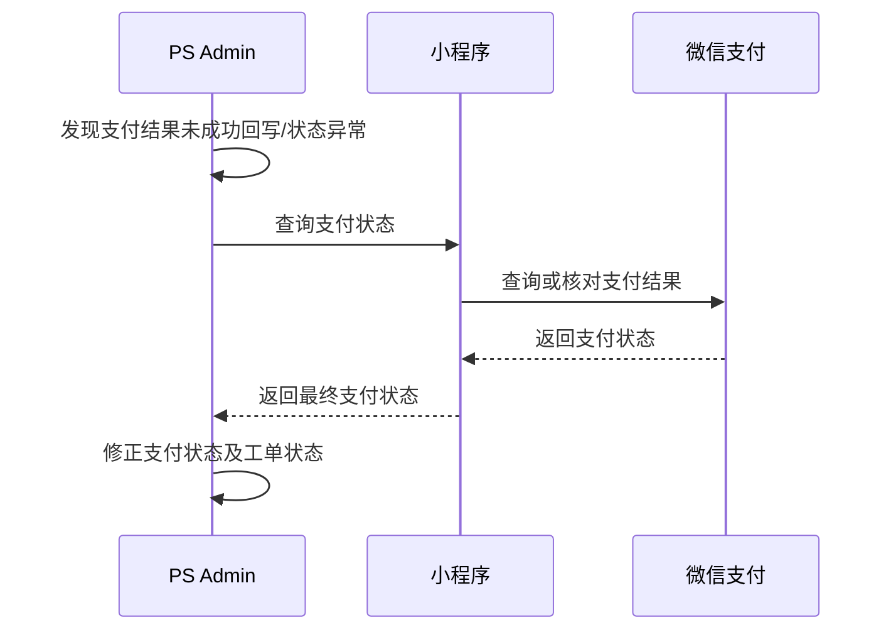
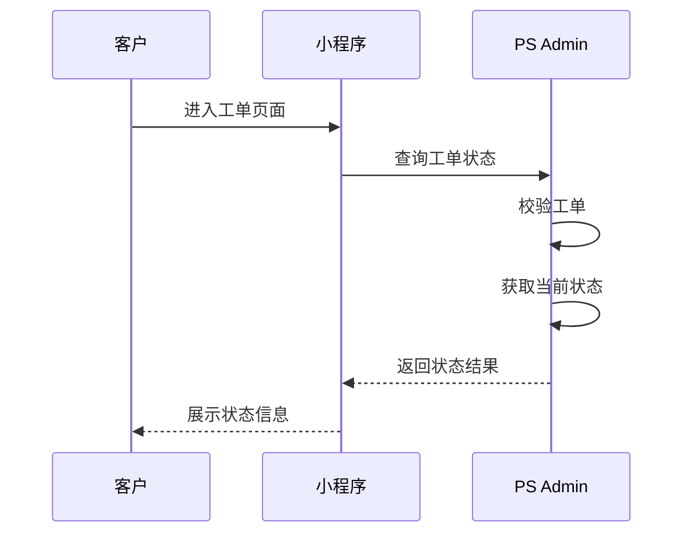
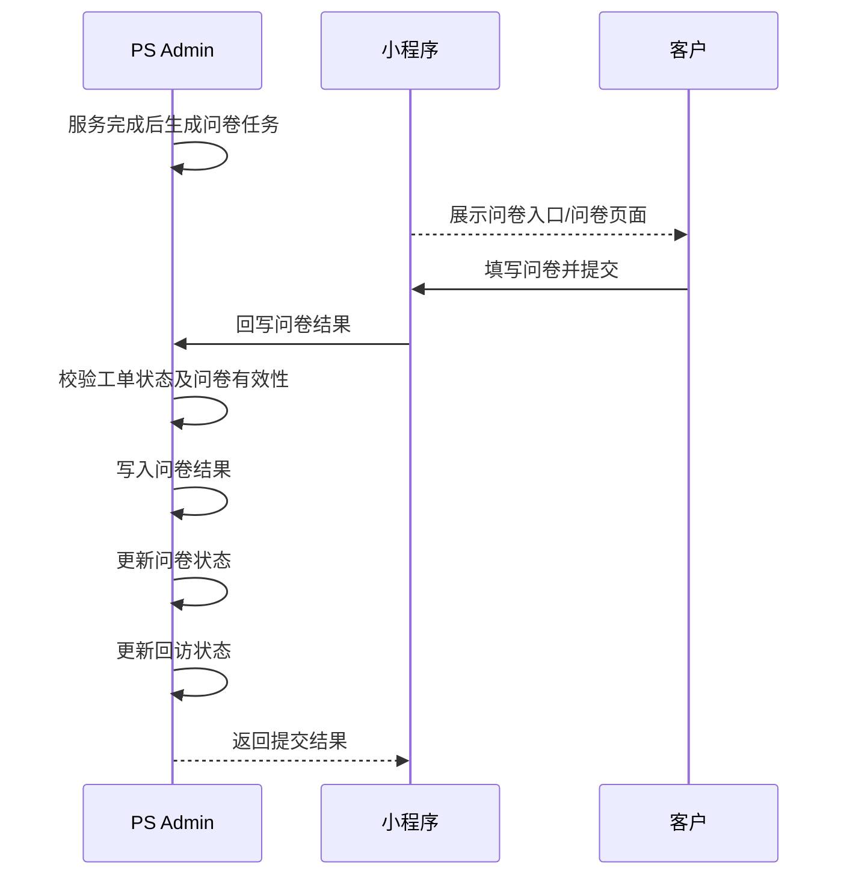
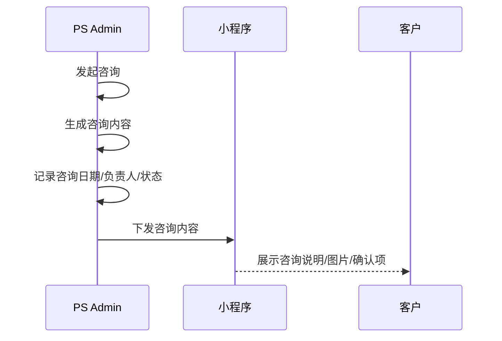
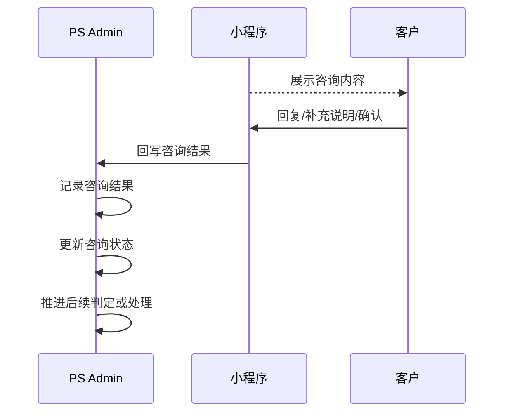
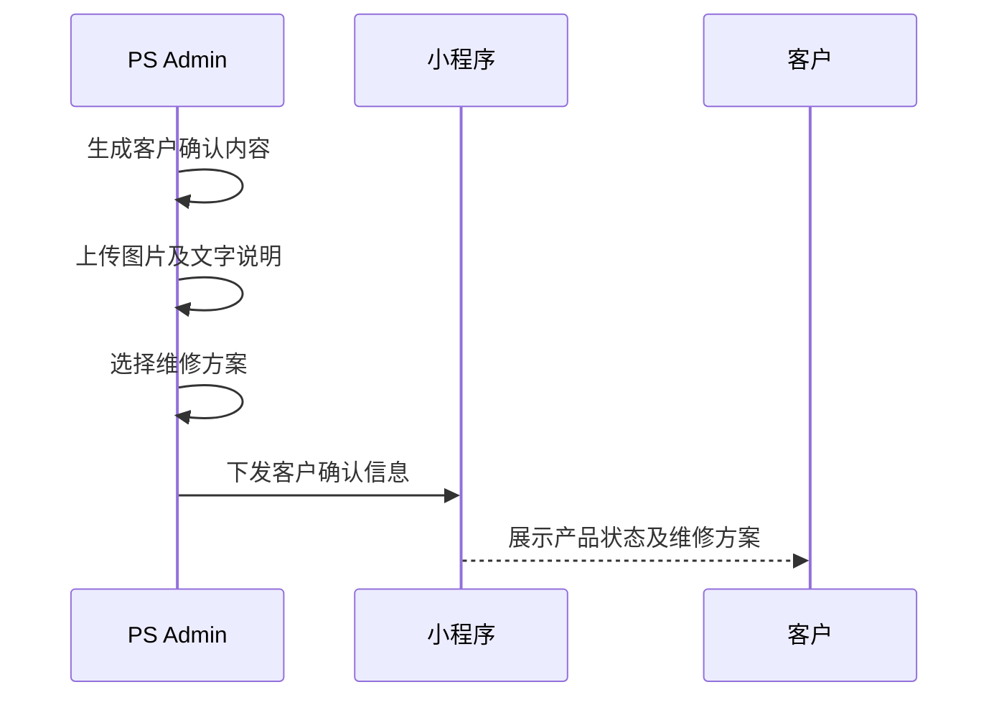
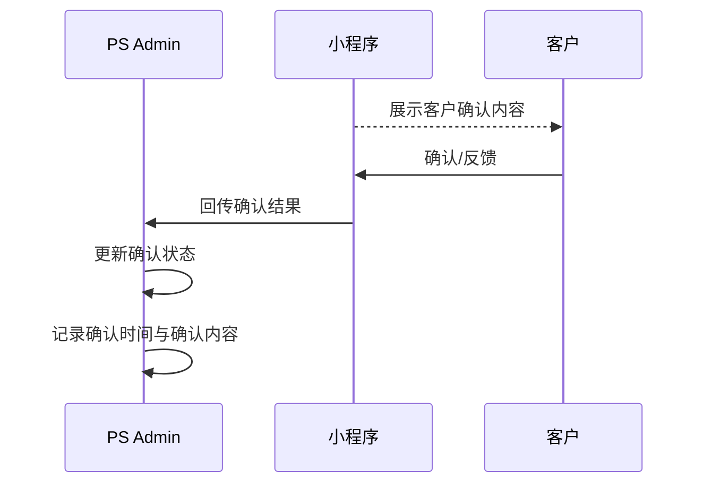

# 1 文档说明

在本项目中，PS Admin 作为售后工单管理核心系统，负责工单创建、支付要求提供、工单状态管理及业务结果接收；小程序主要负责客户侧申请提交、支付发起、状态展示、问卷填写、咨询回复及客户确认反馈。

# 2 创建工单接口

客户在小程序提交售后申请后，由小程序调用 PS Admin 创建工单接口。  
PS Admin 负责生成工单编号、初始化工单状态，并返回创建结果。

**接口名称：** 创建工单接口  
**调用方向：** 小程序 → PS Admin

# 3 查询待支付信息接口

当工单进入有偿场景后，小程序需向 PS Admin 查询待支付信息，用于在小程序端展示支付金额、支付说明及相关订单信息，并继续发起支付。  

**接口名称：** 查询待支付信息接口  
**调用方向：** 小程序 → PS Admin

# 4 支付结果接收接口

客户完成支付后，小程序需将支付结果回写至 PS Admin。  
PS Admin 接收结果后，更新支付状态、记录支付完成时间，并推动工单进入后续处理流程。

需要说明的是，虽然业务动作表现为“小程序回写支付结果”，但该接口的提供方应为 PS Admin，小程序为调用方。

**接口名称：** 支付结果接收接口  
**调用方向：** 小程序 → PS Admin

# 5 支付状态查询接口

当支付结果回写异常、超时或双方状态不一致时，PS Admin 需支持主动向小程序查询支付最终状态，作为补偿机制，确保支付状态最终一致。  

在该场景下，小程序负责提供支付状态查询能力，PS Admin 作为调用方发起补偿查询。

**接口名称：** 支付状态查询接口  
**调用方向：** PS Admin → 小程序

# 6 查询工单状态接口

小程序负责向客户展示工单当前状态、处理进度及关键节点信息。  
为保证状态口径统一，小程序需通过 PS Admin 查询工单状态，并以 PS Admin 返回结果作为唯一展示依据，不自行进行状态计算。

**接口名称：** 查询工单状态接口  
**调用方向：** 小程序 → PS Admin

# 7 问卷结果接收接口

服务完成后，问卷由小程序负责展示并收集。  
客户填写完成后，小程序将问卷结果回写至 PS Admin，由 PS Admin 负责校验问卷有效性、写入问卷记录，并更新问卷状态及回访状态。

**接口名称：** 问卷结果接收接口  
**调用方向：** 小程序 → PS Admin

# 8 咨询任务下发接口

当工单处理过程中存在需客户补充说明、查看信息、确认方案、确认费用、确认产品状态或异常情况说明等场景时，PS Admin 需向小程序下发咨询任务，由小程序向客户展示相应内容。

**接口名称：** 咨询任务下发接口  
**调用方向：** PS Admin → 小程序

# 9 咨询结果接收接口

客户在小程序中查看咨询内容后，可进行回复、补充说明或确认反馈。  
小程序需将咨询结果回写至 PS Admin，由 PS Admin 记录咨询结果，并根据结果继续后续判定或处理流程。

**接口名称：** 咨询结果接收接口  
**调用方向：** 小程序 → PS Admin

# 10 客户确认任务下发接口

当工单处理中需要客户对产品状态、维修方案、费用变更、图片说明等内容进行明确确认时，PS Admin 需向小程序下发客户确认任务，由小程序负责展示确认内容并承接客户反馈。

**接口名称：** 客户确认任务下发接口  
**调用方向：** PS Admin → 小程序

# 11 客户确认结果接收接口

客户在小程序查看客户确认内容后，可进行确认、拒绝或反馈。  
小程序将结果回写至 PS Admin，由 PS Admin 更新确认状态，并记录确认时间与确认内容。

**接口名称：** 客户确认结果接收接口  
**调用方向：** 小程序 → PS Admin

# 12 接口归类说明

在小程序协同场景下，应以“谁暴露接口地址，谁即为接口提供方”作为接口归类依据。

因此：

- 创建工单、待支付信息查询、支付结果接收、工单状态查询、问卷结果接收、咨询结果接收、客户确认结果接收等场景，均属于 **PS Admin 提供接口，小程序调用**；
    
- 支付状态补偿查询场景，属于 **小程序提供接口，PS Admin 调用**。
    

同时，问卷当前以“结果回写”作为明确接口边界；咨询与客户确认在业务上可以分别描述，在接口设计上也可分别保留，以保持与当前章节结构一致。
