# GM 小程序协同接口需求文档

## 1 文档说明

本文档用于说明小程序与 PS Admin 之间的接口范围、调用方式及交互口径。

在本项目中：

- PS Admin 负责工单创建、申请预审、状态管理、待支付信息提供、客户确认事项管理、物流结果管理、取消结果管理、业务结果接收及消息事件发布
    
- 小程序负责客户侧申请提交、支付发起、状态展示、事项查看与反馈、物流查看、取消申请发起、问卷填写、消息接收及工单状态与详情的本地记录维护
    

小程序侧维护工单状态与工单详情的本地记录，数据来源以 PS Admin 为准。具体协同方式如下：

- **状态同步**：PS Admin 在工单状态变更时主动回调通知小程序，小程序收到通知后调用对应查询接口获取最新详情，并更新本地记录
    
- **本地可用**：对于客户侧需展示的工单状态、是否需要补充物流信息、是否需要支付、是否有待处理客户确认事项等判断，小程序可直接使用本地记录的工单状态，无需每次实时查询 PS Admin
    
- **权威口径**：工单状态的权威口径始终以 PS Admin 为准；小程序本地状态通过回调 + 查询机制保持同步
    

本文档中所有接口均为**双方统一约定的普通接口**：接口路径、消息类型、回调地址、鉴权方式（签名算法、密钥）等由小程序与 PS Admin 在联调前手工配置，双方各自完成认证、授权等配置后即可使用，不再通过专门的订阅登记接口进行运行时登记。

按调用方向可分为两类：

- **小程序 → PS Admin**：由小程序主动发起的请求类接口（如创建工单、查询状态、回写结果等）
    
- **PS Admin → 小程序**：由 PS Admin 在业务事件触发时主动发起的回调类接口（如审核结果、支付通知、工单状态变化、物流状态等）
    

回调类接口用于事件通知和触发数据同步，不直接承载完整业务详情；小程序收到回调后，根据业务需要调用对应查询接口获取完整详情，并更新本地记录。

### 1.1 接口设计说明

|项目|说明|
|---|---|
|客户标识|客户侧接口统一使用客户手机号作为客户标识|
|时间格式|统一采用 ISO 8601 或 `yyyy-MM-dd HH:mm:ss`|
|状态枚举|由 PS Admin 统一维护，前后端共用状态字典|
|幂等控制|创建工单、支付结果回写、各类消息回调等接口必须支持幂等|
|权限校验|所有小程序查询与提交接口都应校验客户手机号与工单归属关系|
|鉴权机制|小程序消息接收接口统一采用时间戳、随机串、签名等方式校验|
|失败重试|PS Admin 对回调失败场景应支持自动重试、人工补推及失败留痕|
|重复接收处理|小程序应按 `messageId` 做幂等接收，避免重复通知客户|
|数据同步|小程序维护工单状态与详情的本地记录，收到回调通知后调用查询接口获取最新数据并更新本地；客户侧展示与操作判断可直接使用本地记录|

### 1.2 协作流程

#### 1.2.1 协作流程时序图

```mermaid
sequenceDiagram
    participant C as 客户
    participant M as 小程序
    participant A as PS Admin
    participant W as 微信支付

    rect rgb(240, 240, 255)
    Note over M, A: 【系统对接阶段】双方手工配置，无对接接口
    Note over M, A: 小程序在 PS Admin 中配置：接收业务消息的回调地址、消息类型、鉴权信息
    Note over M, A: PS Admin 在小程序中配置：支付结果补偿查询等反向接口地址
    Note over M, A: 配置完成后，业务回调通道就绪
    end

    rect rgb(255, 248, 235)
    Note over C, A: 【申请阶段】提交申请 → PS Admin 预审 → 审核结果回传 → 补充寄件信息
    C->>M: 提交售后申请
    M->>A: 创建工单（3.1）
    A->>A: 生成工单编号 / 初始化为「待审核」
    A-->>M: 返回工单号 / 创建结果
    M-->>C: 展示申请已提交
    A->>A: 维修人员在 PS Admin 中预审申请

    alt 审核拒绝
        A->>M: 回调审核结果（3.2 AUDIT_REJECTED）
        M->>A: 查询工单详情（3.9）
        A-->>M: 返回拒绝原因
        M->>M: 更新本地工单记录
        M-->>C: 推送审核未通过消息及原因
    else 审核通过
        A->>M: 回调审核结果（3.2 AUDIT_APPROVED）
        M->>A: 查询工单详情（3.9）
        A-->>M: 返回最新状态
        M->>M: 更新本地工单记录
        M-->>C: 推送审核通过消息
        C->>M: 进入补充寄件信息页面
        M->>A: 查询客户工单列表（3.3）
        A-->>M: 返回工单列表
        M-->>C: 展示当前可补充寄件信息的工单
        C->>M: 填写寄件公司与运单号
        M->>A: 提交寄件信息（3.4）
        A->>A: 写入寄件记录
        A-->>M: 返回提交结果
        M-->>C: 展示提交成功，等待收件
    end
    end

    rect rgb(235, 255, 245)
    Note over C, A: 【预检阶段】收件检测 → 客户确认事项 → 有偿支付 → 预检完成
    A->>A: 收到客户寄来的待维修产品
    A->>A: 维修人员预检

    opt 客户确认事项（确认产品状态/维修方案/费用等）
        A->>M: 回调客户确认事项提醒（3.14）
        M-->>C: 展示事项内容（正文/图片）
        C->>M: 查看并确认
        M->>A: 回写事项结果（3.15）
        A->>A: 更新事项状态
    end

    alt 有偿维修
        A->>A: 生成待支付信息
        A->>M: 回调支付通知 — 待支付提醒（3.8）
        M-->>C: 展示支付提醒
        C->>M: 进入支付页面
        M->>A: 查询待支付信息（3.5）
        A-->>M: 返回支付金额/费用说明
        M->>M: 生成支付链接 / 组装支付参数
        M-->>C: 展示支付详情
        C->>M: 确认支付
        M->>W: 调起微信支付
        W-->>M: 返回支付结果
        M->>M: 验签/核单
        M->>A: 回写支付结果（3.6）
        A->>A: 更新支付状态 / 工单状态
        A->>M: 回调支付完成通知（3.8）
        M-->>C: 展示支付成功

        opt 催缴周期（未支付时自动触发）
            Note over A, M: 第1~3天：每天推送催缴提醒
            A->>M: 回调催缴提醒（3.8 PAY_REMIND）
            M-->>C: 推送催缴消息
            Note over A, M: 第29天：推送最终提醒
            A->>M: 回调最终提醒（3.8 FINAL_REMIND）
            M-->>C: 推送最终催缴消息
        end

        opt 超30天未支付 → 标记支付超时
            A->>A: 超30天仍未支付，标记为「支付超时」
            A->>M: 回调支付超时通知（3.8 PAYMENT_TIMEOUT）
            M-->>C: 通知客户支付已超时，工单保留
            Note over A: 维修人员可通过短信发送支付信息<br/>客户可通过支付宝完成支付
        end

        opt 支付异常补偿
            A->>M: 查询支付结果补偿（3.7）
            M->>W: 查询或核对支付结果
            W-->>M: 返回支付状态
            M-->>A: 返回最终支付状态
            A->>A: 修正支付状态及工单状态
        end
    else 无偿维修
        Note over A: 跳过支付流程
    end

    opt 客户取消（仅限进入正式维修前）
        C->>M: 发起取消申请
        M->>A: 提交取消申请（3.18）
        A->>A: 校验状态 / 判断是否允许取消
        A->>A: 同步处理取消
        A-->>M: 同步返回取消结果（SUCCESS/FAIL/REJECTED）
        M-->>C: 展示取消成功/失败
    end

    C->>M: 查看工单状态
    M-->>C: 展示本地记录的工单状态与可操作项
    Note over A: 预检完成，款项已结清（客户确认事项不阻塞，维修人员可直接进入维修阶段）
    end

    rect rgb(255, 240, 240)
    Note over C, A: 【维修阶段】维修执行 → 状态推送 → 本地更新
    A->>A: 维修人员开始维修
    A->>A: 更新工单状态
    A->>M: 回调工单状态变化通知（3.10）
    M->>A: 查询工单详情（3.9）
    A-->>M: 返回最新状态及可操作项
    M->>M: 更新本地工单记录与轨迹
    M-->>C: 推送消息通知客户（维修中等）
    C->>M: 查看工单状态
    M-->>C: 展示本地记录的维修进度
    A->>A: 维修完成
    A->>M: 回调工单状态变化通知 — 维修完成（3.10）
    M->>A: 查询工单详情（3.9）
    A-->>M: 返回最新状态
    M->>M: 更新本地工单记录
    M-->>C: 通知客户维修已完成
    end

    rect rgb(240, 248, 255)
    Note over C, A: 【售后物流阶段】发货 → 物流跟踪 → 签收/取件
    A->>A: 发货
    A->>M: 回调物流状态 — 已发货（3.17）
    M-->>C: 展示发货通知
    A->>M: 回调物流状态 — 签收/门店到货/可取件（3.17）
    M-->>C: 展示物流提醒
    C->>M: 查看物流进度
    M->>A: 查询物流信息（3.16）
    A-->>M: 返回承运商/运单号/轨迹
    M-->>C: 展示物流详情
    Note over C: 客户签收或门店取件，服务完成
    end

    rect rgb(250, 240, 255)
    Note over C, A: 【问卷阶段】问卷提醒 → 填写 → 提交
    A->>A: 生成问卷任务
    A->>M: 回调问卷提醒（3.11）
    M-->>C: 展示问卷提醒
    C->>M: 进入问卷页面
    M->>A: 查询问卷信息（3.12）
    A-->>M: 返回标题/题目/选项/截止时间
    M-->>C: 展示问卷内容
    C->>M: 填写问卷并提交
    M->>A: 回写问卷结果（3.13）
    A->>A: 校验有效性 / 更新问卷状态
    A-->>M: 返回提交结果
    M-->>C: 展示提交成功
    end
```

#### 1.2.2 协作流程说明

##### 系统对接阶段

业务流程启动前的系统初始化阶段。小程序与 PS Admin 之间的订阅关系及反向接口地址**由双方手工配置**，不通过接口完成：

- 小程序侧：在 PS Admin 中配置接收业务消息的回调地址、订阅的消息类型、鉴权信息（签名方式/密钥）
    
- PS Admin 侧：在小程序中配置需要调用的反向接口地址（如支付结果补偿查询接口）及鉴权信息
    

双方手工配置完成后，业务回调通道即就绪。该阶段独立于业务流程，仅在系统接入或配置变更时执行。

**数据同步机制**：小程序维护工单状态与详情的本地记录。PS Admin 在状态变更时通过回调通知小程序，小程序收到通知后调用对应查询接口获取完整详情并更新本地记录。客户日常操作（如查看状态、判断是否可支付/寄件/取消等）时，小程序可直接使用本地记录，无需每次实时查询 PS Admin。

##### 申请阶段

涉及接口：3.1 创建工单、3.2 审核结果回调、3.3 查询客户工单列表、3.4 提交寄件信息、3.9 查询工单详情

1. 客户在小程序中提交售后申请，小程序调用创建工单接口将申请信息同步至 PS Admin，PS Admin 生成工单编号并初始化为「待审核」状态
    
2. PS Admin 中由维修人员对申请进行预审
    
3. 审核完成后，PS Admin 通过审核结果回调接口将审核结果（通过 / 拒绝）回传给小程序；小程序收到回调后调用查询工单详情接口获取最新信息并更新本地记录，向客户推送审核结果消息
    
    - **审核拒绝**：通知客户审核未通过及拒绝原因，工单流程结束
        
    - **审核通过**：通知客户审核通过，客户可继续后续补充寄件流程
        
4. 客户在小程序中查询本人相关工单，选择对应工单后填写寄件公司、运单号等信息并提交
    
5. PS Admin 写入寄件记录，等待收件
    

> **阶段出口**：审核通过工单已寄出产品，PS Admin 已记录寄件信息；审核拒绝工单流程结束

##### 预检阶段

涉及接口：3.5 查询待支付信息、3.6 支付结果接收、3.7 支付结果补偿查询、3.8 支付通知回调、3.9 查询工单详情、3.14 客户确认事项回调、3.15 客户确认事项结果接收、3.18 取消订单

**前提**：PS Admin 已收到客户寄来的待维修产品。

1. 维修人员收件并进行预检
    
2. 预检过程中可能发起客户确认事项（确认产品状态、确认维修方案、确认费用等），PS Admin 回调事项提醒，客户在小程序中查看并处理后回写事项结果；客户确认事项不阻塞主流程，存在未确认事项时维修人员可根据业务判断直接进入下一阶段
    
3. 维修人员判定是否有偿维修：
    
    - **有偿**：PS Admin 生成待支付信息（金额、费用说明等）并回调支付通知；客户进入支付页面后，小程序查询待支付信息，自行生成支付链接并组装支付参数，由小程序完成调起微信支付、验签等全部支付操作流程；支付完成后小程序回写支付结果；如支付异常，PS Admin 主动查询小程序支付结果做补偿。若客户未及时支付，PS Admin 按周期自动催缴：第 1～3 天每天推送催缴提醒，第 29 天推送最终提醒，超过 30 天仍未支付则标记为「支付超时」状态（工单不关闭、保留）。支付超时后，维修人员可通过短信发送支付信息给客户，客户可通过支付宝完成支付
        
    - **无偿**：跳过支付流程
        
4. 客户可在进入正式维修前发起取消申请，PS Admin 同步校验当前状态并返回取消结果（成功 / 失败 / 拒绝）；进入“维修进行中”及之后状态后不再支持客户自行取消
    
5. 客户查看工单状态时，小程序使用本地记录展示当前进度与可操作项
    

> **阶段出口**：预检完成，应付款项已结清（或判定无偿 / 已通过线下支付宝方式完成收款），正式进入维修。客户确认事项是否已关闭不影响进入维修阶段，即使存在未确认事项，维修人员也可直接将工单置为「维修进行中」。

##### 维修阶段

涉及接口：3.9 查询工单详情、3.10 工单状态变化回调

1. 维修人员开始维修，更新工单状态
    
2. 状态变更时，PS Admin 通过工单状态变化回调接口（3.10）通知小程序，小程序调用查询接口获取最新详情后更新本地工单记录与轨迹，并推送消息通知客户
    
3. 客户查看工单进度时，小程序使用本地记录展示当前状态与维修进度
    
4. 维修完成后更新工单状态，推送维修完成通知
    

> **阶段出口**：维修完成，准备发货

##### 售后物流阶段

涉及接口：3.16 物流信息查询、3.17 物流状态回调

1. PS Admin 发货，回调物流状态通知（已发货）
    
2. 运输过程中关键节点变化时回调通知（签收 / 门店到货 / 可取件）
    
3. 客户可随时查询物流详情（承运商、运单号、物流轨迹）
    
4. 客户签收或门店取件，服务完成
    

> **阶段出口**：客户已收到产品

##### 问卷阶段

涉及接口：3.11 问卷提醒回调、3.12 问卷信息查询、3.13 问卷结果接收

1. 服务完成后，PS Admin 生成问卷任务并回调问卷提醒
    
2. 客户进入问卷页面，小程序查询问卷信息（标题、题目、选项、截止时间）
    
3. 客户填写问卷并提交，小程序回写问卷结果至 PS Admin
    
4. PS Admin 校验问卷有效性，更新问卷状态及回访状态
    
5. 若临近截止时间，PS Admin 可继续回调提醒
    

> **阶段出口**：问卷已提交或已过期，全流程结束

> 上述协作方式延续了原接口文档“回调触发同步 + 小程序本地记录展示”的整体口径；本次修订重点是在不破坏原文档结构的前提下，对查询类接口与客户确认事项边界进行收敛，同时保留原有消息推送类回调接口。

## 2 接口总览

### 2.1 回调接口统一设计说明

- 审核结果回调接口
    
- 支付通知回调接口
    
- 工单状态变化回调接口
    
- 问卷提醒回调接口
    
- 客户确认事项回调接口
    
- 物流状态回调接口
    

上述回调接口统一遵循以下设计原则：

1. **仅用于事件通知**：回调接口用于通知小程序“发生了什么”，不直接承载完整详情
    
2. **查询补全**：小程序收到回调后，按业务需要调用对应查询接口获取完整详情，并更新本地记录
    
3. **幂等接收**：小程序统一按 `messageId` 做幂等处理，避免重复通知客户
    
4. **失败重试**：PS Admin 统一记录回调日志，对失败场景支持自动重试、人工补推及失败留痕
    
5. **字段尽量统一**：各类回调接口尽量保持一致的公共字段结构，如 `messageId`、`messageType`、`ticketNo`、`summary`、`eventTime`、`timestamp`、`nonce`、`sign`
    
6. **业务独立保留**：虽然规则统一，但不同业务回调接口仍分别保留，以保证整篇需求文档的业务表达清晰、便于联调与排错
    

### 2.2 接口总览

| 接口名称         | 调用方向           | 说明                                 |
| ------------ | -------------- | ---------------------------------- |
| 创建工单接口       | 小程序 → PS Admin | 客户提交申请后创建工单（初始状态：待审核）              |
| 审核结果回调接口     | PS Admin → 小程序 | PS Admin 预审完成后回传审核通过 / 拒绝结果        |
| 查询客户工单列表接口   | 小程序 → PS Admin | 按客户手机号查询本人相关工单，并返回场景化可操作标识         |
| 提交寄件信息接口     | 小程序 → PS Admin | 客户补充寄件公司、运单号等信息                    |
| 查询待支付信息接口    | 小程序 → PS Admin | 页面查询待支付详情                          |
| 支付结果接收接口     | 小程序 → PS Admin | 小程序回写支付结果                          |
| 支付结果补偿查询接口   | PS Admin → 小程序 | 支付异常补偿查询                           |
| 支付通知回调接口     | PS Admin → 小程序 | 待支付提醒、催缴提醒、支付完成通知、支付超时通知           |
| 查询工单详情接口     | 小程序 → PS Admin | 查询工单当前状态、详情摘要、可操作项、客户确认事项摘要及维修进展轨迹 |
| 工单状态变化回调接口   | PS Admin → 小程序 | 工单状态变更通知，含状态说明，用于小程序展示工单轨迹         |
| 问卷提醒回调接口     | PS Admin → 小程序 | 问卷生成、待填写、即将截止等提醒                   |
| 问卷信息查询接口     | 小程序 → PS Admin | 查询问卷标题、题目、选项及截止时间                  |
| 问卷结果接收接口     | 小程序 → PS Admin | 回写问卷结果                             |
| 客户确认事项回调接口   | PS Admin → 小程序 | 下发需客户在小程序中确认的事项提醒                  |
| 客户确认事项结果接收接口 | 小程序 → PS Admin | 回写客户确认事项处理结果                       |
| 物流信息查询接口     | 小程序 → PS Admin | 查看物流详情                             |
| 物流状态回调接口     | PS Admin → 小程序 | 发货、签收、到店等关键节点通知                    |
| 取消订单接口       | 小程序 → PS Admin | 客户发起取消申请，同步返回取消结果                  |

## 3 接口明细

## 3.1 创建工单接口

客户在小程序中提交售后申请后，由小程序直接调用 PS Admin 创建工单接口将申请信息同步至 PS Admin。PS Admin 统一生成工单编号并初始化为「待审核」状态，由 PS Admin 中的维修人员完成预审；如重复提交，按 `requestNo` 做幂等控制；创建成功后，小程序展示申请已提交结果，审核结果后续通过 3.2 审核结果回调接口异步通知。

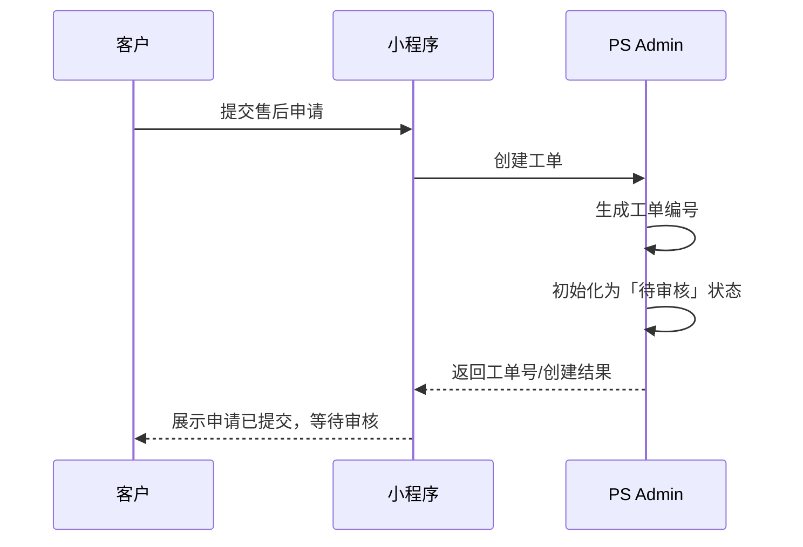
```mermaid
sequenceDiagram
    participant C as 客户
    participant M as 小程序
    participant A as PS Admin

    C->>M: 提交售后申请
    M->>A: 创建工单
    A->>A: 生成工单编号
    A->>A: 初始化为「待审核」状态
    A-->>M: 返回工单号/创建结果
    M-->>C: 展示申请已提交，等待审核
```

### 接口定义

|项目|内容|
|---|---|
|接口路径|`/api/miniapp/tickets`|
|请求方式|POST|
|调用方向|小程序 → PS Admin|
|鉴权方式|小程序用户身份令牌 / 签名|
|幂等要求|支持|

### 请求参数

|字段名称|字段Key|数据类型|必填|默认值|说明|
|---|---|---|---|---|---|
|来源请求号|requestNo|String|是|-|小程序侧申请唯一请求号，用于幂等控制|
|客户姓名|customerName|String|是|-|申请人姓名|
|客户手机号|mobile|String|是|-|客户手机号，作为客户标识|
|邮箱|email|String|否|空|客户邮箱|
|申请渠道|channel|String|是|-|`MINIAPP`|
|产品编码|productCode|String|否|空|产品唯一编码|
|产品名称|productName|String|是|-|产品名称|
|购买日期|purchaseDate|Date|否|空|`yyyy-MM-dd`|
|问题描述|issueDescription|String|是|-|客户填写的问题说明|
|附件列表|attachments|Array|否|`[]`|图片或附件信息|

### 返回参数

|字段名称|字段Key|数据类型|说明|
|---|---|---|---|
|返回码|code|Integer|接口处理结果码，成功返回 `200`|
|返回说明|message|String|接口处理结果说明|
|返回数据|data|Object|具体返回数据|
|工单编号|data.ticketNo|String|系统生成的工单编号|
|工单ID|data.ticketId|String|内部主键或唯一标识|
|初始状态|data.status|String|工单初始状态|
|状态说明|data.statusDesc|String|面向前端展示的状态说明|

## 3.2 审核结果回调接口

客户提交申请后，PS Admin 中由维修人员对申请进行预审。预审完成后（通过或拒绝），PS Admin 按订阅关系主动回调小程序，推送审核结果及必要说明。小程序收到回调后，调用查询工单详情接口（3.9）获取最新工单信息并更新本地记录，再向客户推送审核结果消息。本接口仅传递事件通知及必要原因说明，小程序按 `messageId` 做幂等处理，PS Admin 记录回调日志并按约定策略失败重试。

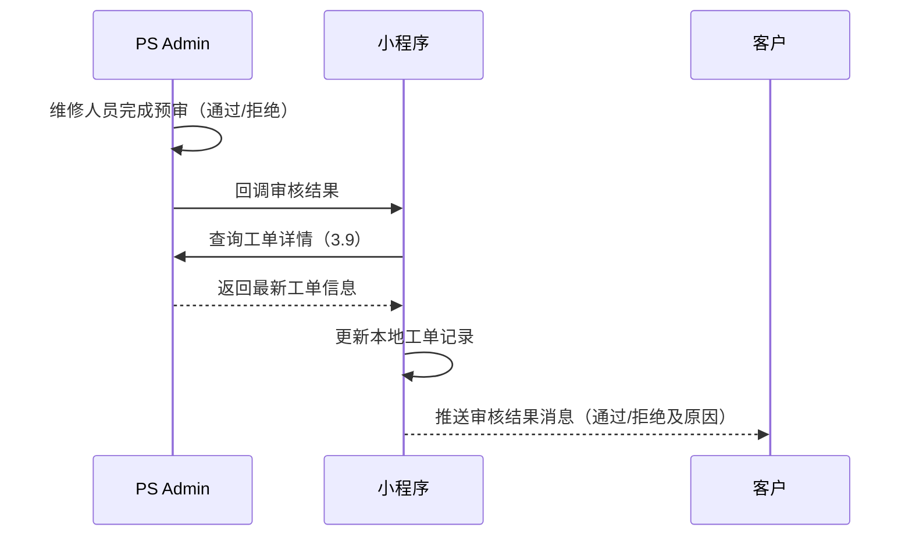
```mermaid
sequenceDiagram
    participant A as PS Admin
    participant M as 小程序
    participant C as 客户

    A->>A: 维修人员完成预审（通过/拒绝）
    A->>M: 回调审核结果
    M->>A: 查询工单详情（3.9）
    A-->>M: 返回最新工单信息
    M->>M: 更新本地工单记录
    M-->>C: 推送审核结果消息（通过/拒绝及原因）
```

### 接口定义

|项目|内容|
|---|---|
|接口路径|由小程序侧提供|
|请求方式|POST|
|调用方向|PS Admin → 小程序|

### 请求参数

|字段名称|字段Key|数据类型|必填|默认值|说明|
|---|---|---|---|---|---|
|消息唯一标识|messageId|String|是|-|消息幂等标识|
|消息类型|messageType|String|是|-|`AUDIT_NOTICE`|
|通知类型|noticeType|String|是|-|`AUDIT_APPROVED` / `AUDIT_REJECTED`|
|工单编号|ticketNo|String|是|-|售后工单编号|
|审核结果|auditResult|String|是|-|`APPROVED` / `REJECTED`|
|拒绝原因|rejectReason|String|否|空|审核拒绝原因（拒绝时必填）|
|审核备注|auditRemark|String|否|空|补充说明|
|审核时间|auditTime|Datetime|是|-|审核完成时间|
|通知摘要|summary|String|否|空|简要提示内容|
|时间戳|timestamp|String|是|-|签名时间戳|
|随机串|nonce|String|是|-|防重放字段|
|签名|sign|String|是|-|签名值|

### 返回参数

|字段名称|字段Key|数据类型|说明|
|---|---|---|---|
|返回码|code|Integer|接口处理结果码，成功返回 `200`|
|返回说明|message|String|接口处理结果说明|
|返回数据|data|Object|具体返回数据|
|接收结果|data.result|String|`SUCCESS` / `FAIL`|

## 3.3 查询客户工单列表接口

当客户在小程序中查看维修单列表、选择需补充寄件信息的工单、查看待支付工单或查看历史工单时，由小程序调用 PS Admin 查询客户工单列表接口，按客户手机号查询本人相关工单列表，并获取对应工单编号及场景化可操作标识。

接口返回工单基础信息、当前状态及当前可执行操作，用于支撑小程序侧维修单列表展示、寄件信息补充入口识别、待支付工单识别及历史工单查询等场景。小程序可根据请求场景传入对应筛选条件，按需展示客户当前可处理或可查看的工单记录。

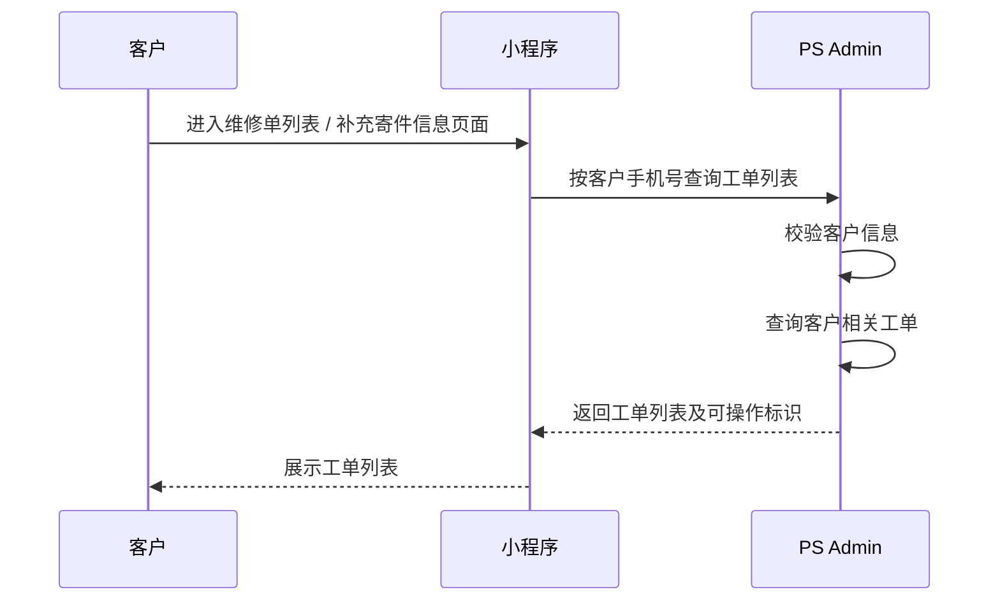
```mermaid
sequenceDiagram
    participant C as 客户
    participant M as 小程序
    participant A as PS Admin

    C->>M: 进入维修单列表 / 补充寄件信息页面
    M->>A: 按客户手机号查询工单列表
    A->>A: 校验客户信息
    A->>A: 查询客户相关工单
    A-->>M: 返回工单列表及可操作标识
    M-->>C: 展示工单列表
```

### 接口定义

|项目|内容|
|---|---|
|接口路径|`/api/miniapp/tickets/list`|
|请求方式|GET|
|调用方向|小程序 → PS Admin|
|鉴权方式|小程序用户身份令牌 / 签名|

### 请求参数

|字段名称|字段Key|数据类型|必填|默认值|说明|
|---|---|---|---|---|---|
|客户手机号|mobile|String|是|-|客户手机号，作为查询条件|
|场景类型|scene|String|否|`ALL`|`ALL` / `PENDING_SHIPPING` / `PENDING_PAY` / `PROCESSING` / `COMPLETED`|
|当前页码|pageNo|Integer|否|1|当前页码|
|每页条数|pageSize|Integer|否|10|每页条数|

### 返回参数

|字段名称|字段Key|数据类型|说明|
|---|---|---|---|
|返回码|code|Integer|接口处理结果码，成功返回 `200`|
|返回说明|message|String|接口处理结果说明|
|返回数据|data|Object|具体返回数据|
|当前页码|data.pageNo|Integer|当前页码|
|每页条数|data.pageSize|Integer|每页条数|
|总记录数|data.total|Integer|符合条件的工单总数|
|工单列表|data.records|Array|客户工单列表|
|工单编号|data.records[].ticketNo|String|售后工单编号|
|产品名称|data.records[].productName|String|产品名称|
|申请时间|data.records[].applyTime|Datetime|工单创建时间|
|当前状态|data.records[].status|String|工单当前状态|
|状态说明|data.records[].statusDesc|String|前端展示文案|
|是否允许补充寄件信息|data.records[].canSubmitShipping|Boolean|当前是否允许提交寄件信息|
|是否允许支付|data.records[].canPay|Boolean|当前是否允许支付|
|是否允许取消|data.records[].canCancel|Boolean|当前是否允许取消|
|是否允许查看问卷|data.records[].canViewSurvey|Boolean|当前是否允许查看问卷|
|寄件信息提交状态|data.records[].shippingInfoStatus|String|`PENDING` / `SUBMITTED`|

## 3.4 提交寄件信息接口

当客户完成工单选择后，由小程序调用 PS Admin 提交寄件信息接口，提交寄件公司、运单号及寄件时间等信息。PS Admin 接收后写入工单寄件记录，并更新相关物流跟踪信息，供后续接收、查询及通知使用。

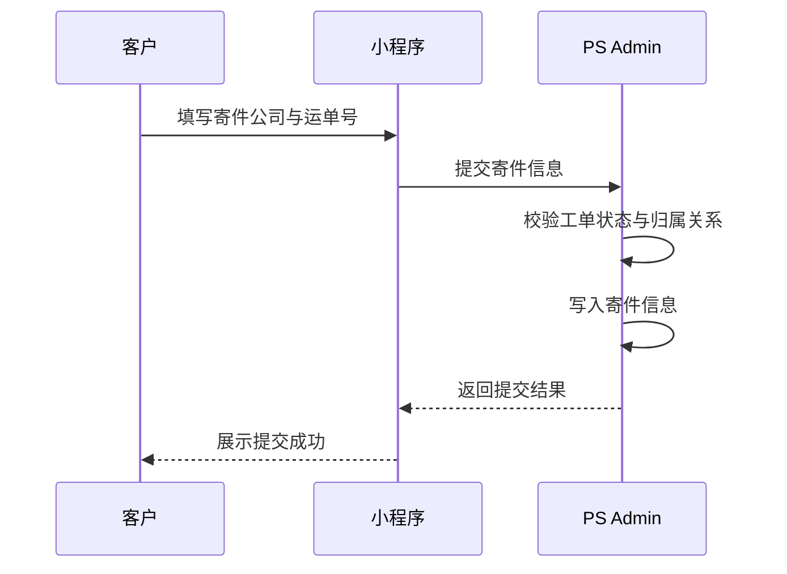
```mermaid
sequenceDiagram
    participant C as 客户
    participant M as 小程序
    participant A as PS Admin

    C->>M: 填写寄件公司与运单号
    M->>A: 提交寄件信息
    A->>A: 校验工单状态与归属关系
    A->>A: 写入寄件信息
    A-->>M: 返回提交结果
    M-->>C: 展示提交成功
```

### 接口定义

|项目|内容|
|---|---|
|接口路径|`/api/miniapp/tickets/shipping-info`|
|请求方式|POST|
|调用方向|小程序 → PS Admin|
|鉴权方式|小程序用户身份令牌 / 签名|
|幂等要求|支持|

### 请求参数

|字段名称|字段Key|数据类型|必填|默认值|说明|
|---|---|---|---|---|---|
|工单编号|ticketNo|String|是|-|售后工单编号|
|客户手机号|mobile|String|是|-|客户手机号，作为客户身份校验条件|
|寄件公司|carrier|String|是|-|客户寄件使用的物流公司|
|运单号|trackingNo|String|是|-|客户寄件运单号|
|寄件时间|shippedTime|Datetime|否|空|客户实际寄件时间|
|寄件备注|remark|String|否|空|补充说明|

### 返回参数

|字段名称|字段Key|数据类型|说明|
|---|---|---|---|
|返回码|code|Integer|接口处理结果码，成功返回 `200`|
|返回说明|message|String|接口处理结果说明|
|返回数据|data|Object|具体返回数据|
|工单编号|data.ticketNo|String|售后工单编号|
|寄件信息状态|data.shippingInfoStatus|String|`SUBMITTED` / `REPEAT` / `FAIL`|

## 3.5 查询待支付信息接口

当工单进入有偿场景后，小程序向 PS Admin 查询待支付信息。PS Admin 仅提供支付金额、费用说明等业务数据；支付链接生成、调起微信支付及支付操作的完整流程均由小程序负责完成。本接口仅提供支付详情查询，不承担提醒职责；若工单已支付或已关闭，则返回最新支付状态及是否可继续支付标记。

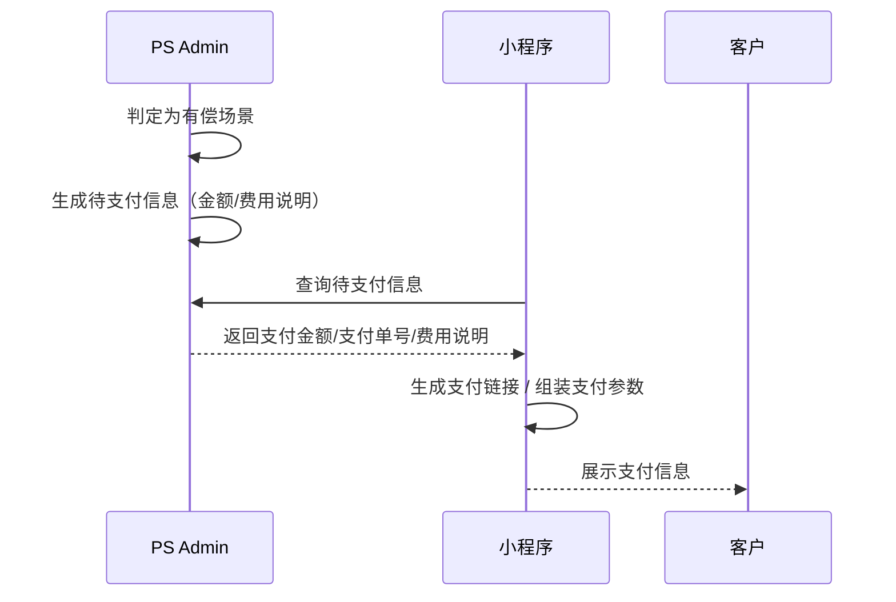
```mermaid
sequenceDiagram
    participant A as PS Admin
    participant M as 小程序
    participant C as 客户

    A->>A: 判定为有偿场景
    A->>A: 生成待支付信息（金额/费用说明）
    M->>A: 查询待支付信息
    A-->>M: 返回支付金额/支付单号/费用说明
    M->>M: 生成支付链接 / 组装支付参数
    M-->>C: 展示支付信息
```

### 接口定义

|项目|内容|
|---|---|
|接口路径|`/api/miniapp/payments/pending`|
|请求方式|GET|
|调用方向|小程序 → PS Admin|
|鉴权方式|小程序用户身份令牌 / 签名|

### 请求参数

|字段名称|字段Key|数据类型|必填|默认值|说明|
|---|---|---|---|---|---|
|工单编号|ticketNo|String|是|-|售后工单编号|
|客户手机号|mobile|String|是|-|客户手机号，作为客户身份校验条件|

### 返回参数

|字段名称|字段Key|数据类型|说明|
|---|---|---|---|
|返回码|code|Integer|接口处理结果码，成功返回 `200`|
|返回说明|message|String|接口处理结果说明|
|返回数据|data|Object|具体返回数据|
|工单编号|data.ticketNo|String|工单编号|
|支付单号|data.paymentNo|String|待支付单号|
|支付状态|data.paymentStatus|String|`UNPAID` / `PAID` / `CLOSED`|
|支付金额|data.amount|Decimal|待支付金额|
|币种|data.currency|String|币种|
|费用说明|data.feeDescription|String|费用说明|
|支付截止时间|data.paymentDeadline|Datetime|截止支付时间|
|是否允许支付|data.canPay|Boolean|当前是否允许继续支付|

## 3.6 支付结果接收接口

客户完成支付后，小程序将支付结果回写至 PS Admin。小程序应在完成验签或核单后再提交；PS Admin 接收后更新支付状态和工单状态；本接口必须支持幂等，若回写失败，后续可通过支付结果补偿查询接口做补偿，最终支付结果以 PS Admin 落账结果为准。

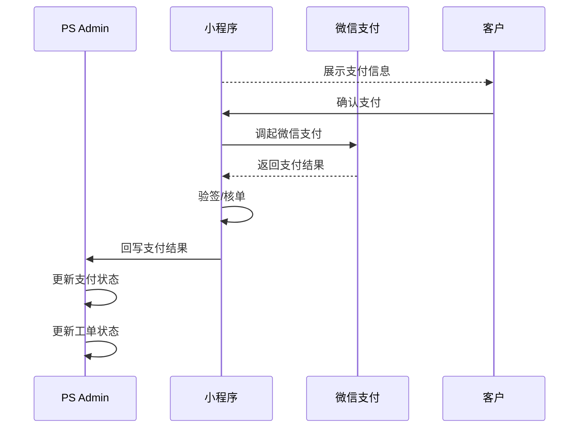
```mermaid
sequenceDiagram
    participant A as PS Admin
    participant M as 小程序
    participant W as 微信支付
    participant C as 客户

    M-->>C: 展示支付信息
    C->>M: 确认支付
    M->>W: 调起微信支付
    W-->>M: 返回支付结果
    M->>M: 验签/核单
    M->>A: 回写支付结果
    A->>A: 更新支付状态
    A->>A: 更新工单状态
```

### 接口定义

|项目|内容|
|---|---|
|接口路径|`/api/miniapp/payments/result`|
|请求方式|POST|
|调用方向|小程序 → PS Admin|
|幂等要求|必须支持|

### 请求参数

|字段名称|字段Key|数据类型|必填|默认值|说明|
|---|---|---|---|---|---|
|工单编号|ticketNo|String|是|-|售后工单编号|
|支付单号|paymentNo|String|是|-|待支付单号|
|支付结果|paymentResult|String|是|-|`SUCCESS` / `FAIL` / `CANCEL`|
|支付状态|paymentStatus|String|是|-|`PAID` / `UNPAID` / `CLOSED`|
|支付时间|paymentTime|Datetime|否|空|成功支付时间|
|支付方式|paymentMethod|String|否|空|`WECHAT` 等|
|支付流水号|transactionNo|String|否|空|支付平台流水号|
|支付授权号|authNo|String|否|空|授权号|
|验签结果|signVerified|Boolean|否|`false`|小程序侧验签或核单结果|
|原始报文|rawPayload|String|否|空|原始返回数据，便于追溯|

### 返回参数

|字段名称|字段Key|数据类型|说明|
|---|---|---|---|
|返回码|code|Integer|接口处理结果码，成功返回 `200`|
|返回说明|message|String|接口处理结果说明|
|返回数据|data|Object|具体返回数据|
|处理结果|data.result|String|`SUCCESS` / `RETRY` / `FAIL`|
|当前支付状态|data.currentPaymentStatus|String|PS Admin 最终记录的支付状态|

## 3.7 支付结果补偿查询接口

当支付结果回写异常、超时或双方状态不一致时，PS Admin 主动向小程序查询支付最终状态，用于异常补偿和状态修正。查询结果返回后，PS Admin 修正支付状态及工单状态；如小程序也无法确认最终结果，则保留异常状态并支持人工处理。

本接口名称由原“支付状态查询接口”调整为“支付结果补偿查询接口”，以更准确反映其用途：该接口并非客户侧常规查询接口，而是系统间异常补偿能力。

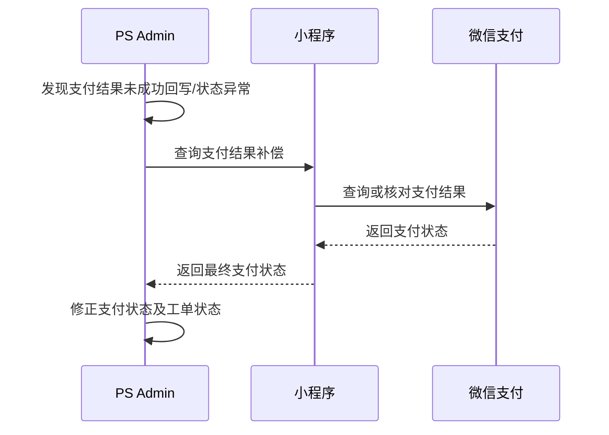
```mermaid
sequenceDiagram
    participant A as PS Admin
    participant M as 小程序
    participant W as 微信支付

    A->>A: 发现支付结果未成功回写/状态异常
    A->>M: 查询支付结果补偿
    M->>W: 查询或核对支付结果
    W-->>M: 返回支付状态
    M-->>A: 返回最终支付状态
    A->>A: 修正支付状态及工单状态
```

### 接口定义

|项目|内容|
|---|---|
|接口路径|由小程序侧提供|
|请求方式|GET / POST|
|调用方向|PS Admin → 小程序|

### 请求参数

|字段名称|字段Key|数据类型|必填|默认值|说明|
|---|---|---|---|---|---|
|工单编号|ticketNo|String|是|-|售后工单编号|
|支付单号|paymentNo|String|是|-|待支付单号|
|查询时间|queryTime|Datetime|否|当前时间|当前查询时间|
|查询来源|querySource|String|否|`COMPENSATION`|`COMPENSATION` / `MANUAL`|

### 返回参数

|字段名称|字段Key|数据类型|说明|
|---|---|---|---|
|返回码|code|Integer|接口处理结果码，成功返回 `200`|
|返回说明|message|String|接口处理结果说明|
|返回数据|data|Object|具体返回数据|
|支付状态|data.paymentStatus|String|`PAID` / `UNPAID` / `CLOSED` / `UNKNOWN`|
|支付结果|data.paymentResult|String|`SUCCESS` / `FAIL` / `CANCEL`|
|支付时间|data.paymentTime|Datetime|实际支付时间|
|支付方式|data.paymentMethod|String|支付方式|
|交易流水号|data.transactionNo|String|支付平台流水号|

## 3.8 支付通知回调接口

当工单进入待支付、催缴提醒、最终提醒、支付完成或支付超时时，PS Admin 按订阅关系主动回调小程序，用于事件提醒和客户触达。PS Admin 按以下催缴周期自动推送提醒：

- **第 1～3 天**：每天推送一次催缴提醒
    
- **第 29 天**：推送最终提醒
    
- **第 30 天仍未支付**：标记工单为「支付超时」状态，工单不关闭并保留；后续由维修人员通过短信发送支付信息给客户，客户可通过支付宝完成支付
    

本接口仅传递提醒信息，不承载完整支付详情；客户进入支付页面后仍应通过查询待支付信息接口获取最新数据；小程序按 `messageId` 做幂等处理，PS Admin 记录回调日志并按约定策略失败重试。

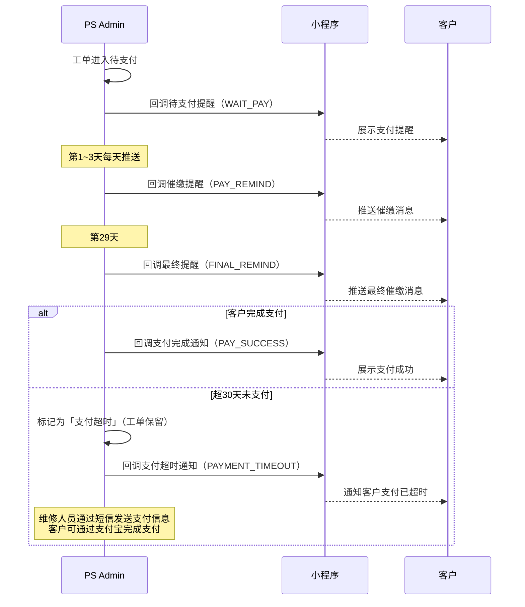
```mermaid
sequenceDiagram
    participant A as PS Admin
    participant M as 小程序
    participant C as 客户

    A->>A: 工单进入待支付
    A->>M: 回调待支付提醒（WAIT_PAY）
    M-->>C: 展示支付提醒
    Note over A: 第1~3天每天推送
    A->>M: 回调催缴提醒（PAY_REMIND）
    M-->>C: 推送催缴消息
    Note over A: 第29天
    A->>M: 回调最终提醒（FINAL_REMIND）
    M-->>C: 推送最终催缴消息
    alt 客户完成支付
        A->>M: 回调支付完成通知（PAY_SUCCESS）
        M-->>C: 展示支付成功
    else 超30天未支付
        A->>A: 标记为「支付超时」（工单保留）
        A->>M: 回调支付超时通知（PAYMENT_TIMEOUT）
        M-->>C: 通知客户支付已超时
        Note over A: 维修人员通过短信发送支付信息<br/>客户可通过支付宝完成支付
    end
```

### 接口定义

|项目|内容|
|---|---|
|接口路径|由小程序侧提供|
|请求方式|POST|
|调用方向|PS Admin → 小程序|

### 请求参数

|字段名称|字段Key|数据类型|必填|默认值|说明|
|---|---|---|---|---|---|
|消息唯一标识|messageId|String|是|-|消息幂等标识|
|消息类型|messageType|String|是|-|`PAY_NOTICE`|
|通知类型|noticeType|String|是|-|`WAIT_PAY` / `PAY_REMIND` / `FINAL_REMIND` / `PAY_SUCCESS` / `PAYMENT_TIMEOUT`|
|工单编号|ticketNo|String|是|-|售后工单编号|
|支付单号|paymentNo|String|否|空|支付单号|
|当前支付状态|paymentStatus|String|是|-|`UNPAID` / `PAID` / `CLOSED`|
|通知标题|title|String|是|-|消息标题|
|通知摘要|summary|String|否|空|简要说明|
|触发时间|eventTime|Datetime|否|当前时间|事件发生时间|
|时间戳|timestamp|String|是|-|签名时间戳|
|随机串|nonce|String|是|-|防重放字段|
|签名|sign|String|是|-|签名值|

### 返回参数

|字段名称|字段Key|数据类型|说明|
|---|---|---|---|
|返回码|code|Integer|接口处理结果码，成功返回 `200`|
|返回说明|message|String|接口处理结果说明|
|返回数据|data|Object|具体返回数据|
|接收结果|data.result|String|`SUCCESS` / `FAIL`|

## 3.9 查询工单详情接口

工单状态的权威口径以 PS Admin 为准。小程序在收到工单状态变化回调（3.10）、审核结果回调（3.2）、支付通知回调（3.8）、客户确认事项回调（3.14）后，应调用本接口获取最新工单详情、当前状态、可操作项、客户确认事项摘要及维修进展轨迹，并更新本地记录。客户日常查看工单时，小程序可直接使用本地记录的状态与详情进行展示；当需要发起支付、补充寄件信息、取消等关键操作时，小程序也可根据本地记录判断是否可操作，无需每次实时查询。

本接口用于替代原“查询工单状态接口”。除状态信息外，统一承载客户侧详情页所需的详情摘要信息与维修进展轨迹，避免后续再单独增加“工单详情接口”或“维修进展轨迹接口”，同时保持整篇接口文档的章节结构不变。

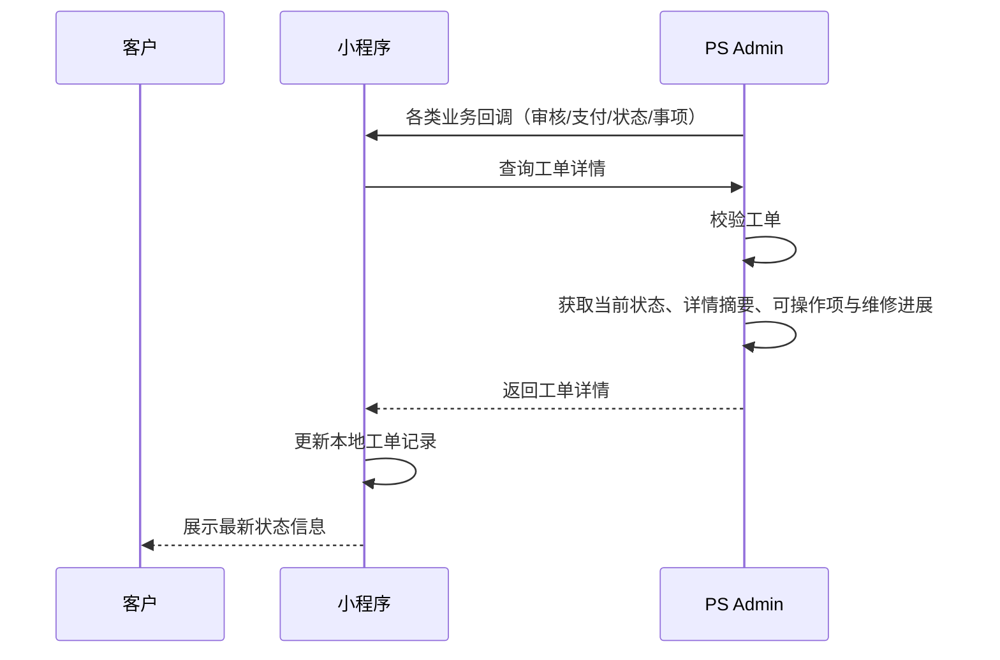
```mermaid
sequenceDiagram
    participant C as 客户
    participant M as 小程序
    participant A as PS Admin

    A->>M: 各类业务回调（审核/支付/状态/事项）
    M->>A: 查询工单详情
    A->>A: 校验工单
    A->>A: 获取当前状态、详情摘要、可操作项与维修进展
    A-->>M: 返回工单详情
    M->>M: 更新本地工单记录
    M-->>C: 展示最新状态信息
```

### 接口定义

|项目|内容|
|---|---|
|接口路径|`/api/miniapp/tickets/{ticketNo}/detail`|
|请求方式|GET|
|调用方向|小程序 → PS Admin|

### 请求参数

|字段名称|字段Key|数据类型|必填|默认值|说明|
|---|---|---|---|---|---|
|工单编号|ticketNo|String|是|-|售后工单编号|
|客户手机号|mobile|String|是|-|客户手机号，作为客户身份校验条件|
|语言|language|String|否|`zh-CN`|多语言展示|

### 返回参数

|字段名称|字段Key|数据类型|说明|
|---|---|---|---|
|返回码|code|Integer|接口处理结果码，成功返回 `200`|
|返回说明|message|String|接口处理结果说明|
|返回数据|data|Object|具体返回数据|
|工单编号|data.ticketNo|String|工单编号|
|当前状态|data.status|String|工单当前状态|
|状态说明|data.statusDesc|String|前端显示文案|
|主进度节点|data.progressStage|String|当前阶段|
|关键时间节点|data.timeNodes|Array|如受理时间、支付时间、发货时间等|
|产品名称|data.productName|String|产品名称|
|问题描述|data.issueDescription|String|客户问题描述|
|待支付标记|data.hasPendingPayment|Boolean|是否存在待支付|
|待处理事项标记|data.hasPendingTask|Boolean|是否存在待处理客户确认事项|
|是否允许支付|data.canPay|Boolean|是否允许支付|
|是否允许取消|data.canCancel|Boolean|是否允许取消|
|是否允许查看问卷|data.canViewSurvey|Boolean|是否允许查看问卷|
|是否允许修改寄回方式|data.canModifyReturnMode|Boolean|是否允许修改寄回方式|
|是否允许修改寄回地址|data.canModifyReturnAddress|Boolean|是否允许修改寄回地址|
|寄回方式|data.returnMode|String|`HOME` / `STORE`|
|寄回地址摘要|data.returnAddressText|String|寄回地址展示文案|
|可操作项|data.actions|Array|当前状态下可展示的按钮或入口|
|客户确认事项摘要|data.pendingTasks|Array|当前待处理客户确认事项摘要|
|事项编号|data.pendingTasks[].taskNo|String|事项编号|
|事项标题|data.pendingTasks[].taskTitle|String|事项标题|
|事项类型|data.pendingTasks[].taskType|String|`CONFIRM`|
|维修进展轨迹|data.progressRecords|Array|维修进展轨迹列表|
|轨迹编号|data.progressRecords[].recordNo|String|轨迹唯一编号|
|轨迹类型|data.progressRecords[].recordType|String|`AUDIT` / `PAYMENT` / `REPAIR` / `LOGISTICS` / `SURVEY` / `TASK`|
|轨迹标题|data.progressRecords[].title|String|轨迹标题|
|轨迹内容|data.progressRecords[].content|String|轨迹内容|
|发生时间|data.progressRecords[].eventTime|Datetime|发生时间|

## 3.10 工单状态变化回调接口

当工单状态发生变更时（如进入预检、维修中、维修完成、已发货、已签收等），PS Admin 按订阅关系主动回调小程序，推送当前状态及状态说明。小程序收到回调后，根据业务需要调用对应查询接口（如查询工单详情接口、物流信息查询接口等）获取完整详情，并更新本地工单记录与轨迹信息。本接口覆盖维修阶段的状态推送及后续物流等关键节点的轨迹通知，客户可在小程序中查看完整的工单状态变化记录。

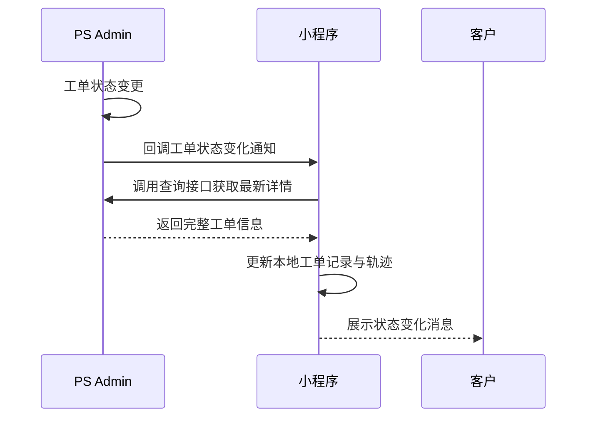
```mermaid
sequenceDiagram
    participant A as PS Admin
    participant M as 小程序
    participant C as 客户

    A->>A: 工单状态变更
    A->>M: 回调工单状态变化通知
    M->>A: 调用查询接口获取最新详情
    A-->>M: 返回完整工单信息
    M->>M: 更新本地工单记录与轨迹
    M-->>C: 展示状态变化消息
```

### 接口定义

|项目|内容|
|---|---|
|接口路径|由小程序侧提供|
|请求方式|POST|
|调用方向|PS Admin → 小程序|

### 请求参数

|字段名称|字段Key|数据类型|必填|默认值|说明|
|---|---|---|---|---|---|
|消息唯一标识|messageId|String|是|-|消息幂等标识|
|消息类型|messageType|String|是|-|`TICKET_STATUS_NOTICE`|
|工单编号|ticketNo|String|是|-|售后工单编号|
|当前状态|status|String|是|-|工单当前状态编码|
|状态说明|statusDesc|String|是|-|面向客户展示的状态说明文案|
|变更前状态|previousStatus|String|否|空|变更前状态编码|
|变更时间|eventTime|Datetime|是|-|状态变更时间|
|通知摘要|summary|String|否|空|简要说明|
|时间戳|timestamp|String|是|-|签名时间戳|
|随机串|nonce|String|是|-|防重放字段|
|签名|sign|String|是|-|签名值|

### 返回参数

|字段名称|字段Key|数据类型|说明|
|---|---|---|---|
|返回码|code|Integer|接口处理结果码，成功返回 `200`|
|返回说明|message|String|接口处理结果说明|
|返回数据|data|Object|具体返回数据|
|接收结果|data.result|String|`SUCCESS` / `FAIL`|

## 3.11 问卷提醒回调接口

当工单满足问卷触发条件后，PS Admin 按订阅关系主动向小程序回调问卷提醒信息，用于提示客户填写问卷或关注截止时间。该接口仅用于事件提醒，不承载完整问卷内容；小程序收到提醒后，仍应通过问卷信息查询接口获取问卷详情并展示。

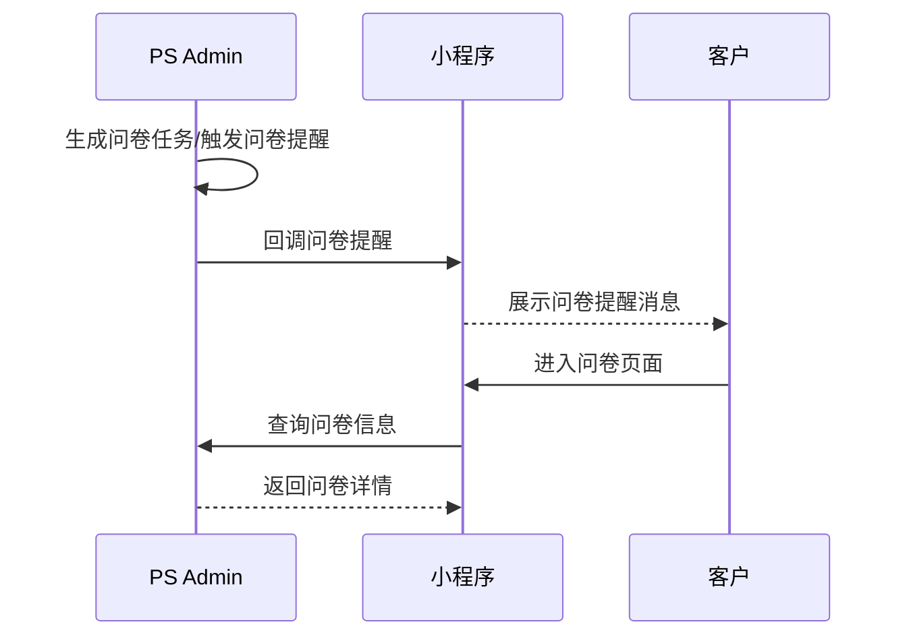
```mermaid
sequenceDiagram
    participant A as PS Admin
    participant M as 小程序
    participant C as 客户

    A->>A: 生成问卷任务/触发问卷提醒
    A->>M: 回调问卷提醒
    M-->>C: 展示问卷提醒消息
    C->>M: 进入问卷页面
    M->>A: 查询问卷信息
    A-->>M: 返回问卷详情
```

### 接口定义

|项目|内容|
|---|---|
|接口路径|由小程序侧提供|
|请求方式|POST|
|调用方向|PS Admin → 小程序|

### 请求参数

|字段名称|字段Key|数据类型|必填|默认值|说明|
|---|---|---|---|---|---|
|消息唯一标识|messageId|String|是|-|消息幂等标识|
|消息类型|messageType|String|是|-|`SURVEY_NOTICE`|
|通知类型|noticeType|String|是|-|`SURVEY_CREATED` / `SURVEY_PENDING` / `SURVEY_DEADLINE_REMIND`|
|工单编号|ticketNo|String|是|-|售后工单编号|
|问卷编号|surveyNo|String|是|-|问卷任务编号|
|问卷标题|surveyTitle|String|否|空|问卷标题|
|截止时间|deadlineTime|Datetime|否|空|问卷填写截止时间|
|通知摘要|summary|String|否|空|简要提醒内容|
|触发时间|eventTime|Datetime|否|当前时间|事件发生时间|
|时间戳|timestamp|String|是|-|签名时间戳|
|随机串|nonce|String|是|-|防重放字段|
|签名|sign|String|是|-|签名值|

### 返回参数

|字段名称|字段Key|数据类型|说明|
|---|---|---|---|
|返回码|code|Integer|接口处理结果码，成功返回 `200`|
|返回说明|message|String|接口处理结果说明|
|返回数据|data|Object|具体返回数据|
|接收结果|data.result|String|`SUCCESS` / `FAIL`|

## 3.12 问卷信息查询接口

当客户进入问卷页面或收到问卷提醒后，由小程序调用 PS Admin 问卷信息查询接口，获取当前工单对应的问卷标题、说明、题目、选项、截止时间及填写状态等信息。小程序根据返回结果展示问卷页面，问卷最终状态以 PS Admin 返回结果为准。

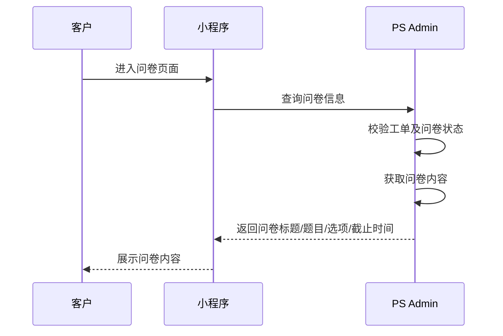
```mermaid
sequenceDiagram
    participant C as 客户
    participant M as 小程序
    participant A as PS Admin

    C->>M: 进入问卷页面
    M->>A: 查询问卷信息
    A->>A: 校验工单及问卷状态
    A->>A: 获取问卷内容
    A-->>M: 返回问卷标题/题目/选项/截止时间
    M-->>C: 展示问卷内容
```

### 接口定义

|项目|内容|
|---|---|
|接口路径|`/api/miniapp/surveys`|
|请求方式|GET|
|调用方向|小程序 → PS Admin|
|鉴权方式|小程序用户身份令牌 / 签名|

### 请求参数

|字段名称|字段Key|数据类型|必填|默认值|说明|
|---|---|---|---|---|---|
|工单编号|ticketNo|String|是|-|售后工单编号|
|客户手机号|mobile|String|是|-|客户手机号，作为客户身份校验条件|
|问卷编号|surveyNo|String|否|空|问卷任务编号；不传时返回当前工单最新有效问卷|
|语言|language|String|否|`zh-CN`|`zh-CN` / `en` / `ko`|

### 返回参数

|字段名称|字段Key|数据类型|说明|
|---|---|---|---|
|返回码|code|Integer|接口处理结果码，成功返回 `200`|
|返回说明|message|String|接口处理结果说明|
|返回数据|data|Object|具体返回数据|
|工单编号|data.ticketNo|String|售后工单编号|
|问卷编号|data.surveyNo|String|问卷任务编号|
|问卷标题|data.surveyTitle|String|问卷标题|
|问卷说明|data.surveyDesc|String|问卷说明|
|问卷状态|data.surveyStatus|String|`PENDING` / `SUBMITTED` / `EXPIRED` / `INVALID`|
|截止时间|data.deadlineTime|Datetime|问卷填写截止时间|
|是否允许提交|data.canSubmit|Boolean|当前是否允许提交问卷|
|题目列表|data.questions|Array|问卷题目及选项|
|题目编号|data.questions[].questionNo|String|题目唯一编号|
|题目标题|data.questions[].questionTitle|String|题目内容|
|题目类型|data.questions[].questionType|String|`SINGLE` / `MULTIPLE` / `TEXT` / `SCORE`|
|是否必答|data.questions[].required|Boolean|是否必填|
|排序号|data.questions[].sortNo|Integer|展示顺序|
|选项列表|data.questions[].options|Array|题目选项列表|
|选项编号|data.questions[].options[].optionNo|String|选项唯一编号|
|选项内容|data.questions[].options[].optionText|String|选项显示内容|
|选项排序号|data.questions[].options[].sortNo|Integer|展示顺序|

## 3.13 问卷结果接收接口

服务完成后，问卷内容由 PS Admin 提供，小程序负责展示问卷并收集客户填写结果。客户提交后，小程序将问卷结果回写至 PS Admin，由 PS Admin 负责校验问卷有效性、写入问卷记录，并更新问卷状态及回访状态。

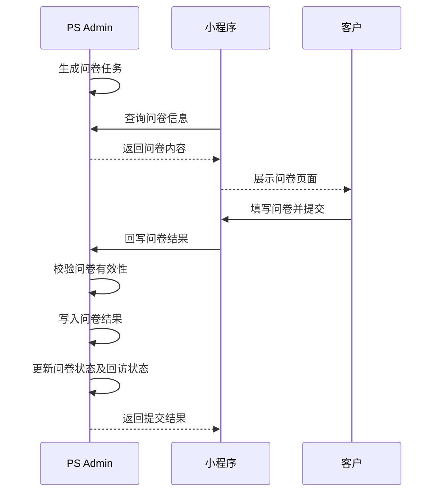
```mermaid
sequenceDiagram
    participant A as PS Admin
    participant M as 小程序
    participant U as 客户

    A->>A: 生成问卷任务
    M->>A: 查询问卷信息
    A-->>M: 返回问卷内容
    M-->>U: 展示问卷页面
    U->>M: 填写问卷并提交
    M->>A: 回写问卷结果
    A->>A: 校验问卷有效性
    A->>A: 写入问卷结果
    A->>A: 更新问卷状态及回访状态
    A-->>M: 返回提交结果
```

### 接口定义

|项目|内容|
|---|---|
|接口路径|`/api/miniapp/surveys/result`|
|请求方式|POST|
|调用方向|小程序 → PS Admin|

### 请求参数

|字段名称|字段Key|数据类型|必填|默认值|说明|
|---|---|---|---|---|---|
|工单编号|ticketNo|String|是|-|售后工单编号|
|问卷编号|surveyNo|String|是|-|问卷任务编号|
|评分|score|Integer|否|空|整体满意度评分|
|答案列表|answers|Array|是|-|问卷题目答案|
|反馈内容|feedback|String|否|空|主观评价|
|提交时间|submitTime|Datetime|是|-|提交时间|
|客户手机号|mobile|String|是|-|客户手机号，作为客户身份校验条件|

### 返回参数

|字段名称|字段Key|数据类型|说明|
|---|---|---|---|
|返回码|code|Integer|接口处理结果码，成功返回 `200`|
|返回说明|message|String|接口处理结果说明|
|返回数据|data|Object|具体返回数据|
|问卷状态|data.surveyStatus|String|`SUBMITTED` / `EXPIRED` / `INVALID`|
|回访状态|data.followUpStatus|String|回访状态|

## 3.14 客户确认事项回调接口

当工单处理中存在需客户在小程序中确认产品状态、确认维修方案、确认费用或查看异常说明等场景时，PS Admin 按订阅关系主动回调事项提醒。接口仅下发展示所需的基础内容和处理入口信息，不承载复杂交互配置；小程序收到后按事项类型展示页面，最终处理结果再通过客户确认事项结果接收接口回写。

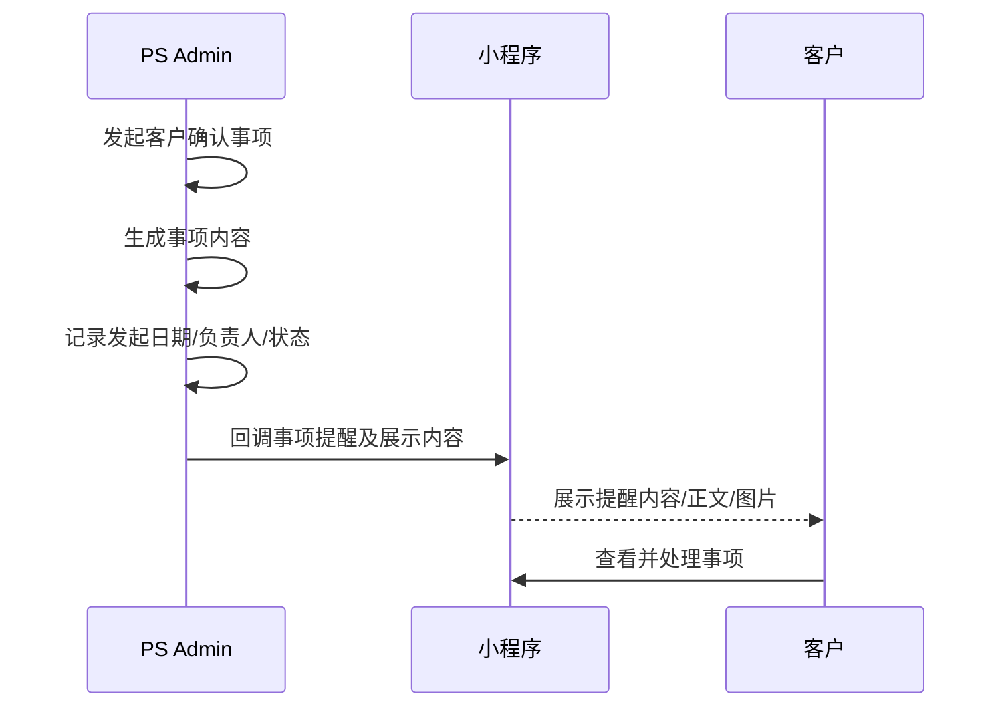
```mermaid
sequenceDiagram
    participant A as PS Admin
    participant M as 小程序
    participant C as 客户

    A->>A: 发起客户确认事项
    A->>A: 生成事项内容
    A->>A: 记录发起日期/负责人/状态
    A->>M: 回调事项提醒及展示内容
    M-->>C: 展示提醒内容/正文/图片
    C->>M: 查看并处理事项
```

### 接口定义

|项目|内容|
|---|---|
|接口路径|由小程序侧提供|
|请求方式|POST|
|调用方向|PS Admin → 小程序|

### 请求参数

| 字段名称   | 字段Key       | 数据类型     | 必填  | 默认值  | 说明            |
| ------ | ----------- | -------- | --- | ---- | ------------- |
| 消息唯一标识 | messageId   | String   | 是   | -    | 消息幂等标识        |
| 消息类型   | messageType | String   | 是   | -    | `TASK_NOTICE` |
| 工单编号   | ticketNo    | String   | 是   | -    | 售后工单编号        |
| 事项编号   | taskNo      | String   | 是   | -    | 事项唯一编号        |
| 事项类型   | taskType    | String   | 是   | -    | 固定为 `CONFIRM` |
| 事项标题   | taskTitle   | String   | 是   | -    | 事项标题          |
| 事项正文   | taskContent | String   | 是   | -    | 客户查看的详细说明正文   |
| 图片列表   | images      | Array    | 否   | `[]` | 事项相关图片信息      |
| 发起时间   | createdTime | Datetime | 是   | -    | 事项发起时间        |
| 处理时限   | dueTime     | Datetime | 否   | 空    | 客户处理截止时间      |
| 时间戳    | timestamp   | String   | 是   | -    | 签名时间戳         |
| 随机串    | nonce       | String   | 是   | -    | 防重放字段         |
| 签名     | sign        | String   | 是   | -    | 签名值           |

### 返回参数

|字段名称|字段Key|数据类型|说明|
|---|---|---|---|
|返回码|code|Integer|接口处理结果码，成功返回 `200`|
|返回说明|message|String|接口处理结果说明|
|返回数据|data|Object|具体返回数据|
|接收结果|data.result|String|`SUCCESS` / `FAIL`|

## 3.15 客户确认事项结果接收接口

客户在小程序中查看事项后，可提交确认或拒绝结果；小程序将结果回写至 PS Admin，由 PS Admin 记录处理内容、更新时间及事项状态。电话、线下等非小程序场景可由后台人工补录，事项结果默认不直接阻塞主状态流转。

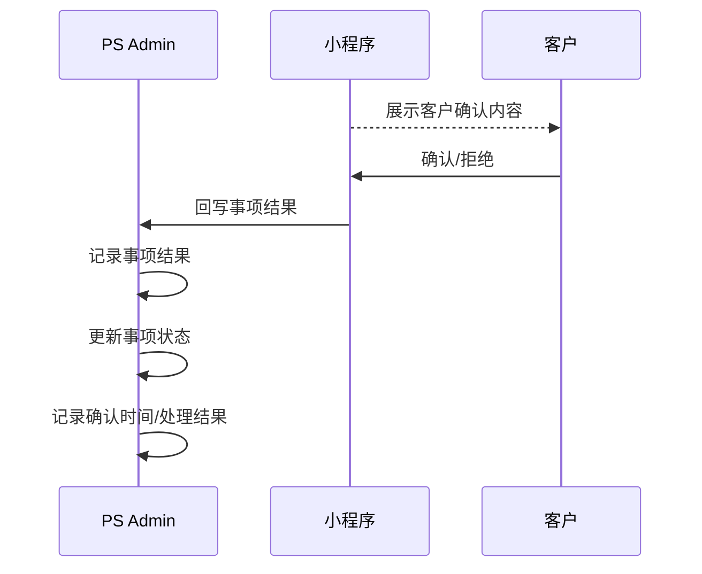
```mermaid
sequenceDiagram
    participant A as PS Admin
    participant M as 小程序
    participant C as 客户

    M-->>C: 展示客户确认内容
    C->>M: 确认/拒绝
    M->>A: 回写事项结果
    A->>A: 记录事项结果
    A->>A: 更新事项状态
    A->>A: 记录确认时间/处理结果
```

### 接口定义

|项目|内容|
|---|---|
|接口路径|`/api/miniapp/tasks/result`|
|请求方式|POST|
|调用方向|小程序 → PS Admin|

### 请求参数

| 字段名称  | 字段Key       | 数据类型     | 必填  | 默认值 | 说明                       |
| ----- | ----------- | -------- | --- | --- | ------------------------ |
| 工单编号  | ticketNo    | String   | 是   | -   | 售后工单编号                   |
| 事项编号  | taskNo      | String   | 是   | -   | 事项编号                     |
| 事项类型  | taskType    | String   | 是   | -   | 固定为 `CONFIRM`            |
| 确认结论  | result      | String   | 是   | -   | `CONFIRMED` / `REJECTED` |
| 处理时间  | handledTime | Datetime | 是   | -   | 处理时间                     |
| 客户手机号 | mobile      | String   | 是   | -   | 客户手机号，作为客户身份校验条件         |

### 返回参数

| 字段名称   | 字段Key           | 数据类型    | 说明                             |
| ------ | --------------- | ------- | ------------------------------ |
| 返回码    | code            | Integer | 接口处理结果码，成功返回 `200`             |
| 返回说明   | message         | String  | 接口处理结果说明                       |
| 返回数据   | data            | Object  | 具体返回数据                         |
| 当前事项状态 | data.taskStatus | String  | `UPDATED` / `DONE` / `PENDING` |

## 3.16 物流信息查询接口

客户在小程序查看物流进度时，由小程序向 PS Admin 查询当前物流信息。完整物流轨迹通过本接口获取；如暂未取得完整物流信息，PS Admin 仍返回当前可展示状态；在 3PL 场景下，如仅取得已发货结果但暂无真实运单号，可先展示发货状态。

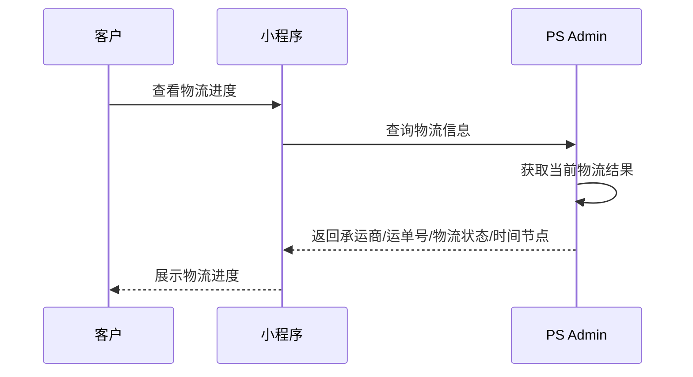
```mermaid
sequenceDiagram
    participant C as 客户
    participant M as 小程序
    participant A as PS Admin

    C->>M: 查看物流进度
    M->>A: 查询物流信息
    A->>A: 获取当前物流结果
    A-->>M: 返回承运商/运单号/物流状态/时间节点
    M-->>C: 展示物流进度
```

### 接口定义

|项目|内容|
|---|---|
|接口路径|`/api/miniapp/logistics`|
|请求方式|GET|
|调用方向|小程序 → PS Admin|

### 请求参数

|字段名称|字段Key|数据类型|必填|默认值|说明|
|---|---|---|---|---|---|
|工单编号|ticketNo|String|是|-|售后工单编号|
|客户手机号|mobile|String|是|-|客户手机号，作为客户身份校验条件|
|物流类型|logisticsType|String|否|`DELIVERY`|`RETURN` / `DELIVERY`|

### 返回参数

|字段名称|字段Key|数据类型|说明|
|---|---|---|---|
|返回码|code|Integer|接口处理结果码，成功返回 `200`|
|返回说明|message|String|接口处理结果说明|
|返回数据|data|Object|具体返回数据|
|工单编号|data.ticketNo|String|工单编号|
|承运商|data.carrier|String|物流公司|
|运单号|data.trackingNo|String|真实运单号|
|物流状态|data.logisticsStatus|String|`SHIPPED` / `IN_TRANSIT` / `DELIVERED` / `STORE_ARRIVED` 等|
|发货时间|data.shippedTime|Datetime|发货时间|
|签收时间|data.deliveredTime|Datetime|签收时间|
|门店到货时间|data.storeArrivedTime|Datetime|门店到货时间|
|轨迹列表|data.traces|Array|物流轨迹摘要|
|是否完整物流信息|data.hasFullTracking|Boolean|是否已返回真实物流详情|

## 3.17 物流状态回调接口

当发货、运输、配送完成、门店到货、门店可取等关键节点变化时，PS Admin 按订阅关系主动回调小程序，用于提醒和页面刷新。本接口只用于关键节点通知，不承载完整物流详情；客户进入页面后仍应通过物流信息查询接口获取完整数据；PS Admin 记录回调日志并支持失败重试。

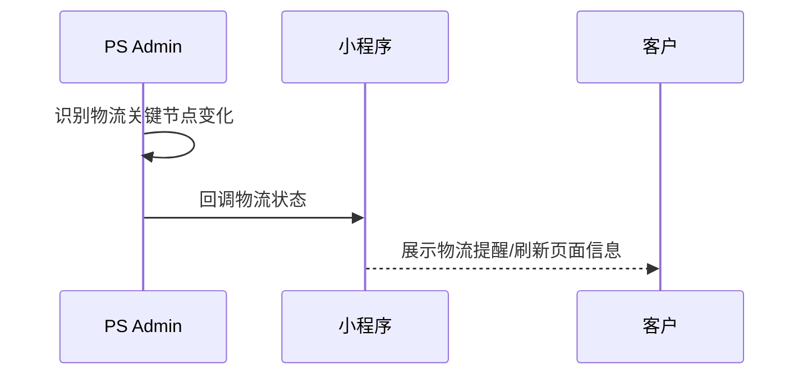
```mermaid
sequenceDiagram
    participant A as PS Admin
    participant M as 小程序
    participant C as 客户

    A->>A: 识别物流关键节点变化
    A->>M: 回调物流状态
    M-->>C: 展示物流提醒/刷新页面信息
```

### 接口定义

|项目|内容|
|---|---|
|接口路径|由小程序侧提供|
|请求方式|POST|
|调用方向|PS Admin → 小程序|

### 请求参数

|字段名称|字段Key|数据类型|必填|默认值|说明|
|---|---|---|---|---|---|
|消息唯一标识|messageId|String|是|-|消息幂等标识|
|消息类型|messageType|String|是|-|`LOGISTICS_NOTICE`|
|工单编号|ticketNo|String|是|-|工单编号|
|通知类型|noticeType|String|是|-|`SHIPPED` / `DELIVERED` / `STORE_ARRIVED` / `READY_FOR_PICKUP`|
|当前物流状态|logisticsStatus|String|是|-|当前物流状态|
|关键时间|eventTime|Datetime|否|当前时间|事件发生时间|
|简要说明|summary|String|否|空|提醒说明|
|运单号|trackingNo|String|否|空|如已获取可返回|
|时间戳|timestamp|String|是|-|签名时间戳|
|随机串|nonce|String|是|-|防重放字段|
|签名|sign|String|是|-|签名值|

### 返回参数

|字段名称|字段Key|数据类型|说明|
|---|---|---|---|
|返回码|code|Integer|接口处理结果码，成功返回 `200`|
|返回说明|message|String|接口处理结果说明|
|返回数据|data|Object|具体返回数据|
|接收结果|data.result|String|`SUCCESS` / `FAIL`|

## 3.18 取消订单接口

客户可在进入正式维修前通过小程序发起取消申请；进入“维修进行中”及之后状态后，小程序不再提供取消入口，如需取消仅允许后台人工处理。PS Admin 接收申请后同步校验当前状态、执行取消处理，并在同一次请求中直接返回取消处理结果（成功 / 失败 / 拒绝）；失败或拒绝时返回具体原因说明，不再另行异步回调。

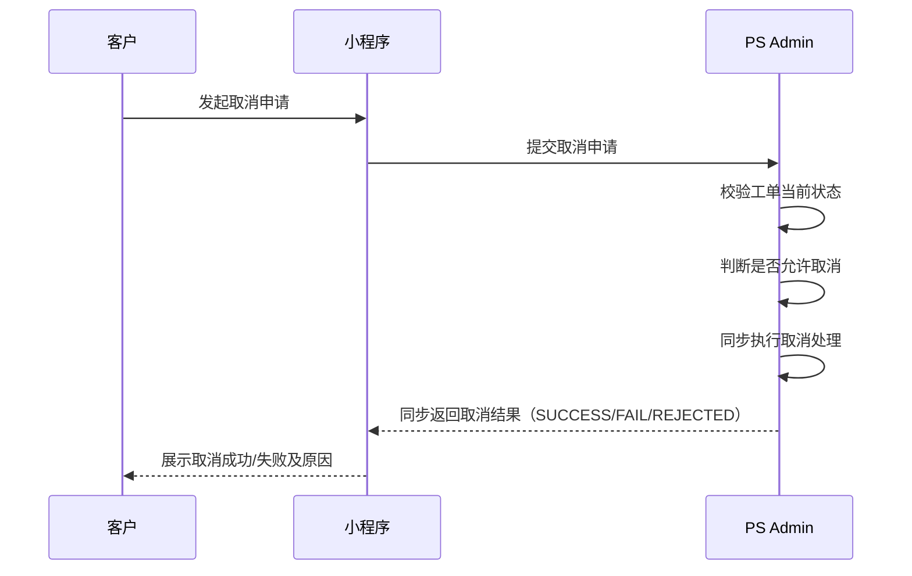
```mermaid
sequenceDiagram
    participant C as 客户
    participant M as 小程序
    participant A as PS Admin

    C->>M: 发起取消申请
    M->>A: 提交取消申请
    A->>A: 校验工单当前状态
    A->>A: 判断是否允许取消
    A->>A: 同步执行取消处理
    A-->>M: 同步返回取消结果（SUCCESS/FAIL/REJECTED）
    M-->>C: 展示取消成功/失败及原因
```

### 接口定义

|项目|内容|
|---|---|
|接口路径|`/api/miniapp/tickets/cancel`|
|请求方式|POST|
|调用方向|小程序 → PS Admin|

### 请求参数

|字段名称|字段Key|数据类型|必填|默认值|说明|
|---|---|---|---|---|---|
|工单编号|ticketNo|String|是|-|售后工单编号|
|取消原因|cancelReason|String|是|-|客户选择的取消原因|
|取消说明|cancelRemark|String|否|空|客户补充说明|
|取消来源|cancelSource|String|是|`CUSTOMER`|取消来源|
|申请时间|applyTime|Datetime|是|-|提交时间|
|客户手机号|mobile|String|是|-|客户手机号，作为客户身份校验条件|

### 返回参数

|字段名称|字段Key|数据类型|说明|
|---|---|---|---|
|返回码|code|Integer|接口处理结果码，成功返回 `200`|
|返回说明|message|String|接口处理结果说明|
|返回数据|data|Object|具体返回数据|
|工单编号|data.ticketNo|String|工单编号|
|取消结果|data.cancelResult|String|`SUCCESS`（取消成功）/ `FAIL`（处理失败）/ `REJECTED`（当前状态不允许取消）|
|取消时间|data.cancelTime|Datetime|取消完成时间（成功时返回）|
|原因说明|data.reason|String|失败或拒绝时返回的原因说明|
|工单最新状态|data.currentStatus|String|取消处理后的工单最新状态|

## 4 修订说明

### 4.1 修改了哪些

| 原章节/接口             | 修订后                  | 修改说明                                             |
| ------------------ | -------------------- | ------------------------------------------------ |
| 1.1 接口设计说明         | 新增“回调接口统一设计思路”对应说明   | 第 1 章整体结构保持不变，仅补充最少必要说明，不改变原协作口径                 |
| 2 接口总览             | 保留原“独立回调接口”阅读方式      | 不再将各类回调接口合并为一个接口名称，保持整篇文档业务表达清晰                  |
| 2.1 回调接口统一设计说明     | 新增                   | 新增统一说明，收敛的是公共设计规则，不是删除回调接口                       |
| 3.3 查询待补充寄件工单接口    | 改为 3.3 查询客户工单列表接口    | 由单一场景接口改为通用工单列表接口，通过 `scene` 与列表操作标识覆盖待补件等场景     |
| 3.7 支付状态查询接口       | 改为 3.7 支付结果补偿查询接口    | 仅调整名称与说明，使接口用途更准确                                |
| 3.9 查询工单状态接口       | 改为 3.9 查询工单详情接口      | 在保持章节位置基本不变的前提下，扩展承载状态、详情摘要、可操作项、客户确认事项摘要、维修进展轨迹 |
| 3.14 咨询/确认事项回调接口   | 改为 3.14 客户确认事项回调接口   | 明确仅保留需要客户在小程序中处理的确认类事项                           |
| 3.15 咨询/确认事项结果接收接口 | 改为 3.15 客户确认事项结果接收接口 | 明确小程序只回写客户确认类结果，不承接纯电话咨询结果回写                     |

### 4.2 新增了哪些

| 新增内容                    | 说明                                                                                 |
| ----------------------- | ---------------------------------------------------------------------------------- |
| 2.1 回调接口统一设计说明          | 新增一节，用于统一各回调接口的公共设计原则、幂等与失败重试规则                                                    |
| 查询客户工单列表接口中的 `scene` 参数 | 支持 `ALL`、`PENDING_SHIPPING`、`PENDING_PAY`、`PROCESSING`、`COMPLETED` 等场景过滤           |
| 查询工单详情接口中的详情摘要字段        | 新增 `productName`、`issueDescription` 等详情展示字段                                        |
| 查询工单详情接口中的寄回修改控制字段      | 新增 `canModifyReturnMode`、`canModifyReturnAddress`、`returnMode`、`returnAddressText` |
| 查询工单详情接口中的维修进展轨迹结构      | 新增 `progressRecords`，用于支撑小程序展示维修进展轨迹                                               |

### 4.3 删除了哪些

| 原接口/内容      | 处理方式          | 说明                                                |
| ----------- | ------------- | ------------------------------------------------- |
| 查询待补充寄件工单接口 | 被查询客户工单列表接口替代 | 不再保留单一用途列表接口                                      |
| 查询工单状态接口    | 被查询工单详情接口替代   | 不再单独保留仅返回状态的轻接口                                   |
| 咨询类小程序回写范围  | 从小程序接口文档中删除   | 纯电话咨询、后台记录类咨询不要求客户在小程序中操作，不再在小程序接口文档中单独保留咨询结果回写能力 |
