# Gentle Monster 中国区眼镜产品服务系统（PS系统）

# 软件需求规格说明书

**文档版本：** V1.0  
**文档状态：** 客户评审版 
**编写单位：** 杭州无界同顺科技有限公司  
**评审对象：** 镜特梦贸易（上海）有限公司

| 版本号  | 日期         | 修订人 | 修订说明                   |
| ---- | ---------- | --- | ---------------------- |
| V1.0 | 2026-04-03 | 顾国海 | 初版提交，用于客户评审            |
| V1.1 | 2026-04-10 | 顾国海 | 根据最新评审意见修订外部协同及库存机制等内容 |

# 1. 概述

## 1.1 项目背景

随着 Gentle Monster 中国区售后业务发展，售后流程已覆盖维修、配件、咨询、支付、物流、回访等多个环节，并涉及小程序、SAP、物流、短信等系统协同。随着业务链路和参与对象增加，现有管理方式对流程统一、状态透明、系统协同和过程追踪提出了更高要求。

因此，需要建设一套覆盖售后全流程的管理系统，统一承接售后工单、维修处理、配件库存协同及客户服务相关业务，打通相关系统数据，形成清晰、可控、可追踪的业务闭环。

## 1.2 项目目标

本项目旨在构建一套覆盖售后全流程的管理系统，作为客户服务的核心平台，支撑售后业务规范、高效运行。

具体目标如下：

1. 统一售后流程，规范申请、检测、判定、维修、支付、出库、履约、回访等业务环节。  
2. 建立统一状态管理机制，提高流程透明度和业务可控性。  
3. 打通与小程序、SAP、物流等系统的数据协同，提升处理效率。  
4. 支撑维修、配件、库存、咨询、问卷等业务的统一管理。  
5. 实现关键过程留痕，便于查询、追踪和问题定位。  

# 2. 业务范围与系统边界

## 2.1 业务范围

本系统业务范围覆盖中国区售后服务工单的全过程管理，主要包括售后申请、工单建立、产品寄送与收件、检测与判定、客户咨询与确认、支付结果处理、维修及更换处理、出库发货、物流跟踪、服务完成、问卷结果回收等业务环节。

系统同时涵盖与售后业务相关的基础资料及支撑功能，包括产品管理、配件管理、小零件管理、库存申请管理、用户权限管理等内容。

本系统负责售后工单流程推进、状态管理及业务协同；小程序负责客户侧交互与展示，支付由小程序侧发起并回传结果，SAP 负责产品、库存及相关业务单据协同，物流系统负责物流执行及状态反馈。

## 2.2 系统边界

| 业务环节 | 责任系统       | 说明      |
| ---- | ---------- | ------- |
| 申请   | 小程序 / 门店   | 用户或门店发起 |
| 流程控制 | PS Admin   | 核心系统    |
| 支付   | 小程序 + 支付系统 | 完成支付    |
| 库存   | SAP        | 库存与出入库  |
| 物流   | 物流系统       | 配送与签收   |

说明：

- PS Admin 负责流程驱动与状态管理
- 外部系统负责具体业务执行
- 各系统通过接口进行数据协同

## 2.3 系统设计原则

### 2.3.1 所有业务以工单为核心
系统中的申请、受理、维修、支付、出库、完成及异常处理等业务，均以工单作为统一管理载体。工单作为业务处理主线，承载流程状态、业务数据及处理结果，确保全过程信息统一归集。

### 2.3.2 流程由状态驱动推进
系统流程通过状态进行驱动和控制，原则上按既定流转顺序逐步推进。各环节需在满足对应条件后进入下一状态，确保流程执行规范、有序，避免出现随意跳转、遗漏环节或状态混乱的情况。

### 2.3.3 系统间职责明确分离
各系统按照职责边界承担相应功能。PS Admin 负责工单管理、流程驱动、状态控制及业务数据整合；外部系统负责支付、库存、物流等具体业务执行。各系统之间通过接口进行数据交互，确保职责清晰、协同有序。

## 2.4 多语言要求

系统需支持中文、英文、韩文三种语言切换。

## 2.5 角色与功能范围

系统主要业务角色说明系统使用范围如下：

| 角色            | 主要职责                                             | 主要使用模块                             |
| --------------- | ---------------------------------------------------- | ---------------------------------------- |
| 客户            | 提交售后申请、查看工单进度、完成支付、填写问卷       | 小程序申请、工单状态查询、支付、问卷     |
| 门店            | 协助客户发起申请、登记收件、跟踪工单进度、协助交付   | 工单管理、收件登记、状态查询             |
| 客服 / 受理人员 | 创建与查看工单、处理咨询、发送通知、跟踪服务进度     | 售后工单管理、咨询管理、消息通知         |
| 维修人员        | 检测产品、执行判定、填写维修内容、登记配件使用情况   | 售后工单管理、配件管理、配件申请管理 |
| 仓库 / 库存人员 | 管理产品库存、处理库存申请、执行出入库、跟踪库存变动 | 产品管理、库存申请管理、配件申请管理   |
| 管理员          | 配置用户权限、维护基础数据、查看全局业务数据         | 用户权限、产品管理、统计报表             |

说明：

- 各角色的具体可见范围与操作权限由权限配置控制。
- 同一用户可根据岗位需要被授予一个或多个角色。
- 客户端功能由小程序承载，内部操作功能由 PS Admin 承载。

# 3. 售后整体流程

## 3.1 主流程总览

本系统用于管理售后服务从申请到完成的全过程，主流程如下：

**售后申请 → 创建工单 → 接收 → 检测 → 判定 → 处理 → 返还客户 → 服务完成 → 满意度调查**

当检测后存在需客户确认或补充说明的情况时，可发起咨询；咨询完成后，继续进入判定流程。  
根据判定结果，工单可进入支付、维修、交换或结束等不同处理路径。

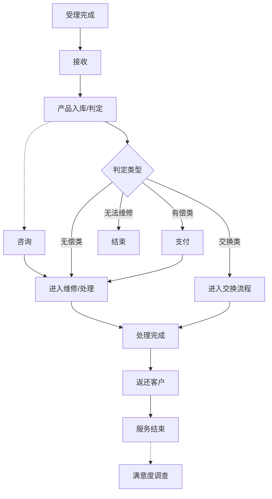
```mermaid
flowchart TD

A[受理完成] --> B[接收]
B --> C[产品入库/判定]

C --> D{判定类型}
C -.-> N[咨询]
N --> F[进入维修/处理]

D -->|有偿类| E[支付]
D -->|无偿类| F
D -->|交换类| G[进入交换流程]
D -->|无法维修| H[结束]

E --> F
F --> J[处理完成]
G --> J

J --> K[返还客户]
K --> L[服务结束]
L -.-> M[满意度调查]
```

## 3.2 流程说明

客户可通过小程序或门店发起售后申请，系统统一创建工单，并按接收、检测、判定、处理、履约、完成的顺序推进。

根据判定结果，工单可进入维修、交换、合作厂家 / 3PL 处理，或直接结束（如无法维修等）。其中，有偿场景需先完成支付，再进入后续处理。

处理完成后，系统进入返还与交付阶段。客户签收或完成取件后，工单进入服务完成，并可继续进入满意度调查、问卷或回访流程。

整体流程可分为以下阶段：

**1）申请**  
客户通过小程序或门店发起售后申请，系统生成工单。

**2）接收与检测**  
产品完成寄送或接收后，进入接收与检测环节。

**3）判定与处理**  
系统根据检测结果进入维修、交换、外部处理或结束流程；如为有偿场景，需先完成支付。

**4）返还与交付**  
处理完成后，通过快递返还或门店取件完成交付。

**5）完成**  
客户签收或取件完成后，工单进入服务完成，并可继续进入满意度调查、问卷或回访流程。

系统可在接收完成、判定结果、支付状态、交付完成等关键节点触发客户通知。通知方式支持自动触发与人工发送，具体以业务配置为准。

## 3.3 关键分支流程

### 3.3.1 申请流程

客户可通过以下两种方式发起售后申请：

- 小程序申请（客户自行提交）
- 门店申请（门店协助提交）

申请完成后，系统生成工单，并进入收件流程。  
在进入维修流程前，客户可撤销申请。

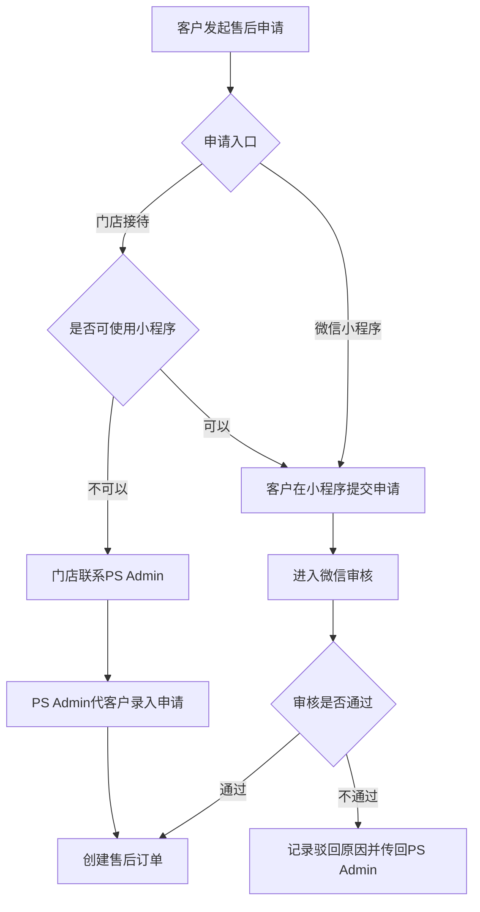
```mermaid
flowchart TD

A[客户发起售后申请] --> B{申请入口}

B -->|微信小程序| C[客户在小程序提交申请]
B -->|门店接待| D{是否可使用小程序}

D -->|可以| C
D -->|不可以| E[门店联系PS Admin]
E --> F[PS Admin代客户录入申请]

C --> G[进入微信审核]
G --> H{审核是否通过}

H -->|通过| I[创建售后订单]
H -->|不通过| J[记录驳回原因并传回PS Admin]

F --> I
```

### 3.3.2 产品收件流程

客户或门店发起售后申请并生成工单后，进入产品收件阶段。客户寄件时，需补充填写寄件快递公司及运单号；门店寄送场景下，也应由门店录入或补充寄件物流信息，并同步至 PS Admin，用于后续收件识别、工单匹配及物流跟踪。

维修中心在收件时，支持根据手机号、手机号后 4 位、快递单号、客户姓名、地址等信息快速查询待收货工单，并支持模糊检索，以提升高频收件场景下的操作效率。

当查询结果存在多个候选工单时，支持操作人员人工确认目标工单，并完成包裹与工单绑定。绑定完成后，系统自动生成内部条形码、自动分配维修单号，并将工单状态更新为“已收到受理”。

条形码标签支持首次自动打印；如因标签损坏、丢失或补打需要，系统也应支持操作人员后续手动打印。条形码编码规则应包含以下信息：

- 日期
- 当天顺序编号
- 客户手机号后四位

条形码除用于标识包裹外，还应用于后续操作场景。支持通过扫描条形码直接查询工单、跳转工单详情，并在指定录入场景中支持扫码后直接保存数据，以提升现场操作效率。

以下为收件流程图

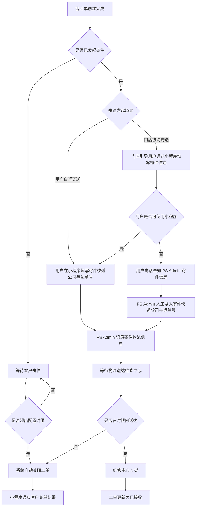
```mermaid
flowchart TD

A[售后单创建完成] --> B{是否已发起寄件}

B -->|否| C[等待客户寄件]
C --> D{是否超出配置时限}
D -->|是| E[系统自动关闭工单]
E --> F[小程序通知客户关单结果]
D -->|否| C

B -->|是| G{寄送发起场景}

G -->|用户自行寄送| H[用户在小程序填写寄件快递公司与运单号]
G -->|门店协助寄送| I[门店引导用户通过小程序填写寄件信息]

I --> J{用户是否可使用小程序}
J -->|是| H
J -->|否| K[用户电话告知 PS Admin 寄件信息]
K --> L[PS Admin 人工录入寄件快递公司与运单号]

H --> M[PS Admin 记录寄件物流信息]
L --> M

M --> N[等待物流送达维修中心]
N --> O{是否在时限内送达}

O -->|是| P[维修中心收货]
P --> Q[工单更新为已接收]

O -->|否| E
```

### 3.3.3 检测与判定流程

产品检测完成后进入判定阶段，系统根据检测结果确定后续处理方式，包括：
- 无偿维修
- 有偿维修
- 产品交换
- 他品交换
- 合作厂家处理
- 有偿_3PL
- 无法维修处理

系统根据判定结果向客户发送对应通知，告知处理方案及后续安排。

在“有偿_3PL”场景下，支付完成后仍需先进行 3PL 库存判断；若库存不足，则不可直接进入 3PL 发货流程，需进入等待补货或人工协调状态。

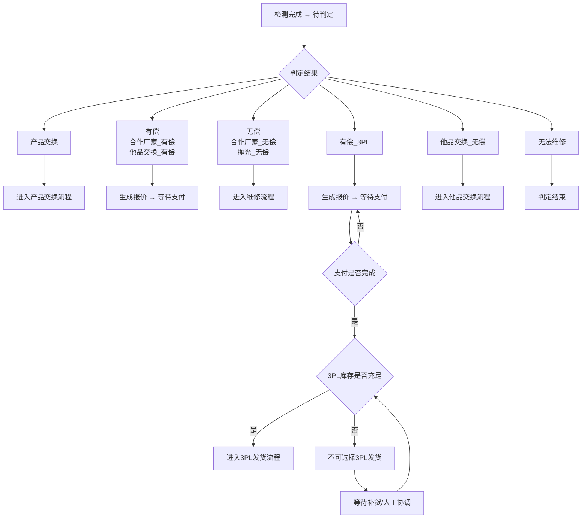
```mermaid
flowchart TD

B[检测完成 → 待判定] --> C{判定结果}

C --> D[产品交换]
C --> E[有偿<br/>合作厂家_有偿<br/>他品交换_有偿]
C --> F[无偿<br/>合作厂家_无偿<br/>抛光_无偿]
C --> G[有偿_3PL]
C --> H[他品交换_无偿]
C --> I[无法维修]

D --> J[进入产品交换流程]

E --> K[生成报价 → 等待支付]

F --> L[进入维修流程]

G --> M[生成报价 → 等待支付]
M --> N{支付是否完成}
N -->|是| O{3PL库存是否充足}
N -->|否| M
O -->|是| P[进入3PL发货流程]
O -->|否| Q[不可选择3PL发货]
Q --> R[等待补货/人工协调]
R --> O

H --> S[进入他品交换流程]

I --> T[判定结束]
```

### 3.3.4 咨询流程

在售后处理过程中，如存在需向客户补充说明、获取反馈或进行确认的事项，支持发起咨询事项，并记录处理过程。咨询事项默认不阻塞工单主流程推进。

以下场景可发起咨询事项：

- 维修方案说明或确认
    
- 费用变更说明或确认
    
- 他品交换说明或确认
    
- 异常情况说明
    
- 合作厂家维修延迟通知
    
- 产品状态确认
    
- 其他需客户补充反馈的信息。
    

系统发起咨询事项时，应记录咨询日期、咨询负责人、事项类型及事项状态。咨询完成后，记录处理结果，并更新事项状态；对超时未处理事项，支持后续跟进。

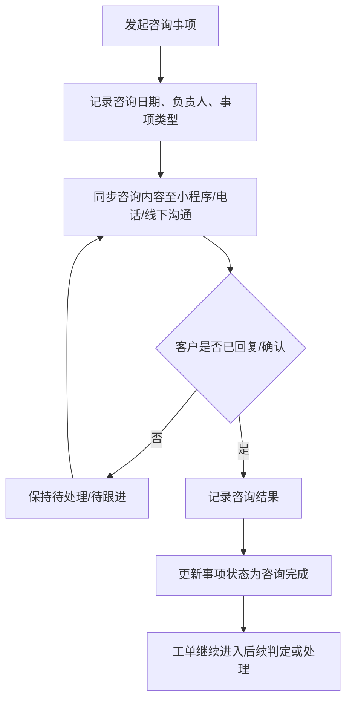
```mermaid
flowchart TD

A[发起咨询事项] --> B[记录咨询日期、负责人、事项类型]
B --> C[同步咨询内容至小程序/电话/线下沟通]

C --> D{客户是否已回复/确认}
D -->|否| E[保持待处理/待跟进]
E --> C

D -->|是| F[记录咨询结果]
F --> G[更新事项状态为咨询完成]
G --> H[工单继续进入后续判定或处理]
```

### 3.3.5 支付流程

当工单判定为有偿场景时，进入支付流程。PS Admin 依据价格规则生成待支付信息，并同步至小程序，由客户在小程序完成支付。支付完成后，小程序将支付结果回写至 PS Admin，由 PS Admin 更新支付状态、推进工单状态，并触发后续通知与处理。

支付流程中，PS Admin 负责待支付信息生成、支付状态管理及工单状态推进；小程序负责支付展示、客户支付操作及支付结果回写。工单状态以 PS Admin 为准，小程序仅负责展示与承接客户操作。

对于未支付场景，按统一催缴规则处理。催缴提醒以前期按日提醒为主，第 29 天发送最终提醒，第 30 天仍未支付时关闭工单。支付相关通知采用小程序与短信组合方式，覆盖待支付提醒、催缴提醒及支付完成通知等关键节点。

在取消处理方面，客户侧取消仅适用于维修开始前阶段。进入维修进行中及之后，不再提供客户侧取消入口；如需取消，转由后台人工处理。取消时需同步记录取消时间、取消原因、取消来源及处理结果；如存在未完成支付或需撤销的支付单，一并处理对应支付状态。

具体状态推进时点、催缴频次及关闭规则，统一参见 3.4《状态自动化规则》。

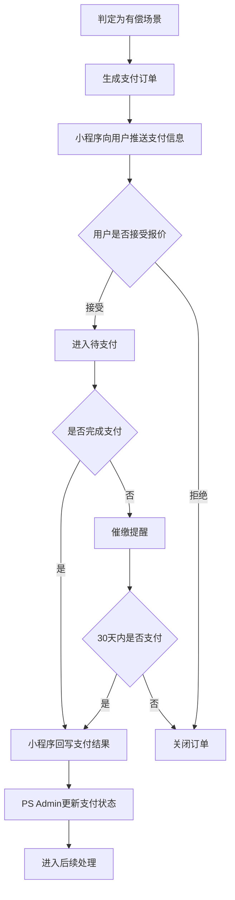
```mermaid
flowchart TD

A[判定为有偿场景] --> B[生成支付订单]
B --> C[小程序向用户推送支付信息]

C --> D{用户是否接受报价}
D -->|接受| E[进入待支付]
D -->|拒绝| F[关闭订单]

E --> G{是否完成支付}
G -->|是| H[小程序回写支付结果]
G -->|否| I[催缴提醒]

I --> J{30天内是否支付}
J -->|是| H
J -->|否| F

H --> K[PS Admin更新支付状态]
K --> L[进入后续处理]
```

### 3.3.6 维修执行流程
售后工单完成检测与判定后，进入维修处理阶段。根据工单类型、支付结果及库存情况，推进维修处理流程，并统一管理维修结果、库存处理及后续状态流转。

维修过程中，支持记录维修内容、确认所需配件或产品，并进行库存校验。  
如库存充足，工单进入正常维修处理；如库存不足，工单可进入“等待配件”状态，待配件到位后恢复维修流程。

维修完成后，支持提交维修结果，生成实际处理记录，并将工单推进至待出库或后续履约阶段。

客户仅可在进入维修前发起取消申请；进入维修进行中及之后状态后，如需取消，仅允许后台人工处理。

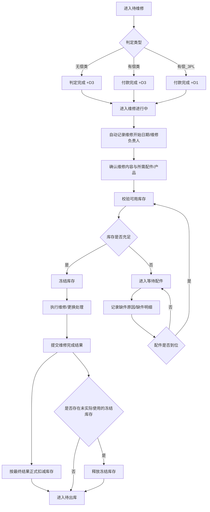
```mermaid
flowchart TD

A0[进入待维修] --> A1{判定类型}

A1 -->|无偿类| A2[判定完成 +D3]
A1 -->|有偿类| A3[付款完成 +D3]
A1 -->|有偿_3PL| A4[付款完成 +D1]

A2 --> A[进入维修进行中]
A3 --> A
A4 --> A

A --> B[自动记录维修开始日期/维修负责人]
B --> C[确认维修内容与所需配件/产品]
C --> D[校验可用库存]

D --> E{库存是否充足}
E -->|是| F[冻结库存]
F --> G[执行维修/更换处理]
G --> H[提交维修完成结果]
H --> I[按最终结果正式扣减库存]
I --> J[进入待出库]

E -->|否| K[进入等待配件]
K --> L[记录缺件原因/缺件明细]
L --> M{配件是否到位}
M -->|否| K
M -->|是| D

H --> N{是否存在未实际使用的冻结库存}
N -->|是| O[释放冻结库存]
N -->|否| J
O --> J
```

### 3.3.7 出库与履约流程

维修或处理完成后，工单进入出库与履约阶段。支持对待出库工单进行统一管理，并完成发货处理、物流信息同步及交付结果更新。

工单进入出库阶段后，支持维护发货信息、收货信息及履约备注，并根据业务需要执行后续发货处理。

发货处理可采用批次处理或人工处理方式。履约方式可包括普通物流及 3PL / WMS 场景。对于 3PL 场景，支持汇总待发货工单并进入后续履约处理。

发货完成后，记录并同步物流结果。对于已取得完整物流信息的场景，应向客户侧展示承运商及运单信息；对于暂未取得完整物流信息的场景，先同步发货状态，后续再补充更新物流信息。

工单发出后，进入配送或待交付阶段。客户签收或门店完成交付后，工单进入服务完成。

维修后退货不属于正常履约完成路径，应按退货退款相关流程另行处理。

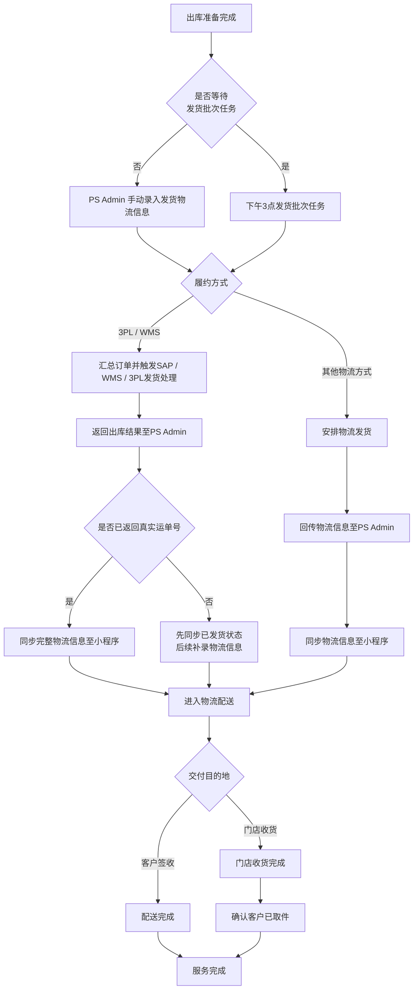
```mermaid
flowchart TD

A[出库准备完成] --> B{是否等待<br>发货批次任务}

B -->|否| C[PS Admin 手动录入发货物流信息]
B -->|是| D[下午3点发货批次任务]

C --> E{履约方式}
D --> E

E -->|3PL / WMS| F[汇总订单并触发SAP / WMS / 3PL发货处理]
F --> G[返回出库结果至PS Admin]

E -->|其他物流方式| H[安排物流发货]
H --> I[回传物流信息至PS Admin]

G --> J{是否已返回真实运单号}
I --> K[同步物流信息至小程序]

J -->|是| L[同步完整物流信息至小程序]
J -->|否| M[先同步已发货状态<br/>后续补录物流信息]

L --> N[进入物流配送]
M --> N
K --> N

N --> O{交付目的地}

O -->|客户签收| P[配送完成]
P --> S[服务完成]

O -->|门店收货| Q[门店收货完成]
Q --> R[确认客户已取件]
R --> S
```

### 3.3.8 问卷流程

工单进入“服务完成”后，系统自动生成问卷发放记录，并设置截止日期，并由小程序向客户展示与收集反馈。  
PS Admin 负责接收问卷结果并更新问卷及回访信息。

- 问卷由小程序展示和提交，PS Admin 仅生成记录；客户填写后，由小程序回写至 PS Admin。
- 提交后系统记录评分及反馈，并更新问卷状态；
- 超期未填写则问卷自动过期并关闭回访；
- 问卷与回访数据用于服务质量分析，不影响工单主状态；

### 3.3.9 流程的异常处理

支持对售后流程中的关键异常场景进行识别、记录、控制及人工介入处理，避免因支付异常、库存异常、物流异常、咨询超时、取消限制或数据异常导致流程中断、状态失真或业务悬空。

异常处理应遵循以下原则：

- 工单主状态由 PS Admin 统一控制，外部系统返回结果仅作为状态变更依据；
    
- 异常场景应优先进入明确状态或明确待处理结果，不允许流程悬空；
    
- 对于无法自动恢复的异常，支持人工介入，并保留完整处理记录；
    
- 关键异常处理应具备可追踪能力，包括异常时间、异常类型、处理人、处理结果及备注信息。

#### （1）主要异常类型

| 异常类型         | 处理原则                    | 处理结果            |
| ------------ | ----------------------- | --------------- |
| 支付失败 / 未支付   | 支持继续支付、催缴提醒或关闭工单        | 保持付款待机 / 未付款关闭  |
| 库存不足         | 不允许继续进入维修完成或后续出库流程      | 进入等待配件 / 人工协调   |
| 冻结库存未实际使用    | 应支持释放冻结库存               | 恢复可用库存          |
| 物流异常         | 记录异常信息并由人工跟进处理          | 保持当前履约状态 / 人工修正 |
| 3PL 物流信息不完整  | 先同步发货状态，必要时人工补录真实运单号    | 已发货 / 待补录物流信息   |
| 咨询超时 / 客户未确认 | 不阻塞主流程，但需保留待处理记录并支持人工跟进 | 保持咨询待机 / 人工处理   |
| 客户取消受限       | 进入维修进行中后，客户不可自行取消       | 转后台人工处理         |
| 数据异常 / 接口异常  | 记录异常日志并支持重试或人工修正        | 异常待处理 / 修正完成    |
| 维修后退货        | 不做库存回补，按退款链路处理          | 退货 / 退款处理中      |

#### （2）支付异常处理

当工单处于有偿场景且客户未完成支付时，支持催缴提醒及超时关闭机制。  
如支付失败、支付结果异常或支付回写失败，保留当前支付待确认状态，并支持通过补偿查询或人工处理修正最终支付结果。支付由小程序执行，异常情况下可由 PS 手工记录支付完成并备注。

对于长期未支付场景，按既定规则执行提醒及关闭，不允许工单无限期停留在付款待机状态。

#### （3）库存异常处理

当维修处理过程中发现配件或产品库存不足时，系统不应仅提示库存不足，而应阻断后续维修完成或出库推进，并支持工单进入**等待配件**状态。预计完成时间可人工修改且保留操作记录。

对于已确认需使用的配件或产品，先执行库存冻结；如后续未实际使用、取消或改判，应支持释放冻结库存。  
如库存异常来源于系统镜像库存与 SAP 账面库存不一致，支持进入库存差异处理流程，由人工确认原因并执行修正。

#### （4）物流异常处理

物流异常包括但不限于：

- 运单号缺失或回传失败
    
- 配送状态长时间未更新
    
- 客户临时修改收货地址
    
- 已发货但无真实承运单号
    
- 签收异常或退回异常。
    

对于普通物流异常，记录物流异常信息，并支持人工修正物流资料或人工跟进。

对于 3PL / WMS 场景，**真实运单号是否一定能回传仍需进一步确认**。因此支持以下兼容处理方式：

- 可接收真实运单号时，正常同步物流信息；
    
- 仅返回发货状态或内部单号时，先同步“已发货”状态；
    
- 后续如获得真实物流信息，应支持人工补录并同步展示。
    
#### （5）咨询与客户确认异常处理

咨询事项及客户确认事项属于流程旁路，不作为主状态推进的前置条件。  
当客户长时间未回复、未确认或咨询超时时，系统不应阻塞主流程，但应保留待处理记录，并支持后台人工跟进。

对于咨询异常，至少记录：

- 咨询发起时间
    
- 当前咨询状态
    
- 最近一次沟通记录
    
- 是否需人工跟进
    
- 跟进结果。
    

#### （6）取消异常处理

客户仅可在进入维修前通过小程序发起取消申请。  
一旦工单进入“维修进行中”及之后状态，客户侧不再提供取消入口；如需取消，仅允许后台人工处理。

系统对取消异常应支持记录：

- 取消来源（客户 / 后台）
    
- 取消原因
    
- 取消时间
    
- 操作人
    
- 处理结果
    

如取消时已存在支付单、冻结库存或物流处理信息，支持同步进入对应的后续处理逻辑。

#### （7）问卷与通知异常处理

问卷发放前，校验客户是否已完成个人信息同意；未满足条件时，不得自动推送问卷。

对于通知异常，支持以下处理：

- 小程序通知发送失败时保留失败记录；
    
- 关键提醒类场景可通过短信补充触达；
    
- 通知失败不影响工单主流程状态，但需支持后续重发或人工处理。
    

小程序授权推送次数受限，因此短信可作为催缴、最终提醒等场景的补充通道。

#### （8）数据与接口异常处理

当支付、库存、物流、问卷等协同接口调用失败，或返回结果异常时，支持：

- 记录接口请求与返回日志；
    
- 对可重试场景执行自动重试或补偿查询；
    
- 对不可自动恢复场景转入人工处理；
    
- 修正完成后回写处理结果并恢复业务流程。
    

对于关键业务数据异常，如状态未更新、库存未同步、物流未落账、支付结果不一致等，具备异常留痕、人工修正及结果追溯能力。

#### （9）维修后退货异常处理

维修后退货场景应按退款链路处理，不做库存回补，也不进入库存逆向处理逻辑。维修后退货的重点在于退货状态、退款状态及相关单据协同，而不是库存处理。

至少支持记录：

- 退货状态
    
- 退款状态
    
- 退款处理结果
    
- 相关单据编号
    
- 异常说明
    

## 3.4 状态自动化规则

为保证流程执行口径统一、减少人工操作偏差，支持基于状态的自动化处理机制。  
自动化规则包括状态推进、字段自动填写、库存处理、时间触发、通知触发及状态控制等内容。

### 3.4.1 状态自动化规则表

| 前置状态 / 场景    | 触发条件       | 系统自动动作                    | 目标状态 / 结果     | 备注           |
| ------------ | ---------- | ------------------------- | ------------- | ------------ |
| 收件匹配完成       | 包裹与工单绑定成功  | 自动生成条形码、自动分配维修单号、首次自动打印标签 | 已收到受理         | 支持后续手动补打     |
| 判定完成（有偿类）    | 判定完成 +D1   | 自动进入付款待机                  | 付款待机          | 自该状态开始执行催缴   |
| 付款待机         | 第 1～5 天未支付 | 每天自动提醒 1 次                | 保持付款待机        | 共 5 次        |
| 付款待机         | 第 29 天未支付  | 自动发送最终提醒                  | 保持付款待机        | 最终提醒         |
| 付款待机         | 第 30 天仍未支付 | 自动关闭工单                    | 未付款关闭         | 进入关闭路径       |
| 判定完成（无偿类）    | 判定完成 +D3   | 自动进入维修处理                  | 维修进行中         | 按工作日规则执行     |
| 付款完成（有偿类）    | 付款完成 +D3   | 自动进入维修处理                  | 维修进行中         | 按工作日规则执行     |
| 付款完成（有偿_3PL） | 付款完成 +D1   | 自动进入后续处理判断                | 维修进行中 / 3PL处理 | 需结合库存判断      |
| 维修处理中        | 确认需使用配件或产品 | 自动冻结对应库存                  | 已冻结待使用        | 防止重复占用       |
| 维修处理中        | 库存不足       | 自动或人工调整进入等待配件             | 等待配件          | 记录缺件信息       |
| 等待配件         | 配件到位并确认恢复  | 恢复维修流程                    | 维修进行中         | 支持人工确认恢复     |
| 发起咨询         | 点击发起咨询     | 自动写入咨询日期、咨询负责人、咨询状态       | 咨询待机          | 咨询为旁路，不阻塞主状态 |
| 维修开始         | 进入维修处理     | 自动填写维修开始日期、维修负责人          | 维修进行中         | 保留修改记录       |
| 维修处理中        | 修改预计完成时间   | 记录修改前后值、修改人、修改时间、修改原因     | 保持当前状态        | 人工修改留痕       |
| 维修完成提交       | 提交维修结果     | 生成实际消耗记录，并按最终结果执行正式扣减     | 待出库处理         | 未实际使用库存需释放冻结 |
| 服务完成         | 服务完成后      | 自动生成问卷发放记录并设置截止日期         | 问卷待回复         | 问卷由小程序展示     |
| 问卷待回复        | 截止日期到达且未提交 | 自动关闭问卷                    | 问卷已过期         | 不影响主流程       |

### 3.4.2 字段自动填写规则

系统支持以下字段自动填写或自动更新：

|字段名称|自动填写时点|说明|
|---|---|---|
|条形码编号|收件绑定完成时|自动生成|
|维修单号|收件绑定完成时|自动分配|
|判定负责人|进入判定或执行判定时|自动带入当前操作人|
|总部入库日期|收件完成时|自动记录|
|咨询日期|发起咨询时|自动记录|
|咨询负责人|发起咨询时|自动带入当前处理人|
|咨询状态|发起咨询时|默认置为咨询待机|
|付款完成日期|支付成功时|自动记录|
|维修开始日期|进入维修进行中时|自动记录|
|维修负责人|进入维修处理时|自动带入当前处理人|
|预计完成时间|进入维修处理时|按默认规则生成，允许人工修改并留痕|
|预计寄出时间|进入维修处理时|按默认规则生成，允许人工修改并留痕|
|等待配件时间|进入等待配件状态时|自动记录|
|缺件原因|进入等待配件状态时|由系统或人工填写|
|出库完成日期|完成出库处理时|自动记录|
|配送完成日期|物流签收时|自动记录|
|门店收货日期|门店确认收货时|自动记录|
|服务完成日期|自动进入服务完成时|自动记录|
|问卷发放日期|服务完成后|自动生成|
|问卷截止日期|问卷发放时|按配置自动生成|

### 3.4.3 条码规则

支持条码的生成、打印、识别及业务联动，具体规则如下：

1. 收件绑定完成后自动生成条码编号；
    
2. 条码编号规则应包含日期、当天顺序编号及客户手机号后四位；
    
3. 首次生成后自动打印条码标签；
    
4. 系统支持后续手动补打；
    
5. 支持通过扫描条码直接查询工单；
    
6. 支持通过扫描条码直接跳转工单详情；
    
7. 在指定录入场景中，支持录入完成后通过扫描条码直接保存数据。
    

### 3.4.4 状态控制规则

系统对关键状态设置控制规则，避免流程越级推进或业务口径不一致，具体如下：

1. 付款待机状态下，不允许直接进入维修进行中、维修完成、出库完成、配送完成等后续状态；
    
2. 未完成支付的有偿工单，不允许直接进入维修链路；
    
3. 在“维修进行中”前，客户可通过小程序发起取消申请；进入“维修进行中”及之后状态后，客户侧不再提供取消入口；如需取消，仅允许后台人工处理；
    
4. 咨询事项为流程旁路，客户确认结果不作为主状态流转前置条件；状态推进不依赖客户确认。
    
5. 库存不足时，不允许工单继续进入维修完成或后续出库流程，应进入等待配件或人工协调处理；
    
6. 已确认需使用的配件或产品，应先执行库存冻结；未实际使用时，应支持释放冻结库存；
    
7. 产品及配件消耗不得在预检阶段直接做正式扣减，应在维修完成提交后按最终结果执行正式扣减；
    
8. 问卷发放前，应校验客户个人信息同意状态；未满足条件时，不得自动推送问卷；
    
9. 自动化规则执行失败、批处理失败或数据未按规则更新时，记录异常日志并支持人工修正；
    
10. 无法恢复时，工单必须进入明确状态，不允许流程悬空。
    

### 3.4.5 时间规则说明

系统中涉及的 +D1、+D3、固定时点批处理、问卷截止时间及节假日排除等规则，应统一由系统配置管理。默认时间规则如下：

- 无偿类工单：判定完成后，工作日 +D3 进入维修进行中；
    
- 有偿类工单：付款完成后，工作日 +D3 进入维修进行中；
    
- 有偿_3PL 工单：付款完成后，工作日 +D1 进入维修进行中或进入 3PL 处理判断；
    
- 付款待机：前 5 天每日提醒 1 次；第 29 天发送最终提醒；第 30 天未支付自动关闭；
    
- 维修处理中，如库存不足，可随时进入等待配件状态；
    
- 服务完成后，系统自动生成问卷发放记录及截止日期；
    
- 问卷截止后未提交，自动置为问卷已过期；
    
- 预计完成时间、预计寄出时间等默认时效字段可由系统自动生成，也支持人工调整并保留操作记录。
    
**实施待确认**
关于预计完成时间、预计寄出时间、问卷截止日期及节假日排除等相关时效参数支持在系统配置中维护，并按最终确认的业务规则生效。

# 4. 外部系统协同说明

## 4.1 小程序

小程序作为客户侧交互入口，负责申请提交、状态展示、支付执行、问卷填写及咨询事项查看与反馈。  
PS Admin 负责工单创建、状态管理、业务控制及结果输出，小程序依据 PS Admin 返回的信息进行展示与操作承接。

主要职责：

- 用户提交售后申请
- 发起支付
- 查询工单状态
- 填写问卷

### 4.1.1 创建工单

工单由小程序或门店发起申请，由系统统一创建并生成工单编号，确保所有工单入口一致、数据规范统一，并由系统集中管理。

**职责划分**

| 角色          | 职责                           |
| ------------- | ------------------------------ |
| 小程序 | 收集客户信息并发起申请         |
| PS Admin      | 创建工单、生成编号、初始化状态 |

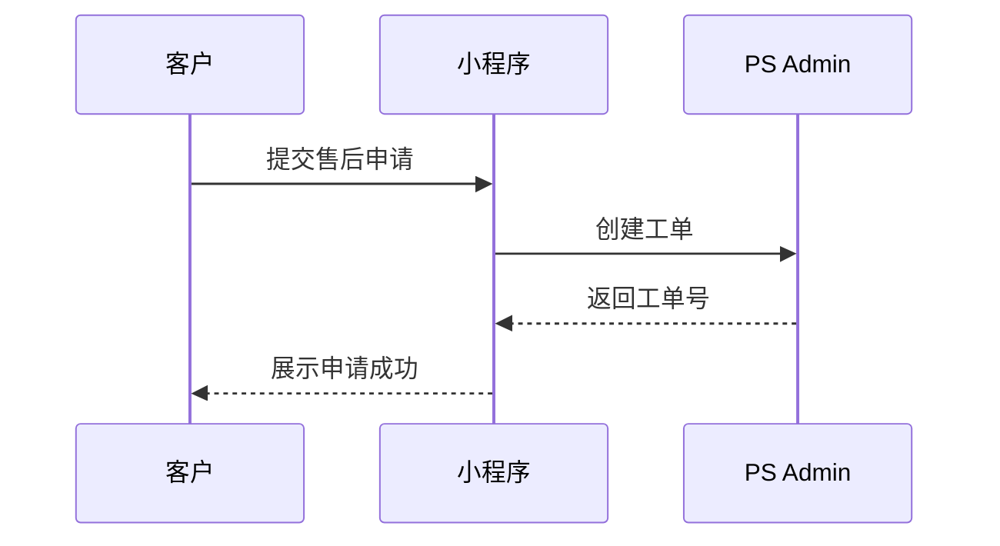
```mermaid
sequenceDiagram
    participant C as 客户
    participant M as 小程序
    participant A as PS Admin

    C->>M: 提交售后申请
    M->>A: 创建工单
    A-->>M: 返回工单号
    M-->>C: 展示申请成功
```

### 4.1.2 支付

PS Admin：负责支付订单生成、支付状态管理、工单状态驱动
小程序：负责支付展示、调用微信支付、接收支付结果并回写
微信支付：负责实际扣款与支付结果返回
系统采用 “支付回写 + 主动查询（补偿机制）”双保障机制，确保支付状态最终一致

PS Admin 提供待支付信息获取、支付结果回写接收，小程序方提供支付结果补偿查询能力，及异常修正协同。

**职责划分**

| 角色     | 职责                                     |
| -------- | ---------------------------------------- |
| 小程序   | 展示费用、发起微信支付、回写支付结果     |
| PS Admin | 生成支付订单、更新支付状态、推进工单流程 |

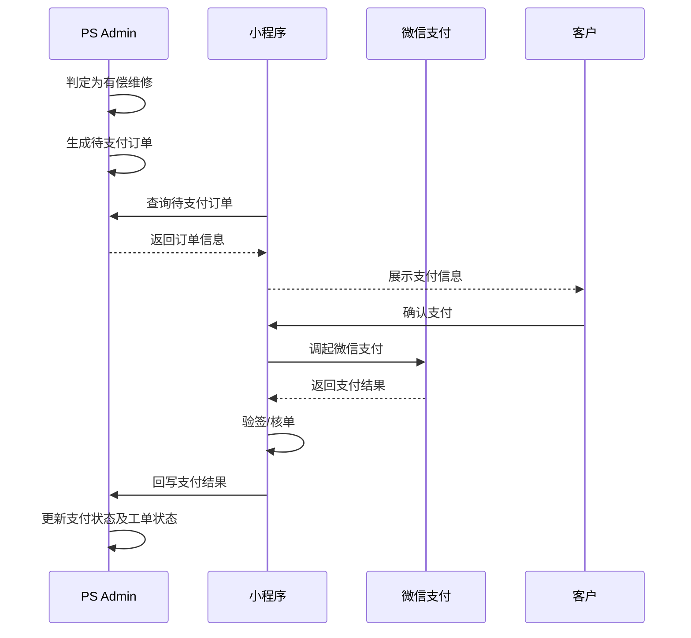
```mermaid
sequenceDiagram
participant A as PS Admin
participant M as 小程序
participant W as 微信支付
participant C as 客户

A->>A: 判定为有偿维修
A->>A: 生成待支付订单

M->>A: 查询待支付订单
A-->>M: 返回订单信息

M-->>C: 展示支付信息
C->>M: 确认支付

M->>W: 调起微信支付
W-->>M: 返回支付结果

M->>M: 验签/核单
M->>A: 回写支付结果

A->>A: 更新支付状态及工单状态
```

### 4.1.3 查询工单状态

工单状态由 PS Admin 统一管理，小程序负责查询与展示。  
小程序可在接收状态同步结果后更新本地展示，并在客户进入工单页面时再次向 PS Admin 查询最新状态，确保展示结果与后台处理结果一致，展示均以 PS Admin 返回结果为准。小程序不单独维护状态逻辑，也不对状态进行独立计算。

除状态结果外，PS Admin 同时返回当前状态下可执行的客户操作项，用于控制小程序页面中的可操作入口。  
例如，是否允许支付、是否允许取消、是否允许查看问卷、是否存在待处理咨询事项，均由 PS Admin 根据工单当前状态统一返回，小程序按返回结果进行展示、禁用或隐藏。

在关键业务节点发生变化时，PS Admin 向小程序同步最新状态结果，小程序按最新状态刷新页面展示及可操作项，保证客户侧显示与后台处理结果一致。

**职责划分**

|角色|职责|
|---|---|
|PS Admin|统一输出工单状态、状态说明及可操作项|
|小程序|查询并展示工单状态，按返回结果控制页面操作入口|
|客户|查看工单进度并在允许范围内完成后续操作|

**处理要求**

1. 工单状态口径以 PS Admin 为准；
2. 小程序展示的状态说明由 PS Admin 返回；
3. 小程序中的可操作项按工单当前状态动态控制；
4. 关键状态变更后，小程序展示内容同步更新；
5. 不同状态下的客户操作权限保持一致口径，不单独在小程序侧维护规则。

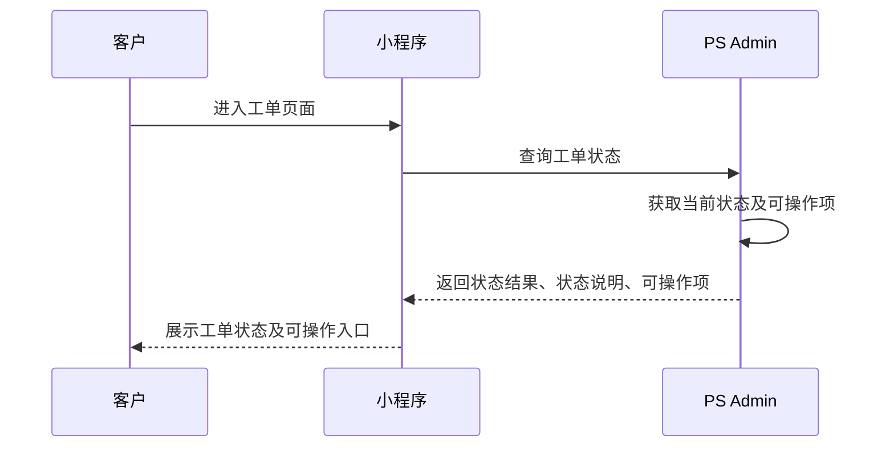
```mermaid
sequenceDiagram
    participant C as 客户
    participant M as 小程序
    participant A as PS Admin

    C->>M: 进入工单页面
    M->>A: 查询工单状态
    A->>A: 获取当前状态及可操作项
    A-->>M: 返回状态结果、状态说明、可操作项
    M-->>C: 展示工单状态及可操作入口
```

### 4.1.4 问卷调查

问卷由小程序展示并完成填写，PS Admin 负责问卷记录管理、结果接收及状态更新。  
问卷用于在服务完成后收集客户评价与反馈，相关结果与工单关联保存，用于后续查询、统计与服务分析。

问卷内容采用模板方式管理，支持单选、多选及文本输入，不支持图片上传类题型。不同业务场景可关联不同问卷模板，小程序根据下发内容进行展示，客户完成填写后回写结果至 PS Admin。

问卷推送前需校验客户个人信息同意状态。已满足同意条件时，按规则向客户发起问卷；未满足同意条件时，不发起问卷推送。

**职责划分**

|角色|职责|
|---|---|
|PS Admin|生成问卷记录、匹配问卷模板、接收问卷结果、更新问卷状态|
|小程序|展示问卷内容、承接客户填写与提交、回写问卷结果|
|客户|查看问卷并完成填写反馈|

**处理要求**

1. 问卷在服务完成后发起，并与对应工单关联；
    
2. 问卷内容按模板管理，不同场景可配置不同模板；
    
3. 问卷推送前校验个人信息同意状态；
    
4. 客户提交后，小程序将问卷结果回写至 PS Admin；
    
5. PS Admin 根据回写结果更新问卷状态及相关回访信息；
    
6. 问卷填写结果不影响工单主状态流转。
    

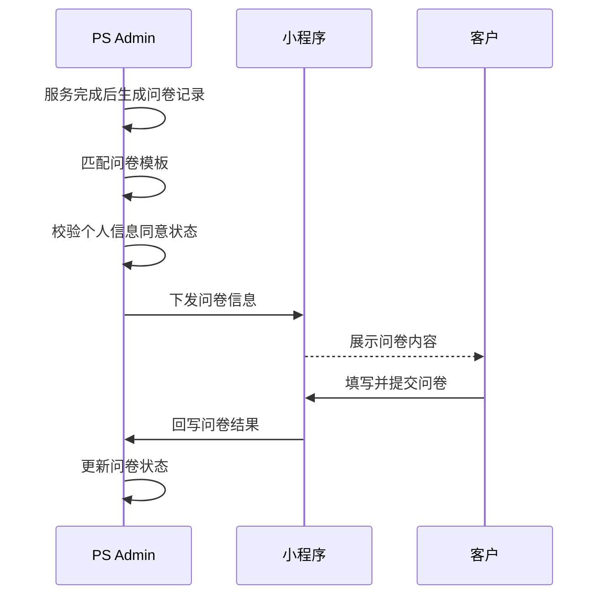
```mermaid
sequenceDiagram
    participant A as PS Admin
    participant M as 小程序
    participant C as 客户

    A->>A: 服务完成后生成问卷记录
    A->>A: 匹配问卷模板
    A->>A: 校验个人信息同意状态
    A->>M: 下发问卷信息
    M-->>C: 展示问卷内容
    C->>M: 填写并提交问卷
    M->>A: 回写问卷结果
    A->>A: 更新问卷状态
```

### 4.1.5 咨询事项与客户确认协同

小程序侧应支持 PS Admin 发起的咨询事项，并承接客户侧查看、回复、确认及结果反馈。  

当事项类型为客户确认时，小程序应支持客户查看确认内容并提交确认结果；如客户未在线确认，可通过电话或线下沟通后由后台补录处理结果。

其中，客户确认不单独作为一套独立流程建设，而作为咨询事项中的一种处理类型统一管理。PS Admin 负责事项发起、内容维护、状态记录与结果管理，小程序负责客户侧展示与交互承接，并将处理结果回写至 PS Admin。客户确认不作为主流程卡点，但相关事项必须支持查询、跟踪与人工跟进。

其中：
- **咨询事项**：用于异常说明、补充沟通、信息收集、进度说明、延迟通知及其他需客户知晓或反馈的场景；
- **客户确认**：作为咨询事项中的一种处理类型，用于需客户明确确认、拒绝或反馈结论的场景，如维修方案确认、费用变更确认、产品状态确认、换货方案确认等。

**职责划分**

|角色|职责|
|---|---|
|PS Admin|发起咨询事项、维护事项内容、记录事项状态、接收并处理客户反馈结果|
|小程序|展示咨询内容及客户确认内容，承接客户回复、确认或反馈，并回写处理结果|
|客户|查看咨询事项内容，完成回复、确认或结果反馈|

**处理要求**

1. PS Admin 应支持创建咨询事项，并与工单进行关联管理。
    
2. 咨询事项应支持配置事项类型，至少包括一般咨询、异常说明、进度通知、客户确认等类型。
    
3. 当事项类型为客户确认时，支持维护需客户确认的文字说明、图片信息及确认项内容，并同步至小程序展示。
    
4. 小程序应支持客户查看事项内容，并根据事项类型完成回复、确认、拒绝或补充反馈。
    
5. 客户提交处理结果后，小程序应将事项结果回写至 PS Admin。
    
6. PS Admin 应根据回写结果更新事项状态，并记录发起时间、回复时间、确认时间、处理结果及处理人。
    
7. 对于电话沟通、线下沟通等非小程序处理场景，PS Admin 亦应支持人工补录沟通结果，并统一纳入事项记录。
    
8. 咨询事项及客户确认事项默认不作为主流程阻塞节点，不因客户未确认而自动阻断工单主流程推进；如业务上需人工跟进，支持未处理事项查询、超时标记及后续跟进处理。
    
9. 支持查询已发起事项、待客户处理事项、已完成事项及超时未处理事项，便于后台统一跟踪与管理。

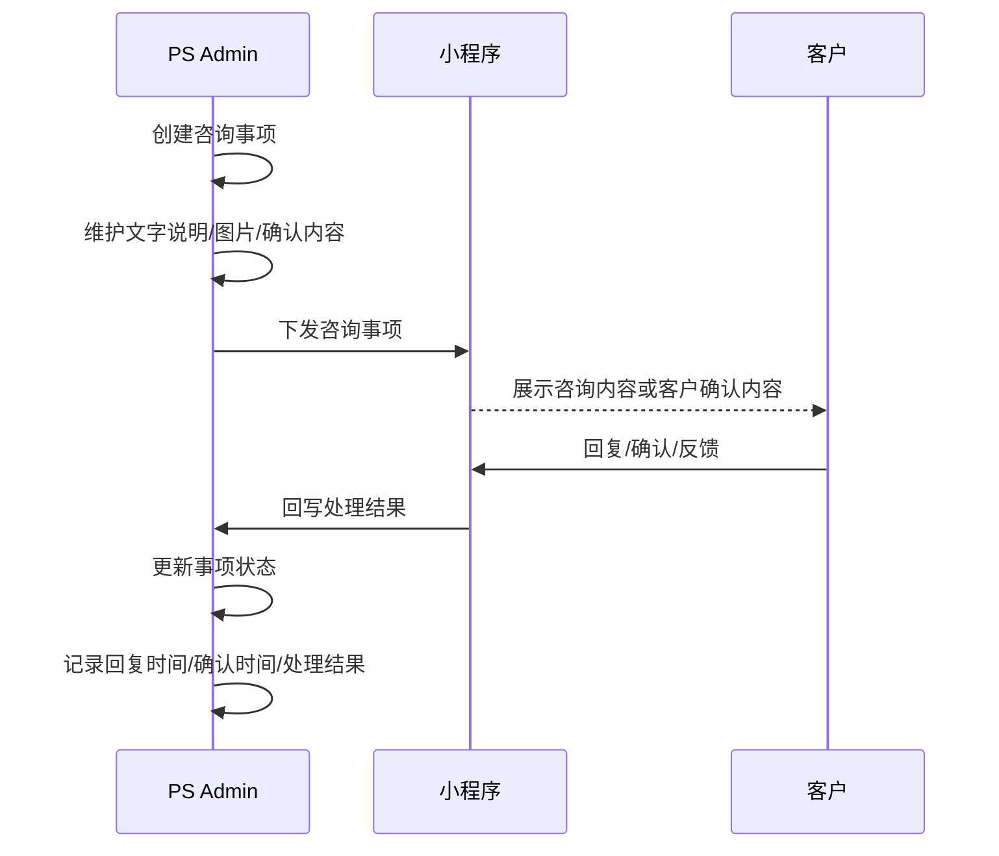
```mermaid
sequenceDiagram
    participant A as PS Admin
    participant M as 小程序
    participant C as 客户

    A->>A: 创建咨询事项
    A->>A: 维护文字说明/图片/确认内容
    A->>M: 下发咨询事项

    M-->>C: 展示咨询内容或客户确认内容
    C->>M: 回复/确认/反馈
    M->>A: 回写处理结果

    A->>A: 更新事项状态
    A->>A: 记录回复时间/确认时间/处理结果
```

## 4.2 SAP 协同

### 4.2.1 协同说明

在本项目中，PS Admin 作为售后工单管理核心系统，负责售后工单创建、状态流转、业务处理控制及与小程序侧的协同展示；SAP 主要负责提供产品基础数据、库存参照数据、价格基础数据，并承接 3PL 出库处理、交换出库、原品退回收货以及服务完成后的 SO 单据处理等相关业务协同。

双方通过基础数据承接、业务结果回传及差异校准，共同完成售后流程闭环。

其中，产品与库存相关数据在初始同步后，由 PS Admin 承接本地业务运行数据；SAP 后续数据主要用于差异识别、结果校验及相关业务协同，不直接作为页面展示结果或业务处理的实时唯一依据。

本章节主要说明 PS Admin 与 SAP 在售后业务中的协同内容，重点面向业务评审，不展开具体技术接口定义。

### 4.2.2 产品主数据同步

为保证售后业务具备统一的产品基础数据，PS Admin 在初始同步阶段接收 SAP 提供的产品主数据，作为系统初始化数据来源。

初始同步完成后，PS Admin 作为售后业务运行数据的承接系统，相关产品基础信息用于页面展示、工单识别及售后处理。SAP 后续提供的数据主要用于差异识别、结果校验及后续校准，不直接覆盖 PS Admin 当前页面展示结果，也不直接替代业务处理过程中的实时主数据口径。

当 PS Admin 本地承接数据与 SAP 数据存在差异时，应先进行差异识别与差异记录，再根据确认结果通过补录、调整或人工修正等方式完成数据校准，并保留处理留痕。

本节所述产品主数据主要用于支撑售后工单中的产品识别、产品展示及相关业务处理，确保产品基础信息口径统一、来源清晰、过程可追溯。

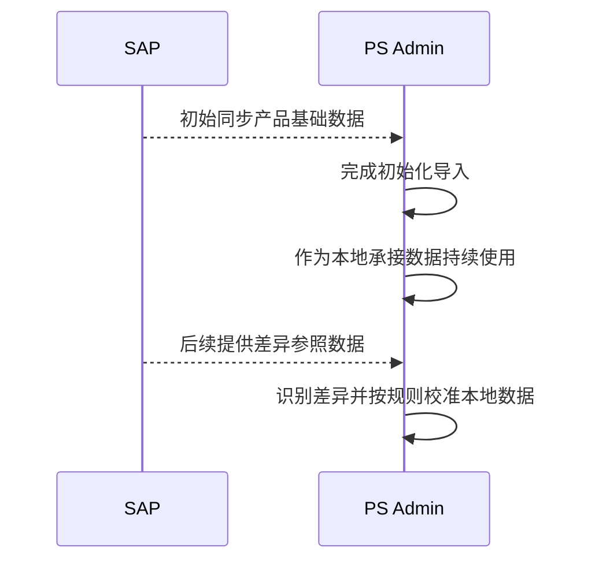
```mermaid
sequenceDiagram
    participant SAP as SAP
    participant PS as PS Admin

    SAP-->>PS: 初始同步产品基础数据
    PS->>PS: 完成初始化导入
    PS->>PS: 作为本地承接数据持续使用
    SAP-->>PS: 后续提供差异参照数据
    PS->>PS: 识别差异并按规则校准本地数据
```

### 4.2.3 产品库存同步与判断

在维修准备、维修执行、产品更换及他品交换等场景下，PS Admin 需根据系统当前库存结果判断后续业务是否可继续执行。

库存账务的参照口径以 SAP 为基础，但 PS Admin 在日常业务处理中，以本地承接的镜像库存及其计算结果作为页面展示与业务判断依据。初始同步完成后，SAP 后续数据不直接作为每次业务处理时的实时判断结果，而主要用于与 PS Admin 本地数据进行差异识别和校准。

此处“产品库存”主要包括：

- 主商品库存
    
- 零部件库存
    
当库存不足时，工单不可直接进入后续处理，需进入等待补货或人工协调状态，待库存满足后再恢复流程。

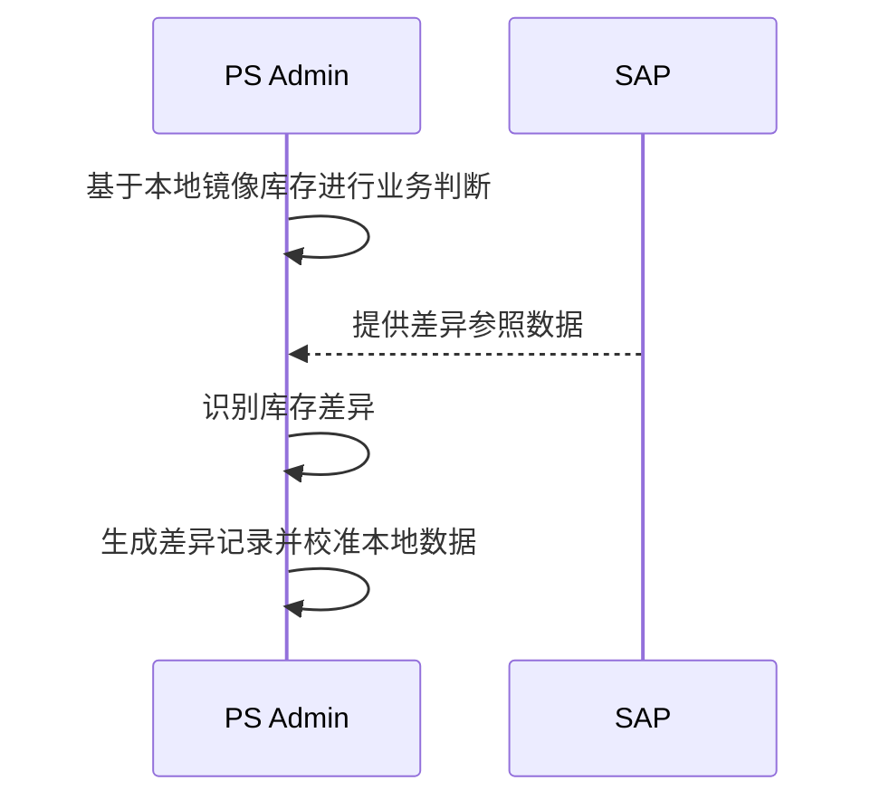
```mermaid
sequenceDiagram
    participant PS as PS Admin
    participant SAP as SAP

    PS->>PS: 基于本地镜像库存进行业务判断
    SAP-->>PS: 提供差异参照数据
    PS->>PS: 识别库存差异
    PS->>PS: 生成差异记录并校准本地数据
```

### 4.2.4 库存同步与差异处理机制

为兼顾库存参照一致性与售后业务处理效率，库存协同采用“**初始同步 + PS Admin 本地镜像库存 + 差异校准**”的处理方式。

初始同步阶段，由 SAP 提供售后业务所需的库存基础数据，作为 PS Admin 本地镜像库存的初始化基础。初始同步完成后，PS Admin 承接售后业务相关的重点库存数据，用于库存查询、业务判断、冻结占用、收货入库、业务出库及可用库存计算。SAP 后续数据主要用于对账参照、差异识别及结果校准，不直接覆盖 PS Admin 当前页面展示结果，也不直接替代业务处理过程中的实时判断结果。

PS Admin 承接的库存范围以售后业务涉及的重点库存为主，包括维修、更换、3PL 判断及相关出入库、调拨、收货处理所涉及的库存；不属于本次售后业务范围的其他库存，仍由 SAP 侧管理。

#### 4.2.4.1 处理原则

库存同步与差异处理遵循以下原则：

- 初始库存以 SAP 同步结果为基础；
    
- 库存参照口径以 SAP 为基础，业务处理口径以 PS Admin 本地镜像库存为准；
    
- SAP 后续数据主要用于差异识别与校准，不直接覆盖 PS Admin 当前库存结果；
    
- 本地镜像库存通过业务记录持续更新，不直接修改库存汇总结果；
    
- 发现差异后，先形成差异记录，再由相关人员确认原因并完成处理；
    
- 差异处理完成后，通过补录记录、调整记录或释放记录参与库存重新计算；
    
- 所有库存变化均应具备明确来源，并保留完整处理留痕。
    

#### 4.2.4.2 库存口径说明

为支撑库存判断与业务处理，系统区分以下库存口径：

|库存类型|说明|用途|
|---|---|---|
|SAP 原始库存|SAP 当前账面库存|作为对账参照口径|
|调拨中数量|已发起调拨、尚未完成入库的数量|反映在途库存|
|冻结库存|已占用、未实际出库或消耗的数量|避免重复分配|
|PS 本地库存|PS Admin 当前镜像库存结果|用于页面展示与业务处理|
|可用库存|在本地库存基础上，扣除冻结占用并结合在途及待使用情况形成的可分配库存|作为业务判断依据|

在维修、更换、他品交换、3PL 判断等场景下，以**可用库存**作为主要判断依据，不以单一账面库存直接控制业务处理。

#### 4.2.4.3 本地镜像库存更新方式

PS Admin 本地镜像库存以初始同步数据为基础，并基于实际业务记录持续更新，主要包括：

- 收货 / 入库记录；
    
- 出库记录；
    
- 调拨记录；
    
- 冻结记录；
    
- 释放记录；
    
- 差异处理后形成的补录记录或调整记录。
    

对于漏记入库、漏记出库、冻结未释放等场景，不直接修改库存汇总结果，而是通过新增对应业务记录参与库存重新计算。

#### 4.2.4.4 冻结与正式扣减规则

库存使用过程中，冻结与正式扣减分阶段处理，规则如下：

|阶段|处理要求|
|---|---|
|确认需占用库存时|先执行冻结|
|实际出库或实际消耗时|再执行正式扣减|
|未支付、取消或未实际使用时|释放冻结库存|

冻结用于预留库存资源，正式扣减用于反映实际消耗，二者分别处理，不混用。

#### 4.2.4.5 对账与差异处理要求

系统按配置规则定期执行库存对账，并支持在必要场景下手工发起补充对账。对账范围至少包括产品、仓库 / 库位及数量，必要时可扩展至冻结库存、可用库存等口径。

库存差异可能来源于漏记入库、漏记出库、冻结未及时释放、调拨与收货处理时点不一致、盘点差异或外部系统同步延迟等情况。对账发现差异后，按以下方式处理：

1. 生成差异记录；
    
2. 记录差异产品、差异位置、SAP 数量、PS 数量及差异数量；
    
3. 由相关人员确认差异原因及处理方式；
    
4. 根据处理结果形成补录记录、调整记录或释放记录；
    
5. 由结果记录参与本地镜像库存重新计算；
    
6. 差异处理完成后关闭差异记录，并保留处理留痕。
    

差异记录本身不直接修改库存结果，实际库存修正通过业务记录完成。

常见差异处理方式如下：

|差异原因|处理方式|
|---|---|
|少记入库|补录入库记录|
|少记出库|补录出库记录|
|冻结未释放|补录释放记录或冻结调整记录|
|盘点差异|生成库存调整记录|
|调拨未正确落账|补录调拨相关结果记录|

#### 4.2.4.6 调拨与收货协同要求

调拨与收货按单据闭环方式处理，不以单纯数量同步替代业务处理过程。具体包括：

- SAP 发起调拨后，将调拨单或调拨明细同步至 PS Admin；
    
- PS Admin 基于调拨信息生成待收货记录；
    
- 收货完成后形成对应入库记录；
    
- 调拨、收货及入库结果参与本地库存计算，并保留完整处理过程。
    

#### 4.2.4.7 库存不足后的业务处理

当库存不足时，不仅需要记录库存异常，还需同步影响后续业务处理。

在维修、更换、他品交换、3PL 判断等场景下，如当前可用库存不足，工单不进入后续处理或履约阶段，而是根据业务规则进入等待配件、等待补货、库存申请或人工协调等处理路径。

#### 4.2.4.8 待确认事项

以下内容需在后续项目推进中进一步确认：

1. 库存对账频率及补偿同步规则的最终配置方式；
    
2. 3PL / WMS 场景下是否存在独立的最终可发库存校验机制。
    

### 4.2.5 3PL 场景库存判断

在“有偿_3PL”场景下，客户支付完成后，PS Admin 需进一步确认当前 3PL 处理路径所需的库存是否满足发货或后续处理条件。

该场景下，业务判断以 PS Admin 当前承接的库存结果及可用库存计算结果为准。SAP 或其他外部系统后续提供的数据，主要用于差异识别、结果校验或后续校准，不直接作为主流程实时判断的唯一依据。

如库存充足，则进入后续 3PL 履约处理；如库存不足，则进入等待补货或人工协调状态。

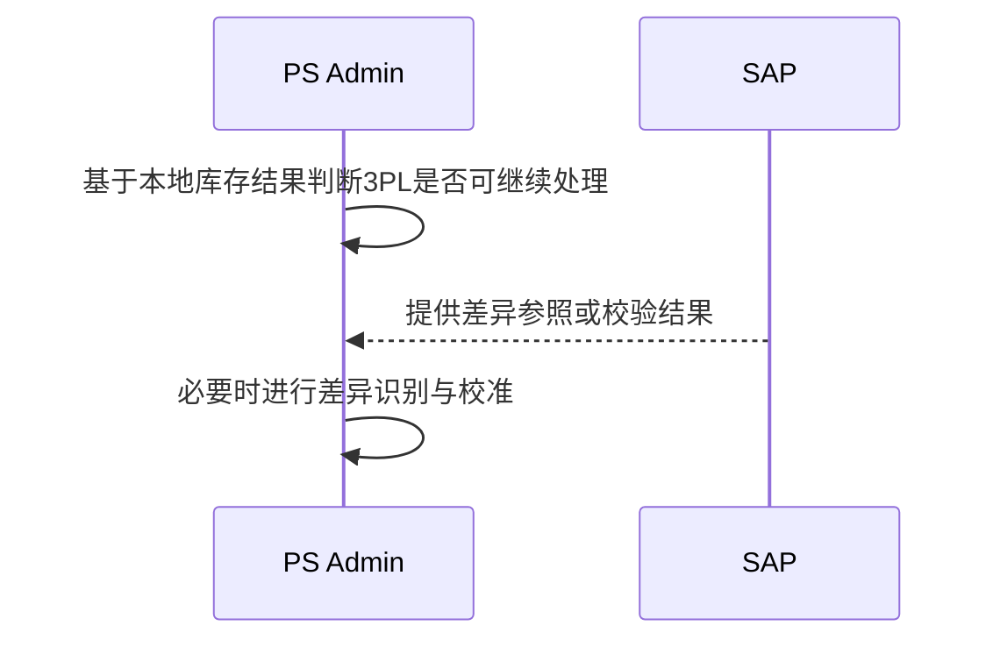
```mermaid
sequenceDiagram
    participant PS as PS Admin
    participant SAP as SAP

    PS->>PS: 基于本地库存结果判断3PL是否可继续处理
    SAP-->>PS: 提供差异参照或校验结果
    PS->>PS: 必要时进行差异识别与校准
```

#### 4.2.5.1 说明

在 3PL 场景下，库存判断的实现方式通常存在以下几种模式：

1. 由 PS Admin 基于本地承接库存直接完成业务判断；
2. 由 SAP 提供校验结果，作为 PS Admin 差异识别或结果复核依据；
3. 由 WMS / 3PL 提供实时库存结果，用于发货前的最终可发校验。

最终采用哪一种方式，应结合项目实施时的系统协同方案进一步确认。
    

### 4.2.6 产品价格获取与维修费用生成

当工单判定为有偿维修时，PS Admin 需依据 SAP 提供的产品价格基础数据，结合预设业务规则自动生成维修费用，用于后续报价与支付流程。

在该场景下：

* SAP 提供产品价格基础值
* PS Admin 按业务规则计算最终维修费用

系统支持维修费用生成依据统一，价格基础以 SAP 为准，最终报价由 PS Admin 负责生成。

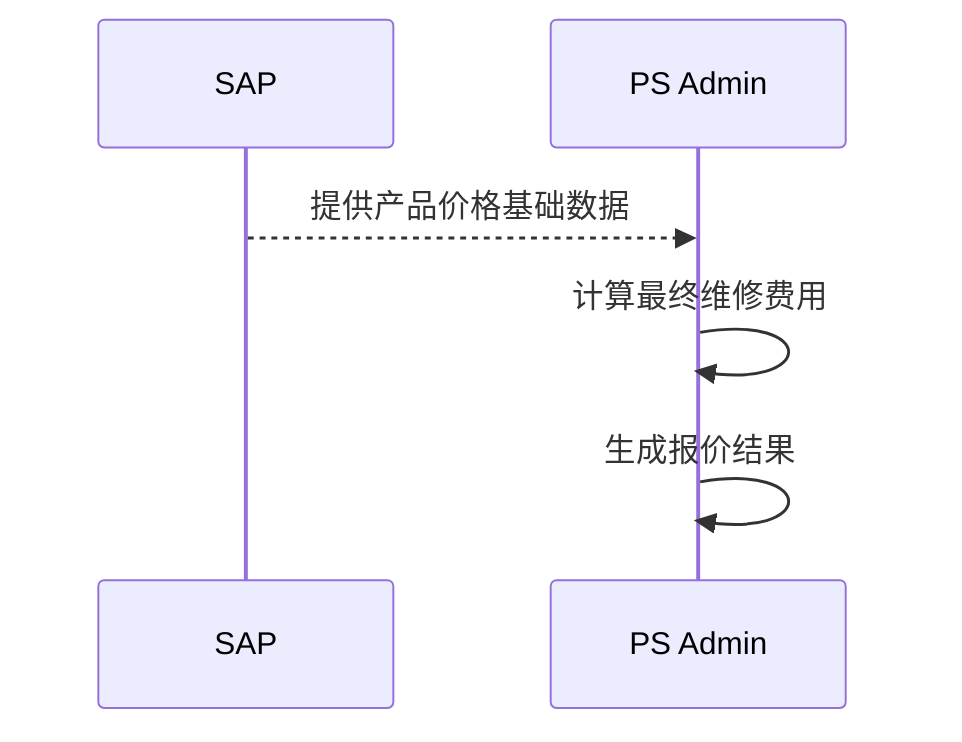
```mermaid
sequenceDiagram
    participant SAP as SAP
    participant PS as PS Admin

    SAP-->>PS: 提供产品价格基础数据
    PS->>PS: 计算最终维修费用
    PS->>PS: 生成报价结果
```

### 4.2.7 维修完成后的产品消耗同步

在维修完成后，PS Admin 需将本次维修实际消耗的产品信息同步至 SAP，由 SAP 统一完成库存扣减处理。

此处“产品消耗”统一覆盖：

* 维修更换件
* 产品替换消耗
* 其他实际使用的产品或配件

用于保证维修实际消耗与 SAP 库存数据保持一致。

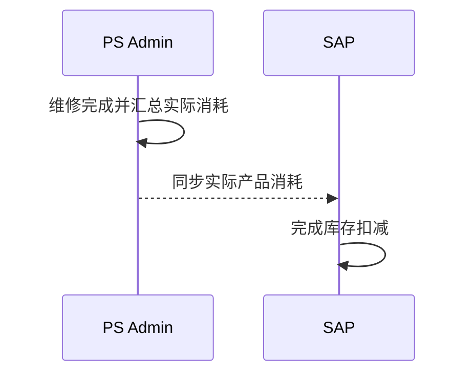
```mermaid
sequenceDiagram
    participant PS as PS Admin
    participant SAP as SAP

    PS->>PS: 维修完成并汇总实际消耗
    PS-->>SAP: 同步实际产品消耗
    SAP->>SAP: 完成库存扣减
```

### 4.2.8 库存不足后的产品申请与到货恢复

当维修过程中出现库存不足时，工单可能进入等待库存状态。此时，PS Admin 需发起产品申请，或接收相关处理结果，以便在产品到位后恢复维修流程。

本节所述“产品申请”统一覆盖：

* 更换件申请
* 替换用产品申请
* 其他维修相关物料申请

在产品到货或入库后，PS Admin 需据此更新工单状态，并恢复后续处理。

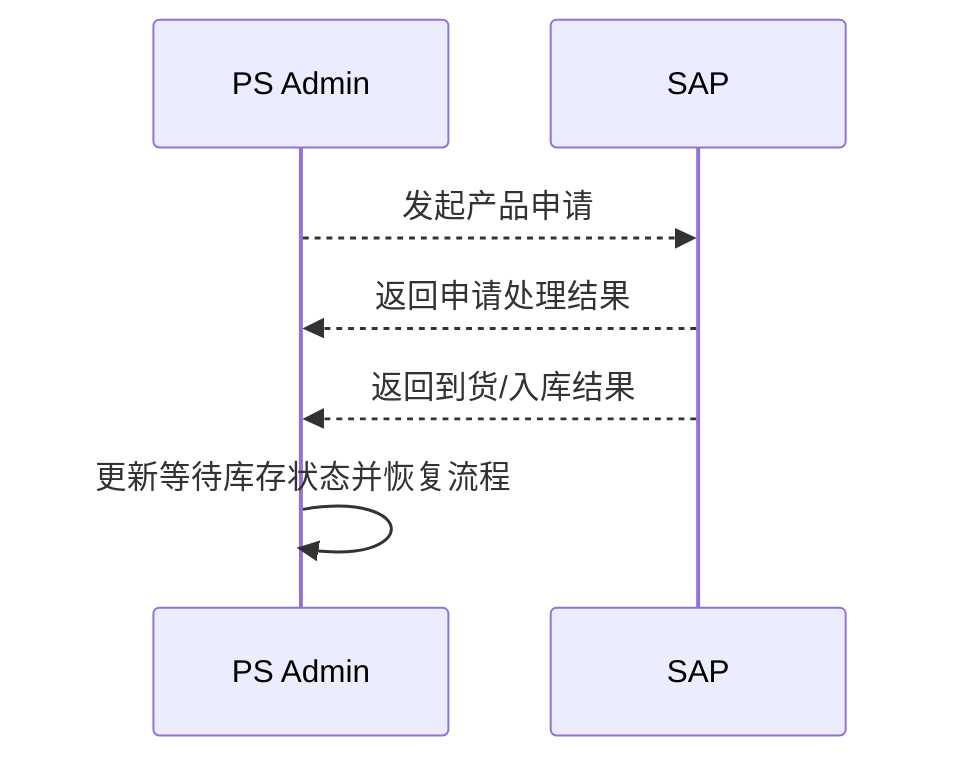
```mermaid
sequenceDiagram
    participant PS as PS Admin
    participant SAP as SAP

    PS-->>SAP: 发起产品申请
    SAP-->>PS: 返回申请处理结果
    SAP-->>PS: 返回到货/入库结果
    PS->>PS: 更新等待库存状态并恢复流程
```

### 4.2.9 3PL 发货单据处理（DO）

当工单满足 3PL 发货条件后，PS Admin 需通知 SAP 生成 DO 单据，由 SAP 推进后续 WMS / 3PL 发货处理。

PS Admin 需保存 DO 处理结果，用于后续履约跟踪。

主要用于 3PL 发货场景下的业务衔接，DO 为 SAP 侧出库处理单据。

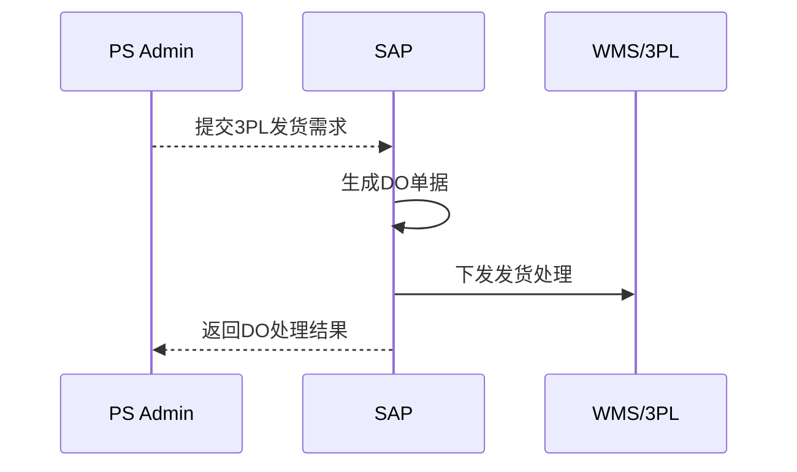
```mermaid
sequenceDiagram
    participant PS as PS Admin
    participant SAP as SAP
    participant WMS as WMS/3PL

    PS-->>SAP: 提交3PL发货需求
    SAP->>SAP: 生成DO单据
    SAP->>WMS: 下发发货处理
    SAP-->>PS: 返回DO处理结果
```

### 4.2.10 出库结果与物流信息同步

当 WMS / 3PL 完成发货后，相关出库结果及物流信息需同步至 PS Admin，用于更新工单发货状态、补充物流跟踪信息，并推进后续售后履约流程。

其中：

- **出库结果**主要用于确认是否已完成发货、是否可进入后续履约阶段；
    
- **物流信息**主要用于补充承运商、运单号、发货时间等履约跟踪信息，便于后续查询与展示。
    

PS Admin 应根据接收结果统一更新工单发货状态及物流信息。  
如仅返回出库状态而未返回真实运单号，系统仍应先完成发货状态同步；如后续可补充真实运单号，则应支持继续更新物流信息。

目前 3PL 运单号返回方式尚需进一步确认，以及是否能够稳定返回真实运单号，现阶段可按以下三种情况理解：

1. **3PL / WMS 直接回传至 PS Admin**  
    发货完成后，3PL / WMS 直接向 PS Admin 返回承运商、真实运单号、发货时间等物流信息。
    
2. **3PL / WMS 先回传 SAP，再由 SAP 同步至 PS Admin**  
    发货完成后，3PL / WMS 先将物流信息返回给 SAP，再由 SAP 统一同步给 PS Admin。
    
3. **仅返回发货状态，不返回真实运单号**  
    3PL / WMS 仅返回已发货状态或内部单号，无法返回可查询的真实物流运单号。此时 PS Admin 先同步发货状态，后续如业务需要，再由人工补录真实运单号。
    

```mermaid
sequenceDiagram
    participant WMS as WMS/3PL
    participant SAP as SAP
    participant PS as PS Admin

    WMS-->>SAP: 返回出库结果/物流信息
    SAP-->>PS: 同步出库结果/物流信息
    PS->>PS: 更新工单发货状态
    PS->>PS: 更新物流信息
```

### 4.2.11 交换出库

在产品交换或他品交换场景下，如需发出新产品，PS Admin 需通知 SAP 执行交换类出库处理，SAP 完成处理后将结果同步至 PS Admin。

PS Admin 根据该结果更新交换履约状态。

```mermaid
sequenceDiagram
    participant PS as PS Admin
    participant SAP as SAP

    PS-->>SAP: 提交换货出库需求
    SAP->>SAP: 执行交换类出库处理
    SAP-->>PS: 返回出库处理结果
    PS->>PS: 更新交换履约状态
```

### 4.2.12 服务完成后的 SO 回传

在服务完成后，SAP 生成 SO（销售订单）并进入后续处理流程。

当 SO 的所有条件中，**最后一个条件状态变更为“结束”时**，SAP 自动将 SO 单据编号发送至 PS Admin。PS Admin 保存该 SO 单据编号，用于工单闭环及后续查询。

本项目中，服务完成后的结算单据按 SO 进行处理。

```mermaid
sequenceDiagram
    participant PS as PS Admin
    participant SAP as SAP

    PS-->>SAP: 服务完成
    SAP->>SAP: 处理SO
    SAP->>SAP: 最后一个条件状态变更为“结束”
    SAP-->>PS: 返回SO单据编号
    PS->>PS: 保存SO编号
```

### 4.2.13 支付结果同步

在有偿维修、有偿_3PL、合作厂家有偿、他品交换有偿等场景下，客户完成支付后，PS Admin 除更新本地支付状态外，还需将最终支付结果同步给 SAP，用于后续财务处理与业务闭环。

用于保证支付结果与 SAP 后续单据处理保持一致。

```mermaid
sequenceDiagram
    participant MP as 小程序/支付侧
    participant PS as PS Admin
    participant SAP as SAP

    MP-->>PS: 回写支付结果
    PS->>PS: 更新工单支付状态
    PS-->>SAP: 同步支付结果
    SAP->>SAP: 进入后续处理
```

### 4.2.14 异常回退与单据冲销

当售后流程后续发生取消、异常回退或业务终止时，如前序已在 SAP 产生库存扣减、出库处理、SO 处理或其他相关业务结果，系统需支持与 SAP 协同完成相应的取消或冲销处理。

SAP 处理完成后，需将结果同步至 PS Admin，用于更新工单状态、单据状态及异常闭环记录。

主要用于确保售后异常场景下，PS Admin 与 SAP 的业务结果保持一致。

```mermaid
sequenceDiagram
    participant PS as PS Admin
    participant SAP as SAP

    PS-->>SAP: 提交取消/冲销处理需求
    SAP->>SAP: 执行取消或冲销
    SAP-->>PS: 返回处理结果
    PS->>PS: 更新工单与单据状态
```

### 4.2.15 协同异常处理说明

在库存、价格、出库、SO 回传或其他 SAP 协同场景中，如出现处理失败、结果延迟或状态不一致等情况，PS Admin 需保留相应异常状态，并支持后续人工跟进，避免工单流程中断或业务结果丢失。

主要用于保障异常场景下的业务连续性与数据一致性。

```mermaid
sequenceDiagram
    participant SAP as SAP
    participant PS as PS Admin
    participant A as 管理员

    SAP-->>PS: 返回异常结果或延迟处理
    PS->>PS: 记录异常状态
    A->>PS: 人工跟进处理
    PS->>PS: 更新最终结果
```

### 4.2.16 待确认事项

以下内容需在后续项目推进中进一步确认：

1. **3PL 运单号回传方式**
   当前暂按 3 种可能情况描述，最终需确认实际采用哪一种方式。

2. **部分异常回退场景的处理边界**
   如 SO 已进入处理后是否支持回退、已出库后的取消或冲销处理方式等，需结合 SAP 实际业务规则进一步确认。

## 4.3 物流系统协同

物流系统作为外部协同系统，主要负责售后过程中的寄件、运输、派送、签收及物流状态反馈，为 PS Admin 提供物流过程数据支持。

### 4.3.1 寄件与运输跟踪

客户或门店寄出产品后，物流系统负责运输，并将物流状态返回给 PS Admin。

```mermaid
sequenceDiagram
participant U as 客户 / 门店
participant A as PS Admin
participant L as 物流系统

U ->> A: 提交运单号
A ->> L: 查询物流状态
L -->> A: 返回物流状态
```

### 4.3.2 收货签收结果回传

产品到达后，物流系统返回签收结果，PS Admin 更新工单状态。

```mermaid
sequenceDiagram
participant L as 物流系统
participant A as PS Admin

L -->> A: 回传签收结果
A ->> A: 更新工单状态
```

### 4.3.3 维修完成后的发货协同

维修完成后，PS Admin 记录发货信息，物流系统执行后续派送，并返回物流结果。

```mermaid
sequenceDiagram
participant A as PS Admin
participant L as 物流系统

A ->> L: 提交发货信息
L -->> A: 返回运单号 / 发货结果
A ->> A: 更新物流信息
```

### 4.3.4 物流异常反馈

发生延误、丢件、拒收等异常时，物流系统返回异常信息，PS Admin 记录并处理。

```mermaid
sequenceDiagram
participant L as 物流系统
participant A as PS Admin

L -->> A: 回传异常信息
A ->> A: 记录异常并处理
```

## 4.4 通知协同

通知协同包括小程序通知、短信通知、邮件通知三类渠道，并根据不同业务节点选择合适的通知方式。  
其中，小程序通知适合承接状态更新、支付操作、问卷邀请等轻量提醒；短信通知适合承接受理成功、支付催缴、发货、到店提醒等关键触达场景；邮件通知适合承接判定结果、处理方案、门店指引等内容较完整的正式说明。现有通知设计中，短信已不应仅作为补充能力，而应作为关键节点通知的明确建设范围。

小程序通知仍作为客户侧主要交互入口，但由于小程序消息触达能力受用户授权机制限制，不能单独承担所有高频提醒场景。小程序一次授权后可推送次数有限，因此同步建设短信通知能力，用于补充关键节点触达，提升通知成功率和业务闭环能力。

### 4.4.1 各通知渠道定位

|通知渠道|适用场景|特点|
|---|---|---|
|小程序通知|状态更新、支付提醒、维修进度、发货进度、问卷邀请|适合轻量提醒，可直接跳转业务页面|
|短信通知|受理成功、支付催缴、支付完成、发货、到店提醒、关键异常通知|触达直接，适合关键节点通知|
|邮件通知|判定结果、处理方案、无法维修说明、取消说明、门店指引|信息完整，适合正式说明与留档|

### 4.4.2 综合通知策略

|业务节点|推荐方式|说明|
|---|---|---|
|工单受理完成|短信 + 小程序|作为首次确认通知，需确保客户及时知晓|
|判定结果通知|邮件 + 小程序|判定结果内容较多，邮件更适合承载详细说明|
|有偿维修待支付|小程序 + 短信|小程序承接支付操作，短信用于增强触达|
|支付催缴提醒|短信 + 小程序|催缴场景建议双通道提醒|
|支付完成|小程序 + 短信|用于通知客户已完成付款并进入后续流程|
|合作厂家维修延期|邮件 + 短信|延期说明通常需要较完整内容|
|无法维修|邮件 + 短信|属于关键结果通知，建议正式说明并强提醒|
|维修取消|邮件 + 短信|需明确取消原因及后续处理方式|
|出库发货|小程序 + 短信|发货状态建议及时触达，便于客户跟踪|
|发往门店|短信 + 小程序|到店类通知建议短信补充|
|门店到货 / 门店可取|短信 + 小程序|属于强提醒节点|
|门店取货完成|小程序|用于结果确认即可|
|问卷邀请|小程序|最适合在小程序内直接承接填写动作|
|门店信息指引|邮件|内容较长，适合邮件承载|

上述策略与当前文档中已形成的通知组合方向一致，其中短信在受理成功、支付催缴、发货、到店提醒等场景下均属于明确需求，不应仅保留为可选方案。

### 4.4.3 小程序通知

当工单在关键业务节点发生状态变化时，PS Admin 应根据通知规则匹配对应模板，并通过小程序向客户发送通知。小程序通知主要用于状态展示、支付提醒、进度更新及问卷邀请等场景，并作为客户进入后续操作页面的主要入口。  
小程序通知适合作为客户侧交互承载渠道，但不应作为关键通知的唯一触达方式。对于支付催缴、到店提醒、关键异常等场景，系统应结合短信通知共同使用。会议中已明确，小程序消息触达能力受授权次数限制，因此其更适合作为交互入口，而非全部关键提醒的唯一渠道。

```mermaid
sequenceDiagram
    participant A as PS Admin
    participant M as 小程序
    participant C as 客户

    A->>A: 识别工单状态变化
    A->>A: 匹配小程序通知模板
    A->>M: 发送通知内容
    M-->>C: 展示通知消息
    C->>M: 查看消息/进入工单页面
```

### 4.4.4 短信通知

短信通知为本项目的明确建设范围。系统应在受理成功、支付催缴、支付完成、发货、到店提醒及关键异常等场景下，通过短信向客户发送通知，并记录发送结果。  
短信通知的作用是补充小程序通知在关键节点的触达能力，确保重要消息能够及时送达。会议记录已明确提出，小程序一次授权后可推送次数有限，因此需建设短信能力并接入短信接口。

```mermaid
sequenceDiagram
    participant A as PS Admin
    participant S as 短信服务
    participant C as 客户

    A->>A: 识别关键通知节点
    A->>A: 匹配短信模板
    A->>S: 发送短信请求
    S-->>C: 发送短信
    S-->>A: 返回发送结果
    A->>A: 记录发送状态
```

### 4.4.5 邮件通知

当工单在关键业务节点需要向客户进行较完整说明时，系统应支持通过邮件向客户发送正式通知。邮件通知主要适用于判定结果、处理方案、无法维修说明、取消说明及门店指引等内容较长、说明较完整的场景。  
邮件通知侧重完整信息传达与正式留档，不作为高频即时提醒渠道。

```mermaid
sequenceDiagram
    participant A as PS Admin
    participant E as 邮件服务
    participant C as 客户

    A->>A: 识别需邮件通知场景
    A->>A: 匹配邮件模板
    A->>E: 发送邮件请求
    E-->>C: 发送邮件
    E-->>A: 返回发送结果
    A->>A: 记录发送状态
```

### 4.4.6 短信能力建设要求

为保障短信通知能力可落地，具备以下要求：

1. 配置短信模板，并按业务节点进行关联；
    
2. 调用短信服务接口完成消息发送；
    
3. 记录短信发送状态、发送时间、模板信息及回执结果；
    
4. 短信发送失败后的日志留痕；
    
5. 对于支付催缴、最终提醒、到店提醒等关键场景，短信与小程序组合触达；
    
6. 短信通知规则应纳入统一通知策略配置，不作为临时或人工补充方式。
    
**待确认事项**
短信通道的供应商选型、接口接入方式、模板审核与可配置范围，需在实施阶段结合实际供应商能力进一步确认。

# 5. 功能模块设计

本章节主要对系统各功能模块的页面字段、功能点及交互要求进行归纳说明，并与前述功能设计内容相对应。

本系统主要功能模块如下：

|模块名称|主要作用|备注|
|---|---|---|
|售后工单管理|统一管理售后工单全流程及相关信息||
|产品管理|管理产品基础资料、库存信息及库存变动记录||
|库存申请管理|管理产品库存申请、审批及处理||
|小零件管理|管理维修小零件基础资料及数量配置||
|小零件申请管理|管理小零件申请、审批及出库||
|问卷与回访管理|管理客户满意度问卷及回访信息||
|咨询管理|管理客户咨询及异常处理记录||
|用户权限|管理用户、角色与权限范围||

说明：

- 各模块围绕工单主线展开，并与支付、SAP、物流、小程序等系统协同。
    
- 模块之间通过统一工单编号及业务数据关联，形成完整业务闭环。
    

## 5.1 售后工单管理

本模块包括工单列表、工单详情、工单创建、工单编辑及相关业务操作入口，用于支撑售后工单全流程管理。

### 5.1.1 工单列表

用于展示工单数据列表，支持查询及操作。

**查询条件**

- 所有字段可进行搜索。
- 支持基础筛选与高级筛选展开方式
    

**操作按钮**

- 新建工单。
    
- 批量编辑可批量修改数据（状态、服务工程师）。
    
- Excel 导出。
    
- 删除工单
    
- 运单号/条形码打印
    

|字段名称|说明|展示方式|备注|
|---|---|---|---|
|工单编号|售后服务唯一标识|文本/链接|系统生成|
|接收日期|工单受理时间|日期||
|状态|工单所处流程状态|状态标签||
|本社入库日期|产品入库时间|日期||
|预计出库日期|预计完成时间|日期||
|受理渠道|来源|文本||
|客户姓名|客户名称|文本||
|联系电话|客户联系方式|文本||
|邮箱|客户邮箱|文本||
|产品名称|维修产品名称|文本||
|维修执行方|维修主体（总部 / 合作方 / 3PL）|文本||
|维修内容|维修项目|文本||
|挂号编号|物流单号 / 寄件编号|文本||
|付款日期|支付完成时间|日期时间||
|出库方式|配送方式|文本|快递 / 门店|
|出库完成日期|实际出库时间|日期时间||
|SO文件编号|关联 SAP 单据|文本||

### 5.1.2 工单详情

用于展示工单数据详情。

**操作按钮**

1. 条码打印
    
2. 库存申请
    
3. 工单复制时，客户、受理、咨询、产品信息需一并复制。
    
4. 复制工单中“原工单”字段需显示原工单编号。
    

#### （1）顶部信息

|字段名称|说明|组件类型|是否可编辑|备注|
|---|---|---|---|---|
|工单编号|售后服务工单唯一编号|只读文本|否||
|SO文件编号|关联 SAP SO 文件编号|只读文本|否|在 SO 的所有条件中，当最后一个条件的状态值变更为「结束」时，自动发送 SO 单据编号。|
|当前状态|工单当前流程状态|状态标签/只读文本|否||
|原工单编号|原始 / 关联工单编号|只读文本/链接|否||
|消息通知模板|通知消息模板|搜索下拉|是|具备模板搜索功能|
|电子邮件模板|邮件模板|搜索下拉|是|具备模板搜索功能|
|判定负责人|当前判定负责人|只读文本|否||

#### （2）客户信息

当收货类型为“门店”且收货信息为门店时，应同时显示门店地址地图。  
进行 3PL 出库并传输至 SAP、WMS 系统时，地址信息应为门店地址。

|字段名称|说明|组件类型|是否可编辑|备注|
|---|---|---|---|---|
|客户姓名|客户名称|输入框|是||
|电话号码|联系方式|输入框|是|可以手动修改|
|国家|客户国家|输入框/下拉|是||
|邮箱|邮箱地址|输入框|是||
|营销同意||单选/只读状态|视权限而定||
|隐私同意||单选/只读状态|视权限而定||
|收货类型|门店 / 快递|单选/下拉|是||
|收货地址|收货地址|地址输入框|是||

#### （3）受理信息

**说明**

- 官网受理的所有字段需与各对应字段联动。
    
- 中国区没有优惠券服务。
    

|字段名称|说明|组件类型|是否可编辑|备注|
|---|---|---|---|---|
|接收日期|受理时间|日期时间|是|接收日期为客户实际提交日期|
|受理渠道类型|门店 / 邮寄|单选/下拉|是||
|受理渠道|具体受理来源|下拉/输入框|是||
|受理门店|受理门店名称|下拉/搜索选择|是||
|是否再维修|是否重复维修|单选|是||
|是否紧急维修|是否加急|单选|是|当“是否再维修”为 Y 或维修内容为“产品更换”时，“是否紧急维修”自动更新为 Y。|
|是否有购买凭证|是否提供购买凭证|单选|是||
|是否附保修卡|是否提供保修卡|单选|是||
|购买日期|产品购买日期|日期|是||
|购买渠道|购买来源渠道|输入框/下拉|是||
|客户请求事项|客户反馈的具体内容|文本域|是|录入客户反馈内容|

#### （4）受理附件信息

**交互规则**

- 附件信息支持图片上传联动及图片生成/删除按钮。
    

|字段名称|说明|组件类型|是否可编辑|备注|
|---|---|---|---|---|
|文件名称|附件文件名称|只读文本|否||
|标题|附件标题|输入框|是||
|文件类型|附件类型|只读文本|否||
|文件大小|附件大小|只读文本|否||
|上传时间|附件上传时间|只读文本|否||
|上传人|附件上传人员|只读文本|否||
|修改时间|最近修改时间|只读文本|否||
|修改人|最近修改人员|只读文本|否||

#### （5）产品信息

|字段名称|说明|组件类型|是否可编辑|备注|
|---|---|---|---|---|
|产品名称|受理对象名称|只读文本/搜索选择|视场景而定|当受理对象为产品或配件时展示对应名称|
|产品ID|产品或配件唯一标识|只读文本|否|与主数据保持一致|
|类别|受理对象所属类别|下拉/只读文本|视场景而定|如产品、配件等；当客户订购配件时自动归类为“配件”|
|库存状态|当前库存状态信息|只读文本/状态标签|否|由主数据自动同步|
|上市日期|产品上市时间|只读文本|否|由主数据自动同步|
|生产工厂|当前工单使用的生产工厂信息|下拉框|是|若为双工厂生产，默认第一工厂，可通过下拉框手动修改。支持根据当前工单实际情况选择或补录，用于处理判断、查询及统计|
|电镀 / 焊接维修是否可行|是否支持电镀或焊接维修处理|单选/只读状态|视权限而定|用于辅助维修判定，可展示为Y/N|
|配件名称|对应配件名称|只读文本/搜索选择|视场景而定|当受理对象为配件或涉及配件时展示|
|配件存放位置|配件当前存放位置|只读文本|否|由主数据自动同步|

#### （6）咨询/确认信息

|字段名称|说明|组件类型|是否可编辑|备注|
|---|---|---|---|---|
|是否需要咨询|是否触发咨询流程|单选|是||
|咨询单号|咨询记录编号|只读文本/链接|否|点击跳转到咨询详情|
|外呼类型|外呼分类|下拉|是||
|产品状态确认图片|产品当前状态相关图片|图片上传/图片展示|是|外呼类型为微信小程序时显示|
|产品状态确认说明|产品状态文字说明|文本域|是|外呼类型为微信小程序时显示|
|咨询负责人|处理负责人|只读文本/选择器|视权限而定||
|咨询状态|待确认 / 已完成|状态标签/下拉|视权限而定||
|咨询日期|发起时间|日期时间|否||
|例外处理分类|咨询相关异常分类|下拉|是|维修费用/配送周期/同款产品更换/更换其他产品 /镜片补偿/折旧/产品退款/其他|

#### （7）维修信息

**规则说明**

1. SAP 拉取价格时自动标记为“有偿”。
    
2. 未拉取价格直接保存时默认“免费”。
    
3. 原为“有偿”后改为“免费”时，维修费用自动为 0，并取消价格判定。
    
4. 输入“问题现象”时，“是否产品问题”自动更新为 Y。
    
5. 选择再维修原因时，再维修与否自动变更为「Y」，并以下拉列表形式呈现。
    

|字段名称|说明|组件类型|是否可编辑|备注|
|---|---|---|---|---|
|总部入库日期|产品入库时间|日期|否||
|预计出库日期|预计完成时间|日期|是||
|现象|现象|输入框/只读文本|视场景而定|登录网站时，顾客选择的现象会自动绑定。|
|问题现象|问题现象|下拉列表|是|下拉列表|
|客户请求|客户需求|文本域|是||
|镜片类型|镜片类型|下拉/只读文本|视场景而定|官网受理的镜片类型需自动联动|
|维修处|维修执行地点|下拉/输入框|是||
|服务工程师|维修人员|选择器/下拉|是|可以更换|
|维修内容|维修方式|下拉|是|选择产品处理类型|
|更换其他产品型号|更换其他产品的实际型号|输入框/搜索选择|是|当维修内容选择“更换其他产品”时显示|
|维修进度日期|维修进度更新时间|日期时间|否|当状态变更为维修完成，自动填写维修完成日期|
|合作方出库日期|合作方出库时间|日期|是||
|合作方入库日期|合作方入库时间|日期|是||
|再维修原因|重复维修原因|下拉|是||
|是否产品问题|是否属于产品质量问题|单选|是||
|维修费用类型|有偿 / 无偿|单选/下拉|是||
|维修费用|百分比|数值输入框|是|基于销售价格的比例|
|维修参考事项|补充说明|文本域|是||

#### （8）支付信息

|字段名称|说明|组件类型|是否可编辑|备注|
|---|---|---|---|---|
|支付状态|待支付 / 已支付|状态标签/下拉|视权限而定|付款完成时，付款状态自动变更为「Y」。|
|支付日期|支付时间|日期时间|否|自动填写付款完成日期|
|支付方式|微信等支付方式|下拉/只读文本|视场景而定||
|支付授权号|支付授权编号|输入框/只读文本|视权限而定||
|支付流水号|支付凭证编号|输入框/只读文本|视权限而定||
|最终支付请求|最终支付请求标识|只读文本|否||
|支付截止日期|支付时限|日期|否|自入库日起自动计算并填写 D+29 日|
|支付链接|支付入口链接|只读文本/链接|否||
|是否取消支付|是否取消支付|单选|是|可手动取消支付|

#### （9）出库信息

|字段名称|说明|组件类型|是否可编辑|备注|
|---|---|---|---|---|
|是否出库完成|是否已发货|单选/状态标签|视权限而定||
|出库完成日期|发货时间|日期时间|否||
|配送方式|快递 / 门店|下拉|是||
|配送完成情况|配送完成状态|下拉/状态标签|视权限而定||
|配送日期|配送时间|日期时间|是||
|挂号编号|挂号编号|输入框|是||
|门店提货状态|门店提货状态|下拉/状态标签|视权限而定||
|门店提货日期|门店提货时间|日期时间|是||

#### （10）3PL 客户可见备注

在 3PL 场景下，工单详情中可维护客户可见备注，用于补充说明额外寄送物品或其他需客户知晓的信息。  
该备注由人工填写，并同步展示给客户。  
该字段仅用于说明展示，不参与物流处理及状态流转。

|字段名称|说明|组件类型|是否可编辑|备注|
|---|---|---|---|---|
|3PL 客户可见备注||文本域|是|该字段仅用于说明展示，不参与物流处理及状态流转。|

#### （11）库存申请按钮

**交互规则**

- 由点击顶部【库存申请】按钮打开。
    

|字段名称|说明|组件类型|是否可编辑|备注|
|---|---|---|---|---|
|申请负责人|提交申请的人员信息|只读文本|否|从工单中复制|
|产品名称|申请的产品名称|只读文本|否|从工单中复制|
|申请数量|本次申请的产品数量|数值输入框|是|默认为1|
|申请原因（大类）|申请原因一级分类|下拉|是|如：维修、补货、调拨等|
|申请原因（中类）|申请原因二级分类|联动下拉|是|依赖大类联动选择|

#### （12）库存预警与提醒

系统在工单详情页中提供库存预警提示，用于辅助操作人员在处理维修、产品更换、3PL 发货等场景时及时识别库存风险。

**展示位置**

1. 在工单详情页顶部显示工单级库存预警提示。
    
2. 在“库存申请”按钮附近可显示简要异常标识，如“库存不足”“3PL库存预警”。
    
3. 在涉及处理方式选择、3PL发货选择、配件选择等操作区域内，应再次展示对应库存信息及预警提示。
    

**提示规则**

1. 当选择 3PL 发货路径时，显示对应 3PL 库存数量。
    
2. 当库存低于预设阈值时，显示库存不足提醒。
    
3. 当库存为 0 或不满足当前处理条件时，阻止继续选择该处理路径，并提示需等待补货或改为其他处理方式。
    
4. 当库存恢复后，支持刷新最新库存结果，并允许继续后续操作。
    

**提示内容示例**

- 当前 3PL 库存不足，请确认是否调整处理路径。
    
- 当前无可用库存，无法选择 3PL 发货。
    
- 当前库存不足，可发起库存申请或等待补货。
    

### 5.1.3 生产工厂信息使用规则

工单关联产品后，自动带出对应的生产工厂信息。  
当产品仅对应单一生产工厂时，页面直接展示该工厂；当产品存在多个生产工厂时，默认带出第一工厂，并支持通过下拉方式切换当前使用工厂。

工单处理中可结合业务需要维护生产工厂，用于辅助工单分流、处理判断、查询筛选及统计分析。  
当业务处理中需要调整当前使用生产工厂时，可在权限范围内进行修改，并保留修改记录。

生产工厂信息在工单中的主要应用包括：

- 展示产品对应的生产工厂信息
    
- 选择当前使用生产工厂
    
- 按生产工厂进行工单筛选
    
- 按生产工厂维度统计工单数量、处理进度及维修结果。
    

## 5.2 产品管理

### 5.2.1 数据来源说明

产品管理模块中的产品及库存基础数据，以初始同步阶段接收的 SAP 数据为基础。

初始同步完成后，PS Admin 作为业务运行数据的承接系统，页面展示及业务处理所使用的产品与库存数据，均以本地数据为准，并通过收货、出库、调拨、冻结、释放及差异修正等业务记录持续更新。

SAP 后续提供的数据不直接覆盖 PS Admin 页面展示结果，也不直接作为业务处理的实时判断依据，而是作为对账参照来源，用于识别 SAP 与 PS Admin 之间的数据差异。发现差异后，系统生成差异单，并通过差异处理流程形成对应补录记录或调整记录，以完成数据校准。

产品管理模块重点承接产品基础信息展示与库存展示，不承担库存执行、差异修正及库存流水记录处理职责。相关库存执行结果及差异处理结果统一在库存管理模块中处理。

### 5.2.2 产品列表

**系统支持**

- 产品信息查询与筛选
- 条码 / 88码识别产品
- Excel 导入与导出
- 通过上传 Excel 文件批量修改数据
    1. 字段包括产品名称、产品 ID、存放位置
    2. 仅允许上传修改“存放位置”
- 库存状态查看
- 按产品信息进行业务查询与识别

产品列表用于展示产品基础信息及库存展示信息，不承接库存执行动作。出库、调拨、差异处理及库存记录查看统一在库存管理模块中完成。

|字段名称|说明|展示方式|备注|
|---|---|---|---|
|产品ID|产品唯一标识|文本||
|产品名称|产品名称|文本||
|产品类别|产品分类|文本||
|生产工厂1|生产来源|文本|工厂缺省时可手动选择工厂|
|生产工厂2|生产来源|文本|工厂缺省时可手动选择工厂|
|生产工厂3|生产来源|文本|工厂缺省时可手动选择工厂|
|上市日期|产品上市时间|日期||
|零件保有期限|维修配件保有周期|文本/日期||
|库存存放位置|库存位置|文本|可编辑维护|
|安全库存状态|库存是否低于阈值|状态标签|当系统当前库存数量少于5件时显示为“缺货”，5件及以上显示为“-”|
|PS库存数量|系统库存数量|数值||
|3PL库存数量|第三方库存数量|数值||

### 5.2.3 生产工厂信息维护

生产工厂信息作为产品基础信息的一部分进行展示和维护，用于标识产品可能对应的生产工厂来源，并为后续工单处理提供基础数据。  
产品信息中可保留多个生产工厂，用于展示产品对应的不同工厂来源。

当工厂信息缺失时，可在权限范围内补充选择。工厂信息采用标准列表方式维护，录入方式以下拉选择为主，不采用自由输入。

产品管理中的工厂信息主要用于：

- 展示产品生产工厂来源
    
- 为工单自动带出生产工厂提供基础数据
    
- 支持按工厂维度查询产品
    
- 支持后续统计分析。

## 5.3 库存管理

本模块用于承接售后处理及库存运营过程中产生的库存申请、出库执行、调拨处理、差异修正及库存同步记录等业务，支持库存流转全过程的记录、跟踪与追溯。  
库存基础数据来源于初始同步阶段承接的 SAP 数据，PS Admin 维护重点库存本地镜像，并通过业务记录与差异处理持续完成数据校准。

库存管理模块包括以下菜单：

- 申请单
    
- 库存记录
    
- 出库单
    
- 调拨单
    
- 差异处理
    
- 同步日志
    

### 5.3.1 申请单

申请单用于承接售后处理及库存运营过程中产生的补货、调拨、领用等库存需求，是库存业务处理的申请单据。  
申请单作为库存需求入口，用于规范库存申请、处理及执行过程，保证库存流转过程可记录、可追溯。

#### 5.3.1.1 功能描述

申请单用于统一记录库存申请、审批及处理过程，适用于以下场景：

- 门店申请产品库存
    
- 维修中心申请产品
    
- 产品库存调拨申请
    
- 仓库补货申请
    
- 售后工单处理中因库存不足而发起的库存申请
    

#### 5.3.1.2 触发条件

当业务处理中出现以下情况时，进入库存申请流程：

- 当前库存不足，无法直接支持后续处理
    
- 需要从其他库存位置进行补货或调拨
    
- 需要申请产品以支持维修、更换、出库等后续业务处理
    
- 业务人员在工单或库存管理场景中主动发起库存申请
    

#### 5.3.1.3 列表页

**系统支持**

- 所有字段均可搜索
    
- 进度状态可批量修改
    
- 处理时间和处理人默认为当天与操作负责人，可手动修改
    
- 支持导出列表数据
    
- 支持查看申请详情
    
- 支持根据处理结果生成出库单或调拨单
    

|字段名称|说明|展示方式|备注|
|---|---|---|---|
|申请单编号|当前库存申请单唯一编号|文本/链接|点击进入详情页|
|申请来源|申请来源业务场景|文本|如售后工单、门店申请、维修中心申请、仓库补货、调拨需求|
|来源单号|来源业务单号|文本|可为空|
|申请时间|申请提交时间|日期时间||
|申请人|申请发起人|文本||
|申请部门/门店|申请来源组织|文本||
|产品编码|产品唯一编码|文本||
|产品名称|产品名称|文本||
|申请数量|本次申请数量|数值||
|请求原因（大类）|一级原因分类|文本||
|请求原因（中类）|二级原因分类|文本||
|状态|当前申请处理状态|状态标签|如待处理、已批准、已拒绝、已完成|
|处理人|当前处理负责人|文本||
|处理时间|处理完成时间|日期时间||
|更新时间|最后更新时间|日期时间||

#### 5.3.1.4 详情页

|字段名称|说明|组件类型|是否可编辑|备注|
|---|---|---|---|---|
|申请单编号|当前库存申请单唯一编号|只读输入框|否|系统自动生成|
|申请来源|申请来源业务场景|下拉单选|是|售后工单、门店申请、维修中心申请、仓库补货、调拨需求、其他|
|来源单号|来源业务单号|输入框 / 搜索选择器|是|可为空|
|申请日期|申请提交日期|日期选择器|否|系统自动带出|
|申请人|当前申请负责人|只读输入框|否|系统自动带出|
|申请部门/门店|来源组织|只读输入框 / 搜索选择器|视场景而定||
|分类|申请所属分类|下拉单选|是|产品申请、补货申请、调拨申请、维修领用、其他|
|产品编码|产品唯一编码|输入框 / 搜索选择器|是||
|产品名称|申请产品名称|只读输入框|否|根据产品编码带出|
|申请数量|本次申请数量|数字输入框|是||
|请求原因（大类）|一级原因分类|下拉单选|是||
|请求原因（中类）|二级原因分类|联动下拉|是|根据大类联动|
|特殊事项|特殊处理事项|多行文本框|是|选填|
|备注|补充说明|多行文本框|是|选填|
|状态|当前申请处理状态|下拉单选|是|待处理、已批准、已拒绝、已完成|
|处理日期|处理日期|日期时间选择器|是||
|处理人|当前处理负责人|搜索选择器|是||

#### 5.3.1.5 处理逻辑说明

1. 业务人员发起库存申请，系统生成唯一申请单编号。
    
2. 系统记录申请信息，包括申请人、产品、数量、原因、备注等内容。
    
3. 申请进入处理流程，由处理人进行审批或处理。
    
4. 处理通过后，可根据实际业务进入出库单或调拨单执行流程。
    
5. 执行完成后，系统自动生成对应库存记录。
    
6. 系统更新申请单状态，并记录处理人、处理时间及处理结果。
    

### 5.3.2 库存记录

库存记录用于统一记录入库、出库、调拨、调整、冻结、释放及差异补录等库存变动结果，并作为本地镜像库存计算与追溯依据。  
库存变化应通过业务记录驱动更新，不直接修改库存汇总结果。

#### 5.3.2.1 列表页

**系统支持**

- 支持按交易编号、记录类型、产品编码、产品名称、仓库/位置、业务来源、操作时间进行查询
    
- 支持查看库存变动明细
    
- 支持按业务来源跳转对应业务单据
    
- 支持导出列表数据
    

|字段名称|说明|展示方式|备注|
|---|---|---|---|
|交易编号|库存业务记录唯一编号|文本/链接|点击进入详情页|
|记录类型|库存变动类型|文本|如入库、出库、调拨调出、调拨调入、冻结、释放、补录入库、补录出库、库存调整|
|产品编码|产品唯一编码|文本||
|产品名称|产品名称|文本||
|仓库/位置|本次变动所在仓库或库位|文本||
|变动数量|本次库存变动数量|数值|正数或负数|
|变动方向|本次库存变化方向|文本|增加、减少、冻结、释放|
|变动前数量|变动前库存数量|数值||
|变动后数量|变动后库存数量|数值||
|业务来源类型|来源业务类型|文本|如出库单、调拨单、差异处理、申请单|
|来源单号|来源业务单号|文本/链接|点击跳转对应业务单据|
|操作时间|记录生成时间|日期时间||
|操作人|操作人|文本||
|备注|补充说明|文本||

#### 5.3.2.2 详情页

|字段名称|说明|组件类型|是否可编辑|备注|
|---|---|---|---|---|
|交易编号|库存业务记录唯一编号|只读输入框|否|系统自动生成|
|记录类型|库存变动类型|下拉单选|是|入库、出库、调拨调出、调拨调入、冻结、释放、补录入库、补录出库、库存调整|
|产品编码|产品唯一编码|输入框 / 搜索选择器|是||
|产品名称|产品名称|只读输入框|否|根据产品编码带出|
|仓库/位置|本次变动所在仓库或库位|下拉单选 / 搜索选择器|是||
|变动数量|本次库存变动数量|数字输入框|是||
|变动方向|本次库存变化方向|下拉单选|是|增加、减少、冻结、释放|
|变动前数量|变动前库存数量|只读输入框|否|自动带出|
|变动后数量|变动后库存数量|只读输入框|否|自动计算|
|业务来源类型|来源业务类型|下拉单选|是|出库单、调拨单、差异处理、申请单、其他|
|来源单号|来源业务单号|输入框 / 搜索选择器|是||
|操作时间|记录生成时间|日期时间选择器|是||
|操作人|操作人|搜索选择器|是||
|备注|补充说明|多行文本框|是||

### 5.3.3 出库单

出库单用于承接库存申请或业务处理后的实际出库执行，记录出库对象、数量、执行结果及物流/领用信息。  
出库单支持由上游业务单据生成，也支持在出库单列表页手工发起。

#### 5.3.3.1 列表页

**系统支持**

- 支持按出库单编号、来源单号、产品编码、产品名称、状态、出库时间、执行人进行查询
- 支持查看出库处理结果
- 支持跳转出库详情页
- 支持导出列表数据
- 支持在列表页手工发起出库（新建）
- 也支持由申请单、工单自动生成后进入本列表查看

|字段名称|说明|展示方式|备注|
|---|---|---|---|
|出库单编号|出库单唯一编号|文本/链接|点击进入详情页|
|业务来源类型|出库业务来源|文本|如申请单、售后工单、调拨单|
|来源单号|来源业务单号|文本|关联业务单据编号|
|出库类型|出库业务类型|文本|如维修领用、换货出库、门店补货|
|产品编码|产品唯一编码|文本||
|产品名称|产品名称|文本||
|出库数量|本次出库数量|数值||
|出库仓位|执行出库的库存位置|文本||
|接收方|本次出库接收对象|文本|如门店、客户、维修中心|
|状态|当前出库状态|状态标签|如待执行、执行中、已完成|
|出库时间|实际出库时间|日期时间||
|执行人|当前处理或执行人员|文本||
|更新时间|最后更新时间|日期时间||

#### 5.3.3.2 详情页

|字段名称|说明|组件类型|是否可编辑|备注|
|---|---|---|---|---|
|出库单编号|出库单唯一编号|只读输入框|否|系统自动生成|
|业务来源类型|出库业务来源|下拉单选|是|申请单、售后工单、调拨单、其他|
|来源单号|来源业务单号|输入框 / 搜索选择器|是||
|出库类型|出库业务类型|下拉单选|是|维修领用、换货出库、门店补货、调拨出库、其他|
|产品编码|产品唯一编码|输入框 / 搜索选择器|是||
|产品名称|产品名称|只读输入框|否|根据产品编码带出|
|规格/型号|产品规格信息|只读输入框|否|根据产品编码带出|
|出库数量|本次出库数量|数字输入框|是||
|单位|数量单位|下拉单选|是|个、件、副、套|
|出库仓位|执行出库的位置|下拉单选 / 搜索选择器|是||
|接收方类型|接收对象类型|下拉单选|是|维修中心、门店、客户、3PL仓、其他|
|接收方|接收对象|输入框 / 搜索选择器|是||
|配送方式|配送方式|下拉单选|是|顺丰、门店自提、内部转运、无需配送|
|物流单号|物流单号|输入框|是|非必填|
|状态|当前出库状态|下拉单选|是|待执行、执行中、已完成、已取消、执行失败|
|出库时间|实际出库时间|日期时间选择器|是||
|执行人|出库执行人员|搜索选择器|是||
|执行说明|出库处理说明|多行文本框|是||
|备注|补充说明|多行文本框|是||

### 5.3.4 调拨单

调拨单用于管理不同仓库、库位、门店、维修中心之间的库存调拨过程。  
调拨单用于承接库存内部转移场景，业务上包含调出与调入两个动作，最终结果通过库存记录统一落账。  
调拨单支持由上游业务单据生成，也支持在调拨单列表页手工发起。

#### 5.3.4.1 列表页

**系统支持**

- 支持按调拨单编号、产品编码、产品名称、调出位置、调入位置、状态、申请时间、处理人进行查询
- 支持查看调拨处理结果
- 支持跳转调拨详情页
- 支持导出列表数据
- 支持在列表页手工发起调拨（新增）
- 也支持由申请单、差异处理自动生成后进入本列表查看

|字段名称|说明|展示方式|备注|
|---|---|---|---|
|调拨单编号|调拨单唯一编号|文本/链接|点击进入详情页|
|调出位置|调拨调出位置|文本||
|调入位置|调拨调入位置|文本||
|产品编码|产品唯一编码|文本||
|产品名称|产品名称|文本||
|调拨数量|本次调拨数量|数值||
|调拨类型|调拨业务类型|文本|如门店补货、维修调拨、3PL补货|
|状态|当前调拨状态|状态标签|如待调出、待调入、已完成|
|申请时间|调拨申请时间|日期时间||
|完成时间|实际完成时间|日期时间||
|处理人|当前处理人员|文本||
|更新时间|最后更新时间|日期时间||

#### 5.3.4.2 详情页

|字段名称|说明|组件类型|是否可编辑|备注|
|---|---|---|---|---|
|调拨单编号|调拨单唯一编号|只读输入框|否|系统自动生成|
|调拨类型|调拨业务类型|下拉单选|是|门店补货、维修调拨、3PL补货、库存回拨、其他|
|业务来源类型|调拨来源|下拉单选|是|申请单、售后工单、人工发起、差异处理、其他|
|来源单号|来源业务单号|输入框 / 搜索选择器|是||
|调出仓库/位置|调拨调出位置|下拉单选 / 搜索选择器|是||
|调入仓库/位置|调拨调入位置|下拉单选 / 搜索选择器|是||
|产品编码|产品唯一编码|输入框 / 搜索选择器|是||
|产品名称|产品名称|只读输入框|否|根据产品编码带出|
|规格/型号|产品规格信息|只读输入框|否|根据产品编码带出|
|调拨数量|调拨数量|数字输入框|是||
|单位|数量单位|下拉单选|是|个、件、副、套|
|申请时间|调拨申请时间|日期时间选择器|是||
|状态|当前调拨状态|下拉单选|是|待处理、待调出、待调入、已完成、已取消、处理失败|
|处理人|当前处理人员|搜索选择器|是||
|完成时间|调拨完成时间|日期时间选择器|是||
|调拨原因|调拨原因说明|多行文本框|是||
|处理说明|调拨处理说明|多行文本框|是||
|备注|补充说明|多行文本框|是||

### 5.3.5 差异处理

差异处理用于承接库存对账、盘点或业务核对过程中发现的库存差异，并对差异原因、处理方式及处理结果进行统一记录。  
差异处理页面不直接修改库存汇总结果，而是根据处理方式生成对应的库存记录，并由结果记录参与库存重新计算。  
差异处理完成后，应回写结果单号及结果状态，并支持跳转查看对应库存记录详情。

#### 5.3.5.1 列表页

**系统支持**

- 支持按差异单编号、差异类型、差异来源、产品编码、产品名称、状态、发现时间、处理人进行查询
    
- 支持查看差异处理进度及结果
    
- 支持跳转差异处理详情页
    
- 支持通过结果单号跳转对应库存记录详情页
    
- 支持导出列表数据
    

|字段名称|说明|展示方式|备注|
|---|---|---|---|
|差异单编号|差异处理单唯一编号|文本/链接|点击进入详情页|
|差异类型|差异所属业务类型|文本|如盘点差异、同步差异、冻结差异|
|差异来源|差异发现来源|文本|如盘点、SAP同步、出库复核|
|产品编码|产品唯一编码|文本||
|产品名称|产品名称|文本||
|仓库/位置|差异所在仓库或库位|文本||
|SAP数量|对账时 SAP 数量|数值||
|PS数量|对账时 PS 数量|数值||
|差异数量|差异结果数量|数值|系统自动计算|
|差异原因|差异原因判断结果|文本|如少记入库、少记出库、冻结未释放|
|处理方式|差异修正方式|文本|如补录入库记录、库存调整记录|
|结果单号|差异处理后生成的结果单号|文本/链接|点击跳转库存记录详情页|
|结果状态|结果记录当前执行状态|状态标签|如待执行、已完成、执行失败|
|状态|当前差异处理状态|状态标签|如待确认、处理中、已完成|
|发现时间|差异发现时间|日期时间||
|处理人|当前处理人员|文本||
|更新时间|最后更新时间|日期时间||

#### 5.3.5.2 详情页

详情页按“差异信息、原因判断、处理决策、处理结果”四部分展示。

##### （1）差异信息

|字段名称|说明|组件类型|是否可编辑|备注|
|---|---|---|---|---|
|差异单编号|差异处理单唯一编号|只读输入框|否|系统自动生成|
|差异类型|差异所属业务类型|下拉单选|是|盘点差异、同步差异、出库差异、入库差异、冻结差异、其他|
|差异来源|差异发现来源|下拉单选|是|盘点、SAP同步、出库复核、入库复核、冻结校验、人工发现|
|来源单号|来源业务单号|输入框 / 搜索选择器|是|非必填|
|产品编码|产品唯一编码|输入框 / 搜索选择器|是||
|产品名称|产品名称|只读输入框|否|根据产品编码带出|
|仓库/位置|差异所在仓库或库位|下拉单选 / 搜索选择器|是||
|SAP数量|对账时 SAP 数量|数字输入框|是||
|PS数量|对账时 PS 数量|数字输入框|是||
|差异数量|差异结果数量|只读输入框|否|自动计算|
|发现时间|差异发现时间|日期时间选择器|是||

##### （2）原因判断

|字段名称|说明|组件类型|是否可编辑|备注|
|---|---|---|---|---|
|差异原因|差异原因判断结果|下拉单选|是|少记入库、少记出库、冻结未释放、盘点差异、其他|
|处理人|当前处理人员|搜索选择器|是||
|处理时间|差异处理时间|日期时间选择器|是||

##### （3）处理决策
点击“生成结果记录”按钮后，系统根据处理方式自动生成对应库存记录，并回写结果类型、结果单号及结果状态。

|字段名称|说明|组件类型|是否可编辑|备注|
|---|---|---|---|---|
|处理方式|差异修正方式|下拉单选|是|补录入库记录、补录出库记录、补录释放记录、冻结调整记录、库存调整记录、人工确认无差异|
|修正数量|本次处理拟修正数量|数字输入框|是|默认可等于差异数量|
|处理说明|差异处理说明|多行文本框|是|用于说明本次处理方式及依据|

##### （4）处理结果
结果单号支持点击跳转至库存记录详情页，用于查看本次差异处理生成的实际库存结果记录。

|字段名称|说明|组件类型|是否可编辑|备注|
|---|---|---|---|---|
|状态|当前差异处理状态|下拉单选|是|待确认、待处理、处理中、已完成、已关闭|
|结果类型|差异处理结果类型|下拉单选|是|补录入库、补录出库、冻结调整、库存调整、无差异关闭|
|结果单号|差异处理后生成的结果单号|链接|否|点击跳转库存记录详情页|
|结果状态|结果记录当前执行状态|状态标签 / 只读输入框|否|如待执行、已完成、执行失败|
|备注|补充说明|多行文本框|是||

#### 5.3.5.3 处理逻辑说明

1. 系统按固定频率执行库存对账，发现差异后自动生成差异单并纳入待处理清单。
    
2. 处理人员在差异处理页中确认差异原因及处理方式。
    
3. 系统根据处理方式生成对应库存记录，并回写结果单号及结果状态。
    
4. 常见差异处理方式如下：
    
    - 少记入库 → 补录入库记录
        
    - 少记出库 → 补录出库记录
        
    - 冻结未释放 → 补录释放记录或冻结调整记录
        
    - 盘点差异 → 生成库存调整记录。
        
5. 结果记录参与库存重新计算，差异处理完成后关闭差异单，并保留处理记录。
    

### 5.3.6 同步日志

同步日志用于记录 SAP 与 PS Admin 的库存同步结果，包括同步任务状态、影响范围、异常原因及处理结果。  
库存同步与差异处理机制要求支持定时对账，并在发现差异后进入差异处理流程。

#### 5.3.6.1 列表页

**系统支持**

- 支持按同步批次号、同步对象、同步类型、状态、触发方式、开始时间、结束时间进行查询
    
- 支持查看同步任务执行结果
    
- 支持查看失败明细及异常摘要
    
- 支持导出列表数据
    

|字段名称|说明|展示方式|备注|
|---|---|---|---|
|同步批次号|同步任务唯一批次号|文本/链接|点击进入详情页|
|同步对象|本次同步对象|文本|如产品库存、价格主数据、库存冻结信息|
|同步类型|本次同步类型|文本|如全量同步、增量同步、补偿同步|
|开始时间|同步开始时间|日期时间||
|结束时间|同步结束时间|日期时间||
|状态|同步执行状态|状态标签|如执行中、执行成功、执行失败|
|成功数量|成功处理数量|数值||
|失败数量|失败处理数量|数值||
|差异数量|本次发现差异数量|数值||
|触发方式|同步触发方式|文本|如定时任务、手工触发|
|执行人/执行任务|任务执行主体|文本|如系统任务名或人工操作人|
|更新时间|最后更新时间|日期时间||

#### 5.3.6.2 详情页

|字段名称|说明|组件类型|是否可编辑|备注|
|---|---|---|---|---|
|同步批次号|同步任务唯一批次号|只读输入框|否|系统自动生成|
|同步对象|本次同步对象|下拉单选|是|产品库存、价格主数据、库存冻结信息、仓位信息、其他|
|同步类型|本次同步类型|下拉单选|是|全量同步、增量同步、补偿同步|
|触发方式|同步触发方式|下拉单选|是|定时任务、手工触发、补偿任务|
|开始时间|同步开始时间|日期时间选择器|是||
|结束时间|同步结束时间|日期时间选择器|是||
|状态|当前同步状态|下拉单选|是|待执行、执行中、执行成功、部分成功、执行失败|
|成功数量|成功处理数量|数字输入框 / 只读输入框|否|统计结果字段|
|失败数量|失败处理数量|数字输入框 / 只读输入框|否|统计结果字段|
|差异数量|差异数量|数字输入框 / 只读输入框|否|统计结果字段|
|来源系统|来源系统名称|输入框 / 只读输入框|否|默认 SAP|
|目标系统|目标系统名称|输入框 / 只读输入框|否|默认 PS Admin|
|执行任务名称|执行任务名称|输入框|是||
|执行人|执行人员|搜索选择器|是|定时任务场景可记录系统任务名|
|异常摘要|异常摘要说明|多行文本框|是||
|失败明细|失败明细内容|表格明细区 / 多行文本框|否||
|处理结果|本次同步处理结果说明|多行文本框|是||
|备注|补充说明|多行文本框|是||

## 5.4 小零件管理

本模块用于管理维修过程中使用的小零件基础资料、数量配置及展示信息，作为小零件申请、维修小零件使用及库存管理的基础数据来源。

### 5.4.1 数据来源说明

- 小零件基础信息由系统维护
    
- 小零件数量规则由系统配置维护
    

### 5.4.2 小零件列表

|字段名称|说明|展示方式|备注|
|---|---|---|---|
|小零件ID|小零件唯一标识|文本||
|小零件名称|小零件名称|文本||
|数量|默认数量值|数值||
|颜色|小零件颜色|文本||
|规格|小零件规格|文本||
|小零件存放位置|库存存放位置|文本|可编辑维护|

### 5.4.3 小零件详情

|字段名称|说明|组件类型|是否可编辑|备注|
|---|---|---|---|---|
|数量类型|数量配置类型|下拉|是|如门店、维修、3PL等场景|
|数量名称|数量配置名称|输入框|是||
|默认数量|默认申请或使用数量|数值输入框|是||
|排序|显示顺序|数值输入框|是||

## 5.5 小零件申请管理

本模块用于维修中心的小零件申请、审批及出库处理，统一规范小零件申请流程及库存消耗记录。

### 5.5.1 小零件申请列表

|字段名称|说明|展示方式|备注|
|---|---|---|---|
|请求时间|申请提交时间|日期时间||
|请求负责人||文本||
|请求负责人|申请人|文本||
|门店类型|门店分类|文本|仅门店场景|
|门店名称|申请门店|文本||
|产品名称|关联产品|文本|特定小零件必填|
|小零件名称|申请小零件|文本||
|小零件存放位置|库存位置|文本|系统自动带出|
|颜色|小零件颜色|文本||
|数量|申请数量|数值|单位：组 / 个|
|状态|申请处理状态|状态标签|见状态说明|

### 5.5.2 小零件申请详情

|字段名称|说明|组件类型|是否可编辑|备注|
|---|---|---|---|---|
|进度状态|默认值 “待出库”|状态标签/下拉|视环节而定||
|请求负责人|自动填写为创建者账号|只读文本|否|系统自动带出，当前界面为只读展示|
|门店类型|根据创建者所属门店（或办公室、法人）自动填写类型|只读文本|否||
|门店名称|自动填写为创建者所属门店（或办公室、法人）|只读文本|否||
|产品名称|填写或选择关联的产品名称，非必填项|输入框/搜索选择|是||
|小零件名称|填写或选择关联的产品名称，非必填项|输入框/搜索选择|是||
|小零件存放位置|根据小零件名称对应显示存放位置|只读文本|否||
|颜色|选择小零件对应颜色|下拉|是|/gold/rose_gold/black/silver/white|
|数量（对）|选择申请数量|数值输入框/下拉|是||
|附加需求事项|填写本次申请的补充说明|文本域|是|供申请时补充特殊要求|

## 5.6 问卷管理

本模块用于在服务完成后生成客户满意度问卷的管理，问卷由小程序端展示给用户填写，并回传数据给PS Admin。

### 5.6.1 问卷列表

**系统支持**

- 按问卷截止日期筛选
    
- 在应用筛选条件下按顺序导出Excel
    
- 支持按工单号、客户信息、评分、提交时间查询问卷结果
    
- 支持按客户反馈内容关键字进行搜索
    
- 支持对主观题反馈内容进行统计与筛查
    

|字段名称|说明|展示方式|备注|
|---|---|---|---|
|工单编号|关联工单|文本/链接||
|问卷截止日期|问卷截止时间|日期||
|问卷标题|问卷名称|文本||
|维修内容|关联维修内容|文本||
|回访状态|等待回拨/回拨完成/未接通|状态标签||
|内容摘要|反馈摘要|文本||

## 5.7 咨询管理

用于记录售后过程中的客户咨询信息，支持咨询内容录入、分类管理及处理跟踪，为后续服务分析与回访提供数据支撑。

**系统支持**

- 支持按“待客户确认 / 已确认待处理 / 已完成”分类查询事项。
    
- 客户确认结果回写后，支持生成后台待办提醒或消息提醒。
    
- 支持按负责人查看本人待跟进确认事项。
    

### 5.7.1 咨询列表

**操作按钮**

- 新增咨询
    
- 导出
    

|字段名称|说明|展示方式|备注|
|---|---|---|---|
|工单编号|关联的售后工单编号|文本/链接|跳转至对应的工单页面|
|咨询工单||文本||
|咨询渠道 - E-mail||文本||
|咨询渠道 - Inside||文本||
|咨询渠道 - 电话（来电）||文本||
|咨询渠道 - 电话（致电）||文本||
|咨询日期|咨询发生时间|日期时间||
|状态|咨询处理状态|状态标签|如：待处理 / 已完成|
|操作|查看 / 编辑|操作按钮||

### 5.7.2 咨询详情

|字段名称|说明|组件类型|是否可编辑|备注|
|---|---|---|---|---|
|咨询工单||只读文本/链接|否||
|客户名称|客户姓名|输入框/只读文本|视场景而定||
|客户反应|客户反馈或问题描述|下拉|是|客户感动、客户满意、中立、不满、强烈不满|
|咨询分类|咨询类型分类|下拉|是|枚举|
|例外处理分类|是否属于异常或特殊处理类型|下拉|是|维修费用/配送周期/同款产品更换/更换其他产品/镜片补偿/折旧/产品退款/其他|
|咨询内容|-|文本域|是||
|咨询负责人|负责处理咨询的人员|选择器/下拉|是||
|咨询日期|咨询发生时间|日期时间|是||

## 5.8 用户权限

### 5.8.1 用户管理

#### 5.8.1.1 用户列表

|字段名称|说明|展示方式|备注|
|---|---|---|---|
|用户ID|用户唯一标识，用于区分账号|文本|系统内唯一|
|用户名|用户姓名或登录名称|文本|根据实际展示规则确定|
|职位|用户岗位或职务|文本||
|部门|用户所属部门|文本||
|角色|用户当前所属角色|文本|由角色配置决定|
|编号|用户主键ID或业务编号|文本|用于系统内部唯一标识|

#### 5.8.1.2 用户详情

|字段名称|说明|组件类型|是否可编辑|备注|
|---|---|---|---|---|
|用户ID|用户唯一标识，用于区分账号|只读文本|否|系统内唯一|
|姓名|用户姓名|输入框|是||
|生效日期|账号开始生效日期|日期|是||
|到期日期|账号失效日期|日期|是||
|部门|用户所属部门|下拉/选择器|是||
|职务|用户岗位或职务|输入框/下拉|是|可为空|
|角色|用户所属角色|下拉/多选|是|实际展示时通常显示角色名称|
|联系电话|用户联系电话|输入框|是|用于内部沟通|
|邮箱|用户邮箱|输入框|是|可用于登录或通知|
|国家|国家或区域信息|下拉/输入框|是||
|内部地址|内部办公地址或办公地点|输入框|是||
|IP匹配方式|用户登录IP校验方式|下拉|是|N=未使用，Y=完全匹配，L=部分匹配|
|允许IP|用户可登录的IP范围|输入框|是|当启用IP匹配时展示|

### 5.8.2 角色管理

#### 5.8.2.1 角色列表

|字段名称|说明|展示方式|备注|
|---|---|---|---|
|角色编码|角色唯一编码|文本|用于系统识别，如 PS admin、Service、Repair、Inventory、Store|
|角色名称|角色显示名称|文本|如管理员、售后专员、维修负责人、库存管理员、门店|
|角色类型|角色分类|文本|如系统角色、业务角色|

#### 5.8.2.2 角色详情

|字段名称|说明|组件类型|是否可编辑|备注|
|---|---|---|---|---|
|角色编码|角色唯一编码|输入框/只读文本|视场景而定|系统内唯一|
|角色名称|角色显示名称|输入框|是|用于页面展示|
|角色类型|角色分类|下拉|是|如系统角色、业务角色|
|角色说明|角色职责说明|文本域|是|用于描述角色适用范围|
|状态|角色启用状态|单选/下拉|是|启用 / 停用|

### 5.8.3 权限管理

#### 5.8.3.1 权限列表

|字段名称|说明|展示方式|备注|
|---|---|---|---|
|权限编码|权限唯一编码|文本|用于系统识别权限项|
|权限名称|权限显示名称|文本|如售后工单管理、咨询管理、配件申请管理等|
|权限类型|权限分类|文本|如菜单权限、按钮权限、接口权限|
|父级权限|上级权限名称|文本|用于构建权限层级|
|权限路径|页面访问路径或接口路径|文本|用于菜单跳转或接口访问|
|组件路径|页面组件地址|文本|用于前端页面加载|
|排序号|展示顺序|数值|用于前端菜单排序|
|是否可见|是否在页面显示|文本/状态标签|是 / 否|
|状态|权限启用状态|状态标签|启用 / 停用|

#### 5.8.3.2 权限详情

|字段名称|说明|组件类型|是否可编辑|备注|
|---|---|---|---|---|
|权限编码|权限唯一编码|输入框/只读文本|视场景而定|系统内唯一|
|权限名称|权限显示名称|输入框|是|用于页面展示|
|权限类型|权限分类|下拉|是|如菜单权限、按钮权限、接口权限|
|父级权限|上级权限名称|选择器/下拉|是|用于构建权限层级|
|权限路径|页面访问路径或接口路径|输入框|是|用于菜单跳转或接口访问|
|组件路径|页面组件地址|输入框|是|用于前端页面加载|
|排序号|展示顺序|数值输入框|是|用于前端菜单排序|
|是否可见|是否在页面显示|单选/开关|是|是 / 否|
|状态|权限启用状态|单选/下拉|是|启用 / 停用|
|权限说明|权限补充说明|文本域|是|用于说明权限适用范围|

### 5.8.4 角色权限管理

#### 5.8.4.1 列表页

|字段名称|说明|展示方式|备注|
|---|---|---|---|
|角色名称|当前角色名称|文本|如管理员、售后专员、维修负责人等|
|角色类型|当前角色所属分类|文本|如系统角色、业务角色|
|已分配权限数|当前角色已配置的权限数量|数值|用于快速查看权限配置情况|
|最近更新时间|最近一次权限配置更新时间|日期时间|便于追踪配置变更|
|操作|页面操作入口|操作按钮|如查看、配置权限|

#### 5.8.4.2 详情页

|字段名称|说明|组件类型|是否可编辑|备注|
|---|---|---|---|---|
|权限项名称|当前角色已配置的权限名称|复选框/只读文本|是|如售后工单管理、咨询管理等|
|权限类型|权限所属类型|只读文本|否|如菜单权限、按钮权限、接口权限|
|是否授权|勾选项|复选框|是||
|备注|权限补充说明|文本域|是||

## 5.9 系统配置

本模块用于维护后台系统运行所需的基础配置内容，包括普通字典项、通知模板及业务状态配置。  
系统配置仅新增菜单与页面，不改变现有后台系统整体布局风格，页面延续当前后台系统的通用 UI 结构，包括查询区、表格区、操作按钮及详情表单区。

系统配置模块包括以下菜单：

- 数据字典
    
- 模板配置
    
- 状态配置
    

说明：

- 数据字典仅维护普通枚举值、下拉选项、分类项及级联选项；
    
- 所有存在状态流转关系的业务状态，统一在状态配置中维护；
    
- 数据字典页面不得维护工单状态、库存申请状态、小零件申请状态、咨询状态、问卷状态等业务状态；
    
- 模板配置用于统一维护各类业务通知模板；
    
- 状态配置用于统一维护状态定义、流转关系、显示名称、颜色及控制规则。
    

### 5.9.1 数据字典

数据字典用于维护普通枚举值、下拉选项、分类项及级联选项，作为系统各业务页面的基础选项来源。

本页面不维护以下存在状态流转关系的业务状态：

- 工单状态
    
- 库存申请状态
    
- 小零件申请状态
    
- 咨询状态
    
- 问卷状态
    

上述业务状态统一在“状态配置”页面中维护。

**适用内容**

- 申请原因（大类 / 中类）
    
- 咨询分类
    
- 外呼类型
    
- 维修内容
    
- 支付方式
    
- 配送方式
    
- 门店类型
    
- 颜色
    
- 国家 / 区域
    
- 语言类型
    
- 模板类型
    

#### 5.9.1.1 列表页

**页面组成**

- 新增
    
- 编辑
    
- 删除
    
- 启用 / 停用
    
- 导出
    

**列表页字段**

|字段名称|说明|展示方式|备注|
|---|---|---|---|
|字典类型|字典所属分类|文本||
|字典编码|字典唯一编码|文本/链接|点击进入详情页|
|字典名称|字典显示名称|文本||
|上级字典编码|父级字典项编码|文本|无父级时可为空|
|排序号|展示顺序|数值||
|默认值标识|是否默认选项|开关状态/文本|是 / 否|
|状态|当前启用状态|状态标签|启用 / 停用|
|备注|补充说明|文本||
|更新时间|最近更新时间|日期时间||
|更新人|最近更新人员|文本||

#### 5.9.1.2 详情页

**页面组成**

- 保存按钮
    

|字段名称|说明|组件类型|是否可编辑|备注|
|---|---|---|---|---|
|字典类型|字典所属分类|下拉单选|是||
|字典编码|字典唯一编码|输入框|是|系统内唯一|
|字典名称|字典显示名称|输入框|是||
|英文名称|英文显示名称|输入框|是||
|韩文名称|韩文显示名称|输入框|是||
|上级字典编码|父级字典项编码|下拉单选 / 搜索选择器|是|支持级联场景|
|排序号|展示顺序|数字输入框|是||
|默认值标识|是否默认值|开关|是||
|状态|启用状态|单选按钮 / 下拉单选|是|启用 / 停用|
|扩展值1|扩展字段1|输入框|是|按业务需要使用|
|扩展值2|扩展字段2|输入框|是|按业务需要使用|
|备注|补充说明|多行文本框|是||

### 5.9.2 模板配置

模板配置用于维护业务通知相关模板，包括通知模板、邮件模板、站内消息模板及小程序消息模板等，用于支撑各业务节点的统一通知输出。

模板内容支持按模板类型、适用场景、触发节点及语言进行配置，并支持维护模板标题、模板正文及变量占位符说明。

**适用内容**

- 受理通知模板
    
- 支付提醒模板
    
- 咨询通知模板
    
- 服务完成通知模板
    
- 问卷邀请模板
    
- 物流通知模板
    

#### 5.9.2.1 列表页

**页面组成**

- 新增
    
- 编辑
    
- 删除
    
- 启用 / 停用
    
- 复制模板
    
- 导出
    

**列表页字段**

|字段名称|说明|展示方式|备注|
|---|---|---|---|
|模板类型|模板所属类型|文本||
|模板编码|模板唯一编码|文本/链接|点击进入详情页|
|模板名称|模板显示名称|文本||
|适用场景|模板适用业务场景|文本||
|触发节点|模板对应触发节点|文本||
|语言|模板语言|文本|如中文、英文、韩文|
|状态|当前启用状态|状态标签|启用 / 停用|
|更新时间|最近更新时间|日期时间||
|更新人|最近更新人员|文本||

#### 5.9.2.2 详情页

**页面组成**

- 表单区
    
- 保存按钮
    

|字段名称|说明|组件类型|是否可编辑|备注|
|---|---|---|---|---|
|模板类型|模板所属类型|下拉单选|是||
|模板编码|模板唯一编码|输入框|是|系统内唯一|
|模板名称|模板显示名称|输入框|是||
|模板标题|模板标题|输入框|是||
|模板内容|模板正文内容|多行文本框 / 富文本框|是||
|适用场景|模板适用业务场景|下拉单选|是||
|触发节点|模板对应触发节点|下拉单选 / 搜索选择器|是|可与业务节点关联|
|语言|模板语言|下拉单选|是||
|变量占位符说明|模板变量说明|多行文本框|是|用于说明可替换变量|
|是否默认模板|是否作为默认模板|开关|是||
|状态|启用状态|单选按钮 / 下拉单选|是|启用 / 停用|
|备注|补充说明|多行文本框|是||

### 5.9.3 状态配置

状态配置用于维护有状态流转关系的业务状态，包括状态定义、流转关系、显示名称、颜色及控制规则。

所有业务状态统一在本页面维护，不放入数据字典。

**适用内容**

- 工单状态配置
    
- 库存申请状态配置
    
- 小零件申请状态配置
    
- 咨询状态配置
    
- 问卷状态配置
    

**配置原则**

1. 所有存在状态流转关系的业务状态统一在本页面配置。
    
2. 状态配置需支持维护状态的显示名称、多语言名称及前端展示颜色。
    
3. 状态配置需支持维护是否为初始状态、是否为结束状态、是否允许手工修改。
    
4. 状态配置需支持维护可流转下一状态，用于支撑状态流转控制。
    
5. 不同业务对象的状态应独立维护，不混用状态集合。
    

#### 5.9.3.1 列表页

**页面组成**

- 新增
    
- 编辑
    
- 删除
    
- 启用 / 停用
    
- 配置流转关系
    
- 导出
    

**列表页字段**

|字段名称|说明|展示方式|备注|
|---|---|---|---|
|业务对象|状态所属业务对象|文本|如工单、库存申请、小零件申请、咨询、问卷|
|状态编码|状态唯一编码|文本/链接|点击进入详情页|
|状态名称|状态显示名称|文本||
|状态分类|状态所属分类|文本||
|前端标签颜色|前端展示颜色|颜色块 / 文本||
|是否初始状态|是否为流程初始状态|开关状态/文本|是 / 否|
|是否结束状态|是否为流程结束状态|开关状态/文本|是 / 否|
|是否允许手工修改|是否允许人工直接修改|开关状态/文本|是 / 否|
|状态说明|状态说明信息|文本||
|状态|当前启用状态|状态标签|启用 / 停用|
|更新时间|最近更新时间|日期时间||
|更新人|最近更新人员|文本||

#### 5.9.3.2 详情页

**页面组成**

- 保存按钮
    

|字段名称|说明|组件类型|是否可编辑|备注|
|---|---|---|---|---|
|业务对象|状态所属业务对象|下拉单选|是||
|状态编码|状态唯一编码|输入框|是|系统内唯一|
|状态名称|状态显示名称|输入框|是||
|英文名称|英文显示名称|输入框|是||
|韩文名称|韩文显示名称|输入框|是||
|状态分类|状态所属分类|下拉单选|是||
|前端标签颜色|前端标签颜色|颜色选择器 / 下拉单选|是||
|是否初始状态|是否为初始状态|开关|是||
|是否结束状态|是否为结束状态|开关|是||
|是否允许手工修改|是否允许人工修改|开关|是||
|可流转下一状态|允许流转的下一状态集合|多选下拉 / 穿梭框|是|同一业务对象内选择|
|触发动作|状态触发说明或动作规则|多行文本框|是||
|状态说明|状态说明|多行文本框|是||
|状态|启用状态|单选按钮 / 下拉单选|是|启用 / 停用|
|备注|补充说明|多行文本框|是||

