# 1. 概述

## 1.1 项目背景

随着 Gentle Monster 中国区售后业务发展，售后流程已覆盖维修、配件、咨询、支付、物流、回访等多个环节，并涉及小程序、SAP、物流、短信等系统协同。随着业务链路和参与对象增加，现有管理方式对流程统一、状态透明、系统协同和过程追踪提出了更高要求。

因此，需要建设一套覆盖售后全流程的管理系统，统一承接售后工单、维修处理、配件库存协同及客户服务相关业务，打通相关系统数据，形成清晰、可控、可追踪的业务闭环。

## 1.2 项目目标

本项目旨在构建一套覆盖售后全流程的管理系统，作为客户服务的核心平台，支撑售后业务规范、高效运行。

具体目标如下：

1. 统一售后流程，规范申请、检测、判定、维修、支付、出库、履约、回访等业务环节。  
2. 建立统一状态管理机制，提高流程透明度和业务可控性。  
3. 打通与小程序、SAP、物流等系统的数据协同，提升处理效率。  
4. 支撑维修、配件、库存、咨询、问卷等业务的统一管理。  
5. 实现关键过程留痕，便于查询、追踪和问题定位。  

# 2. 业务范围与系统边界

## 2.1 业务范围

系统覆盖售后服务完整流程：

申请 → 受理 → 收货 → 检测 → 判定 → 处理 → 出库 → 履约 → 完成

支持以下业务场景：

- 维修（有偿 / 无偿）
- 产品更换（同品 / 他品）
- 合作厂家 / 3PL 处理
- 无法修理 / 假货处理
- 异常处理（支付 / 库存 / 物流等）
- 服务完成后的问卷与回访

## 2.2 系统边界

| 业务环节 | 责任系统          | 说明           |
| -------- | ----------------- | -------------- |
| 申请     | 小程序 / 门店     | 用户或门店发起 |
| 流程控制 | PS Admin          | 核心系统       |
| 支付     | 小程序 + 支付系统 | 完成支付       |
| 库存     | SAP               | 库存与出入库   |
| 物流     | 物流系统          | 配送与签收     |

说明：

- PS Admin 负责流程驱动与状态管理
- 外部系统负责具体业务执行
- 各系统通过接口进行数据协同

## 2.3 系统设计原则

### 2.3.1 所有业务以工单为核心
系统中的申请、受理、维修、支付、出库、完成及异常处理等业务，均以工单作为统一管理载体。工单作为业务处理主线，承载流程状态、业务数据及处理结果，确保全过程信息统一归集。

### 2.3.2 流程由状态驱动推进
系统流程通过状态进行驱动和控制，原则上按既定流转顺序逐步推进。各环节需在满足对应条件后进入下一状态，确保流程执行规范、有序，避免出现随意跳转、遗漏环节或状态混乱的情况。

### 2.3.3 系统间职责明确分离
各系统按照职责边界承担相应功能。PS Admin 负责工单管理、流程驱动、状态控制及业务数据整合；外部系统负责支付、库存、物流等具体业务执行。各系统之间通过接口进行数据交互，确保职责清晰、协同有序。

## 2.4 多语言要求

系统需支持中文、英文、韩文三种语言切换。

## 2.5 角色与功能范围

系统主要业务角色说明系统使用范围如下：

| 角色            | 主要职责                                             | 主要使用模块                             |
| --------------- | ---------------------------------------------------- | ---------------------------------------- |
| 客户            | 提交售后申请、查看工单进度、完成支付、填写问卷       | 小程序申请、工单状态查询、支付、问卷     |
| 门店            | 协助客户发起申请、登记收件、跟踪工单进度、协助交付   | 工单管理、收件登记、状态查询             |
| 客服 / 受理人员 | 创建与查看工单、处理咨询、发送通知、跟踪服务进度     | 售后工单管理、咨询管理、消息通知         |
| 维修人员        | 检测产品、执行判定、填写维修内容、登记配件使用情况   | 售后工单管理、小零件管理、小零件申请管理 |
| 仓库 / 库存人员 | 管理产品库存、处理库存申请、执行出入库、跟踪库存变动 | 产品管理、库存申请管理、小零件申请管理   |
| 管理员          | 配置用户权限、维护基础数据、查看全局业务数据         | 用户权限、产品管理、统计报表             |

说明：

- 各角色的具体可见范围与操作权限由权限配置控制。
- 同一用户可根据岗位需要被授予一个或多个角色。
- 客户端功能由小程序承载，内部操作功能由 PS Admin 承载。

# 3. 售后整体流程

## 3.1 主流程总览

本系统用于管理售后服务从申请到完成的全流程，整体流程如下：

客户发起售后申请 → 系统生成工单 → 产品收货与检测 → 判定处理方式 → 执行处理（维修 / 换货 / 外部处理） → 出库交付 → 客户签收 → 服务完成 → 满意度调查

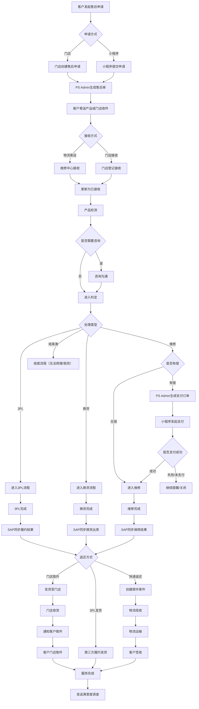
```mermaid
flowchart TD

A[客户发起售后申请] --> B{申请方式}

B -->|小程序| C[小程序提交申请]
B -->|门店| D[门店创建售后申请]

C --> E[PS Admin生成售后单]
D --> E

E --> F[客户寄送产品或门店收件]

F --> G{接收方式}
G -->|门店接收| H[门店登记接收]
G -->|物流寄送| I[维修中心接收]

H --> J[更新为已接收]
I --> J

J --> K[产品检测]

K --> L{是否需要咨询}
L -->|是| M[咨询沟通]
M --> N[返回判定]
L -->|否| N[进入判定]

N --> P{处理类型}

P -->|维修| Q{是否有偿}
P -->|换货| AC[进入换货流程]
P -->|3PL| AE[进入3PL流程]
P -->|结束类| AF[收尾流程（无法修理/假货）]

Q -->|有偿| Y[PS Admin生成支付订单]
Y --> Y1[小程序发起支付]
Y1 --> Z{是否支付成功}

Z -->|成功| AA[进入维修]
Z -->|失败/未支付| AB[继续提醒/关闭]

Q -->|无偿| AA

AA --> AH[维修完成]
AC --> AI[换货完成]
AE --> AJ[3PL完成]

AH --> SAP1[SAP同步维修结果]
AI --> SAP2[SAP同步换货出库]
AJ --> SAP3[SAP同步履约结果]

SAP1 --> AK{返还方式}
SAP2 --> AK
SAP3 --> AK

AK -->|门店取件| AL[发货至门店]
AK -->|快递返还| AM[创建顺丰寄件]
AK -->|3PL发货| AN[第三方履约发货]

AM --> AO[物流揽收]
AO --> AP[物流运输]
AP --> AQ[客户签收]

AL --> AR[门店收货]
AR --> AS[通知客户取件]
AS --> AT[客户门店取件]

AQ --> AU[服务完成]
AN --> AU
AT --> AU

AU --> AV[发送满意度调查]
```

## 3.2 流程说明

整体售后流程如下：

客户通过小程序或门店发起售后申请，系统生成售后工单，并依次进入收货、检测、判定、处理、履约及完成阶段。

根据判定结果，工单可进入维修、换货、合作厂家 / 3PL 处理，或直接结束（如无法修理、假货等）等不同路径；其中有偿维修需先完成支付后再进入后续处理。

处理完成后，系统同步相关结果，并通过快递返还或门店取件完成交付。服务完成后，系统可继续触发满意度调查、问卷或回访流程。

流程主要分为以下阶段：

1）申请  
客户通过小程序或门店发起售后申请，系统生成工单。

2）收货与检测  
产品完成寄送或接收后，进入收货、入库及检测环节。

3）判定与处理  
系统根据检测结果进入维修、换货、外部处理或结束流程；如为有偿维修，需先完成支付。

4）履约  
处理完成后进入出库与交付环节，通过快递返还或门店取件完成履约。

5）完成  
客户签收或完成取件后，工单进入服务完成，并可进入满意度调查、问卷或回访流程。

系统在关键流程节点（如接收完成、判定结果、支付状态、履约完成等）将同步触发客户通知，用于告知服务进度及结果。
通知支持系统自动触发及人工触发两种方式，具体以业务配置为准。

## 3.3 关键分支流程

### 3.3.1 申请流程

客户可通过以下两种方式发起售后申请：

小程序申请（客户自行提交）
门店申请（门店代客提交）

申请后系统生成工单，并进入收货流程。

说明：

所有申请统一进入同一套流程管理
门店与小程序仅作为入口差异，不影响后续流程
客户在还未进入维修流程前都可以撤销申请

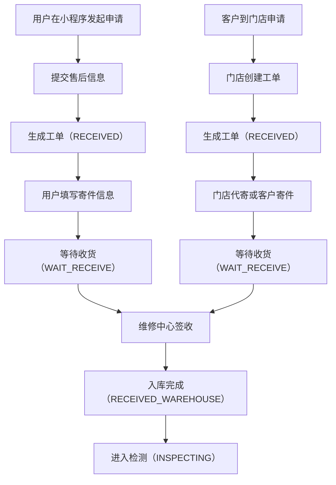
```mermaid
flowchart TD

A1[用户在小程序发起申请] --> A2[提交售后信息]
A2 --> A3[生成工单（RECEIVED）]
A3 --> A4[用户填写寄件信息]
A4 --> A5[等待收货（WAIT_RECEIVE）]

B1[客户到门店申请] --> B2[门店创建工单]
B2 --> B3[生成工单（RECEIVED）]
B3 --> B4[门店代寄或客户寄件]
B4 --> B5[等待收货（WAIT_RECEIVE）]

A5 --> C1[维修中心签收]
B5 --> C1
C1 --> C2[入库完成（RECEIVED_WAREHOUSE）]
C2 --> C3[进入检测（INSPECTING）]
```

说明：

- 小程序与门店为两个申请入口，但统一由 PS Admin 生成工单
    
- 进入检测前必须完成签收与入库
    
- 申请流程结束后，工单进入检测主流程
    

### 3.3.2 产品接收流程

客户可通过两种方式提交产品：

快递寄送至维修中心
门店收件后转寄

产品到达后完成收货登记及入库，并进入检测阶段。

若收货过程中出现异常（如破损、信息不一致等），需记录并处理。

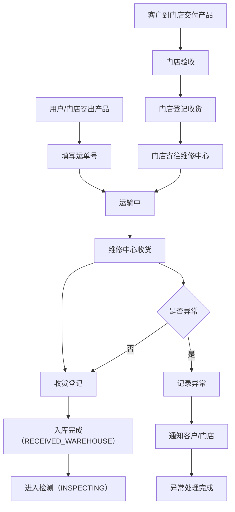
```mermaid
flowchart TD

A1[用户/门店寄出产品] --> A2[填写运单号]
A2 --> A3[运输中]
A3 --> A4[维修中心收货]
A4 --> A5[收货登记]
A5 --> A6[入库完成（RECEIVED_WAREHOUSE）]

B1[客户到门店交付产品] --> B2[门店验收]
B2 --> B3[门店登记收货]
B3 --> B4[门店寄往维修中心]
B4 --> A3

A4 --> C1{是否异常}
C1 -->|否| A5
C1 -->|是| C2[记录异常]
C2 --> C3[通知客户/门店]
C3 --> C4[异常处理完成]

A6 --> D1[进入检测（INSPECTING）]
```

### 3.3.3 检测与判定流程

产品检测完成后，进入判定阶段，根据检测结果决定处理方式：

- 无偿维修
- 有偿维修（需支付）
- 产品更换
- 3PL / 合作厂家处理
- 无法修理
- 假货处理
- 咨询确认（需客户决策）

系统将根据判定结果向客户发送对应通知（如有偿维修、无偿维修、产品更换等），以确保客户及时了解处理方案。

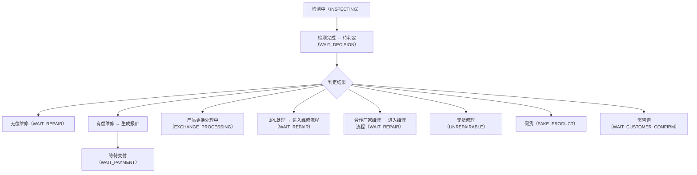
```mermaid
flowchart TD

A[检测中（INSPECTING）] --> B[检测完成 → 待判定（WAIT_DECISION）]
B --> C{判定结果}

C --> D[无偿维修（WAIT_REPAIR）]
C --> E[有偿维修 → 生成报价]
E --> F[等待支付（WAIT_PAYMENT）]

C --> G[产品更换处理中（EXCHANGE_PROCESSING）]
C --> H[3PL处理 → 进入维修流程（WAIT_REPAIR）]
C --> I[合作厂家维修 → 进入维修流程（WAIT_REPAIR）]

C --> J[无法修理（UNREPAIRABLE）]
C --> K[假货（FAKE_PRODUCT）]

C --> L[需咨询（WAIT_CUSTOMER_CONFIRM）]
```

### 3.3.4 咨询流程

咨询状态默认值为“咨询待机”；当“咨询完成”后，状态自动返回判定节点。

在以下场景需发起咨询：

- 维修方案需客户确认
    
- 费用变更
    
- 他品交换

- 异常情况说明

- 合作厂家延迟
    
客户确认后流程继续，若客户拒绝或超时，可关闭工单。

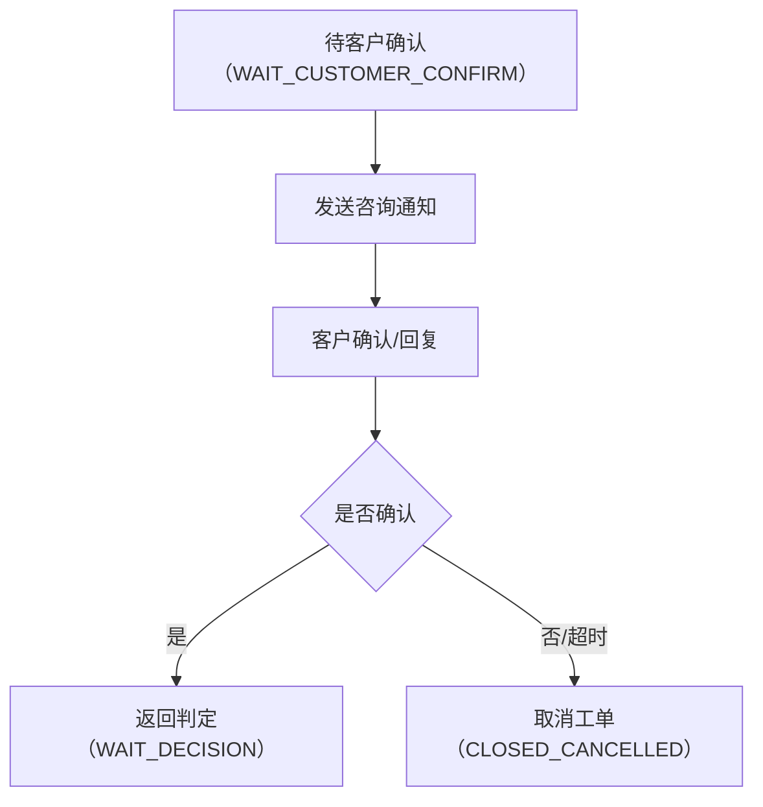
```mermaid
flowchart TD

A[待客户确认（WAIT_CUSTOMER_CONFIRM）] --> B[发送咨询通知]
B --> C[客户确认/回复]
C --> D{是否确认}

D -->|是| E[返回判定（WAIT_DECISION）]
D -->|否/超时| F[取消工单（CLOSED_CANCELLED）]
```

### 3.3.5 支付流程

当工单判定为有偿维修场景时，系统进入支付流程。

当判定为有偿维修时：

1. 系统从 SAP 查询维修费用；
2. 系统生成待支付信息，并同步至支付平台；
3. 客户可通过小程序或网页版（Web）完成支付；
4. 支付结果回传 PS Admin，并用于更新工单状态。

系统将根据支付状态（待支付、已支付、超时未支付等）触发相应通知及提醒机制。
其中待支付状态下：
- 在“判定完成”后 +D1 起，每天发送 1 次，共发送 5 次
- 最终未付款提醒，在“判定完成”后 +D30 发送一次
- 超时后关闭工单

补充取消规则：

1. 在“维修进行前”阶段，客户可通过线上系统自行取消售后申请；
2. 若当前工单存在已生成但未完成或需撤销的支付单，取消申请时应同步执行支付取消（含 CancelPayment）；
3. 客户可取消的范围，包含待支付、支付处理中、待维修等尚未进入“维修进行中（REPAIRING）”的阶段；
4. 客户发起取消后，系统需记录取消时间、取消来源、取消原因及处理结果；
5. 若取消成功，工单进入取消关闭状态；若支付取消失败，则需提示人工介入处理。

**确认：**
是否存在线下支付场景？

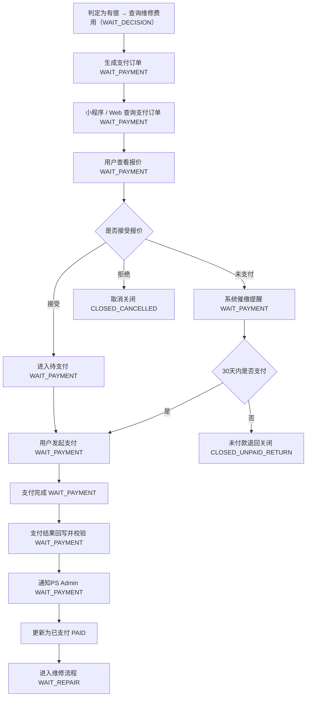
```mermaid
flowchart TD

A[判定为有偿 → 查询维修费用（WAIT_DECISION）] --> B[生成支付订单 WAIT_PAYMENT]
B --> C[小程序 / Web 查询支付订单 WAIT_PAYMENT]
C --> D[用户查看报价 WAIT_PAYMENT]

D --> E{是否接受报价}

E -->|接受| F[进入待支付 WAIT_PAYMENT]
F --> G[用户发起支付 WAIT_PAYMENT]
G --> H[支付完成 WAIT_PAYMENT]

H --> I[支付结果回写并校验 WAIT_PAYMENT]
I --> J[通知PS Admin WAIT_PAYMENT]

J --> K[更新为已支付 PAID]
K --> L[进入维修流程 WAIT_REPAIR]

E -->|未支付| M[系统催缴提醒 WAIT_PAYMENT]
M --> N{30天内是否支付}

N -->|是| G
N -->|否| O[未付款退回关闭 CLOSED_UNPAID_RETURN]

E -->|拒绝| P[取消关闭 CLOSED_CANCELLED]
```

说明：

- 支付流程是有偿场景的独立子流程
    
- 支付成功后并不直接进入维修中，而是先进入待维修状态
    
- 未支付和拒绝报价对应不同关闭路径
    

### 3.3.6 维修执行流程
维修流程包括：

- 进入待维修状态
- 到达时间条件后进入维修中
  
    - 若为 “无偿”：判定完成 +D3 后状态自动变更为 “维修进行中”
    - 若为 “有偿”：付款完成 +D3 后状态自动变更为 “维修进行中”
    - 若为 “3PL”：付款完成 +D1 后状态自动变更为 “维修进行中”

- 执行维修或更换
- 完成后进入待出库

维修过程中可能涉及配件更换与库存扣减。

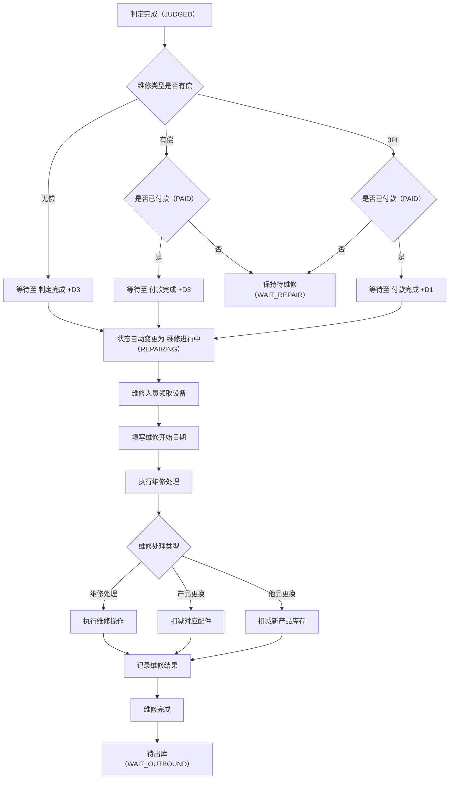
```mermaid
flowchart TD

A[判定完成（JUDGED）] --> B{维修类型是否有偿}

B -->|无偿| C[等待至 判定完成 +D3]
B -->|有偿| D{是否已付款（PAID）}
B -->|3PL| E{是否已付款（PAID）}

D -->|是| F[等待至 付款完成 +D3]
D -->|否| Z1[保持待维修（WAIT_REPAIR）]

E -->|是| G[等待至 付款完成 +D1]
E -->|否| Z1

C --> H[状态自动变更为 维修进行中（REPAIRING）]
F --> H
G --> H

H --> I[维修人员领取设备]
I --> J[填写维修开始日期]
J --> K[执行维修处理]

K --> L{维修处理类型}
L -->|维修处理| M[执行维修操作]
L -->|产品更换| N[扣减对应配件]
L -->|他品更换| O[扣减新产品库存]

M --> P[记录维修结果]
N --> P
O --> P

P --> Q[维修完成]
Q --> R[待出库（WAIT_OUTBOUND）]
```
    

### 3.3.7 配件与库存处理流程

在维修处理过程中，若涉及配件更换，系统需执行配件选择、库存校验及配件消耗记录等操作。  
该流程作为维修流程中的子流程执行。

1. 配件选择规则  
    维修人员可对系统默认配件进行确认、修改、新增或删除。
    
2. 库存校验规则  
    系统在维修完成前校验配件库存是否满足消耗需求。
    
3. 库存扣减时机  
    配件库存在“维修完成提交时”统一扣减，避免在维修过程中产生库存不一致问题。
    
4. 库存不足处理  
    当库存不足时，系统应支持：
    
    - 触发配件申请流程
    - 或生成库存预警
        
5. 数据记录  
    系统需记录：
    
    - 配件消耗明细
    - 库存变动记录
    - 操作人及时间
        

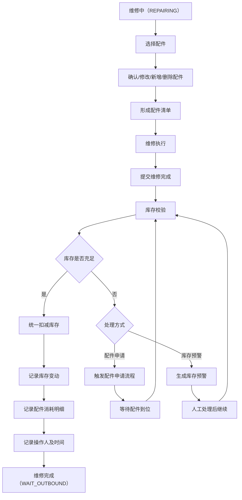
```mermaid
flowchart TD

A[维修中（REPAIRING）] --> B[选择配件]

B --> C[确认/修改/新增/删除配件]
C --> D[形成配件清单]

D --> E[维修执行]

E --> F[提交维修完成]
F --> G[库存校验]

G --> H{库存是否充足}

H -->|是| I[统一扣减库存]
I --> J[记录库存变动]
J --> K[记录配件消耗明细]
K --> L[记录操作人及时间]
L --> M[维修完成（WAIT_OUTBOUND）]

H -->|否| N{处理方式}

N -->|配件申请| O[触发配件申请流程]
O --> P[等待配件到位]
P --> G

N -->|库存预警| Q[生成库存预警]
Q --> R[人工处理后继续]
R --> G
```

说明：

- 配件与库存流程为维修执行子流程，不单独形成主状态链
    
- 库存扣减统一发生在维修完成提交时
    
- 库存不足时需阻断维修完成提交
    

### 3.3.8 合作厂家 / 3PL 流程

部分工单可由外部执行：

发往合作厂家或3PL
外部完成处理后返回
继续进入出库流程

说明：

- 合作厂家 / 3PL 流程在业务上是外部执行，在系统状态上仍纳入维修主链
- 处理完成后统一返回待出库状态
- 若涉及费用，仍需先经过支付流程
- 当维修执行方为「3PL」时，SAP 负责生成 DO 单据并通知 WMS 发货，出库信息回传至 PS Admin

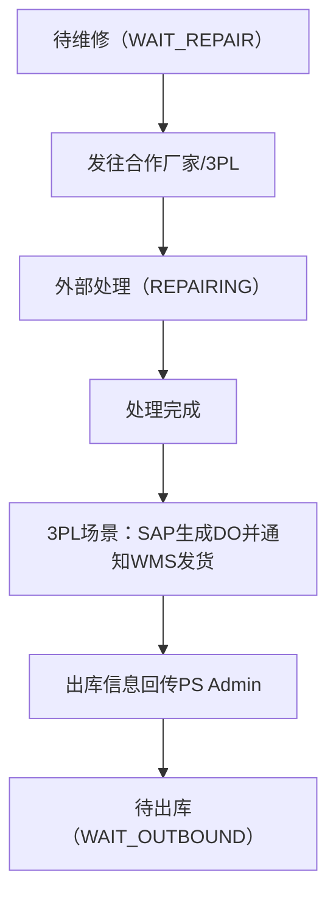
```mermaid
flowchart TD

A[待维修（WAIT_REPAIR）] --> B[发往合作厂家/3PL]
B --> C[外部处理（REPAIRING）]
C --> D[处理完成]
D --> E[3PL场景：SAP生成DO并通知WMS发货]
E --> F[出库信息回传PS Admin]
F --> G[待出库（WAIT_OUTBOUND）]
```
    

### 3.3.9 无法修理 / 假货流程

当判定为无法修理或假货时：

通知客户
工单关闭

**确认：**

是否需要返还产品？
是否存在销毁或回收流程？

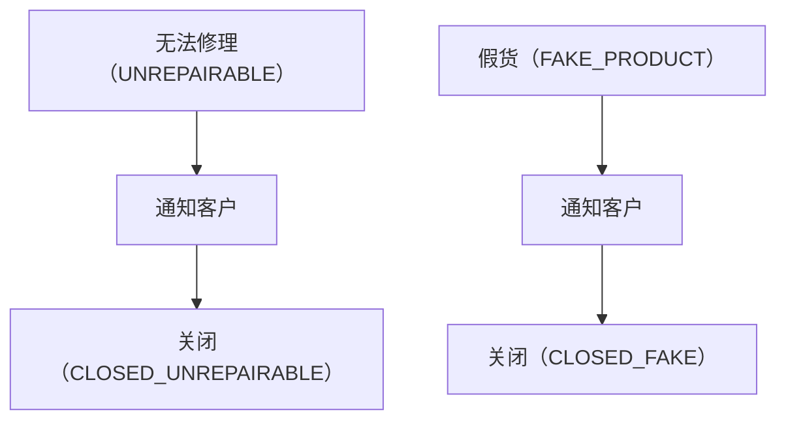
```mermaid
flowchart TD

A[无法修理（UNREPAIRABLE）] --> B[通知客户]
B --> C[关闭（CLOSED_UNREPAIRABLE）]

D[假货（FAKE_PRODUCT）] --> E[通知客户]
E --> F[关闭（CLOSED_FAKE）]
```
    

### 3.3.10 出库与履约流程

处理完成后进入交付阶段。系统在出库准备、出库完成、物流发货、配送签收等关键节点，需同步更新小程序及 Web 端状态，并向客户发送履约进度通知。

一、流程说明

- 1）出库准备  
工单处理完成后进入出库准备阶段，系统同步更新状态值及相关数据。

- 2）发货批次  
当工单状态为“维修完成”时，系统于每日下午 3 点启动发货批次任务。未付款或已取消的工单不参与批次处理。

- 3）物流处理  
批次任务执行后，系统生成快递申请、打印运单，并将运单号及相关物流信息回传至 PS Admin。

- 4）手动录入物流信息  
当维修订单状态达到“出库准备完成”后，PS CN 可在当日下午 3 点至次日下午 3 点期间手动录入快递单号及相关物流信息，并同步至小程序。

- 5）自动申请控制  
如在上述时间窗口内已手动录入物流信息，则系统在次日下午 3 点不再自动为该工单生成快递申请。

- 6）履约完成  
快递场景下，配送完成后按工作日 +D1 进入“服务完成”；门店场景下，门店收货完成后按工作日 +D1 进入“服务完成”。

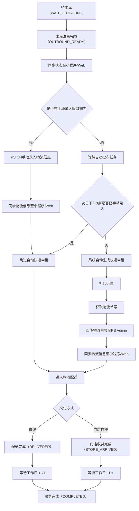
```mermaid
flowchart TD

A[待出库（WAIT_OUTBOUND）] --> B[出库准备完成（OUTBOUND_READY）]
B --> C[同步状态至小程序/Web]

C --> D{是否在手动录入窗口期内}
D -->|是| E[PS CN手动录入物流信息]
D -->|否| F[等待自动批次任务]

E --> G[同步物流信息至小程序/Web]
G --> H[跳过自动快递申请]

F --> I{次日下午3点是否已手动录入}
I -->|是| H
I -->|否| J[系统自动生成快递申请]
J --> K[打印运单]
K --> L[获取物流单号]
L --> M[回传物流单号至PS Admin]
M --> N[同步物流信息至小程序/Web]

H --> O[进入物流配送]
N --> O

O --> P{交付方式}
P -->|快递| Q[配送完成（DELIVERED）]
Q --> R[等待工作日 +D1]
R --> S[服务完成（COMPLETED）]

P -->|门店自提| T[门店收货完成（STORE_ARRIVED）]
T --> U[等待工作日 +D1]
U --> S
```

### 3.3.11 问卷流程

服务完成后，系统生成满意度问卷，并由小程序向客户展示与收集反馈。  
PS Admin 负责接收问卷结果并更新问卷及回访信息。

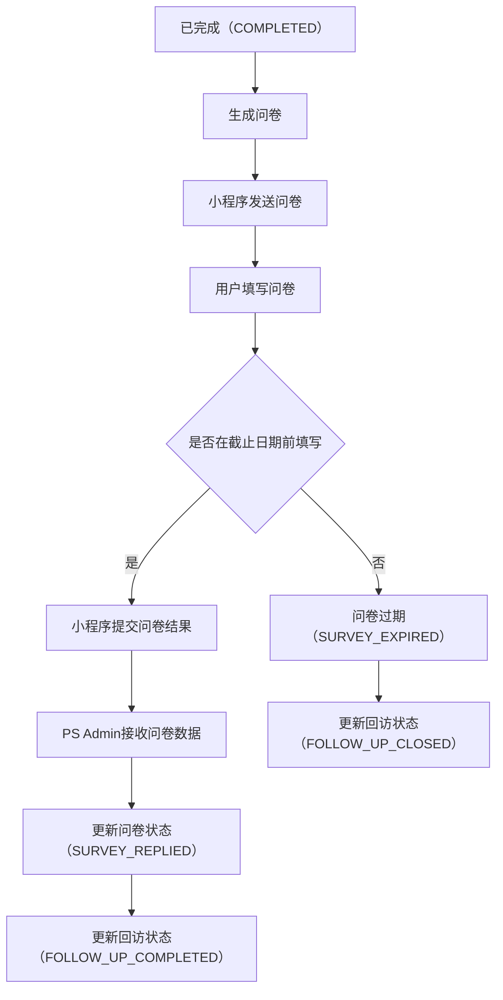
```mermaid
flowchart TD

A[已完成（COMPLETED）] --> B[生成问卷]
B --> C[小程序发送问卷]
C --> D[用户填写问卷]

D --> E{是否在截止日期前填写}

E -->|是| F[小程序提交问卷结果]
F --> G[PS Admin接收问卷数据]
G --> H[更新问卷状态（SURVEY_REPLIED）]
H --> I[更新回访状态（FOLLOW_UP_COMPLETED）]

E -->|否| J[问卷过期（SURVEY_EXPIRED）]
J --> K[更新回访状态（FOLLOW_UP_CLOSED）]
```

说明：

- 工单进入“服务完成”后，系统自动生成问卷并设置截止日期。
- 问卷由小程序端展示，客户可在截止日期前完成填写。
- 客户提交问卷后，系统记录评分及反馈内容，并更新问卷状态。
- 若客户在截止日期前未填写，问卷自动过期，并关闭回访。
- 问卷与回访数据用于服务质量分析，不影响工单主状态。

### 3.3.12 异常处理流程

系统需支持关键异常处理：

| 异常类型 | 处理方式                     |
| -------- | ---------------------------- |
| 支付失败 | 重新发起或关闭               |
| 支付超时 | 自动关闭工单                 |
| 库存不足 | 阻断流程或触发申请           |
| 物流异常 | 人工介入处理                 |
| 数据异常 | 系统校验与修复               |
| 咨询超时 | 取消关闭或人工跟进           |
| 维修取消 | 客户线上取消或管理员人工取消 |

1. 在“维修进行中（REPAIRING）”至“维修完成”阶段，不支持客户自行取消；
2. 该阶段如需取消，由管理员手动执行取消操作，即 CancelPayment（含支付取消）；
3. 管理员取消时，系统需记录取消原因、取消时间、操作人及处理结果；
4. 若取消时已进入配送准备、已生成出库任务或已进入配送批次，需先确认取消件的配送批次处理逻辑，再执行后续关闭；
5. 若取消后仍需返还产品，应明确后续履约方式及状态流转规则。

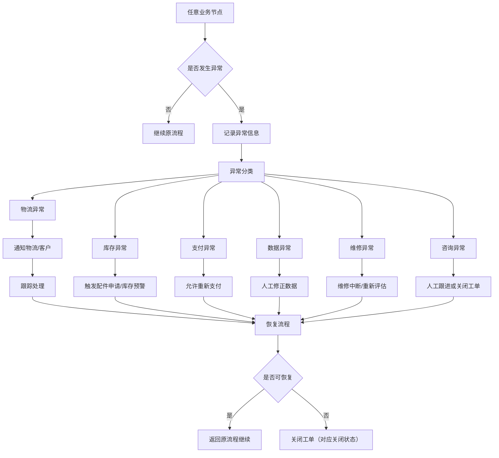
```mermaid
flowchart TD

A[任意业务节点] --> B{是否发生异常}

B -->|否| C[继续原流程]

B -->|是| D[记录异常信息]
D --> E[异常分类]

E --> F[物流异常]
E --> G[库存异常]
E --> H[支付异常]
E --> I[数据异常]
E --> J[维修异常]
E --> K[咨询异常]

F --> F1[通知物流/客户]
F1 --> F2[跟踪处理]
F2 --> L[恢复流程]

G --> G1[触发配件申请/库存预警]
G1 --> L

H --> H1[允许重新支付]
H1 --> L

I --> I1[人工修正数据]
I1 --> L

J --> J1[维修中断/重新评估]
J1 --> L

K --> K1[人工跟进或关闭工单]
K1 --> L

L --> M{是否可恢复}

M -->|是| N[返回原流程继续]
M -->|否| O[关闭工单（对应关闭状态）]
```

说明：

- 异常处理流程覆盖主流程各节点
    
- 异常是否可恢复，由具体异常类型和业务规则决定
    
- 无法恢复时需落到明确关闭状态，不允许悬空
    

# 4. 外部系统协同说明

## 4.1 小程序

主要职责：

- 用户提交售后申请
- 发起支付
- 查询工单状态
- 填写问卷

### 4.1.1 创建工单

工单由小程序或门店发起申请，由系统统一创建并生成工单编号，确保所有工单入口一致、数据规范统一，并由系统集中管理。

**职责划分**

| 角色          | 职责                           |
| ------------- | ------------------------------ |
| 小程序 / 门店 | 收集客户信息并发起申请         |
| PS Admin      | 创建工单、生成编号、初始化状态 |

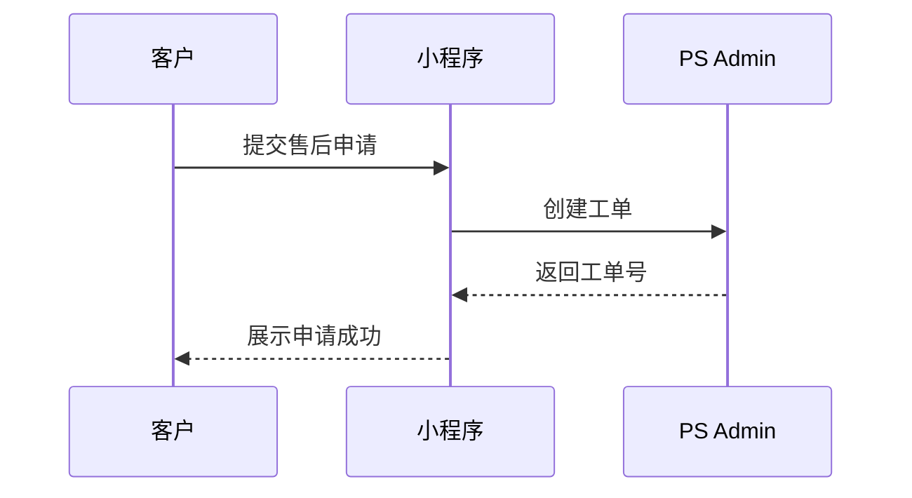
```mermaid
sequenceDiagram
    participant C as 客户
    participant M as 小程序
    participant A as PS Admin

    C->>M: 提交售后申请
    M->>A: 创建工单
    A-->>M: 返回工单号
    M-->>C: 展示申请成功
```

### 4.1.2 支付

PS Admin：负责支付订单生成、支付状态管理、工单状态驱动
小程序：负责支付展示、调用微信支付、接收支付结果并回写
微信支付：负责实际扣款与支付结果返回
系统采用 “支付回写 + 主动查询（补偿机制）”双保障机制，确保支付状态最终一致

**职责划分**

| 角色     | 职责                                     |
| -------- | ---------------------------------------- |
| 小程序   | 展示费用、发起微信支付、回写支付结果     |
| PS Admin | 生成支付订单、更新支付状态、推进工单流程 |

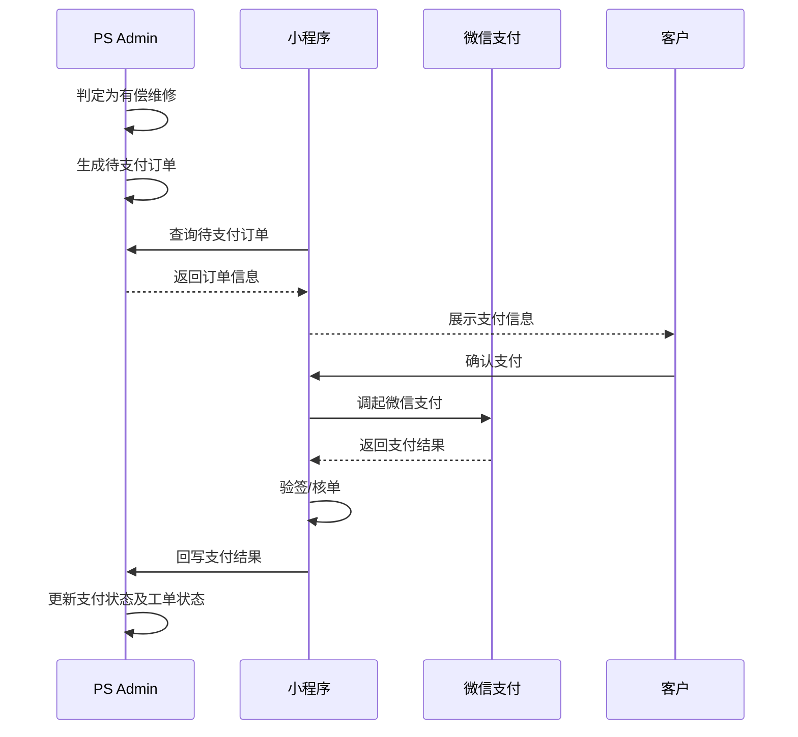
```mermaid
sequenceDiagram
participant A as PS Admin
participant M as 小程序
participant W as 微信支付
participant C as 客户

A->>A: 判定为有偿维修
A->>A: 生成待支付订单

M->>A: 查询待支付订单
A-->>M: 返回订单信息

M-->>C: 展示支付信息
C->>M: 确认支付

M->>W: 调起微信支付
W-->>M: 返回支付结果

M->>M: 验签/核单
M->>A: 回写支付结果

A->>A: 更新支付状态及工单状态
```

### 4.1.3 查询工单状态

系统负责状态管理与输出，小程序负责查询与展示，确保状态统一、结果一致。

**职责划分**

| 角色     | 职责                   |
| -------- | ---------------------- |
| 小程序   | 发起查询请求并展示状态 |
| PS Admin | 返回统一工单状态结果   |

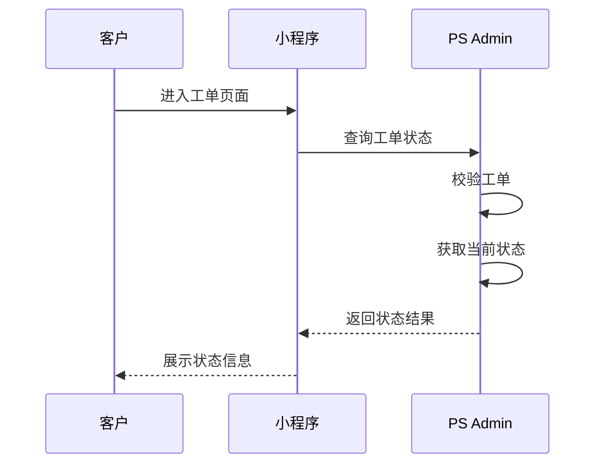
```mermaid
sequenceDiagram
participant C as 客户
participant M as 小程序
participant A as PS Admin

C->>M: 进入工单页面
M->>A: 查询工单状态
A->>A: 校验工单
A->>A: 获取当前状态
A-->>M: 返回状态结果
M-->>C: 展示状态信息
```

### 4.1.4 问卷调查

问卷由小程序展示并完成填写，系统负责结果接收与数据管理。

**职责划分**

| 角色     | 职责                             |
| -------- | -------------------------------- |
| 小程序   | 展示问卷、收集并提交结果         |
| PS Admin | 接收问卷数据、更新问卷及回访状态 |

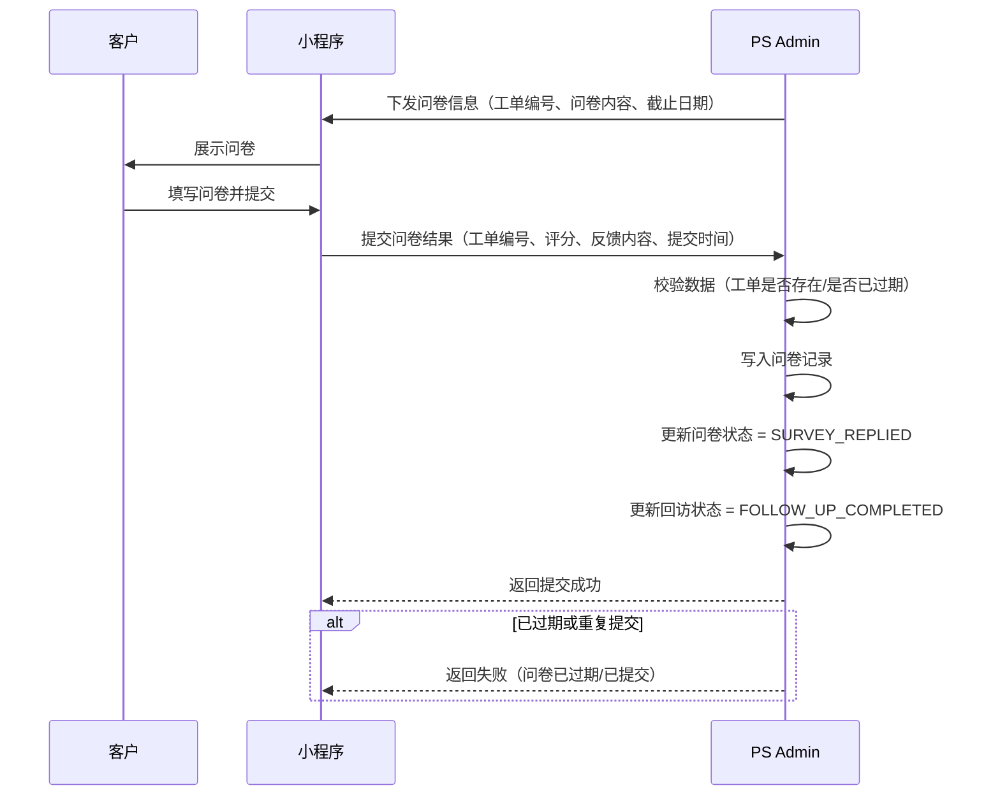
```mermaid
sequenceDiagram

participant U as 客户
participant M as 小程序
participant A as PS Admin

%% 问卷生成
A ->> M: 下发问卷信息（工单编号、问卷内容、截止日期）
M ->> U: 展示问卷

%% 用户填写
U ->> M: 填写问卷并提交

%% 数据回传
M ->> A: 提交问卷结果（工单编号、评分、反馈内容、提交时间）

%% 数据处理
A ->> A: 校验数据（工单是否存在/是否已过期）
A ->> A: 写入问卷记录

%% 状态更新
A ->> A: 更新问卷状态 = SURVEY_REPLIED
A ->> A: 更新回访状态 = FOLLOW_UP_COMPLETED

%% 返回结果
A -->> M: 返回提交成功

%% 异常处理
alt 已过期或重复提交
A -->> M: 返回失败（问卷已过期/已提交）
end
```

### 4.1.5 客户确认

客户确认功能用于支持 PS Admin 将产品状态信息、维修方案等内容同步至小程序端，由客户进行查看、确认及反馈，确认结果再回写至 PS Admin。

**职责划分**

| 角色     | 职责                                                             |
| -------- | ---------------------------------------------------------------- |
| PS Admin | 维护客户确认内容、上传图片及文字说明、推送维修方案、记录确认状态 |
| 小程序   | 展示客户确认内容，供客户查看、确认并提交反馈                     |
| 客户     | 查看确认内容并完成确认或反馈                                     |

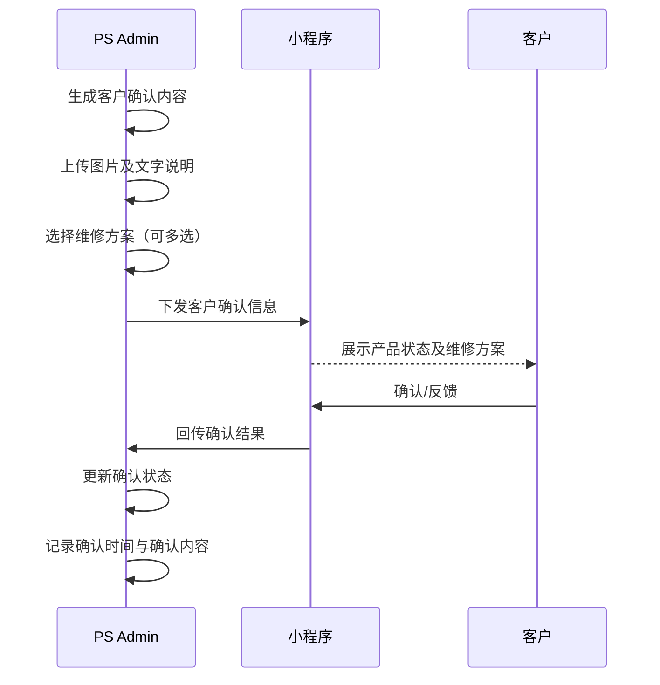
```mermaid
sequenceDiagram
participant A as PS Admin
participant M as 小程序
participant C as 客户

A->>A: 生成客户确认内容
A->>A: 上传图片及文字说明
A->>A: 选择维修方案（可多选）
A->>M: 下发客户确认信息

M-->>C: 展示产品状态及维修方案
C->>M: 确认/反馈
M->>A: 回传确认结果

A->>A: 更新确认状态
A->>A: 记录确认时间与确认内容
```

## 4.2 SAP

SAP 作为外部协同系统，主要负责商品与库存数据同步、入库与出库协同、有偿维修费用协同，以及 SO（销售订单）同步，为 PS Admin 提供业务处理所需的基础数据与结果数据支持。

#### 4.2.1 商品与库存数据同步

PS Admin 每日凌晨定时从 SAP 同步商品基础信息、库存数量及库存状态，用于产品管理、库存展示及业务处理。  
对于新增商品、信息变更或库存变动等场景，系统支持增量同步，确保关键数据及时更新。

**职责划分**

| 角色     | 职责                                         |
| -------- | -------------------------------------------- |
| PS Admin | 定时发起全量同步，并根据业务需要处理增量同步 |
| SAP      | 提供商品与库存相关数据                       |

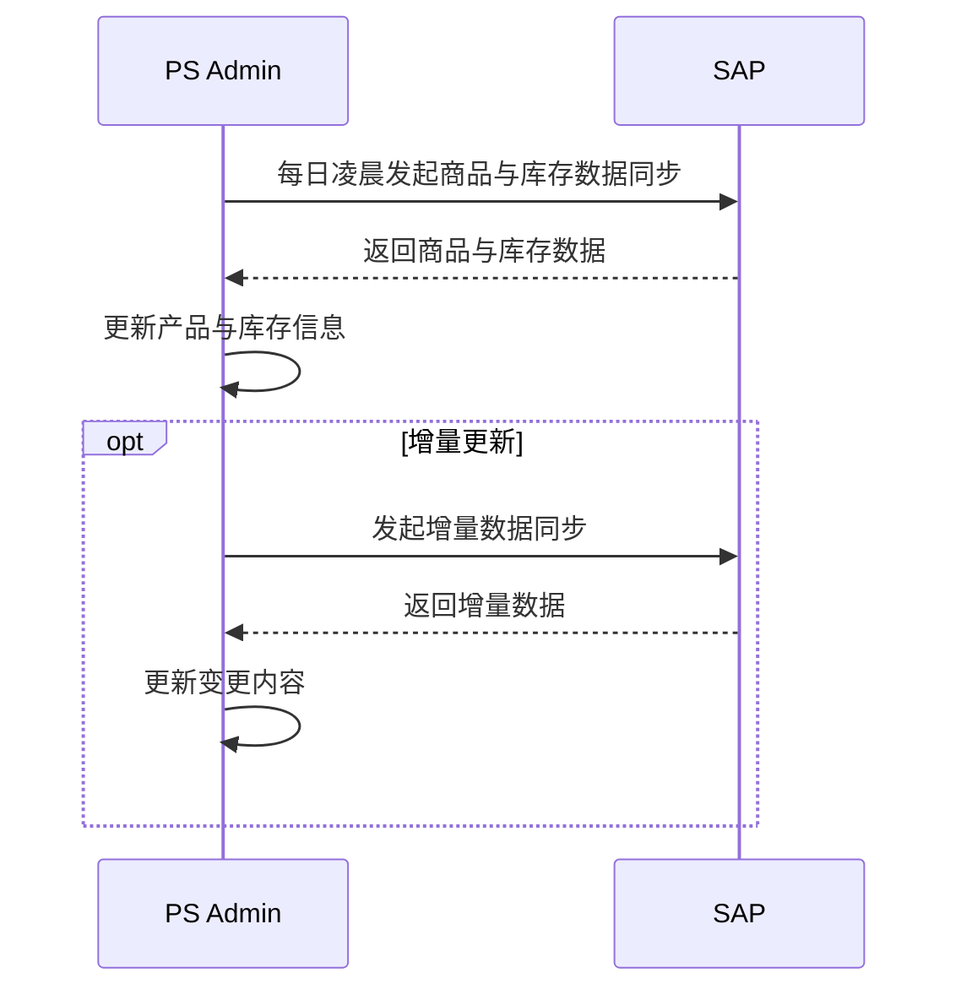
```mermaid
sequenceDiagram
participant A as PS Admin
participant S as SAP

A ->> S: 每日凌晨发起商品与库存数据同步
S -->> A: 返回商品与库存数据
A ->> A: 更新产品与库存信息

opt 增量更新
    A ->> S: 发起增量数据同步
    S -->> A: 返回增量数据
    A ->> A: 更新变更内容
end
```

#### 4.2.2 入库协同

当售后商品完成收货入库后，相关入库结果需同步至 SAP，用于保持系统间库存数据一致。

**职责划分**

| 角色     | 职责                           |
| -------- | ------------------------------ |
| PS Admin | 记录收货入库结果并发起同步     |
| SAP      | 接收入库结果并更新相关库存数据 |

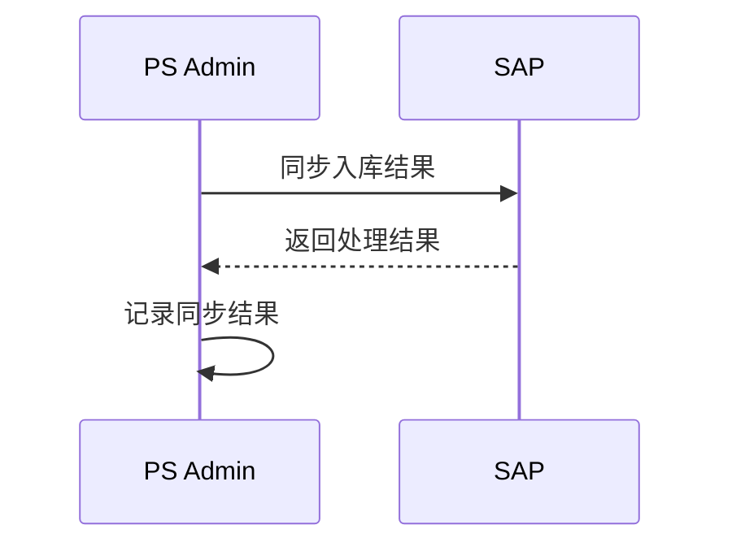
```mermaid
sequenceDiagram
participant A as PS Admin
participant S as SAP

A ->> S: 同步入库结果
S -->> A: 返回处理结果
A ->> A: 记录同步结果
```

#### 4.2.3 出库协同

当维修执行方为「3PL」时，在 SAP 系统 中生成 DO 单据，并通知 WMS 仓储系统 发货；
将出库信息回传至 PS Admin 系统。

**职责划分**

| 角色     | 职责                       |
| -------- | -------------------------- |
| PS Admin | 发起出库数据同步           |
| SAP      | 接收出库信息并处理相关协同 |
| WMS      | 执行实际出库操作（如适用） |

```mermaid
sequenceDiagram
participant A as PS Admin
participant S as SAP
participant W as WMS

A ->> S: 同步出库信息
S ->> W: 下发出库处理
W -->> S: 返回出库结果
S -->> A: 回传出库结果
A ->> A: 更新工单出库状态
```

#### （4）有偿维修费用协同

当工单判定为有偿维修时，PS Admin 向 SAP 获取费用信息，用于生成支付内容。

**职责划分**

| 角色     | 职责                       |
| -------- | -------------------------- |
| PS Admin | 发起费用查询并生成有偿金额 |
| SAP      | 返回费用信息               |

```mermaid
sequenceDiagram
participant A as PS Admin
participant S as SAP

A ->> S: 查询维修费用
S -->> A: 返回费用信息
A ->> A: 生成有偿金额
```

#### （5）服务结束后的 SO（销售订单）处理

当售后工单进入服务结束后，在 SAP 系统中生成 SO（销售订单），并将生成结果返回至 PS Admin 保存，用于后续查询与展示。

**职责划分**

| 角色     | 职责                                         |
| -------- | -------------------------------------------- |
| PS Admin | 在服务结束后发起相关处理，并保存 SO 文件编号 |
| SAP      | 生成 SO（销售订单）并返回 SO 文件编号        |

```mermaid
sequenceDiagram
participant A as PS Admin
participant S as SAP

A ->> S: 发起 SO 生成处理
S -->> A: 返回 SO 文件编号
A ->> A: 保存 SO 文件编号
```

## 4.3 物流系统协同

物流系统作为外部协同系统，主要负责售后过程中的寄件、运输、派送、签收及物流状态反馈，为 PS Admin 提供物流过程数据支持。

### 4.3.1 寄件与运输跟踪

客户或门店寄出产品后，物流系统负责运输，并将物流状态返回给 PS Admin。

```mermaid
sequenceDiagram
participant U as 客户 / 门店
participant A as PS Admin
participant L as 物流系统

U ->> A: 提交运单号
A ->> L: 查询物流状态
L -->> A: 返回物流状态
```

### 4.3.2 收货签收结果回传

产品到达后，物流系统返回签收结果，PS Admin 更新工单状态。

```mermaid
sequenceDiagram
participant L as 物流系统
participant A as PS Admin

L -->> A: 回传签收结果
A ->> A: 更新工单状态
```

### 4.3.3 维修完成后的发货协同

维修完成后，PS Admin 记录发货信息，物流系统执行后续派送，并返回物流结果。

```mermaid
sequenceDiagram
participant A as PS Admin
participant L as 物流系统

A ->> L: 提交发货信息
L -->> A: 返回运单号 / 发货结果
A ->> A: 更新物流信息
```

### 4.3.4 物流异常反馈

发生延误、丢件、拒收等异常时，物流系统返回异常信息，PS Admin 记录并处理。

```mermaid
sequenceDiagram
participant L as 物流系统
participant A as PS Admin

L -->> A: 回传异常信息
A ->> A: 记录异常并处理
```

## 4.4 通知协同

小程序通知适合用于工单状态更新、支付提醒、维修进度、发货进度及问卷邀请等轻量通知场景。  
但小程序订阅消息通常需由用户主动授权，常见的一次性订阅模式下，授权一次通常仅支持发送一条消息，因此不适合单独承担所有高频提醒场景。对于受理成功、支付催缴、无法维修、发货、到店提醒等关键节点，建议结合短信或邮件进行补充，以保证通知触达效果。

### 4.4.1 各通知渠道定位

| 通知渠道   | 适用场景                                         | 特点                             |
| ---------- | ------------------------------------------------ | -------------------------------- |
| 小程序通知 | 状态更新、支付提醒、维修进度、发货进度、问卷邀请 | 适合轻量提醒，可直接跳转业务页面 |
| 短信通知   | 受理成功、支付催缴、无法维修、发货、到店提醒     | 触达直接，适合关键节点通知       |
| 邮件通知   | 判定结果、处理方案、保修确认、出库说明、门店指引 | 信息完整，适合正式说明与留档     |

### 4.4.2 综合通知策略

| 业务节点                | 小程序通知 | 短信通知 | 邮件通知 | 推荐方式      | 说明                                     |
| ----------------------- | ---------- | -------- | -------- | ------------- | ---------------------------------------- |
| 工单受理完成            | 可发送     | 建议发送 | 可发送   | 短信 + 小程序 | 作为首次确认通知，需确保客户及时知晓     |
| 判定结果通知            | 可发送     | 可补充   | 建议发送 | 邮件 + 小程序 | 判定结果内容较多，邮件更适合承载详细说明 |
| 有偿维修待支付          | 建议发送   | 建议发送 | 可发送   | 小程序 + 短信 | 小程序承接支付操作，短信用于增强触达     |
| 支付催缴提醒            | 建议发送   | 建议发送 | 可选     | 短信 + 小程序 | 催缴场景建议双通道提醒                   |
| 支付完成                | 可发送     | 可发送   | 可发送   | 小程序 + 短信 | 用于通知客户已完成付款并进入后续流程     |
| 维修进行中              | 建议发送   | 可选     | 可选     | 小程序        | 适合轻量过程通知                         |
| 合作商维修延期          | 可发送     | 可发送   | 建议发送 | 邮件 + 短信   | 延期说明通常需要较完整内容               |
| 无法维修 / 假货         | 可发送     | 建议发送 | 建议发送 | 邮件 + 短信   | 属于关键结果通知，建议正式说明并强提醒   |
| 维修取消                | 可发送     | 建议发送 | 建议发送 | 邮件 + 短信   | 需明确取消原因及后续处理方式             |
| 更换产品 / 更换其他产品 | 可发送     | 可补充   | 建议发送 | 邮件 + 小程序 | 涉及方案说明，邮件更适合详细表达         |
| 保修卡 / 质保确认       | 可发送     | 可选     | 建议发送 | 邮件          | 适合承载说明与补充材料要求               |
| 出库发货                | 建议发送   | 建议发送 | 可发送   | 小程序 + 短信 | 发货状态建议及时触达，便于客户跟踪       |
| 发往门店                | 可发送     | 建议发送 | 可发送   | 短信 + 小程序 | 到店类通知建议短信补充                   |
| 门店到货 / 门店可取     | 可发送     | 建议发送 | 可选     | 短信 + 小程序 | 属于强提醒节点                           |
| 门店取货完成            | 可发送     | 可选     | 可选     | 小程序        | 用于结果确认即可                         |
| 问卷邀请                | 建议发送   | 可选     | 可选     | 小程序        | 最适合在小程序内直接承接填写动作         |
| 门店信息指引            | 不建议     | 可选     | 建议发送 | 邮件          | 内容较长，适合邮件承载                   |

### 4.4.3 小程序通知

当工单在关键业务节点发生状态变化时，PS Admin 根据通知规则匹配对应模板，并通过小程序消息方式向客户发送通知，客户可在小程序中查看详情或继续后续操作。

```mermaid
sequenceDiagram
participant A as PS Admin
participant M as 小程序
participant U as 客户

A ->> A: 触发小程序通知条件
A ->> A: 匹配通知模板
A ->> M: 发送小程序通知
M -->> U: 展示通知消息
U ->> M: 查看消息详情
```

### 4.4.4 短信通知

当工单在关键业务节点发生状态变化时，PS Admin 根据通知规则匹配对应短信模板，并调用短信服务向客户发送通知，发送结果回写系统留痕。

```mermaid
sequenceDiagram
participant A as PS Admin
participant S as 短信服务
participant U as 客户

A ->> A: 触发短信发送条件
A ->> A: 匹配短信模板
A ->> S: 发送短信
S -->> U: 下发短信通知
S -->> A: 返回发送结果
A ->> A: 记录发送日志
```

### 4.4.5 邮件通知

当工单在关键业务节点需要进行较完整说明时，PS Admin 根据通知规则匹配对应邮件模板，并通过邮件服务向客户发送通知，发送结果回写系统留痕。

```mermaid
sequenceDiagram
participant A as PS Admin
participant E as 邮件服务
participant U as 客户

A ->> A: 触发邮件发送条件
A ->> A: 匹配邮件模板
A ->> E: 发送邮件
E -->> U: 下发邮件通知
E -->> A: 返回发送结果
A ->> A: 记录发送日志
```

# 5. 功能模块设计

本系统主要功能模块如下：

| 模块名称       | 主要作用                                 | 备注 |
| -------------- | ---------------------------------------- | ---- |
| 售后工单管理   | 统一管理售后工单全流程及相关信息         |      |
| 产品管理       | 管理产品基础资料、库存信息及库存变动记录 |      |
| 库存申请管理   | 管理产品库存申请、审批及处理             |      |
| 小零件管理     | 管理维修小零件基础资料及数量配置         |      |
| 小零件申请管理 | 管理小零件申请、审批及出库               |      |
| 问卷与回访管理 | 管理客户满意度问卷及回访信息             |      |
| 咨询管理       | 管理客户咨询及异常处理记录               |      |
| 用户权限       | 管理用户、角色与权限范围                 |      |

说明：

- 各模块围绕工单主线展开，并与支付、SAP、物流、小程序等系统协同。
- 模块之间通过统一工单编号及业务数据关联，形成完整业务闭环。
  

## 5.1 售后工单管理

本模块包括工单列表、工单详情、工单创建、工单编辑及相关业务操作入口，用于支撑售后工单全流程管理。

### 5.1.1 工单列表

**功能说明**
用于展示工单数据列表，支持查询及操作。

**查询条件**
- 所有字段可进行搜索。
- 在条码搜索栏扫描后跳转到详情页面。

**操作按钮**
- 点击「+」按钮可新建工单。
- 点击「Edit」按钮可批量修改数据（状态、服务工程师）。
- Excel 导出。
- 删除工单
- 顺丰发票打印

| 字段名称     | 说明                            | 备注        |
| ------------ | ------------------------------- | ----------- |
| 工单编号     | 售后服务唯一标识                | 系统生成    |
| 接收日期     | 工单受理时间                    |             |
| 状态         | 工单所处流程状态                |             |
| 本社入库日期 | 产品入库时间                    |             |
| 预计出库日期 | 预计完成时间                    |             |
| 受理渠道     | 来源（门店 / 邮寄 / 小程序）    |             |
| 客户姓名     | 客户名称                        |             |
| 联系电话     | 客户联系方式                    |             |
| 邮箱         | 客户邮箱                        |             |
| 产品名称     | 维修产品名称                    |             |
| 维修执行方   | 维修主体（总部 / 合作方 / 3PL） |             |
| 维修内容     | 维修项目                        |             |
| 挂号编号     | 物流单号 / 寄件编号             |             |
| 付款日期     | 支付完成时间                    |             |
| 出库方式     | 配送方式                        | 快递 / 门店 |
| 出库完成日期 | 实际出库时间                    |             |
| SO文件编号   | 关联 SAP 单据                   |             |

### 5.1.2 工单详情

**功能说明**
用于展示工单数据详情。

**操作按钮**
1. 条码打印
2. 库存申请
3. 工单复制时，客户、受理、咨询、产品信息需一并复制。
4. 复制工单中“原工单”字段需显示原工单编号。

#### （1）顶部信息

| 字段名称     | 说明                 | 备注                                                                                           |
| ------------ | -------------------- | ---------------------------------------------------------------------------------------------- |
| 工单编号     | 售后服务工单唯一编号 |                                                                                                |
| SO文件编号   | 关联 SAP SO 文件编号 | SO 文件编号需与SAP系统对接。                                                                   |
| 当前状态     | 工单当前流程状态     |                                                                                                |
| 原工单编号   | 原始 / 关联工单编号  |                                                                                                |
| 消息通知模板 | 通知消息模板         | 在消息（通知短信）中选择自动或手动模板（具备模板搜索功能），点击发送后，消息会自动推送至客户。 |
| 电子邮件模板 | 邮件模板             |                                                                                                |
| 历史记录入口 | 查看工单操作历史     | 点击显示历史记录                                                                               |
| 判定负责人   | 当前判定负责人       |                                                                                                |

#### （2）客户信息

| 字段名称 | 说明        | 备注                                                                      |
| -------- | ----------- | ------------------------------------------------------------------------- |
| 客户姓名 | 客户名称    |                                                                           |
| 电话号码 | 联系方式    | 可以手动修改                                                              |
| 国家     | 客户国家    |                                                                           |
| 邮箱     | 邮箱地址    |                                                                           |
| 营销同意 |             |                                                                           |
| 隐私同意 |             |                                                                           |
| 收货类型 | 门店 / 快递 | 当收货类型为“门店”且收货信息为门店时，应同时显示门店地址地图              |
| 收货地址 | 收货地址    | 进行 3PL 出库并传输至 SAP、WMS 系统时，地址信息应为门店地址，可以手动修改 |

#### （3）受理信息

**备注**
- 官网受理的所有字段需与各对应字段联动
- 中国区没有优惠券服务

| 字段名称       | 说明               | 备注                                                                      |
| -------------- | ------------------ | ------------------------------------------------------------------------- |
| 接收日期       | 受理时间           | 接收日期为客户实际提交日期                                                |
| 受理渠道类型   | 门店 / 邮寄        |                                                                           |
| 受理渠道       | 具体受理来源       |                                                                           |
| 受理门店       | 受理门店名称       |                                                                           |
| 是否再维修     | 是否重复维修       |                                                                           |
| 是否紧急维修   | 是否加急           | 当“是否再维修”为 Y 或维修内容为“产品更换”时，“是否紧急维修”自动更新为 Y。 |
| 是否有购买凭证 | 是否提供购买凭证   |                                                                           |
| 是否附保修卡   | 是否提供保修卡     |                                                                           |
| 购买日期       | 产品购买日期       |                                                                           |
| 购买渠道       | 购买来源渠道       |                                                                           |
| 客户请求分类   | 客户反馈事项分类   | 可扩展为结构化分类                                                        |
| 客户反馈内容   | 客户反馈的具体内容 | 支持手工录入                                                              |

<!-- | 客户请求事项   | 客户诉求说明     | 支持录入客户反馈内容                      | -->

#### （4）受理附件信息

**交互规则**
- 附件信息支持图片上传联动及图片生成/删除按钮

| 字段名称 | 说明         | 备注 |
| -------- | ------------ | ---- |
| 文件名称 | 附件文件名称 |      |
| 标题     | 附件标题     |      |
| 文件类型 | 附件类型     |      |
| 文件大小 | 附件大小     |      |
| 上传时间 | 附件上传时间 |      |
| 上传人   | 附件上传人员 |      |
| 修改时间 | 最近修改时间 |      |
| 修改人   | 最近修改人员 |      |

#### （5）产品信息

| 字段名称                | 说明                       | 备注                                                 |
| ----------------------- | -------------------------- | ---------------------------------------------------- |
| 产品名称                | 受理对象名称               | 当受理对象为产品或配件时展示对应名称                 |
| 产品ID                  | 产品或配件唯一标识         | 与主数据保持一致                                     |
| 类别                    | 受理对象所属类别           | 如产品、配件等；当客户订购配件时自动归类为“配件”     |
| 库存状态                | 当前库存状态信息           | 由主数据自动同步                                     |
| 上市日期                | 产品上市时间               | 由主数据自动同步                                     |
| 生产工厂                | 产品所属生产工厂           | 若为双工厂生产，默认第一工厂，可通过下拉框手动修改。 |
| 电镀 / 焊接维修是否可行 | 是否支持电镀或焊接维修处理 | 用于辅助维修判定，可展示为Y/N                        |
| 配件名称                | 对应配件名称               | 当受理对象为配件或涉及配件时展示                     |
| 配件存放位置            | 配件当前存放位置           | 由主数据自动同步                                     |

#### （6）咨询信息

**备注**
- 咨询信息选择OUTBOUND类型时，“是否希望咨询”自动更新为 Y，并在咨询界面生成咨询工单。

| 字段名称     | 说明             | 备注               |
| ------------ | ---------------- | ------------------ |
| 是否需要咨询 | 是否触发咨询流程 |                    |
| 咨询单号     | 咨询记录编号     | 点击跳转到咨询详情 |
| 外呼类型     | 咨询 / 外呼分类  |                    |
| 咨询负责人   | 处理负责人       |                    |
| 咨询状态     | 待确认 / 已完成  |                    |
| 咨询日期     | 发起时间         |                    |
| 异常分类     | 咨询相关异常分类 |                    |

#### （7）维修信息

1. SAP 拉取价格时自动标记为“有偿”；
2. 未拉取价格直接保存时默认“免费”；
3. 原为“有偿”后改为“免费”时，维修费用自动为 0，并取消价格判定。
4. 输入“问题现象”时，“是否产品问题”自动更新为 Y。
5. 选择再维修原因时，再维修与否自动变更为「Y」，并以下拉列表形式呈现。

| 字段名称         | 说明                   | 备注                               |
| ---------------- | ---------------------- | ---------------------------------- |
| 总部入库日期     | 产品入库时间           |                                    |
| 预计出库日期     | 预计完成时间           |                                    |
| 现象             | 现象                   |                                    |
| 问题现象         | 问题现象               | 下拉列表                           |
| 问题描述         | 产品问题说明           |                                    |
| 客户请求         | 客户需求               |                                    |
| 镜片类型         | 镜片类型               | 官网受理的镜片类型需自动联动       |
| 维修中心         | 维修执行地点           |                                    |
| 维修工程师       | 维修人员               | 可以更换                           |
| 维修内容         | 维修方式               | 选择产品处理类型                   |
| 更换其他产品型号 | 更换其他产品的实际型号 | 当维修内容选择“更换其他产品”时显示 |
| 维修进度日期     | 维修进度更新时间       |                                    |
| 合作方出库日期   | 合作方出库时间         |                                    |
| 合作方入库日期   | 合作方入库时间         |                                    |
| 再维修原因       | 重复维修原因           |                                    |
| 是否产品问题     | 是否属于产品质量问题   |                                    |
| 维修费用类型     | 有偿 / 无偿            |                                    |
| 维修费用         | 百分比                 | 基于销售价格的比例                 |
| 维修参考事项     | 补充说明               |                                    |

#### （8）客户确认信息

用于在售后处理过程中记录并管理需客户确认的产品状态信息。系统支持上传图片及文字说明，并同步至小程序端，由客户进行查看与确认，确认结果回写至 PS Admin。

| 字段名称         | 说明                 | 备注                              |
| ---------------- | -------------------- | --------------------------------- |
| 确认类型         | 客户确认业务类型     | 产品状态确认                      |
| 产品状态确认图片 | 产品当前状态相关图片 | 支持多张上传                      |
| 产品状态确认说明 | 产品状态文字说明     | 支持手工录入                      |
| 同步状态         | 是否已同步至小程序   | 待同步 / 已同步 / 同步失败        |
| 客户确认状态     | 客户确认结果         | 待确认 / 已确认 / 已拒绝 / 已过期 |
| 客户确认时间     | 客户完成确认时间     | 小程序回写                        |
| 客户反馈内容     | 客户反馈说明         | 小程序回写                        |
| 发送时间         | 同步发送时间         | 系统记录                          |
| 发送人           | 发起确认的操作人     | 系统记录                          |

#### （9）配件信息

| 字段名称 | 说明           | 备注 |
| -------- | -------------- | ---- |
| 配件名称 | 使用配件名称   |      |
| 配件类型 | 配件分类       |      |
| 数量     | 使用数量       |      |
| 单位     | 数量单位       |      |
| 标准单价 | 标准价格       |      |
| 实际单价 | 实际价格       |      |
| 总价     | 配件合计金额   |      |
| 是否收费 | 是否向客户收费 |      |
| 是否更换 | 是否执行更换   |      |
| 备注     | 补充说明       |      |

#### （10）支付信息

| 字段名称     | 说明             | 备注                             |
| ------------ | ---------------- | -------------------------------- |
| 支付状态     | 待支付 / 已支付  |                                  |
| 支付日期     | 支付时间         |                                  |
| 支付方式     | 微信等支付方式   |                                  |
| 支付授权号   | 支付授权编号     |                                  |
| 支付流水号   | 支付凭证编号     |                                  |
| 最终支付请求 | 最终支付请求标识 |                                  |
| 支付截止日期 | 支付时限         | 自入库日起自动计算并填写 D+29 日 |
| 支付链接     | 支付入口链接     |                                  |
| 是否取消支付 | 是否取消支付     | 可手动取消支付                   |

#### （11）物流信息

| 字段名称     | 说明         | 备注 |
| ------------ | ------------ | ---- |
| 是否出库完成 | 是否已发货   |      |
| 出库完成日期 | 发货时间     |      |
| 配送方式     | 快递 / 门店  |      |
| 配送完成情况 | 配送完成状态 |      |
| 配送日期     | 配送时间     |      |
| 物流单号     | 物流单号     |      |
| 门店提货状态 | 门店提货状态 |      |
| 门店提货日期 | 门店提货时间 |      |

#### （12）库存申请按钮

**交互规则**
由点击顶部【库存申请】按钮打开

| 字段名称         | 说明               | 备注                   |
| ---------------- | ------------------ | ---------------------- |
| 申请负责人       | 提交申请的人员信息 | 从工单中复制           |
| 产品名称         | 申请的产品名称     | 从工单中复制           |
| 申请数量         | 本次申请的产品数量 | 默认为1                |
| 申请原因（大类） | 申请原因一级分类   | 如：维修、补货、调拨等 |
| 申请原因（中类） | 申请原因二级分类   | 依赖大类联动选择       |

## 5.2 产品管理

本模块用于管理产品基础信息、库存信息及库存变动记录，作为库存管理与售后业务的基础数据来源。

### 5.2.1 数据来源说明

- 产品基础信息由 SAP 系统同步
- 库存数量由 SAP / 仓库系统同步
- 库存存放位置由 PS Admin 维护
- 系统支持定时同步与手动更新

### 5.2.2 产品列表

系统支持：

- 产品信息查询与筛选
- 条码 / 88码识别产品
- 多产品批量出库
- Excel 导入与导出
- 通过上传Excel文件批量修改数据
	1. 字段包括产品名称、产品ID、存放位置。
	2. 仅允许上传修改“存放位置”。
- 库存状态查看
- 库存历史记录查询

| 字段名称     | 说明             | 备注                                                   |
| ------------ | ---------------- | ------------------------------------------------------ |
| 产品ID       | 产品唯一标识     |                                                        |
| 产品名称     | 产品名称         |                                                        |
| 产品类别     | 产品分类         |                                                        |
| 生产工厂1    | 生产来源         | 工厂缺省时可手动选择工厂                               |
| 生产工厂2    | 生产来源         | 工厂缺省时可手动选择工厂                               |
| 生产工厂3    | 生产来源         | 工厂缺省时可手动选择工厂                               |
| 上市日期     | 产品上市时间     |                                                        |
| 零件保有期限 | 维修配件保有周期 |                                                        |
| 库存存放位置 | 库存位置         | 可编辑维护                                             |
| 安全库存状态 | 库存是否低于阈值 | 当SAP库存数量少于5件时显示为“缺货”，5件及以上显示为“-” |
| PS库存数量   | 系统库存数量     |                                                        |
| 3PL库存数量  | 第三方库存数量   |

### 5.2.3 库存变动记录

可根据日期查询并查看数据变更历史，也可下载Excel文件。

| 字段名称   | 说明               | 备注              |
| ---------- | ------------------ | ----------------- |
| 交易编号   | 库存交易唯一编号   |                   |
| 交易时间   | 发生时间           |                   |
| 操作类型   | 入库 / 出库 / 调拨 |                   |
| 产品ID     | 关联产品           |                   |
| 产品名称   | 产品名称           |                   |
| 数量变动   | 增加 / 减少数量    |                   |
| 变动前库存 | 操作前库存         |                   |
| 变动后库存 | 操作后库存         |                   |
| 操作人     | 执行人             |                   |
| 业务来源   | 来源模块           | 工单 / 库存申请等 |
| 备注       | 补充说明           |                   |

## 5.3 库存申请管理

本模块用于管理产品库存申请、调拨申请及审批流程，确保库存流转规范与可追溯。

### 5.3.1 适用场景

- 门店申请产品库存
- 维修中心申请产品
- 产品库存调拨
- 仓库补货申请

### 5.3.2 库存申请列表
系统支持：

- 所有字段均可搜索。
- 进度状态可批量修改。
- 处理时间和处理人默认为当天与操作负责人，可手动修改。
- Excel 导出
- 工单删除

| 字段名称 | 说明             | 备注                   |
| -------- | ---------------- | ---------------------- |
| 申请编号 | 库存申请唯一编号 | 系统生成               |
| 申请时间 | 提交时间         |                        |
| 申请主体 | 申请来源         | 门店 / 维修中心 / 仓库 |
| 申请人   | 负责人           |                        |
| 门店名称 | 申请门店         |                        |
| 产品名称 | 申请产品         |                        |
| 产品ID   | 产品标识         |                        |
| 存放位置 | 库存位置         |                        |
| 申请数量 | 申请数量         |                        |
| 申请原因 | 原因说明         | 补货 / 调拨等          |
| 状态     | 申请状态         | 见状态说明             |
| 处理人   | 处理负责人       |                        |
| 处理时间 | 处理时间         |                        |

### 5.3.3 库存申请详情

| 字段名称         | 说明                           | 备注                         |
| ---------------- | ------------------------------ | ---------------------------- |
| 申请单编号       | 显示库存申请单编号             |                              |
| 申请日期         | 显示库存申请日期               |                              |
| 申请负责人       | 显示当前库存申请负责人         | 系统自动带出                 |
| 申请日期时间     | 显示库存申请提交时间           |                              |
| 分类             | 选择库存申请所属分类           | 如：PS                       |
| 产品名称         | 填写或显示申请产品名称         | 如：MM215-01                 |
| 申请数量         | 填写或显示本次库存申请数量     | 支持数字录入或展示           |
| 请求原因（大类） | 选择库存申请原因的大类         | 用于对申请原因进行一级分类   |
| 请求原因（中类） | 选择库存申请原因的中类         | 需根据所选大类联动展示可选项 |
| 特殊事项         | 填写特殊处理事项               | 选填                         |
| 备注             | 填写本次库存申请的补充说明     | 选填                         |
| 状态             | 显示或更新当前库存申请处理状态 | 如：申请完成                 |
| 处理日期         | 显示库存申请处理日期           | 处理完成后记录               |
| 处理人           | 显示库存申请处理负责人         | 处理完成后记录               |

### 5.3.4 状态流转规则

待审批 → 已通过 → 已出库 → 完成  
　　　　↘ 已拒绝

### 5.3.5 业务规则

1. 申请必须生成唯一编号  
2. 库存不足时需提示或限制申请  
3. 审批通过后方可执行出库  
4. 出库完成后自动记录库存变动  
5. 不同申请主体可配置不同审批流程

## 5.4 小零件管理  
  
本模块用于管理维修过程中使用的小零件基础资料、数量配置及展示信息，作为小零件申请、维修配件使用及库存管理的基础数据来源。  
  
### 5.4.1 数据来源说明  
  
- 小零件基础信息由系统维护  
- 小零件数量规则由系统配置维护  
  
### 5.4.2 小零件列表  
  
| 字段名称     | 说明           | 备注                 |
| ------------ | -------------- | -------------------- |
| 配件ID       | 小零件唯一标识 |                      |
| 配件名称     | 小零件名称     |                      |
| 配件类型     | 小零件分类     |                      |
| 数量类型     | 数量配置类型   | 用于不同场景数量展示 |
| 数量值       | 默认数量值     |                      |
| 颜色         | 小零件颜色     |                      |
| 规格         | 小零件规格     |                      |
| 配件存放位置 | 库存存放位置   | 可编辑维护           |
  
  
### 5.4.3 小零件详情  
  
| 字段名称 | 说明               | 备注                    |
| -------- | ------------------ | ----------------------- |
| 数量类型 | 数量配置类型       | 如门店、维修、3PL等场景 |
| 数量名称 | 数量配置名称       |                         |
| 默认数量 | 默认申请或使用数量 |                         |
| 排序     | 显示顺序           |                         |
  

## 5.5 小零件申请管理

本模块用于管理门店、维修中心、3PL 等场景下的小零件申请、审批及出库处理，统一规范配件申请流程及库存消耗记录。

### 5.5.1 适用场景

小零件申请适用于以下业务场景：

- 门店补件申请
- 维修中心维修配件消耗申请
- 3PL 维修 / 履约配件申请（仅限具备维修能力的 3PL）
- 仓库安全库存补货申请
- 临时手工申请

说明：

当 3PL 仅承担物流职责时，不允许发起小零件申请。               

### 5.5.2 小零件申请列表

| 字段名称     | 说明               | 备注                         |
| ------------ | ------------------ | ---------------------------- |
| 申请单号     | 小零件申请唯一编号 | 系统自动生成                 |
| 请求时间     | 申请提交时间       |                              |
| 申请主体     | 申请来源           | 门店 / 维修中心 / 3PL / 仓库 |
| 请求负责人   | 申请人             |                              |
| 门店类型     | 门店分类           | 仅门店场景                   |
| 门店名称     | 申请门店           |                              |
| 产品名称     | 关联产品           | 特定配件必填                 |
| 配件名称     | 申请小零件         |                              |
| 配件类型     | 配件分类           |                              |
| 配件存放位置 | 库存位置           | 系统自动带出                 |
| 颜色         | 配件颜色           |                              |
| 数量         | 申请数量           | 单位：组 / 个                |
| 申请原因     | 申请原因说明       | 维修 / 补货等                |
| 状态         | 申请处理状态       | 见状态说明                   |
| 处理人       | 处理负责人         |                              |
| 处理时间     | 处理时间           |                              |

### 5.5.3 小零件申请详情

| 字段名称       | 说明                                             | 备注                                             |
| -------------- | ------------------------------------------------ | ------------------------------------------------ |
| 进度状态       | 默认值 “待出库”                                  |                                                  |
| 请求负责人     | 自动填写为创建者账号                             | 系统自动带出，当前界面为只读展示                 |
| 门店类型       | 根据创建者所属门店（或办公室、法人）自动填写类型 |                                                  |
| 门店名称       | 自动填写为创建者所属门店（或办公室、法人）       |                                                  |
| 产品名称       | 填写或选择关联的产品名称，非必填项               |                                                  |
| 小零件名称     | 填写或选择关联的产品名称，非必填项               |                                                  |
| 小零件存放位置 | 根据小零件名称对应显示存放位置                   |                                                  |
| 颜色           | 选择小零件对应颜色                               | 支持下拉选择，/gold/rose_gold/black/silver/white |
| 数量（对）     | 选择申请数量                                     | 下拉选择                                         |
| 附加需求事项   | 填写本次申请的补充说明                           | 供申请时补充特殊要求                             |

### 5.5.4 状态流转规则

小零件申请流程采用标准状态流转：

待审批 → 已通过 → 已出库 → 完成  
　　　　↘ 已拒绝

说明：

- 待审批：申请已提交，等待处理
- 已通过：审批通过，允许出库
- 已出库：库存已扣减，完成发放
- 完成：流程结束
- 已拒绝：审批未通过

## 5.6 问卷与回访管理

本模块用于在服务完成后生成客户满意度问卷，并由小程序端完成问卷展示、填写及回传。

### 5.6.1 问卷列表

**系统支持**
1. 按问卷截止日期筛选
2. 导出 Excel
	* 按照字段顺序导出
	* 可在已应用筛选条件的状态下进行导出

| 字段名称     | 说明                     | 备注 |
| ------------ | ------------------------ | ---- |
| 工单编号     | 关联工单                 |      |
| 问卷截止日期 | 问卷截止时间             |      |
| 问卷标题     | 问卷名称                 |      |
| 维修内容     | 关联维修内容             |      |
| 回访状态     | 等待回拨/回拨完成/未接通 |      |
| 内容摘要     | 反馈摘要                 |      |

### 5.6.2 问卷详情

| 字段名称 | 说明         | 备注 |
| -------- | ------------ | ---- |
| 工单编号 | 关联工单     |      |
| 问卷标题 | 问卷名称     |      |
| 问卷内容 | 问题内容     |      |
| 评分     | 客户评分     |      |
| 客户反馈 | 意见内容     |      |
| 问卷状态 | 是否完成     |      |
| 回访状态 | 是否回访     |      |
| 发送时间 | 问卷发送时间 |      |
| 截止日期 | 问卷期限     |      |
| 回复时间 | 客户提交时间 |      |
| 回访人   | 回访负责人   |      |
| 回访时间 | 回访处理时间 |      |
| 备注     | 补充说明     |      |

## 5.7 咨询管理

**功能说明**  
用于记录售后过程中的客户咨询信息，支持咨询内容录入、分类管理及处理跟踪，为后续服务分析与回访提供数据支撑。

### 5.7.1 咨询列表

**操作按钮**
- 新增咨询
- 导出
  
| 字段名称                | 说明               | 备注                 |
| ----------------------- | ------------------ | -------------------- |
| 工单编号                | 关联的售后工单编号 | 跳转至对应的工单页面 |
| 咨询工单                |                    |                      |
| 咨询渠道 - E-mail       |                    |                      |
| 咨询渠道 - Inside       |                    |                      |
| 咨询渠道 - 电话（来电） |                    |                      |
| 咨询渠道 - 电话（致电） |                    |                      |
| 咨询日期                | 咨询发生时间       |                      |
| 状态                    | 咨询处理状态       | 如：待处理 / 已完成  |
| 操作                    | 查看 / 编辑        |                      |

### 5.7.2 咨询详情

| 字段名称     | 说明                       | 备注                                                                    |
| ------------ | -------------------------- | ----------------------------------------------------------------------- |
| 咨询工单     |                            |                                                                         |
| 客户名称     | 客户姓名                   |                                                                         |
| 客户反应     | 客户反馈或问题描述         | 客户感动、客户满意、中立、不满、强烈不满                                |
| 咨询分类     | 咨询类型分类               | 枚举                                                                    |
| 例外处理分类 | 是否属于异常或特殊处理类型 | 维修费用/配送周期/同款产品更换/更换其他产品/镜片补偿/折旧/产品退款/其他 |
| 咨询内容     | -                          |                                                                         |
| 咨询负责人   | 负责处理咨询的人员         |                                                                         |
| 咨询日期     | 咨询发生时间               |                                                                         |

## 5.8 用户权限

### 5.8.1 用户管理

#### 5.8.1.1 用户列表

| 字段名称 | 说明                       | 备注                 |
| -------- | -------------------------- | -------------------- |
| 用户ID   | 用户唯一标识，用于区分账号 | 系统内唯一           |
| 用户名   | 用户姓名或登录名称         | 根据实际展示规则确定 |
| 职位     | 用户岗位或职务             |                      |
| 部门     | 用户所属部门               |                      |
| 角色     | 用户当前所属角色           | 由角色配置决定       |
| 编号     | 用户主键ID或业务编号       | 用于系统内部唯一标识 |

#### 5.8.1.2 用户详情

| 字段名称   | 说明                       | 备注                             |
| ---------- | -------------------------- | -------------------------------- |
| 用户ID     | 用户唯一标识，用于区分账号 | 系统内唯一                       |
| 姓名       | 用户姓名                   |                                  |
| 生效日期   | 账号开始生效日期           |                                  |
| 到期日期   | 账号失效日期               |                                  |
| 部门       | 用户所属部门               |                                  |
| 职务       | 用户岗位或职务             | 可为空                           |
| 角色       | 用户所属角色               | 实际展示时通常显示角色名称       |
| 联系电话   | 用户联系电话               | 用于内部沟通                     |
| 邮箱       | 用户邮箱                   | 可用于登录或通知                 |
| 国家       | 国家或区域信息             |                                  |
| 内部地址   | 内部办公地址或办公地点     |                                  |
| IP匹配方式 | 用户登录IP校验方式         | N=未使用，Y=完全匹配，L=部分匹配 |
| 允许IP     | 用户可登录的IP范围         | 当启用IP匹配时展示               |

### 5.8.2 角色管理

#### 5.8.2.1 角色列表

| 字段名称 | 说明         | 备注                                                         |
| -------- | ------------ | ------------------------------------------------------------ |
| 角色编码 | 角色唯一编码 | 用于系统识别，如 PS admin、Service、Repair、Inventory、Store |
| 角色名称 | 角色显示名称 | 如管理员、售后专员、维修负责人、库存管理员、门店             |
| 角色类型 | 角色分类     | 如系统角色、业务角色                                         |

#### 5.8.2.2 角色详情

| 字段名称 | 说明         | 备注                 |
| -------- | ------------ | -------------------- |
| 角色编码 | 角色唯一编码 | 系统内唯一           |
| 角色名称 | 角色显示名称 | 用于页面展示         |
| 角色类型 | 角色分类     | 如系统角色、业务角色 |
| 角色说明 | 角色职责说明 | 用于描述角色适用范围 |
| 状态     | 角色启用状态 | 启用 / 停用          |

### 5.8.3 权限管理

#### 5.8.3.1 权限列表

| 字段名称 | 说明                   | 备注                                       |
| -------- | ---------------------- | ------------------------------------------ |
| 权限编码 | 权限唯一编码           | 用于系统识别权限项                         |
| 权限名称 | 权限显示名称           | 如售后工单管理、咨询管理、小零件申请管理等 |
| 权限类型 | 权限分类               | 如菜单权限、按钮权限、接口权限             |
| 父级权限 | 上级权限名称           | 用于构建权限层级                           |
| 权限路径 | 页面访问路径或接口路径 | 用于菜单跳转或接口访问                     |
| 组件路径 | 页面组件地址           | 用于前端页面加载                           |
| 排序号   | 展示顺序               | 用于前端菜单排序                           |
| 是否可见 | 是否在页面显示         | 是 / 否                                    |
| 状态     | 权限启用状态           | 启用 / 停用                                |

#### 5.8.3.2 权限详情

| 字段名称 | 说明                   | 备注                           |
| -------- | ---------------------- | ------------------------------ |
| 权限编码 | 权限唯一编码           | 系统内唯一                     |
| 权限名称 | 权限显示名称           | 用于页面展示                   |
| 权限类型 | 权限分类               | 如菜单权限、按钮权限、接口权限 |
| 父级权限 | 上级权限名称           | 用于构建权限层级               |
| 权限路径 | 页面访问路径或接口路径 | 用于菜单跳转或接口访问         |
| 组件路径 | 页面组件地址           | 用于前端页面加载               |
| 排序号   | 展示顺序               | 用于前端菜单排序               |
| 是否可见 | 是否在页面显示         | 是 / 否                        |
| 状态     | 权限启用状态           | 启用 / 停用                    |
| 权限说明 | 权限补充说明           | 用于说明权限适用范围           |

### 5.8.4 角色权限管理

#### 5.8.4.1 列表页

| 字段名称     | 说明                     | 备注                             |
| ------------ | ------------------------ | -------------------------------- |
| 角色名称     | 当前角色名称             | 如管理员、售后专员、维修负责人等 |
| 角色类型     | 当前角色所属分类         | 如系统角色、业务角色             |
| 已分配权限数 | 当前角色已配置的权限数量 | 用于快速查看权限配置情况         |
| 最近更新时间 | 最近一次权限配置更新时间 | 便于追踪配置变更                 |
| 操作         | 页面操作入口             | 如查看、配置权限                 |

#### 5.8.4.2 详情页

| 字段名称   | 说明                     | 备注                           |
| ---------- | ------------------------ | ------------------------------ |
| 权限项名称 | 当前角色已配置的权限名称 | 如售后工单管理、咨询管理等     |
| 权限类型   | 权限所属类型             | 如菜单权限、按钮权限、接口权限 |
| 是否授权   | 勾选项                   |                                |
| 备注       | 权限补充说明             |                                |

