# 1. 项目背景与目标

为支撑中国区售后业务发展，需要建设一套统一的售后管理系统，实现售后服务全流程的标准化管理与多系统协同。

系统建设目标：

- 建立统一的售后流程与状态管理体系
- 提升售后工单处理效率
- 打通小程序、SAP、物流及支付系统
- 提供清晰的服务进度与客户交互能力

# 2. 业务范围与系统边界

## 2.1 业务范围

系统覆盖售后服务完整流程：

申请 → 受理 → 收货 → 检测 → 判定 → 处理 → 出库 → 履约 → 完成

支持以下业务场景：

- 维修（有偿 / 无偿）
- 产品更换（同品 / 他品）
- 合作厂家 / 3PL 处理
- 无法修理 / 假货处理
- 异常处理（支付 / 库存 / 物流等）
- 服务完成后的问卷与回访

## 2.2 系统边界

| 业务环节 | 责任系统          | 说明           |
| -------- | ----------------- | -------------- |
| 申请     | 小程序 / 门店     | 用户或门店发起 |
| 流程控制 | PS Admin          | 核心系统       |
| 支付     | 小程序 + 支付系统 | 完成支付       |
| 库存     | SAP               | 库存与出入库   |
| 物流     | 物流系统          | 配送与签收     |

说明：

- PS Admin 负责流程驱动与状态管理
- 外部系统负责具体业务执行
- 各系统通过接口进行数据协同

## 2.3 系统设计原则

### 2.3.1 所有业务以工单为核心
系统中的申请、受理、维修、支付、出库、完成及异常处理等业务，均以工单作为统一管理载体。工单作为业务处理主线，承载流程状态、业务数据及处理结果，确保全过程信息统一归集。

### 2.3.2 流程由状态驱动推进
系统流程通过状态进行驱动和控制，原则上按既定流转顺序逐步推进。各环节需在满足对应条件后进入下一状态，确保流程执行规范、有序，避免出现随意跳转、遗漏环节或状态混乱的情况。

### 2.3.3 系统间职责明确分离
各系统按照职责边界承担相应功能。PS Admin 负责工单管理、流程驱动、状态控制及业务数据整合；外部系统负责支付、库存、物流等具体业务执行。各系统之间通过接口进行数据交互，确保职责清晰、协同有序。

### 2.3.4 支持异常处理与流程闭环
针对库存不足、支付失败、物流异常、无法维修、数据异常等场景，系统应提供相应的异常处理机制。无论正常流程还是异常流程，均应形成明确处理结果，确保业务可收敛、流程可闭环，避免出现长期挂起或状态不明的情况。

## 2.4 多语言要求

系统需支持中文、英文、韩文三种语言切换。

## 2.5 角色与功能范围

系统主要业务角色说明系统使用范围如下：

| 角色            | 主要职责                                             | 主要使用模块                             |
| --------------- | ---------------------------------------------------- | ---------------------------------------- |
| 客户            | 提交售后申请、查看工单进度、完成支付、填写问卷       | 小程序申请、工单状态查询、支付、问卷     |
| 门店            | 协助客户发起申请、登记收件、跟踪工单进度、协助交付   | 工单管理、收件登记、状态查询             |
| 客服 / 受理人员 | 创建与查看工单、处理咨询、发送通知、跟踪服务进度     | 售后工单管理、咨询管理、消息通知         |
| 维修人员        | 检测产品、执行判定、填写维修内容、登记配件使用情况   | 售后工单管理、小零件管理、小零件申请管理 |
| 仓库 / 库存人员 | 管理产品库存、处理库存申请、执行出入库、跟踪库存变动 | 产品管理、库存申请管理、小零件申请管理   |
| 管理员          | 配置用户权限、维护基础数据、查看全局业务数据         | 用户权限、产品管理、统计报表             |

说明：

- 各角色的具体可见范围与操作权限由权限配置控制。
- 同一用户可根据岗位需要被授予一个或多个角色。
- 客户端功能由小程序承载，内部操作功能由 PS Admin 承载。

# 3. 售后整体流程

## 3.1 主流程总览

本系统用于管理售后服务从申请到完成的全流程，整体流程如下：

客户发起售后申请 → 系统生成工单 → 产品收货与检测 → 判定处理方式 → 执行处理（维修 / 换货 / 外部处理） → 出库交付 → 客户签收 → 服务完成 → 满意度调查

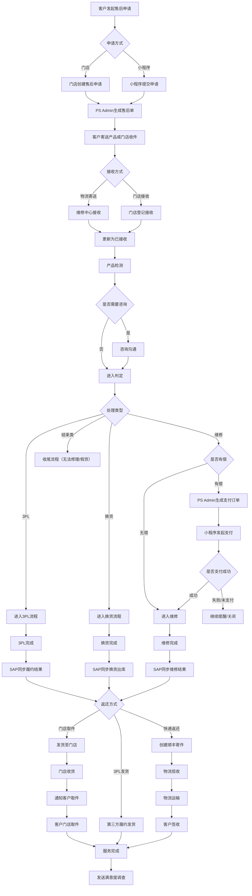

## 3.2 流程说明

整体售后流程如下：

客户通过小程序或门店发起售后申请，系统生成售后工单，并完成产品收件与检测。

根据检测结果，工单将进入不同处理路径：
- 维修（有偿需先完成支付）
- 换货处理
- 3PL / 合作厂家处理
- 或直接结束（无法修理 / 假货等）

处理完成后，系统同步 SAP，并通过快递或门店完成交付。

客户签收后，流程结束，系统自动发送满意度调查问卷。

流程主要分为以下阶段：

1）申请阶段
- 客户发起售后申请  
- 系统生成售后工单  

2）收货与检测阶段  
- 产品寄送或门店接收  
- 产品入库与检测  

3）判定与处理阶段
- 维修判定  
- 咨询（如需客户确认）  
- 支付处理（如为有偿维修）  
- 维修 / 换货 / 外部处理  

4）履约阶段
- 产品出库  
- 门店取件或客户签收  

5）完成阶段
- 服务完成  
- 满意度调查  

系统在关键流程节点（如接收完成、判定结果、支付状态、履约完成等）将同步触发客户通知，用于告知服务进度及结果。
通知支持系统自动触发及人工触发两种方式，具体以业务配置为准。

## 3.3 关键分支流程

### 3.3.1 申请流程

客户可通过以下两种方式发起售后申请：

小程序申请（客户自行提交）
门店申请（门店代客提交）

申请后系统生成工单，并进入收货流程。

说明：

所有申请统一进入同一套流程管理
门店与小程序仅作为入口差异，不影响后续流程
客户在还未进入维修流程前都可以撤销申请

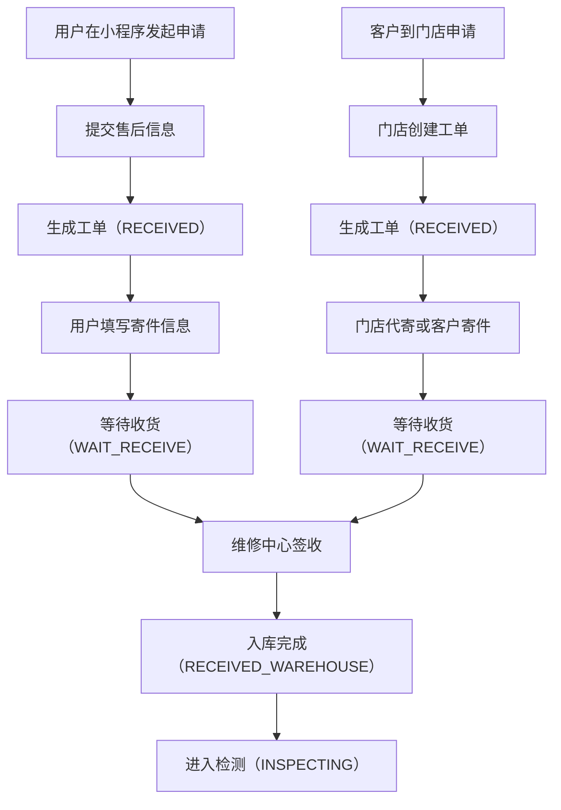

说明：

- 小程序与门店为两个申请入口，但统一由 PS Admin 生成工单
    
- 进入检测前必须完成签收与入库
    
- 申请流程结束后，工单进入检测主流程
    

### 3.3.2 产品接收流程

客户可通过两种方式提交产品：

快递寄送至维修中心
门店收件后转寄

产品到达后完成收货登记及入库，并进入检测阶段。

若收货过程中出现异常（如破损、信息不一致等），需记录并处理。

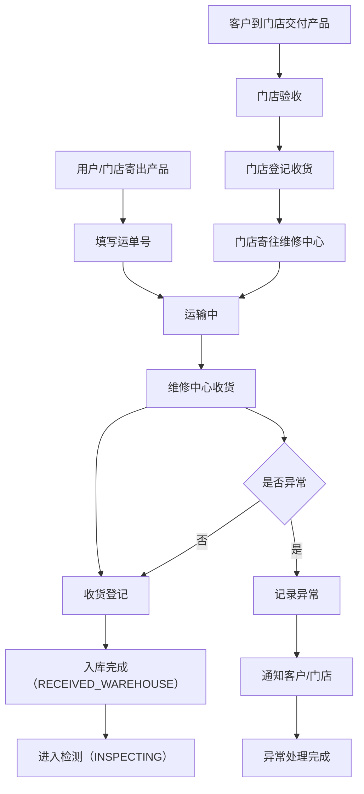

### 3.3.3 检测与判定流程

产品检测完成后，进入判定阶段，根据检测结果决定处理方式：

- 无偿维修
- 有偿维修（需支付）
- 产品更换
- 3PL / 合作厂家处理
- 无法修理
- 假货处理
- 咨询确认（需客户决策）

系统将根据判定结果向客户发送对应通知（如有偿维修、无偿维修、产品更换等），以确保客户及时了解处理方案。

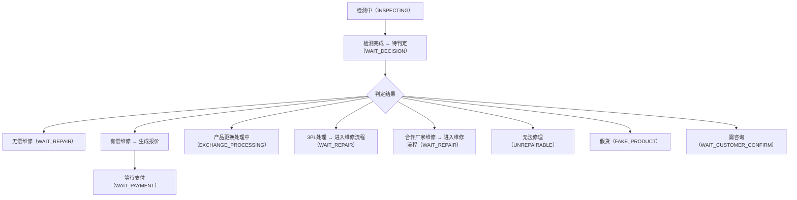

### 3.3.4 咨询流程

咨询状态默认值为“咨询待机”；当“咨询完成”后，状态自动返回判定节点。

在以下场景需发起咨询：

- 维修方案需客户确认
    
- 费用变更
    
- 他品交换

- 异常情况说明

- 合作厂家延迟
    
客户确认后流程继续，若客户拒绝或超时，可关闭工单。

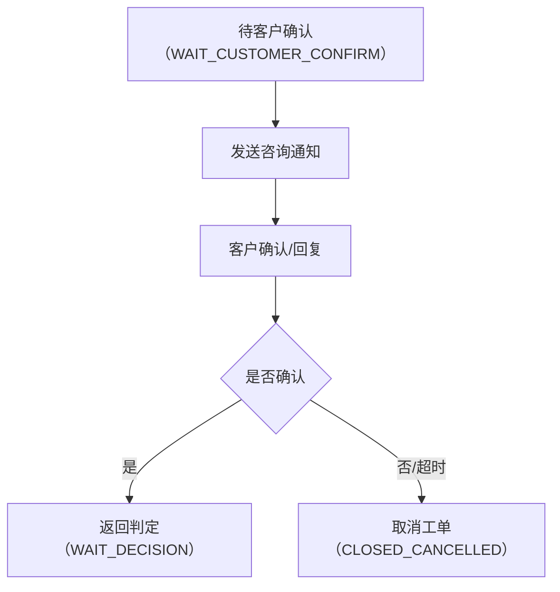

### 3.3.5 支付流程

当工单判定为有偿维修场景时，系统进入支付流程。

当判定为有偿维修时：

系统生成支付订单
客户在小程序完成支付
支付成功后进入维修流程

系统将根据支付状态（待支付、已支付、超时未支付等）触发相应通知及提醒机制。
其中待支付状态下：
- 在“判定完成”后 +D1 起，每天发送 1 次，共发送 5 次
- 最终未付款提醒，在“判定完成”后 +D30 发送一次
- 超时后关闭工单

**确认：**
是否存在线下支付场景？

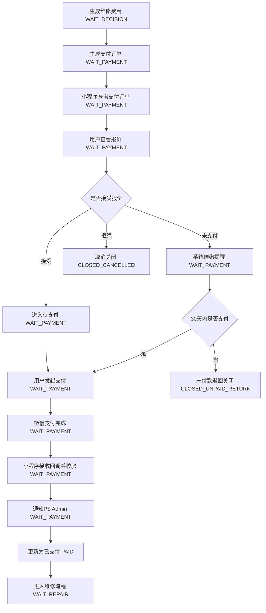

说明：

- 支付流程是有偿场景的独立子流程
    
- 支付成功后并不直接进入维修中，而是先进入待维修状态
    
- 未支付和拒绝报价对应不同关闭路径
    

### 3.3.6 维修执行流程
维修流程包括：

- 进入待维修状态
- 到达时间条件后进入维修中
  
    - 若为 “无偿”：判定完成 +D3 后状态自动变更为 “维修进行中”
    - 若为 “有偿”：付款完成 +D3 后状态自动变更为 “维修进行中”
    - 若为 “3PL”：付款完成 +D1 后状态自动变更为 “维修进行中”

- 执行维修或更换
- 完成后进入待出库

维修过程中可能涉及配件更换与库存扣减。

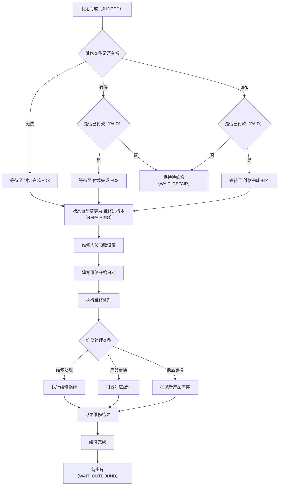
    

### 3.3.7 配件与库存处理流程

在维修处理过程中，若涉及配件更换，系统需执行配件选择、库存校验及配件消耗记录等操作。  
该流程作为维修流程中的子流程执行。

1. 配件选择规则  
    维修人员可对系统默认配件进行确认、修改、新增或删除。
    
2. 库存校验规则  
    系统在维修完成前校验配件库存是否满足消耗需求。
    
3. 库存扣减时机  
    配件库存在“维修完成提交时”统一扣减，避免在维修过程中产生库存不一致问题。
    
4. 库存不足处理  
    当库存不足时，系统应支持：
    
    - 触发配件申请流程
    - 或生成库存预警
        
5. 数据记录  
    系统需记录：
    
    - 配件消耗明细
    - 库存变动记录
    - 操作人及时间
        

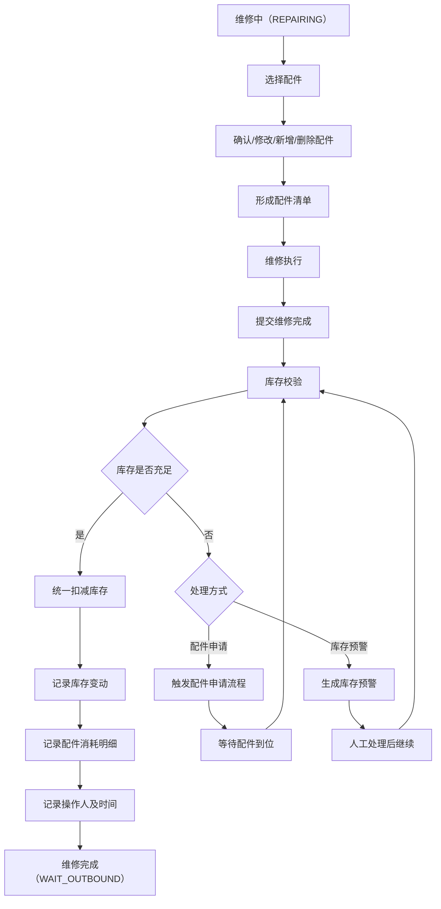

说明：

- 配件与库存流程为维修执行子流程，不单独形成主状态链
    
- 库存扣减统一发生在维修完成提交时
    
- 库存不足时需阻断维修完成提交
    

### 3.3.8 合作厂家 / 3PL 流程

部分工单可由外部执行：

发往合作厂家或3PL
外部完成处理后返回
继续进入出库流程

说明：

- 合作厂家 / 3PL 流程在业务上是外部执行，在系统状态上仍纳入维修主链
- 处理完成后统一返回待出库状态
- 若涉及费用，仍需先经过支付流程

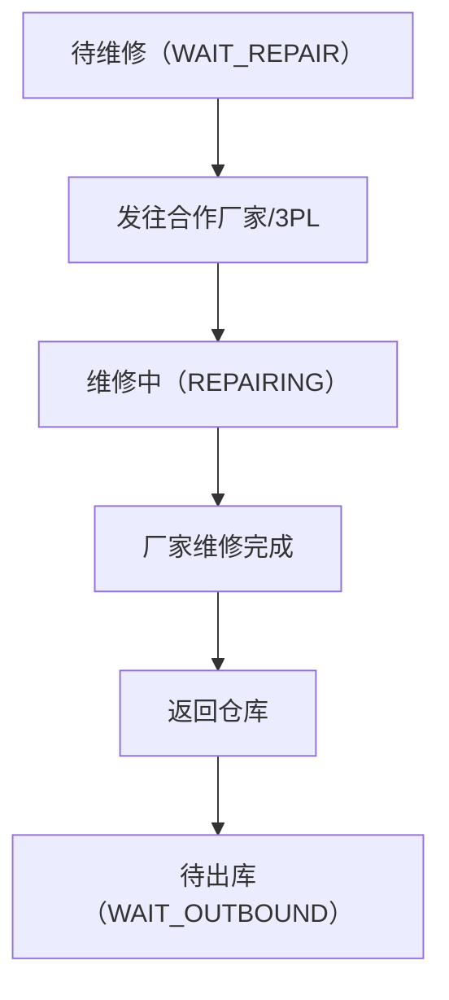
    

### 3.3.9 无法修理 / 假货流程

当判定为无法修理或假货时：

通知客户
工单关闭

**确认：**

是否需要返还产品？
是否存在销毁或回收流程？

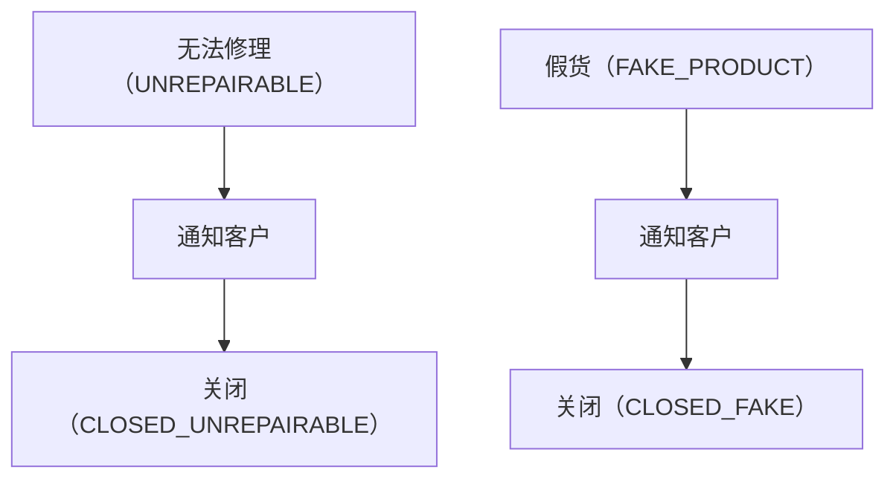
    

### 3.3.10 出库与履约流程

处理完成后进入交付阶段：
在发货、配送及签收等关键节点，系统支持向客户发送履约进度通知。

一、流程说明

1）快递配送场景

系统执行出库并生成物流信息
产品进入配送流程
配送完成后（客户签收），进入“配送完成”状态
系统在配送完成后，按工作日 +D1 自动变更为“服务完成”

2）门店自提场景

系统执行出库并发往门店
门店完成收货后，进入“门店到货”状态
系统在门店收货完成后，按工作日 +D1 自动变更为“服务完成”

说明：
客户实际到店取件仅作为履约记录，不作为服务完成的触发条件。

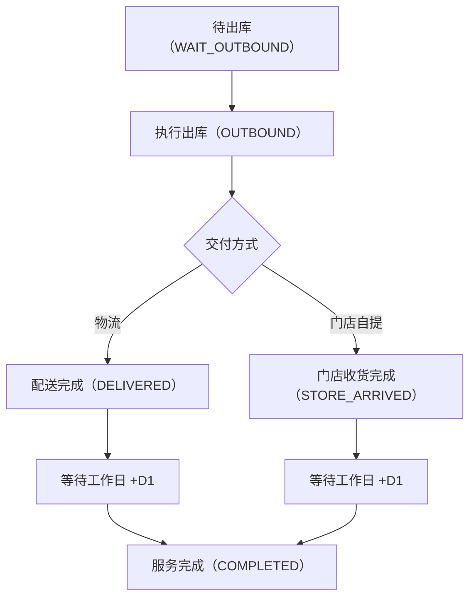

### 3.3.11 问卷流程

服务完成后，系统生成满意度问卷，并由小程序向客户展示与收集反馈。  
PS Admin 负责接收问卷结果并更新问卷及回访信息。

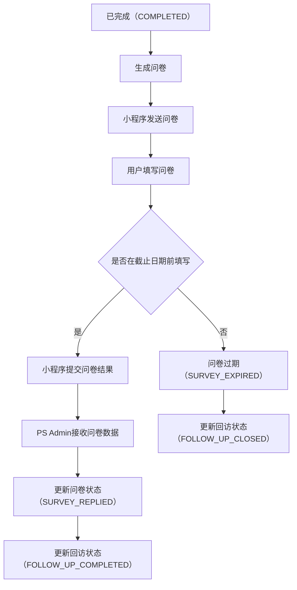

说明：

- 工单进入“服务完成”后，系统自动生成问卷并设置截止日期。
- 问卷由小程序端展示，客户可在截止日期前完成填写。
- 客户提交问卷后，系统记录评分及反馈内容，并更新问卷状态。
- 若客户在截止日期前未填写，问卷自动过期，并关闭回访。
- 问卷与回访数据用于服务质量分析，不影响工单主状态。

### 3.3.12 异常处理流程

系统需支持关键异常处理：

| 异常类型 | 处理方式           |
| -------- | ------------------ |
| 支付失败 | 重新发起或关闭     |
| 支付超时 | 自动关闭工单       |
| 库存不足 | 阻断流程或触发申请 |
| 物流异常 | 人工介入处理       |
| 数据异常 | 系统校验与修复     |
| 咨询超时 | 取消关闭或人工跟进 |

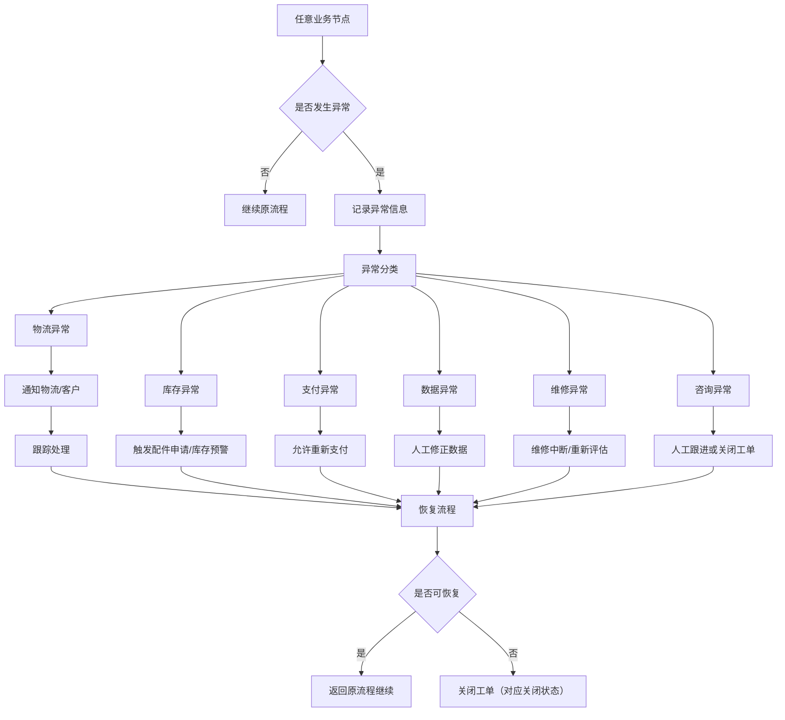

说明：

- 异常处理流程覆盖主流程各节点
    
- 异常是否可恢复，由具体异常类型和业务规则决定
    
- 无法恢复时需落到明确关闭状态，不允许悬空
    

# 4. 外部系统协同说明

## 4.1 小程序

主要职责：

- 用户提交售后申请
- 发起支付
- 查询工单状态
- 填写问卷

### 4.1.1 创建工单

工单由小程序或门店发起申请，由系统统一创建并生成工单编号，确保所有工单入口一致、数据规范统一，并由系统集中管理。

**职责划分**

| 角色          | 职责                           |
| ------------- | ------------------------------ |
| 小程序 / 门店 | 收集客户信息并发起申请         |
| PS Admin      | 创建工单、生成编号、初始化状态 |

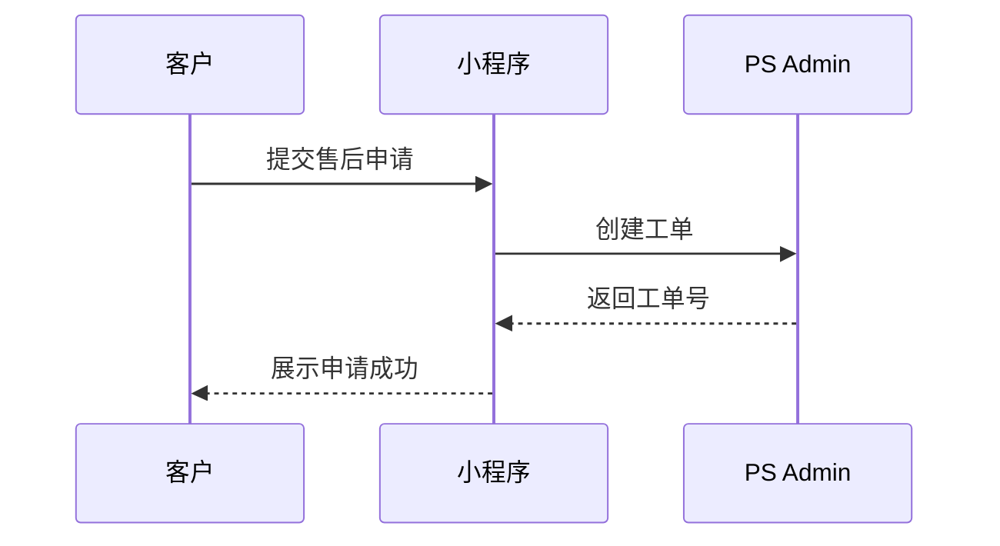

### 4.1.2 支付

PS Admin：负责支付订单生成、支付状态管理、工单状态驱动
小程序：负责支付展示、调用微信支付、接收支付结果并回写
微信支付：负责实际扣款与支付结果返回
系统采用 “支付回写 + 主动查询（补偿机制）”双保障机制，确保支付状态最终一致

**职责划分**

| 角色     | 职责                                     |
| -------- | ---------------------------------------- |
| 小程序   | 展示费用、发起微信支付、回写支付结果     |
| PS Admin | 生成支付订单、更新支付状态、推进工单流程 |

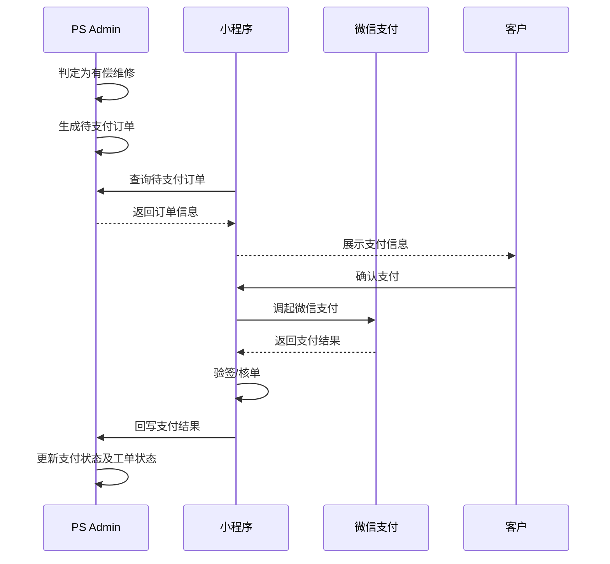

### 4.1.3 查询工单状态

系统负责状态管理与输出，小程序负责查询与展示，确保状态统一、结果一致。

**职责划分**

| 角色     | 职责                   |
| -------- | ---------------------- |
| 小程序   | 发起查询请求并展示状态 |
| PS Admin | 返回统一工单状态结果   |

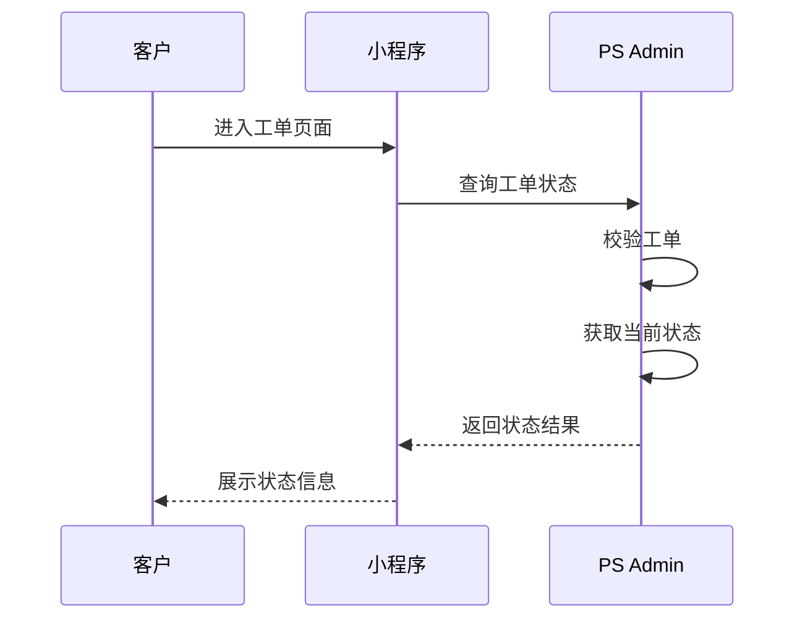

### 4.1.4 问卷调查

问卷由小程序展示并完成填写，系统负责结果接收与数据管理。

**职责划分**

| 角色     | 职责                             |
| -------- | -------------------------------- |
| 小程序   | 展示问卷、收集并提交结果         |
| PS Admin | 接收问卷数据、更新问卷及回访状态 |

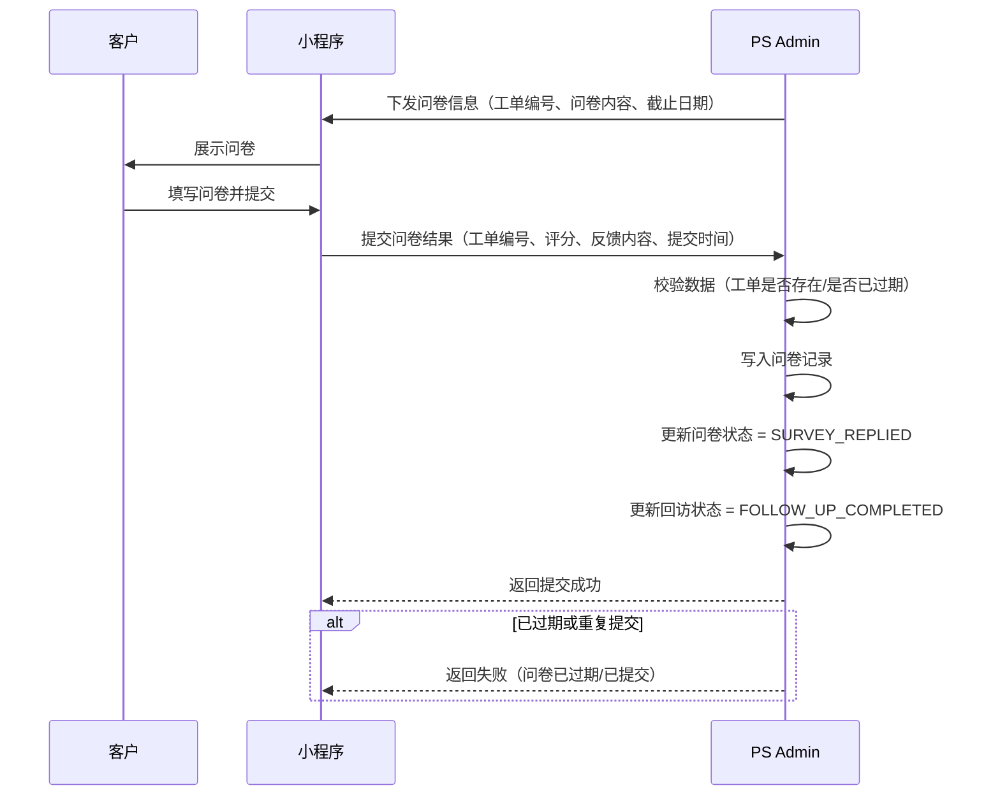

## 4.2 SAP

主要职责：

- 管理产品与库存主数据
- 执行库存出入库
- 提供库存数量同步
- 提供商品数据同步

SAP 提供 SO 条件状态数据（具体字段及状态值由 SAP 接口定义）。

PS Admin 基于返回的条件状态列表进行判断：
当所有条件状态均为「结束」时，
触发 SO 单据编号发送。

## 4.3 物流系统

主要职责：

- 执行揽收、运输、派送
- 提供物流状态
- 提供签收结果

## 4.4 客户通知场景

系统在关键业务节点支持向客户发送通知，用于告知当前处理进度、结果及后续待办事项。通知方式可根据业务配置采用短信、小程序消息。

| 通知场景     | 触发时机                   | 通知对象 | 通知方式      | 说明                                 |
| ------------ | -------------------------- | -------- | ------------- | ------------------------------------ |
| 工单创建成功 | 工单创建完成后             | 客户     | 小程序 / 短信 | 通知客户申请已提交成功               |
| 收货完成     | 产品签收并完成入库后       | 客户     | 短信 / 小程序 | 告知产品已进入检测流程               |
| 判定结果通知 | 检测完成并形成处理方案后   | 客户     | 短信 / 小程序 | 通知无偿、有偿、换货、无法修理等结果 |
| 支付通知     | 有偿维修生成支付订单后     | 客户     | 小程序 / 短信 | 通知客户查看报价并完成支付           |
| 支付提醒     | 待支付期间按规则触发       | 客户     | 短信 / 小程序 | 用于催缴提醒                         |
| 支付成功通知 | 支付结果回写成功后         | 客户     | 短信 / 小程序 | 告知支付完成，流程继续推进           |
| 咨询通知     | 进入咨询流程后             | 客户     | 小程序 / 短信 | 提醒客户进行确认或回复               |
| 出库通知     | 产品完成出库后             | 客户     | 短信          | 告知产品已发出或已送往门店           |
| 履约进度通知 | 配送、签收、门店到货等节点 | 客户     | 短信          | 告知物流或到店进度                   |
| 服务完成通知 | 工单进入服务完成状态后     | 客户     | 短信 / 小程序 | 告知服务已完成                       |
| 问卷通知     | 问卷生成后                 | 客户     | 小程序        | 提醒客户填写满意度问卷               |

说明：

- 通知支持自动触发与人工触发两种方式。
- 通知模板、发送渠道及变量内容支持按业务规则配置。
- 所有通知发送结果需留痕，便于后续查询与追踪。

### 4.4.1 小程序通知

参考4.1

### 4.4.2 短信通知  

主要职责：  
  
- 向客户发送关键业务节点短信通知  
- 返回短信发送结果  
- 支持短信模板配置与变量替换  
- 支持失败重试与发送记录留痕

# 5. 功能模块设计

## 5.0 功能模块总览

本系统主要功能模块如下：

| 模块名称       | 主要作用                                 | 备注                               |
| -------------- | ---------------------------------------- | ---------------------------------- |
| 售后工单管理   | 统一管理售后工单全流程及相关信息         | 可查看工单从申请到完成的全过程     |
| 产品管理       | 管理产品基础资料、库存信息及库存变动记录 | 可查看产品资料、库存状态及库存历史 |
| 库存申请管理   | 管理产品库存申请、审批及处理             | 可提交并跟踪库存申请处理进度       |
| 小零件管理     | 管理维修小零件基础资料及数量配置         | 可维护维修用配件基础信息           |
| 小零件申请管理 | 管理小零件申请、审批及出库               | 可跟踪小零件申请及处理结果         |
| 问卷与回访管理 | 管理客户满意度问卷及回访信息             | 可查看问卷结果及回访状态           |
| 咨询管理       | 管理客户咨询及异常处理记录               | 可跟踪咨询内容、分类和处理情况     |
| 用户权限       | 管理用户、角色与权限范围                 | 可控制不同岗位的可见及可操作范围   |
| 统计报表       | 汇总售后、库存、问卷等业务数据           | 可查看核心业务统计结果             |

说明：

- 各模块围绕工单主线展开，并与支付、SAP、物流、小程序等系统协同。
- 模块之间通过统一工单编号及业务数据关联，形成完整业务闭环。
  

## 5.1 售后工单管理

本模块包括工单列表、工单详情、工单创建、工单编辑及相关业务操作入口，用于支撑售后工单全流程管理。

### 5.1.1 工单列表

**功能说明**
用于展示工单数据列表，支持查询及操作。

**查询条件**
- 所有字段可进行搜索。
- 在条码搜索栏扫描后跳转到详情页面。

**操作按钮**
- 点击「+」按钮可新建工单。
- 点击「Edit」按钮可批量修改数据（状态、服务工程师）。
- Excel 导出。
- 删除工单
- 顺丰发票打印

| 字段名称     | 说明                            | 备注        |
| ------------ | ------------------------------- | ----------- |
| 工单编号     | 售后服务唯一标识                | 系统生成    |
| 接收日期     | 工单受理时间                    |             |
| 状态         | 工单所处流程状态                |             |
| 本社入库日期 | 产品入库时间                    |             |
| 预计出库日期 | 预计完成时间                    |             |
| 受理渠道     | 来源（门店 / 邮寄 / 小程序）    |             |
| 客户姓名     | 客户名称                        |             |
| 联系电话     | 客户联系方式                    |             |
| 邮箱         | 客户邮箱                        |             |
| 产品名称     | 维修产品名称                    |             |
| 维修执行方   | 维修主体（总部 / 合作方 / 3PL） |             |
| 维修内容     | 维修项目                        |             |
| 挂号编号     | 物流单号 / 寄件编号             |             |
| 付款日期     | 支付完成时间                    |             |
| 出库方式     | 配送方式                        | 快递 / 门店 |
| 出库完成日期 | 实际出库时间                    |             |
| SO文件编号   | 关联 SAP 单据                   |             |

### 5.1.3 工单详情

**功能说明**
用于展示工单数据详情。

**操作按钮**
1. 条码打印
2. 库存申请
3. 工单复制时，客户、受理、咨询、产品信息需一并复制。
4. 复制工单中“原工单”字段需显示原工单编号。

#### （1）顶部信息

| 字段名称     | 说明                 | 备注                                                                                           |
| ------------ | -------------------- | ---------------------------------------------------------------------------------------------- |
| 工单编号     | 售后服务工单唯一编号 |                                                                                                |
| SO文件编号   | 关联 SAP SO 文件编号 | SO 文件编号需与SAP系统对接。                                                                   |
| 当前状态     | 工单当前流程状态     |                                                                                                |
| 原工单编号   | 原始 / 关联工单编号  |                                                                                                |
| 消息通知模板 | 通知消息模板         | 在消息（通知短信）中选择自动或手动模板（具备模板搜索功能），点击发送后，消息会自动推送至客户。 |
| 电子邮件模板 | 邮件模板             |                                                                                                |
| 历史记录入口 | 查看工单操作历史     | 页面操作入口                                                                                   |
| 判定负责人   | 当前判定负责人       |                                                                                                |
| 判定负责人ID | 判定负责人标识       |                                                                                                |

#### （2）客户信息

| 字段名称 | 说明        | 备注                                                         |
| -------- | ----------- | ------------------------------------------------------------ |
| 客户姓名 | 客户名称    |                                                              |
| 电话号码 | 联系方式    |                                                              |
| 国家     | 客户国家    |                                                              |
| 邮箱     | 邮箱地址    |                                                              |
| 收货类型 | 门店 / 快递 | 当收货类型为“门店”且收货信息为门店时，应同时显示门店地址地图 |
| 收货地址 | 收货地址    | 进行 3PL 出库并传输至 SAP、WMS 系统时，地址信息应为门店地址  |

#### （3）受理信息

**备注**
- 官网受理的所有字段需与各对应字段联动
- 中国区没有优惠券服务

| 字段名称       | 说明             | 备注                                                                      |
| -------------- | ---------------- | ------------------------------------------------------------------------- |
| 接收日期       | 受理时间         | 接收日期为客户实际提交日期                                                |
| 受理渠道类型   | 门店 / 邮寄      |                                                                           |
| 受理渠道       | 具体受理来源     |                                                                           |
| 受理门店       | 受理门店名称     |                                                                           |
| 是否再维修     | 是否重复维修     |                                                                           |
| 是否紧急维修   | 是否加急         | 当“是否再维修”为 Y 或维修内容为“产品更换”时，“是否紧急维修”自动更新为 Y。 |
| 是否有购买凭证 | 是否提供购买凭证 |                                                                           |
| 是否附保修卡   | 是否提供保修卡   |                                                                           |
| 购买日期       | 产品购买日期     |                                                                           |
| 购买渠道       | 购买来源渠道     |                                                                           |
| 客户请求事项   | 客户诉求说明     | 支持录入客户反馈内容，可根据业务需要扩展为结构化分类                      |

#### （4）受理附件信息

**交互规则**
- 附件信息支持图片上传联动及图片生成/删除按钮

| 字段名称 | 说明         | 备注 |
| -------- | ------------ | ---- |
| 文件名称 | 附件文件名称 |      |
| 标题     | 附件标题     |      |
| 文件类型 | 附件类型     |      |
| 文件大小 | 附件大小     |      |
| 上传时间 | 附件上传时间 |      |
| 上传人   | 附件上传人员 |      |
| 修改时间 | 最近修改时间 |      |
| 修改人   | 最近修改人员 |      |

#### （5）产品信息

| 字段名称                | 说明                       | 备注                                                 |
| ----------------------- | -------------------------- | ---------------------------------------------------- |
| 产品名称                | 受理对象名称               | 当受理对象为产品或配件时展示对应名称                 |
| 产品ID                  | 产品或配件唯一标识         | 与主数据保持一致                                     |
| 类别                    | 受理对象所属类别           | 如产品、配件等；当客户订购配件时自动归类为“配件”     |
| 库存状态                | 当前库存状态信息           | 由主数据自动同步                                     |
| 上市日期                | 产品上市时间               | 由主数据自动同步                                     |
| 生产工厂                | 产品所属生产工厂           | 若为双工厂生产，默认第一工厂，可通过下拉框手动修改。 |
| 电镀 / 焊接维修是否可行 | 是否支持电镀或焊接维修处理 | 用于辅助维修判定，可展示为Y/N                        |
| 配件名称                | 对应配件名称               | 当受理对象为配件或涉及配件时展示                     |
| 配件存放位置            | 配件当前存放位置           | 由主数据自动同步                                     |

#### （6）咨询信息

**备注**
- 咨询信息选择OUTBOUND类型时，“是否希望咨询”自动更新为 Y，并在咨询界面生成咨询工单。

| 字段名称     | 说明             | 备注 |
| ------------ | ---------------- | ---- |
| 是否需要咨询 | 是否触发咨询流程 |      |
| 咨询单号     | 咨询记录编号     |      |
| 外呼类型     | 咨询 / 外呼分类  |      |
| 咨询负责人   | 处理负责人       |      |
| 咨询状态     | 待确认 / 已完成  |      |
| 咨询日期     | 发起时间         |      |
| 异常分类     | 咨询相关异常分类 |      |

#### 库存申请

**交互规则**
由点击顶部【库存申请】按钮打开

| 字段名称         | 说明               | 备注                   |
| ---------------- | ------------------ | ---------------------- |
| 申请负责人       | 提交申请的人员信息 | 从工单中复制           |
| 产品名称         | 申请的产品名称     | 从工单中复制           |
| 申请数量         | 本次申请的产品数量 | 默认为1                |
| 申请原因（大类） | 申请原因一级分类   | 如：维修、补货、调拨等 |
| 申请原因（中类） | 申请原因二级分类   | 依赖大类联动选择       |

#### （7）维修信息

1. SAP 拉取价格时自动标记为“有偿”；
2. 未拉取价格直接保存时默认“免费”；
3. 原为“有偿”后改为“免费”时，维修费用自动为 0，并取消价格判定。
4. 输入“问题现象”时，“是否产品问题”自动更新为 Y。
5. 选择再维修原因时，再维修与否自动变更为「Y」，并以下拉列表形式呈现。

| 字段名称       | 说明                 | 备注                         |
| -------------- | -------------------- | ---------------------------- |
| 总部入库日期   | 产品入库时间         |                              |
| 预计出库日期   | 预计完成时间         |                              |
| 现象           | 现象                 |                              |
| 问题现象       | 问题现象             | 下拉列表                     |
| 问题描述       | 产品问题说明         |                              |
| 客户请求       | 客户需求             |                              |
| 镜片类型       | 镜片类型             | 官网受理的镜片类型需自动联动 |
| 维修中心       | 维修执行地点         |                              |
| 维修工程师     | 维修人员             | 可以更换                     |
| 维修内容       | 维修操作说明         |                              |
| 维修进度日期   | 维修进度更新时间     |                              |
| 合作方出库日期 | 合作方出库时间       |                              |
| 合作方入库日期 | 合作方入库时间       |                              |
| 再维修原因     | 重复维修原因         |                              |
| 是否产品问题   | 是否属于产品质量问题 |                              |
| 维修费用类型   | 有偿 / 无偿          |                              |
| 维修费用       | 百分比               | 基于销售价格的比例           |
| 维修参考事项   | 补充说明             |                              |

#### （8）配件信息

| 字段名称 | 说明           | 备注 |
| -------- | -------------- | ---- |
| 配件名称 | 使用配件名称   |      |
| 配件类型 | 配件分类       |      |
| 数量     | 使用数量       |      |
| 单位     | 数量单位       |      |
| 标准单价 | 标准价格       |      |
| 实际单价 | 实际价格       |      |
| 总价     | 配件合计金额   |      |
| 是否收费 | 是否向客户收费 |      |
| 是否更换 | 是否执行更换   |      |
| 备注     | 补充说明       |      |

#### （9）支付信息

| 字段名称     | 说明             | 备注                             |
| ------------ | ---------------- | -------------------------------- |
| 支付状态     | 待支付 / 已支付  |                                  |
| 支付日期     | 支付时间         |                                  |
| 支付方式     | 微信等支付方式   |                                  |
| 支付授权号   | 支付授权编号     |                                  |
| 支付流水号   | 支付凭证编号     |                                  |
| 最终支付请求 | 最终支付请求标识 |                                  |
| 支付截止日期 | 支付时限         | 自入库日起自动计算并填写 D+29 日 |
| 支付链接     | 支付入口链接     |                                  |
| 是否取消支付 | 是否取消支付     | 可手动取消支付                   |

#### （10）物流信息

| 字段名称     | 说明         | 备注 |
| ------------ | ------------ | ---- |
| 是否出库完成 | 是否已发货   |      |
| 出库完成日期 | 发货时间     |      |
| 配送方式     | 快递 / 门店  |      |
| 配送完成情况 | 配送完成状态 |      |
| 配送日期     | 配送时间     |      |
| 物流单号     | 物流单号     |      |
| 门店提货状态 | 门店提货状态 |      |
| 门店提货日期 | 门店提货时间 |      |

## 5.2 产品管理

本模块用于管理产品基础信息、库存信息及库存变动记录，作为库存管理与售后业务的基础数据来源。

### 5.2.1 数据来源说明

- 产品基础信息由 SAP 系统同步
- 库存数量由 SAP / 仓库系统同步
- 库存存放位置由 PS Admin 维护
- 系统支持定时同步与手动更新

### 5.2.2 产品列表

系统支持：

- 产品信息查询与筛选
- 条码 / 88码识别产品
- 多产品批量出库
- Excel 导入与导出
- 通过上传Excel文件批量修改数据
	1. 字段包括产品名称、产品ID、存放位置。
	2. 仅允许上传修改“存放位置”。
- 库存状态查看
- 库存历史记录查询

| 字段名称     | 说明             | 备注                                                   |
| ------------ | ---------------- | ------------------------------------------------------ |
| 产品ID       | 产品唯一标识     |                                                        |
| 产品名称     | 产品名称         |                                                        |
| 产品类别     | 产品分类         |                                                        |
| 生产工厂1    | 生产来源         | 工厂缺省时可手动选择工厂                               |
| 生产工厂2    | 生产来源         | 工厂缺省时可手动选择工厂                               |
| 生产工厂3    | 生产来源         | 工厂缺省时可手动选择工厂                               |
| 上市日期     | 产品上市时间     |                                                        |
| 零件保有期限 | 维修配件保有周期 |                                                        |
| 库存存放位置 | 库存位置         | 可编辑维护                                             |
| 安全库存状态 | 库存是否低于阈值 | 当SAP库存数量少于5件时显示为“缺货”，5件及以上显示为“-” |
| PS库存数量   | 系统库存数量     |                                                        |
| 3PL库存数量  | 第三方库存数量   |

### 5.2.3 库存变动记录

可根据日期查询并查看数据变更历史，也可下载Excel文件。

| 字段名称   | 说明               | 备注              |
| ---------- | ------------------ | ----------------- |
| 交易编号   | 库存交易唯一编号   |                   |
| 交易时间   | 发生时间           |                   |
| 操作类型   | 入库 / 出库 / 调拨 |                   |
| 产品ID     | 关联产品           |                   |
| 产品名称   | 产品名称           |                   |
| 数量变动   | 增加 / 减少数量    |                   |
| 变动前库存 | 操作前库存         |                   |
| 变动后库存 | 操作后库存         |                   |
| 操作人     | 执行人             |                   |
| 业务来源   | 来源模块           | 工单 / 库存申请等 |
| 备注       | 补充说明           |                   |

## 5.3 库存申请管理

本模块用于管理产品库存申请、调拨申请及审批流程，确保库存流转规范与可追溯。

### 5.3.1 适用场景

- 门店申请产品库存
- 维修中心申请产品
- 产品库存调拨
- 仓库补货申请

### 5.3.2 库存申请列表
系统支持：

- 所有字段均可搜索。
- 进度状态可批量修改。
- 处理时间和处理人默认为当天与操作负责人，可手动修改。
- Excel 导出
- 工单删除

| 字段名称 | 说明             | 备注                   |
| -------- | ---------------- | ---------------------- |
| 申请编号 | 库存申请唯一编号 | 系统生成               |
| 申请时间 | 提交时间         |                        |
| 申请主体 | 申请来源         | 门店 / 维修中心 / 仓库 |
| 申请人   | 负责人           |                        |
| 门店名称 | 申请门店         |                        |
| 产品名称 | 申请产品         |                        |
| 产品ID   | 产品标识         |                        |
| 存放位置 | 库存位置         |                        |
| 申请数量 | 申请数量         |                        |
| 申请原因 | 原因说明         | 补货 / 调拨等          |
| 状态     | 申请状态         | 见状态说明             |
| 处理人   | 处理负责人       |                        |
| 处理时间 | 处理时间         |                        |

### 5.3.3 库存申请详情

#### （1）基础信息

| 字段名称 | 说明     | 备注 |
| -------- | -------- | ---- |
| 申请编号 | 唯一编号 |      |
| 申请主体 | 来源     |      |
| 申请人   | 负责人   |      |
| 门店名称 | 门店     |      |
| 申请时间 | 时间     |      |

#### （2）产品信息

| 字段名称 | 说明     | 备注 |
| -------- | -------- | ---- |
| 产品ID   | 产品标识 |      |
| 产品名称 | 名称     |      |
| 存放位置 | 库存位置 |      |
| 申请数量 | 数量     |      |
| 申请原因 | 原因     |      |

#### （3）处理信息

| 字段名称 | 说明     | 备注 |
| -------- | -------- | ---- |
| 状态     | 当前状态 |      |
| 处理人   | 负责人   |      |
| 处理时间 | 时间     |      |
| 审批意见 | 说明     |      |

### 5.3.4 状态流转规则

待审批 → 已通过 → 已出库 → 完成  
　　　　↘ 已拒绝

### 5.3.5 业务规则

1. 申请必须生成唯一编号  
2. 库存不足时需提示或限制申请  
3. 审批通过后方可执行出库  
4. 出库完成后自动记录库存变动  
5. 不同申请主体可配置不同审批流程

## 5.4 小零件管理  
  
本模块用于管理维修过程中使用的小零件基础资料、数量配置及展示信息，作为小零件申请、维修配件使用及库存管理的基础数据来源。  
  
### 5.4.1 数据来源说明  
  
- 小零件基础信息由系统维护  
- 小零件数量规则由系统配置维护  
  
### 5.4.2 小零件列表  
  
| 字段名称     | 说明            | 备注                 |
| ------------ | --------------- | -------------------- |
| 配件ID       | 小零件唯一标识  |                      |
| 配件名称     | 小零件名称      |                      |
| 配件类型     | 小零件分类      |                      |
| 数量类型     | 数量配置类型    | 用于不同场景数量展示 |
| 数量值       | 默认数量值      |                      |
| 颜色         | 小零件颜色      |                      |
| 规格         | 小零件规格      |                      |
| 配件存放位置 | 库存存放位置    | 可编辑维护           |
| 状态         | 启用 / 停用状态 |                      |
| 创建时间     | 创建时间        |                      |
| 更新时间     | 最后更新时间    |                      |
  
  
### 5.4.3 小零件详情  
  
#### （1）基础信息  
  
| 字段名称     | 说明           | 备注 |
| ------------ | -------------- | ---- |
| 配件ID       | 小零件唯一标识 |      |
| 配件名称     | 小零件名称     |      |
| 配件类型     | 分类           |      |
| 规格         | 规格信息       |      |
| 颜色         | 颜色信息       |      |
| 配件存放位置 | 库存位置       |      |
| 状态         | 启用 / 停用    |      |
| 创建时间     | 创建时间       |      |
| 更新时间     | 最后更新时间   |      |
  
  
#### （2）数量配置信息  
  
| 字段名称 | 说明               | 备注                    |
| -------- | ------------------ | ----------------------- |
| 数量类型 | 数量配置类型       | 如门店、维修、3PL等场景 |
| 数量名称 | 数量配置名称       |                         |
| 默认数量 | 默认申请或使用数量 |                         |
| 状态     | 配置状态           |                         |
| 排序     | 显示顺序           |                         |
  

## 5.5 小零件申请管理

本模块用于管理门店、维修中心、3PL 等场景下的小零件申请、审批及出库处理，统一规范配件申请流程及库存消耗记录。

### 5.5.1 适用场景

小零件申请适用于以下业务场景：

- 门店补件申请
- 维修中心维修配件消耗申请
- 3PL 维修 / 履约配件申请（仅限具备维修能力的 3PL）
- 仓库安全库存补货申请
- 临时手工申请

说明：

当 3PL 仅承担物流职责时，不允许发起小零件申请。               

### 5.5.2 小零件申请列表

| 字段名称     | 说明               | 备注                         |
| ------------ | ------------------ | ---------------------------- |
| 申请单号     | 小零件申请唯一编号 | 系统自动生成                 |
| 请求时间     | 申请提交时间       |                              |
| 申请主体     | 申请来源           | 门店 / 维修中心 / 3PL / 仓库 |
| 请求负责人   | 申请人             |                              |
| 门店类型     | 门店分类           | 仅门店场景                   |
| 门店名称     | 申请门店           |                              |
| 产品名称     | 关联产品           | 特定配件必填                 |
| 配件名称     | 申请小零件         |                              |
| 配件类型     | 配件分类           |                              |
| 配件存放位置 | 库存位置           | 系统自动带出                 |
| 颜色         | 配件颜色           |                              |
| 数量         | 申请数量           | 单位：组 / 个                |
| 申请原因     | 申请原因说明       | 维修 / 补货等                |
| 状态         | 申请处理状态       | 见状态说明                   |
| 处理人       | 处理负责人         |                              |
| 处理时间     | 处理时间           |                              |

### 5.5.3 小零件申请详情

#### （1）基础信息

| 字段名称   | 说明     | 备注         |
| ---------- | -------- | ------------ |
| 申请单号   | 唯一编号 |              |
| 申请主体   | 来源部门 |              |
| 请求负责人 | 申请人   |              |
| 门店类型   | 门店分类 |              |
| 门店名称   | 门店名称 |              |
| 来源工单ID | 关联工单 | 维修场景必填 |

#### （2）配件明细信息

| 字段名称     | 说明     | 备注         |
| ------------ | -------- | ------------ |
| 产品名称     | 关联产品 | 特定配件必填 |
| 配件ID       | 配件标识 |              |
| 配件名称     | 名称     |              |
| 配件类型     | 分类     |              |
| 颜色         | 颜色     |              |
| 配件存放位置 | 库存位置 | 自动带出     |
| 数量         | 申请数量 |              |
| 申请原因     | 申请原因 |              |
| 备注         | 补充说明 |              |

#### （3）处理信息

| 字段名称 | 说明       | 备注 |
| -------- | ---------- | ---- |
| 状态     | 当前状态   |      |
| 处理人   | 处理负责人 |      |
| 处理时间 | 处理时间   |      |
| 审批意见 | 审批说明   |      |

### 5.5.4 状态流转规则

小零件申请流程采用标准状态流转：

待审批 → 已通过 → 已出库 → 完成  
　　　　↘ 已拒绝

说明：

- 待审批：申请已提交，等待处理
- 已通过：审批通过，允许出库
- 已出库：库存已扣减，完成发放
- 完成：流程结束
- 已拒绝：审批未通过

## 5.6 问卷与回访管理

本模块用于在服务完成后生成客户满意度问卷，并由小程序端完成问卷展示、填写及回传。

### 5.6.1 问卷列表

**系统支持**
1. 按问卷截止日期筛选
2. 导出 Excel
	* 按照字段顺序导出
	* 可在已应用筛选条件的状态下进行导出

| 字段名称     | 说明         | 备注 |
| ------------ | ------------ | ---- |
| 工单编号     | 关联工单     |      |
| 问卷截止日期 | 问卷截止时间 |      |
| 问卷标题     | 问卷名称     |      |
| 维修内容     | 关联维修内容 |      |
| 回访状态     | 是否已回访   |      |
| 内容摘要     | 反馈摘要     |      |

### 5.6.2 问卷详情

| 字段名称 | 说明         | 备注 |
| -------- | ------------ | ---- |
| 工单编号 | 关联工单     |      |
| 问卷标题 | 问卷名称     |      |
| 问卷内容 | 问题内容     |      |
| 评分     | 客户评分     |      |
| 客户反馈 | 意见内容     |      |
| 问卷状态 | 是否完成     |      |
| 回访状态 | 是否回访     |      |
| 发送时间 | 问卷发送时间 |      |
| 截止日期 | 问卷期限     |      |
| 回复时间 | 客户提交时间 |      |
| 回访人   | 回访负责人   |      |
| 回访时间 | 回访处理时间 |      |
| 备注     | 补充说明     |      |

## 5.7 咨询管理

**功能说明**  
用于记录售后过程中的客户咨询信息，支持咨询内容录入、分类管理及处理跟踪，为后续服务分析与回访提供数据支撑。

### 5.7.1 咨询列表

**操作按钮**
- 新增咨询
- 导出
  
| 字段名称     | 说明                       | 备注                                                                    |
| ------------ | -------------------------- | ----------------------------------------------------------------------- |
| 工单编号     | 关联的售后工单编号         | 跳转至对应的工单页面                                                    |
| 客户名称     | 客户姓名                   |                                                                         |
| 客户反应     | 客户反馈或问题描述         | 客户感动、客户满意、中立、不满、强烈不满                                |
| 咨询分类     | 咨询类型分类               | 枚举                                                                    |
| 例外处理分类 | 是否属于异常或特殊处理类型 | 维修费用/配送周期/同款产品更换/更换其他产品/镜片补偿/折旧/产品退款/其他 |
| 咨询负责人   | 负责处理咨询的人员         |                                                                         |
| 咨询日期     | 咨询发生时间               |                                                                         |
| 状态         | 咨询处理状态               | 如：待处理 / 已完成                                                     |
| 操作         | 查看 / 编辑                |                                                                         |

## 5.8 用户权限

### 5.8.1 用户列表

| 字段名称 | 说明     | 备注 |
| -------- | -------- | ---- |
| 用户ID   | 唯一标识 |      |
| 用户名   | 姓名     |      |
| 职位     | 岗位信息 |      |
| 部门     | 所属部门 |      |
| 角色     | 权限角色 |      |
| 编号     | 员工编号 |      |

### 5.8.2 用户详情

| 字段名称 | 说明     | 备注 |
| -------- | -------- | ---- |
| 用户ID   | 唯一标识 |      |
| 用户名   | 姓名     |      |
| 角色     | 权限角色 |      |
| 部门     | 所属部门 |      |
| 生效日期 | 开始时间 |      |
| 失效日期 | 结束时间 |      |

