# 1 项目概述

本项目旨在为 Gentle Monster 中国区构建一套覆盖售后全流程的管理系统，支持维修流程管理、配件库存协同及多渠道客户服务。系统将作为客户服务的核心平台，实现流程统一、状态可控及多系统协同，支撑售后业务高效运行。

## 1.1 项目目标  

- 建立统一的售后流程与状态管理体系  
- 提升工单处理效率，优化跨系统协同能力  
- 实现小程序、SAP、物流及支付系统的数据打通  
- 提供清晰的服务进度与用户交互能力  
- 支撑售后数据统计与运营分析

## 1.2 项目范围

统一管理售后服务从申请到完成的各业务环节，规范流程执行，统一状态管理，并实现与各相关系统的数据协同。

### 1.2.1 业务范围

支持多种售后处理模式，包括维修、换货、外部处理及异常处理等典型业务场景。


### 1.2.2 功能范围

系统围绕售后工单生命周期，提供流程管理、业务处理、外部系统协同及消息通知等核心能力。


### 1.2.3 系统集成

系统需与以下外部系统协同：

- 小程序（申请入口、状态查询、支付）
    
- SAP（库存与财务）
    
- 物流系统（寄件与状态同步）

PS Admin 作为流程控制与状态管理中心。


### 1.2.4 不包含范围

本系统不涉及：

- SAP、物流、支付系统的内部逻辑改造
    
- 物流履约能力建设
    
- 支付清结算能力实现
    
- 非售后相关系统建设


### 1.2.5 流程范围边界定义

|流程环节|是否系统内|责任系统|说明|
|---|---|---|---|
|申请|是|小程序 / PS Admin|用户或门店发起|
|受理|是|PS Admin|生成工单|
|收货|否|物流系统|仅同步状态|
|检测|是|PS Admin|录入检测结果|
|判定|是|PS Admin|生成处理方案|
|咨询|是|PS Admin + 小程序|用户确认|
|支付|部分|支付系统|PS Admin仅管理订单|
|维修|部分|PS Admin / 外部|可能由厂家执行|
|出库|否|SAP|PS Admin发起|
|履约|否|物流系统|仅跟踪|
|完成|是|PS Admin|流程闭环|


## 1.3 系统边界与职责划分

PS Admin 作为中国区售后业务的核心系统，负责工单流程驱动、状态管理及业务编排。

在整体售后体系中，PS Admin 作为主控系统，统一接收并处理支付、库存、物流等外部系统返回的业务结果，确保流程按既定规则推进并形成闭环。

外部系统负责具体业务执行（如支付处理、库存操作、物流履约等），不参与流程决策。


### 1.3.1 总体职责定义

|职责类型|说明|
|---|---|
|流程控制|驱动售后全流程（申请→检测→判定→处理→履约→完成）|
|状态管理|维护工单全生命周期状态，作为统一状态来源|
|业务编排|根据判定结果驱动不同处理路径（维修/换货/关闭等）|
|数据整合|汇总支付、库存、物流等外部系统数据|
|异常处理|处理支付失败、库存不足、物流异常等情况|


### 1.3.2 外部系统职责划分

#### 1 支付系统

|系统|职责|
|---|---|
|微信支付|提供支付能力并返回支付结果|
|支付侧（小程序）|发起支付并同步支付结果|
|PS Admin|创建支付订单并根据结果驱动流程|


#### 2 库存 / SAP 系统

|系统|职责|
|---|---|
|SAP|库存管理、出入库执行及主数据维护|
|PS Admin|发起库存请求并记录业务结果|


#### 3 物流系统

|系统|职责|
|---|---|
|物流系统|负责揽收、运输、派送及签收|
|PS Admin|记录运单并跟踪物流状态|


#### 4 小程序（客户端）

|系统|职责|
|---|---|
|小程序|用户操作入口，负责申请、支付及状态查询|
|PS Admin|提供业务接口并驱动流程状态变化|


### 1.3.3 异常处理责任划分

|异常类型|责任系统|是否阻断流程|处理方式|
|---|---|---|---|
|支付失败|小程序支付端|是|返回失败原因，支持重试|
|库存不足|SAP|是|阻断流程，触发库存申请|
|物流异常|物流系统|否|记录异常，支持人工处理|
|接口异常|PS Admin|否|自动重试 + 日志记录|
|数据异常|PS Admin|否|数据校验与修正|


### 1.3.4 设计约束

系统采用状态驱动的流程模型，所有关键操作需具备可追踪能力（日志 + 时间记录），并支持幂等处理及异常重试机制。


### 1.3.5 用户角色定义

|角色|说明|
|---|---|
|客户|发起售后申请并参与流程|
|门店人员|线下受理及代客操作|
|客服人员|处理咨询及工单协同|
|维修人员|执行检测与维修操作|
|系统管理员|系统配置及管理|


### 1.3.6 术语定义

|术语|说明|
|---|---|
|PS Admin|售后管理系统核心后台|
|工单（Service Ticket）|售后流程的核心业务载体|
|3PL|第三方物流或服务提供商|
|SAP|企业ERP系统|
|状态（Status）|工单当前业务阶段|
|动作（Action）|触发状态变更的操作|


# 2 业务与系统总体设计

## 2.1 业务架构概述

本系统以售后工单为核心，通过统一的流程与状态管理，实现售后服务从申请到完成的全生命周期管理。

系统由 PS Admin 作为核心控制中心，负责流程编排与状态管理，并与小程序、门店、SAP、物流及支付系统协同，实现流程控制与业务执行分离。

其中，支付由小程序发起并完成，PS Admin 负责支付订单管理及结果接收。

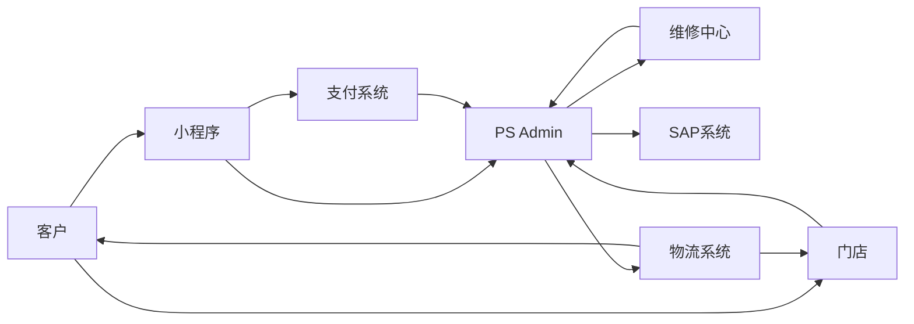
```mermaid
flowchart LR

Customer[客户]
MiniApp[小程序]
Store[门店]
Admin[PS Admin]
Repair[维修中心]
SAP[SAP系统]
Logistics[物流系统]
Payment[支付系统]

Customer --> MiniApp
Customer --> Store

MiniApp --> Admin
Store --> Admin

Admin --> Repair
Repair --> Admin

Admin --> SAP
Admin --> Logistics

MiniApp --> Payment
Payment --> Admin

Logistics --> Customer
Logistics --> Store
```

---

## 2.2 核心业务对象与领域模型

系统以售后工单作为核心业务载体，统一管理售后服务过程中各类业务数据与操作行为。

### 2.2.1 核心业务对象

|业务对象|说明|
|---|---|
|售后工单|售后流程的核心载体，贯穿全生命周期|
|客户|售后服务发起方|
|产品|维修或更换对象|
|配件|维修过程中使用的物料|
|支付订单|有偿维修费用载体，由PS Admin创建，小程序完成支付|
|物流单|寄送与返还的物流信息|
|咨询记录|客户沟通与确认记录|
|库存记录|库存状态及变动记录|


### 2.2.2 领域模型说明

所有业务对象通过售后工单进行关联，形成完整业务闭环：

- 一个工单对应一次售后服务
    
- 所有业务数据统一归集到工单
    
- 工单状态变化驱动业务流程推进
    
- 系统通过工单实现全过程追踪与管理
    

### 2.2.3 领域模型结构图

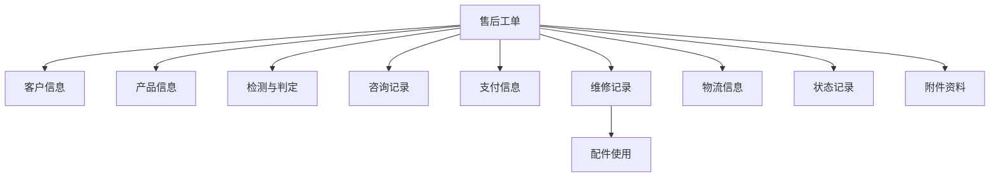
```mermaid
flowchart TD

A[售后工单]

A --> B[客户信息]
A --> C[产品信息]
A --> D[检测与判定]
A --> E[咨询记录]
A --> F[支付信息]
A --> G[维修记录]
G --> H[配件使用]
A --> I[物流信息]
A --> J[状态记录]
A --> K[附件资料]
```


## 2.3 业务流程总览

本章节流程用于业务理解与客户评审，采用业务语言描述。  
系统实际执行逻辑以第3章状态机模型为准。


### 2.3.1 主流程

```text
申请 → 受理 → 收货 → 检测 → 判定 → 处理 → 出库 → 履约 → 完成
```


### 2.3.2 分支流程

在主流程基础上，系统支持以下分支流程：

- 咨询流程（客户确认）
    
- 支付流程（由小程序发起并完成）
    
- 换货流程（同品 / 他品）
    
- 合作厂家 / 3PL 流程
    
- 无法修理 / 假货流程
    
- 异常处理流程
    


### 2.3.3 流程总览图

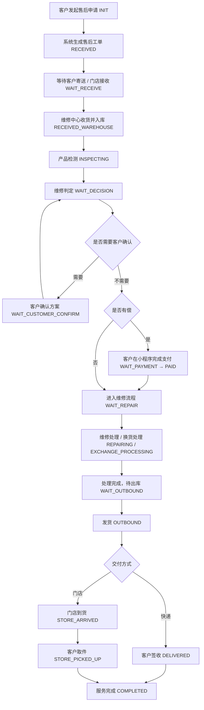
```mermaid
flowchart TD

A[客户发起售后申请 INIT] --> B[系统生成售后工单 RECEIVED]

B --> C[等待客户寄送 / 门店接收 WAIT_RECEIVE]
C --> D[维修中心收货并入库 RECEIVED_WAREHOUSE]

D --> E[产品检测 INSPECTING]
E --> F[维修判定 WAIT_DECISION]

F --> G{是否需要客户确认}

G -->|需要| H[客户确认方案 WAIT_CUSTOMER_CONFIRM]
H --> F

G -->|不需要| I{是否有偿}

I -->|是| J[客户在小程序完成支付 WAIT_PAYMENT → PAID]
J --> K[进入维修流程 WAIT_REPAIR]

I -->|否| K

K --> L[维修处理 / 换货处理 REPAIRING / EXCHANGE_PROCESSING]

L --> M[处理完成，待出库 WAIT_OUTBOUND]

M --> N[发货 OUTBOUND]

N --> O{交付方式}

O -->|快递| P[客户签收 DELIVERED]
O -->|门店| Q[门店到货 STORE_ARRIVED]

Q --> R[客户取件 STORE_PICKED_UP]

P --> S[服务完成 COMPLETED]
R --> S
```


## 2.4 流程节点与状态映射关系

为保证流程与系统实现一致，流程节点与状态关系如下：

|流程节点|对应状态|
|---|---|
|系统生成售后工单|RECEIVED|
|等待寄送|WAIT_RECEIVE|
|收货入库|RECEIVED_WAREHOUSE|
|产品检测|INSPECTING|
|维修判定|WAIT_DECISION|
|客户确认|WAIT_CUSTOMER_CONFIRM|
|待支付|WAIT_PAYMENT|
|已支付|PAID|
|进入维修|WAIT_REPAIR|
|维修中|REPAIRING|
|换货处理|EXCHANGE_PROCESSING|
|他品换货|OTHER_PRODUCT_EXCHANGE|
|无法修理|UNREPAIRABLE|
|假货|FAKE_PRODUCT|
|待出库|WAIT_OUTBOUND|
|已出库|OUTBOUND|
|已送达|DELIVERED|
|门店到货|STORE_ARRIVED|
|门店取件|STORE_PICKED_UP|
|服务完成|COMPLETED|


## 2.5 功能模块划分

系统按照业务域划分为多个功能模块：

|模块名称|模块定位|核心能力|
|---|---|---|
|售后工单管理|核心模块|工单创建、受理、状态流转|
|维修管理|执行模块|维修执行与记录|
|产品管理|主数据模块|产品信息管理|
|小零件管理|维修支撑模块|小零件管理与消耗记录|
|库存申请管理|运营模块|库存申请与审批|
|物流管理|履约模块|物流跟踪与状态同步|
|问卷与回访管理|系统模块|用于满意度调查问卷生成、发送、回收、状态跟踪|
|权限管理|系统模块|用户与权限控制|


## 2.6 模块与状态关系

|模块|负责状态|说明|
|---|---|---|
|工单管理|RECEIVED、WAIT_RECEIVE|工单创建与受理|
|检测判定|INSPECTING、WAIT_DECISION|检测与判定|
|咨询模块|WAIT_CUSTOMER_CONFIRM|客户确认|
|支付模块|WAIT_PAYMENT、PAID|支付管理|
|维修模块|WAIT_REPAIR、REPAIRING|维修执行|
|履约模块|OUTBOUND、DELIVERED、STORE_*|物流与交付|
|关闭模块|COMPLETED、CLOSED_*|流程结束|


## 2.7 设计原则

为确保系统具备良好的扩展性与可维护性，整体设计遵循以下原则：

### 1 工单驱动原则

所有售后业务围绕售后工单展开

### 2 状态驱动原则

业务流程由状态变化驱动

### 3 流程与执行分离原则

PS Admin 负责流程控制，外部系统负责业务执行

### 4 单一数据来源原则

关键数据在指定系统维护

### 5 系统解耦原则

系统之间通过接口交互

### 6 可扩展性原则

支持新增业务与流程扩展


# 3 业务流程设计

## 3.1 流程设计说明

本章节用于描述售后业务在系统中的整体流程及各关键业务环节的处理逻辑。

为兼顾客户评审可读性与系统实现可落地性，本章节分为两层表达：

1. 业务流程视角：用于说明客户实际看到和参与的业务过程
    
2. 状态机视角：用于说明系统如何通过状态与动作控制流程流转
    

流程设计遵循以下原则：

- 以售后工单为核心驱动业务流转
    
- 以状态变化作为流程推进依据
    
- 支持多业务分支（维修 / 换货 / 退回 / 无法修理等）
    
- 支持跨系统协同
    
- 支持异常处理与流程闭环
    

## 3.1.1 时间规则说明

- D1、D2、D3 表示工作日不包含节假日，从状态变更时间开始计算
    
- 统一以系统时间为计算基准

## 3.2 服务流程总览

### 3.2.1 业务流程总览
（面向客户/业务）

本节用于从整体层面展示售后业务全流程路径，帮助理解业务流转逻辑。  
该流程用于业务理解与客户评审，不作为具体系统状态流转的唯一依据，具体状态控制规则详见后续章节。

流程主要包括：

1. 客户发起售后申请
    
2. 系统生成售后单
    
3. 产品寄送或门店接收
    
4. 产品入库与检测
    
5. 维修判定
    
6. 咨询
    
7. 支付处理
    
8. 维修 / 换货 / 外部处理
    
9. 产品出库
    
10. 门店取件或客户签收
    
11. 服务完成
    
12. 满意度调查
    

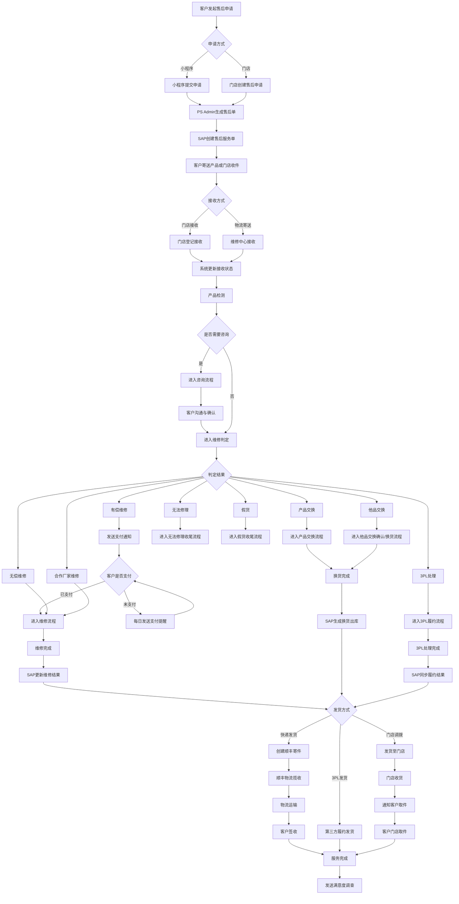
```mermaid
flowchart TD

A[客户发起售后申请] --> B{申请方式}

B -->|小程序| C[小程序提交申请]
B -->|门店| D[门店创建售后申请]

C --> E[PS Admin生成售后单]
D --> E

E --> ES[SAP创建售后服务单]

ES --> F[客户寄送产品或门店收件]

F --> G{接收方式}
G -->|门店接收| H[门店登记接收]
G -->|物流寄送| I[维修中心接收]

H --> J[系统更新接收状态]
I --> J

J --> K[产品检测]

K --> L{是否需要咨询}
L -->|是| M[进入咨询流程]
M --> N[客户沟通与确认]
N --> O[返回维修判定]
L -->|否| O[进入维修判定]

O --> P{判定结果}

P --> Q[有偿维修]
P --> R[无偿维修]
P --> S[产品交换]
P --> T[他品交换]
P --> U[3PL处理]
P --> V[合作厂家维修]
P --> W[无法修理]
P --> X[假货]

Q --> Y[发送支付通知]
Y --> Z{客户是否支付}
Z -->|已支付| AA[进入维修流程]
Z -->|未支付| AB[每日发送支付提醒]
AB --> Z

R --> AA
V --> AA

S --> AC[进入产品交换流程]
T --> AD[进入他品交换确认/换货流程]
U --> AE[进入3PL履约流程]
W --> AF[进入无法修理收尾流程]
X --> AG[进入假货收尾流程]

AA --> AH[维修完成]
AC --> AI[换货完成]
AD --> AI
AE --> AJ[3PL处理完成]

AH --> SAP1[SAP更新维修结果]
AI --> SAP2[SAP生成换货出库]
AJ --> SAP3[SAP同步履约结果]

SAP1 --> AK{发货方式}
SAP2 --> AK
SAP3 --> AK

AK -->|门店调拨| AL[发货至门店]
AK -->|快递发货| AM[创建顺丰寄件]
AK -->|3PL发货| AN[第三方履约发货]

AM --> AO[顺丰物流揽收]
AO --> AP[物流运输]
AP --> AQ[客户签收]

AL --> AR[门店收货]
AR --> AS[通知客户取件]
AS --> AT[客户门店取件]

AQ --> AU[服务完成]
AN --> AU
AT --> AU

AU --> AV[发送满意度调查]
```

### 3.2.2 状态流程总览
（面向系统/开发）

本节用于说明业务流程在系统中的状态路径，所有状态需纳入状态模型统一管理。

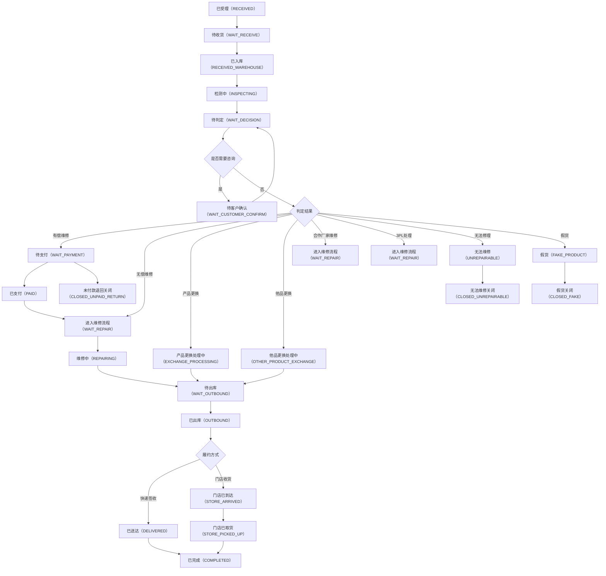
```mermaid
flowchart TD

A[已受理（RECEIVED）] --> B[待收货（WAIT_RECEIVE）]
B --> C[已入库（RECEIVED_WAREHOUSE）]
C --> D[检测中（INSPECTING）]
D --> E[待判定（WAIT_DECISION）]

E --> F{是否需要咨询}
F -->|是| G[待客户确认（WAIT_CUSTOMER_CONFIRM）]
G --> E
F -->|否| H{判定结果}

H -->|有偿维修| I[待支付（WAIT_PAYMENT）]
I --> J[已支付（PAID）]
J --> K[进入维修流程（WAIT_REPAIR）]

H -->|无偿维修| K
H -->|产品更换| L[产品更换处理中（EXCHANGE_PROCESSING）]
H -->|他品更换| M[他品更换处理中（OTHER_PRODUCT_EXCHANGE）]
H -->|合作厂家维修| N[进入维修流程（WAIT_REPAIR）]
H -->|3PL处理| O[进入维修流程（WAIT_REPAIR）]
H -->|无法修理| P[无法维修（UNREPAIRABLE）]
H -->|假货| Q[假货（FAKE_PRODUCT）]

K --> R[维修中（REPAIRING）]
R --> S[待出库（WAIT_OUTBOUND）]

L --> S
M --> S

S --> T[已出库（OUTBOUND）]

T --> U{履约方式}
U -->|快递签收| V[已送达（DELIVERED）]
U -->|门店收货| W[门店已到达（STORE_ARRIVED）]
W --> X[门店已取货（STORE_PICKED_UP）]

V --> Y[已完成（COMPLETED）]
X --> Y

P --> Z[无法维修关闭（CLOSED_UNREPAIRABLE）]
Q --> AA[假货关闭（CLOSED_FAKE）]
I --> AB[未付款退回关闭（CLOSED_UNPAID_RETURN）]
```

---

## 3.3 状态模型定义

### 3.3.1 状态模型说明

本系统采用基于状态机（State Machine）的设计，对售后服务单（Service Ticket）的生命周期进行统一管理。

每一个售后工单在任意时刻仅处于一个唯一的业务状态（`status_key`），系统通过状态流转规则控制状态变更的合法性，并在状态变更时触发相应的业务处理与通知动作。

状态模型的核心组成如下：

- 状态定义（`service_status`）：定义所有合法业务状态
    
- 状态流转（`service_status_flow`）：定义状态之间的流转关系
    
- 状态触发机制：定义状态如何被业务事件驱动
    
- 状态与通知关联：状态变化触发通知模板发送


### 3.3.2 状态分类

系统状态按业务阶段划分为以下几类：

|状态分类|说明|
|---|---|
|受理|售后申请已提交并被系统接收|
|收货|产品运输、接收与入库阶段|
|检查|产品进入检测与判定阶段|
|请求|需客户补充资料或补充确认|
|咨询|需与客户进行沟通确认|
|支付|涉及费用支付流程|
|维修|进入维修执行阶段|
|判定|检测后形成处理结论或处理路径|
|出库|产品从维修方或仓库发出|
|通知|物流或门店相关状态通知|
|完成|售后流程已完成|
|关闭|异常或终止类结束状态|

### 3.3.3 状态定义清单

|状态编码（status_key）|状态名称|分类|说明|是否终态|
|---|---|---|---|---|
|RECEIVED|已受理|受理|售后申请已受理|否|
|WAIT_RECEIVE|待收货|收货|等待客户寄送或门店寄送产品|否|
|RECEIVED_WAREHOUSE|已入库|收货|维修中心已收货并完成入库|否|
|INSPECTING|检查中|检查|进入检测阶段|否|
|WAIT_DECISION|待判定|检查|检测完成，等待维修判定|否|
|WAIT_WARRANTY_CONFIRM|待确认保修|请求|等待客户补充保修卡信息|否|
|WAIT_CUSTOMER_CONFIRM|待客户确认|咨询|等待客户确认方案|否|
|WAIT_PAYMENT|待支付|支付|判定为有偿，等待支付|否|
|PAID|已支付|支付|客户完成支付|否|
|WAIT_REPAIR|待维修|维修|已满足维修前置条件，等待进入维修|否|
|REPAIRING|维修中|维修|维修执行中|否|
|REPAIRING_HQ|总部维修中|维修|总部执行维修|否|
|REPAIRING_PARTNER|合作商维修中|维修|合作商执行维修|否|
|EXCHANGE_PROCESSING|产品更换处理中|判定|直接更换同型号产品|否|
|OTHER_PRODUCT_EXCHANGE|他品更换处理中|判定|更换其他产品|否|
|UNREPAIRABLE|无法维修|判定|产品无法维修|否|
|FAKE_PRODUCT|假货|判定|判定为假货|否|
|WAIT_OUTBOUND|待出库|出库|维修或换货处理完成，等待出库|否|
|OUTBOUND|已出库|出库|产品已发出|否|
|STORE_ARRIVED|门店已到达|通知|产品到达门店|否|
|STORE_PICKED_UP|门店已取货|通知|客户已在门店取货|否|
|DELIVERED|已送达|通知|快递送达客户|否|
|COMPLETED|已完成|完成|服务流程正常结束|是|
|CANCELLED|维修取消|通知|维修流程已取消|否|
|CLOSED_UNPAID_RETURN|未付款退回关闭|关闭|未支付后退回并关闭|是|
|CLOSED_CANCELLED|取消关闭|关闭|取消后关闭|是|
|CLOSED_UNREPAIRABLE|无法维修关闭|关闭|无法维修处理结束|是|
|CLOSED_FAKE|假货关闭|关闭|假货处理结束|是|
|CLOSED_COMPLETED|完成关闭|关闭|评价结束后的归档关闭状态|是|
|SURVEY_PENDING|问卷待生成|回访|服务完成后生成问卷|否|
|SURVEY_SENT|问卷已发送|回访|问卷已发送给客户|否|
|SURVEY_REPLIED|问卷已填写|回访|客户已提交问卷|否|
|SURVEY_EXPIRED|问卷已过期|回访|超过截止未填写|否|
|FOLLOW_UP_PENDING|待回访|回访|问卷生成后待处理|否|
|FOLLOW_UP_COMPLETED|已回访|回访|客户已反馈|否|
|FOLLOW_UP_CLOSED|回访关闭|回访|超时或无需回访|是|

### 3.3.4 状态触发机制

系统状态变更由业务事件驱动，主要来源如下：

|触发来源|说明|
|---|---|
|用户操作|如提交申请、支付、确认方案|
|后台操作|如检测判定、维修操作|
|外部系统回调|小程序支付端、物流、SAP等|
|定时任务|催付、超时关闭等|
|系统自动推进|维修完成、自动出库、完成归档等|

状态变更处理流程如下：

1. 获取当前工单状态（`status_key`）
    
2. 根据“当前状态 + 动作（action_key）”查询流转规则
    
3. 校验是否允许流转
    
4. 更新状态
    
5. 写入状态变更日志
    
6. 触发通知规则（如命中）
    

### 3.3.5 状态与通知关系

系统通过通知触发规则（`notification_trigger_rule`）实现状态与通知模板的解耦。

当发生以下事件时，将触发通知：

- 状态进入（ON_ENTER_STATUS）
    
- 支付提醒（ON_PAYMENT_REMIND_1 / 2 / FINAL）
    
- 出库（ON_OUTBOUND_EXPRESS / STORE）
    
- 完成（ON_COMPLETE）
    
- 满意度调查（ON_SURVEY_SEND）
    


## 3.4 动作模型定义

### 3.4.1 动作模型说明

在状态机模型中，仅定义状态（status）无法完成流程控制，系统必须引入动作（Action）模型，用于驱动状态流转。

系统所有状态变更必须遵循：

```text
当前状态（status_key） + 动作（action_key） → 下一状态（status_key）
```

动作是状态流转的唯一触发入口，用于：

- 控制流程推进
    
- 约束用户/系统操作权限
    
- 统一接口行为
    
- 支撑审计与日志追踪
    

### 3.4.2 动作分类

|动作类型|说明|
|---|---|
|USER_ACTION|用户在小程序或门店触发|
|ADMIN_ACTION|后台人员操作|
|SYSTEM_ACTION|系统自动触发|
|EXTERNAL_ACTION|外部系统回调触发|

### 3.4.3 动作定义清单（action 定义表）

|action_key|动作名称|类型|触发方|说明|
|---|---|---|---|---|
|create_ticket|创建工单|USER_ACTION|用户/门店|提交售后申请|
|receive_ticket|受理工单|SYSTEM_ACTION|系统|工单进入已受理|
|to_receive|进入待收货|SYSTEM_ACTION|系统|工单进入待收货阶段|
|receive_goods|收货入库|ADMIN_ACTION|维修中心/门店|产品签收并入库|
|start_inspection|开始检测|ADMIN_ACTION|维修人员|进入检测阶段|
|finish_inspection|检测完成|ADMIN_ACTION|维修人员|检测完成进入待判定|
|request_warranty|请求保修资料|ADMIN_ACTION|客服|请求客户补充资料|
|submit_warranty|提交保修资料|USER_ACTION|客户|客户提交信息|
|start_consult|发起咨询|ADMIN_ACTION|客服|发起客户确认|
|consult_replied|咨询回复|USER_ACTION|客户|客户回复|
|judge_paid|判定有偿|ADMIN_ACTION|维修人员|判定需支付|
|judge_free_hq|判定无偿（总部）|ADMIN_ACTION|维修人员|无偿维修|
|judge_partner_free|判定合作商无偿|ADMIN_ACTION|维修人员|合作商维修|
|judge_exchange|判定产品更换|ADMIN_ACTION|维修人员|直接更换|
|judge_other_product_exchange|判定他品更换|ADMIN_ACTION|维修人员|更换其他产品|
|judge_unrepairable|判定无法维修|ADMIN_ACTION|维修人员|无法修理|
|judge_fake|判定假货|ADMIN_ACTION|维修人员|假货|
|submit_payment|提交支付|USER_ACTION|客户|发起支付|
|payment_success|支付成功|EXTERNAL_ACTION|小程序支付端|支付回调|
|payment_fail|支付失败|EXTERNAL_ACTION|小程序支付端|支付失败|
|payment_timeout|支付超时|SYSTEM_ACTION|系统|自动关闭|
|enter_wait_repair|进入待维修|SYSTEM_ACTION|系统|支付或判定完成后进入待维修|
|repair_start|开始维修|ADMIN_ACTION|维修人员|实际维修开始|
|repair_finish|维修完成|ADMIN_ACTION|维修人员|维修结束|
|outbound|发起出库|SYSTEM_ACTION|系统|出库动作|
|delivered|快递送达|EXTERNAL_ACTION|物流系统|签收|
|arrive_store|到达门店|EXTERNAL_ACTION|物流系统|门店到货|
|pickup_completed|门店取货完成|ADMIN_ACTION|门店|客户取件|
|complete|完成服务|SYSTEM_ACTION|系统|工单完成|
|close_completed|完成归档关闭|SYSTEM_ACTION|系统|评价期结束后归档|
|cancel_ticket|取消工单|ADMIN_ACTION|客服|取消流程|
|generate_survey|生成问卷|SYSTEM_ACTION|系统|完成后生成|
|send_survey|发送问卷|SYSTEM_ACTION|系统|发送问卷|
|submit_survey|提交问卷|EXTERNAL_ACTION|小程序|回写结果|
|survey_expire|问卷过期|SYSTEM_ACTION|系统|定时任务|
|init_followup|初始化回访|SYSTEM_ACTION|系统|生成回访|
|complete_followup|完成回访|ADMIN_ACTION|客服|完成回访|
|close_followup|关闭回访|SYSTEM_ACTION|系统|超时关闭|

### 3.4.4 动作约束规则

系统需满足以下规则：

1. 所有状态变更必须由 action 触发
    
2. action 必须在 `service_status_flow` 中定义
    
3. 不允许直接修改状态（禁止跳状态）
    
4. action 必须记录日志（操作人、时间、来源）
    
5. action 必须支持权限控制
    

### 3.4.5 动作与接口关系

所有接口必须绑定 action_key，例如：

|接口|对应 action|
|---|---|
|创建售后单接口|create_ticket|
|收货入库接口|receive_goods|
|支付回调接口|payment_success|
|维修完成接口|repair_finish|
|出库完成接口|outbound|


## 3.5 状态流转规则

### 3.5.1 流转规则说明

系统通过 `service_status_flow` 表定义状态流转规则，确保：

- 状态变更可控
    
- 流程符合业务逻辑
    
- 不允许非法跳转


每一次状态变更必须满足：

```text
当前状态（status_key） + 动作（action_key） → 下一状态（status_key）
```

### 3.5.2 状态流转定义表

|字段|说明|
|---|---|
|current_status|当前状态|
|action_key|动作|
|next_status|下一状态|
|is_system|是否系统自动|
|remark|说明|

### 3.5.3 主流程流转

#### 1）受理、收货与检测流程

|当前状态|动作|下一状态|说明|
|---|---|---|---|
|INIT|create_ticket|RECEIVED|创建工单|
|RECEIVED|to_receive|WAIT_RECEIVE|进入待收货|
|WAIT_RECEIVE|receive_goods|RECEIVED_WAREHOUSE|维修中心收货并入库|
|RECEIVED_WAREHOUSE|start_inspection|INSPECTING|开始检测|
|INSPECTING|finish_inspection|WAIT_DECISION|检测完成进入待判定|
|WAIT_DECISION|request_warranty|WAIT_WARRANTY_CONFIRM|请求保修资料|
|WAIT_WARRANTY_CONFIRM|submit_warranty|WAIT_DECISION|返回待判定|

#### 2）咨询流程

|当前状态|动作|下一状态|说明|
|---|---|---|---|
|WAIT_DECISION|start_consult|WAIT_CUSTOMER_CONFIRM|发起咨询|
|WAIT_CUSTOMER_CONFIRM|consult_replied|WAIT_DECISION|咨询完成后返回待判定|
|WAIT_CUSTOMER_CONFIRM|cancel_ticket|CLOSED_CANCELLED|客户拒绝或超时后取消关闭|

#### 3）支付流程

|当前状态|动作|下一状态|说明|
|---|---|---|---|
|WAIT_DECISION|judge_paid|WAIT_PAYMENT|判定有偿|
|WAIT_PAYMENT|submit_payment|WAIT_PAYMENT|发起支付|
|WAIT_PAYMENT|payment_success|PAID|支付成功|
|WAIT_PAYMENT|payment_fail|WAIT_PAYMENT|支付失败后允许重新支付|
|WAIT_PAYMENT|payment_timeout|CLOSED_UNPAID_RETURN|支付超时关闭|

#### 4）维修与处理流程

|当前状态|动作|下一状态|说明|
|---|---|---|---|
|WAIT_DECISION|judge_free_hq|WAIT_REPAIR|判定无偿维修|
|WAIT_DECISION|judge_partner_free|WAIT_REPAIR|判定合作商无偿维修|
|PAID|enter_wait_repair|WAIT_REPAIR|支付完成后进入待维修|
|WAIT_REPAIR|repair_start|REPAIRING|开始维修|
|REPAIRING|repair_finish|WAIT_OUTBOUND|维修完成后待出库|

#### 5）换货流程

|当前状态|动作|下一状态|说明|
|---|---|---|---|
|WAIT_DECISION|judge_exchange|EXCHANGE_PROCESSING|同型号产品更换|
|WAIT_DECISION|judge_other_product_exchange|OTHER_PRODUCT_EXCHANGE|他品更换|
|EXCHANGE_PROCESSING|outbound|OUTBOUND|换货完成后出库|
|OTHER_PRODUCT_EXCHANGE|outbound|OUTBOUND|他品更换确认后出库|

#### 6）异常判定流程

|当前状态|动作|下一状态|说明|
|---|---|---|---|
|WAIT_DECISION|judge_unrepairable|UNREPAIRABLE|判定无法维修|
|WAIT_DECISION|judge_fake|FAKE_PRODUCT|判定假货|
|UNREPAIRABLE|complete|CLOSED_UNREPAIRABLE|无法维修关闭|
|FAKE_PRODUCT|complete|CLOSED_FAKE|假货关闭|
|ANY|cancel_ticket|CLOSED_CANCELLED|人工取消关闭|

#### 7）出库与履约流程

|当前状态|动作|下一状态|说明|
|---|---|---|---|
|WAIT_OUTBOUND|outbound|OUTBOUND|执行出库|
|OUTBOUND|delivered|DELIVERED|快递物流签收|
|OUTBOUND|arrive_store|STORE_ARRIVED|到达门店|
|STORE_ARRIVED|pickup_completed|STORE_PICKED_UP|客户门店取件|

#### 8）完成与归档流程

|当前状态|动作|下一状态|说明|
|---|---|---|---|
|DELIVERED|complete|COMPLETED|快递签收后完成|
|STORE_PICKED_UP|complete|COMPLETED|门店取件后完成|
|COMPLETED|close_completed|CLOSED_COMPLETED|评价结束后归档关闭|

#### 9）问卷与回访流程

|当前状态|动作|下一状态|说明|
|---|---|---|---|
|COMPLETED|generate_survey|SURVEY_PENDING|生成问卷|
|SURVEY_PENDING|send_survey|SURVEY_SENT|发送问卷|
|SURVEY_SENT|submit_survey|SURVEY_REPLIED|客户填写|
|SURVEY_SENT|survey_expire|SURVEY_EXPIRED|超时未填|
|SURVEY_PENDING|init_followup|FOLLOW_UP_PENDING|初始化回访|
|SURVEY_REPLIED|complete_followup|FOLLOW_UP_COMPLETED|完成回访|
|SURVEY_EXPIRED|close_followup|FOLLOW_UP_CLOSED|关闭回访|
|FOLLOW_UP_COMPLETED|close_completed|CLOSED_COMPLETED|归档关闭|
|FOLLOW_UP_CLOSED|close_completed|CLOSED_COMPLETED|归档关闭|

### 3.5.4 流转控制原则

系统在执行状态流转时必须遵循：

1. 唯一状态原则：一个工单仅有一个当前状态
    
2. 合法流转原则：必须存在于流转表中的路径才允许执行
    
3. 不可逆原则：终态不可再流转
    
4. 事件驱动原则：所有流转必须由明确动作触发
    
5. 日志记录原则：所有状态变更必须记录日志
    

### 3.5.5 与通知的联动规则

当状态发生变更或触发特定事件时：

1. 查询 `notification_trigger_rule`
    
2. 匹配 `status_key` 与 `trigger_event`
    
3. 获取 `template_code`
    
4. 调用通知服务发送消息
    

本系统通过状态机模型实现售后流程的标准化管理，所有业务流程由状态驱动、通过规则控制流转，并通过配置化的通知机制实现与用户的自动化沟通。


## 3.6 详细业务流程

本章流程设计具备以下特点：

- 支持多入口（小程序 / 门店）
    
- 支持多路径（维修 / 换货 / 退回）
    
- 支持子流程解耦（咨询 / 支付 / 配件库存）
    
- 支持跨系统协同
    
- 支持异常处理与流程闭环
    

### 3.6.1 申请流程

用户提交售后申请后生成工单，寄件并被维修中心签收入库后进入检测阶段。  
售后申请支持两种入口：

- 小程序申请
    
- 门店申请
    

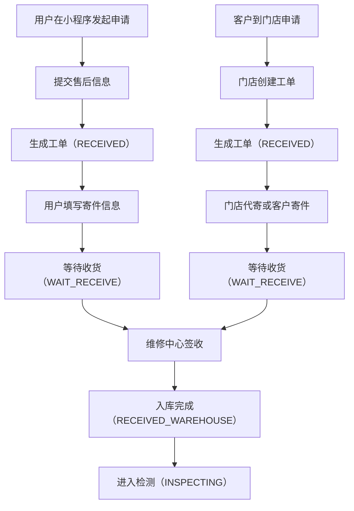
```mermaid
flowchart TD

A1[用户在小程序发起申请] --> A2[提交售后信息]
A2 --> A3[生成工单（RECEIVED）]
A3 --> A4[用户填写寄件信息]
A4 --> A5[等待收货（WAIT_RECEIVE）]

B1[客户到门店申请] --> B2[门店创建工单]
B2 --> B3[生成工单（RECEIVED）]
B3 --> B4[门店代寄或客户寄件]
B4 --> B5[等待收货（WAIT_RECEIVE）]

A5 --> C1[维修中心签收]
B5 --> C1
C1 --> C2[入库完成（RECEIVED_WAREHOUSE）]
C2 --> C3[进入检测（INSPECTING）]
```

说明：

- 小程序与门店为两个申请入口，但统一由 PS Admin 生成工单
    
- 进入检测前必须完成签收与入库
    
- 申请流程结束后，工单进入检测主流程
    

### 3.6.2 产品接收流程

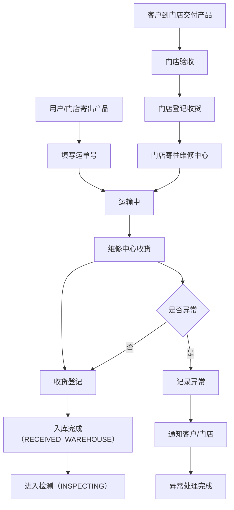
```mermaid
flowchart TD

A1[用户/门店寄出产品] --> A2[填写运单号]
A2 --> A3[运输中]
A3 --> A4[维修中心收货]
A4 --> A5[收货登记]
A5 --> A6[入库完成（RECEIVED_WAREHOUSE）]

B1[客户到门店交付产品] --> B2[门店验收]
B2 --> B3[门店登记收货]
B3 --> B4[门店寄往维修中心]
B4 --> A3

A4 --> C1{是否异常}
C1 -->|否| A5
C1 -->|是| C2[记录异常]
C2 --> C3[通知客户/门店]
C3 --> C4[异常处理完成]

A6 --> D1[进入检测（INSPECTING）]
```

说明：

- 快递寄送与门店直收两种收货方式最终汇合为维修中心收货
    
- 产品收货异常需单独记录，并通知相关方
    
- 收货完成后进入检测状态
    

### 3.6.3 检测与判定流程

检测完成后进入判定，根据不同结果流转到不同处理路径。

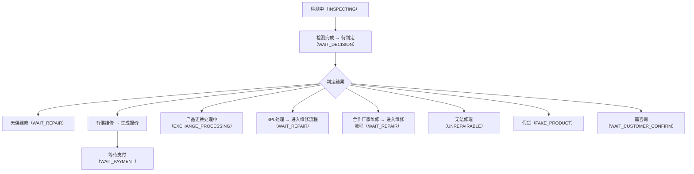
```mermaid
flowchart TD

A[检测中（INSPECTING）] --> B[检测完成 → 待判定（WAIT_DECISION）]
B --> C{判定结果}

C --> D[无偿维修（WAIT_REPAIR）]
C --> E[有偿维修 → 生成报价]
E --> F[等待支付（WAIT_PAYMENT）]

C --> G[产品更换处理中（EXCHANGE_PROCESSING）]
C --> H[3PL处理 → 进入维修流程（WAIT_REPAIR）]
C --> I[合作厂家维修 → 进入维修流程（WAIT_REPAIR）]

C --> J[无法修理（UNREPAIRABLE）]
C --> K[假货（FAKE_PRODUCT）]

C --> L[需咨询（WAIT_CUSTOMER_CONFIRM）]
```

说明：

- 检测完成后统一进入待判定状态
    
- 判定结果决定是否进入支付、维修、换货、关闭等不同路径
    
- 咨询为判定前后的可插入子流程
    

### 3.6.4 咨询流程

咨询状态默认值为“咨询待机”；当“咨询完成”后，状态自动返回判定节点。

在以下场景需发起咨询：

- 维修方案需客户确认
    
- 费用变更
    
- 他品交换
    
- 合作厂家延迟
    

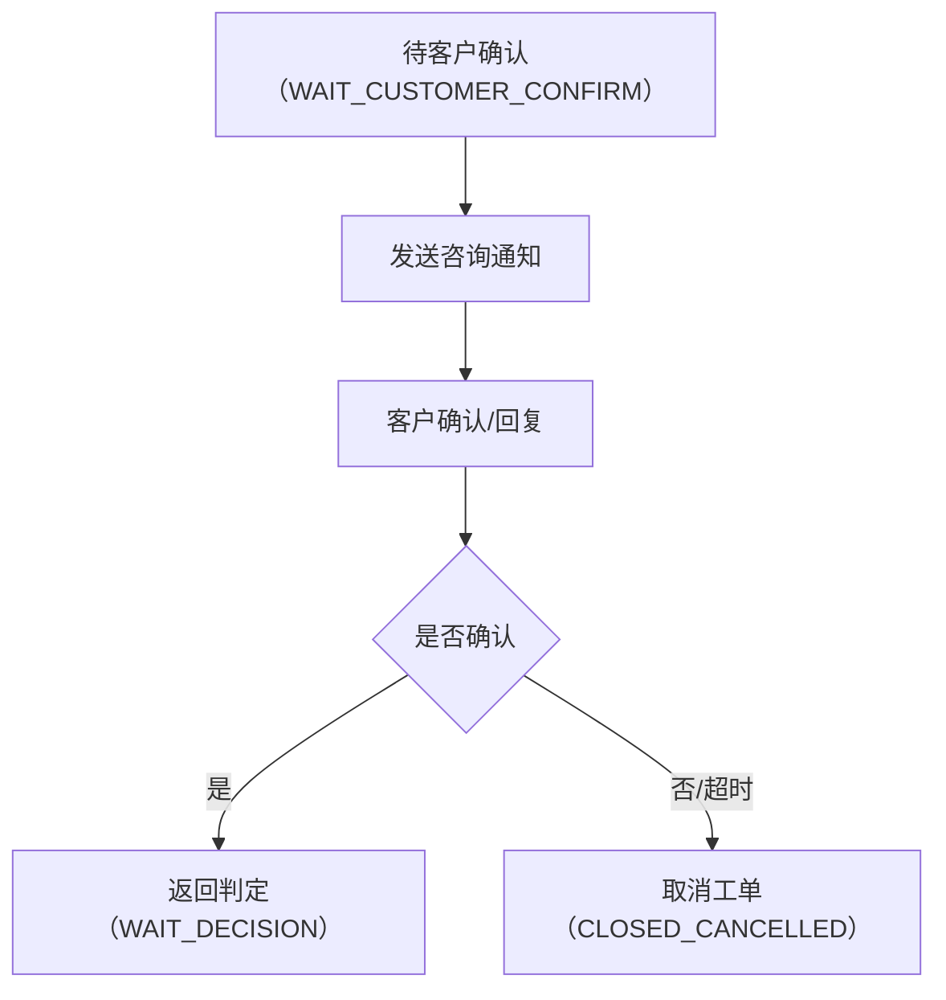
```mermaid
flowchart TD

A[待客户确认（WAIT_CUSTOMER_CONFIRM）] --> B[发送咨询通知]
B --> C[客户确认/回复]
C --> D{是否确认}

D -->|是| E[返回判定（WAIT_DECISION）]
D -->|否/超时| F[取消工单（CLOSED_CANCELLED）]
```

说明：

- 咨询流程本质上是判定流程中的补充确认子流程
    
- 客户确认后返回待判定状态
    
- 若拒绝或超时，可进入取消关闭
    

### 3.6.5 支付流程

当工单判定为有偿维修场景时，系统进入支付流程。

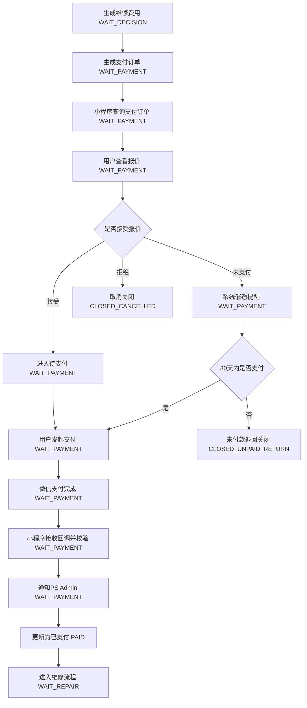
```mermaid
flowchart TD

A[生成维修费用 WAIT_DECISION] --> B[生成支付订单 WAIT_PAYMENT]
B --> C[小程序查询支付订单 WAIT_PAYMENT]
C --> D[用户查看报价 WAIT_PAYMENT]

D --> E{是否接受报价}

E -->|接受| F[进入待支付 WAIT_PAYMENT]
F --> G[用户发起支付 WAIT_PAYMENT]
G --> H[微信支付完成 WAIT_PAYMENT]

H --> I[小程序接收回调并校验 WAIT_PAYMENT]
I --> J[通知PS Admin WAIT_PAYMENT]

J --> K[更新为已支付 PAID]
K --> L[进入维修流程 WAIT_REPAIR]

E -->|未支付| M[系统催缴提醒 WAIT_PAYMENT]
M --> N{30天内是否支付}

N -->|是| G
N -->|否| O[未付款退回关闭 CLOSED_UNPAID_RETURN]

E -->|拒绝| P[取消关闭 CLOSED_CANCELLED]
```

说明：

- 支付流程是有偿场景的独立子流程
    
- 支付成功后并不直接进入维修中，而是先进入待维修状态
    
- 未支付和拒绝报价对应不同关闭路径
    

### 3.6.6 维修执行流程

若为 “无偿”：判定完成 +D3 后状态自动变更为 “维修进行中”；
若为 “有偿”：付款完成 +D3 后状态自动变更为 “维修进行中”；
若为 “3PL”：付款完成 +D1 后状态自动变更为 “维修进行中”。

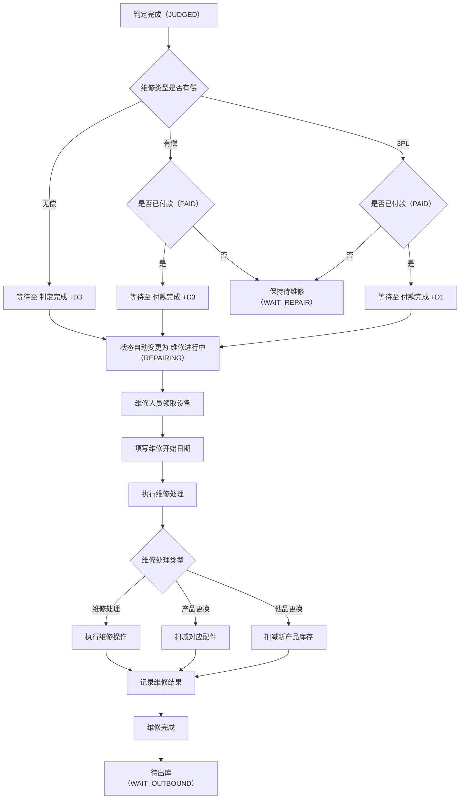
```mermaid
flowchart TD

A[判定完成（JUDGED）] --> B{维修类型是否有偿}

B -->|无偿| C[等待至 判定完成 +D3]
B -->|有偿| D{是否已付款（PAID）}
B -->|3PL| E{是否已付款（PAID）}

D -->|是| F[等待至 付款完成 +D3]
D -->|否| Z1[保持待维修（WAIT_REPAIR）]

E -->|是| G[等待至 付款完成 +D1]
E -->|否| Z1

C --> H[状态自动变更为 维修进行中（REPAIRING）]
F --> H
G --> H

H --> I[维修人员领取设备]
I --> J[填写维修开始日期]
J --> K[执行维修处理]

K --> L{维修处理类型}
L -->|维修处理| M[执行维修操作]
L -->|产品更换| N[扣减对应配件]
L -->|他品更换| O[扣减新产品库存]

M --> P[记录维修结果]
N --> P
O --> P

P --> Q[维修完成]
Q --> R[待出库（WAIT_OUTBOUND）]
```

说明：

- 待维修状态用于承接支付完成或无偿判定完成后的统一入口
    
- 满足时间规则后进入维修中
    
- 维修完成后进入待出库，而不是直接出库
    

### 3.6.7 配件与库存处理流程

在维修处理过程中，若涉及配件更换，系统需执行配件选择、库存校验及配件消耗记录等操作。  
该流程作为维修流程中的子流程执行。

1. 配件选择规则  
    维修人员可对系统默认配件进行确认、修改、新增或删除。
    
2. 库存校验规则  
    系统在维修完成前校验配件库存是否满足消耗需求。
    
3. 库存扣减时机  
    配件库存在“维修完成提交时”统一扣减，避免在维修过程中产生库存不一致问题。
    
4. 库存不足处理  
    当库存不足时，系统应支持：
    
    - 触发配件申请流程
        
    - 或生成库存预警
        
5. 数据记录  
    系统需记录：
    
    - 配件消耗明细
        
    - 库存变动记录
        
    - 操作人及时间
        

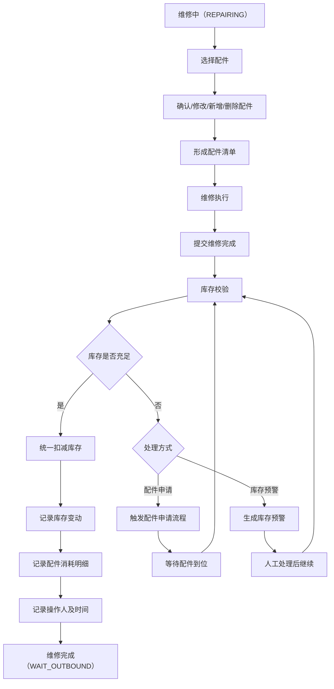
```mermaid
flowchart TD

A[维修中（REPAIRING）] --> B[选择配件]

B --> C[确认/修改/新增/删除配件]
C --> D[形成配件清单]

D --> E[维修执行]

E --> F[提交维修完成]
F --> G[库存校验]

G --> H{库存是否充足}

H -->|是| I[统一扣减库存]
I --> J[记录库存变动]
J --> K[记录配件消耗明细]
K --> L[记录操作人及时间]
L --> M[维修完成（WAIT_OUTBOUND）]

H -->|否| N{处理方式}

N -->|配件申请| O[触发配件申请流程]
O --> P[等待配件到位]
P --> G

N -->|库存预警| Q[生成库存预警]
Q --> R[人工处理后继续]
R --> G
```

说明：

- 配件与库存流程为维修执行子流程，不单独形成主状态链
    
- 库存扣减统一发生在维修完成提交时
    
- 库存不足时需阻断维修完成提交
    

### 3.6.8 合作厂家 / 3PL 流程

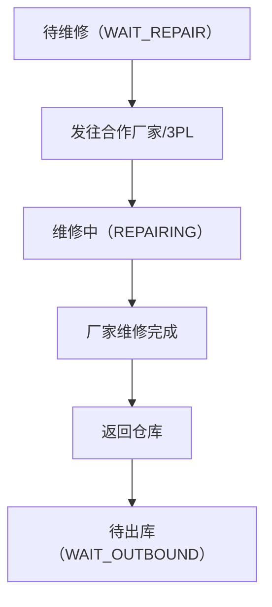
```mermaid
flowchart TD

A[待维修（WAIT_REPAIR）] --> B[发往合作厂家/3PL]
B --> C[维修中（REPAIRING）]
C --> D[厂家维修完成]
D --> E[返回仓库]
E --> F[待出库（WAIT_OUTBOUND）]
```

说明：

- 合作厂家 / 3PL 流程在业务上是外部执行，在系统状态上仍纳入维修主链
    
- 处理完成后统一返回待出库状态
    
- 若涉及费用，仍需先经过支付流程
    

### 3.6.9 无法修理 / 假货流程

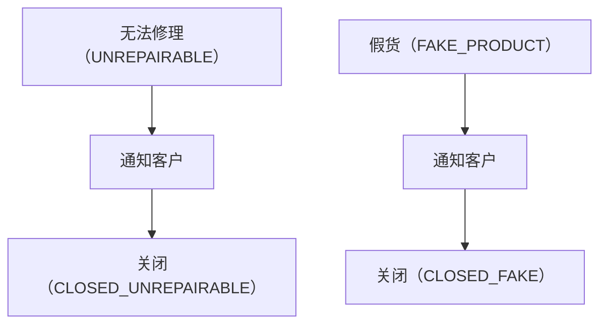
```mermaid
flowchart TD

A[无法修理（UNREPAIRABLE）] --> B[通知客户]
B --> C[关闭（CLOSED_UNREPAIRABLE）]

D[假货（FAKE_PRODUCT）] --> E[通知客户]
E --> F[关闭（CLOSED_FAKE）]
```

说明：

- 无法修理与假货均为终止类处理路径
    
- 需先通知客户，再进入对应关闭状态
    
- 不再进入维修、出库和完成流程
    

### 3.6.10 出库与履约流程

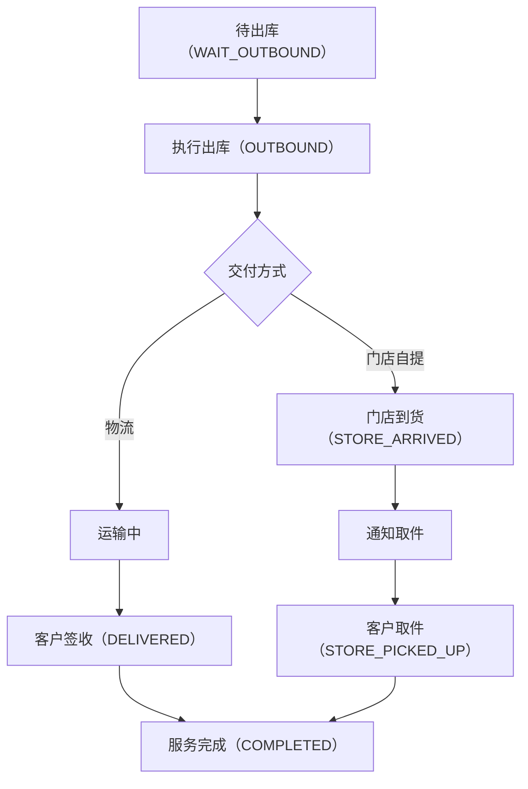
```mermaid
flowchart TD

A[待出库（WAIT_OUTBOUND）] --> B[执行出库（OUTBOUND）]
B --> C{交付方式}

C -->|物流| D[运输中]
D --> E[客户签收（DELIVERED）]
E --> F[服务完成（COMPLETED）]

C -->|门店自提| G[门店到货（STORE_ARRIVED）]
G --> H[通知取件]
H --> I[客户取件（STORE_PICKED_UP）]
I --> F
```

说明：

- 出库后按履约方式区分快递与门店自提
    
- 快递签收与门店取件后均进入已完成
    
- 已完成代表服务业务流程结束
    

### 3.6.11 问卷流程

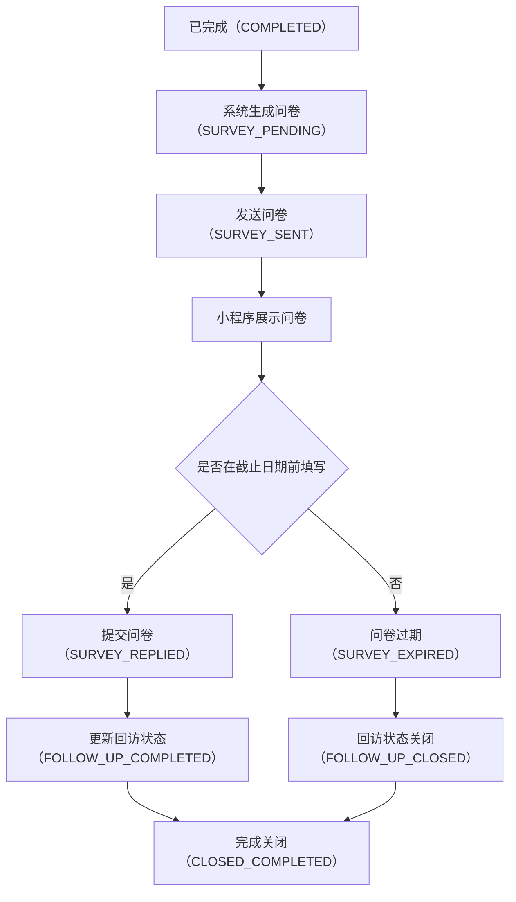
```mermaid
flowchart TD

A[已完成（COMPLETED）] --> B[系统生成问卷（SURVEY_PENDING）]
B --> C[发送问卷（SURVEY_SENT）]
C --> D[小程序展示问卷]

D --> E{是否在截止日期前填写}

E -->|是| F[提交问卷（SURVEY_REPLIED）]
F --> G[更新回访状态（FOLLOW_UP_COMPLETED）]
G --> H[完成关闭（CLOSED_COMPLETED）]

E -->|否| I[问卷过期（SURVEY_EXPIRED）]
I --> J[回访状态关闭（FOLLOW_UP_CLOSED）]
J --> H
```

说明：

- 服务完成后，系统自动生成问卷并设置截止日期
    
- 问卷由小程序端展示，客户可在截止日期前填写
    
- 客户提交后，问卷状态变更为 **SURVEY_REPLIED**
    
- 系统需同步更新回访状态为 **已回访（FOLLOW_UP_COMPLETED）**
    
- 若客户在截止日期前未填写，问卷自动变更为 **SURVEY_EXPIRED**
    
- 超时情况下，回访状态自动关闭（FOLLOW_UP_CLOSED）
    
- 问卷流程不影响工单主状态“已完成”，但作为服务质量数据进行记录


### 3.6.12 异常处理流程

系统需支持关键异常处理：

|异常类型|处理方式|
|---|---|
|支付失败|重新发起或关闭|
|支付超时|自动关闭工单|
|库存不足|阻断流程或触发申请|
|物流异常|人工介入处理|
|数据异常|系统校验与修复|
|咨询超时|取消关闭或人工跟进|

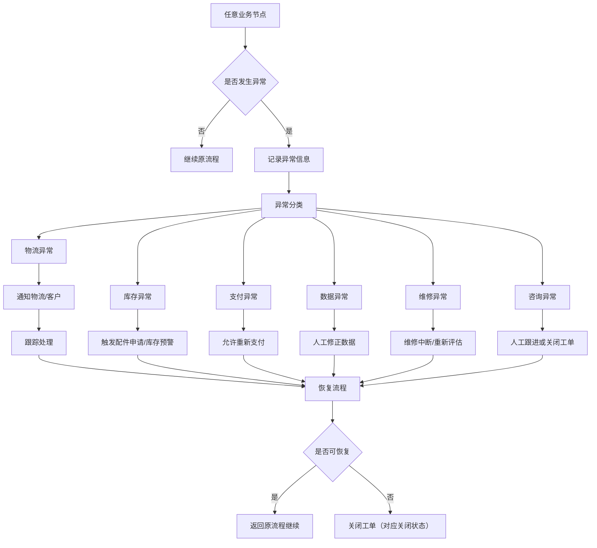
```mermaid
flowchart TD

A[任意业务节点] --> B{是否发生异常}

B -->|否| C[继续原流程]

B -->|是| D[记录异常信息]
D --> E[异常分类]

E --> F[物流异常]
E --> G[库存异常]
E --> H[支付异常]
E --> I[数据异常]
E --> J[维修异常]
E --> K[咨询异常]

F --> F1[通知物流/客户]
F1 --> F2[跟踪处理]
F2 --> L[恢复流程]

G --> G1[触发配件申请/库存预警]
G1 --> L

H --> H1[允许重新支付]
H1 --> L

I --> I1[人工修正数据]
I1 --> L

J --> J1[维修中断/重新评估]
J1 --> L

K --> K1[人工跟进或关闭工单]
K1 --> L

L --> M{是否可恢复}

M -->|是| N[返回原流程继续]
M -->|否| O[关闭工单（对应关闭状态）]
```

说明：

- 异常处理流程覆盖主流程各节点
    
- 异常是否可恢复，由具体异常类型和业务规则决定
    
- 无法恢复时需落到明确关闭状态，不允许悬空
    

## 3.7 扫码受理与工单直达

系统支持通过扫码方式快速进入售后工单详情页，用于提升门店及维修中心的受理效率。

扫码受理作为线下场景的重要入口能力，适用于：

- 门店接收客户产品
    
- 维修中心收货登记
    
- 出库交付确认

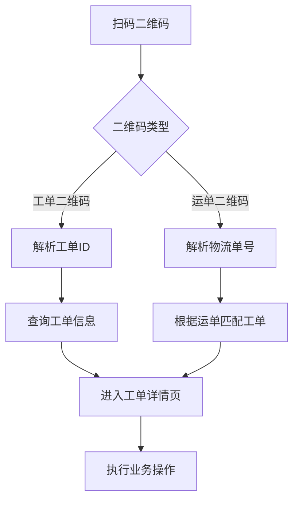
```mermaid
flowchart TD

A[扫码二维码] --> B{二维码类型}

B -->|工单二维码| C[解析工单ID]
B -->|运单二维码| D[解析物流单号]

C --> E[查询工单信息]
D --> F[根据运单匹配工单]

E --> G[进入工单详情页]
F --> G

G --> H[执行业务操作]
```


## 3.8 补充规则

- 工单必须通过【申请】进入系统
    
- 工单结束条件仅限：
    
    - 已完成（COMPLETED）
        
    - 取消关闭（CLOSED_CANCELLED）
        
    - 未付款退回关闭（CLOSED_UNPAID_RETURN）
        
    - 无法维修关闭（CLOSED_UNREPAIRABLE）
        
    - 假货关闭（CLOSED_FAKE）
        
    - 完成关闭（CLOSED_COMPLETED）
        
- 所有业务流程中的系统状态必须以状态模型定义表为准
    
- 所有状态变更必须通过动作触发，不允许直接修改状态
    
- 业务流程图用于客户评审与业务理解，状态流转表用于系统实现与测试验证


# 4 跨系统协同与接口设计

## 4.1 协同范围说明

本系统涉及以下系统间协同：

- 小程序（用户入口 / 支付发起）
    
- PS Admin（核心系统）
    
- SAP（库存 / 出库 / 财务）
    
- 物流系统（顺丰等）
    
- 微信支付
    

协同方式包括：

- 同步接口调用
    
- 异步回调 / 通知
    
- 状态查询与结果回写
    
- 定时任务补偿
    

## 4.2 售后申请与工单同步

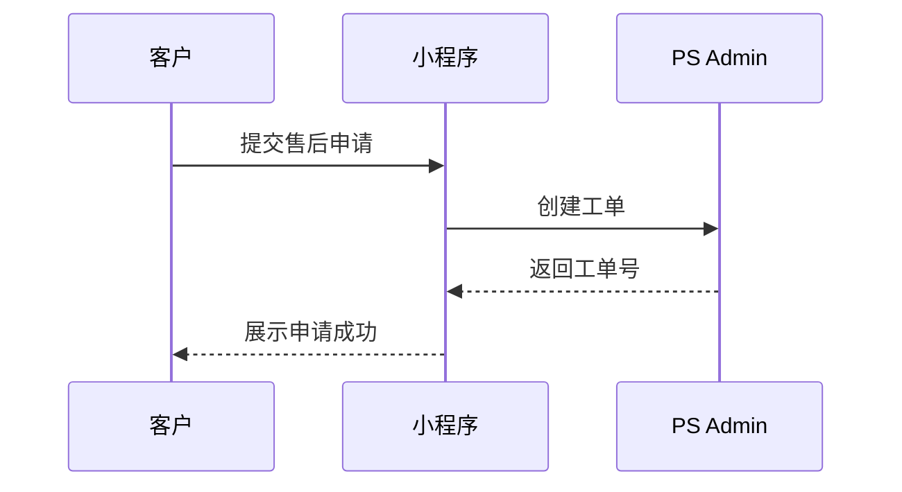
```mermaid
sequenceDiagram
    participant C as 客户
    participant M as 小程序
    participant A as PS Admin

    C->>M: 提交售后申请
    M->>A: 创建工单
    A-->>M: 返回工单号
    M-->>C: 展示申请成功
```


### 4.2.1 创建售后工单接口

**接口地址：** `/api/admin/tickets`  
**请求方式：** POST  
**提供方：** PS Admin  
**调用方：** 小程序

#### 请求参数

|字段名|类型|必填|说明|
|---|---|---|---|
|customerName|string|是|客户姓名|
|mobile|string|是|手机号|
|productId|string|是|产品ID|
|problemDesc|string|是|问题描述|

#### 返回参数

|字段名|类型|说明|
|---|---|---|
|code|string|返回码|
|ticketNo|string|工单号|


## 4.3 支付协同

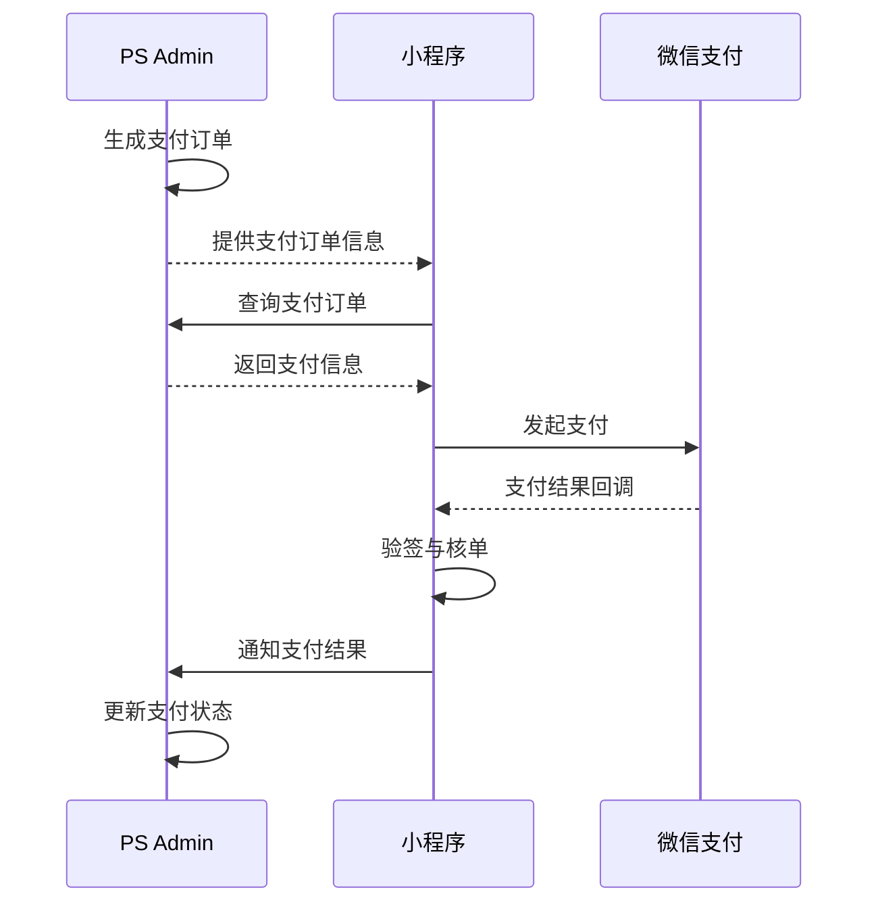
```mermaid
sequenceDiagram
    participant A as PS Admin
    participant M as 小程序
    participant W as 微信支付

    A->>A: 生成支付订单
    A-->>M: 提供支付订单信息

    M->>A: 查询支付订单
    A-->>M: 返回支付信息

    M->>W: 发起支付
    W-->>M: 支付结果回调

    M->>M: 验签与核单
    M->>A: 通知支付结果

    A->>A: 更新支付状态
```

**PS Admin 负责**

1. **生成待支付订单**  
    当工单判定为需要支付时，由 PS Admin 生成待支付订单，记录订单号、关联工单、应付金额及支付状态。
    
2. **提供待支付订单查询接口**  
    提供接口供微信小程序/支付侧查询待支付订单信息，包括订单号、金额、支付状态、业务单号等。
    
3. **提供支付结果回写接口**  
    提供支付结果回写接口，供小程序支付侧在支付完成并完成验签核单后，将最终支付结果同步至 PS Admin。
    
4. **根据支付结果更新工单状态**  
    在收到支付结果后，更新支付单状态，并根据业务规则同步更新工单状态、支付时间、支付流水号等信息。
    
5. **提供异常补偿处理能力**  
    当支付结果回写失败或状态不一致时，支持通过补偿机制重新获取支付结果并修正业务状态。
    

**微信小程序 / 支付侧负责**

1. **查询待支付订单**  
    通过调用 PS Admin 提供的查询接口，获取当前工单对应的待支付订单信息。
    
2. **调起微信支付**  
    基于待支付订单信息，由支付侧生成支付参数，并在微信小程序中发起支付。
    
3. **接收微信支付回调**  
    接收微信支付返回的异步支付通知，作为支付结果确认的来源。
    
4. **验签、核单**  
    对微信支付回调结果进行验签、金额校验、订单校验，确认支付结果真实有效。
    
5. **通知 PS Admin 最终支付结果**  
    在确认支付成功或失败后，通过支付结果回写接口，将最终支付结果同步给 PS Admin。
    
6. **提供支付结果查询接口**  
    提供支付结果查询接口，供 PS Admin 在支付结果回写失败或状态异常时，通过定时任务主动查询支付状态，进行补单和状态修正。

**支付状态同步原则**

1. **支付最终结果以支付侧验签核单后的结果为准**  
    小程序前端展示结果不能作为最终支付确认依据，必须以支付侧接收到微信支付异步通知并完成验签核单后的结果为准。
    
2. **PS Admin 以支付结果回写作为主同步方式**  
    正常情况下，由支付侧主动将支付结果回写至 PS Admin，作为主链路。
    
3. **PS Admin 以主动查询作为补偿机制**  
    当支付结果回写失败、超时或双方状态不一致时，由 PS Admin 通过定时任务调用支付侧查询接口，获取实际支付状态并完成补单与状态修正。
    
4. **双方均需支持幂等处理**  
    无论是支付结果回写还是补偿查询，同一支付订单多次通知时，系统都应保证重复处理不会造成状态错误或数据重复更新。


### 4.3.1 查询待支付订单

**接口地址：** `/api/admin/payment-orders/{ticketNo}`  
**请求方式：** GET  
**提供方：** PS Admin  
**调用方：** 小程序

#### 返回参数

|字段名|类型|说明|
|---|---|---|
|paymentNo|string|支付单号|
|amount|decimal|金额|
|status|string|支付状态|


### 4.3.2 支付结果回写

**接口地址：** `/api/admin/payment-orders/notify`  
**请求方式：** POST  
**提供方：** PS Admin  
**调用方：** 小程序

#### 请求参数

|字段名|类型|必填|说明|
|---|---|---|---|
|paymentNo|string|是|支付单号|
|status|string|是|SUCCESS / FAIL|
|paidTime|datetime|否|支付时间|
|transactionId|string|否|支付流水号|


### 4.3.3 支付结果查询（补单）

**接口地址：** `/api/miniapp/payment-orders/{paymentNo}`  
**请求方式：** GET  
**提供方：** 小程序  
**调用方：** PS Admin


### 4.3.4 补偿机制时序图

```mermaid
sequenceDiagram
    participant A as PS Admin
    participant M as 小程序

    A->>A: 定时任务触发
    A->>M: 查询支付结果
    M-->>A: 返回支付状态

    alt 已支付
        A->>A: 更新为已支付
    else 未支付
        A->>A: 保持原状态
    end
```


## 4.4 物流协同

```mermaid
sequenceDiagram
    participant M as 小程序
    participant A as PS Admin
    participant L as 物流系统

    M->>A: 提交运单号
    A->>L: 订阅物流状态
    L-->>A: 回传物流状态
```


### 4.4.1 提交运单号接口

**接口地址：** `/api/admin/logistics`  
**请求方式：** POST  
**提供方：** PS Admin  
**调用方：** 小程序

#### 请求参数

|字段名|类型|必填|说明|
|---|---|---|---|
|ticketNo|string|是|工单号|
|trackingNo|string|是|运单号|

**物流订阅**

```text
考虑到用户寄件可能选择不同的物流公司，他们的消息订阅方式都不一样，需要确认
```


## 4.5 SAP协同

```text
需要确认SAP接口
```


## 4.6 短信协同

```mermaid
sequenceDiagram
    participant A as PS Admin
    participant S as 短信平台
    participant C as 客户

    A->>S: 发送短信请求
    S-->>C: 下发短信

    alt 发送成功
        S-->>A: 返回成功结果
    else 发送失败
        S-->>A: 返回失败原因
        A->>A: 记录失败日志 / 重试
    end
```

### 4.6.1 短信发送接口（sendSms）

**接口地址：** `等待提供接口`  
**请求方式：** POST  
**提供方：** 短信平台  
**调用方：** PS Admin

#### 请求参数

|字段名|类型|必填|说明|
|---|---|---|---|
|mobile|string|是|手机号|
|templateCode|string|是|短信模板编码|
|params|object|否|模板变量参数|

### 4.6.2 短信发送触发规则

```text
需要确认短信接口
```


### 4.6.3 短信发送机制

```mermaid
flowchart TD
A[业务事件触发] --> B[匹配短信模板]
B --> C[组装短信参数]
C --> D[调用短信平台]
D --> E{发送结果}
E -->|成功| F[记录发送日志]
E -->|失败| G[重试 / 记录异常]
```

### 4.6.4 设计约束

- 短信发送需支持模板化配置
    
- 所有发送记录需落库（成功/失败）
    
- 失败需支持重试机制
    
- 同一事件需支持幂等控制（避免重复发送）
    

## 4.7 工单状态同步

```mermaid
sequenceDiagram
    participant M as 小程序
    participant A as PS Admin

    M->>A: 查询工单状态
    A-->>M: 返回当前状态
```

### 4.7.1 查询工单状态接口

**接口地址：** `/api/admin/tickets/{ticketNo}/status`  
**请求方式：** GET  
**提供方：** PS Admin  
**调用方：** 小程序


## 4.8 SAP商品同步

```mermaid
sequenceDiagram
    participant A as PS Admin
    participant S as SAP

    A->>S: 定时请求商品数据
    S-->>A: 返回商品数据
    A->>A: 更新商品信息
```

```text
需要确认SAP接口
```


## 4.9 问卷结果回写接口

### 4.9.1 提交问卷结果接口
小程序端完成问卷生成、展示及填写后，将问卷结果提交至 PS Admin。  
PS Admin 仅负责接收并存储问卷数据，不参与问卷生成、展示及管理。

**接口地址：** `/api/admin/submitSurveyResult`  
**请求方式：** POST  
**提供方：** PS Admin  
**调用方：** 小程序

### 请求参数

|字段名|类型|必填|说明|示例|
|---|---|---|---|---|
|ticket_no|string|是|工单编号|ST20260320001|
|survey_title|string|是|问卷题目|售后服务满意度调查|
|deadline_at|datetime|否|问卷截止日期|2026-03-30 23:59:59|
|repair_content|string|否|维修内容|更换镜腿|
|content|string|否|问卷填写内容|服务很好|
|score|int|否|评分（1-5）|5|

### 返回参数

|字段名|类型|说明|
|---|---|---|
|success|boolean|是否成功|
|message|string|返回信息|


# 5 功能模块设计

## 5.1 条码扫描功能

系统应支持在不同界面场景下对条码扫描行为进行自动识别，并执行相应操作。

### 5.1.1 主界面扫码跳转

在 PS 管理端主界面扫描条码时，系统应自动识别条码对应的售后工单，并跳转至该工单详细页面。

### 5.1.2 搜索框扫码查询

当在搜索框内扫描条码时，系统应将扫描到的条码作为查询条件执行工单检索，并返回匹配的工单结果列表。

## 5.2 售后工单管理

本模块用于在系统中创建和管理维修工单，记录客户信息、产品信息、维修信息、支付信息及物流信息，并驱动售后维修业务流程。
主要业务逻辑规则如下：

1. 维修费用由 SAP 系统返回价格后自动判断为有偿维修。
2. 若维修费用大于 0，则必须完成支付流程。
3. 支付成功后系统自动更新支付状态。
4. 再维修工单自动标记为紧急维修。
5. 出库完成后系统更新维修工单状态为已完成。
6. 若选择快递方式，则必须填写物流单号。

该模块主要实现以下功能：

1. 创建维修工单
2. 记录客户信息
3. 记录产品信息
4. 记录维修受理信息
5. 记录维修信息
6. 管理维修费用及支付信息
7. 管理维修完成后的物流信息
8. 支持附件上传与维修记录管理

|角色|权限|
|---|---|
|售后客服|创建维修工单|
|门店人员|创建维修工单|
|维修工程师|更新维修记录|
|财务人员|管理维修费用|
|系统管理员|系统管理|

### 5.2.1 售后工单列表

| 字段名称   | 字段Key                  | 数据类型         | 来源表                              | 说明          |
| ------ | ---------------------- | ------------ | -------------------------------- | ----------- |
| 工单编号   | ticket_no              | varchar(50)  | service_ticket                   | 售后服务工单唯一编号  |
| 接收日期   | received_date          | datetime     | ticket_intake                    | 产品/工单接收日期   |
| 状态     | process_status         | varchar(30)  | service_ticket                   | 当前工单流程状态    |
| 本社入库日期 | hq_inbound_date        | datetime     | ticket_global_shipment           | 本社仓入库日期     |
| 预计出库日期 | expected_outbound_date | datetime     | service_ticket                   | 工单预计出库日期    |
| 受理渠道   | intake_type            | varchar(30)  | service_ticket                   | 门店/邮寄/小程序等  |
| 客户     | customer_name          | varchar(100) | customer                         | 客户姓名        |
| 电话号码   | mobile                 | varchar(30)  | customer                         | 客户联系电话      |
| 邮箱     | email                  | varchar(100) | customer                         | 客户邮箱        |
| 产品名称   | product_name           | varchar(100) | service_ticket_item              | 工单关联产品名称    |
| 维修执行方  | repair_vendor_type     | varchar(30)  | ticket_judgement / ticket_repair | 自营/合作厂家/3PL |
| 维修内容   | repair_content         | varchar(255) | ticket_judgement / ticket_repair | 维修项目或说明     |
| 挂号编号   | registration_number    | varchar(100) | ticket_shipment                  | 物流运单号       |
| 付款日期   | paid_at                | datetime     | payment_order                    | 实际付款时间      |
| 出库方式   | outbound_type          | varchar(30)  | ticket_return                    | 快递/自提/门店返还  |
| 出库完成日期 | outbound_completed_at  | datetime     | ticket_return                    | 实际出库时间      |
| SO文件编号 | so_file_no             | varchar(100) | service_ticket                   | SO关联编号      |

### 5.2.2 售后工单详情页

**条码***
**库存请求**
**工单复制**

**顶部信息栏**

|字段名称|字段Key|数据类型|来源表|说明|
|---|---|---|---|---|
|工单编号|ticket_no|varchar(50)|service_ticket|售后服务工单唯一编号|
|SO文件编号|so_file_no|varchar(100)|service_ticket|SO关联文件编号，详情页顶部展示位已存在。|
|状态|process_status|varchar(30)|service_ticket|当前工单流程状态，页面存在状态展示及状态下拉。|
|原工单|parent_ticket_no|varchar(50)|service_ticket|原始/关联工单编号，页面顶部可见既有关联工单字段。|
|消息通知模板|kakao_alimtalk_template_code|varchar(100)|notification_template|通知消息模板下拉，实际为 Kakao AlimTalk 模板；页面存在独立下拉。|
|电子邮件模板|mail_template_code|varchar(100)|notification_template|邮件模板下拉，页面存在独立下拉。|
|历史记录|history_action|varchar(50)|ticket_status_log|查看工单历史记录入口|
|判定负责人|judgement_owner_name|varchar(100)|ticket_judgement / user_account|当前判定负责人姓名，用于页面展示|
|判定负责人ID|judgement_owner_id|bigint|ticket_judgement|当前判定负责人ID|

**客户信息**

|字段名称|字段Key|数据类型|来源表|说明|
|---|---|---|---|---|
|客户姓名|customerName|String|customer|客户名称|
|电话号码|phone|String|customer|联系方式|
|国家|country|String|customer|国家|
|邮箱|email|String|customer|邮箱|
|收货类型|receiveType|Enum|customer_receive|门店/快递|
|收货地址|receiveAddress|String|customer_receive|地址|

**受理信息**

|字段名称|字段Key|数据类型|来源表|说明|
|---|---|---|---|---|
|接收日期|receiveDate|Date|service_ticket|客户提交售后的时间|
|受理渠道类型|acceptChannelType|Enum|service_ticket|小程序 / 门店|
|受理渠道|acceptChannel|String|service_ticket|来源渠道|
|受理门店|acceptStore|String|service_ticket|渠道为门店时填写|
|是否再维修|isReRepair|Boolean|service_ticket|标识是否为返修|
|是否紧急维修|isUrgentRepair|Boolean|service_ticket|再维修时自动为 Y|
|是否有购买凭证|hasPurchaseProof|Boolean|service_ticket|是否提供购买凭证|
|是否附保修卡|hasWarrantyCard|Boolean|service_ticket|是否附保修卡|
|购买日期|purchaseDate|Date|service_ticket|产品购买日期|
|购买渠道|purchaseChannel|String|service_ticket|客户购买渠道|
|客户请求事项|customerRequest|Text|service_ticket|客户维修请求|

**受理信息附件**

|字段名称|字段Key|数据类型|来源表|说明|
|---|---|---|---|---|
|文件名称|fileName|String|service_ticket_attachment|文件名（可下载）|
|标题|title|String|service_ticket_attachment|可编辑|
|文件类型|fileType|String|service_ticket_attachment|自动识别|
|文件大小|fileSize|Long|service_ticket_attachment|KB/MB展示|
|上传时间|createdTime|DateTime|service_ticket_attachment|上传时间|
|上传人|createdBy|String|service_ticket_attachment|上传人|
|修改日期|updatedTime|DateTime|service_ticket_attachment|最后修改时间|
|修改者|updatedBy|String|service_ticket_attachment|最后修改人|

**产品信息**

|字段名称|字段Key|数据类型|来源表|说明|
|---|---|---|---|---|
|产品名称|productName|String|product|产品名称|
|产品ID|productId|String|product|产品标识|
|类别|category|String|product|分类|
|库存状态|stockStatus|Enum|product|库存状态|
|上市日期|launchDate|Date|product|上市时间|
|生产工厂|factory|String|product|工厂|

**咨询信息**

当 “希望咨询” 为 “Y” 时：
咨询日期与负责人自动填写。
咨询状态默认值为 “咨询待机”；当 “咨询完成” 后，状态自动变更为 “服务判定完成”。

|字段名称|字段Key|数据类型|来源表|说明|
|---|---|---|---|---|
|是否需要咨询|needConsult|Boolean|consult_record|是否发起咨询|
|咨询单号|consultOrderNo|String|consult_record|咨询编号|
|外呼类型|outboundType|Enum|consult_record|咨询类型|
|咨询负责人|consultOwner|String|consult_record|负责人|
|咨询状态|consultStatus|Enum|consult_record|状态|
|咨询日期|consultDate|Date|consult_record|时间|
|异常分类|exceptionType|Enum|consult_record|异常类型|

**维修信息**

|字段名称|字段Key|数据类型|来源表|说明|
|---|---|---|---|---|
|入库日期|warehouseInDate|Date|repair_record|进入维修中心|
|预计出库日期|expectedOutDate|Date|repair_record|预计完成|
|现象描述|phenomenon|String|repair_record|客户描述|
|问题现象|problemPhenomenon|Enum|repair_record|问题分类|
|客户请求|repairRequest|Text|repair_record|维修诉求|
|镜片类型|lensType|Enum|repair_record|镜片|
|维修中心|repairCenter|String|repair_record|维修单位|
|服务工程师|serviceEngineer|String|repair_record|负责人|
|维修内容|repairContent|String|repair_record|维修操作|
|维修进度日期|repairProgressDate|Date|repair_record|进度|
|合作方出库日期|partnerOutDate|Date|repair_record|外发|
|合作方入库日期|partnerInDate|Date|repair_record|返回|
|再维修原因|reRepairReason|String|repair_record|返修原因|
|是否产品问题|isProductIssue|Boolean|repair_record|质量问题|
|维修费用类型|repairCostType|Enum|repair_record|有偿/无偿|
|维修费用|repairCost|Decimal|repair_record|费用|
|维修备注|repairNotes|Text|repair_record|备注|

**配件信息（关键新增模块）**

|字段名称|字段Key|数据类型|来源表|说明|
|---|---|---|---|---|
|配件名称|partName|String|repair_part|配件名称|
|配件类型|partType|Enum|repair_part|分类|
|数量|quantity|Integer|repair_part|使用数量|
|单位|unit|String|repair_part|单位|
|标准单价|standardPrice|Decimal|repair_part|默认价格|
|实际单价|unitPrice|Decimal|repair_part|结算价格|
|总价|totalPrice|Decimal|repair_part|数量×单价|
|是否收费|isChargeable|Boolean|repair_part|是否收费|
|是否更换|isReplaced|Boolean|repair_part|是否更换|
|备注|remark|Text|repair_part|说明|

**支付信息**

| 字段名称   | 字段Key               | 数据类型    | 来源表            | 说明     |
| ------ | ------------------- | ------- | -------------- | ------ |
| 支付状态   | paymentStatus       | Boolean | payment_record | 是否完成   |
| 支付日期   | paymentDate         | Date    | payment_record | 时间     |
| 支付方式   | paymentMethod       | Enum    | payment_record | 微信/支付宝 |
| 支付授权号  | paymentAuthNo       | String  | payment_record | 流水号    |
| 最终支付请求 | finalPaymentRequest | Boolean | payment_record | 最终确认   |
| 支付截止日期 | paymentDeadline     | Date    | payment_record | 截止时间   |
| 支付链接   | paymentUrl          | String  | payment_record | 支付URL  |
| 取消支付   | cancelPayment       | Boolean | payment_record | 是否取消   |

**出库与物流信息**

|字段名称|字段Key|数据类型|来源表|说明|
|---|---|---|---|---|
|是否出库完成|outCompleted|Boolean|delivery_record|是否完成|
|出库完成日期|outCompletedDate|Date|delivery_record|时间|
|配送方式|deliveryType|Enum|delivery_record|快递/自取|
|配送完成|deliveryCompleted|Boolean|delivery_record|是否完成|
|配送日期|deliveryDate|Date|delivery_record|时间|
|物流单号|trackingNo|String|delivery_record|运单号|
|门店提货状态|storePickupStatus|Boolean|delivery_record|是否提货|
|门店提货日期|storePickupDate|Date|delivery_record|提货时间|

## 5.3 门店受理工单

### 5.3.1 受理列表

|字段名称|字段Key|数据类型|来源表|说明|
|---|---|---|---|---|
|维修进度|status|Enum|service_ticket|工单当前维修/受理状态|
|受理编号|ticketNo|String|service_ticket|受理工单编号|
|受理日期|receiveDate|Date|service_ticket|门店受理日期|
|姓名|customerName|String|customer / service_ticket|客户姓名|
|手机号|phone|String|customer / service_ticket|客户手机号|
|电子邮件|email|String|customer / service_ticket|客户邮箱|
|产品名|productName|String|product / service_ticket|送修产品名称|
|受理门店|acceptStore|String|service_ticket / store|受理门店名称|

### 5.3.2 门店受理详情页

**一、基础信息（顶部）**

|字段名称|字段Key|数据类型|来源表|说明|
|---|---|---|---|---|
|维修进度|status|Enum|service_ticket|当前工单状态|
|受理编号|ticketNo|String|service_ticket|工单编号|
|受理日期|receiveDate|Date|service_ticket|受理时间|
|受理门店|acceptStore|String|service_ticket|门店名称|

**二、客户信息**

|字段名称|字段Key|数据类型|来源表|说明|
|---|---|---|---|---|
|客户姓名|customerName|String|service_ticket|客户姓名|
|手机号|phone|String|service_ticket|联系方式|
|电子邮件|email|String|service_ticket|邮箱|
|取货门店|receptionStoreName|String|service_ticket|客户取货门店|

**三、产品信息**

|字段名称|字段Key|数据类型|来源表|说明|
|---|---|---|---|---|
|产品名称|productName|String|service_ticket|送修产品|
|产品ID|productId|String|service_ticket|产品标识|
|产品类别|category|String|service_ticket|产品分类|

**四、受理信息**

|字段名称|字段Key|数据类型|来源表|说明|
|---|---|---|---|---|
|受理渠道类型|acceptChannelType|Enum|service_ticket|门店 / 小程序|
|受理渠道|acceptChannel|String|service_ticket|来源|
|是否再维修|isReRepair|Boolean|service_ticket|返修标识|
|是否紧急维修|isUrgentRepair|Boolean|service_ticket|是否加急|
|是否有购买凭证|hasPurchaseProof|Boolean|service_ticket|凭证|
|是否附保修卡|hasWarrantyCard|Boolean|service_ticket|保修卡|
|购买日期|purchaseDate|Date|service_ticket|购买时间|
|购买渠道|purchaseChannel|String|service_ticket|来源|
|客户请求事项|customerRequest|Text|service_ticket|客户诉求|
|附件|attachments|File|attachment|图片/文件|

**五、维修信息（门店可见简化版）**

|字段名称|字段Key|数据类型|来源表|说明|
|---|---|---|---|---|
|维修处|repairCenter|String|service_ticket|维修单位|
|维修内容|repairContent|String|service_ticket|维修说明|
|维修进度日期|repairProgressDate|Date|service_ticket|更新时间|
|维修费用判定|repairCostType|Enum|service_ticket|有偿/无偿|
|维修费用|repairCost|Decimal|service_ticket|费用|

**六、物流 / 取货信息**

|字段名称|字段Key|数据类型|来源表|说明|
|---|---|---|---|---|
|配送状态|deliveryStatus|Enum|service_ticket|物流状态（到店/取回等）|
|运单号|trackingNo|String|service_ticket|物流单号|
|配送日期|deliveryDate|Date|service_ticket|发货时间|
|门店提货状态|storePickupStatus|Boolean|service_ticket|是否取走|
|门店提货日期|storePickupDate|Date|service_ticket|取货时间|

## 5.4 产品管理

产品列表模块用于：

- 管理产品基础信息
- 管理产品库存
- 管理配件信息
- 查看库存状态
- 扫码出库
- Excel导入导出

有产品和配件上新时，PS admin 凌晨3:30批量同步

数据来源：
- SAP系统同步
- PS Admin 手动维护（库存存放位置）

### 5.4.1 产品列表
  
| 字段名称         | 字段Key               | 数据类型    | 来源表                                  | 说明                                 |
| ------------ | ------------------- | ------- | ------------------------------------ | ---------------------------------- |
| 产品ID         | productId           | String  | product_master.product_id            | 产品唯一标识                             |
| 产品类别         | productCategory     | String  | product_master.product_category      | 产品类别                               |
| 生产工厂1        | factory1            | String  | product_master.factory_1             | 生产工厂信息1                            |
| 生产工厂2        | factory2            | String  | product_master.factory_2             | 生产工厂信息2                            |
| 生产工厂3        | factory3            | String  | product_master.factory_3             | 生产工厂信息3                            |
| 上市日期         | launchDate          | Date    | product_master.launch_date           | 产品上市日期                             |
| 零件保有期限       | partRetentionPeriod | Integer | product_master.part_retention_period | 零件保有期限（年）                          |
| 库存存放位置       | stockLocation       | String  | product_master.stock_location        | 默认库存存放位置（PS维护）                     |
| 安全库存状态       | safetyStockStatus   | String  | -（计算字段）                              | 当库存数量 < 阈值（默认5）显示“缺货”，否则显示“-”      |
| PS数量（使用中数量）  | psQuantity          | Integer | inventory_stock.in_use_qty（PS）       | PS仓使用中数量（需按 location_type=PS 聚合）   |
| 3PL数量（使用中数量） | tplQuantity         | Integer | inventory_stock.in_use_qty（3PL）      | 3PL仓使用中数量（需按 location_type=3PL 聚合） |


### 5.4.2 搜索功能

所有字段均可搜索

### 5.4.3 编辑功能

支持多产品扫码后出库处理

1. 必须生成交易编号（唯一ID）
2. 必须选择出库目的
3. 默认使用 **88码识别产品**

### 5.4.4 Excel导出
支持产品列表导出Excel。

### 5.4.5 上传
通过上传Excel文件批量修改数据。
1. 字段包括产品名称、产品ID、存放位置、配件存放位置。
2. 仅允许上传修改“存放位置”和“配件存放位置”。

### 5.4.6 历史记录

| 字段名称    | 字段Key           | 数据类型     | 来源表                                    | 说明           |
| ------- | --------------- | -------- | -------------------------------------- | ------------ |
| 日期      | transactionDate | DateTime | inventory_transaction | 库存交易发生时间     |
| 交易编号    | transactionNo   | String   | inventory_transaction   | 库存交易唯一编号     |
| 出库目的    | outboundPurpose | String   | inventory_transaction | 出库或库存调整原因/用途 |
| 负责人     | ownerName       | String   | inventory_transaction       | 本次库存交易负责人    |
| 产品名称    | productName     | String   | inventory_transaction     | 产品名称         |
| 88码     | code88          | String   | inventory_transaction          | 产品88码        |
| 产品ID    | productId       | String   | inventory_transaction       | 产品唯一ID       |
| 调整数量    | adjustQty       | Integer  | inventory_transaction       | 本次库存调整数量     |
| 库存变动（前） | stockBefore     | Integer  | inventory_transaction     | 调整前库存数量      |
| 库存变动（后） | stockAfter      | Integer  | inventory_transaction      | 调整后库存数量      |

## 5.5 小零件管理

数据来源为手工录入

### 5.5.1 小零件列表页面

|字段名称|字段Key|数据类型|来源表|说明|
|---|---|---|---|---|
|配件ID|part_id|VARCHAR(50)|part_master|
|配件名称|part_name|VARCHAR(200)|part_master|
|数量类型|qty_type|VARCHAR(50)|part_qty_config|动态列来源|
|数量值|qty_value|INT|part_qty_config|显示值|

### 5.5.2 小零件详情页面

**基础信息（Header）**

|字段名称|字段Key|数据类型|来源表|说明|
|---|---|---|---|---|
|配件ID|part_id|VARCHAR(50)|part_master|主键|
|配件名称|part_name|VARCHAR(200)|part_master|必填|
|配件类型|part_type|VARCHAR(50)|part_master|枚举|
|规格|specification|VARCHAR(100)|part_master|规格|
|颜色|color|VARCHAR(50)|part_master|颜色|
|配件存放位置|part_location|VARCHAR(200)|part_master|仓位|
|状态|status|VARCHAR(20)|part_master|启用状态|
|创建时间|created_at|DATETIME|part_master|系统生成|
|更新时间|updated_at|DATETIME|part_master|系统更新|

**数量配置（Qty 配置列表）**

|字段名称|字段Key|数据类型|来源表|说明|
|---|---|---|---|---|
|配件ID|part_id|VARCHAR(50)|part_qty_config|关联配件|
|数量类型|qty_type|VARCHAR(50)|part_qty_config|REPAIR / STORE / THIRD_PARTY / ETC|
|数量名称|qty_name|VARCHAR(100)|part_qty_config|如“维修用量”|
|默认数量|qty_value|INT|part_qty_config|默认使用数量|
|状态|status|VARCHAR(20)|part_qty_config|是否启用|
|排序|sort_order|INT|part_qty_config|显示顺序|

## 5.6 小零件申请列表

小零件申请模块用于：
- 门店申请小零件
- 管理小零件库存出库
- 小零件申请审批

用于维修配件领用、更换、库存管理、小零件信息查询

### 5.6.1 小零件申请列表页面

小零件申请列表支持这些场景：

|场景|说明|
|---|---|
|维修缺件申请|某工单维修缺少配件时发起|
|门店补件申请|门店库存不足时发起|
|3PL配件申请|外部维修方申请配件|
|安全库存补货申请|库存低于阈值时发起|
|手工临时申请|特殊业务场景人工提交|

|字段名称|字段Key|数据类型|来源表|说明|
|---|---|---|---|---|
|请求时间|created_at|DATETIME|part_request|申请单创建时间|
|请求负责人|requester_account|VARCHAR(50)|part_request|创建者账号|
|状态|status|VARCHAR(30)|part_request|申请单状态|
|门店类型|store_type|VARCHAR(50)|part_request|门店类型|
|门店名称|store_name|VARCHAR(100)|part_request|门店/法人名称|
|产品名称|product_name|VARCHAR(200)|part_request_item|明细字段（可能为空）|
|名称|part_name|VARCHAR(200)|part_request_item|配件名称|
|存放位置|part_location|VARCHAR(200)|part_request_item / part_master|自动带出|
|颜色|color|VARCHAR(50)|part_request_item|配件颜色|
|数量（组）|request_qty|INT|part_request_item|申请数量|

### 5.6.2 小零件申请列表详情页面

#### 5.6.2.1 主信息（Header）

|字段名称|字段Key|数据类型|来源表|说明|
|---|---|---|---|---|
|申请单号|request_no|VARCHAR(50)|part_request|系统自动生成，唯一编号|
|进度状态|status|VARCHAR(30)|part_request|默认“待出库”，状态流转字段|
|请求负责人|requester_account|VARCHAR(50)|part_request|自动取创建者账号|
|门店类型|store_type|VARCHAR(50)|part_request|自动取创建者所属组织类型|
|门店名称|store_name|VARCHAR(100)|part_request|自动取创建者所属组织名称|
|来源工单ID|repair_order_id|VARCHAR(50)|part_request|可选，关联维修工单|
|附加请求事项|additional_requirements|TEXT|part_request|申请备注信息|

#### 5.6.2.2 明细信息（小零件列表）

|字段名称|字段Key|数据类型|来源表|说明|
|---|---|---|---|---|
|产品名称|product_name|VARCHAR(200)|part_request_item|非必填；当配件类型为 HINGE_SCREW / HOOK_SCREW 时必填|
|配件ID|part_id|VARCHAR(50)|part_request_item / part_master|配件主键|
|配件名称|part_name|VARCHAR(200)|part_request_item / part_master|必填，选择配件|
|配件类型|part_type|VARCHAR(50)|part_master|根据配件自动带出（如 HINGE_SCREW）|
|颜色|color|VARCHAR(50)|part_master|根据配件自动带出|
|配件存放位置|part_location|VARCHAR(200)|part_master|根据配件自动带出，不允许手填|
|数量（组）|request_qty|INT|part_request_item|必填；必须命中数量规则表|
|行备注|item_remark|TEXT|part_request_item|可选，明细备注|

#### 5.6.2.3 数量规则（用于前端控制）

|字段名称|字段Key|数据类型|来源表|说明|
|---|---|---|---|---|
|门店类型|store_type|VARCHAR(50)|part_request_qty_rule|关联门店类型|
|可选数量|allowed_qty|INT|part_request_qty_rule|数量下拉选项|
|状态|status|VARCHAR(20)|part_request_qty_rule|是否启用|

## 5.7 库存申请

库存申请列表用于：
- 门店申请产品库存
- 管理库存调拨申请
- 审批库存申请

### 5.7.1 列表

|字段名称|字段Key|数据类型|来源表|说明|
|---|---|---|---|---|
|工单ID|ticketId|String / Bigint|inventory_request|关联售后工单|
|请求时间|requestTime|DateTime|inventory_request|发起请求时间|
|进度状态|progressStatus|Enum|inventory_request|当前状态|
|请求负责人|requestOwner|String|inventory_request|发起人|
|产品编码|productCode|String|inventory_request|产品编码|
|产品名称|productName|String|inventory_request|产品名称|
|存放位置|storageLocation|String|inventory_request|库存位置|
|请求数量|requestQty|Integer|inventory_request|申请数量|
|请求原因（大类）|requestReasonMain|Enum|inventory_request|一级原因|
|请求原因（中类）|requestReasonSub|Enum|inventory_request|二级原因|
|处理时间|processTime|DateTime|inventory_request|处理时间|
|处理人|processor|String|inventory_request|处理人员|

|功能|说明|
|---|---|
|筛选|所有字段可搜索|
|刷新|刷新列表|
|编辑|批量修改状态<br>1.进度状态可批量修改。<br>2.处理时间和处理人默认为当天与操作负责人，可手动修改。|
|导出|Excel导出|
|删除|删除工单|

### 5.7.2 详情页

|字段名称|字段Key|数据类型|来源表|说明|
|---|---|---|---|---|
|请求编号|requestNo|String|inventory_request|页面顶部显示编号（No.XXXX）|
|请求日期|requestDate|Date|inventory_request|页面顶部日期|
|请求负责人|requestOwner|String|inventory_request|发起请求人员|
|请求时间|requestTime|DateTime|inventory_request|请求时间|
|区分|requestCategory|Enum|inventory_request|业务分类（如PS）|
|产品名称|productName|String|inventory_request|请求产品|
|请求数量|requestQty|Integer|inventory_request|申请数量|
|请求事由|requestReason|Enum|inventory_request|请求原因（下拉）|
|特异事项|specialNote|Text|inventory_request|特殊说明|
|备注|remark|Text|inventory_request|补充备注|
|进度状态|progressStatus|Enum|inventory_request|当前状态（如请求完成）|
|处理日期|processDate|Date|inventory_request|处理完成时间|
|处理人|processor|String|inventory_request|处理人员|

## 5.8 问卷与回访管理

本模块用于在服务完成后生成客户满意度问卷，并由小程序端完成问卷展示、填写及回传。  
系统需支持问卷发送、截止日期控制、回访状态管理及结果查询，支撑售后服务评价与运营分析。

1. 服务完成后，系统自动生成满意度问卷
    
2. 小程序端展示待填写问卷并支持客户提交
    
3. 系统记录问卷发送时间、截止日期、回复内容及回复时间
    
4. 支持按问卷截止日期筛选问卷数据
    
5. 支持按回访状态查询问卷处理情况
    
6. 支持关联工单、维修内容与评价内容进行统一查看
    
7. 问卷超期未填写时，系统自动更新为已关闭


### 5.8.1 问卷列表页

支持按问卷截止日期筛选。

|字段名称|字段Key|数据类型|来源表|说明|
|---|---|---|---|---|
|工单编号|ticket_no|VARCHAR(50)|service_ticket|关联售后工单编号|
|问卷截止日期|deadline_at|DATETIME|service_ticket_survey|问卷最晚填写时间|
|问卷题目|survey_title|VARCHAR(200)|service_ticket_survey|问卷标题|
|维修内容|repair_content|VARCHAR(500)|repair_record|工单对应维修内容|
|回访状态|follow_up_status|VARCHAR(30)|service_ticket_survey|回访处理状态|
|内容|content|TEXT|service_ticket_survey|客户填写内容摘要|

### 5.8.2 问卷详情页

|字段名称|字段Key|数据类型|来源表|说明|
|---|---|---|---|---|
|工单编号|ticket_no|VARCHAR(50)|service_ticket|关联工单编号|
|客户姓名|customer_name|VARCHAR(100)|customer|客户姓名|
|手机号|mobile|VARCHAR(30)|customer|客户联系方式|
|问卷题目|survey_title|VARCHAR(200)|service_ticket_survey|问卷标题|
|问卷内容|survey_content|TEXT|service_ticket_survey|问卷题目内容|
|维修内容|repair_content|VARCHAR(500)|repair_record|维修项目说明|
|问卷状态|survey_status|VARCHAR(30)|service_ticket_survey|问卷当前状态|
|回访状态|follow_up_status|VARCHAR(30)|service_ticket_survey|回访状态|
|发送时间|sent_at|DATETIME|service_ticket_survey|问卷发送时间|
|截止日期|deadline_at|DATETIME|service_ticket_survey|问卷截止日期|
|回复内容|reply_content|TEXT|service_ticket_survey|客户填写内容|
|回复时间|replied_at|DATETIME|service_ticket_survey|客户提交时间|
|回访人|follow_up_user_name|VARCHAR(100)|service_ticket_survey|回访处理人|
|回访时间|follow_up_at|DATETIME|service_ticket_survey|回访处理时间|
|备注|remark|TEXT|service_ticket_survey|补充说明|


## 5.8 用户权限

### 5.8.1 用户管理

#### 5.8.1.1 用户列表

| 字段名称 | 字段Key     | 数据类型          | 来源表                | 说明                        |
| ---- | --------- | ------------- | ------------------ | ------------------------- |
| 用户ID | user_id   | String        | sys_user   | 用户唯一标识，用于区分账号             |
| 用户名  | user_name | String        | sys_user | 用户姓名/登录名称（根据实际定义）         |
| 职位   | work      | String        | sys_user      | 用户岗位/职务                   |
| 部门   | dept      | String        | sys_user      | 所属部门                      |
| 角色   | role_name | String        | sys_role | 用户角色名称（由 role_id 关联角色表获取） |
| 编号   | id        | Long / String | sys_user        | 用户主键ID或业务编号（用于系统内部唯一标识）   |

#### 5.8.1.2 用户详情

| 字段名称   | 字段Key            | 数据类型             | 来源表                              | 说明                      |
| ------ | ---------------- | ---------------- | -------------------------------- | ----------------------- |
| 用户ID   | user_id          | String           | sys_user.user_id                 | 用户唯一标识，用于区分账号           |
| 姓名     | user_name        | String           | sys_user.user_name               | 用户姓名                    |
| 生效日期   | effective_date   | Date             | sys_user.effective_date          | 账号开始生效日期                |
| 到期日期   | expiry_date      | Date             | sys_user.expiry_date             | 账号失效日期                  |
| 部门     | dept             | String           | sys_user.dept                    | 所属部门                    |
| 职务     | work             | String           | sys_user.work                    | 岗位/职务，可为空               |
| 角色     | role_id          | Integer / String | sys_user.role_id                 | 用户角色，实际展示时通常关联角色名称      |
| 联系电话   | phone            | String           | sys_user.phone                   | 内部联系电话                  |
| 邮箱     | email            | String           | sys_user.email                   | 用户邮箱，用于登录或通知            |
| 国家     | country          | String           | sys_user.country                 | 国家/区域信息                 |
| 内部地址   | internal_address | String           | sys_user.internal_address        | 内部办公地址/办公地点             |
| IP匹配方式 | member_ip_check  | Enum             | sys_user.member_ip_check         | N=未使用，Y=完全匹配，L=部分匹配     |
| 允许IP   | allowed_ip_list  | Array<String>    | sys_user_ip_whitelist.allowed_ip | 当启用IP匹配时展示该用户配置的IP白名单列表 |


### 5.8.2 角色管理

| 字段名称 | 字段Key     | 数据类型          | 来源表                | 说明             |
| ---- | --------- | ------------- | ------------------ | -------------- |
| 角色ID | role_id   | String / Long | sys_role.role_id   | 角色业务标识         |
| 角色编码 | role_code | String        | sys_role.role_code | 角色唯一编码，用于系统识别  |
| 角色名称 | role_name | String        | sys_role.role_name | 角色显示名称         |
| 角色类型 | role_type | String / Enum | sys_role.role_type | 角色类型，业务角色/系统角色 |

角色名称格式如下：
- PS_ADMIN
- OPERATION
- SERVICE
- HQ_RECEIVE

### 5.8.3 权限管理

| 字段名称   | 字段Key           | 数据类型          | 来源表                            | 说明                         |
| ------ | --------------- | ------------- | ------------------------------ | -------------------------- |
| 权限ID   | permission_id   | String / Long | sys_permission.permission_id   | 权限业务标识                     |
| 权限编码   | permission_code | String        | sys_permission.permission_code | 权限唯一编码                     |
| 权限名称   | permission_name | String        | sys_permission.permission_name | 权限显示名称                     |
| 权限类型   | permission_type | String / Enum | sys_permission.permission_type | MENU / BUTTON / API / DATA |
| 父级权限ID | parent_id       | Long          | sys_permission.parent_id       | 构建权限树结构                    |
| 权限路径   | path            | String        | sys_permission.path            | 菜单路由或接口路径                  |
| 组件路径   | component       | String        | sys_permission.component       | 前端组件路径（菜单使用）               |
| 排序号    | sort_no         | Integer       | sys_permission.sort_no         | 用于前端展示排序                   |
| 是否可见   | visible         | String        | sys_permission.visible         | 菜单是否显示                     |
| 状态     | status          | String        | sys_permission.status          | 权限启用/停用状态                  |

### 5.8.4 用户角色权限

#### 5.8.4.1 列表页

| 字段名称   | 字段Key        | 数据类型          | 来源表                | 说明                                       |
| ------ | ------------ | ------------- | ------------------ | ---------------------------------------- |
| 角色ID   | role_id      | String        | sys_role.role_id   | 角色唯一标识，列表核心展示字段；详情脚本中明确存在 `ROLE_ID`      |
| 角色名称   | role_name    | String        | sys_role.role_name | 角色名称，列表核心展示字段；详情脚本中明确存在 `ROLE_NAME`      |
| 角色说明   | memo         | String        | sys_role.memo      | 角色备注/说明；详情脚本中明确存在 `MEMO`，通常也会在列表展示       |
| 角色类型   | role_type    | String / Enum | sys_role.role_type | 角色类型（业务角色/系统角色）；若当前页面未直接展示，可作为扩展列表字段     |
| 操作     | action       | String        | -                  | 列表操作列，通常用于查看/编辑；页面存在跳转到新增页与详情/修改页的角色管理流程 |

#### 5.8.4.2 详情页

| 字段名称  | 字段Key         | 数据类型          | 来源表                                  | 说明                                                       |
| ----- | ------------- | ------------- | ------------------------------------ | -------------------------------------------------------- |
| 角色ID  | role_id       | String        | sys_role.role_id                     | 角色唯一标识；脚本校验提示为“业务角色ID”，长度 1~50                           |
| 角色名称  | role_name     | String        | sys_role.role_name                   | 角色名称；脚本校验提示长度 1~50                                       |
| 角色说明  | memo          | String        | sys_role.memo                        | 角色备注/说明；脚本校验提示最长 100                                     |
| 权限项编码 | at_name       | String        | sys_permission.permission_code       | 页面权限项通过 `AT_NAME` 进行勾选绑定，对应权限编码/权限标识                     |
| 权限项名称 | auth_name     | String        | sys_permission.permission_name       | 权限名称；脚本数据中明确存在 `AUTH_NAME`                               |
| 读取权限  | has_read      | Boolean       | sys_role_permission / sys_permission | 页面通过 `input[name=AT_NAME]` 勾选，表示具备该权限的基础访问/读取权限          |
| 写入权限  | has_write     | Boolean       | sys_role_permission / sys_permission | 页面通过 `input[name=AT_NAME+'_w']` 勾选，`WRITE='Y'` 时选中，表示写权限 |
| 权限ID  | permission_id | String / Long | sys_permission.permission_id         | 当前前端脚本中更接近使用 `SA_IDX` 做权限项标识，可作为内部主键字段                   |


# 6 服务时限管理

为保证售后维修服务质量及流程可控性，系统需对售后服务各关键节点设置服务时限（Service Level Agreement，SLA），并通过系统自动监控各阶段处理时间，确保售后流程在规定时间内完成。
SLA规则主要用于：

- 规范售后服务处理时限
- 提高售后处理效率
- 监控流程节点处理时间
- 对超时情况进行预警或自动处理
系统通过记录各节点时间戳，并根据规则自动计算时间差，以实现 SLA 管理。

SLA管理包括以下内容：

1. 售后流程SLA规则
2. 系统自动提醒机制
3. SLA异常处理规则

## 6.1 售后流程时限规则

系统根据售后业务流程，对关键节点设置服务时限要求。

|流程阶段|SLA规则|说明|
|---|---|---|
|售后申请受理|24小时内完成受理|客服确认售后申请并进入受理状态|
|客户寄送产品|无固定 SLA|由客户寄送时间决定|
|产品检测|3个工作日内完成检测|技术人员检测产品并给出判定|
|咨询确认|视客户响应时间|客户确认维修方案|
|报价支付|报价后7天内完成支付|系统自动计算支付截止日期|
|维修处理|判定完成或支付完成后开始维修|根据维修类型自动计算|
|产品出库|维修完成后1个工作日内发货|仓库安排物流|
|服务完成|客户签收后流程结束|系统自动记录完成时间|
|满意度调查|服务完成 +3天|系统自动发送调查|

## 6.2 维修处理时限规则

维修流程的处理时限根据维修类型不同而有所区别。

|维修类型|SLA规则|说明|
|---|---|---|
|无偿维修|判定完成 +3天进入维修|系统自动更新状态|
|有偿维修|支付完成 +3天进入维修|支付完成后进入维修|
|3PL维修|支付完成 +1天进入维修|转第三方维修|
|合作厂家维修|产品移交厂家 +1天进入维修|合作厂家处理|

系统在达到规定时间后自动更新维修状态为 **维修进行中**。

## 6.3 出库与物流时限规则

产品维修完成后，需要在规定时间内完成出库及发货。

|阶段|SLA规则|说明|
|---|---|---|
|维修完成|系统生成预计出库日期|根据维修类型计算|
|普通维修|排除节假日 +10天|默认维修周期|
|紧急维修|排除节假日 +3天|优先处理|
|合作厂家维修|排除节假日 +30天|海外维修|

系统自动生成 **预计出库日期** 并允许管理员根据实际情况调整。

## 6.4 支付时限规则

对于有偿维修订单，系统需要对支付行为进行时间管理。

|阶段|SLA规则|说明|
|---|---|---|
|报价生成|系统生成支付订单|进入待支付状态|
|支付截止时间|报价时间 +7天|默认支付期限|
|支付提醒|每日发送提醒|最多提醒5次|
|最终提醒|第29天再次提醒|防止客户遗漏|
|自动关闭|第30天自动关闭工单|进入退回流程|

## 6.5 时限自动提醒机制

系统根据 SLA 规则自动监控各节点时间，并向相关人员发送提醒。

|触发条件|通知对象|通知方式|
|---|---|---|
|客服未及时受理|客服|系统通知|
|客户未支付维修费用|客户|小程序通知|
|维修即将超期|维修工程师|系统通知|
|出库即将超期|仓库人员|系统通知|
|服务完成|客户|满意度调查通知|

## 6.6 时限异常处理规则

当流程节点超过规定 SLA 时，系统需要记录异常并进行处理。

|异常情况|系统处理|
|---|---|
|客服未及时受理|系统提醒客服|
|客户未支付维修费用|持续提醒客户|
|支付超过30天未完成|系统自动关闭工单|
|维修时间超过预计周期|记录异常并提醒维修负责人|
|出库延迟|提醒仓库人员|

系统需记录所有时限超时事件，并纳入后续运营分析。


# 7 数据模型

## 7.1 设计说明

本章用于定义系统核心业务数据模型，作为数据库设计、接口开发、状态流转控制、页面展示及后续报表分析的统一依据。

数据模型设计遵循以下原则：

- 以售后工单 `service_ticket` 为核心主表
    
- 以状态表 `service_status` 与状态流转表 `service_status_flow` 统一管理流程状态
    
- 所有过程型数据按业务域拆分，避免工单主表字段过度膨胀
    
- 所有关键动作需保留日志与历史记录
    
- 所有对外协同数据应具备可追踪、可重试、可对账能力
    
- 统一采用 `BIGINT` 作为主键
    
- 统一采用 `created_at / updated_at` 作为时间字段命名
    
- 统一采用 `is_deleted` 作为逻辑删除标识（如适用）
    


## 7.2 权限与组织模型

### 用户 sys_user

|字段名称|字段Key|数据类型|必填|默认值|逻辑规则|说明|
|---|---|---|---|---|---|---|
|主键ID|id|BIGINT|是|-|主键|用户表主键，系统内部唯一标识|
|用户ID|user_id|VARCHAR(50)|是|-|唯一约束|用户唯一标识，用于区分账号|
|姓名|user_name|VARCHAR(100)|是|-|-|用户姓名|
|生效日期|effective_date|DATE|否|-|-|账号生效日期|
|到期日期|expiry_date|DATE|否|-|-|账号到期日期|
|部门|dept|VARCHAR(100)|否|-|-|所属部门|
|职务|work|VARCHAR(100)|否|-|-|岗位/职务|
|角色ID|role_id|BIGINT|否|-|可冗余默认角色|默认角色ID|
|联系电话|phone|VARCHAR(30)|否|-|-|内部联系电话|
|邮箱|email|VARCHAR(100)|否|-|唯一约束|用户邮箱|
|国家|country|VARCHAR(100)|否|-|-|国家/区域信息|
|内部地址|internal_address|VARCHAR(255)|否|-|-|内部办公地址/办公地点|
|IP匹配方式|member_ip_check|VARCHAR(10)|否|N|N=未使用，Y=完全匹配，L=部分匹配|IP校验方式|
|状态|status|CHAR(1)|是|A|A=启用，I=停用|账号状态|
|创建人|created_by|VARCHAR(50)|否|-|-|创建人|
|创建时间|created_at|DATETIME|是|CURRENT_TIMESTAMP|系统自动写入|创建时间|
|更新人|updated_by|VARCHAR(50)|否|-|-|更新人|
|更新时间|updated_at|DATETIME|是|CURRENT_TIMESTAMP|更新时自动刷新|更新时间|
|删除标记|is_deleted|TINYINT(1)|是|0|0=未删除，1=已删除|逻辑删除标记|

### 用户IP白名单 sys_user_ip_whitelist

|字段名称|字段Key|数据类型|必填|默认值|逻辑规则|说明|
|---|---|---|---|---|---|---|
|主键ID|id|BIGINT|是|-|主键|白名单表主键|
|用户主表ID|user_id_ref|BIGINT|是|-|关联 `sys_user.id`|用户主表ID|
|用户ID|user_id|VARCHAR(50)|否|-|冗余存储|业务用户ID，便于查询|
|允许IP|allowed_ip|VARCHAR(100)|是|-|支持单IP、IP段或通配格式|白名单IP地址|
|匹配方式|match_type|VARCHAR(10)|否|Y|Y=完全匹配，L=部分匹配|冗余记录匹配方式|
|排序号|sort_no|INT|否|0|-|多条IP时的展示顺序|
|状态|status|CHAR(1)|是|A|A=启用，I=停用|是否启用|
|创建人|created_by|VARCHAR(50)|否|-|-|创建人|
|创建时间|created_at|DATETIME|是|CURRENT_TIMESTAMP|系统自动写入|创建时间|
|更新人|updated_by|VARCHAR(50)|否|-|-|更新人|
|更新时间|updated_at|DATETIME|是|CURRENT_TIMESTAMP|更新时自动刷新|更新时间|

### 角色 sys_role

|字段名称|字段Key|数据类型|必填|默认值|逻辑规则|说明|
|---|---|---|---|---|---|---|
|主键ID|id|BIGINT|是|-|主键|角色表主键，系统内部唯一标识|
|角色ID|role_id|BIGINT|是|-|唯一|角色业务标识|
|角色编码|role_code|VARCHAR(50)|是|-|唯一约束|角色唯一编码，如 `ADMIN`|
|角色名称|role_name|VARCHAR(100)|是|-|-|角色显示名称|
|角色类型|role_type|VARCHAR(20)|否|-|-|角色类型，如业务角色、系统角色|
|角色状态|status|CHAR(1)|是|A|A=启用，I=停用|角色状态|
|备注|remark|VARCHAR(255)|否|-|-|角色补充说明|
|创建人|created_by|VARCHAR(50)|否|-|-|创建人|
|创建时间|created_at|DATETIME|是|CURRENT_TIMESTAMP|系统自动写入|创建时间|
|更新人|updated_by|VARCHAR(50)|否|-|-|更新人|
|更新时间|updated_at|DATETIME|是|CURRENT_TIMESTAMP|更新时自动刷新|更新时间|
|删除标记|is_deleted|TINYINT(1)|是|0|0=未删除，1=已删除|逻辑删除标记|

### 权限表 sys_permission

|字段名称|字段Key|数据类型|必填|默认值|逻辑规则|说明|
|---|---|---|---|---|---|---|
|主键ID|id|BIGINT|是|-|主键|权限表主键|
|权限ID|permission_id|BIGINT|是|-|唯一|权限业务标识|
|权限编码|permission_code|VARCHAR(100)|是|-|唯一约束|权限唯一编码|
|权限名称|permission_name|VARCHAR(100)|是|-|-|权限显示名称|
|权限类型|permission_type|VARCHAR(20)|是|-|MENU / BUTTON / API / DATA|权限类型|
|父级权限ID|parent_id|BIGINT|否|-|可为空，构建树结构|上级权限ID|
|权限路径|path|VARCHAR(255)|否|-|菜单/API时使用|前端路由或接口路径|
|组件路径|component|VARCHAR(255)|否|-|菜单权限时使用|前端组件路径|
|排序号|sort_no|INT|否|0|-|权限排序|
|是否可见|visible|CHAR(1)|否|Y|Y=是，N=否|是否在菜单中显示|
|权限状态|status|CHAR(1)|是|A|A=启用，I=停用|状态|
|备注|remark|VARCHAR(255)|否|-|-|权限说明|
|创建人|created_by|VARCHAR(50)|否|-|-|创建人|
|创建时间|created_at|DATETIME|是|CURRENT_TIMESTAMP|系统自动写入|创建时间|
|更新人|updated_by|VARCHAR(50)|否|-|-|更新人|
|更新时间|updated_at|DATETIME|是|CURRENT_TIMESTAMP|更新时自动刷新|更新时间|
|删除标记|is_deleted|TINYINT(1)|是|0|0=未删除，1=已删除|逻辑删除标记|

### 权限编码 sys_permission_code

|字段名称|字段Key|数据类型|必填|默认值|逻辑规则|说明|
|---|---|---|---|---|---|---|
|权限名称|permission_name|VARCHAR(100)|是|-|-|权限显示名称|
|权限编码|permission_code|VARCHAR(100)|是|-|唯一约束|权限编码，如 `user.view`|

### 用户角色关系表 sys_user_role

|字段名称|字段Key|数据类型|必填|默认值|逻辑规则|说明|
|---|---|---|---|---|---|---|
|主键ID|id|BIGINT|是|-|主键|关系表主键|
|用户ID|user_id|BIGINT|是|-|关联 `sys_user.id`|用户ID|
|角色ID|role_id|BIGINT|是|-|关联 `sys_role.id`|角色ID|
|创建人|created_by|VARCHAR(50)|否|-|-|创建人|
|创建时间|created_at|DATETIME|是|CURRENT_TIMESTAMP|系统自动写入|创建时间|
|更新人|updated_by|VARCHAR(50)|否|-|-|更新人|
|更新时间|updated_at|DATETIME|是|CURRENT_TIMESTAMP|更新时自动刷新|更新时间|

### 角色权限关系表 sys_role_permission

|字段名称|字段Key|数据类型|必填|默认值|逻辑规则|说明|
|---|---|---|---|---|---|---|
|主键ID|id|BIGINT|是|-|主键|关系表主键|
|角色ID|role_id|BIGINT|是|-|关联 `sys_role.id`|角色ID|
|权限ID|permission_id|BIGINT|是|-|关联 `sys_permission.id`|权限ID|
|创建人|created_by|VARCHAR(50)|否|-|-|创建人|
|创建时间|created_at|DATETIME|是|CURRENT_TIMESTAMP|系统自动写入|创建时间|
|更新人|updated_by|VARCHAR(50)|否|-|-|更新人|
|更新时间|updated_at|DATETIME|是|CURRENT_TIMESTAMP|更新时自动刷新|更新时间|


## 7.3 工单主模型

### 售后工单 service_ticket

|字段名称|字段Key|数据类型|必填|默认值|逻辑规则|说明|
|---|---|---|---|---|---|---|
|工单ID|id|BIGINT|是|-|主键|主键|
|工单编号|ticket_no|VARCHAR(50)|是|-|唯一业务编号|工单编号|
|父工单ID|parent_ticket_id|BIGINT|否|-|返修/复制场景关联原工单|父工单ID|
|客户ID|customer_id|BIGINT|是|-|关联客户表|客户ID|
|当前状态编码|status_key|VARCHAR(64)|是|-|对应 `service_status.status_key`|工单当前状态|
|受理渠道类型|accept_channel_type|VARCHAR(30)|是|-|小程序 / 门店|受理渠道类型|
|受理渠道|accept_channel|VARCHAR(50)|否|-|-|来源渠道|
|受理门店ID|accept_store_id|BIGINT|否|-|渠道为门店时填写|受理门店ID|
|受理门店名称|accept_store|VARCHAR(100)|否|-|冗余存储|受理门店名称|
|接收日期|receive_date|DATETIME|否|-|-|客户提交或门店创建时间|
|是否再维修|is_re_repair|TINYINT(1)|是|0|0=否，1=是|是否返修|
|是否紧急维修|is_urgent_repair|TINYINT(1)|是|0|返修场景可自动置1|是否紧急|
|SAP服务单号|sap_service_order_no|VARCHAR(50)|否|-|同步SAP后回写|SAP服务单号|
|判定结果|judgement_result|VARCHAR(50)|否|-|与判定表保持一致|有偿/无偿/更换/假货等|
|维修类型|repair_type|VARCHAR(50)|否|-|维修 / 换货 / 3PL / 合作厂家|维修类型|
|维修执行方|repair_vendor_type|VARCHAR(30)|否|-|PS / PARTNER / 3PL|维修执行方|
|返还方式|return_type|VARCHAR(30)|否|-|快递 / 门店自提|返还方式|
|报价金额|quotation_amount|DECIMAL(10,2)|否|0.00|有偿场景写入|报价金额|
|支付状态冗余|payment_status|VARCHAR(32)|否|-|冗余字段，便于列表查询|支付状态|
|物流状态冗余|delivery_status|VARCHAR(32)|否|-|冗余字段，便于列表查询|物流状态|
|完成时间|completed_at|DATETIME|否|-|完成时写入|工单完成时间|
|关闭时间|closed_at|DATETIME|否|-|关闭时写入|工单关闭时间|
|创建人|created_by|VARCHAR(50)|否|-|-|创建人|
|创建时间|created_at|DATETIME|是|CURRENT_TIMESTAMP|系统自动写入|创建时间|
|更新人|updated_by|VARCHAR(50)|否|-|-|更新人|
|更新时间|updated_at|DATETIME|是|CURRENT_TIMESTAMP|更新时自动刷新|更新时间|
|删除标记|is_deleted|TINYINT(1)|是|0|0=未删除，1=已删除|逻辑删除标记|

### 工单产品快照 service_ticket_item

|字段名称|字段Key|数据类型|必填|默认值|逻辑规则|说明|
|---|---|---|---|---|---|---|
|明细ID|id|BIGINT|是|-|主键|主键|
|工单ID|ticket_id|BIGINT|是|-|关联售后工单|工单ID|
|产品ID|product_id|BIGINT|否|-|关联产品主数据|产品ID|
|产品名称|product_name|VARCHAR(200)|是|-|创建工单时快照|产品名称|
|88码|code_88|VARCHAR(50)|否|-|快照保存|产品88码|
|SN码|serial_no|VARCHAR(100)|否|-|-|序列号|
|产品类别|product_category|VARCHAR(100)|否|-|快照保存|产品类别|
|颜色|color|VARCHAR(50)|否|-|-|颜色|
|购买日期|purchase_date|DATE|否|-|-|购买日期|
|购买渠道|purchase_channel|VARCHAR(100)|否|-|-|购买渠道|
|故障描述|problem_desc|TEXT|否|-|-|客户提交的问题描述|
|照片数量|photo_count|INT|否|0|冗余字段|便于列表展示|
|创建时间|created_at|DATETIME|是|CURRENT_TIMESTAMP|系统自动写入|创建时间|
|更新时间|updated_at|DATETIME|是|CURRENT_TIMESTAMP|更新时自动刷新|更新时间|

### 受理信息附件 service_ticket_attachment

|字段名称|字段Key|数据类型|必填|默认值|逻辑规则|说明|
|---|---|---|---|---|---|---|
|附件ID|id|BIGINT|是|-|主键|主键|
|工单ID|ticket_id|BIGINT|是|-|关联售后工单|工单ID|
|文件名称|file_name|VARCHAR(200)|是|-|-|原始文件名|
|文件标题|title|VARCHAR(200)|否|-|可编辑|文件标题|
|文件类型|file_type|VARCHAR(30)|否|-|jpg/png/pdf等|文件类型|
|文件大小|file_size|BIGINT|否|0|单位字节|文件大小|
|文件URL|file_url|VARCHAR(500)|是|-|存储地址|文件URL|
|文件路径|file_path|VARCHAR(500)|否|-|本地/服务器存储可选|文件路径|
|文件分类|file_category|VARCHAR(30)|否|-|受理/维修/支付/物流等|文件分类|
|上传时间|created_at|DATETIME|是|CURRENT_TIMESTAMP|上传时写入|上传时间|
|上传人|created_by|VARCHAR(50)|否|-|-|上传人|
|更新时间|updated_at|DATETIME|是|CURRENT_TIMESTAMP|更新时自动刷新|更新时间|
|更新人|updated_by|VARCHAR(50)|否|-|-|更新人|
|是否删除|is_deleted|TINYINT(1)|是|0|0=未删除，1=已删除|逻辑删除|

### 工单操作日志 service_ticket_operate_log

|字段名称|字段Key|数据类型|必填|默认值|逻辑规则|说明|
|---|---|---|---|---|---|---|
|日志ID|id|BIGINT|是|-|主键|主键|
|工单ID|ticket_id|BIGINT|是|-|关联售后工单|工单ID|
|操作类型|operate_type|VARCHAR(50)|是|-|CREATE / UPDATE / COPY / ATTACH / DELETE 等|操作类型|
|操作字段|field_name|VARCHAR(100)|否|-|字段修改时填写|被修改字段|
|变更前值|before_value|TEXT|否|-|-|修改前值|
|变更后值|after_value|TEXT|否|-|-|修改后值|
|操作人ID|operator_id|BIGINT|否|-|-|操作人ID|
|操作人名称|operator_name|VARCHAR(100)|否|-|-|操作人名称|
|备注|remark|VARCHAR(500)|否|-|-|补充说明|
|创建时间|created_at|DATETIME|是|CURRENT_TIMESTAMP|操作发生时写入|发生时间|


## 7.4 客户模型

### 客户信息 customer

|字段名称|字段Key|数据类型|必填|默认值|逻辑规则|说明|
|---|---|---|---|---|---|---|
|客户ID|id|BIGINT|是|-|主键|主键|
|客户姓名|customer_name|VARCHAR(100)|是|-|-|客户名称|
|电话号码|phone|VARCHAR(30)|否|-|-|联系方式|
|国家|country|VARCHAR(100)|否|-|-|国家|
|邮箱|email|VARCHAR(100)|否|-|-|邮箱|
|营销同意|marketing_consent|TINYINT(1)|是|0|0=否，1=是|是否同意营销|
|隐私同意|privacy_consent|TINYINT(1)|是|0|0=否，1=是|是否同意隐私协议|
|创建时间|created_at|DATETIME|是|CURRENT_TIMESTAMP|系统自动写入|创建时间|
|更新时间|updated_at|DATETIME|是|CURRENT_TIMESTAMP|更新时自动刷新|更新时间|
|删除标记|is_deleted|TINYINT(1)|是|0|0=未删除，1=已删除|逻辑删除标记|

### 客户地址 customer_address

|字段名称|字段Key|数据类型|必填|默认值|逻辑规则|说明|
|---|---|---|---|---|---|---|
|地址ID|address_id|BIGINT|是|-|主键|主键|
|客户ID|customer_id|BIGINT|是|-|关联客户|客户ID|
|收件人姓名|receiver_name|VARCHAR(100)|否|-|-|收件人|
|地址|address|VARCHAR(255)|是|-|-|地址主文本|
|电话|phone|VARCHAR(30)|否|-|-|固定电话|
|手机号|mobile|VARCHAR(30)|否|-|-|手机号|
|是否默认|is_default|TINYINT(1)|是|0|0=否，1=是|默认地址|
|创建时间|created_at|DATETIME|是|CURRENT_TIMESTAMP|系统自动写入|创建时间|
|更新时间|updated_at|DATETIME|是|CURRENT_TIMESTAMP|更新时自动刷新|更新时间|

### 客户统计 customer_stats

|字段名称|字段Key|数据类型|必填|默认值|逻辑规则|说明|
|---|---|---|---|---|---|---|
|客户ID|customer_id|BIGINT|是|-|关联客户，一客一行|客户ID|
|返修次数|revisit_count|INT|是|0|累计更新|累计返修次数|

### 收货信息 customer_receive

|字段名称|字段Key|数据类型|必填|默认值|逻辑规则|说明|
|---|---|---|---|---|---|---|
|ID|id|BIGINT|是|-|主键|主键|
|工单ID|ticket_id|BIGINT|是|-|关联工单|工单ID|
|收货类型|receive_type|VARCHAR(30)|是|-|门店 / 快递|收货类型|
|收货人|receiver_name|VARCHAR(100)|否|-|-|收货人姓名|
|联系电话|receiver_phone|VARCHAR(30)|否|-|-|收货联系电话|
|收货地址|receive_address|VARCHAR(255)|否|-|快递场景填写|地址信息|
|门店ID|store_id|BIGINT|否|-|门店自提时填写|门店ID|
|物流单号|tracking_no|VARCHAR(50)|否|-|客户寄件场景填写|客户寄件运单号|
|备注|remark|VARCHAR(255)|否|-|-|补充说明|


## 7.5 咨询模型

### 咨询信息 consultation

|字段名称|字段Key|数据类型|必填|默认值|逻辑规则|说明|
|---|---|---|---|---|---|---|
|咨询ID|id|BIGINT|是|-|主键|主键|
|工单ID|ticket_id|BIGINT|是|-|关联工单|工单ID|
|咨询单号|consult_order_no|VARCHAR(50)|否|-|唯一|咨询业务单号|
|是否需要咨询|need_consult|TINYINT(1)|是|0|0=否，1=是|是否发起咨询|
|咨询类型|consult_type|VARCHAR(50)|否|-|方案确认 / 报价确认 / 他品交换 / 延迟通知等|咨询类型|
|外呼类型|outbound_type|VARCHAR(30)|否|-|咨询类型补充|外呼类型|
|咨询状态|consult_status|VARCHAR(32)|是|-|待发送 / 已发送 / 已回复 / 已关闭等|咨询状态|
|咨询内容|content|TEXT|否|-|-|咨询说明|
|客户回复|customer_response|TEXT|否|-|-|客户回复内容|
|咨询时间|consult_time|DATETIME|否|-|发起咨询时记录|咨询时间|
|回复时间|response_time|DATETIME|否|-|客户回复时记录|回复时间|
|咨询负责人|consult_owner|VARCHAR(50)|否|-|-|咨询负责人|
|异常分类|exception_type|VARCHAR(30)|否|-|异常咨询场景可填写|异常处理类型|
|关联报价ID|quotation_id|BIGINT|否|-|关联报价/支付信息|涉及费用|
|创建时间|created_at|DATETIME|是|CURRENT_TIMESTAMP|系统自动写入|创建时间|
|更新时间|updated_at|DATETIME|是|CURRENT_TIMESTAMP|更新时自动刷新|更新时间|


## 7.6 产品与库存模型

### 产品信息 product_master

|字段名称|字段Key|数据类型|必填|默认值|逻辑规则|说明|
|---|---|---|---|---|---|---|
|主键ID|id|BIGINT|是|-|主键|系统主键ID|
|产品名称|product_name|VARCHAR(200)|是|-|-|产品名称|
|88码|code_88|VARCHAR(50)|否|-|扫码识别产品|产品88码|
|产品类别|product_category|VARCHAR(100)|否|-|-|产品类别|
|生产工厂1|factory_1|VARCHAR(100)|否|-|-|生产工厂信息1|
|生产工厂2|factory_2|VARCHAR(100)|否|-|-|生产工厂信息2|
|生产工厂3|factory_3|VARCHAR(100)|否|-|-|生产工厂信息3|
|上市日期|launch_date|DATE|否|-|-|产品上市日期|
|零件保有期限|part_retention_period|INT|否|-|单位：年|零件保有期限|
|库存存放位置|stock_location|VARCHAR(200)|否|-|PS手动维护，可作为默认值|默认库存存放位置|
|状态|status|CHAR(1)|是|A|A=启用，I=停用|产品状态|
|备注|remark|VARCHAR(255)|否|-|-|补充说明|
|创建人|created_by|VARCHAR(50)|否|-|-|创建人|
|创建时间|created_at|DATETIME|是|CURRENT_TIMESTAMP|系统自动写入|创建时间|
|更新人|updated_by|VARCHAR(50)|否|-|-|更新人|
|更新时间|updated_at|DATETIME|是|CURRENT_TIMESTAMP|更新时自动刷新|更新时间|
|删除标记|is_deleted|TINYINT(1)|是|0|0=未删除，1=已删除|逻辑删除标记|

### 库存 inventory_stock

|字段名称|字段Key|数据类型|必填|默认值|逻辑规则|说明|
|---|---|---|---|---|---|---|
|主键ID|id|BIGINT|是|-|主键|系统主键ID|
|产品ID|product_id|BIGINT|是|-|关联 `product_master.id`|产品ID|
|库存地点类型|location_type|VARCHAR(30)|是|-|PS、3PL、STORE、REPAIR、FACTORY|库存地点类型|
|库存地点编码|location_code|VARCHAR(50)|是|-|仓库/门店/维修仓编码|库存地点编码|
|库存地点名称|location_name|VARCHAR(100)|否|-|-|库存地点名称|
|可用库存数量|available_qty|INT|是|0|-|当前可用库存数量|
|占用库存数量|reserved_qty|INT|是|0|-|已占用未实际出库数量|
|在途库存数量|in_transit_qty|INT|是|0|-|已发出未入库数量|
|使用中数量|in_use_qty|INT|是|0|可按业务需要保留|已一次性出库或处理中数量|
|冻结库存数量|frozen_qty|INT|是|0|-|冻结库存数量|
|总库存数量|total_qty|INT|是|0|由系统汇总维护|当前总库存数量|
|安全库存阈值|safety_stock_threshold|INT|是|5|低于阈值可预警|安全库存阈值|
|最后同步时间|last_sync_time|DATETIME|否|-|外部系统同步时更新|最近同步时间|
|备注|remark|VARCHAR(255)|否|-|-|补充说明|
|创建人|created_by|VARCHAR(50)|否|-|-|创建人|
|创建时间|created_at|DATETIME|是|CURRENT_TIMESTAMP|系统自动写入|创建时间|
|更新人|updated_by|VARCHAR(50)|否|-|-|更新人|
|更新时间|updated_at|DATETIME|是|CURRENT_TIMESTAMP|更新时自动刷新|更新时间|
|删除标记|is_deleted|TINYINT(1)|是|0|0=未删除，1=已删除|逻辑删除标记|

### 库存交易记录 inventory_transaction

|字段名称|字段Key|数据类型|必填|默认值|逻辑规则|说明|
|---|---|---|---|---|---|---|
|主键ID|id|BIGINT|是|-|主键|系统主键ID|
|交易编号|transaction_no|VARCHAR(50)|是|-|唯一约束|库存流水唯一编号|
|交易类型|transaction_type|VARCHAR(30)|是|-|IN、OUT、TRANSFER、STOCKTAKE、ADJUST、SYNC|库存交易类型|
|业务单号|business_no|VARCHAR(50)|否|-|关联业务单据|业务单号|
|业务来源|business_source|VARCHAR(30)|否|-|PURCHASE、REPAIR、EXCHANGE、STORE、MANUAL、SAP、STOCKTAKE|业务来源|
|关联工单ID|ticket_id|BIGINT|否|-|售后相关时填写|关联工单ID|
|交易时间|transaction_time|DATETIME|是|CURRENT_TIMESTAMP|交易发生时写入|库存交易发生时间|
|产品ID|product_id|BIGINT|是|-|关联 `product_master.id`|产品ID|
|产品名称|product_name|VARCHAR(200)|否|-|冗余保存|交易发生时产品名称|
|88码|code_88|VARCHAR(50)|否|-|冗余保存|交易发生时88码|
|产品类别|product_category|VARCHAR(100)|否|-|冗余保存|交易发生时产品类别|
|库存地点类型|location_type|VARCHAR(30)|否|-|PS、3PL、STORE、FACTORY、REPAIR|库存地点类型|
|来源仓位|from_location|VARCHAR(100)|否|-|出库、调拨时使用|来源仓位|
|目标仓位|to_location|VARCHAR(100)|否|-|入库、调拨时使用|目标仓位|
|交易数量|quantity|INT|是|0|-|本次库存变动数量|
|数量方向|quantity_direction|VARCHAR(10)|是|-|IN=增加，OUT=减少|数量方向|
|库存变动前数量|stock_before|INT|否|-|-|本次交易前库存数量|
|库存变动后数量|stock_after|INT|否|-|-|本次交易后库存数量|
|负责人ID|owner_id|BIGINT|否|-|-|负责人用户ID|
|负责人名称|owner_name|VARCHAR(100)|否|-|-|负责人姓名|
|交易原因|transaction_reason|VARCHAR(100)|否|-|-|库存变动原因|
|备注|remark|VARCHAR(255)|否|-|-|补充说明|
|是否系统生成|is_system_generated|TINYINT(1)|是|0|0=否，1=是|是否系统自动生成|
|是否外部同步生成|external_sync_flag|TINYINT(1)|是|0|0=否，1=是|是否由外部系统同步产生|
|创建人|created_by|VARCHAR(50)|否|-|-|创建人|
|创建时间|created_at|DATETIME|是|CURRENT_TIMESTAMP|系统自动写入|创建时间|
|更新人|updated_by|VARCHAR(50)|否|-|-|更新人|
|更新时间|updated_at|DATETIME|是|CURRENT_TIMESTAMP|更新时自动刷新|更新时间|
|删除标记|is_deleted|TINYINT(1)|是|0|0=未删除，1=已删除|逻辑删除标记|

### 交易类型 transaction_type

|字段名称|字段Key|数据类型|必填|默认值|逻辑规则|说明|
|---|---|---|---|---|---|---|
|交易类型名称|name|VARCHAR(100)|是|-|-|交易类型中文名称|
|交易类型编码|code|VARCHAR(30)|是|-|IN / OUT / TRANSFER / STOCKTAKE / ADJUST / SYNC|交易类型编码|

### 产品库存同步日志表 product_stock_sync_log

|字段名称|字段Key|数据类型|必填|默认值|逻辑规则|说明|
|---|---|---|---|---|---|---|
|主键ID|id|BIGINT|是|-|主键|日志主键|
|产品ID|product_id|BIGINT|是|-|关联产品|产品ID|
|PS数量|ps_quantity|INT|是|0|-|本次同步的PS数量|
|3PL数量|tpl_quantity|INT|是|0|-|本次同步的3PL数量|
|同步时间|sync_time|DATETIME|是|CURRENT_TIMESTAMP|同步时写入|SAP同步时间|
|同步来源|sync_source|VARCHAR(50)|否|SAP|-|数据来源|
|同步状态|sync_status|VARCHAR(20)|是|-|SUCCESS / FAILED|同步状态|
|错误信息|error_message|VARCHAR(500)|否|-|失败时填写|失败原因|


## 7.7 判定与维修模型

### 检测判定 ticket_judgement

|字段名称|字段Key|数据类型|必填|默认值|逻辑规则|说明|
|---|---|---|---|---|---|---|
|判定ID|id|BIGINT|是|-|主键|主键|
|工单ID|ticket_id|BIGINT|是|-|关联工单|工单ID|
|判定结果|judgement_result|VARCHAR(50)|是|-|有偿/无偿/更换/假货等|判定结果|
|维修类型|repair_type|VARCHAR(50)|否|-|维修 / 换货 / 3PL / 合作厂家|维修类型|
|维修执行方|repair_vendor_type|VARCHAR(30)|否|-|PS / PARTNER / 3PL|维修执行方|
|是否需要支付|is_paid_required|TINYINT(1)|是|0|0=否，1=是|是否要求支付|
|报价金额|quotation_amount|DECIMAL(10,2)|否|0.00|有偿场景填写|报价金额|
|是否需要咨询|need_consult|TINYINT(1)|是|0|0=否，1=是|是否发起咨询|
|判定负责人ID|judgement_owner_id|BIGINT|否|-|-|负责人ID|
|判定负责人名称|judgement_owner_name|VARCHAR(100)|否|-|-|负责人名称|
|判定时间|judgement_date|DATETIME|否|-|判定完成时记录|判定时间|
|备注|remark|TEXT|否|-|-|补充说明|
|创建时间|created_at|DATETIME|是|CURRENT_TIMESTAMP|系统自动写入|创建时间|
|更新时间|updated_at|DATETIME|是|CURRENT_TIMESTAMP|更新时自动刷新|更新时间|

### 维修信息 repair_record

|字段名称|字段Key|数据类型|必填|默认值|逻辑规则|说明|
|---|---|---|---|---|---|---|
|ID|id|BIGINT|是|-|主键|主键|
|工单ID|ticket_id|BIGINT|是|-|关联工单|工单ID|
|入库日期|warehouse_in_date|DATE|否|-|-|进入维修中心时间|
|预计出库日期|expected_out_date|DATE|否|-|-|预计完成时间|
|现象描述|phenomenon|VARCHAR(500)|否|-|-|客户描述|
|问题现象|problem_phenomenon|VARCHAR(30)|否|-|问题分类|问题现象|
|客户请求|repair_request|TEXT|否|-|-|维修诉求|
|镜片类型|lens_type|VARCHAR(30)|否|-|-|镜片类型|
|维修中心|repair_center|VARCHAR(100)|否|-|-|维修单位|
|服务工程师|service_engineer|VARCHAR(100)|否|-|-|负责人|
|维修内容|repair_content|VARCHAR(500)|否|-|-|维修操作|
|维修进度日期|repair_progress_date|DATE|否|-|-|进度时间|
|合作方出库日期|partner_out_date|DATE|否|-|合作厂家/3PL场景填写|合作方发出日期|
|合作方入库日期|partner_in_date|DATE|否|-|合作厂家/3PL场景填写|合作方入库日期|
|再维修原因|re_repair_reason|VARCHAR(255)|否|-|返修场景填写|返修原因|
|是否产品问题|is_product_issue|TINYINT(1)|是|0|0=否，1=是|是否质量问题|
|维修费用类型|repair_cost_type|VARCHAR(30)|否|-|有偿/无偿|维修费用类型|
|维修费用|repair_cost|DECIMAL(10,2)|否|0.00|-|费用金额|
|维修备注|repair_notes|TEXT|否|-|-|补充说明|
|开始维修时间|repair_start_at|DATETIME|否|-|开始维修时记录|实际开始维修时间|
|维修完成时间|repair_finish_at|DATETIME|否|-|维修完成时记录|实际完成时间|
|创建时间|created_at|DATETIME|是|CURRENT_TIMESTAMP|系统自动写入|创建时间|
|更新时间|updated_at|DATETIME|是|CURRENT_TIMESTAMP|更新时自动刷新|更新时间|

### 工单配件 repair_part

|字段名称|字段Key|数据类型|必填|默认值|逻辑规则|说明|
|---|---|---|---|---|---|---|
|ID|id|BIGINT|是|-|主键|主键|
|工单ID|ticket_id|BIGINT|是|-|关联售后工单|工单ID|
|维修记录ID|repair_record_id|BIGINT|否|-|关联维修信息，可为空|维修记录ID|
|配件ID|part_id|BIGINT|是|-|关联配件主数据|配件ID|
|配件名称|part_name|VARCHAR(200)|是|-|冗余存储|便于展示和保留历史|
|配件类型|part_type|VARCHAR(50)|否|-|冗余存储|便于查询|
|数量|quantity|INT|是|1|大于0|本次使用数量|
|单位|unit|VARCHAR(20)|否|-|个/组/片等|单位|
|标准单价|standard_price|DECIMAL(10,2)|否|0.00|来自主数据默认价格|标准单价|
|实际单价|unit_price|DECIMAL(10,2)|否|0.00|-|本次结算单价|
|总价|total_price|DECIMAL(10,2)|否|0.00|数量 × 实际单价|总价|
|是否收费|is_chargeable|TINYINT(1)|是|0|0=否，1=是|是否向客户收费|
|是否更换|is_replaced|TINYINT(1)|是|1|0=否，1=是|是否发生更换|
|备注|remark|TEXT|否|-|-|补充说明|
|创建时间|created_at|DATETIME|是|CURRENT_TIMESTAMP|系统自动写入|创建时间|
|更新时间|updated_at|DATETIME|是|CURRENT_TIMESTAMP|更新时自动刷新|更新时间|

### 工单配件消耗 repair_order_part_usage

|字段名称|字段Key|数据类型|必填|默认值|逻辑规则|说明|
|---|---|---|---|---|---|---|
|明细ID|usage_id|BIGINT|是|-|主键|主键|
|工单ID|repair_order_id|BIGINT|是|-|关联售后工单|工单ID|
|配件ID|part_id|BIGINT|是|-|关联配件主数据|配件ID|
|配件名称|part_name|VARCHAR(200)|否|-|冗余快照|配件名称|
|数量类型|qty_type|VARCHAR(50)|否|-|匹配数量规则时使用|数量类型|
|默认数量|default_qty|INT|否|1|-|系统带出值|
|实际使用数量|actual_qty|INT|是|1|最终确认数量|最终确认数量|
|领用仓位|stock_location|VARCHAR(200)|否|-|扣减库存时记录|配件从哪个仓位扣减|
|执行方|executor_type|VARCHAR(50)|否|-|PS / STORE / THIRD_PARTY|执行方|
|状态|status|VARCHAR(20)|是|DRAFT|DRAFT / CONFIRMED / DEDUCTED|状态|
|创建时间|created_at|DATETIME|是|CURRENT_TIMESTAMP|系统自动写入|创建时间|
|更新时间|updated_at|DATETIME|是|CURRENT_TIMESTAMP|更新时自动刷新|更新时间|


## 7.8 支付与物流模型

### 支付信息 payment_record

|字段名称|字段Key|数据类型|必填|默认值|逻辑规则|说明|
|---|---|---|---|---|---|---|
|ID|id|BIGINT|是|-|主键|主键|
|工单ID|ticket_id|BIGINT|是|-|关联工单|工单ID|
|支付单号|payment_no|VARCHAR(50)|是|-|唯一|支付业务单号|
|支付状态|payment_status|VARCHAR(32)|是|-|待支付/已支付/失败/取消/超时|支付状态|
|支付金额|amount|DECIMAL(10,2)|是|0.00|大于等于0|金额|
|支付日期|payment_date|DATE|否|-|支付成功时回写|支付日期|
|支付时间|paid_at|DATETIME|否|-|支付成功时回写|支付成功时间|
|支付方式|payment_method|VARCHAR(30)|否|-|微信/支付宝等|支付方式|
|支付授权号|payment_auth_no|VARCHAR(100)|否|-|-|支付流水号|
|第三方交易号|transaction_no|VARCHAR(100)|否|-|-|第三方交易编号|
|最终支付请求|final_payment_request|TINYINT(1)|是|0|0=否，1=是|是否最终确认|
|支付截止日期|payment_deadline|DATE|否|-|超时控制使用|截止时间|
|取消支付|cancel_payment|TINYINT(1)|是|0|0=否，1=是|是否取消|
|SAP同步状态|sap_sync_status|VARCHAR(20)|否|-|待同步/成功/失败|SAP同步状态|
|创建时间|created_at|DATETIME|是|CURRENT_TIMESTAMP|系统自动写入|创建时间|
|更新时间|updated_at|DATETIME|是|CURRENT_TIMESTAMP|更新时自动刷新|更新时间|

### 出库物流 delivery_record

|字段名称|字段Key|数据类型|必填|默认值|逻辑规则|说明|
|---|---|---|---|---|---|---|
|ID|id|BIGINT|是|-|主键|主键|
|工单ID|ticket_id|BIGINT|是|-|关联工单|工单ID|
|出库单号|delivery_no|VARCHAR(50)|否|-|唯一|出库/发货业务单号|
|是否出库完成|out_completed|TINYINT(1)|是|0|0=否，1=是|是否出库完成|
|出库完成日期|out_completed_date|DATE|否|-|出库完成时记录|完成时间|
|配送方式|delivery_type|VARCHAR(30)|否|-|快递/门店自取/3PL发货|配送方式|
|物流商编码|carrier_code|VARCHAR(30)|否|-|-|物流商编码|
|物流商名称|carrier_name|VARCHAR(100)|否|-|-|物流商名称|
|配送状态|delivery_status|VARCHAR(32)|否|-|待发货/运输中/已签收/门店到达/已取件/异常|配送状态|
|配送完成|delivery_completed|TINYINT(1)|是|0|0=否，1=是|是否完成|
|配送日期|delivery_date|DATE|否|-|-|配送时间|
|物流单号|tracking_no|VARCHAR(50)|否|-|快递场景填写|运单号|
|门店提货状态|store_pickup_status|TINYINT(1)|是|0|0=否，1=是|是否提货|
|门店提货日期|store_pickup_date|DATE|否|-|门店提货时记录|提货时间|
|客户签收时间|delivered_at|DATETIME|否|-|快递签收回写|快递签收时间|
|门店到达时间|store_arrived_at|DATETIME|否|-|门店收货时回写|门店到达时间|
|创建时间|created_at|DATETIME|是|CURRENT_TIMESTAMP|系统自动写入|创建时间|
|更新时间|updated_at|DATETIME|是|CURRENT_TIMESTAMP|更新时自动刷新|更新时间|


## 7.9 配件与配件库存模型

### 配件 part_master

|字段名称|字段Key|数据类型|必填|默认值|逻辑规则|说明|
|---|---|---|---|---|---|---|
|配件ID|part_id|BIGINT|是|-|主键|主键|
|配件名称|part_name|VARCHAR(200)|是|-|-|配件名称|
|配件类型|part_type|VARCHAR(50)|是|-|-|配件类型|
|标准单价|price|DECIMAL(10,2)|是|0.00|大于等于0|标准单价|
|颜色|color|VARCHAR(50)|否|-|-|颜色|
|配件存放位置|part_location|VARCHAR(200)|是|-|PS手动维护|配件存放位置|
|状态|status|VARCHAR(20)|是|ACTIVE|ACTIVE / INACTIVE|状态|

### 配件数量配置 part_qty_config

|字段名称|字段Key|数据类型|必填|默认值|逻辑规则|说明|
|---|---|---|---|---|---|---|
|配置ID|qty_config_id|BIGINT|是|-|主键|主键|
|配件ID|part_id|BIGINT|是|-|关联配件|配件ID|
|数量类型|qty_type|VARCHAR(50)|是|-|REPAIR / STORE / THIRD_PARTY / ETC|数量类型|
|默认数量|qty_value|INT|是|1|大于0|默认带出数量|
|备注|remark|VARCHAR(200)|否|-|-|说明|
|状态|status|VARCHAR(20)|是|ACTIVE|ACTIVE / INACTIVE|启用状态|

### 配件申请 part_request

|字段名称|字段Key|数据类型|必填|默认值|逻辑规则|说明|
|---|---|---|---|---|---|---|
|申请单ID|request_id|BIGINT|是|-|主键|唯一标识|
|申请单号|request_no|VARCHAR(50)|是|-|唯一|业务编号|
|进度状态|status|VARCHAR(30)|是|PENDING_OUTBOUND|创建时自动赋值|状态流转字段|
|请求负责人|requester_account|VARCHAR(50)|是|当前用户|自动带出|创建者账号|
|门店类型|store_type|VARCHAR(50)|是|自动|从用户组织带出|门店类型|
|门店名称|store_name|VARCHAR(100)|是|自动|从用户组织带出|门店/法人/办公室|
|来源工单ID|repair_order_id|BIGINT|否|-|可为空|关联维修单|
|附加请求事项|additional_requirements|TEXT|否|-|-|申请备注|
|创建人|created_by|VARCHAR(50)|是|当前用户|-|系统字段|
|创建时间|created_at|DATETIME|是|CURRENT_TIMESTAMP|系统自动写入|系统字段|
|更新时间|updated_at|DATETIME|是|CURRENT_TIMESTAMP|更新时自动刷新|系统字段|

### 配件申请明细 part_request_item

|字段名称|字段Key|数据类型|必填|默认值|逻辑规则|说明|
|---|---|---|---|---|---|---|
|明细ID|request_item_id|BIGINT|是|-|主键|唯一|
|申请单ID|request_id|BIGINT|是|-|外键|关联主表|
|产品名称|product_name|VARCHAR(200)|条件必填|-|当 `part_type` = HINGE_SCREW / HOOK_SCREW 时必填|产品名称|
|配件ID|part_id|BIGINT|是|-|关联主数据|配件ID|
|配件名称|part_name|VARCHAR(200)|是|-|选择配件后带出|配件名称|
|配件类型|part_type|VARCHAR(50)|是|-|枚举|配件类型|
|颜色|color|VARCHAR(50)|否|-|可带出|颜色|
|配件存放位置|part_location|VARCHAR(200)|是|自动|根据 `part_id` 自动带出|不允许手填|
|数量（组）|request_qty|INT|是|-|必须命中数量规则|下拉选择|
|行备注|item_remark|TEXT|否|-|-|明细备注|

### 配件申请数量规则 part_request_qty_rule

|字段名称|字段Key|数据类型|必填|默认值|逻辑规则|说明|
|---|---|---|---|---|---|---|
|规则ID|rule_id|BIGINT|是|-|主键|主键|
|门店类型|store_type|VARCHAR(50)|是|-|如 FLAGSHIP / OPTICIAN|门店类型|
|可选数量|allowed_qty|INT|是|-|作为下拉枚举值|可选数量|
|状态|status|VARCHAR(20)|是|ACTIVE|ACTIVE / INACTIVE|启用状态|

### 配件库存 part_inventory

|字段名称|字段Key|数据类型|必填|默认值|逻辑规则|说明|
|---|---|---|---|---|---|---|
|库存ID|inventory_id|BIGINT|是|-|主键|主键|
|配件ID|part_id|BIGINT|是|-|关联配件|配件ID|
|存放位置|stock_location|VARCHAR(200)|是|-|-|仓位|
|可用数量|available_qty|INT|是|0|-|当前可用库存|
|冻结数量|frozen_qty|INT|是|0|-|已占用未出库|
|安全库存|safety_stock_qty|INT|是|0|-|预警阈值|
|更新时间|updated_at|DATETIME|是|CURRENT_TIMESTAMP|更新时自动刷新|更新时间|

### 库存申请 inventory_request

|字段名称|字段Key|数据类型|必填|默认值|逻辑规则|说明|
|---|---|---|---|---|---|---|
|ID|id|BIGINT|是|-|主键|主键|
|工单ID|ticket_id|BIGINT|否|-|售后相关时填写|关联售后工单ID|
|产品ID|product_id|BIGINT|是|-|关联产品主数据|产品ID|
|请求时间|request_time|DATETIME|是|CURRENT_TIMESTAMP|发起请求时写入|请求时间|
|进度状态|progress_status|VARCHAR(30)|是|-|-|库存请求当前处理状态|
|请求负责人|request_owner|VARCHAR(50)|否|-|-|发起请求的人员|
|产品编码|product_code|VARCHAR(50)|否|-|-|产品唯一编码|
|产品名称|product_name|VARCHAR(200)|否|-|-|产品名称|
|存放位置|storage_location|VARCHAR(200)|否|-|-|库存存放位置|
|请求数量|request_qty|INT|是|1|大于0|本次请求数量|
|请求原因（大类）|request_reason_main|VARCHAR(30)|否|-|-|请求原因一级分类|
|请求原因（中类）|request_reason_sub|VARCHAR(30)|否|-|-|请求原因二级分类|
|处理时间|process_time|DATETIME|否|-|处理时写入|处理完成或处理动作发生时间|
|处理人|processor|VARCHAR(50)|否|-|-|处理人员|
|创建时间|created_at|DATETIME|是|CURRENT_TIMESTAMP|记录创建时间|创建时间|
|更新时间|updated_at|DATETIME|是|CURRENT_TIMESTAMP|更新时自动刷新|最后更新时间|
|创建人|created_by|VARCHAR(50)|否|-|-|创建人|
|更新人|updated_by|VARCHAR(50)|否|-|-|更新人|
|是否删除|is_deleted|TINYINT(1)|是|0|0=未删除，1=已删除|逻辑删除标识|

### 配件库存流水 part_inventory_log

|字段名称|字段Key|数据类型|必填|默认值|逻辑规则|说明|
|---|---|---|---|---|---|---|
|流水ID|log_id|BIGINT|是|-|主键|主键|
|配件ID|part_id|BIGINT|是|-|关联配件|配件ID|
|工单ID|repair_order_id|BIGINT|否|-|来源工单可为空|来源工单|
|变动类型|change_type|VARCHAR(50)|是|-|OUT / IN / ADJUST|变动类型|
|变动数量|change_qty|INT|是|0|可正可负|变动数量|
|变动前库存|before_qty|INT|否|-|-|变动前|
|变动后库存|after_qty|INT|否|-|-|变动后|
|操作人|operator_id|BIGINT|否|-|-|操作用户|
|操作时间|operated_at|DATETIME|是|CURRENT_TIMESTAMP|操作时写入|操作时间|


## 7.10 状态机模型

### 状态表 service_status

|字段名称|字段Key|数据类型|必填|默认值|逻辑规则|说明|
|---|---|---|---|---|---|---|
|状态主键ID|id|BIGINT|是|-|主键|主键|
|状态编码|status_key|VARCHAR(64)|是|-|业务状态唯一标识|如 `RECEIVED`、`WAIT_PAYMENT`|
|状态名称|status_name|VARCHAR(100)|是|-|-|状态显示名称|
|状态分类|status_category|VARCHAR(50)|是|-|受理、检查、支付、维修、出库、完成、关闭等|状态所属分类|
|状态说明|description|VARCHAR(500)|否|-|-|业务含义说明|
|是否终态|is_terminal|TINYINT(1)|是|0|0=否，1=是|是否为终态|
|排序号|sort_order|INT|否|0|-|用于状态展示排序|
|是否启用|is_enabled|TINYINT(1)|是|1|0=否，1=是|是否启用|
|创建时间|created_at|DATETIME|是|CURRENT_TIMESTAMP|系统自动写入|记录创建时间|
|更新时间|updated_at|DATETIME|是|CURRENT_TIMESTAMP|更新时自动刷新|记录最后更新时间|

### 状态流转表 service_status_flow

|字段名称|字段Key|数据类型|必填|默认值|逻辑规则|说明|
|---|---|---|---|---|---|---|
|流转主键ID|id|BIGINT|是|-|主键|主键|
|来源状态编码|from_status_key|VARCHAR(64)|是|-|关联 `service_status.status_key`|当前状态|
|目标状态编码|to_status_key|VARCHAR(64)|是|-|关联 `service_status.status_key`|下一状态|
|动作编码|action_key|VARCHAR(64)|是|-|流转动作唯一标识|如 `payment_success`|
|动作名称|action_name|VARCHAR(100)|是|-|-|流转动作名称|
|流转条件说明|condition_desc|VARCHAR(500)|否|-|-|流转成立的业务条件说明|
|是否系统自动|is_system|TINYINT(1)|是|0|0=否，1=是|是否系统自动触发|
|是否启用|is_enabled|TINYINT(1)|是|1|0=否，1=是|是否启用|
|创建时间|created_at|DATETIME|是|CURRENT_TIMESTAMP|系统自动写入|记录创建时间|
|更新时间|updated_at|DATETIME|是|CURRENT_TIMESTAMP|更新时自动刷新|记录最后更新时间|

### 状态流转日志 service_ticket_status_log

|字段名称|字段Key|数据类型|必填|默认值|逻辑规则|说明|
|---|---|---|---|---|---|---|
|日志ID|id|BIGINT|是|-|主键|主键|
|工单ID|ticket_id|BIGINT|是|-|关联 `service_ticket`|工单ID|
|原状态|from_status_key|VARCHAR(64)|是|-|-|变更前状态|
|新状态|to_status_key|VARCHAR(64)|是|-|-|变更后状态|
|触发动作|action_key|VARCHAR(64)|是|-|-|如 `payment_success`|
|动作名称|action_name|VARCHAR(100)|否|-|-|如“支付成功”|
|触发来源|trigger_source|VARCHAR(50)|否|-|USER / ADMIN / SYSTEM / PAYMENT_CALLBACK 等|触发来源|
|操作人ID|operator_id|BIGINT|否|-|-|操作人|
|操作人名称|operator_name|VARCHAR(100)|否|-|-|操作人名称|
|备注|remark|VARCHAR(500)|否|-|-|补充说明|
|扩展数据|extra_data|JSON|否|-|可记录支付金额、物流单号等|上下文数据|
|创建时间|created_at|DATETIME|是|CURRENT_TIMESTAMP|发生时写入|发生时间|


## 7.11 异常与评价模型

### 异常记录 service_ticket_exception

|字段名称|字段Key|数据类型|必填|默认值|逻辑规则|说明|
|---|---|---|---|---|---|---|
|异常ID|id|BIGINT|是|-|主键|主键|
|工单ID|ticket_id|BIGINT|是|-|关联工单|工单ID|
|异常类型|exception_type|VARCHAR(50)|是|-|支付异常 / 物流异常 / 库存异常 / 咨询异常 / 数据异常等|异常类型|
|异常编码|exception_code|VARCHAR(50)|否|-|-|异常编码|
|异常描述|exception_desc|VARCHAR(500)|否|-|-|异常说明|
|处理状态|status|VARCHAR(30)|是|-|待处理 / 处理中 / 已解决 / 已关闭|处理状态|
|处理人ID|handler_id|BIGINT|否|-|-|处理人|
|处理人名称|handler_name|VARCHAR(100)|否|-|-|处理人名称|
|处理时间|handled_at|DATETIME|否|-|处理完成时写入|处理时间|
|备注|remark|TEXT|否|-|-|补充说明|
|创建时间|created_at|DATETIME|是|CURRENT_TIMESTAMP|系统自动写入|创建时间|
|更新时间|updated_at|DATETIME|是|CURRENT_TIMESTAMP|更新时自动刷新|更新时间|


## 7.12 满意度问卷 service_ticket_survey

|字段名称|字段Key|数据类型|必填|默认值|逻辑规则|说明|
|---|---|---|---|---|---|---|
|问卷ID|id|BIGINT|是|-|主键|主键|
|工单ID|ticket_id|BIGINT|是|-|关联工单|工单ID|
|工单编号|ticket_no|VARCHAR(50)|是|-|冗余存储便于查询|工单编号|
|问卷题目|survey_title|VARCHAR(200)|是|-|-|问卷题目|
|问卷截止日期|deadline_at|DATETIME|是|-|问卷生成时写入|问卷截止日期|
|问卷状态|survey_status|VARCHAR(30)|是|PENDING|PENDING / SENT / REPLIED / CLOSED|问卷状态|
|维修内容|repair_content|VARCHAR(500)|否|-|冗余保存维修结果摘要|维修内容|
|回访状态|follow_up_status|VARCHAR(30)|是|PENDING|PENDING / COMPLETED / CLOSED|回访状态|
|问卷内容|content|TEXT|否|-|-|客户填写内容|
|评分|score|INT|否|-|建议1-5分|客户评分|
|发送时间|sent_at|DATETIME|否|-|发送问卷时记录|发送时间|
|回复时间|replied_at|DATETIME|否|-|客户提交时记录|回复时间|
|创建时间|created_at|DATETIME|是|CURRENT_TIMESTAMP|系统自动写入|创建时间|
|更新时间|updated_at|DATETIME|是|CURRENT_TIMESTAMP|更新时自动刷新|更新时间|


## 7.13 通知模型

### 通知模板表 notification_template

|字段名称|字段Key|数据类型|必填|默认值|逻辑规则|说明|
|---|---|---|---|---|---|---|
|模板主键ID|id|BIGINT|是|-|主键|主键|
|模板编码|template_code|VARCHAR(100)|是|-|模板唯一编码|如 `receipt_delivery_complete`|
|模板名称|template_name|VARCHAR(200)|是|-|-|模板名称|
|通知渠道|channel|VARCHAR(20)|是|-|KAKAO / MAIL|通知渠道|
|模板分类|category|VARCHAR(50)|否|-|受理、通知、支付、维修、请求、判定、出库等|模板分类|
|关联状态编码|status_key|VARCHAR(64)|否|-|归属业务状态|关联状态编码|
|模板标题|template_title|VARCHAR(200)|否|-|邮件或通知标题|模板标题|
|模板内容|template_content|TEXT|是|-|支持变量占位符|模板正文内容|
|模板语言|language_code|VARCHAR(20)|否|-|如 `zh-CN`、`ja-JP`、`ko-KR`|模板语言|
|是否启用|is_enabled|TINYINT(1)|是|1|0=否，1=是|是否启用|
|备注|remark|VARCHAR(500)|否|-|-|补充说明|
|创建时间|created_at|DATETIME|是|CURRENT_TIMESTAMP|系统自动写入|记录创建时间|
|更新时间|updated_at|DATETIME|是|CURRENT_TIMESTAMP|更新时自动刷新|记录最后更新时间|

### 模板触发规则表 notification_trigger_rule

|字段名称|字段Key|数据类型|必填|默认值|逻辑规则|说明|
|---|---|---|---|---|---|---|
|规则主键ID|id|BIGINT|是|-|主键|主键|
|触发状态编码|status_key|VARCHAR(64)|是|-|关联业务状态|触发该规则的业务状态|
|触发事件|trigger_event|VARCHAR(64)|是|-|如 `ON_ENTER_STATUS`、`ON_PAYMENT_REMIND_1`、`ON_COMPLETE`|触发时机|
|通知渠道|channel|VARCHAR(20)|是|-|KAKAO / MAIL|通知发送渠道|
|模板编码|template_code|VARCHAR(100)|是|-|关联 `notification_template.template_code`|对应通知模板编码|
|发送条件|send_condition|VARCHAR(500)|否|-|如“返还方式=门店”|发送条件说明|
|接收方类型|receiver_type|VARCHAR(50)|是|-|CUSTOMER / STORE / ADMIN|接收方类型|
|优先级|priority|INT|是|1|数值越小优先级越高|规则优先级|
|是否启用|is_enabled|TINYINT(1)|是|1|0=否，1=是|是否启用|
|备注|remark|VARCHAR(500)|否|-|-|规则补充说明|
|创建时间|created_at|DATETIME|是|CURRENT_TIMESTAMP|系统自动写入|记录创建时间|
|更新时间|updated_at|DATETIME|是|CURRENT_TIMESTAMP|更新时自动刷新|记录最后更新时间|

### 工单通知记录 ticket_notification

|字段名称|字段Key|数据类型|必填|默认值|逻辑规则|说明|
|---|---|---|---|---|---|---|
|通知ID|notification_id|BIGINT|是|-|主键|主键|
|工单ID|ticket_id|BIGINT|是|-|关联工单|工单ID|
|模板编码|template_code|VARCHAR(100)|否|-|对应 `notification_template`|模板编码|
|通知渠道|notify_channel|VARCHAR(30)|是|-|EMAIL / KAKAO_ALIMTALK / MAIL|通知渠道|
|接收人|recipient|VARCHAR(100)|是|-|邮箱 / 手机号|接收人|
|发送内容|content|TEXT|否|-|渲染后内容|发送内容|
|发送状态|send_status|VARCHAR(30)|是|-|成功 / 失败|发送状态|
|发送时间|sent_at|DATETIME|否|-|发送时记录|发送时间|
|触发方式|trigger_type|VARCHAR(30)|否|-|手动 / 自动|触发方式|
|创建时间|created_at|DATETIME|是|CURRENT_TIMESTAMP|系统自动写入|创建时间|

### 通知记录 notification_log

|字段名称|字段Key|数据类型|必填|默认值|逻辑规则|说明|
|---|---|---|---|---|---|---|
|记录ID|id|BIGINT|是|-|主键|主键|
|工单ID|ticket_id|BIGINT|否|-|关联 `service_ticket`|工单ID|
|状态编码|status_key|VARCHAR(64)|否|-|触发时的状态|状态编码|
|触发事件|trigger_event|VARCHAR(64)|是|-|如 `ON_ENTER_STATUS`、`ON_PAYMENT_REMIND_1`|触发事件|
|模板编码|template_code|VARCHAR(100)|否|-|-|对应模板|
|模板名称|template_name|VARCHAR(200)|否|-|冗余存储|模板名称|
|通知渠道|channel|VARCHAR(20)|是|-|KAKAO / MAIL|通知渠道|
|接收人|receiver|VARCHAR(200)|是|-|手机号/邮箱/用户ID|接收人|
|接收人类型|receiver_type|VARCHAR(50)|否|-|CUSTOMER / STORE / ADMIN|接收人类型|
|发送内容|content|TEXT|否|-|已渲染内容|最终发送内容|
|发送状态|send_status|VARCHAR(20)|是|-|SUCCESS / FAILED / PENDING|发送状态|
|失败原因|fail_reason|VARCHAR(500)|否|-|失败时填写|失败原因|
|第三方消息ID|external_msg_id|VARCHAR(100)|否|-|第三方返回ID|第三方消息ID|
|重试次数|retry_count|INT|是|0|-|发送重试次数|
|发送时间|sent_at|DATETIME|否|-|发送时记录|发送时间|
|创建时间|created_at|DATETIME|是|CURRENT_TIMESTAMP|系统自动写入|记录创建时间|


## 7.14 枚举值模型

### 枚举值管理 sys_enum_item

|字段名称|字段Key|数据类型|必填|默认值|逻辑规则|说明|
|---|---|---|---|---|---|---|
|主键ID|id|BIGINT|是|-|主键|主键|
|枚举类型|enum_type|VARCHAR(50)|是|-|如 STATUS / STORE_TYPE / PART_TYPE / PAYMENT_STATUS|枚举类型|
|枚举编码|enum_code|VARCHAR(50)|是|-|同一枚举类型下唯一|枚举值编码|
|枚举名称|enum_name|VARCHAR(100)|是|-|-|枚举值名称|
|分类|category|VARCHAR(50)|否|-|-|业务分类|
|排序号|sort_order|INT|否|0|-|展示排序|
|是否启用|is_enabled|TINYINT(1)|是|1|0=否，1=是|是否启用|
|备注|remark|VARCHAR(255)|否|-|-|补充说明|
|创建时间|created_at|DATETIME|是|CURRENT_TIMESTAMP|系统自动写入|创建时间|
|更新时间|updated_at|DATETIME|是|CURRENT_TIMESTAMP|更新时自动刷新|更新时间|


## 7.15 关键关系说明

### 7.15.1 主链路关系

- `service_ticket` 为核心主表
    
- `service_ticket_item`、`service_ticket_attachment`、`customer_receive`、`ticket_judgement`、`repair_record`、`payment_record`、`delivery_record`、`consultation`、`service_ticket_exception`、`service_ticket_survey`、`service_ticket_status_log` 均通过 `ticket_id` 关联工单
    
- `customer` 与 `customer_address`、`customer_stats` 通过 `customer_id` 关联
    
- `product_master` 与 `inventory_stock`、`inventory_transaction`、`inventory_request` 通过 `product_id` 关联
    
- `part_master` 与 `part_qty_config`、`part_request_item`、`repair_part`、`repair_order_part_usage`、`part_inventory`、`part_inventory_log` 通过 `part_id` 关联
    
- `store` 与 `store_address`、`store_contact` 通过 `store_id` 关联
    
- `service_status_flow` 通过 `from_status_key / to_status_key` 关联 `service_status`
    
- `notification_trigger_rule` 通过 `status_key / template_code` 关联 `service_status` 与 `notification_template`
    

### 7.15.2 终态定义

以下状态为终态，不允许继续流转：

- `COMPLETED`
    
- `CLOSED_CANCELLED`
    
- `CLOSED_UNPAID_RETURN`
    
- `CLOSED_UNREPAIRABLE`
    
- `CLOSED_FAKE`
    
- `CLOSED_COMPLETED`
    

### 7.15.3 设计约束

- 所有状态变更必须记录到 `service_ticket_status_log`
    
- 所有关键业务修改记录到 `service_ticket_operate_log`
    
- 所有支付记录以 `payment_record` 为准
    
- 所有通知发送记录以 `notification_log` 为准
    
- 所有配件扣减记录以 `repair_order_part_usage` 与 `part_inventory_log` 为准
    
- 所有库存变动记录以 `inventory_transaction` 与 `part_inventory_log` 为准
    
- 所有异常处理需落表到 `service_ticket_exception`
    
- 所有满意度调查发送与回收需落表到 `service_ticket_survey`
    

# 8 非功能需求

## 8.1 性能

## 8.2 安全

## 8.3 审计日志

## 8.4 可用性